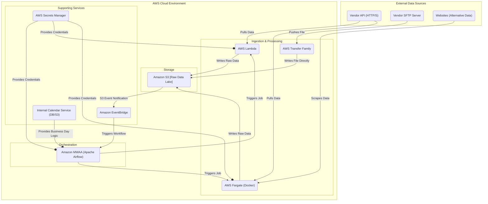

You are the head of Data Engineering at a budding international hedge fund. We want to start automating things. Starting with our jobs that extract data from various sources (http, sftp, websites, file drops, etc). Obviously vendors will vary, the delivery times will differ, there are so many variables (I want you to mention these variables in your response, be comprehensive).

We will be using AWS because we can get a significant number of free credits for MWAA, so I'd like to work around that. But we you're welcome to incorporate other AWS technologies. The only part im interested in right now is the extraction/fetching of data from outside sources, and dropping that raw data into S3, support various calendars and stuff.

Do you think a calendar service is warranted?

---

Excellent initiative. Automating our data extraction processes is a foundational step toward building a scalable and efficient data-driven investment strategy. As you've noted, leveraging our AWS credits for MWAA is a smart move, and it provides a robust foundation for what we need to build.

Here is my breakdown of the landscape, the variables we need to manage, a proposed architecture for our extraction layer, and my thoughts on the calendar service.

### The Complexities and Variables in Our Data Extraction World

Our success hinges on our ability to reliably and efficiently handle a wide array of variables from our data vendors and sources. A comprehensive extraction system must account for the following:

*   **Data Sources & Protocols**: We will be ingesting data from a multitude of endpoints.
    *   **APIs/HTTP(S)**: Data from vendors, typically in RESTful or SOAP APIs, requiring handling of various authentication methods (API keys, OAuth2).
    *   **SFTP Servers**: A common method for receiving bulk data files from established financial data providers.
    *   **Websites**: We will need to perform web scraping for alternative data, which presents its own challenges like anti-bot measures and dynamic JavaScript-based sites.
    *   **File Drops**: Direct placement of files into cloud storage or other designated locations.
    *   **Email Attachments**: A surprisingly common, though not ideal, delivery method for reports.
    *   **Streaming Data**: For real-time market data, we'll encounter sources via protocols like WebSocket or dedicated streaming platforms.

*   **Data Characteristics**: The nature of the data itself is highly variable.
    *   **Structure**: We'll see everything from highly structured CSVs and database dumps to semi-structured JSON/XML, and completely unstructured data like PDFs, news articles, and social media posts.
    *   **Format**: We must be prepared for CSV, TSV, JSON, XML, Parquet, Excel files, and plain text.
    *   **Volume & Velocity**: Data sizes can range from a few kilobytes to many gigabytes per delivery. The frequency can be anything from daily batches to real-time streams.
    *   **Data Quality**: Raw data is often not clean. While our immediate goal is to land it "as-is" in S3, we need to be mindful of potential upstream quality issues that will affect downstream processing.

*   **Vendor and Delivery Variables**: Each vendor has its own quirks.
    *   **Delivery Schedules**: Timetables can be fixed (e.g., daily at 5:00 PM EST), ad-hoc, or event-driven.
    *   **Time Zones**: Our international nature means we'll be dealing with vendors and market data across multiple time zones, which is critical for accurate timestamping.
    *   **Connectivity & Security**: We'll need to manage a variety of security protocols, including IP whitelisting, SSH keys for SFTP, and secure credential storage for APIs.
    *   **Reliability**: Vendor APIs can go down, SFTP servers can be unavailable, and file deliveries can be late or corrupted. Our system must be resilient to these failures.

*   **Compliance and Legal**: We must navigate a complex regulatory landscape.
    *   **Data Sourcing**: Ensuring our web scraping and alternative data sourcing methods are ethical and legal is paramount.
    *   **Data Privacy**: Regulations like GDPR must be adhered to, especially when dealing with any data that could be considered personal.

### Proposed AWS Architecture for Extraction

Given these complexities, I propose a flexible and scalable architecture centered around Amazon MWAA for orchestration and Amazon S3 as our raw data lake.



### How to Read This Diagram:

1.  **External Sources (Left)**: This is where our data originates from—APIs, SFTP servers, and websites we need to scrape.
2.  **Orchestration (Center)**: **Amazon MWAA** is the brain of the operation. It uses our custom **Calendar Service** to know *when* to run jobs (e.g., only on NYSE trading days).
3.  **Ingestion & Processing (Middle)**: Based on MWAA's schedule, specific jobs are triggered:
    *   **AWS Lambda** is used for simple, quick tasks like hitting a vendor API.
    *   **AWS Fargate** is used for more intensive, long-running tasks like complex web scraping.
    *   **AWS Transfer Family** provides a dedicated, managed SFTP endpoint for vendors to drop files into.
4.  **Storage (Right)**: All roads lead to **Amazon S3**, our central raw data lake where the unmodified data is landed.
5.  **Supporting Services**:
    *   **Secrets Manager** securely provides credentials (API keys, passwords) to the services that need them, so we never hardcode sensitive information.
    *   **EventBridge** enables an event-driven flow. As shown in the "SFTP Specific Flow," a new file arriving in S3 from a vendor can automatically trigger a processing workflow in MWAA, rather than waiting for a scheduled time.

1.  **Amazon S3 (Simple Storage Service)**: This will be the landing zone for all raw data. It's cost-effective, scalable, and serves as the foundation for our data lake. We'll establish a clear directory structure to organize data by source, date, and data type.

2.  **Amazon MWAA (Managed Workflows for Apache Airflow)**: This is the core of our automation and orchestration. We will define our extraction jobs as Directed Acyclic Graphs (DAGs). MWAA allows us to programmatically author, schedule, and monitor these complex workflows. It's perfect for handling dependencies (e.g., "don't fetch dataset B until dataset A has arrived") and retries.

3.  **Data Ingestion Services**: We'll use a variety of services to get data into S3, triggered and managed by MWAA:
    *   **AWS Transfer Family**: For our SFTP needs, this service provides a fully managed SFTP endpoint that writes files directly into a designated S3 bucket. This is highly secure and removes the need for us to manage our own SFTP servers.
    *   **AWS Lambda**: For simple, event-driven tasks like fetching data from a REST API on a schedule. Lambda is serverless, cost-effective for short-running jobs, and integrates seamlessly with other AWS services.
    *   **AWS Fargate (with Docker)**: For more complex or long-running tasks, especially web scraping. We can package our scraping scripts (e.g., using Python with Scrapy or Selenium) into Docker containers and run them on Fargate. This approach provides isolation, manages dependencies cleanly, and allows for scalable, serverless execution.
    *   **Amazon EventBridge**: This will be our event bus, used to trigger workflows. For instance, when a vendor drops a file in an S3 bucket via AWS Transfer Family, an S3 event can trigger an EventBridge rule, which in turn could start our MWAA workflow for that data source.

4.  **Security and Management**:
    *   **AWS Secrets Manager**: We will use this service to store all sensitive information like API keys, database credentials, and SFTP passwords. Our MWAA environment and Lambda functions will securely retrieve these secrets at runtime, avoiding any hardcoded credentials.
    *   **AWS IAM (Identity and Access Management)**: We will enforce the principle of least privilege, ensuring that each service and job only has access to the specific resources it needs.

### Is a Calendar Service Warranted?

**Absolutely, yes.** Relying on standard cron-based scheduling (e.g., "run every day at 8 AM") is insufficient and will quickly lead to problems. The financial world does not operate on a simple Gregorian calendar.

Here’s why we need a dedicated "Calendar Service":

*   **Trading Calendars**: Different exchanges (NYSE, LSE, JPX) have different trading days and holidays. A job intended to fetch end-of-day pricing data for the Tokyo Stock Exchange should not run on a Japanese public holiday.
*   **Business Day Logic**: Many financial processes are based on business days. For example, a delivery might be specified as "T+2" (two business days after the trade date). Calculating this requires knowledge of weekends and relevant public holidays.
*   **Fiscal Calendars**: Corporate financial reporting often uses non-standard calendars like 4-5-4 or 4-4-5 weeks per quarter. To analyze this data correctly, our system must understand these custom period endings.

**My recommendation is to build a simple, internal calendar service.** This doesn't need to be overly complex initially. It could be a set of tables in a relational database (like Amazon Aurora Serverless) or even version-controlled CSV/Parquet files in S3. This "service" would store information about:

*   Holiday schedules for each relevant exchange/country.
*   The start and end dates for non-standard fiscal periods.

Our MWAA DAGs would then be designed to query this service as a first step. For example, a DAG could be scheduled to run every calendar day, but its first task would be to check, "Is today a trading day for the NYSE according to our calendar service?". If the answer is no, the DAG gracefully stops. If yes, it proceeds with the data extraction. This approach gives us enormous flexibility and centralizes our business logic for scheduling.

By adopting this comprehensive and robust approach, we will build a scalable and resilient data extraction platform that can effectively support the fund's growth and evolving data needs.

## Airflow Timetable vs Calendar Service

Excellent question. This gets to the heart of a crucial architectural decision: **separating scheduling from business logic.**

While Airflow Timetables are a powerful and flexible feature, relying on them *exclusively* for our financial scheduling would tightly couple our business logic to the orchestration tool, creating significant limitations down the road.

My argument for an internal, queryable calendar service boils down to one core principle: **An Airflow Timetable answers "When should this job *run*?", while a Calendar Service answers "Is today a valid *business date* for this specific process?"** These are not the same question.

Here is a detailed comparison:

---

### The Case for Airflow Timetables (What They Are Good At)

Airflow Timetables are custom schedulers written in Python, defined within a DAG file. They are excellent for schedules that are complex from a *timing* perspective but are self-contained.

*   **Good for:**
    *   Running a job only on the last weekday of the month.
    *   Running a job twice a day, but only on Tuesdays and Thursdays.
    *   Running a job every 4 hours, but skipping the 2 AM run.

The logic is defined in Python code and lives with the DAG. For simple scheduling needs, this is perfectly adequate.

---

### The Argument for an Internal Calendar Service (Why We Need More)

For a hedge fund, a "date" is not just a point in time; it's a piece of business context. Our logic needs to be centralized, queryable, auditable, and accessible beyond a single DAG's Python code.

Here’s a breakdown of the key advantages of a dedicated service:

#### 1. Separation of Concerns & Single Source of Truth

*   **The Problem with Timetables:** Imagine we have 20 DAGs that all depend on the NYSE trading calendar. If a new, unexpected holiday is announced (e.g., for a national day of mourning), we would need to find and update the Python code for all 20 Timetables. This is inefficient and error-prone.
*   **The Calendar Service Solution:** We have a single `nyse_trading_calendar` table in our service. We update one record in that table. Instantly, all 20 DAGs, and any other application that queries the service, have the correct, up-to-date information. **It establishes a single, undisputed source of truth for business dates.**

#### 2. Enables Complex Business Logic Beyond "When to Run"

*   **The Problem with Timetables:** A timetable can tell you if today is a trading day. It *cannot* easily answer questions essential for financial processing, such as:
    *   "What was the previous trading day (T-1)?"
    *   "What is the settlement date for a trade executed today (T+2)?"
    *   "How many trading days were there in the last fiscal quarter?"
    *   "Was July 4th, 2018 a trading holiday?"
*   **The Calendar Service Solution:** Since the service is essentially a queryable database (or a set of structured files in S3), these questions become simple SQL queries or function calls. Our processing jobs can ask the service for this critical context at runtime, which is impossible with a forward-looking timetable.

#### 3. Critical for Historical Analysis and Backfills

*   **The Problem with Timetables:** Timetables are designed to determine the *next* run date. They have no concept of the past. If you need to backfill data for "every trading day in Q2 2021," you can't ask the timetable for that list of dates. You'd have to manually figure out those dates and trigger each backfill individually.
*   **The Calendar Service Solution:** This is a killer feature. With a calendar service, a backfill process becomes trivial. The script would simply query the service: `SELECT calendar_date FROM nyse_trading_calendar WHERE calendar_date BETWEEN '2021-04-01' AND '2021-06-30' AND is_trading_day = TRUE`. This list of dates is then fed into Airflow to programmatically create the backfill runs.

#### 4. Auditability and Accessibility

*   **The Problem with Timetables:** Business logic is hidden inside Python code in a Git repository. To know why a job didn't run, an analyst or a compliance officer would need someone to look at the code. Changing the logic requires a code deployment.
*   **The Calendar Service Solution:** The calendar logic is stored as *data*. It can be easily viewed and queried by non-engineers (e.g., a portfolio manager, a compliance analyst). Changes to the calendar are changes to data, which can be logged and audited in a much more straightforward way.

### Summary Table

| Feature | Airflow Timetable | Internal Calendar Service |
| :--- | :--- | :--- |
| **Primary Purpose** | Orchestration Scheduling | Centralized Business Logic |
| **Centralization** | Decentralized (per-DAG) | Centralized (Single Source of Truth) |
| **Logic Type** | Timing & Scheduling | Business Context & Date Calculation |
| **Historical Queries**| Not supported | Natively supported & critical function |
| **Ease of Update** | Requires code deployment | Requires a data update (in one place) |
| **Use Case** | When should I *trigger* the workflow? | Should this workflow *proceed*? What was T-2? |
| **Accessibility** | Limited to developers | Accessible to all systems, analysts |

### The "Best of Both Worlds" Implementation

My recommendation is not to completely abandon Airflow's scheduling, but to use the two tools together for what they do best:

1.  **Use a Simple Airflow Schedule/Timetable:** Schedule the DAG to *trigger* daily (`schedule='@daily'`). This is the "wake-up" call.
2.  **The First Task is a "Gate":** The very first task in the DAG (`should_run_today_sensor`) calls our internal Calendar Service and asks, "Is today a valid trading day for this process?"
3.  **Conditional Flow:**
    *   If the service returns `True`, the main pipeline proceeds.
    *   If the service returns `False`, the DAG stops gracefully and is marked as successful (as it did its job correctly on a non-business day).

This pattern gives us the reliability of Airflow's scheduling engine while centralizing all our complex, critical, and reusable financial date logic in a robust, auditable, and independent service.

## Calendar Service - How it works

Of course. Let's design the Calendar Service from the ground up, covering its core principles, data model, the code to generate the data, and how it would be used within an Airflow DAG.

### Core Principle: Calendars as Data, Not Code

The fundamental design is to treat financial calendars as a set of structured, queryable **data assets** rather than imperative code logic hidden inside a Python script. This makes our business logic explicit, auditable, and easily accessible.

We will architect this service with two main components:

1.  **The Storage & Generation Layer**: A reliable process for creating and storing our calendar data in a centralized location. We'll use S3 for this, aligning with our data lake strategy.
2.  **The Access & Client Layer**: A simple, reusable Python class that our applications (especially Airflow) can use to query this data without knowing the underlying storage details.

---

### 1. The Storage & Generation Layer

#### Data Model

We'll store our calendar data in a Parquet file for each calendar (e.g., `NYSE.parquet`, `LSE.parquet`). Parquet is highly efficient and a best practice for data lake storage. Each file will contain the following columns:

| Column Name | Data Type | Description | Example |
| :--- | :--- | :--- | :--- |
| `calendar_date` | `date` | The specific calendar date. This is the primary index. | `2025-12-25` |
| `day_of_week` | `integer` | Day of the week (0=Mon, 6=Sun). Useful for checks. | `3` (Thursday) |
| `is_trading_day`| `boolean` | `True` if the market is open, `False` otherwise. | `False` |
| `holiday_name` | `string` | The official name of the holiday if it is one. `NULL` if not. | `Christmas Day` |
| `t_minus_1_date`| `date` | The previous trading day. `NULL` if none exists. | `2025-12-24` |
| `t_plus_1_date` | `date` | The next trading day. `NULL` if none exists. | `2025-12-26` |
| `t_plus_2_date` | `date` | The standard settlement date (T+2). `NULL` if none exists.| `2025-12-29` |

**Pre-calculating** the `T-1`, `T+1`, and `T+2` dates is a key design choice. It makes lookups for these common operations incredibly fast (a simple row lookup) instead of a complex calculation at runtime.

#### S3 Storage Structure

We will store these files in a well-defined S3 path, partitioned by the calendar code:

```
s3://our-fund-data-lake/reference/calendars/
├── calendar_code=NYSE/
│   └── calendar_data.parquet
├── calendar_code=LSE/
│   └── calendar_data.parquet
└── calendar_code=US_BOND/
    └── calendar_data.parquet
```

#### The Generator Script (Python)

This standalone Python script would be run periodically (e.g., once a year or ad-hoc when schedules change) to generate the calendar files. It would be part of a separate administrative project, likely run via a simple CI/CD pipeline.

We'll use the excellent `pandas_market_calendars` library, which handles most of the heavy lifting for holidays.

```python
# file: generate_calendar_files.py

import pandas as pd
import pandas_market_calendars as mcal
import boto3
from pathlib import Path

# --- Configuration ---
CALENDARS_TO_GENERATE = ['NYSE', 'LSE']
START_DATE = '2020-01-01'
END_DATE = '2040-12-31'
S3_BUCKET = 'our-fund-data-lake'
S3_PREFIX = 'reference/calendars'
OUTPUT_DIR = Path('./calendar_build')

def create_calendar_dataframe(calendar_name: str) -> pd.DataFrame:
    """
    Generates a detailed financial calendar DataFrame for a given market.
    """
    print(f"Generating calendar for {calendar_name}...")
    
    # 1. Get official trading calendar and holidays
    cal = mcal.get_calendar(calendar_name)
    schedule = cal.schedule(start_date=START_DATE, end_date=END_DATE)
    holidays = cal.holidays().holidays # Returns a DatetimeIndex of holidays
    
    # 2. Create a full date range
    all_days = pd.date_range(start=START_DATE, end=END_DATE, name='calendar_date')
    df = pd.DataFrame(index=all_days)

    # 3. Add core columns
    df['day_of_week'] = df.index.dayofweek
    df['holiday_name'] = df.index.to_series().map(mcal.holidays_by_name(holidays))
    
    # 4. Determine trading days
    # A day is a trading day if it's in the schedule's index AND not a holiday
    trading_days_index = schedule.index.difference(holidays)
    df['is_trading_day'] = df.index.isin(trading_days_index)
    
    # 5. Pre-calculate T+n / T-n dates (the key feature!)
    trading_days = df[df['is_trading_day']].index.to_series()
    
    t_minus_1_map = pd.Series(trading_days.shift(1).values, index=trading_days.values)
    t_plus_1_map = pd.Series(trading_days.shift(-1).values, index=trading_days.values)
    t_plus_2_map = pd.Series(trading_days.shift(-2).values, index=trading_days.values)
    
    df['t_minus_1_date'] = df.index.map(t_minus_1_map)
    df['t_plus_1_date'] = df.index.map(t_plus_1_map)
    df['t_plus_2_date'] = df.index.map(t_plus_2_map)

    return df.reset_index()


def main():
    """Main script to generate and upload calendar files."""
    OUTPUT_DIR.mkdir(parents=True, exist_ok=True)
    s3_client = boto3.client('s3')

    for calendar_name in CALENDARS_TO_GENERATE:
        calendar_df = create_calendar_dataframe(calendar_name)
        
        # Save locally first
        local_path = OUTPUT_DIR / f"{calendar_name}.parquet"
        calendar_df.to_parquet(local_path, engine='pyarrow')
        
        # Upload to S3 with partitioning
        s3_key = f"{S3_PREFIX}/calendar_code={calendar_name}/calendar_data.parquet"
        print(f"Uploading {local_path} to s3://{S3_BUCKET}/{s3_key}")
        s3_client.upload_file(str(local_path), S3_BUCKET, s3_key)

if __name__ == '__main__':
    main()
```

---

### 2. The Access & Client Layer

This is a simple Python class that our Airflow DAGs will import and use. It abstracts away the S3 and Pandas logic, providing clean, high-level business methods.

```python
# file: common/calendars.py (place this in your Airflow include/dags folder or a shared library)

import pandas as pd
from datetime import date, timedelta
from functools import lru_cache
from typing import List

# This client provides a clean interface to the calendar data stored in S3.
class FinancialCalendarClient:
    """
    Client to query financial calendar data stored in the S3 data lake.
    
    Caches the full calendar data in memory after the first access for performance.
    """
    def __init__(self, calendar_code: str, s3_bucket: str = 'our-fund-data-lake'):
        self.calendar_code = calendar_code.upper()
        self.s3_path = (
            f"s3://{s3_bucket}/reference/calendars/"
            f"calendar_code={self.calendar_code}/calendar_data.parquet"
        )
        # _df is private; access is through public methods
        self._df = None 

    @lru_cache(maxsize=1) # Simple in-memory cache
    def _load_data(self) -> pd.DataFrame:
        """Loads data from S3 into a pandas DataFrame, indexed by date."""
        print(f"Loading calendar data for {self.calendar_code} from {self.s3_path}...")
        df = pd.read_parquet(self.s3_path)
        df['calendar_date'] = pd.to_datetime(df['calendar_date']).dt.date
        df = df.set_index('calendar_date')
        return df

    @property
    def data(self) -> pd.DataFrame:
        """Property to lazily load data on first access."""
        if self._df is None:
            self._df = self._load_data()
        return self._df
        
    def _get_date_row(self, target_date: date):
        """Helper to get a row for a specific date."""
        try:
            return self.data.loc[target_date]
        except KeyError:
            raise ValueError(f"Date {target_date} not found in {self.calendar_code} calendar.")

    def is_trading_day(self, target_date: date) -> bool:
        """Checks if a given date is a trading day."""
        return self._get_date_row(target_date)['is_trading_day']

    def get_previous_trading_day(self, target_date: date) -> date:
        """Returns the previous trading day (T-1)."""
        result = self._get_date_row(target_date)['t_minus_1_date']
        return pd.to_datetime(result).date() if pd.notna(result) else None

    def get_settlement_day(self, target_date: date, offset: int = 2) -> date:
        """Returns the settlement day for a given trade date (T+2 default)."""
        if offset != 2:
            # For simplicity, this example only implements the pre-calculated T+2
            raise NotImplementedError("Only T+2 settlement is pre-calculated.")
        result = self._get_date_row(target_date)['t_plus_2_date']
        return pd.to_datetime(result).date() if pd.notna(result) else None
        
    def get_trading_days_for_period(self, start_date: date, end_date: date) -> List[date]:
        """Returns a list of all trading days within a date range (inclusive)."""
        mask = (self.data.index >= start_date) & (self.data.index <= end_date) & (self.data['is_trading_day'])
        return self.data[mask].index.tolist()

```

### 3. Usage in an Airflow DAG

Here is how you would use the `FinancialCalendarClient` in a DAG to implement the "gate" pattern.

```python
# file: dags/eod_pricing_dag.py

from __future__ import annotations
import pendulum
from airflow.models.dag import DAG
from airflow.operators.empty import EmptyOperator
from airflow.decorators import task

# Assume common/calendars.py is in our python path
from common.calendars import FinancialCalendarClient

# Instantiate the client for the specific market this DAG serves
nyse_calendar = FinancialCalendarClient(calendar_code='NYSE')

with DAG(
    dag_id='nyse_eod_pricing_ingestion',
    start_date=pendulum.datetime(2025, 1, 1, tz="America/New_York"),
    schedule='0 18 * * 1-5', # Run every weekday at 6 PM ET
    catchup=False,
    tags=['pricing', 'ingestion'],
) as dag:
    
    @task.branch(task_id="check_if_trading_day")
    def should_run_today(logical_date) -> str:
        """
        Uses the Calendar Service to check if the DAG should proceed.
        """
        execution_date = logical_date.date()
        print(f"Checking if {execution_date} is an NYSE trading day...")
        
        if nyse_calendar.is_trading_day(execution_date):
            print("Yes, it's a trading day. Proceeding with ingestion.")
            return "run_ingestion_pipeline"
        else:
            print("No, it's a market holiday or weekend. Skipping.")
            return "stop_pipeline_gracefully"

    start = EmptyOperator(task_id="start")
    
    # This is the "gate" task
    check_trading_day = should_run_today(dag.logical_date)

    # If the check returns false, the pipeline stops here
    stop_gracefully = EmptyOperator(task_id="stop_pipeline_gracefully")

    # The actual data processing tasks only run on valid business days
    run_ingestion_pipeline = EmptyOperator(task_id="run_ingestion_pipeline")
    
    # You would build your actual ETL flow after run_ingestion_pipeline
    # Example: fetch_eod_data >> land_to_s3 >> notify_success
    
    start >> check_trading_day
    check_trading_day >> [run_ingestion_pipeline, stop_gracefully]
```

This comprehensive approach provides us with a robust, scalable, and auditable system for managing complex financial schedules that will serve as a cornerstone of our automated data platform.
