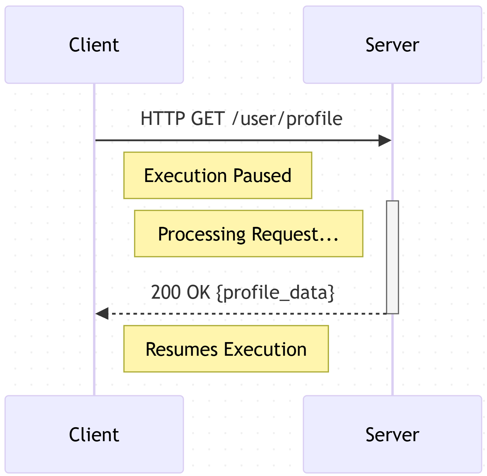
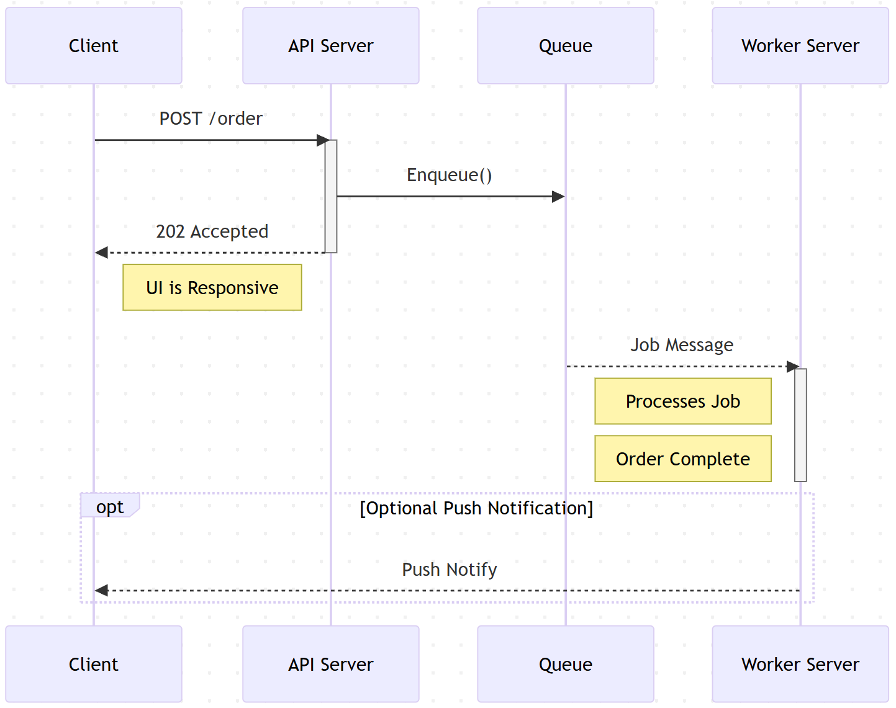

### **Chapter 3: The Front Door: API & Real-Time Communication**

Once you have defined the scope and quantified the load, you are ready to design the "front door" of your system. This is the entry point through which all external clients—be they mobile apps, web browsers, or other services—interact with your architecture. The design of this interface is critical, as it dictates the fundamental communication patterns and contracts for the entire ecosystem.

The choices made here are not just about syntax (e.g., JSON vs. XML) or naming conventions. They are about fundamental models of interaction that have profound downstream effects on scalability, user experience, and system complexity. The first and most elemental of these choices is deciding between synchronous request/response and asynchronous communication.

---

### **3.1 Request/Response vs. Asynchronous Communication**

At the heart of all distributed systems lies a conversation. A client needs something from a server. The way this conversation happens is the system's most basic interaction pattern. Understanding the two primary models—the direct phone call versus the posted letter—is essential.

#### **The Synchronous Model: The Phone Call (Request/Response)**

This is the simplest and most intuitive model of communication. It is defined by a simple, powerful contract: the client sends a request and *waits*, blocking its own execution until it receives a response from the server.

**How it Works:**
1.  **Client sends a request:** A mobile app asks `/api/v1/user/profile`.
2.  **Client blocks:** The app’s UI might show a loading spinner. The thread making the request is effectively paused, unable to do anything else.
3.  **Server processes:** The server receives the request, queries the database, formats the data.
4.  **Server sends a response:** The server returns a `200 OK` with the user's profile data.
5.  **Client unblocks:** The client receives the response and continues its execution, rendering the profile on the screen.



**Properties:**
*   **Simplicity:** The logic is straightforward and easy to reason about for both client and server.
*   **Immediate Feedback:** The user receives an immediate success or failure. The state is unambiguous.
*   **Tight Coupling:** The client and server are coupled in time. The server *must* be available for the client to proceed. If the server is slow, the client is slow.

**When to Use It:**
Use the request/response model when the client *needs an immediate answer* to continue its work.
*   **Reading data for display:** Fetching a user profile, loading a product page, retrieving ride history.
*   **Validating user input:** Checking if a username is already taken during signup.
*   **Simple, fast writes:** Updating a user's name or logging into the system.

#### **The Asynchronous Model: The Posted Letter (Fire-and-Forget)**

In this model, the client sends a request and *does not wait* for the work to be completed. It only waits for a quick acknowledgment that the request has been *accepted*. The actual processing happens later, decoupled from the initial interaction. This is almost always facilitated by an intermediary component like a message queue or a commit log.

**How it Works:**
1.  **Client sends a request:** An e-commerce app asks `/api/v1/orders`.
2.  **Server accepts:** The server does minimal validation, creates a job, places it in a Kafka topic or a RabbitMQ queue, and *immediately* returns a `202 Accepted` response.
3.  **Client unblocks:** The client receives the `202` and is free. It can render an "Order Pending" screen. The user experience feels instantaneous.
4.  **A separate worker processes:** A pool of background servers consumes jobs from the queue. They process the payment, update inventory, notify shipping—a process that could take several seconds.
5.  **Server sends a notification (optional):** Once the work is truly done, the server can use a separate channel (like a push notification or WebSocket) to update the client.



**Properties:**
*   **Resilience & Durability:** If the worker server is down, the job waits safely in the queue. The system can tolerate downstream failures.
*   **Scalability:** The client-facing API servers and the backend workers can be scaled independently, matching resources to the specific workload.
*   **Improved User Experience:** The application feels faster because the user isn't blocked waiting for a long-running process to complete.
*   **Complexity:** This model introduces more moving parts (the message queue, worker services) and leads to an eventually consistent state, which can be harder to reason about.

#### **The Decision Framework**

For any feature you are designing, ask these questions to decide on the communication pattern:

1.  **Does the client need the result *now* to render the next UI state?**
    *   **Yes:** → Request/Response (e.g., getting user settings before displaying the settings page).
    *   **No:** → Asynchronous (e.g., uploading a video; the UI can show "Processing...").

2.  **Is the work long-running (>500ms), computationally expensive, or reliant on slow third-party services?**
    *   **Yes:** → Asynchronous (e.g., processing a payment that involves calling an external gateway). Forcing a user to wait more than a second is a poor experience.
    *   **No:** → Request/Response (e.g., updating a user's display name).

3.  **Is it critical that the operation succeeds even if a downstream service fails?**
    *   **Yes:** → Asynchronous. A message queue provides a durable buffer that protects against transient failures.
    *   **No:** → Request/Response. If fetching a product description fails, the client can simply retry.

By consciously choosing the right pattern for each feature, you demonstrate a deep understanding of the trade-offs between simplicity, user experience, and system resilience.

### **3.2 Choosing Your API Style: REST, gRPC, GraphQL**

Once you've decided on the interaction pattern (synchronous vs. asynchronous), the next step is to choose the specific syntax and protocol for your synchronous APIs. This is the contract that defines how data is requested and shaped. In the modern architectural landscape, three styles dominate the conversation: REST, gRPC, and GraphQL.

They are not interchangeable. Each is a tool optimized for a different set of problems. Choosing the right one is a powerful signal that you understand the nuanced trade-offs between performance, flexibility, and simplicity.

#### **REST (Representational State Transfer): The Lingua Franca**

REST is not a strict protocol but an architectural style that has become the de facto standard for public-facing web APIs. It leverages the existing semantics of HTTP to perform operations on "resources."

*   **How it Works:** It uses standard HTTP verbs (GET, POST, PUT, DELETE) to represent actions and URLs (Uniform Resource Locators) to represent resources. For example, to get a user's data, you would make a `GET` request to `/users/123`. Data is typically exchanged in a human-readable format like JSON.

    ```
    // Client requests a specific user's posts
    GET /users/123/posts
    Host: api.example.com

    // Server responds with the full resource representation
    HTTP/1.1 200 OK
    Content-Type: application/json

    [
      {
        "postId": "p1",
        "title": "First Post",
        "content": "...",
        "authorId": "123"
      },
      {
        "postId": "p2",
        "title": "Second Post",
        "content": "...",
        "authorId": "123"
      }
    ]
    ```

*   **Key Properties:**
    *   **Simplicity & Ubiquity:** It's built on standard HTTP, making it universally understood and easy to use with any client (`curl`, browsers).
    *   **Statelessness:** Each request contains all the information needed to process it, which makes scaling horizontally straightforward.
    *   **Standard Caching:** HTTP caching mechanisms work out of the box. A `GET` to `/users/123` can be easily cached by URL.

*   **Pain Points:**
    *   **Over-fetching:** The server defines the resource shape. If a client only needs the `title` of each post, it still receives the full `content` and `authorId`, wasting bandwidth.
    *   **Under-fetching (The N+1 Problem):** The initial request returns a list of posts. To display the author's name for each post, the client must then make *N* additional requests (`GET /users/{authorId}`). This chattiness kills performance, especially on mobile networks.
    *   **Weak Contract:** The relationship between endpoints and data schemas is based on convention, not enforcement. An API can break if the server changes a field name without warning. (Tools like OpenAPI/Swagger help mitigate this but aren't inherent to the style.)

#### **gRPC: The High-Performance Workhorse**

gRPC is a modern Remote Procedure Call (RPC) framework developed by Google. Instead of thinking in terms of resources and verbs, you think in terms of calling functions on a remote service. It is designed for high-performance, internal microservice-to-microservice communication.

*   **How it Works:** It uses **HTTP/2** for transport, enabling multiplexing of many requests over a single connection. Its key innovation is **Protocol Buffers (Protobuf)**, a language-agnostic, binary serialization format. You define the service "contract" (available functions and data structures) in a `.proto` file, from which gRPC automatically generates strongly-typed client and server code in multiple languages.

    ```protobuf
    // posts.proto
    service PostService {
      rpc GetPostsForUser(UserRequest) returns (PostList) {}
    }

    message UserRequest {
      string user_id = 1;
    }
    // ... other message definitions
    ```

*   **Key Properties:**
    *   **Extreme Performance:** The combination of binary Protobuf (which is smaller and faster to parse than JSON) and the efficiencies of HTTP/2 makes it significantly faster than REST.
    *   **Strongly-Typed Contract:** The `.proto` file is the single source of truth. It's impossible for a client and server to disagree on the API shape, eliminating an entire class of integration errors.
    *   **Streaming:** HTTP/2 support enables bi-directional streaming, allowing for advanced use cases like real-time data flow that are cumbersome with REST.

*   **Pain Points:**
    *   **Limited Browser Support:** gRPC is not directly supported by web browsers. It requires a proxy layer (like gRPC-Web) to translate requests.
    *   **Not Human-Readable:** The binary format makes debugging with simple tools like `curl` difficult without plugins or proxies.

#### **GraphQL: The Flexibility Champion**

GraphQL is a query language for your API, developed by Facebook. It addresses REST's over-fetching and under-fetching problems head-on by giving the client precise control over the data it needs.

*   **How it Works:** It exposes a single endpoint (e.g., `/graphql`). The client sends a "query" that describes the exact shape of the data it requires, including nested relationships. The server then responds with a JSON object that precisely matches the query's shape.

    ```graphql
    # Client sends a query in the POST body
    query {
      user(id: "123") {
        posts {
          title      # Only request the title
          author {   # And fetch the author's name in the same request
            name
          }
        }
      }
    }
    ```

*   **Key Properties:**
    *   **Efficient Data Loading:** It completely eliminates over-fetching and under-fetching. Clients get exactly what they ask for in a single round trip.
    *   **Strongly-Typed Schema:** Like gRPC, GraphQL is built around a strong schema (the Schema Definition Language, or SDL), providing a self-documenting and reliable contract.
    *   **Evolvable API:** Front-end clients can add new data requirements without needing backend changes (as long as the data is available in the schema). This is ideal for fast-moving product teams.

*   **Pain Points:**
    *   **Server-Side Complexity:** Implementing a GraphQL server is more complex than a REST API. You must write "resolver" logic for every field in your schema.
    *   **Complex Caching:** Since there is only one endpoint, standard HTTP caching by URL is ineffective. Caching requires more sophisticated client-side and server-side solutions.
    *   **Potential for Abuse:** Clients can craft extremely complex queries that could overload the database. Mitigation requires query depth limiting, cost analysis, and timeout enforcement.

### **The Decision Framework: Which Style to Choose?**

In an interview, you demonstrate seniority by choosing the right tool for the job.

*   **Choose REST When:**
    *   You need a public-facing API that is easily consumed by a wide variety of clients.
    *   Your data model is simple and resource-oriented (e.g., a simple CRUD service).
    *   Simplicity of implementation and standard tooling are a priority.
    *   **The Go-To Answer:** For simple, public APIs, REST is the pragmatic default.

*   **Choose gRPC When:**
    *   You are building a network of **internal microservices** where performance is paramount.
    *   You need to handle high-throughput, low-latency communication.
    *   You need streaming capabilities.
    *   **The Go-To Answer:** For east-west traffic between backend services.

*   **Choose GraphQL When:**
    *   You have a diverse set of clients (e.g., mobile apps, web apps) with varying data needs.
    *   Your application has a complex, graph-like data model (e.g., a social network).
    *   You want to empower front-end teams to iterate quickly without backend dependencies.
    *   **The Go-To Answer:** For client-facing APIs with complex data and evolving UIs.

The most advanced answer is often a **Hybrid Approach**. A common, powerful pattern is to use high-performance **gRPC** for all internal microservice communication and then expose an **API Gateway** to the public. This gateway can translate requests from the outside world into gRPC calls, offering a public **GraphQL** or **REST** interface for external clients to consume. This gives you the best of both worlds: internal performance and external flexibility.

### **3.3 Real-Time Patterns: WebSockets, Long Polling, Server-Sent Events**

The standard request/response model is initiated entirely by the client. The server is passive; it can only speak when spoken to. But what happens when the *server* has information for the client that the client doesn't yet know to ask for? This is the domain of real-time communication.

For many modern applications—a chat message appearing, a driver's location updating on a map, a new post appearing in a social media feed—the user expects to see new information instantly, without hitting a "refresh" button. The server must be able to *push* data to the client.

Let's explore the primary patterns for achieving this, starting with the simplest hack and moving to the most powerful, purpose-built solutions.

#### **Short Polling: The Brute-Force Method**

This is the most primitive form of real-time simulation. The client repeatedly sends a request to the server at a fixed interval to ask, "Is there anything new?"

*   **How it Works:**
    1.  Client sends `GET /updates`.
    2.  Server immediately responds, either with new data or an empty response.
    3.  Client waits for a fixed interval (e.g., 2 seconds).
    4.  Repeat Step 1.
*   **Analogy:** A child in the back of a car asking "Are we there yet?" every thirty seconds for the entire trip.
*   **Properties:**
    *   **Pro:** Extremely simple to implement on any platform.
    *   **Con:** High Latency. On average, the delay for receiving an update is `polling_interval / 2`.
    *   **Con:** Wildly Inefficient. The vast majority of requests are wasted, returning no new data but still incurring the full overhead of an HTTP request/response cycle (TCP connection setup, HTTP headers).
*   **When to Use:** Almost never for modern applications. It serves as a useful baseline to understand why more advanced patterns are necessary.

#### **Long Polling: A Smarter Hack**

Long polling is a clever refinement of short polling that reduces latency and inefficiency. Instead of responding immediately, the server holds the client's request open until it actually has new data to send.

*   **How it Works:**
    1.  Client sends `GET /updates`.
    2.  Server does **not** respond immediately. It holds the connection open.
    3.  When a new event occurs on the server, it sends the data in the response to the waiting client and closes the connection.
    4.  The client receives the data and immediately initiates a new request (repeats Step 1).
    5.  If no event occurs for a long time, the server will time out and send an empty response, at which point the client immediately reconnects.
*   **Analogy:** Asking "Are we there yet?" once, with the parent promising they will only answer the very moment you arrive. Once they answer, you immediately ask again.
*   **Properties:**
    *   **Pro:** Significantly lower latency than short polling. Data is sent almost as soon as it's available.
    *   **Pro:** Reduces wasteful "empty" responses.
    *   **Con:** Still has the overhead of establishing a new connection for every event.
    *   **Con:** Can be complex to implement on the server, requiring management of hanging requests and timeouts.
*   **When to Use:** As a fallback mechanism when WebSockets are unsupported by a client or blocked by a corporate firewall. It's a proven, durable hack on top of HTTP/1.1.

#### **Server-Sent Events (SSE): The One-Way Broadcast**

SSE is a modern web standard specifically designed for servers to push a continuous stream of events to a client over a single, long-lived HTTP connection.

*   **How it Works:**
    1.  The client connects to an endpoint and indicates it wants an event stream (via the `Accept: text/event-stream` header).
    2.  The server holds the connection open and can send messages to the client at any time. The format is a simple, standardized text protocol.
    3.  This is a **one-way** channel: only the server can send data after the initial connection.
*   **Analogy:** A one-way radio broadcast. The radio station (server) sends out news continuously, and your car radio (client) just listens. You can't talk back to the station over the same channel.
*   **Properties:**
    *   **Pro:** Simple and efficient for server-to-client push. Built into most modern browsers with a simple JavaScript API.
    *   **Pro:** Handles reconnection automatically if the connection is dropped.
    *   **Pro:** Works over standard HTTP, making it generally firewall-friendly.
    *   **Con:** Strictly **unidirectional**. The client cannot send messages to the server over the SSE connection itself.
*   **When to Use:** When the communication is one-directional. Ideal for stock tickers, live sports scores, news feeds, or pushing status updates for a background job (e.g., "Video Processing...", "Build Complete!").

#### **WebSockets: The Two-Way Conversation**

WebSockets are the gold standard for true, real-time, bi-directional communication. They provide a single, persistent TCP connection over which both the client and the server can send data at any time.

*   **How it Works:**
    1.  The communication begins as a standard HTTP request with a special `Upgrade: websocket` header.
    2.  If the server agrees, it responds with a `101 Switching Protocols` status code.
    3.  At this point, the initial HTTP connection is "upgraded" and transformed. It is no longer an HTTP connection but a **full-duplex**, raw message-passing channel.
*   **Analogy:** An open, two-way walkie-talkie channel. Either party can speak at any time, and the other will hear them instantly.
*   **Properties:**
    *   **Pro:** Extremely low latency. The lowest possible overhead after the initial handshake.
    *   **Pro:** **Bi-directional**. The client and server are peers and can both initiate communication at will.
    *   **Con:** More resource-intensive on the server. The server must maintain the state for every open WebSocket connection, which can run into the millions. This requires a specific architecture (often called a Connection Gateway layer).
    *   **Con:** Can be blocked by older or stricter firewalls that don't understand the `Upgrade` header.
*   **When to Use:** When you need a true interactive, conversational experience. The canonical use cases are chat applications, multiplayer online games, and collaborative real-time editing tools (like Google Docs or Figma).

### **The Decision Framework**

| Pattern         | Directionality               | Key Benefit                           | Key Drawback                             | Typical Use Case                           |
| --------------- | ---------------------------- | ------------------------------------- | ---------------------------------------- | ------------------------------------------ |
| **Long Polling**  | Server → Client (Simulated)  | Broadest compatibility.               | High connection overhead per message.    | Fallback when WebSockets fail. Legacy apps.  |
| **SSE**           | Server → Client (One-Way)    | Simple, standard, auto-reconnects.    | Unidirectional only.                     | News feeds, status updates, notifications. |
| **WebSockets**    | Client ↔ Server (Two-Way)    | Lowest latency, full-duplex comms.    | Stateful server, more complex to scale.  | Chat, online gaming, collaborative editing.  |