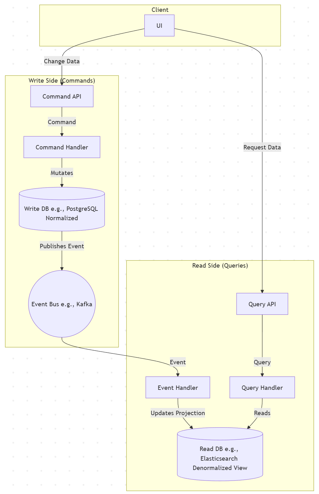

### **Chapter 10: Asynchronism and Decoupling**

In a simple architecture, services communicate directly and synchronously. When Service A needs something from Service B, it makes a request and blocks, waiting for Service B to complete its work and return a response. This synchronous, tightly-coupled model is simple to reason about but is inherently fragile and difficult to scale. It creates a brittle chain where the availability and performance of the entire system are dictated by the availability and performance of its slowest, least reliable component.

This chapter explores architectural patterns that break this chain. By introducing asynchronous communication and decoupling services, we can build systems that are more resilient, more scalable, and better equipped to handle the unpredictable loads of the real world. These patterns are foundational to building modern, cloud-native applications.

---

### **10.1 The Write-Ahead Log (WAL) Pattern for Durability**

The Write-Ahead Log (WAL) is a powerful pattern that provides extreme durability and enables massive write throughput by fundamentally changing when a system performs its work. The core idea is simple: instead of doing complex work immediately upon request, you first write down your *intent* to do the work in a highly reliable, append-only log. Once that intent is durably recorded, you can acknowledge the request as successful. The actual, potentially slow work is then performed later by an asynchronous process that reads from this log.

#### **The Analogy: The Restaurant Kitchen**

Imagine a busy restaurant. The waiter (your API service) doesn't go into the kitchen to cook a meal for every order they take. This would be incredibly inefficient. Instead, they follow a highly optimized workflow:

1.  **Take the Order:** The waiter takes an order from a customer (a client sends a `POST` request).
2.  **Record Intent:** The waiter writes the order down on a ticket and sticks it on a spindle in the kitchen (the service writes a message to a durable log). This spindle is the source of truth for all pending work.
3.  **Acknowledge:** The waiter immediately tells the customer their order has been placed (the service returns `202 Accepted`) and moves on to the next table.
4.  **Asynchronous Processing:** The chefs (the asynchronous worker services) pull tickets from the spindle in order and cook the meals (perform the complex database writes, cache updates, etc.).

This model decouples the fast, high-volume work of "order taking" from the slow, resource-intensive work of "cooking," allowing the restaurant to serve far more customers.

#### **The Architectural Workflow**

The WAL pattern is most commonly implemented in modern systems using a distributed commit log like **Apache Kafka** or **AWS Kinesis**.

Here is the typical request lifecycle:

1.  **Ingestion:** A client sends a `POST /orders` request to the `Order API` service.
2.  **Serialization & Log Append:** Instead of immediately writing to the main `orders` database, the `Order API` service serializes the request payload into a message. It then produces this message to a Kafka topic, let's call it `incoming_orders`. This write is configured to be fully durable, waiting for acknowledgment that the message has been replicated across a quorum of Kafka brokers (`acks=all`).
3.  **Fast Acknowledgment:** As soon as Kafka confirms the message is durably stored, the `Order API` service returns a `202 Accepted` status code to the client. At this moment, the system has made a durable promise that the order *will be* processed, even if the entire fleet of servers were to crash a millisecond later.
4.  **Asynchronous Consumption:** A separate, independent fleet of services, the `Processor Workers`, consumes messages from the `incoming_orders` topic. Each worker pulls a message off the log, deserializes it, and then performs the actual business logic: inserting the data into the primary database, updating inventory counts, invalidating caches, and triggering notifications.

#### **The Benefits of Using a Write-Ahead Log**

*   **Extreme Durability:** This is the primary guarantee. By waiting for the log to confirm the write before acknowledging the client, you ensure that the request is persisted and will survive a system crash.
*   **Massive Write Throughput:** Your front-end API service is no longer constrained by the speed of database writes, index updates, or other complex logic. Its only job is a fast, sequential, append-only write to the log. This allows it to absorb enormous, spiky bursts of traffic without falling over.
*   **Service Decoupling:** The `Order API` (the producer) knows nothing about the `Processor Workers` (the consumers). You can add new consumers (e.g., an `Analytics Service`, a `Fraud Detection Service`) that also read from the same log without making any changes to the producer. Services can be scaled, updated, and fail independently.
*   **Resilience and Replayability:** The log acts as a buffer. If a `Processor Worker` discovers a bug and crashes, the messages remain safely in the log. You can deploy a fix and have the worker resume processing from where it left off. You can even "rewind" a consumer to re-process historical data.

#### **Trade-offs and Considerations**

*   **Increased End-to-End Latency:** The system gains high throughput at the cost of latency. The user gets an immediate `202 Accepted`, but the actual time until their order appears in their "Order History" page (which reads from the main DB) is now longer because of the queuing and asynchronous processing delay.
*   **Asynchronous Complexity:** The application and user interface must now handle an eventual consistency model. You can no longer assume that a successful API call means the data is immediately ready to be read. The UI might need to show a "Processing..." state until the change is fully propagated.
*   **Operational Burden:** You have introduced a new, mission-critical piece of infrastructure (the distributed log). This system must be provisioned, monitored, and scaled with care. It is a powerful but complex tool.

By using the Write-Ahead Log pattern, you make a conscious architectural decision to trade immediate consistency for massive improvements in durability, scalability, and resilience, a hallmark of highly available, large-scale systems.

### **10.2 CQRS (Command Query Responsibility Segregation)**

As systems evolve, a single model for both reading and writing data often becomes a source of significant friction. The way you need to *query* data for a display screen is frequently very different from the way you need to structure and validate data when it is being *changed*. For example, a write operation might require complex business validation and interaction with a normalized relational database, while a read operation might just need a simple, flattened JSON document to populate a user interface.

CQRS is a powerful architectural pattern that resolves this friction by introducing a radical separation: it posits that the model used to update information (the "write side") should be physically and logically separate from the model used to read information (the "read side").

#### **The Analogy: The Public Library**

Consider the operations of a large public library.
*   **The Write Model (Commands):** This is the domain of the librarian and the acquisitions department. The process of acquiring a new book is complex. It involves budgeting, placing an order, receiving the book, validating it, giving it a unique ISBN/Dewey Decimal number, and placing it on a specific, normalized shelf location. This is a slow, careful, transactional process focused on correctness.
*   **The Read Model (Queries):** This is the domain of the public. A patron doesn't care about the acquisition process. They use a simple, fast-lookup system: the card catalog or the online search portal. This system is a denormalized, optimized "view" of the library's contents, designed purely for efficient searching and discovery.

In CQRS, you are intentionally building two separate systems: one optimized for the librarian's "writes" and another optimized for the public's "reads."

#### **The Architectural Components**

CQRS splits a traditional service into two distinct halves:

1.  **The Command Side:** This side handles all state changes.
    *   **Commands:** An object representing an intent to change something. It is imperative and named accordingly (e.g., `CreateUserCommand`, `UpdateShippingAddressCommand`). It encapsulates the data needed to perform the action.
    *   **Command Handler:** A piece of logic that receives a Command and executes the necessary business logic. It orchestrates interactions with the write model. Crucially, a Command Handler **should not return data**. It should only return an acknowledgement of success or failure.
    *   **The Write Model/Database:** A data store optimized for writes. It is often a normalized relational database (like PostgreSQL) to take advantage of transactional integrity, constraints, and ACID guarantees.

2.  **The Query Side:** This side handles all data retrieval.
    *   **Queries:** An object representing a request for information (e.g., `GetUserProfileQuery`, `GetOrderHistoryQuery`).
    *   **Query Handler:** Logic that receives a Query, interacts *only* with the read model, and returns a data object (often a simple DTO - Data Transfer Object). A Query Handler **must not mutate any state**.
    *   **The Read Model/Database:** One or more data stores highly optimized for reads. This is often a denormalized view of the data. You might use Elasticsearch for fast text search, a document database like MongoDB for flexible document retrieval, or a Redis cache for hyper-fast key-value lookups. The data in this model is specifically shaped to fit the application's UI, often pre-joining and pre-aggregating data.

#### **Data Synchronization: The Crucial Link**

The write model and the read model must be kept in sync. This is almost always achieved **asynchronously**. When the Command Handler successfully updates the Write Database, it publishes an **event** (e.g., `UserAddressUpdated`, `OrderPlaced`). This event is published to a message bus (like Kafka or RabbitMQ).

An **event handler** service subscribes to these events. Its sole job is to update the Read Database(s). When it receives a `UserAddressUpdated` event, it updates the user profile document in the read store.

#### **The Benefits of CQRS**

*   **Independent Scaling:** The read and write workloads of a system are often wildly different (e.g., 1000 reads for every 1 write). CQRS allows you to scale your read fleet independently from your write fleet, leading to significant cost savings and performance optimization.
*   **Optimized Data Models:** You can use the perfect database for each job. A normalized SQL database for transactional writes and a denormalized full-text search engine for reads. You are no longer forced to make one data model fit two opposing use cases.
*   **Improved Performance:** Queries are fast because they hit a data model that has been pre-computed and specifically shaped for that query. There are no expensive `JOIN`s or on-the-fly aggregations at read time.
*   **Enhanced Security & Simplicity:** The query side of your application can be designed with no knowledge of or permissions to modify data. The write side's logic is simpler because it only needs to worry about state changes, not how the data will be presented.

#### **Trade-offs and Considerations**

*   **Eventual Consistency:** This is the most significant trade-off. Because the read model is updated asynchronously via events, it is **eventually consistent**. When a user updates their profile, there will be a small window of time where reading their profile will return the old data. The application must be designed to handle this.
*   **Increased Complexity:** CQRS is not for simple CRUD applications. It introduces significant architectural complexity: you now have two data models, multiple services, and a message bus to manage. The code duplication (e.g., separate command and query objects) can seem burdensome for simple use cases.

CQRS is a sophisticated pattern best reserved for complex domains or systems where the performance and scalability requirements justify the added complexity. It is the logical conclusion of separating concerns, applied directly to your system's data access patterns.

### **10.3 Sagas for Distributed Transactions**

In a monolithic system with a single database, multi-step business operations are kept consistent using ACID transactions. You can wrap a series of database operations in a `BEGIN TRANSACTION`...`COMMIT` block. If any step fails, the entire transaction is automatically rolled back, leaving the database in its original state. It's an all-or-nothing guarantee that developers rely on.

In a distributed microservices architecture, this safety net vanishes. A single business process—like placing an e-commerce order—might require state changes across three separate services, each with its own private database:
1.  The **Order Service** must create an order record.
2.  The **Payment Service** must charge the user's credit card.
3.  The **Inventory Service** must decrement the stock for the purchased items.

What happens if steps 1 and 2 succeed, but step 3 fails because an item is out of stock? We are left in an inconsistent state: the customer has been charged for an order that cannot be fulfilled. We need a way to maintain business process consistency across service boundaries. A traditional two-phase commit (2PC) protocol would solve this by creating a global transaction with synchronous locking across all three services, but this is a scalability anti-pattern. It creates tight coupling and poor availability, as a lock in one service halts the entire process.

The Saga pattern is the solution. It is a design pattern for managing data consistency across microservices in the absence of distributed transactions.

#### **The Core Idea: A Sequence of Local Transactions**

A Saga is a sequence of local transactions where each transaction updates the state within a single service. The key principle is this: **if a local transaction fails, the Saga must execute a series of compensating transactions to undo the preceding work.**

Instead of the ACID properties of traditional transactions, Sagas provide the BASE properties: **B**asically **A**vailable, **S**oft state, **E**ventually consistent.

*   A Saga is composed of a series of steps.
*   Each step consists of a **forward action** (a local transaction) and a **compensating action** (another local transaction to undo the forward action).
*   The system guarantees that either all forward actions will complete successfully, or a proper subset of forward and compensating actions will be run, leaving the system in a consistent state.

This "undo" logic is the crux of the Saga pattern. It moves failure recovery from the database transaction manager into your application's business logic.

#### **Implementation Patterns: Choreography vs. Orchestration**

There are two primary ways to coordinate the flow of a Saga.

**1. Choreography: The Event-Driven Approach**

In a choreographed Saga, there is no central coordinator. Each service publishes events that trigger actions in other services.

*   **Analogy:** A dance troupe performing a choreographed routine. Each dancer knows what move to make based on the cue from the previous dancer's action.
*   **Mechanism:**
    1.  The **Order Service** performs its local transaction to create an order and publishes an `OrderCreated` event to a message bus.
    2.  The **Payment Service** listens for `OrderCreated` events. Upon receiving one, it performs its local transaction to charge the user. If successful, it publishes a `PaymentProcessed` event.
    3.  The **Inventory Service** listens for `PaymentProcessed` events. It then performs its local transaction to reserve the inventory.

*   **Handling Failure:** If the **Inventory Service** fails, it publishes an `InventoryReservationFailed` event. The **Payment Service** must listen for this event and trigger its compensating transaction: `refundPayment`. It would then publish a `PaymentRefunded` event, which the **Order Service** would listen for to mark the order as `Failed`.

*   **Pros:** Highly decoupled and simple. Services don't need to know about each other, only about the events they care about. It's easy to add new participants without changing existing services.
*   **Cons:** The business logic is distributed and implicit, making it difficult to track the overall state of a Saga. It's hard to answer "where is Order #123 in its lifecycle?". This can lead to cyclical dependencies and makes debugging a distributed nightmare.

**2. Orchestration: The Command-and-Control Approach**

In an orchestrated Saga, a central coordinator (the Orchestrator) tells the participant services what to do.

*   **Analogy:** An orchestra conductor. The conductor explicitly commands each section (violins, percussion) when to play.
*   **Mechanism:**
    1.  A client request creates an instance of a **Saga Orchestrator**. The orchestrator manages the entire transaction's state.
    2.  The orchestrator sends an explicit `ExecutePayment` command to the **Payment Service**.
    3.  The **Payment Service** performs its work and sends an `PaymentCompleted` event back to the orchestrator.
    4.  The orchestrator, upon receiving the event, updates its state machine and then sends a `ReserveInventory` command to the **Inventory Service**.

*   **Handling Failure:** If the **Inventory Service** replies with an `InventoryFailed` event, the **Orchestrator** knows exactly what to do. Because it holds the state, it knows that the payment has already been processed. It now takes responsibility for remediation and sends an explicit `RefundPayment` command to the **Payment Service**.

*   **Pros:** Centralized and explicit process logic. The state of any given transaction is tracked in one place, making it far easier to debug and reason about. There are no cyclical dependencies between business services. Failure handling logic is explicit and centrally managed.
*   **Cons:** Introduces a new central component that must be highly available. There's a risk of the orchestrator becoming a "god object" that contains too much business logic.

| Dimension              | Choreography (Event-Driven)                       | Orchestration (Command-Driven)                   |
| :--------------------- | :------------------------------------------------ | :----------------------------------------------- |
| **Simplicity**         | Simple for adding new steps.                      | Simpler to understand the overall business flow. |
| **Coupling**           | Loosely coupled services.                         | Couples participants to the orchestrator.        |
| **Business Logic**     | Distributed and implicit across services.         | Centralized and explicit in the orchestrator.    |
| **Debugging/Testing**  | Very difficult to test and debug the overall flow. | Easier, as the state is explicit and traceable.  |
| **Failure Handling**   | Each service must know how to react to failure events. | Handled centrally by the orchestrator.         |

Choosing a Saga pattern is a deliberate trade-off. You are accepting the complexity of managing application-level rollbacks in exchange for the immense scalability and resilience benefits of having loosely coupled, independently deployable services.