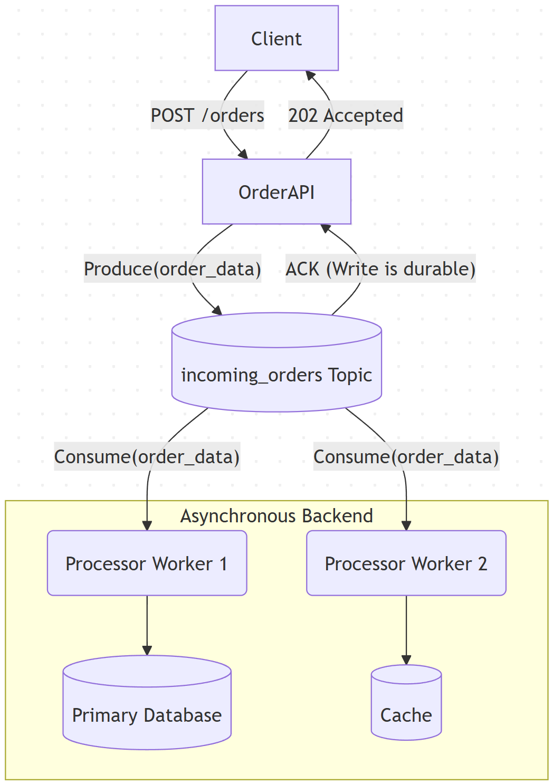
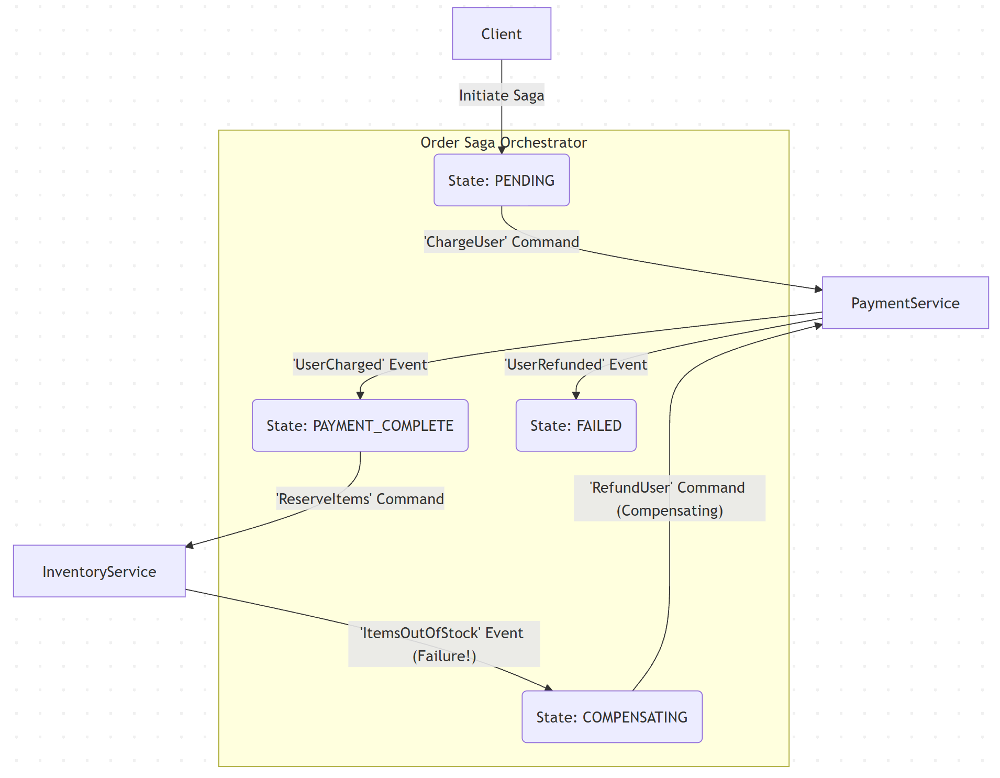

# Account ag249
# https://aistudio.google.com/prompts/1ljwZGG-cHZtVlu_dB93-BeV98GYV_C1_

### **The Comprehensive System Design Interview Guide (Table of Contents)**

Based on this interview and the broader landscape of system design, here is the table of contents for a comprehensive guide to help engineers succeed.

**Introduction: It's Not About The Right Answer**
* The Goal: Assessing Your Thought Process
* Why Trade-offs Are the Key to Everything
* How to Drive the Conversation

**Part I: The First 10 Minutes - Laying The Foundation**

* **Chapter 1: The Art of Scoping**
* Functional Requirements: From Ambiguity to a Concrete Feature List (V1, V2...)
* Non-Functional Requirements: The "ilities" That Shape the Architecture (Scalability, Latency, Availability, Consistency, Durability)
* Defining What's Explicitly Out of Scope
* **Chapter 2: Back-of-the-Envelope Math: From Vague to Quantifiable**
* Estimating Users, Traffic (QPS), Data, and Bandwidth
* The 80/20 Rule: Identifying the Read-Heavy vs. Write-Heavy Workloads
* Using Your Numbers to Justify Scale

**Part II: The High-Level Blueprint - Core Architectural Patterns**

* **Chapter 3: The Front Door: API & Real-Time Communication**
* Request/Response vs. Asynchronous Communication
* Choosing Your API Style: REST, gRPC, GraphQL
* Real-Time Patterns: WebSockets, Long Polling, Server-Sent Events
* **Chapter 4: The Building Blocks: Caching, Queues, and Load Balancing**
* Caching Strategies: Where, What, and When (Client, CDN, Server, Database)
* Message Queues vs. Event Logs: Kafka, RabbitMQ, SQS
* Load Balancers: L4 vs. L7, Routing Strategies

**Part III: The Data Dilemma - Designing the Persistence Layer**

* **Chapter 5: The Database Decision Tree**
* SQL (Relational): When and Why
* NoSQL Deep Dive:
* Key-Value (Redis, DynamoDB)
* Wide-Column (Cassandra, ScyllaDB)
* Document (MongoDB)
* Graph (Neo4j, Neptune)
* **Chapter 6: Data Modeling at Scale**
* Sharding and Partitioning Strategies (Hashing vs. Ranging)
* Designing for Your Read Patterns: Avoiding Hot Spots
* Indexing Strategies

**Part IV: Building for Failure - Advanced Topics for Senior Engineers**

* **Chapter 7: Idempotency: The Art of Safe Retries**
* Why At-Least-Once Delivery is the Default
* Designing Idempotent APIs and Workers (Idempotency Keys)
* **Chapter 8: Resiliency Patterns**
* Circuit Breakers: Preventing Cascading Failures
* Rate Limiting: Protecting Your Services from Abuse
* Timeouts and Exponential Backoff
* **Chapter 9: Mastering Consistency**
* The CAP Theorem in Practice
* Strong vs. Eventual Consistency
* Solving Read-After-Write Inconsistency
* **Chapter 10: Asynchronism and Decoupling**
* The Write-Ahead Log (WAL) Pattern for Durability
* CQRS (Command Query Responsibility Segregation)
* Sagas for Distributed Transactions

**Part V: Running the Machine - Operational Readiness**

* **Chapter 11: The Pillars of Observability**
* Metrics: From System-Level to Business-Logic-Level
* Logging: Structured vs. Unstructured
* Distributed Tracing: Understanding the Full Request Lifecycle
* **Chapter 12: Security by Design**
* Authentication and Authorization (OAuth, JWT)
* Data Encryption: At-Rest, In-Transit, and End-to-End
* **Chapter 13: The Grand Finale: Presenting and Defending Your Design**
* Whiteboarding Best Practices
* Articulating Trade-offs with Confidence
* Responding to Challenges and Course-Correcting

**Appendix: Case Study Walkthroughs**
* A. Designing a Social Media Feed
* B. Designing a URL Shortener
* C. Designing a Ride-Sharing App
* D. Designing a Distributed Task Scheduler

### **Chapter 1: The Art of Scoping**

The system design interview is an exercise in applied engineering philosophy. It is not a trivia contest about the latest database technologies, nor is it a race to fill a whiteboard with boxes and arrows. It is a structured exploration of your ability to navigate ambiguity, justify trade-offs, and build a mental model of a complex system from the ground up.

The most common—and most catastrophic—mistake an engineer can make is to begin this exploration by choosing a tool. The moment you say "We'll use Kubernetes" or "I'd pick Cassandra for this" before you have defined what *this* is, you have failed the primary test. You have demonstrated a fatal fixation on the *how* before you have established any agreement on the *what*.

This chapter is about mastering the first, and most critical, phase of the interview: taking a vague, one-sentence prompt and forging it into a concrete engineering contract.

---

### **1.1 Functional Requirements: From Ambiguity to a Concrete Feature List (V1, V2...)**

The interviewer will give you a prompt deliberately designed to be ambiguous. "Design Twitter." "Design a ride-sharing app." "Design Netflix." This is not an accident; it is the first test. Your interviewer is assessing:

1. Your ability to manage ambiguity without panic.
2. Your product sense—can you distill a massive product down to its essential essence?
3. Your ability to take control and drive the conversation with a structured process.

Your first move must always be to define the Functional Requirements. These requirements dictate what the system must *do*. They are the verbs of your system, the actions your users can take.

The strategy here is to build a "V1"—a Minimum Viable Product—and explicitly park everything else for a "V2" or "V-Next." This demonstrates pragmatism and a keen awareness of the constraints of the interview format.

#### **The Scoping Framework**

Follow this process methodically. Do not skip a step.

1. **Identify Core Actors:** Who are the primary users of this system? Write them down. For a ride-sharing app, the actors are "Rider" and "Driver." For an e-commerce site, they are "Buyer" and "Seller."
2. **Map Core User Journeys:** For each actor, what is the single most critical journey they must complete? Think in terms of a simple narrative.
* *Rider Journey:* I need to open the app, get a ride from where I am to where I'm going, and pay for it.
* *Driver Journey:* I need to go online, be matched with a rider, navigate to them, complete the ride, and get paid.
3. **Distill into Core Features:** Translate these narrative journeys into a clear, numbered list of features. These are your V1 Functional Requirements. Be imperative and unambiguous. Use language like "The system *must* allow a user to..."
4. **Create an Explicit "Parking Lot":** Equally important is defining what you are *not* building today. This prevents scope creep and shows the interviewer you are making conscious decisions to simplify the problem.

#### **Illustrative Example: "Design a Ride-Sharing App"**

Let's apply the framework to this classic prompt.

**V1 Functional Requirements:**

1. **User Authentication:** A Rider and a Driver must be able to sign up and log into the system.
2. **Location Reporting:** An active Driver must be able to broadcast their current location and availability.
3. **Ride Discovery & Request:** A Rider must be able to see nearby available Drivers and request a ride from Point A to Point B.
4. **Driver Matching:** The system must match an open ride request to a single, suitable Driver.
5. **Real-Time Ride Tracking:** Both Rider and Driver must be able to see each other's live location on a map from acceptance to pickup.
6. **Ride State Management:** Both parties must be able to progress through the states of a ride (e.g., `Accepted`, `En Route to Rider`, `Ride in Progress`, `Completed`).
7. **Payment Processing:** The system must handle payment automatically upon ride completion.
8. **Ratings & Feedback:** A Rider and a Driver must be able to rate each other after a ride.

This list is your engineering contract for the next 45 minutes. It is specific, bounded, and complex enough to be interesting.

**The "Parking Lot" (Out of Scope for V1):**

To demonstrate focus, you must explicitly state what you are deferring.

1. **Scheduled Rides:** V1 is on-demand only.
2. **Shared Rides / Pooling:** V1 is for private rides only.
3. **Multiple Service Tiers:** No different vehicle types (e.g., XL, Lux). All rides are standard.
4. **In-App Chat:** Rider and Driver cannot communicate within the app.
5. **Dynamic/Surge Pricing:** All pricing is based on a simple distance/time model. The logic for surge detection is a V2 problem.
6. **Complex Payout Systems:** Driver payments are handled in a simplified manner; no instant payouts or detailed financial dashboards.

By the end of this five-to-ten-minute process, you have transformed an amorphous cloud of a problem into a solid foundation. You have established yourself as a methodical engineer who builds from first principles. Every subsequent technical decision—your choice of database, your API design, your caching strategy—can and will be justified directly against this clear, mutually agreed-upon list of requirements.

### **1.2 Non-Functional Requirements: The “ilities” That Shape the Architecture**

If Functional Requirements are the *what*, Non-Functional Requirements (NFRs) are the *how well*. They are the constraints, the performance targets, and the quality attributes that dictate the very shape of the system. Two systems can have identical functional requirements but be built in wildly different ways because of their NFRs.

Consider two cars. Both have the same functional requirements: an engine, four wheels, a steering wheel, and seats. But one is a budget-friendly family sedan, and the other is a Formula 1 race car. They are not the same machine. Their differences are defined by their NFRs: speed (latency), reliability (availability), fuel efficiency (operational cost), and safety rating (durability).

In a system design interview, defining the NFRs is your opportunity to demonstrate senior-level thinking. It is where you move beyond simple feature lists and begin to grapple with the engineering trade-offs that lie at the heart of the problem. Your interviewer is looking to see if you can translate vague business needs like "the app should be fast and reliable" into quantifiable engineering targets.

#### **Quantify Everything**

The most significant difference between a junior and a senior engineer's approach to NFRs is the use of numbers. A junior engineer says, "We need high availability." A senior engineer says, "We are targeting 99.99% availability, which gives us a budget of 52 minutes of downtime per year." This quantification is non-negotiable. It provides a concrete goalpost against which you can measure every architectural decision.

Here are the core NFRs to define for almost any system:

#### **Scalability**
* **What it is:** The system’s ability to handle a growing amount of load, whether that load is users, data, or transaction volume.
* **How to quantify it:** Use the estimates you derived earlier. State the target number of users (e.g., 10 Million Daily Active Users) and the resulting query load (e.g., "This translates to a peak write load of 50k QPS and a peak read load of 500k QPS"). Differentiate between read and write scaling needs.
* **Architectural Impact:** This is the primary driver for horizontal scalability. It forces you to design stateless services that can be easily cloned behind a load balancer. It heavily influences your database choice, pushing you away from monolithic, single-server databases towards systems designed to be distributed and sharded from the outset.

#### **Latency**
* **What it is:** The time it takes for the system to respond to a user's action. This is often called response time and is a direct measure of the system's "speed."
* **How to quantify it:** Never use averages; they hide outliers that ruin the user experience. Use percentiles: P95, P99, or even P99.9. For example: "For our ride-sharing app, the P99 latency for a driver's location update to reach the rider must be under 500ms. The P95 latency for fetching a user's ride history should be under 300ms."
* **Architectural Impact:** Aggressive latency targets demand aggressive optimization. This requirement dictates the use of Content Delivery Networks (CDNs) to serve static assets, introduces multiple layers of caching (in-memory, distributed), forces decisions on data center geography (placing servers closer to users), and can influence protocol choices (e.g., persistent WebSocket connections vs. stateless HTTP requests).

#### **Availability**
* **What it is:** The percentage of time the system is operational and able to serve requests. This is the measure of the system's reliability.
* **How to quantify it:** Use "the nines."
* **99%** ("two nines") = ~3.65 days of downtime/year. (Unacceptable for most services)
* **99.9%** ("three nines") = ~8.77 hours of downtime/year. (A common target for internal services)
* **99.99%** ("four nines") = ~52.6 minutes of downtime/year. (A strong target for a V1 user-facing service)
* **99.999%** ("five nines") = ~5.26 minutes of downtime/year. (The gold standard, extremely expensive to achieve)
* **Architectural Impact:** Availability is the reason we build distributed systems. A 99.99% target immediately means there can be no single point of failure (SPOF). Every component—from load balancers to application servers to databases—must have redundancy, typically across multiple physical locations (Availability Zones or even Regions). It mandates health checks, automated failover, and robust deployment strategies.

#### **Consistency**
* **What it is:** A guarantee about the state of data as seen by different clients at the same time. This is the "C" in the CAP theorem.
* **How to quantify it:** This is typically described qualitatively. The two primary models are:
* **Strong Consistency:** All reads are guaranteed to see the result of the most recently completed write. This is what users intuitively expect.
* **Eventual Consistency:** After a write, there is a period of time during which reads might return stale data. The system guarantees that, given enough time with no new writes, all replicas will eventually converge to the same value.
* **Architectural Impact:** This is a fundamental trade-off against availability and latency. For a ride-sharing app, you need *strong consistency* for the state of the ride itself (you can't have a driver think the ride is `Completed` while the rider thinks it's `In Progress`). However, for the driver's icon moving on the map, *eventual consistency* is perfectly acceptable. Recognizing this allows you to build a more performant and resilient system by relaxing constraints where possible.

#### **Durability**
* **What it is:** The guarantee that once the system acknowledges a write, the data will not be lost, even in the face of server crashes, network partitions, or catastrophic failures.
* **How to quantify it:** Also expressed in "nines," but referring to the probability of data loss. Cloud storage providers like Amazon S3 famously offer "11 nines" of durability.
* **Architectural Impact:** Durability forces you to think about persistence strategies. It drives the need for database replication (writing data to multiple servers), persistent Write-Ahead Logs (WALs), and robust backup and restore plans. For critical user data, you can't just store it on one server's disk; you must ensure it is replicated across multiple failure domains.

By defining these five NFRs with specific, quantifiable targets, you create a scorecard. Now, when you propose to use a particular technology or architectural pattern, the interviewer will expect you to justify it based on how well it helps you meet these targets. You have successfully framed the rest of the conversation around concrete engineering goals.

### **1.3 Defining What's Explicitly Out of Scope**

In the art of sculpture, the masterpiece is revealed not by adding clay, but by chipping away the marble that isn't part of the statue. Similarly, in a system design interview, defining a world-class architecture is as much about what you choose *not* to build as what you choose to build.

Explicitly defining features that are "Out of Scope" is one of the most potent signals of seniority you can send. It demonstrates pragmatism, focus, and a keen understanding of the interview's constraints. An engineer who tries to design every feature of a product in 45 minutes is demonstrating ambition but also a critical lack of real-world project management sense.

The purpose of this exercise is to create a "Parking Lot" or "V2 List." This is a mutually agreed-upon list of features that are acknowledged as important but are deliberately deferred. This action serves several crucial purposes:

* **It Manages Time:** It is the single most effective tool for keeping the interview on track.
* **It Controls the Narrative:** It allows you to define the boundaries of the problem, preventing the interviewer from leading you down a complex rabbit hole you haven't prepared for.
* **It Reduces Ambiguity:** It creates a firm contract. By stating what's out, you are reinforcing what's in, ensuring both you and the interviewer are solving the same problem.
* **It Showcases Product Acumen:** It shows you can think like a product manager—you understand the concept of a Minimum Viable Product (MVP) and the necessity of phased rollouts.

#### **How to Identify and Defer Features**

Your goal is to identify features that, while valuable, represent a significant and distinct engineering sub-problem. Look for features that would require their own dedicated design session.

1. **Listen for High-Complexity Keywords:** When you brainstorm initial features, be on the lookout for things that imply whole new domains of computer science or infrastructure.
* "Real-time..." → often implies a need for a dedicated data streaming pipeline (e.g., Kafka, Flink).
* "Machine Learning..." → implies a need for ML model training, feature stores, and inference engines.
* "Social Graph..." → implies a need for a graph database and complex query patterns.
* "Chat/Video Call..." → implies a need for real-time messaging infrastructure (WebSockets) or WebRTC servers.

2. **Acknowledge, Praise, and Defer:** Don't just ignore these features. The technique is to validate their importance and then politely postpone them. The phrasing is key:
* *"Surge pricing is a critical revenue driver and a fascinating data science problem. For the purposes of our V1 today, let's stick to a simpler pricing model and park 'surge pricing' in our V2 list. This will allow us to focus on the core ride-hailing mechanics."*
* *"An in-app chat is essential for good user experience. However, that requires a full real-time messaging subsystem. Let's place that on the V2 list and assume for now that communication can happen out-of-band."*

#### **Illustrative Example: "Ride-Sharing App" Parking Lot**

Let's revisit our ride-sharing app and justify the items in its "Parking Lot." Notice how each deferred feature represents a new axis of complexity.

* **Out of Scope: Surge Pricing**
* **Justification:** This isn't just a simple `price * 1.5` calculation. A proper implementation requires a separate, complex subsystem to:
1. Ingest real-time location data from all drivers and active riders.
2. Divide the city into geographical cells (e.g., using S2 or Geohash).
3. Calculate the supply-demand ratio in each cell in near real-time.
4. Store and analyze historical demand patterns.
5. Communicate this data back to users without creating a thundering herd.
* This is a classic stream-processing and data-analytics problem, distinct from the core transactional ride state machine.

* **Out of Scope: Shared Rides (Pooling)**
* **Justification:** This fundamentally changes the complexity of two core components:
1. **Matching Algorithm:** We move from matching one rider to one driver (a relatively simple search problem) to a multi-variable optimization problem that resembles the Traveling Salesman Problem. The algorithm must now consider multi-stop routes, estimated time of arrival for subsequent passengers, and route deviation.
2. **Ride State Machine:** The system must now manage a ride with multiple legs and multiple distinct passenger states (`rider1_picked_up`, `en_route_to_rider2`, etc.).

By deliberately placing these items on the back burner, you are not showing weakness. You are demonstrating the focused, methodical discipline of a senior engineer who knows how to de-risk a project by tackling its core functionality first. You have cleanly defined the boundaries of the statue and are now ready to begin sculpting.

### **Chapter 2: Back-of-the-Envelope Math: From Vague to Quantifiable**

After establishing the functional and non-functional requirements, the system remains a collection of abstract goals. To transition from a philosopher to an architect, you must translate these goals into numbers. This is the purpose of back-of-the-envelope calculations.

This exercise is not about achieving perfect numerical accuracy. The interviewer does not expect you to know the exact number of daily active users for Twitter or the average size of a Netflix video segment. They expect you to demonstrate an ability to reason with orders of magnitude. The goal is to determine if you're building a system that needs to handle 10 requests per second or 100,000. The architecture required for these two scales is fundamentally different. This step grounds your design in reality and forces you to identify the most critical bottlenecks before you've drawn a single box.

---
### **2.1 Estimating Users, Traffic (QPS), Data, and Bandwidth**

The estimation process is a funnel. You start with the broadest number (the user base) and progressively refine it into specific technical specifications (QPS, storage, bandwidth). Always state your assumptions clearly and use simple, round numbers that are easy to manipulate.

#### **The Estimation Funnel**

**Step 1: The User Base**
Start by estimating the number of users. If the interviewer doesn't provide a number, propose a reasonable one for a large-scale application. A good default is **100 Million Monthly Active Users (MAU)** or **10 Million Daily Active Users (DAU)**. The DAU is often more useful for calculating request loads.

**Step 2: User Behavior & Core Actions**
Consult your list of Functional Requirements. For each core feature, estimate how often an average user performs that action. Critically, separate read actions (viewing data) from write actions (creating or changing data).

**Step 3: Calculating Traffic (QPS)**
Translate user actions into Queries Per Second (QPS), the lifeblood of system capacity planning.

* **Average QPS:** The formula is: `(Total Daily Actions) / (24 hours * 60 minutes * 60 seconds)`.
* **Peak QPS:** Traffic is never uniform. It has daily peaks and troughs. A robust system must be designed for its peak load. A common rule of thumb is to assume **Peak QPS is 2x to 5x of the Average QPS**. Always state your chosen multiplier.

**Step 4: Estimating Storage**
Calculate how much data you will need to store over time.

* For each write action, estimate the size of a single record. Add up the sizes of the various IDs, timestamps, strings, and other fields.
* `Daily Storage Growth = (Number of Writes per Day) * (Size of a Single Record)`
* Extrapolate this to yearly growth and for a multi-year horizon (e.g., 5 years) to understand the long-term storage requirements.

**Step 5: Estimating Bandwidth**
Calculate the amount of data entering (ingress) and leaving (egress) your system.

* `Bandwidth (ingress/egress) = QPS * (Average size of request/response payload)`

#### **Illustrative Example: "Ride-Sharing App" Calculations**

Let's apply this funnel to our previously scoped V1 ride-sharing app.

**1. Assumptions:**
* **Users:** 10 Million DAU.
* **Active Drivers:** Let's assume 10% of DAU are drivers, so 1 Million drivers total. At any given time during peak hours, let's say 20% of them are online. So, **200,000 concurrent online drivers**.
* **Active Riders:** At any given time during peak hours, let's say 20% of DAU are active. So, **2 Million concurrent online riders**.
* **Peak/Average Ratio:** We'll assume a peak load of **3x** the average.

**2. Workload Estimation (QPS):**

* **Driver Location Update (WRITE):** This is likely our heaviest write load.
* Assumption: An online driver's app sends a location update every 4 seconds.
* `Average Write QPS = 200,000 drivers / 4s = 50,000 QPS`
* `Peak Write QPS = 50,000 * 3 = 150,000 QPS`

* **Rider Watching Nearby Drivers (READ):** This is likely our heaviest read load.
* Assumption: An active rider's app fetches nearby driver data every 10 seconds.
* `Average Read QPS = 2,000,000 riders / 10s = 200,000 QPS`
* `Peak Read QPS = 200,000 * 3 = 600,000 QPS`

* **Architectural Insight:** The **Read/Write Ratio** is `600k / 150k = 4:1`. The system is read-heavy. This immediately tells us that caching strategies and read-replica databases will be critical architectural patterns.

**3. Storage Estimation:**

* We only need to store completed rides for V1.
* Assumption: On average, 1 ride per DAU per day. `10 Million rides/day`.
* Assumption: A single ride record contains `ride_id`, `rider_id`, `driver_id`, `start_loc`, `end_loc`, `start_time`, `end_time`, `price`, `rating`. Let's estimate this at **1 KB per record**.
* `Daily Storage Growth = 10,000,000 records * 1 KB/record = 10 GB/day`
* `Yearly Storage Growth = 10 GB/day * 365 days = ~3.65 TB/year`
* **Architectural Insight:** The storage requirement for the core ride data is not extreme. We won't need a petabyte-scale solution for V1. However, we must ensure the chosen database can handle the **write QPS** of new ride records being created.

**4. Bandwidth Estimation:**

* **Ingress (Driver uploads):**
* `150,000 QPS * (let's say 256 bytes per update) = ~38 MB/s`

* **Egress (Rider downloads):**
* The payload here is larger as it contains a list of drivers. Let's assume 2 KB per response.
* `600,000 QPS * 2 KB = ~1.2 GB/s`

* **Architectural Insight:** The egress bandwidth is significant (`~1.2 GB/s` is roughly `10 Gbps`). This cost will be substantial and pushes us to think about optimizations like geo-partitioning and efficient data serialization formats (e.g., Protocol Buffers over JSON).

By spending a few minutes on these calculations, we have moved from a vague idea to a set of hard constraints. We now know we need a system that can handle **600,000 peak reads/sec**, **150,000 peak writes/sec**, ingest a few terabytes of data a year, and serve over **1 GB/s** of data. These numbers will be your guideposts for every subsequent decision.

### **2.2 The 80/20 Rule: Identifying the Read-Heavy vs. Write-Heavy Workloads**

After calculating the raw traffic numbers, the next step is to interpret them. One of the most important interpretations is determining the fundamental character of your system's workload. The Pareto principle, or the 80/20 rule, often applies here: a small fraction of your system's features (20%) will typically account for the vast majority of its traffic (80%). More importantly, within that traffic, there is almost always a significant imbalance between read operations (retrieving data) and write operations (creating or modifying data).

Identifying this read/write imbalance is a pivotal moment in the interview. It is a simple diagnostic that has profound implications for the entire architecture. A system designed to serve reads looks radically different from one designed to absorb writes. Choosing the wrong optimization path leads to systems that are slow, expensive, and difficult to scale.

#### **Why This Distinction is Critical**

Think of reads and writes as having different engineering "needs."

* **Read-Heavy Systems** are defined by users consuming content far more often than they create it. The primary engineering goal is to make this consumption as fast and cheap as possible. The architecture will naturally favor:
* **Aggressive Caching:** Multi-layered caches (in-memory, distributed like Redis) become the centerpiece of the architecture.
* **Content Delivery Networks (CDNs):** For serving static and semi-static content from edge locations close to the user.
* **Read Replicas:** Using database replication to create multiple copies of the data that can serve read queries in parallel, taking the load off the primary database.
* **Data Denormalization:** Deliberately duplicating data and pre-joining tables to optimize for common read patterns, even at the cost of more complex write logic.

* **Write-Heavy Systems** are defined by high-volume data ingestion. The primary engineering goal is to capture, process, and durably store incoming data without dropping anything. The architecture will naturally favor:
* **Ingestion Queues & Logs:** Using a message queue (like RabbitMQ) or a commit log (like Apache Kafka) as a highly available, durable front door to buffer the incoming write traffic.
* **Write-Optimized Databases:** Choosing databases designed for high write throughput, such as wide-column stores (Cassandra) or Log-Structured Merge-Tree (LSM-Tree) based systems.
* **Horizontal Partitioning (Sharding):** Distributing the write load for a single table across many different servers.
* **Asynchronous Processing:** Deferring non-critical work (like generating thumbnails or sending notifications) to background workers to keep the critical write path as fast as possible.

#### **How to Perform the Analysis**

Using the numbers you calculated in the previous step, create a simple balance sheet of your system's primary operations.

Let's revisit our "Ride-Sharing App" example:

| Core Action | Type | Peak QPS Estimate | Dominant Characteristic |
| ---------------------------- | :---: | :---------------: | ------------------------------------------------------------- |
| Driver Location Update | **WRITE** | 150,000 | High-volume, constant stream. A classic write-heavy workload. |
| Rider Watches Nearby Drivers | **READ** | 600,000 | Extremely high-volume reads of frequently changing data. |
| Request a Ride | **WRITE** | ~50-100 | Low QPS but transactionally critical. |
| View Ride History | **READ** | ~1,000 | Infrequent reads of historical (mostly immutable) data. |
| **Total Read QPS** | | **~601,000** | |
| **Total Write QPS** | | **~150,100** | |

**Conclusion and Statement of Intent:**
After laying this out, you can make a definitive statement:

*"Looking at the numbers, the system has a peak read-to-write ratio of roughly 600,000 to 150,000, which is **4:1**. Therefore, this is a **read-heavy system**. While we have a significant write load from driver location updates that must be handled gracefully, the dominant performance bottleneck and area for optimization will be serving the massive number of read requests from riders. Consequently, my design will heavily prioritize a multi-layered caching strategy and an optimized read path to serve nearby driver data efficiently."*

#### **Contrasting Example: IoT Sensor Data Ingestion**

Imagine the prompt was "Design a system to collect temperature data from 10 million IoT devices."

| Core Action | Type | Peak QPS Estimate | Dominant Characteristic |
| ------------------- | :---: | :----------------: | --------------------------------------------------- |
| Sensor Data Point | **WRITE** | 1,000,000 | Massive, unrelenting firehose of write traffic. |
| Analyst Runs Query | **READ** | <1 | Infrequent, complex analytical queries. |
| **Total Read QPS** | | **<1** | |
| **Total Write QPS** | | **1,000,000** | |

**Conclusion:** The read/write ratio is practically zero. This is an unequivocally **write-heavy** system. Your entire design discussion would now revolve around Kafka for ingestion, Cassandra or TimescaleDB for write-optimized storage, and an analytics engine like Spark or Druid for the rare, heavy reads. Caching would be an irrelevant distraction.

This simple analysis is your compass. It sets the direction for the rest of the interview and ensures that every component you propose serves the primary goal dictated by the system's fundamental workload character.

### **2.3 Using Your Numbers to Justify Scale**

The numbers you have just calculated are not an academic sidebar; they are the bedrock upon which your entire technical argument will be built. Their purpose is to provide an objective, data-driven rationale for the architectural decisions you are about to make. In an interview setting, this is how you transition from making suggestions to stating conclusions. You move from saying "I think we should use a distributed database" to "The calculated peak write QPS of 150,000 *requires* us to use a distributed database."

This section is about wielding those numbers to justify why a simple architecture is insufficient and why a more complex, scalable system is not a premature optimization but a day-one necessity.

#### **From Numbers to Architectural Mandates**

The core technique is to compare your calculated load against the generally accepted limits of single-machine components. By showing that your load vastly exceeds these limits, you logically prove the need for a distributed approach.

**Justifying a Fleet of Application Servers**

This is typically the most straightforward justification. A single application server, even a powerful one, can handle a finite number of requests per second, perhaps in the low thousands (1k-2k QPS) for a moderately complex operation.

* **Your Justification:** *"Our peak read QPS is 600,000. A single application server cannot possibly handle this load. Therefore, a foundational component of our architecture must be a load balancer distributing traffic across a large, auto-scaling fleet of stateless application servers."*

**Justifying a Distributed Database for Writes**

This is one of the most critical justifications, as it often dictates your choice of database technology. A high-end, vertically scaled relational database (like PostgreSQL or MySQL on the largest available cloud instance) can handle a few thousand transactional write QPS, perhaps up to 5,000 QPS under ideal conditions.

* **Your Justification:** *"Our calculation for the driver location updates resulted in a peak write load of **150,000 QPS**. This number is more than an order of magnitude greater than what the best monolithic relational database can handle. This single number proves that using a single RDBMS is not a viable option. We are forced from the outset to choose a database system that can scale writes horizontally. This leads us directly to systems like Apache Cassandra or a sharded RDBMS like Vitess."*

**Justifying an Aggressive Caching Layer for Reads**

The same logic applies to reads, but the solution set is different. While read replicas can help scale reads, even they can be overwhelmed by extreme traffic.

* **Your Justification:** *"The system must handle a peak read load of **600,000 QPS**, primarily from riders checking for nearby drivers. While we can use read replicas to offload some of this, serving this volume directly from any database would be prohibitively expensive and would introduce latency. The sheer magnitude of this number justifies the implementation of a dedicated, in-memory caching layer using a system like Redis or Memcached. The primary goal of this cache will be to absorb the vast majority of these reads, protecting our core database and providing sub-millisecond responses to the user."*

**Justifying a Dedicated Object Store for "Big Data"**

While our ride-sharing app's storage needs were measured in terabytes per year, other systems are not so fortunate. This is where you justify the need for "blob" storage.

* **Hypothetical Justification:** *"If we were to add a feature for drivers to upload dashcam footage for insurance purposes, the numbers would change dramatically. A 5-minute video could be 100 MB. If 10,000 such videos are uploaded daily, our daily storage growth would be `10,000 * 100 MB = 1 TB/day`, or **365 TB/year**. Storing petabytes of unstructured binary data directly in a traditional database is inefficient and unscalable. These numbers justify using a dedicated object store like Amazon S3 or Google Cloud Storage. Our database would then only store the metadata and a pointer to the object in S3, not the object itself."*

#### **The Power of Proof**

Notice the pattern in each justification.
1. **State the calculated load:** "The system requires X."
2. **State the known limit of a simple solution:** "A single machine can only handle Y."
3. **State the conclusion:** "Because X >> Y, we are required to use solution Z."

By using your numbers as evidence, you are no longer just sharing an opinion. You are presenting a logical proof. You demonstrate an engineer's pragmatism: you would prefer a simpler solution if it were viable, but the data proves it is not. This evidence-based approach to justifying complexity is a hallmark of a senior engineer and a powerful tool for acing the system design interview.

### **Chapter 3: The Front Door: API & Real-Time Communication**

Once you have defined the scope and quantified the load, you are ready to design the "front door" of your system. This is the entry point through which all external clients—be they mobile apps, web browsers, or other services—interact with your architecture. The design of this interface is critical, as it dictates the fundamental communication patterns and contracts for the entire ecosystem.

The choices made here are not just about syntax (e.g., JSON vs. XML) or naming conventions. They are about fundamental models of interaction that have profound downstream effects on scalability, user experience, and system complexity. The first and most elemental of these choices is deciding between synchronous request/response and asynchronous communication.

---

### **3.1 Request/Response vs. Asynchronous Communication**

At the heart of all distributed systems lies a conversation. A client needs something from a server. The way this conversation happens is the system's most basic interaction pattern. Understanding the two primary models—the direct phone call versus the posted letter—is essential.

#### **The Synchronous Model: The Phone Call (Request/Response)**

This is the simplest and most intuitive model of communication. It is defined by a simple, powerful contract: the client sends a request and *waits*, blocking its own execution until it receives a response from the server.

**How it Works:**
1. **Client sends a request:** A mobile app asks `/api/v1/user/profile`.
2. **Client blocks:** The app’s UI might show a loading spinner. The thread making the request is effectively paused, unable to do anything else.
3. **Server processes:** The server receives the request, queries the database, formats the data.
4. **Server sends a response:** The server returns a `200 OK` with the user's profile data.
5. **Client unblocks:** The client receives the response and continues its execution, rendering the profile on the screen.

```
Client Server
| |
| --- HTTP GET /user/profile ---> |
| (Execution | (Processing Request...)
| Paused) | |
| ... | V
| <--- 200 OK {profile_data} --- |
| |
| (Resumes Execution) |
V |
```

**Properties:**
* **Simplicity:** The logic is straightforward and easy to reason about for both client and server.
* **Immediate Feedback:** The user receives an immediate success or failure. The state is unambiguous.
* **Tight Coupling:** The client and server are coupled in time. The server *must* be available for the client to proceed. If the server is slow, the client is slow.

**When to Use It:**
Use the request/response model when the client *needs an immediate answer* to continue its work.
* **Reading data for display:** Fetching a user profile, loading a product page, retrieving ride history.
* **Validating user input:** Checking if a username is already taken during signup.
* **Simple, fast writes:** Updating a user's name or logging into the system.

#### **The Asynchronous Model: The Posted Letter (Fire-and-Forget)**

In this model, the client sends a request and *does not wait* for the work to be completed. It only waits for a quick acknowledgment that the request has been *accepted*. The actual processing happens later, decoupled from the initial interaction. This is almost always facilitated by an intermediary component like a message queue or a commit log.

**How it Works:**
1. **Client sends a request:** An e-commerce app asks `/api/v1/orders`.
2. **Server accepts:** The server does minimal validation, creates a job, places it in a Kafka topic or a RabbitMQ queue, and *immediately* returns a `202 Accepted` response.
3. **Client unblocks:** The client receives the `202` and is free. It can render an "Order Pending" screen. The user experience feels instantaneous.
4. **A separate worker processes:** A pool of background servers consumes jobs from the queue. They process the payment, update inventory, notify shipping—a process that could take several seconds.
5. **Server sends a notification (optional):** Once the work is truly done, the server can use a separate channel (like a push notification or WebSocket) to update the client.

```
Client API Server Queue Worker Server
| | | |
|--- POST /order-->| | |
| |--- Enqueue() -->| |
| | |--- Job Message-->| (Processes Job)
|<-- 202 Accepted--| | | |
| | | | V
| (UI is Responsive) | | (Order Complete)
V | | |
| |<-- Push Notify--| (Optional)

```

**Properties:**
* **Resilience & Durability:** If the worker server is down, the job waits safely in the queue. The system can tolerate downstream failures.
* **Scalability:** The client-facing API servers and the backend workers can be scaled independently, matching resources to the specific workload.
* **Improved User Experience:** The application feels faster because the user isn't blocked waiting for a long-running process to complete.
* **Complexity:** This model introduces more moving parts (the message queue, worker services) and leads to an eventually consistent state, which can be harder to reason about.

#### **The Decision Framework**

For any feature you are designing, ask these questions to decide on the communication pattern:

1. **Does the client need the result *now* to render the next UI state?**
* **Yes:** → Request/Response (e.g., getting user settings before displaying the settings page).
* **No:** → Asynchronous (e.g., uploading a video; the UI can show "Processing...").

2. **Is the work long-running (>500ms), computationally expensive, or reliant on slow third-party services?**
* **Yes:** → Asynchronous (e.g., processing a payment that involves calling an external gateway). Forcing a user to wait more than a second is a poor experience.
* **No:** → Request/Response (e.g., updating a user's display name).

3. **Is it critical that the operation succeeds even if a downstream service fails?**
* **Yes:** → Asynchronous. A message queue provides a durable buffer that protects against transient failures.
* **No:** → Request/Response. If fetching a product description fails, the client can simply retry.

By consciously choosing the right pattern for each feature, you demonstrate a deep understanding of the trade-offs between simplicity, user experience, and system resilience.

### **3.2 Choosing Your API Style: REST, gRPC, GraphQL**

Once you've decided on the interaction pattern (synchronous vs. asynchronous), the next step is to choose the specific syntax and protocol for your synchronous APIs. This is the contract that defines how data is requested and shaped. In the modern architectural landscape, three styles dominate the conversation: REST, gRPC, and GraphQL.

They are not interchangeable. Each is a tool optimized for a different set of problems. Choosing the right one is a powerful signal that you understand the nuanced trade-offs between performance, flexibility, and simplicity.

#### **REST (Representational State Transfer): The Lingua Franca**

REST is not a strict protocol but an architectural style that has become the de facto standard for public-facing web APIs. It leverages the existing semantics of HTTP to perform operations on "resources."

* **How it Works:** It uses standard HTTP verbs (GET, POST, PUT, DELETE) to represent actions and URLs (Uniform Resource Locators) to represent resources. For example, to get a user's data, you would make a `GET` request to `/users/123`. Data is typically exchanged in a human-readable format like JSON.

```
// Client requests a specific user's posts
GET /users/123/posts
Host: api.example.com

// Server responds with the full resource representation
HTTP/1.1 200 OK
Content-Type: application/json

[
{
"postId": "p1",
"title": "First Post",
"content": "...",
"authorId": "123"
},
{
"postId": "p2",
"title": "Second Post",
"content": "...",
"authorId": "123"
}
]
```

* **Key Properties:**
* **Simplicity & Ubiquity:** It's built on standard HTTP, making it universally understood and easy to use with any client (`curl`, browsers).
* **Statelessness:** Each request contains all the information needed to process it, which makes scaling horizontally straightforward.
* **Standard Caching:** HTTP caching mechanisms work out of the box. A `GET` to `/users/123` can be easily cached by URL.

* **Pain Points:**
* **Over-fetching:** The server defines the resource shape. If a client only needs the `title` of each post, it still receives the full `content` and `authorId`, wasting bandwidth.
* **Under-fetching (The N+1 Problem):** The initial request returns a list of posts. To display the author's name for each post, the client must then make *N* additional requests (`GET /users/{authorId}`). This chattiness kills performance, especially on mobile networks.
* **Weak Contract:** The relationship between endpoints and data schemas is based on convention, not enforcement. An API can break if the server changes a field name without warning. (Tools like OpenAPI/Swagger help mitigate this but aren't inherent to the style.)

#### **gRPC: The High-Performance Workhorse**

gRPC is a modern Remote Procedure Call (RPC) framework developed by Google. Instead of thinking in terms of resources and verbs, you think in terms of calling functions on a remote service. It is designed for high-performance, internal microservice-to-microservice communication.

* **How it Works:** It uses **HTTP/2** for transport, enabling multiplexing of many requests over a single connection. Its key innovation is **Protocol Buffers (Protobuf)**, a language-agnostic, binary serialization format. You define the service "contract" (available functions and data structures) in a `.proto` file, from which gRPC automatically generates strongly-typed client and server code in multiple languages.

```protobuf
// posts.proto
service PostService {
rpc GetPostsForUser(UserRequest) returns (PostList) {}
}

message UserRequest {
string user_id = 1;
}
// ... other message definitions
```

* **Key Properties:**
* **Extreme Performance:** The combination of binary Protobuf (which is smaller and faster to parse than JSON) and the efficiencies of HTTP/2 makes it significantly faster than REST.
* **Strongly-Typed Contract:** The `.proto` file is the single source of truth. It's impossible for a client and server to disagree on the API shape, eliminating an entire class of integration errors.
* **Streaming:** HTTP/2 support enables bi-directional streaming, allowing for advanced use cases like real-time data flow that are cumbersome with REST.

* **Pain Points:**
* **Limited Browser Support:** gRPC is not directly supported by web browsers. It requires a proxy layer (like gRPC-Web) to translate requests.
* **Not Human-Readable:** The binary format makes debugging with simple tools like `curl` difficult without plugins or proxies.

#### **GraphQL: The Flexibility Champion**

GraphQL is a query language for your API, developed by Facebook. It addresses REST's over-fetching and under-fetching problems head-on by giving the client precise control over the data it needs.

* **How it Works:** It exposes a single endpoint (e.g., `/graphql`). The client sends a "query" that describes the exact shape of the data it requires, including nested relationships. The server then responds with a JSON object that precisely matches the query's shape.

```graphql
# Client sends a query in the POST body
query {
user(id: "123") {
posts {
title # Only request the title
author { # And fetch the author's name in the same request
name
}
}
}
}
```

* **Key Properties:**
* **Efficient Data Loading:** It completely eliminates over-fetching and under-fetching. Clients get exactly what they ask for in a single round trip.
* **Strongly-Typed Schema:** Like gRPC, GraphQL is built around a strong schema (the Schema Definition Language, or SDL), providing a self-documenting and reliable contract.
* **Evolvable API:** Front-end clients can add new data requirements without needing backend changes (as long as the data is available in the schema). This is ideal for fast-moving product teams.

* **Pain Points:**
* **Server-Side Complexity:** Implementing a GraphQL server is more complex than a REST API. You must write "resolver" logic for every field in your schema.
* **Complex Caching:** Since there is only one endpoint, standard HTTP caching by URL is ineffective. Caching requires more sophisticated client-side and server-side solutions.
* **Potential for Abuse:** Clients can craft extremely complex queries that could overload the database. Mitigation requires query depth limiting, cost analysis, and timeout enforcement.

### **The Decision Framework: Which Style to Choose?**

In an interview, you demonstrate seniority by choosing the right tool for the job.

* **Choose REST When:**
* You need a public-facing API that is easily consumed by a wide variety of clients.
* Your data model is simple and resource-oriented (e.g., a simple CRUD service).
* Simplicity of implementation and standard tooling are a priority.
* **The Go-To Answer:** For simple, public APIs, REST is the pragmatic default.

* **Choose gRPC When:**
* You are building a network of **internal microservices** where performance is paramount.
* You need to handle high-throughput, low-latency communication.
* You need streaming capabilities.
* **The Go-To Answer:** For east-west traffic between backend services.

* **Choose GraphQL When:**
* You have a diverse set of clients (e.g., mobile apps, web apps) with varying data needs.
* Your application has a complex, graph-like data model (e.g., a social network).
* You want to empower front-end teams to iterate quickly without backend dependencies.
* **The Go-To Answer:** For client-facing APIs with complex data and evolving UIs.

The most advanced answer is often a **Hybrid Approach**. A common, powerful pattern is to use high-performance **gRPC** for all internal microservice communication and then expose an **API Gateway** to the public. This gateway can translate requests from the outside world into gRPC calls, offering a public **GraphQL** or **REST** interface for external clients to consume. This gives you the best of both worlds: internal performance and external flexibility.

### **3.3 Real-Time Patterns: WebSockets, Long Polling, Server-Sent Events**

The standard request/response model is initiated entirely by the client. The server is passive; it can only speak when spoken to. But what happens when the *server* has information for the client that the client doesn't yet know to ask for? This is the domain of real-time communication.

For many modern applications—a chat message appearing, a driver's location updating on a map, a new post appearing in a social media feed—the user expects to see new information instantly, without hitting a "refresh" button. The server must be able to *push* data to the client.

Let's explore the primary patterns for achieving this, starting with the simplest hack and moving to the most powerful, purpose-built solutions.

#### **Short Polling: The Brute-Force Method**

This is the most primitive form of real-time simulation. The client repeatedly sends a request to the server at a fixed interval to ask, "Is there anything new?"

* **How it Works:**
1. Client sends `GET /updates`.
2. Server immediately responds, either with new data or an empty response.
3. Client waits for a fixed interval (e.g., 2 seconds).
4. Repeat Step 1.
* **Analogy:** A child in the back of a car asking "Are we there yet?" every thirty seconds for the entire trip.
* **Properties:**
* **Pro:** Extremely simple to implement on any platform.
* **Con:** High Latency. On average, the delay for receiving an update is `polling_interval / 2`.
* **Con:** Wildly Inefficient. The vast majority of requests are wasted, returning no new data but still incurring the full overhead of an HTTP request/response cycle (TCP connection setup, HTTP headers).
* **When to Use:** Almost never for modern applications. It serves as a useful baseline to understand why more advanced patterns are necessary.

#### **Long Polling: A Smarter Hack**

Long polling is a clever refinement of short polling that reduces latency and inefficiency. Instead of responding immediately, the server holds the client's request open until it actually has new data to send.

* **How it Works:**
1. Client sends `GET /updates`.
2. Server does **not** respond immediately. It holds the connection open.
3. When a new event occurs on the server, it sends the data in the response to the waiting client and closes the connection.
4. The client receives the data and immediately initiates a new request (repeats Step 1).
5. If no event occurs for a long time, the server will time out and send an empty response, at which point the client immediately reconnects.
* **Analogy:** Asking "Are we there yet?" once, with the parent promising they will only answer the very moment you arrive. Once they answer, you immediately ask again.
* **Properties:**
* **Pro:** Significantly lower latency than short polling. Data is sent almost as soon as it's available.
* **Pro:** Reduces wasteful "empty" responses.
* **Con:** Still has the overhead of establishing a new connection for every event.
* **Con:** Can be complex to implement on the server, requiring management of hanging requests and timeouts.
* **When to Use:** As a fallback mechanism when WebSockets are unsupported by a client or blocked by a corporate firewall. It's a proven, durable hack on top of HTTP/1.1.

#### **Server-Sent Events (SSE): The One-Way Broadcast**

SSE is a modern web standard specifically designed for servers to push a continuous stream of events to a client over a single, long-lived HTTP connection.

* **How it Works:**
1. The client connects to an endpoint and indicates it wants an event stream (via the `Accept: text/event-stream` header).
2. The server holds the connection open and can send messages to the client at any time. The format is a simple, standardized text protocol.
3. This is a **one-way** channel: only the server can send data after the initial connection.
* **Analogy:** A one-way radio broadcast. The radio station (server) sends out news continuously, and your car radio (client) just listens. You can't talk back to the station over the same channel.
* **Properties:**
* **Pro:** Simple and efficient for server-to-client push. Built into most modern browsers with a simple JavaScript API.
* **Pro:** Handles reconnection automatically if the connection is dropped.
* **Pro:** Works over standard HTTP, making it generally firewall-friendly.
* **Con:** Strictly **unidirectional**. The client cannot send messages to the server over the SSE connection itself.
* **When to Use:** When the communication is one-directional. Ideal for stock tickers, live sports scores, news feeds, or pushing status updates for a background job (e.g., "Video Processing...", "Build Complete!").

#### **WebSockets: The Two-Way Conversation**

WebSockets are the gold standard for true, real-time, bi-directional communication. They provide a single, persistent TCP connection over which both the client and the server can send data at any time.

* **How it Works:**
1. The communication begins as a standard HTTP request with a special `Upgrade: websocket` header.
2. If the server agrees, it responds with a `101 Switching Protocols` status code.
3. At this point, the initial HTTP connection is "upgraded" and transformed. It is no longer an HTTP connection but a **full-duplex**, raw message-passing channel.
* **Analogy:** An open, two-way walkie-talkie channel. Either party can speak at any time, and the other will hear them instantly.
* **Properties:**
* **Pro:** Extremely low latency. The lowest possible overhead after the initial handshake.
* **Pro:** **Bi-directional**. The client and server are peers and can both initiate communication at will.
* **Con:** More resource-intensive on the server. The server must maintain the state for every open WebSocket connection, which can run into the millions. This requires a specific architecture (often called a Connection Gateway layer).
* **Con:** Can be blocked by older or stricter firewalls that don't understand the `Upgrade` header.
* **When to Use:** When you need a true interactive, conversational experience. The canonical use cases are chat applications, multiplayer online games, and collaborative real-time editing tools (like Google Docs or Figma).

### **The Decision Framework**

| Pattern | Directionality | Key Benefit | Key Drawback | Typical Use Case |
| --------------- | ---------------------------- | ------------------------------------- | ---------------------------------------- | ------------------------------------------ |
| **Long Polling** | Server → Client (Simulated) | Broadest compatibility. | High connection overhead per message. | Fallback when WebSockets fail. Legacy apps. |
| **SSE** | Server → Client (One-Way) | Simple, standard, auto-reconnects. | Unidirectional only. | News feeds, status updates, notifications. |
| **WebSockets** | Client ↔ Server (Two-Way) | Lowest latency, full-duplex comms. | Stateful server, more complex to scale. | Chat, online gaming, collaborative editing. |

### **Chapter 4: The Building Blocks: Caching, Queues, and Load Balancing**

If the API is the front door to your system, then the components discussed in this chapter are the foundation, the hallways, and the electrical wiring. They are the fundamental building blocks that enable a distributed system to be scalable, resilient, and performant. While users never interact with them directly, their absence would be immediately and painfully felt.

Mastering these core components is non-negotiable for a senior engineer. This chapter will dissect the three most critical building blocks—caching, queues, and load balancing—explaining the theory behind them and providing a practical framework for when and where to use them.

---

### **4.1 Caching Strategies: Where, What, and When (Client, CDN, Server, Database)**

The most fundamental constraint in computer systems is the speed-of-light-vs-cost problem. The closer a piece of memory is to the processor, the faster it is to access, but also the more expensive and scarce it becomes. A CPU register is orders of magnitude faster than main memory (RAM), which is orders of magnitude faster than a local SSD, which is orders of magnitude faster than data retrieved over a network.

**Caching is the art and science of intelligently exploiting this hierarchy.** A cache is simply a smaller, faster storage layer that holds a temporary copy of data that is expensive to retrieve or compute. The goal is simple: if you have to do expensive work, do it only once. For all subsequent requests for the same information, serve the cheap copy from the cache.

Proper caching is often the single most effective optimization you can make. It can reduce database load by over 90%, dramatically decrease user-facing latency, and cut infrastructure costs. Let's explore this strategy by answering three questions: **Where** can we cache, **what** should we cache, and **when** should data be invalidated?

#### **The "Where": A Multi-Layered Defense Against Latency**

Caching is not a single component but a strategy that should be applied at multiple layers. Each layer catches a request, shielding the layer below it from unnecessary traffic.


**1. Client Cache (Browser / Mobile App)**
This is the cache closest to the user. Web browsers have a built-in HTTP cache, and mobile apps can implement their own local storage mechanisms (e.g., using SQLite or files).
* **What it Caches:** User-specific settings, static assets like logos and CSS files, and data that changes infrequently.
* **How it's Controlled:** Primarily via HTTP headers like `Cache-Control: max-age=3600`, which tells the browser it can use its local copy for the next hour without re-requesting it.
* **Impact:** Eliminates a network round trip entirely. The fastest possible cache.

**2. Content Delivery Network (CDN) Cache**
A CDN is a global network of reverse proxy servers located at the "edge" of the internet, physically close to users. When a user requests content, they are routed to the nearest CDN server, which may have a cached copy.
* **What it Caches:** Primarily public static assets (JavaScript, videos, images) but can also be configured to cache API responses for anonymous users (e.g., the list of top 10 products on an e-commerce site).
* **Impact:** Drastically reduces latency for a global user base by serving content from a nearby location. Massively offloads traffic from your origin servers.

**3. Server-Side Cache**
This is the cache that you, the backend engineer, have the most control over. It lives within your own infrastructure and shields your core data sources. This layer itself has sub-layers:
* **In-Memory Cache (per-service):** A simple hash map or a more sophisticated library (like Guava in Java or an `LruCache` in Python) that lives in the memory of a single application server. It is blazingly fast but is limited by the server's RAM, is not shared with other servers, and is lost if the server restarts.
* **Distributed Cache (external service):** A dedicated, external fleet of servers whose sole job is to cache data. **Redis** and **Memcached** are the canonical examples. Your application servers communicate with this cache cluster over a fast internal network. It provides a shared cache that is accessible by all your services and can be scaled independently.

**4. Database Cache**
Most databases have their own internal performance-enhancing caches (e.g., PostgreSQL's buffer pool), which cache recently accessed parts of the database in RAM. While you don't typically manage this cache directly, its existence is why repeated queries for the same data are often faster.

#### **The "What": Eviction Policies**

A cache is, by definition, smaller than the source of truth. Therefore, you must have a policy for what to discard when the cache becomes full. This is the **eviction policy**.

* **Least Recently Used (LRU):** The most common policy. When space is needed, the item that has not been accessed for the longest time is discarded. This is effective for workloads where recent data is likely to be accessed again.
* **Least Frequently Used (LFU):** Discards the item that has been accessed the fewest times. This is useful when you have a set of "celebrity" data that is always popular, and you don't want a sudden burst of one-off requests to evict it.
* **Time To Live (TTL):** Each item is stored with an expiration timestamp. The cache automatically removes items once their time is up. This is simple and predictable, ideal for data that has a known shelf-life (e.g., a 24-hour user session).

#### **The "When": Cache Invalidation—The Hardest Problem**

How do you handle data that changes? If a user updates their profile name, how do you ensure the cache doesn't continue serving the old, stale name? This is **cache invalidation**.

* **Write-Through Cache:** The application writes data to the cache *and* the database at the same time. The operation is only considered complete when both writes succeed.
* **Pro:** Data in the cache is always consistent with the database.
* **Con:** Writes are slower because they incur the latency of two separate network calls.
* **Write-Around Cache:** The application writes data directly to the database, completely bypassing the cache. The cache is only populated when a subsequent read request results in a "cache miss."
* **Pro:** Writes are fast. Simple to implement.
* **Con:** The cache will contain stale data until the next read for that key occurs, which could be never.
* **Write-Back Cache (or Write-Behind):** The application writes data only to the fast cache and immediately acknowledges the request. A separate process asynchronously writes the data from the cache to the database later.
* **Pro:** The fastest possible write latency for the user.
* **Con:** High risk. If the cache server crashes before the data is written back to the database, the data is lost permanently. This is only used for workloads where some data loss is tolerable.

A fourth common pattern is to simply set a low TTL. Even if the data is stale, it will automatically correct itself after a short period (e.g., a few seconds). This strategy of accepting temporary inconsistency is a pragmatic and powerful way to simplify system design.

### **4.2 Message Queues vs. Event Logs: Kafka, RabbitMQ, SQS**

In the previous section on asynchronous communication, we established the need for an intermediary to hold jobs for background processing. This intermediary is not a monolithic concept; it represents a design choice between two distinct philosophies for managing asynchronous data flow: the message queue and the event log.

Understanding the difference is critical. Choosing the wrong pattern can lead to systems that are unscalable, lose data, or are unable to support future product requirements.

#### **The Message Queue Philosophy: The To-Do List**

A message queue is designed to distribute ephemeral **tasks** to a pool of workers. Its primary job is to ensure that a task is processed successfully by *one* worker, and once it is, the task disappears.

* **The Mental Model:** Think of a team's physical to-do board. A manager (the producer) puts a sticky note (a message) on the board for a task that needs doing, like "Process Order #123". A team member (a consumer) takes the note off the board, completes the work, and then throws the note away. The task is done and gone forever. If another team member comes to the board, they won't even know that task ever existed.

* **Key Concepts:**
* **Producer/Consumer:** Producers create messages; consumers process them.
* **Destructive Read:** This is the defining characteristic. When a consumer fetches a message and acknowledges its successful processing (an `ACK`), the message is *permanently deleted* from the queue. This ensures that a single task is not performed multiple times.
* **Smart Broker, Dumb Consumer:** The message broker (the queue software itself) often contains sophisticated logic for routing messages to different queues based on rules, handling priorities, and ensuring delivery. The consumer's job is simply to ask for the next task.

* **Illustrative Technologies:**
* **RabbitMQ:** A powerful, mature, and feature-rich message broker. It implements the AMQP (Advanced Message Queuing Protocol) standard and excels at complex routing logic. You can set up intricate rules to send certain types of messages to specific consumers. It's the Swiss Army knife for task distribution.
* **Amazon SQS (Simple Queue Service):** A fully managed, highly scalable, and simple-to-use message queue. It offers two types: Standard (at-least-once delivery, best-effort ordering) and FIFO (exactly-once processing, strict ordering), trading performance for stricter guarantees. Its simplicity and elastic scalability make it a popular choice in the AWS ecosystem.

#### **The Event Log Philosophy: The Immutable Ledger**

An event log is designed to capture a durable, ordered, replayable **history of facts**. It is not about tasks to be done, but about events that have happened. Consumers don't "take" events; they simply read the log, like reading a newspaper.

* **The Mental Model:** Think of a bank's official transaction ledger. Every deposit and withdrawal (an event) is recorded in an ordered, append-only log. The ledger itself is the source of truth. The accounting department can read it to generate reports. The auditing department can read the *exact same log* to check for fraud. An analytics team can read it to find spending patterns. Critically, when the accounting team reads a transaction, they don't erase it. It remains in the log forever for others to read.

* **Key Concepts:**
* **Append-Only Log:** Events are written to the end of a durable, partitioned log (called a Topic). The data is immutable.
* **Non-Destructive Read:** This is the core difference. Consumers read from the log but never delete data. Each consumer group independently tracks its own position in the log using a pointer called an **offset**.
* **Replayability:** This is the superpower of the event log. Since data is never deleted, you can add a brand new service a year later, and it can start reading from the beginning of time, reprocessing all historical events to build up its state.
* **Dumb Broker, Smart Consumer:** The event log broker is relatively simple; its main job is to store massive amounts of data in partitions and make it available. The consumer is responsible for managing its own offset, deciding where to start reading from.

* **Illustrative Technology:**
* **Apache Kafka:** This is the quintessential event log system. It is designed for extreme throughput, durability, and scalability, capable of handling trillions of events per day. It has become the central "nervous system" for many modern data-driven companies, serving as the source of truth for stream processing, data analytics, and asynchronous communication between microservices.

### **The Decision Framework**

In an interview, choosing between these two philosophies demonstrates a deep understanding of architectural intent.

| Characteristic | Message Queue (RabbitMQ / SQS) | Event Log (Kafka) |
| ---------------------- | ------------------------------------------------------------ | -------------------------------------------------------------------- |
| **Data Retention** | Ephemeral. Messages are deleted after successful processing. | Durable & Permanent. Data is retained based on a configured policy. |
| **Consumer Model** | **Competitive Consumers.** Multiple consumers on one queue compete to process messages. A message is processed by only one. | **Independent Consumers.** Multiple consumer groups can read the same stream of data independently, without affecting each other. |
| **Data Replayability** | Not possible by default. Once a message is consumed, it is gone. | A core feature. New consumers can process events from any point in history. |
| **Architectural Use Case** | **Transient Task Distribution.** Ideal for background jobs, decoupling monolithic applications, and stateless task processing where history is irrelevant. | **Event Sourcing & Stream Processing.** Ideal as a system's source of truth, for real-time analytics, and for broadcasting state changes to multiple interested microservices. |
| **Primary Question it Answers** | *"What work needs to be done right now?"* | *"What has happened in our system over time?"* |

The senior-level insight is that these are not mutually exclusive. A complex system often uses both. You might use **Kafka** as the durable event bus for all business-critical events (e.g., `UserSignedUp`, `OrderPlaced`). One consumer might read from this bus and then place a specific, transient job into a **RabbitMQ** queue for a pool of workers to process payment, demonstrating a nuanced, purpose-driven architectural choice.

### **4.3 Load Balancers: L4 vs. L7, Routing Strategies**

In a scalable system, you never have just one server; you have a fleet of identical, cloned servers working in parallel. A load balancer is the digital traffic cop that stands in front of this fleet. Its primary purpose is to distribute incoming client requests across multiple backend servers to ensure **availability** (if one server fails, others can take its place) and **scalability** (as traffic increases, you can add more servers to the fleet).

Without a load balancer, your service is limited by the capacity of a single machine, and that single machine represents a catastrophic single point of failure. The choice of load balancer type is a fundamental architectural decision that determines how intelligently this traffic can be distributed. The primary distinction is based on which layer of the OSI networking model the load balancer operates on.

#### **The Two Personalities: L4 vs. L7**

**L4 Load Balancer (Transport Layer)**
An L4 load balancer operates at Layer 4, the Transport Layer. It has visibility into network information like source/destination IP addresses and TCP/UDP ports. It knows *where* traffic is coming from and where it's going, but it has no visibility into the actual *content* of the packets.

* **The Analogy:** Think of a postal service routing packages based solely on the destination address and postal code printed on the outside of the box. It does not open the box to see what's inside.
* **How it Works:** It makes routing decisions by inspecting the TCP/UDP headers. When a client request arrives, the L4 load balancer performs Network Address Translation (NAT) to change the destination IP address to that of a chosen backend server and then forwards the packet.
* **Properties:**
* **Extremely Fast:** Because it doesn't need to inspect packet content, it does very little processing. This results in minimal overhead and extremely high throughput.
* **Protocol Agnostic:** It can balance any traffic that runs over TCP or UDP (HTTP, FTP, databases, etc.).
* **"Dumb":** It cannot make decisions based on the application data. A request for `/api/videos` and a request for `/api/users` look identical to it; it only sees a stream of bytes destined for port 443.

**L7 Load Balancer (Application Layer)**
An L7 load balancer operates at Layer 7, the Application Layer. This is a much more sophisticated device. It terminates the incoming connection, inspects the application-level data inside the packets, and then makes intelligent routing decisions before establishing a new connection to a backend server.

* **The Analogy:** This is the company mailroom clerk who not only receives the package but opens it, reads the memo inside ("To: The Finance Department"), and then delivers it to the correct floor and desk.
* **How it Works:** It can inspect anything at the application layer, most commonly HTTP. This includes URLs, HTTP headers (like `Accept-Language` or `Authorization`), cookies, and query parameters.
* **Properties:**
* **"Smart":** It can perform content-based routing. For example:
* Send all requests with the path `/api/video/*` to the Video Processing service fleet.
* Send all requests with the path `/api/user/*` to the User Management service fleet.
* **Feature-Rich:** Because it understands the application protocol, it can provide many advanced features:
* **SSL/TLS Termination:** It can decrypt incoming HTTPS traffic, so the backend servers receive unencrypted HTTP, offloading a significant computational burden from them.
* **Sticky Sessions:** It can use cookies to ensure that all requests from a single client's session are sent to the same backend server, which is necessary for legacy stateful applications.
* **Health Checks:** It can perform much smarter health checks, for instance by polling an `/health` endpoint and expecting a `200 OK` response, rather than just checking if a port is open.
* **Slower and More Resource-Intensive:** All this intelligence comes at a cost. Terminating connections and parsing application data requires more CPU and memory than the simple packet-forwarding of an L4 load balancer.

#### **Routing Strategies: The Distribution Algorithm**

Whether L4 or L7, the load balancer needs an algorithm to decide which specific backend server to send the next request to.

* **Round Robin:** The simplest algorithm. Requests are distributed sequentially across the list of available servers. Server 1 gets request 1, Server 2 gets request 2, Server 3 gets request 3, then back to Server 1.
* **Pro:** Simple and predictable.
* **Con:** Doesn't account for server load or health. A busy server will get the next request even if another server is completely idle.
* **Least Connection:** This is an adaptive strategy. The load balancer maintains a count of active connections to each backend server and sends the next incoming request to the server with the fewest active connections.
* **Pro:** A great general-purpose algorithm that naturally distributes load based on server capacity and response time.
* **Con:** Requires the load balancer to maintain a state table of connection counts.
* **IP Hash:** A hash function is applied to the client's source IP address to determine which server receives the request.
* **Pro:** Guarantees that requests from a given client IP will always be routed to the same backend server. This can be useful for achieving "stickiness" without cookies.
* **Con:** Can lead to an uneven load distribution if many clients are coming from behind a single IP address (e.g., a corporate NAT).

### **The Decision Framework**

| Feature | L4 Load Balancer | L7 Load Balancer |
| ----------------------- | ------------------------------------------------- | --------------------------------------------------------- |
| **OSI Layer** | 4 (Transport) | 7 (Application) |
| **Routing Decision On** | IP Address, TCP/UDP Port | URL Path, HTTP Headers, Cookies, Query Parameters |
| **Performance** | Very High | High (but lower than L4) |
| **Key Features** | Protocol Agnostic, High Throughput | SSL Termination, Content-Based Routing, Sticky Sessions |
| **Primary Use Case** | High-speed traffic distribution where content inspection is not needed. Often the first layer of defense. | Most modern web applications, microservice routing. |

In a complex, large-scale system, the ultimate solution is often **a hybrid approach**. A high-performance L4 load balancer (like AWS's Network Load Balancer) might serve as the primary public entry point to handle the raw volume of incoming traffic and pass it to a fleet of L7 load balancers (like AWS's Application Load Balancer). These L7 load balancers then perform the intelligent, path-based routing to the appropriate backend microservices. This tiered approach provides the best of both worlds: raw speed at the edge and intelligent routing at the application level.

### **Chapter 5: The Database Decision Tree**

You have defined your requirements. You have a rough sketch of your services. Now you must decide where your data will live. This is one of the most consequential decisions in the system design interview, as it influences everything from your API design to your system's performance and scalability characteristics.

The "SQL vs. NoSQL" debate is the central architectural dilemma of modern backend engineering. Answering it well requires you to move beyond dogma and treat databases as what they are: specialized tools for specific jobs. Your task is to select the right tool for the job you have just defined. This chapter will arm you with a decision-making framework to do just that, starting with the bedrock of data storage.

---

### **5.1 SQL (Relational): When and Why**

Relational databases, which use the Structured Query Language (SQL), are the foundation of modern data persistence. For decades, they were not just *an* option; they were the *only* option. Decades of research and battle-testing have made them incredibly powerful, reliable, and well-understood. Your default instinct should not be to dismiss them as "old" technology, but to treat them as the powerful default choice that must be actively *disproven* for your use case.

#### **The Pillars of Relational Strength**

Understanding when to choose a relational database (like PostgreSQL or MySQL) begins with appreciating its core, defining strengths.

1. **ACID Guarantees:** This is the most important concept. ACID is an acronym for a set of properties that guarantee transactional validity even in the event of errors, power failures, or other disasters.
* **Atomicity:** All parts of a transaction succeed, or the entire transaction is rolled back. There are no partial successes. *Insight:* For a banking app, you cannot debit one account without successfully crediting another. Atomicity ensures this financial integrity.
* **Consistency:** The data will always be in a valid state according to your defined rules (data types, constraints, etc.). A write will only succeed if it adheres to the schema. *Insight:* This prevents "garbage data" from ever entering your system. An `age` column cannot be filled with a string of text.
* **Isolation:** Concurrent transactions will not interfere with each other, producing the same result as if they were run sequentially. *Insight:* Two people trying to book the last seat on a flight won't both be told they succeeded. The database manages the race condition for you.
* **Durability:** Once a transaction has been committed, it will remain so, even in the event of a system crash. The data is safely persisted. *Insight:* This is the promise that once a user's data is saved, it's truly saved.

2. **Structured Data & The Power of a Schema-on-Write:** A relational database requires you to define your schema—the blueprint of your tables, columns, and relationships—*before* you write any data. While sometimes seen as restrictive, this is a powerful feature for data integrity. It acts as a contract, forcing your application code to respect the data's structure and preventing entire classes of bugs.

3. **The Power of `JOIN`s and Ad-Hoc Queries:** Relational databases excel at answering questions you haven't anticipated. The `JOIN` clause is the killer feature, allowing you to combine data from multiple tables on the fly to answer complex questions. For an e-commerce site, you can easily ask: "Show me all the shipping addresses for users in California who have purchased a specific product in the last 30 days." This flexibility is invaluable, especially for business intelligence and in early-stage products where data access patterns are still evolving.

#### **The "When to Choose SQL" Checklist**

In an interview, you should choose a relational database when your use case aligns with its strengths. Ask yourself these questions about the service you are designing:

* **Does your core business logic demand strong transactional integrity?** If you are designing user registration, an e-commerce order system, a financial ledger, or an inventory management system, the "all or nothing" guarantee of ACID is not just a feature; it's a prerequisite.

* **Is your data highly relational and structured?** Do you have clearly defined entities that relate to one another? Users have posts; posts have comments; products belong to categories. A relational model is a natural fit for this kind of interconnected, structured data.

* **Are your read patterns diverse or not yet fully understood?** If you need the flexibility to query your data in many different ways, many of which may be for analytics or internal dashboards, the ad-hoc query power of SQL is a massive advantage.

#### **Facing the Trade-off: The Scaling Question**

No technology is perfect. A senior engineer must articulate the limitations of their choices. The primary challenge for relational databases is scaling, specifically *horizontal scaling*.

* **Vertical Scaling (Scaling Up):** This is the traditional SQL approach. When your database is under load, you move it to a bigger, more powerful server (more CPU, RAM, faster storage). This is simple but has a finite limit and can become prohibitively expensive.

* **Horizontal Scaling (Scaling Out):** This means distributing your data and load across multiple, smaller servers. While this is the key to massive, web-scale services, it is notoriously difficult with traditional relational databases.
* **Read Replicas:** The most common strategy is to create read-only copies of the database. This allows you to scale your read traffic easily but does nothing to scale write traffic, as all writes must still go to the single primary server.
* **Sharding:** This is the process of partitioning your data across multiple databases. For example, users A-M go to Shard 1, and users N-Z go to Shard 2. While this allows you to scale writes, it introduces immense operational complexity. `JOIN`s across shards become difficult or impossible, referential integrity is harder to enforce, and re-sharding your data later is a deeply complex and risky operation.

| **Choose SQL When...** | **Be Cautious With SQL When...** |
| ---------------------------------------------------- | -------------------------------------------------------- |
| Your data requires strong ACID transactional guarantees. | Your primary challenge is massive write throughput. |
| Your data is well-structured and highly relational. | Your data model is schema-less or rapidly evolving. |
| You need the flexibility of ad-hoc, complex queries. | Your read patterns are few and highly predictable. |
| Your scale is in the millions or low tens of millions of records. | You know from Day 1 you need petabyte-scale storage. |

In the interview, proposing SQL for a service's user data, order management, or financial records is a safe, intelligent default. Your ability to then articulate the scaling challenges and the specific strategies you would employ (like read replicas) to mitigate them will demonstrate the senior-level thinking required.

### **5.3 NoSQL Deep Dive: Wide-Column (Cassandra, ScyllaDB)**

If a Key-Value store is like a simple dictionary, a Wide-Column store is like an entire filing cabinet. You first find the right drawer using a primary key (the Partition Key), and once the drawer is open, all the files inside are meticulously sorted by a second key (the Clustering Key), allowing you to quickly find a specific file or a range of files.

This two-tiered lookup mechanism makes wide-column stores (like Apache Cassandra, ScyllaDB, and Google's Bigtable) one of the most powerful and scalable database architectures ever devised. They elegantly blend the raw scalability of a Key-Value store with a more sophisticated query capability, all while being architected for extreme fault tolerance.

#### **The Data Model: The Filing Cabinet Analogy in Detail**

Understanding the wide-column data model is non-negotiable. It is the key to unlocking its power. The model is a hierarchy:

1. **Partition Key:** This is the first, and most important, part of the Primary Key. It acts exactly like the key in a KV store. A hashing function is applied to the Partition Key, and the result determines which node (and its replicas) in the cluster will physically store the data. **All data for a single Partition Key will always live together on the same server.** This is the secret to both scalability and query efficiency.
2. **Clustering Key(s):** This is the second part of the Primary Key. It dictates the physical on-disk sort order of data *within a partition*. This is the model's superpower. Because the data is sorted, you can perform incredibly efficient "slice" queries, such as "get the latest 100 items" or "get all items between timestamp A and timestamp B."
3. **Columns:** These are the actual values you store, associated with the unique combination of partition and clustering keys.

Let's visualize this with the classic example of a messaging application's `messages` table:

```sql
-- The table definition
CREATE TABLE messages (
chat_id UUID, -- The Partition Key
message_time TSTAMP, -- The Clustering Key
sender_id UUID,
message_text TEXT,
PRIMARY KEY ((chat_id), message_time)
) WITH CLUSTERING ORDER BY (message_time DESC);
```

**Mental Model of the Physical Layout:**

| Partition Key (`chat_id`) | Sorted, Clustered Data within the Partition |
| :------------------------ | :----------------------------------------------------------------------------------------- |
| **Chat-ABC-123** | **->** `(message_time: Today at 5:02 PM)` -> `{sender_id: 'UserA', message_text: 'See you then!'}`<br> **->** `(message_time: Today at 5:01 PM)` -> `{sender_id: 'UserB', message_text: 'Sounds good.'}`<br> **->** `(message_time: Today at 5:00 PM)` -> `{sender_id: 'UserA', message_text: 'Let’s meet at 5.'}` |
| **Chat-XYZ-789** | **->** `(message_time: Today at 3:15 PM)` -> `{sender_id: 'UserC', message_text: 'New topic.'}` |

With this model, a query for `WHERE chat_id = 'Chat-ABC-123' LIMIT 2` is hyper-efficient. The database instantly knows which server to go to, navigates directly to the start of the sorted partition on disk, and reads the first two rows.

#### **The Pillars of Wide-Column Strength**

1. **Massive Write Scalability & Throughput:** Wide-column stores are built for heavy write workloads. When a write comes in, the system simply appends it to a commit log on the appropriate node and updates an in-memory table (a memtable). This operation is extremely fast. The database later flushes this data to sorted on-disk files (SSTables) in the background. This mechanism, known as a Log-Structured Merge-Tree (LSM-Tree), transforms slow, random writes into fast, sequential ones.

2. **Masterless Architecture & High Availability:** Unlike a sharded relational database, there is no primary/master node that acts as a single point of failure. Every node in a Cassandra or ScyllaDB cluster is a peer. They communicate with each other using a gossip protocol to share state information. If a node goes down, the other nodes, which hold replicas of its data, can seamlessly serve requests. This provides incredible operational stability and uptime.

3. **Tunable Consistency:** You can decide, *on a per-query basis*, what level of consistency you require. You can tell the database to wait for acknowledgment from just `ONE` replica (fastest, but less consistent) or a `QUORUM` of replicas (a majority, offering a strong balance of consistency and performance). This allows you to tailor the trade-off between performance and data accuracy for different parts of your application.

#### **The Central Dogma: "Design Your Tables for Your Queries"**

This is the most critical mind-shift required when working with wide-column databases. It is the direct opposite of the relational approach.

* In SQL, you first normalize your data into well-structured tables and then use `JOIN`s to answer any question you can think of.
* In a Wide-Column store, `JOIN`s are forbidden. **You must know your application's queries *in advance* and then design a specific table that is perfectly optimized to answer each query.**

This means **data denormalization is not a smell; it is a requirement.** If you need to look up messages by chat and also look up all messages sent by a specific user, you do not try to "join" tables. You create *two* tables:

1. `messages_by_chat` (partitioned by `chat_id`)
2. `messages_by_user` (partitioned by `sender_id`)

Your application writes the same message to both tables. You are trading disk space (which is cheap) for query performance (which is invaluable).

| **Choose Wide-Column When...** | **Be Cautious With Wide-Column When...** |
| ------------------------------------------------------ | ------------------------------------------------------------- |
| Your primary workload is write-heavy. | Your workload requires ACID transactions across many rows. |
| You are handling time-series, IoT, or event data. | You need to run ad-hoc, exploratory analytics (`JOIN`s). |
| You require extreme scalability and fault tolerance. | Your product is in an early, undefined stage where access patterns are unknown. |
| Your read patterns are well-known and predictable. | Your data is deeply relational with many-to-many relationships that must be navigated. |

In the interview, proposing a wide-column store for a service's core feed, its direct messages, or an audit logging system demonstrates a sophisticated understanding of data modeling for massive scale. Your ability to articulate the "design for your queries" mantra is the definitive proof of senior-level competence with this class of database.

### **5.4 NoSQL Deep Dive: Document (MongoDB)**

If a Key-Value store is a warehouse that retrieves opaque boxes by a SKU, and a Wide-Column store is a hyper-organized filing cabinet sorted for range scans, a Document database is a digital library of self-describing research files. Each file (a "document") is a self-contained unit that holds all its related information in a structured, hierarchical format. This model strikes a powerful balance between the flexibility of NoSQL and the rich queryability of traditional databases, making it an extremely popular choice for application development.

The leading example is MongoDB, which stores data in BSON (Binary JSON), a binary-encoded serialization of JSON-like documents.

#### **The Data Model: Objects That Map to Your Code**

The core concept is the **document**. Think of it as an object in your programming language (like a Python dictionary or a JavaScript object). Data that is accessed together is stored together in a single, self-contained document.

* **Document:** A set of key-value pairs where values can be strings, numbers, booleans, arrays, or even other nested documents.
* **`_id`:** Every document has a special key, `_id`, which must be unique within a collection. This acts as the document's Primary Key.
* **Collection:** A group of documents, roughly analogous to a table in a relational database, but without an enforced schema.

Let's model a user profile. In a relational world, this might require `JOIN`ing a `users` table, a `user_addresses` table, and a `user_roles` table. In a document database, it's one atomic unit:

```json
// A single document in a 'users' collection
{
"_id": ObjectId("507f191e810c19729de860ea"),
"username": "alex",
"email": "alex@example.com",
"last_login": ISODate("2023-10-27T10:00:00Z"),
"roles": ["editor", "contributor"], // An array of values
"shipping_address": { // A nested document
"street": "123 Engineering Way",
"city": "Systemsville",
"postal_code": "D3S-IGN"
}
}
```

This model is intuitive for developers because it mirrors the object-oriented or document-based structures used in application code, eliminating the "impedance mismatch" between how data is used in the app and how it's stored in the database.

#### **The Pillars of Document Database Strength**

1. **Developer Velocity & Productivity:** This is arguably the biggest selling point. The flexible, object-like data model allows developers to map application objects directly to database documents, often without a complex Object-Relational Mapping (ORM) layer. This can drastically speed up development and iteration cycles.

2. **Flexible Schema:** Like other NoSQL databases, collections do not enforce a rigid schema. One user document could have a `shipping_address` while another might not. A new field can be added to new documents without performing a migration on the entire collection. This is a massive advantage for evolving applications where requirements change quickly.

3. **Rich Query Language:** This is the key differentiator from a simple Key-Value store. Because the database understands the structure of the document, it offers a deep query language. You can query on any field, including fields inside nested objects or arrays. You can perform range queries, logical queries, and complex aggregations.

4. **Powerful Secondary Indexing:** To support its rich query language, MongoDB allows you to create secondary indexes on *any field* in your document. If you frequently query for users by their email address, you can add an index to the `email` field to make those lookups just as fast as looking up by `_id`. This offers a degree of query flexibility approaching that of relational databases.

5. **Balanced Horizontal Scalability:** Document databases like MongoDB are designed to scale horizontally using **sharding**. The system can automatically partition a collection across multiple servers based on a designated "shard key," distributing both data and query load.

#### **The "When to Choose Document" Checklist**

A document database is an excellent general-purpose choice, particularly when development agility is a top priority.

* **Is your data naturally modeled as self-contained objects or documents?** Content management systems (articles, blogs), user profiles, or product catalogs where items have varying attributes are perfect use cases.
* **Is your schema likely to evolve rapidly?** For startups and new projects, the flexibility to add or change fields without complex migrations is a major boon.
* **Do you need to query your data on multiple, varied fields?** If you need more query power than a simple KV store but don't need the complex `JOIN`s of a relational system, a document database hits the sweet spot.

#### **Trade-offs and Important Cautions**

* **`JOIN`s Are Not the Primary Model:** While MongoDB offers an aggregation pipeline stage called `$lookup` that can mimic a relational `JOIN`, it is not its native operational model. It is typically less performant than a true relational `JOIN` and complex to use. If your application fundamentally relies on joining many different entities in complex ways, a relational database is likely a better fit.
* **Beware of Large Documents:** The "store what you access together" model can become an anti-pattern if taken to extremes. Storing an unbounded array, like all the comments on a popular article, inside a single document is a bad idea. It leads to huge documents that are slow to load and update, and you can hit document size limits. In such cases, you should break the comments out into their own collection, referencing the parent document's `_id`.
* **Transactions Add Complexity:** While modern versions of MongoDB support multi-document ACID transactions, they are not the default mode of operation and add complexity to your application code. If every action in your system requires multi-entity transactional integrity, a relational database, where ACID is the default promise, is often a simpler and more robust choice.

| **Choose Document DB When...** | **Be Cautious With Document DB When...** |
| -------------------------------------------------------- | --------------------------------------------------------------- |
| Your data maps naturally to objects (JSON). | Your data is highly interdependent and requires complex `JOIN`s. |
| Development speed and schema flexibility are priorities. | You need strict, multi-table transactional guarantees by default. |
| You need rich query capabilities on many fields. | You have a strong need to run ad-hoc analytical queries across the entire dataset. |
| You're managing content, catalogs, or user profiles. | Your documents contain large, unbounded arrays. |

Choosing a document database in an interview signals that you value development speed and have a use case that fits neatly into a semi-structured, document-centric worldview. Your ability to articulate its limitations, especially around `JOIN`s and large documents, will prove your mastery of the tool.

### **5.5 NoSQL Deep Dive: Graph (Neo4j, Neptune)**

In all the database models we have discussed so far, the data—the user profile, the message content, the product details—has been the central entity. The relationships between data have been secondary, represented by foreign keys in SQL or embedded IDs in documents. A Graph database fundamentally inverts this priority. It is built on the premise that for many complex systems, **the relationships between entities are just as, if not more, important than the entities themselves.**

A graph database is not a general-purpose tool for storing data; it is a highly specialized tool for storing, managing, and querying highly connected data. Think of it not as a table or a collection of documents, but as a dynamic network of nodes and connections, like a map of a city's subway system or a diagram of a complex social network.

#### **The Data Model: Nodes, Edges, and Properties**

The graph data model is simple, elegant, and powerfully intuitive. It consists of three core components:

1. **Nodes (or Vertices):** These represent the entities in your system. A node can be a `User`, a `Product`, a `Post`, a `Transaction`, or a `Location`. Nodes can have labels to categorize them (e.g., `:User`, `:Product`).
2. **Edges (or Relationships):** These are the meaningful connections between nodes. Unlike a foreign key, an edge has a *direction* and a *type*. This is the model's superpower. A node can `FOLLOWS` another node, `PURCHASED` a different node, or is `LOCATED_IN` yet another. The edge itself encodes a rich, active relationship.
3. **Properties:** Both nodes and edges can have properties, which are key-value pairs that store attributes. A `:User` node can have a `name` and `age`. A `PURCHASED` edge can have a `timestamp` and a `purchase_price`.

Let's model a simple social recommendation:

* We have two `:User` nodes, Alice and Bob.
* Alice has a `FRIENDS_WITH` edge pointing to Bob.
* Alice also has a `LIKES` edge pointing to a `:Movie` node titled "Inception".

This structure allows us to ask a fundamentally new kind of question: "What movies do the friends of Alice like?"

```
(Alice:User) --[:FRIENDS_WITH]--> (Bob:User)
|
v
[:LIKES]
|
v
(Inception:Movie)
```

#### **The Pillars of Graph Database Strength**

1. **Performance on Deep, Multi-Hop Queries:** This is the primary reason to use a graph database. Consider the query "Find friends of my friends of my friends (3 hops)."
* **In a Relational Database:** This would require three expensive `JOIN` operations. The cost of a `JOIN` often scales with the size of the tables involved. As you add more "hops," the query complexity and execution time can grow exponentially.
* **In a Graph Database:** The database starts at the initial node and literally "walks the graph," traversing the edges from one node to the next. This traversal uses a concept called "index-free adjacency," meaning each node stores direct pointers to its adjacent nodes. The performance of the query depends only on the number of nodes in the subgraph you are exploring, *not* on the total number of nodes in the entire database. For deep, complex relationship queries, a graph database can be orders of magnitude faster.

2. **Modeling Naturally Graph-Like Data:** Some problem domains are inherently graphs. Trying to force them into relational tables or documents is awkward and inefficient. A graph database provides a data model that directly mirrors the real-world problem, making the application code simpler and more intuitive.
* **Social Networks:** Users, friendships, followers, likes.
* **Recommendation Engines:** Users, products, purchase histories, viewing habits.
* **Fraud Detection:** People, credit cards, phones, locations, and the links between them.
* **Identity & Access Management (IAM):** Users, groups, resources, and permission inheritance.

3. **Expressive and Readable Query Languages:** Languages like Cypher (used by Neo4j) are designed to declaratively express graph patterns. They often look like "ASCII art," making complex traversal queries remarkably readable.

*To find the names of people Alice follows:*
```cypher
MATCH (alice:User {name: 'Alice'})-[:FOLLOWS]->(person:User)
RETURN person.name
```
This declarative syntax is often much clearer than the equivalent complex SQL for the same task.

#### **The "When to Choose Graph" Checklist**

Select a graph database when the core of your problem revolves around navigating relationships.

* **Is your primary goal to find hidden connections or traverse paths between entities?** If the questions are about "who knows whom," "how is X related to Y," or "what is the shortest path between A and B," a graph database is the right tool.
* **Does your system require finding patterns in data, like fraud rings or recommendation clusters?** A query to find a pattern like `(Person A) -> used -> (Credit Card) -> used by -> (Person B)` is trivial in a graph database but incredibly difficult elsewhere.
* **Do your queries involve variable or indeterminate depths?** Finding all employees who report up to a specific manager, no matter how many levels deep, is a classic graph problem.

| **Choose Graph DB When...** | **Be Cautious With Graph DB When...** |
| ---------------------------------------------------- | ------------------------------------------------------------ |
| The relationships between data are the primary focus. | Your primary use case is aggregating over all entities (e.g., `AVG(age)`). |
| Your queries involve multi-hop traversals ("friends of friends"). | You are storing large, binary blobs of data (e.g., images, videos). |
| You're building a recommendation or fraud detection engine. | Your access patterns are simple `get` by key operations. |
| The data model is a natural network or hierarchy. | You need a general-purpose, all-in-one database. Sharding a graph is a very complex problem. |

In an interview, proposing a graph database for a recommendation engine, a fraud detection pipeline, or an IAM system is a sign of great sophistication. It shows you understand that some problems cannot be efficiently solved by general-purpose databases and require a specialized tool. Articulating *why* a relational `JOIN` would be too slow is the key to justifying your choice.

### **Chapter 6: Data Modeling at Scale**

Choosing the right database type is only half the battle. A single, powerful server—no matter how optimized—will eventually reach a physical limit. It will run out of CPU, RAM, or storage. When you anticipate traffic that exceeds the capacity of a single machine, you must transition from thinking about *scaling up* (buying a bigger server) to *scaling out* (distributing the load across many servers). This is the world of distributed systems, and its foundational practice is partitioning.

Partitioning, also known as **sharding**, is the process of breaking up a large database into smaller, faster, more manageable pieces called partitions or shards. Each shard is a separate database that holds a subset of the total data. The goal is to distribute both the data and the request load horizontally across a fleet of commodity servers.

---

### **6.1 Sharding and Partitioning Strategies (Hashing vs. Ranging)**

How you decide to break up your data is one of the most critical, and often irreversible, architectural decisions you will make. This decision is governed by your **Partition Key** (or Shard Key), a specific attribute within your data that the system uses to determine which shard the data belongs to. For a `users` table, this might be the `user_id`; for a financial transactions table, it could be the `customer_id` or the `transaction_timestamp`.

The strategy you use to map a Partition Key to a shard dictates the performance characteristics and limitations of your entire system. There are two primary strategies for this mapping.

#### **1. Range-Based Partitioning**

In this strategy, data is partitioned based on a continuous range of values from the Partition Key. The keys are ordered, and partitions are created for sequential "chunks" of that order.

* **How it Works:** Think of a physical encyclopedia or a phone book. Volume 1 holds "A-C," Volume 2 holds "D-F," and so on. If you are partitioning user data by `username`, Shard 1 might hold usernames starting with A-M, and Shard 2 holds N-Z. If partitioning by `order_date`, Shard 1 could hold all orders from January, Shard 2 from February, etc.

* **Illustrative Example (Orders Table):**
* Shard 1: `order_date` from `2023-01-01` to `2023-03-31`
* Shard 2: `order_date` from `2023-04-01` to `2023-06-30`
* Shard 3: `order_date` from `2023-07-01` to `2023-09-30`

**Advantages:**
* **Efficient Range Queries:** This is the killer feature. If a user asks for all their orders from Q2, the system knows to route that query *only* to Shard 2. This makes sequential data lookups incredibly efficient.

**Disadvantages:**
* **The Hotspot Problem:** This is the Achilles' heel of range-based partitioning. Because the load is often not uniformly distributed across the key's range, some shards can become overwhelmed while others sit idle.
* **Write Hotspots:** If you are partitioning by `order_date`, all new orders placed today will hammer the most recent shard. The system is writing almost exclusively to one server, completely negating the benefits of sharding for write load distribution.
* **Read Hotspots:** If there's a viral news article published today, and you partition comments by `publish_date`, that single article's shard will receive a disproportionate amount of read traffic.

#### **2. Hash-Based Partitioning (or Consistent Hashing)**

In this strategy, data is partitioned based on the output of a hash function applied to the Partition Key.

* **How it Works:** The system uses a consistent hash function (e.g., MD5, SHA-1) that takes the Partition Key (like a `user_id`) as input and produces a seemingly random but deterministic hash value. This hash value is then mapped to a specific shard. A common method is `shard_id = hash(partition_key) % N`, where N is the number of shards. (Note: Production systems use more sophisticated consistent hashing algorithms to minimize data movement when adding/removing shards).

* **Illustrative Example (`users` Table):**
* `hash("user_a") -> 2786... -> % 4 = Shard 2`
* `hash("user_b") -> 9013... -> % 4 = Shard 1`
* `hash("user_c") -> 5542... -> % 4 = Shard 2`

**Advantages:**
* **Uniform Data Distribution:** A good hash function will distribute keys evenly and randomly across all available shards. This effectively eliminates the hotspot problem seen with range partitioning. Both read and write load are spread evenly across the entire fleet, maximizing resource utilization.

**Disadvantages:**
* **Inefficient Range Queries:** This is the major trade-off. Because related keys (like `order_id_101` and `order_id_102`) are hashed to completely different, random locations, range queries are now impossible to perform efficiently. To get all orders from Q2, the system would have to perform a "scatter-gather" operation: query *every single shard* for relevant data and then merge the results at the application layer. This is extremely inefficient and scales poorly.

#### **The Choice: A Summary of Trade-offs**

Your choice of strategy is a fundamental architectural decision that must be based on your system's primary access patterns, which you defined in Chapter 1.

| Dimension | Range-Based Partitioning | Hash-Based Partitioning |
| ---------------------- | ----------------------------------------- | --------------------------------------------- |
| **Primary Strength** | Highly efficient range queries | Uniform distribution of load, avoids hotspots |
| **Primary Weakness** | Prone to severe hotspots | Extremely inefficient for range queries |
| **Data Ordering** | Preserves the natural order of the keys | Destroys the natural order of the keys |
| **Ideal Use Case** | Time-series data, leaderboards, any system where sequential access is key. | Massive scale user data, product catalogs, systems where the primary access is by a unique ID. |

**Advanced Note: Hybrid Strategies**
Many modern databases, like Cassandra and ScyllaDB, use a powerful hybrid approach. They use hash partitioning on a Partition Key to determine the server (ensuring uniform load distribution across the cluster) and then use range partitioning on one or more Clustering Keys *within* that server (enabling efficient range queries within a single partition). This gives you the best of both worlds, but it forces you to design your tables around this two-tiered lookup from the very beginning. This "design for your queries" mantra is the essence of data modeling at scale.

### **6.2 Designing for Your Read Patterns: Avoiding Hot Spots**

In a distributed system, uniform load distribution is the utopian ideal. The reality is that user behavior is never uniform. Some users are vastly more popular than others, some content goes viral, and some events attract massive, simultaneous interest. This non-uniformity creates **read hotspots**: specific servers, shards, or even single rows of data that receive a disproportionately massive volume of read requests, becoming the bottleneck that slows down the entire system.

A well-designed system doesn't just hope hotspots won't occur; it anticipates them and builds defensive mechanisms from the very beginning. The strategy for mitigating hotspots is multi-layered and must be tailored to your system's specific read patterns.

#### **Understanding the Anatomy of a Read Hotspot**

Hotspots manifest in several common forms:

* **The "Celebrity" Problem:** A single entity is permanently and orders of magnitude more popular than its peers. Think of a celebrity's profile page on a social media site. The row or document containing their data (`user_id = 'celebrity'`) will be requested far more often than any other user's.
* **The "Breaking News" Problem:** An entity experiences a sudden, temporary burst of extreme popularity. A new product launch, a viral video, or a flash sale can cause a single `product_id` or `post_id` to receive millions of requests in a short window.
* **The "Bad Partition" Problem:** This is a self-inflicted hotspot caused by a poor choice of partition key. As discussed previously, partitioning time-series data by a sequential timestamp can cause all current read and write traffic to hit the most recent shard.

Designing to avoid hotspots means designing to smooth out these sharp peaks in your read traffic.

---

### **Strategies for Mitigating Read Hotspots**

There is no single solution. A robust architecture employs a combination of these techniques, treating them as layers of defense.

#### **1. The First Line of Defense: Multi-Layered Caching**

Caching is the most fundamental technique for handling read hotspots. Its goal is to serve repeated requests for the same popular data from a faster, lower-impact location, shielding your core database.

* **How it Works:** When data is requested, the system first checks the cache. If the data is present (a "cache hit"), it's returned immediately. If not (a "cache miss"), the system fetches the data from the database, returns it to the client, and—crucially—stores it in the cache for subsequent requests.
* **The Layers:**
1. **Client-Side Caching:** The user's own browser or mobile app caches data locally. This is the fastest possible cache, eliminating the network request entirely. It's perfect for semi-static data like user profile pictures or configuration settings.
2. **CDN Caching (Content Delivery Network):** For globally distributed users and static assets (images, videos, JS/CSS files), a CDN places copies of your data in edge servers geographically close to your users.
3. **Distributed In-Memory Cache (e.g., Redis/Memcached):** This is the workhorse of hotspot mitigation. A fleet of cache servers sits in front of your database. A request for a celebrity's profile might hit Redis instead of PostgreSQL. Because the cache is distributed, the load can be spread across multiple cache nodes.
* **The Trade-off:** Cache invalidation is one of the hard problems in computer science. When the source data changes in the database (a celebrity updates their bio), you must have a strategy to either delete (`invalidate`) or update the cached copy to avoid serving stale data.

#### **2. The Database Workaround: Read Replicas**

If a hotspot is caused by read traffic overwhelming a single database server, the classic solution is to create **read replicas**.

* **How it Works:** You create one or more read-only copies of your primary database. Your application can then be configured to direct all write operations (which must be serialized) to the primary node and distribute all read operations across the pool of read replicas.
* **Illustrative Example:** A celebrity's profile read can be served by any of five identical replicas, effectively multiplying your read capacity by five for that piece of data.
* **The Trade-off:** **Replication Lag.** There is always a small delay between when data is written to the primary and when it is copied to the replicas. This can result in eventual consistency issues. A user might post a comment (a write to the primary) and then immediately refresh their browser (a read that hits a replica), and not see their own comment for a few hundred milliseconds. This must be a conscious product decision.

#### **3. The Proactive Solution: Intelligent Shard Key Design**

The most sophisticated way to handle a predictable hotspot is to design your sharding key to proactively break it apart. This is about preventing the hotspot from forming in the first place.

* **How it Works:** Instead of using a simple Partition Key that would map a popular entity to a single shard, you use a **Composite Partition Key** that includes a "randomizing" element.
* **Illustrative Example: Comments on a Viral Post**
* **Naive Design (Guaranteed Hotspot):** `PARTITION KEY (post_id)`. All comments for the viral post will land on a single server. This shard will be on fire.
* **Intelligent Design:** Create multiple "virtual" partitions for each post. We can do this by creating a composite key. `PARTITION KEY (post_id, bucket_number)`. The `bucket_number` is a random number from 1 to N (say, 1 to 10) that is chosen by the application when a new comment is written.
* `write_comment('viral_post_123', 'My comment') -> pick random bucket -> PARTITION KEY ('viral_post_123', 7)`
* `read_comments('viral_post_123') -> must query ALL buckets -> for bucket in 1..10: query PARTITION ('viral_post_123', bucket)`
* **The Trade-off:** You have traded a write hotspot for read complexity. Writing is now perfectly distributed, but reading requires a "scatter-gather" operation where your application must query all 10 possible partitions and merge the results. This is a deliberate, calculated trade-off: you accept slightly higher read latency in exchange for massive scalability and the prevention of a catastrophic system failure.

#### **4. The Optimization: Denormalization and Pre-Computation**

For hotspots caused by expensive "read-time computation" (like calculating a celebrity's follower count), the solution is to shift the work to write time.

* **How it Works:** Don't calculate popular values on the fly. Store a pre-computed value and simply increment or decrement it on each relevant event.
* **Illustrative Example: Follower Count**
* **Naive Design:** `SELECT COUNT(*) FROM followers WHERE user_id = 'celebrity'`. This query can crush a database.
* **Denormalized Design:** In your `users` table, add a `follower_count` column. When a user follows the celebrity, your application, in addition to writing a row to the `followers` table, also executes an `UPDATE users SET follower_count = follower_count + 1 WHERE user_id = 'celebrity'`. Reading the count is now a simple, fast field lookup.
* **The Trade-off:** You are trading strong consistency for performance. This requires an asynchronous or transactional way to ensure the counter is updated correctly. The count might also be eventually consistent, but for most applications, this is an acceptable price to pay for avoiding a crippling read operation.

By using these strategies in combination, you can design a system that gracefully handles the unpredictable nature of user traffic, ensuring that the popularity of one piece of your data does not compromise the stability of the whole.

### **6.3 Indexing Strategies**

If partitioning is about deciding which server your data lives on, indexing is about ensuring that once you've reached the right server, you can find your data efficiently without searching through every single record. An unindexed database table is like a 1,000-page book with no table of contents or index at the back. To find a single topic, you have no choice but to start at page one and read until you find it—a process known as a **full table scan**.

A database index is a specialized data structure that does for your data what an index does for a book: it allows the database to locate specific rows incredibly quickly by looking up a value in the optimized index structure instead of scanning the entire table.

#### **How an Index Works: The B-Tree**

Most database indexes are stored using a data structure called a **B-Tree**. While you don't need to know every detail of its computer science implementation, you must understand its core value proposition: it is a self-balancing tree structure that keeps data sorted and allows for lookups, insertions, deletions, and sequential access in logarithmic time—O(log n).

This logarithmic complexity is the key. It means that even if your table grows from one million to one billion rows, the time it takes to find a specific row via a B-Tree index will increase by a tiny, almost negligible amount. This is what makes querying large datasets feasible.

#### **Primary vs. Secondary Indexes**

There are two fundamental types of indexes you must understand.

1. **Primary Key Index:** When you declare a Primary Key for a table (e.g., `user_id`), the database automatically creates a unique index on that key. In many database engines (like MySQL's InnoDB), this is a special **clustered index**. This means the B-Tree doesn't just contain pointers to the data; the leaf nodes of the B-Tree *are* the data itself. The rows of the table are physically stored on disk in the same order as the clustered index. This is why lookups by Primary Key are the fastest possible type of query.

2. **Secondary Index:** This is an index you create manually on any other column (or columns) you frequently query. For a `users` table, you might create a secondary index on the `email` column to speed up logins, or on the `creation_date` column to find recent signups. A secondary index is a separate data structure that stores the indexed column's values along with a pointer (typically the Primary Key) back to the full row in the main table.

#### **The Cardinal Rule of Indexing: The Write Penalty**

Indexes are not a free lunch. They dramatically speed up read queries (`SELECT`) but impose a penalty on all write operations (`INSERT`, `UPDATE`, `DELETE`).

**This is the most important trade-off to discuss in an interview.**

When you perform a write operation, the database must do more than just write the data to the table. For every index that exists on that table, the database must also update the B-Tree for that index.

* `INSERT`: A new row must be inserted into the main table *and* a new entry must be added to each of the table's indexes.
* `UPDATE`: If you update an indexed column (e.g., changing a user's email), the row must be updated in the table *and* the old and new values must be updated in the index's B-Tree structure.
* `DELETE`: A row must be deleted from the main table *and* the corresponding entry must be removed from every index.

**A table with 5 indexes doesn't require 1 write; it requires 6 writes (1 for the table + 5 for the indexes).**

This is why the goal is not to "index everything." The goal is strategic indexing: creating the *minimum* number of indexes required to support your application's most critical read patterns, without unduly punishing your write performance.

#### **A Strategic Framework for Creating Indexes**

When designing a system, follow these principles to decide what to index.

1. **Index Your Filters (`WHERE` Clauses):** The most common reason to create an index. Any column that you frequently use to filter data is a prime candidate. This applies to foreign key columns used in `JOIN` clauses as well.

2. **Index Your Sorting Keys (`ORDER BY` Clauses):** An index stores data in a sorted order. If you frequently sort query results by a specific column (e.g., `ORDER BY creation_date DESC`), an index on that column allows the database to simply read the data in the order it's already stored in the index. Without the index, the database has to fetch all the results and then perform a costly sorting operation in memory or on disk.

#### **Advanced Indexing Strategies for Senior Engineers**

To demonstrate senior-level expertise, you should be able to discuss more advanced strategies.

* **Composite Indexes:** You can create an index on multiple columns. For example, `INDEX ON (last_name, first_name)`. The *order* of columns in a composite index is critical. This index is extremely efficient for queries that filter on `last_name` and `first_name`, or queries that filter on `last_name` alone. However, it **cannot** be used to efficiently search for just the `first_name`, because that's the second column in the index's sort order. Think of it like a phone book sorted by last name, then first name; it's useless for finding someone if you only know their first name.

* **Covering Indexes:** A query is "covered" by an index if all the columns the query needs (both in the `SELECT` list and the `WHERE` clause) exist within the index itself. For example, for the query `SELECT email FROM users WHERE user_id > 500`, an index on `(user_id, email)` would be a covering index. The database can answer the entire query just by looking at the index, without ever needing to touch the main table data. This provides a significant performance boost.

* **Partial Indexes:** Some databases allow you to index only a subset of rows that satisfy a certain condition. For example, `CREATE INDEX ON orders (user_id) WHERE status = 'pending'`. If only a small fraction of orders are pending, this makes the index much smaller and reduces the write penalty for orders that are not in a pending state.

| **When to Add an Index** | **When to Be Cautious About Adding an Index** |
| ------------------------------------------------------------ | ------------------------------------------------------------- |
| On columns used frequently in `WHERE` clauses (filters). | On columns in tables with extremely high write throughput. |
| On foreign key columns used in `JOIN`s. | On columns with very low cardinality (e.g., a boolean `is_active` column). |
| On columns used frequently in `ORDER BY` clauses (sorting). | On very large columns (e.g., TEXT or BLOB types). |
| When a query can be "covered" to avoid a main table lookup. | When you don't have a clear, well-defined read pattern for the column. |

By thoughtfully applying these strategies, you design a system that is not only fast to write to but also surgically optimized for the specific read patterns that matter most to your users.

### **Chapter 7: Idempotency: The Art of Safe Retries**

In a perfect world, a client would send a request, the server would process it exactly once, and a response would be successfully delivered back. This is the "exactly-once" utopia that every developer implicitly desires. The brutal reality of distributed systems, however, is that this world does not exist. Networks are fundamentally unreliable. Packets are dropped, servers crash mid-process, and load balancers time out.

To build a reliable system, you cannot wish this chaos away. You must embrace it. Idempotency is the core principle that allows your system to remain correct and predictable in the face of this inherent network uncertainty. It is the art of making an operation safe to retry, over and over again, without creating unintended side effects.

---

### **7.1 Why At-Least-Once Delivery is the Default**

Before we can understand the solution (idempotency), we must internalize the problem. The problem is that in any distributed communication, the sender cannot be certain about the state of the receiver. This uncertainty forces the sender into a specific behavior pattern: retrying.

Let's model the simplest possible interaction: a **Client** makes a critical `POST /api/transfer` request to a **Server**.

There are only two fundamental ways this interaction can fail due to the network:

1. **The Request is Lost:** The client's request never reaches the server. From the client's perspective, it sent a request and, after a period of waiting (a timeout), it received nothing back.
2. **The Response is Lost:** The client's request reaches the server successfully. The server processes the request (e.g., it transfers the money). The server then sends a `200 OK` response, but this response is lost on its way back to the client.

Now, consider the client's perspective in both scenarios. Its experience is identical: **it sent a request and got a timeout.**

The client now faces a critical dilemma:
* Did the request fail to arrive (Scenario 1)?
* Or did the server succeed, but I just didn't hear back (Scenario 2)?

There is no way for the client to know. In the face of this ambiguity, what should it do? If this is a critical money transfer, simply giving up is not an option. The only safe and responsible action for the client to take is to **retry the request**. It must assume the operation failed and try again until it receives a definitive `200 OK` success response.

This retry logic leads directly to a guarantee known as **at-least-once delivery**. The client guarantees it will try until the server acknowledges success. The unavoidable side effect is that the server might receive the same request multiple times. If the server is not designed to handle this, it will perform the money transfer a second time, leading to a catastrophic **double-charge**.

#### **The Three Delivery Guarantees**

This dilemma gives rise to three theoretical models for message delivery in a distributed system.

* **At-Most-Once:** The sender fires the request once and "hopes for the best." It does not retry on timeout. If the request or response is lost, the operation is simply lost. This avoids duplicate processing but offers no reliability.
* *Use Case:* Non-critical operations like firing off an analytics event or a log message where losing one occasionally is acceptable.

* **At-Least-Once:** The sender retries the request until it receives a success confirmation from the receiver. This is the default pattern for building reliable systems.
* *Side Effect:* Guarantees the operation will eventually happen, but risks duplicate processing if the receiver is not idempotent.

* **Exactly-Once:** A semantic promise that an operation will be processed exactly one time, no more, no less.
* **The Sobering Reality:** In most general-purpose distributed systems, this is a myth. Achieving true exactly-once delivery requires a complex consensus protocol (like a distributed transaction) between the sender and receiver, which is often slow and operationally complex. More commonly, "exactly-once" is an illusion built by combining two things:
1. A delivery mechanism that guarantees **at-least-once delivery**.
2. A receiving system that is **idempotent**, meaning it can safely process duplicate messages while producing the correct result only once.

| Guarantee | Reliability | Duplicate Risk | Common Implementation Pattern |
| ----------------- | ---------------- | --------------- | ---------------------------------------------- |
| **At-Most-Once** | Low | None | "Fire and forget" |
| **At-Least-Once** | High | **High** | Retry loops until `ACK` |
| **Exactly-Once** | High | None (in theory) | **At-Least-Once Delivery + Idempotent Receiver** |

In conclusion, you must accept that you cannot build a reliable system without retries. Retries are a logical necessity born from network ambiguity. This acceptance forces you to adopt at-least-once delivery as your foundational communication pattern. Therefore, every service you design, particularly any that modifies state, *must* be prepared to handle the same request multiple times. This is not an edge case; it is the core challenge of distributed systems engineering. The next section will detail how to meet this challenge.

### **7.2 Designing Idempotent APIs and Workers (Idempotency Keys)**

Once you have accepted that your reliable system must deliver requests "at least once," the responsibility shifts to the receiver. The API endpoint or the asynchronous worker must be designed to withstand a barrage of identical requests while only executing the underlying business logic a single time. This property is idempotency.

Mathematically, an operation is idempotent if `f(f(x)) = f(x)`. In systems design, an API call is idempotent if making it repeatedly has the same effect as making it once. For example, `GET /api/users/123` is naturally idempotent; retrieving a user's data ten times doesn't change it. The challenge lies with state-changing operations like `POST`, `PUT`, or `DELETE`.

The canonical pattern for enforcing idempotency for state-changing operations is the **Idempotency Key**.

#### **The Idempotency Key Pattern**

The pattern is a simple but powerful contract between the client and the server. It allows the server to recognize and safely discard duplicate requests.

**The Workflow:**

1. **Client Generates a Unique Key:** Before sending a state-changing request, the **client** generates a unique identifier for that specific operation. This key should be globally unique, typically a UUID (Universally Unique Identifier) or a combination of user ID and a client-side transaction ID. This is the **Idempotency Key**.

2. **Client Sends the Key in the Header:** The client sends this key as part of the request, almost always in an HTTP header (e.g., `Idempotency-Key: a4e4638a-3e1b-4f94-b100-c5a53856b35d`).

3. **Server Logic: Check, Lock, Act, Store, Release.**
Upon receiving the request, the server performs a critical, atomic sequence of operations before touching any business logic:

a. **Check for the Key:** The server checks if it has ever seen this `Idempotency-Key` before. This is typically done by looking it up in a fast, centralized key store like Redis.

b. **Handling the Result:**
* **Key is Found (Duplicate Request):** The key exists in our Redis store. This means we have processed—or are currently processing—this exact request. The server should *not* re-run the business logic. Instead, it should immediately look up the stored response from the original request and return it. This makes the retry indistinguishable from the original success for the client.
* **Key is Not Found (New Request):** This is the first time we've seen this key. We must process the request. The server now:
i. **Acquires a Lock & Stores the Key:** The server *immediately* writes the new key to Redis with a "pending" or "processing" status and acquires a lock on it. This is a crucial step to handle race conditions where two identical requests arrive at nearly the same time. The first one to acquire the lock wins, and the second one sees the "pending" state.
ii. **Executes the Business Logic:** Now, and only now, does the server execute the actual operation (e.g., charge the credit card, transfer the money).
iii. **Stores the Result:** Upon successful completion, the server stores the result of the operation (e.g., the HTTP status code `200 OK` and the response body `{"status": "confirmed"}`) in the Redis record associated with the `Idempotency-Key`.
iv. **Returns the Response:** The server sends the response back to the client.
v. **Releases the Lock:** The lock on the key can now be released, and a Time-To-Live (TTL) should be set on the Redis key (e.g., 24 hours) to prevent the store from growing infinitely.

**Illustrative Code-Level Logic (Server Side):**

```python
def process_payment(request):
idempotency_key = request.headers.get("Idempotency-Key")

# Step 3a: Check Redis for the key
cached_response = redis.get(f"idempotency:{idempotency_key}")
if cached_response:
# Step 3b (Key Found): It's a duplicate. Return the stored response.
return Response.from_cache(cached_response)

# Step 3b (Key Not Found): New request. Acquire a lock.
lock = redis.lock(f"lock:{idempotency_key}", timeout=10)
if not lock.acquire(blocking=False):
# Could not get lock; another thread is processing this. Return an error.
return Response(status=409, body={"error": "Request already in progress"})

try:
# Step 3b-i: Mark key as processing. This check could be combined with lock acquisition.
redis.set(f"idempotency:{idempotency_key}", "processing", ex=3600)

# Step 3b-ii: Execute the core business logic.
result = charge_credit_card(request.body)

# Step 3b-iii: Store the final result in Redis.
redis.set(f"idempotency:{idempotency_key}", result.serialize(), ex=86400) # 24h TTL

# Step 3b-iv: Return the response.
return result

finally:
# Step 3b-v: Release the lock.
lock.release()
```

#### **Where to Implement Idempotency**

This pattern is not just for public-facing APIs. It is crucial at every fault-tolerant boundary in your distributed system.

* **API Gateways:** Any `POST`, `PUT`, `PATCH`, or `DELETE` endpoint that modifies state should support and ideally enforce idempotency keys.
* **Asynchronous Workers:** This is equally important. Imagine a worker that processes jobs from a Kafka or SQS queue. If the worker processes a job (`order_id: 567`), successfully performs the work, but crashes *before* it can acknowledge the message, the message queue will re-deliver the exact same job to another worker. Without idempotency, the order would be processed twice. Here, the unique message ID or `order_id` itself can act as the idempotency key.

#### **Trade-offs and Considerations**

* **Latency:** The pattern introduces at least one extra network hop (the Redis check and write) into the critical path of every write request. The performance of your Redis cluster is paramount.
* **Storage:** You must store every idempotency key for a reasonable window (e.g., 24-48 hours). For a high-volume system, this can represent a significant amount of storage in your caching layer.
* **Client Responsibility:** The entire system relies on the client correctly generating and sending unique keys. This requires robust client-side logic and libraries. If a buggy client re-uses an idempotency key for two *different* operations, the second operation will be incorrectly ignored.

By implementing the idempotency key pattern, you transform unreliable "at-least-once" interactions into a safe, predictable system that behaves with "exactly-once" semantics. This demonstrates a mature understanding of how to build robust distributed systems that are resilient to the inherent chaos of the network.

�PNG


IHDR��۸�IDATx^���[ם����Ȱ�{�01�.O���s�ZW��r�'p=e'�<���=؊t=6&rl��(D6�=�tf%YQ4vP$�3(H�XQ KL<���������Sݧ�N5M���y^�����U�-�C��'�B!�B!�BH��;�!�B!�B!��JC�L!�B!�B!$r(� !�B!�B!�De3!�B!�B!��ȡl&�B!�B!�9�̈́B!�B!�B"���B!�B!�BH�P6B!�B!�B��fB!�B!�B!�C�L!�B!�B!$r(� !�B!�B!�De3!�B!�B!��ȡl&����o�ə3�g�%�̈́�0A����6Nd2��
j�B�LH
C��(� �4�e�O~���7������l&��e��,P1�fB<e3\�l&��P6��fB<e3\�l&��P6��fB<e3\�l&��P6��fB<e3\�l&��P6��fB<e3\�l&��P6��fB<e3\�l&��P6��fB<e3\�l&��P6��fB<e3p��^ihhX��Y��.�_-xܬ�W�і@�(� �<�����e�W_�O?՗+K-`:e�#�rI�>W��ڸw]f�}A���$����c�|��RH�W���e��a}G(� �<�����%e���V\6_��^��]�+�G���l^����lU��R�����h�1��\~TRO����nT��(� �<�����%e���Z��S2�J�t�V�����C�<;�i/:�줞?�m���ߒ��n���:_�Dz9�9��l�s玦ޣ��1�u�����3���l��>W��uIG�G��Jzټ�����憆�2t����B�_���S�es�s��lV{�(�W�e�ݻw#
�Va̵��c�l�L-/)�-�ϕ�9�22خ��Y���x}^�{�e���L��/�6�,�:$�\�<�lՊ�l��}�^6��{��2�x��׷1S6`�������J�u?���yYV�S,xJ�~'�����T+��9j�[ٜo����
c�M|3e3fjyI�lA}��ͱ���}���5-�����l�rY6��b+�U�u��9����m̔����%e���R6�B}���`�fP-�e����R6�e`�\��:f�f�L�ކ�͟�����;�Jks�v��Ԏݒ~A&?���WNv���I��$u��|��Z�n��G{e� Y�İn���,�ߑ���>�R|��k�l�.��$C}]�ϳ�~��wH�?�*1��u��r�vS���JSǖz��m��^�>�H��}�3�v˲8���gn���^ox�Uٜ���+ֲ�R�f�L�^M���wd��Y-�B4�H��G%����j�݆���界,�LӠ>׍.�N����Ӥ�K�ʕ%}���Ԛ�+�2��{]ҍ���U������'��:$ӆ�*�l��<s{�����g\��.B�LH
C���Z^ִl^�����Wy�K��y}{yK��֬@��^�ْE��\7�l��J����z����)�����'������Ëc����'�#�.����3��̚�^ox����C���Z^֬l��%�iWK�iݾ���3�rF����r���&�������ߪo��C2��݉�=+G�:���j�]��o7G}�%���2���c����)z����N�g���2�B�[���g%���2��ڟ�h�
Lﳲ�e�q9�Kz�ee�AFoD(�&�ϭ�(�w�����̆L�y���ɉ���o(� �<����%aM��{T����2^������_��X�1>y]ҭ����B���ǧ$����Q�)s��Z�l.�fo���)15��ڥ.�%��e��T%�!O�B#d���}����~���)���._'7��<ˉ~�����g(� �<�����K‹�+O�_���2kS.��v�O��/�j��yY2�����ҥ���LxWWesc�]}_[��ҷ�_��v�i�U�S2�W��/������YT���ᘯ?���9��r����y������
�P6�y(�0��KgBJ�������l�-�\{9-텏cuuh9�%�W<�֐�&r�ru����vs�N>�\!��-Y6,�͓lQ�c2�||Jԫl5�']_}A&���\���*<�r"�31��~�{�rx����C���Z�c.ł��p�ʯ����T���'���e*w���q5����K�:*���F��2����jX�S�U�e��Ц��-㋆墺��\�-톹��5I��Y��a}�ڗ��g9�Ι8^o'�.�(� �<�����;�R�Q�N�@]����o�j��r*)�+Y�H��0�/���g�)z傺�*�*������u_�\1��'�e��%�\��4> �?.3��lL٬����N�s&���Х�i���fB<e3fjy�
�R�37l
���2y���}@R[�����}�n�S�8-U�ϵԲE��+��e��s*(��ݴ�.��!�V�Y����Ď,O��i�j-~�u�K��U}�q��Nϳ��LL�������g(� �<����ea�e�Vx�Q����^��ǔ��(U�ϵԲE"����K�L��`�!S��Sh8�?�B��ϕΝ�+���O�l��<ˉp�h��
�l����C���Z^n��y�}`O������[B�P}���-�8\��x��Y��Z�8ƹ~�����l)#C{���6�U����γ��v�]�*c�P6�y(�0S��ږ͆e�Un����>���/C�O�ę�2�D�t?���J@���Z�H��p�z��*�e��S�|cv�{����>|װ�Z�7!Cۊ�OCkZ��˭rQ6�z��D8g�c^���$�fB<e3fjyY۲9���(��/�E������9/�Ja�F���e�D(W��+��Y�K������cV��hM�dؾ���3����>�Z6�~��D8g�c��
Q6�y(�0S��X��ŗ��h���-WG�o8��W&>V�S��/UV�l���*�x�W6�۾o�r���>h}:���!�X��Y�T]N���58�r"�3�}�����(� �<�����e�esPХ��Ԝ�U�JU˫9��*+Y�H��p�z��,��ޛ2�Z�N����p�x���&�}S٬�O�}P�>�JΙ���e3!���3����l��ɧ�+^��W.|�/W5u;g�հ�J]�T XɲE���y�Cu����k�,���=�:�ƃ�dڰ�Оge�WNi˄Rρ8γ�h�z�����e3!���3����l�w��Z�\����З��:��e^�˦l�V�8l���eJS�W�e�\?$����bYy��a��/������������r�l�-��9P�|��^�s&����l&��P6`������2%��My̆�%���
˚\��N�}Տ���ms㺥��R�T�x��x[e�a9�yyy��8_>�>��x�^6�;2�������*;Ύ����/���kx�����9f�}A
��d�/*����lmγ���L̯7<E�L��l�L-/�/��>|V�
�aX-�z^yS�
˯Z^|SF�_Kl��Sүl����,�˭Z������c ��DXyhx��]��ʒaYŕ��i
���ms񷼬���l����]ʘ�*s#�._^��]����7ev����u�}���)
�ul�};xY�f�ŗ�����ήge�t��]���7��ϳUQϙX_ox����C���Z^֤l�Z�.߮oY��ɞ�~:}J&�^��'z�{�R��}+�ػ�^<6?�[��/�n�g��`��\��3��.�zv��`0�����J�W���V�5I��~����2�|M�?�4�ҧXP�W-�栔�V��=�K<ר>����V�+o��,�=�O�i�5�vJ�ڹ�=���[:[�d��������x��|��#�fB<e3fjyY��9�L���h��� �E}�9��ˈ:]A�O��т�hs��̂a����%m�R�!���̾ҩ�c�د���I�,�%�g_�n;�����&�3����mjJGE׫ʾ��y�*�9���
Q6�y(�0S��Z��9gV����[a�^��
�*̏����9����wV�e0����S2�����ɹ.��tI���F���z�jS6����n}|}ߪ`��*dύѯ>`���5�����)&B}|J����<a8��8�r�?g���z�3�̈́x�f����e��ޔ��GeO�~i-����>I�����C2��yY*1Ǭ�����|�6[�n�=}_��3������Dn��{%��/�P_Wv���X��Tn������$�����h��%�z�jU6��$U�~������|r^&O���Hj�2�C���ڱ2u���s�}�r�_�>"�~��˞/o��ŚZ�g+�9gL�y���fB<e3@jY���L|bX��̈́x�f�Բ�˧B��H>�fB<e3@殮��lN�mX��̈́x�f�*�7�kM��=�r��l&��P6T�,�����Y�Og������C�P��o�ęd�G����d�i�K�z>�l&��P6�w��N�`���+�}�P6�y(��3�͍�I�S�����<��(� �<���������J��2rfB)��P6�y(��e3!���.P6�y(��e3!���.P6�y(��e3!���.P6�y(���7e�;w4�u��9����m̔�p�U٬�^Q�����w�F`�˜k��L��(��v_���y�u��9����m̔�������ޙ�r����7n�����o��sC.���xS���8���Wles��چ�*��6�}̔�\��/n��{S���y���8����
�׏��Y�pY6��b+�U�u��9����m̔�\�����Jf�C@=���Jg��e����R6�e`�\��:f�fQ���oʉ�7�>�
��!o~�Wr��]���{�����/�G��ܚ�'�?��r1sGƆ~�Χ����y�w�;���|\t_��̈́��P6�b��⫙������V�o�Q`�������o���w�o�o��\�qq]6�e3!5e3�j��iq���s����u�=���ϗ�MF�����,��%~}���@�L��lP���M�����32�,h��ů~�G9�׷�~w���3����q�P6�y(�T�o��o~s^�@Po~��|��[k�ü=vC�
e3!���@���dv�C����_��}��G7���EӀ��L�.Q6�y(�T�Gׯj�:��ڇ8�zv�o�e�w��ߦl�(� �<��*1���M���-��@���§�/��N��o��<��P6�y(�T��[�W5��?��>�l�?���i����fp����C�����z����>�lW�����4?�.e3�B�L��lP���R6|N���Yܾ�ǵ���gg��yաl&��P6��g��P6z�ڇ6���ſ\�����
��@u(� �<��l�����t^����
`39�����k���lW(� �<��l�ͷ�l���|m���l&��P6�E����ܣl&��P6�E����ܣl&��P6�E����ܣl&��P6�E����ܣl&��P6�E����ܣl&��P6�E����ܣl&��P6�E����ܣl&��P6�E����ܣl&��P6�E����ܣl&��P6�E����ܣl&��P6�E����ܣl&��P6�E����ܣl&��P6�E����ܣl&��P6�E����ܣl&��P6�E����ܣl&��P6�E����ܣl&��P6�E����ܣl&��P6�E����ܣl&��P6�E����ܣl&��P6�E����ܣl&��P6�E����ܣl&��P6�E����ܣl&��P6�E����ܣl&��P6�E����ܣl&��P6�E����ܣl&��P6�E������l�s玦ޣ��1�u������-�f�$������Y���t_���w�ލ4�Z�1�&�����-�f�$���^es��+��9�ޣ��1�u������-�f�$���^es��+��9߂Gm�k�\��>f�f�(�@�P6�{.�fW�Wle��ޣ��1�u������-�f�$����˲YUmb)��2��
c�M|3e3[�� I(��=Wes>.��X�fBHq(�آlIB��.�]�������-�f�$���e3!����-�f�$���e3!����-�f�$���e3!����-�f�$���e3!����-�f�$���e3!����-�f�$���e3!����-�f�$���e3!����-�f�$���e3!����-�f�$���e3!����-�f�$���e3!����-�f�$���e3!����-�f�$���e3!����-�f >�3�2>|TzJI�g����a]S�ttt��}G���L�-k�y+]��������֬�=1$}�tJǖ֐�2$�3�23oX�R�rilD����wc�ǻeX����a�wQ����C��ܱ��E_oE��d�푴<9<!���{�l�(� �<��lQ6�͝���J!k�e砜�\Ҷ��Qe��+r|�4;Tc���?*�o�Wֲ\�mM��j�m��ͩ�ZU��9�__�VS�[�|uZ����e3�G�L��l`��ph����׮����.��e����QLk�����m�7l�haQN?V���ubQ�f`��k����������ܣl&��P6�E�82wA�[�a�z22�n;P�y��=�]�\¶�I�s*�$����

{�����U��l�i��Ym��P6�{�̈́x�f�(��.H_�ZV#%�/��a�<�}�6�cE�c�ty:�}��z�v�ʌa�9��l4ˮK�3f���e3!����-�f ��Y9�S-
�K�m�Gd��m�+������\n 8 {�WD�]��U�|yDv�M�������}oI����y;w3���ʍ�����s���Y����Wm�c�}�v��e�� nVxT���o�H����yǰ��<s��/�՛?����&���~�z�@{�����
e3�G�L��l`���f��.CI�jKZN^��wY�N��I��Ԥl�-�>�?FN[�����@�y�SCrɰ��5s�Ж�L�M�V͝��-=rrF�ٚ
-�����욅e�t�G���Yۀd
�H�,�fp����C��e3AH����e�Z�ׁ��s��k�_)<˗�E�)1
G|�h����!����WUU6����P��G��7�u�Q6�{�̈́x�f�(��j-Kf�V�TX�Z��l���)}�

���F�S9���������a��
}�U�es`f�۰~Vc���G�j�0�l�(� �<��lQ6U���j)�S]9[VX!�l�8$��N}Q����R��ӭOyres��2�n���l/��+�oX� e3�G�L��l`���N�U�Ֆ���\6_z&�m;��D�,�{���ZܷK�k�>~�MS6gϫ{��:�#mYf���e3!����-�f��Ej��l��ͷ��N}�

]r쪺���B~��ʲ%nL��,��\��}��6Q�6ֆ�/˔�,#�fp����C��e3P�+r��P��5uYGb-�/H�a�
-�r^[���E�f`�m�Л�m�c窜�$���˲9�XT��_���e3!����-�f�
�2ҫ��
���R�,����؆ύ�5u�J�����]]]���2~yY�R��a��
o7es�U�1�!H�fp����C��e3P���r��Du$β9���@��„�*]cٜ57)4,oвsPƯZ��a��Z���c@�q�l&��P6�E�T!���ZΖ���)!����¢�?�)M�:!���˵y�v
�=?kvE/e3P(��=�fB<e3[��@�����l ��ͫ�N������&m=r򲾍5a�Ϛ]�K���fp����C��e3P���r߄��+Q6�dd^]�a۵(���&��J綴d���K�Ú]��l����6���/�fp����C��e3P����bq��q� ��˲M�f��;W:ooַU��q�1�v�v�}�sR6��s�8P�v�Q6�{�̈́x�f�(��j�Lg!g���y�<��Nϱ,��d[�a�9�rpB]G6W�|qH:�m4�{�I a(��=�fB<e3[��@5f��B�!%�/��:k��<����_�YԖ���q�nӷ�c�gz��׆��h����j�0�l�(� �<��lQ6����@ǑimY'b-��(���vS��g�M�vVˠ�W��4esv����W��ݧ���P6�{�̈́x�f�(���̏�k�`NKZ2���#��l�-���5σ\�Ġ���
t�%u٪,��݆���MR6�g�q��~�_ND�آl�(� �<��lQ6U�5!�!s��P�
�r��s��|���9��,��s�i9�^�m]�n����I�M
�؄�R]@(�fp����C��e3P���z1��.��U8�D0�%����l�:��y*���A9_�/�$��!���[NN���[�9���gxS�[�e�¬���g��|B��Q6�y(�آl"���ƫ�Ͳ����tY��
ȶ���
\1,#5)��Jٜ�Cr~ΰN���rr_Xi� ϔ��9Wv?���疴�i.g�j�����~�<��(�o^�û�
�h�7!s�:J�l��)��ܹ�����e��D�oc�l`����ڋ]ZAXdK�<ybR�f�
��X���Y9{��M�Ec���?NM���RWkg5uJ����������̼7)�uKG�a��rWG+�x4���[f8-�Bk� ��Z6������%�vqB���Sa�ז�L������sU6��W��+����ݻ�X�0����1S6�E�DUbڈj���
)������>F`aV��4,Ec��lx�3'���U*5$�L�vH�\=��es�,�3�fp/��9j�{ٜW�Q�˘�:^��L��e3�@�9w��6���\��90wA��nVW��=r콂+����pʰn%J����ln둓a�@Y���^es��+��9߂Gm�k�\��>f�f�(�G�$s�S���Bm�#湑kY6�&�����i�~T27
�V]�6��ֶ��t�n���틣2�N��"����˲�U�[٬����e��D�oc�l`��pk��<�p�W97���p�v��ĊZ�́�%���`���ar�-��x.���H����)%�G&e�4uF�z/����\-w8����˲YUmb)��2��
c�M|3e3[��@Ln7�t���h�JԖ-)��HZ���K�%�F��y�2���P���HI�R>ϥ���s����ϥ������x�M��}�){�
��Y��������Vi�X9��#����(���r�l�\�����b-� !šl`��$ e3��lv�fBj�f�(�@�P6�{�̈́x�f�(�@�P6�{�̈́x�f�(�@�P6�{�̈́x�f�(�@�P6�{�̈́x�f�(�@�P6�{�̈́x�f�(�@�P6�{�̈́x�f�(�@�P6�{�̈́x�f�(�@�P6�{�̈́x�f�(�@�P6�{�̈́x�f�(�@�P6�{�̈́x�f�(�@�P6�{�̈́x�f�(�@�P6�{�̈́x�f�(�@�P6�{�̈́x�f�(�@�P6�{�̈́x�f�(�@�P6�{�̈́x�f�(�@�P6�{�̈́x�f�(�@�P6�{�̈́x�f�(�@�P6�{�̈́x�f�(�@�P6�{�̈́x�f�(�@�P6�{�̈́x�f�(�@�P6�{�̈́x�f�(�@�P6�{�̈́x�f�(�@�P6�{�̈́x�f�(�@�P6�{�̈́x�f�(�@�P6�{�̈́x�f�(�@�P6�{�̈́x�f�(�@�P6�{�̈́x�f�(�@�P6�{�̈́x�f�(�@�P6�{�̈́x�f�(�@�P6�{�̈́x�f�(�@�P6�{�̈́x�f�(�@�P6�{�̈́x�f�(�@�P6�{�̈́x�f�_6߼ O��k�@�]�/��аn�mԷk�]�*Q6�{�̈́x�f��\6Ͽ7"����w���͗F�eWGJ:ִJS�������:eﾣrllZfn��6�����{��4���fi ~��[���I��[ֶKWGd���]�cW>]{L��ͯ6e�m9��9�^�^ߔ��e3!�����Ė͗GdG�Dk��7������W[Ͳm�����o�X����rpg������U{�7���ɱY�_з�(�Q�ڔ͋r�;���v�{m���͉�ܣl&��P6��Ȳy����~8�=*3��T[��i씃�e6�hQ��eGK�<��l^�%yWBƊ�U�Mٜu����]��J��g���e3!�������K��߾��UN�?/�t4vɱ����T����l��{�ͨB��欳���<FB�?�l��)��ܹ�����e��D�oc�l`+qe�Ai�0O
�%��
�t{,#37�+6o-��̬������U�c1��'X6�2'���E�yoRN��T�~�Z�2>�oպ-�>W��wW��Lټ�ղl^��]��I��g������Y���t_���w�ލ4�Z�1�&������d���EMǑi�2Ŵ������{�ҝ���@��
�!�es��~Y��
�6�����Gu(����es�5>�X�y���a�̓�܋�l��}�^6��{��2�x��׷1S6����y~����yJO�˨*/�V^A]���|,�W���Z�ePΫˡJ��XW۲9���c5v��i�2�e3�G�����lη�Q��Z�1�&�������͋r|w����Sh�.��P��F䚶���y�`n�5��\�x���
es�]��}� ����e�B�������[����˲�U�[٬����e��D�oc�l`+1e��tT�<J馭ې��a9���r�@�l�h�����>��m�����I����gm~Q.�:$}�tJ�g��mj�n@�efe>_n�e�7_.�{��K_��-u�pq���i9y�_vu�K�Z��,-��wߐ����y}��s���bŸO]�'��-3�"��y�kp��ȓ={�cKqAÎ�����2��m��~[}��>������cU��z�k���V�Tټ��*<.���2��h��f%3�����o�1::���s����\�(��ώqlZfl�o����k<�U��{@�n/<7ƞ߿s�ou:���q�2��Re��cXlYN�<^c��W�[/(��=�e����R6�e`�\��:f�f��R6�W[�YԖ1Q˒JJ7m�2e��� 9�=�Fk�f����\�*TV-,���i+(8Bm�c?�.?о�o��.q�5�짅E����
��*;��˥���q�y<�h�n�8M��hSi������UT��fy������ɰ�A�δ��X� uE�ؿފ��+r�[��yp@�-�PPϣ�X�2����sZ��!Ǥ��~c�t_�9�v�Eٟ���߿�e���o��}��ߚ��g^٦�l�Â��0��Pu�����u����zC��*��q�}�Z6B�C��V"��I9XpUbCC�<gX�@-K*)���)떘�v浴] �j둓6S�e��R^X)���K|eM��4�����r�۲��ӦaqY6�O4Q��`��m��֏�N�o��A9;gx�5���̫=v������o�=�5c�z+����iIoQ�W miɔ<�y�u>�}���ν1P�k?��Q���n��גdX�!�B���������-���5T�(��=�e��P6R�P6�����ܠ�}�3��Բľt���Y�ˌ����H�^�4_w��?!�c�Q9|�_v��4�����Z@���������ȱC���pj�B��.�5���������U�=Cr�`�n�E��tY��G~GeW��R��r�g���U��7��v<�T�g���:��9�生7}v��8*�F��n�0\U�v@��s�q]��[�S�^+�����Q��Y�m�HrK�ؿފies!u�0����<�<�����]۷Ͳ�g����H���45d_���m�
���<9�Y9oF�)Y�W̷e�_��Q���n��הZ
�W�tY�����C�st�V6m��1���Ho�6j���(��=�fB<e3[I(�/=�R>`��΢�Z�ؖnso���;������m�x�)��ګ��{w��|pQN>�,�մ}PƯ�}�?�c��܍�]/\�(k��O������A�\���/�
���~ �V(we|�*s�:O�=�1�?���8���V���rrrɰ�U���Ne[A�5iX��~���v�}���
�]���XZ�B�ؿފ�����5���o���ԫs��p°�*�<���������K�
��k
�u9w��l�C��Q�������0�L��!9S_v��Q�^��yM�y����mB��1���P7-�;�/�j�zF��Q6�y(����e�m9�V�S�pZYbQ�Ϳ���P��<�W�R,�x~V/[�+�̅�zi����_+_���.�˚H��@��4+�u��۲�V�SdnI�J�(esv<ۋ�k��T���>���Y�M�����9�87!}�U��b��~�z��x��_�)u�"����x���[1�l^)�cXv͂>
J���r���(И}=�L�����F�|�V�/ܖ���Z�v���O}]���z������RSW��f�C��=��F�Txu�?`Vzut�l�(� �<��lm��Y-�*�`��%�ed�rE�²��ܖKc���+�4�oH83�]��E7�ˍM-��R��9:�"�X8ꅋ�&���˵�WQ6���s1��1��{�/r5|Ck���W�VB�f�����o��͵��f�_oŴ�y߄���̉=���{�Σ�{a��QeJ�
�����1�\��?�u����V^a��:�U��s���14яkZƵ"��Q6�{�̈́x�f�6}�l(�g��Օ3�����5��ƪ?o�):�iE�q����uY�.�f?�����
�h7��T�D)�
ES��TN;�?��,�|�8n-�̵iɜ8*{S!�|��d�oS=�s��7}�z��V}=T�z+����׷�e���E�v�.���%�����՞c������i��t�s��^4���x�۾GTpM�?Y>�zB��Q6�y(����e�ZTU�|�P�Th���W���%De�s&�R�_N1�^T�b]��r��pqZ�ĵ�>�t���=6.��<��l6��.�q֘D=�s*���$��3Ϲ�l��n2�p����[����
�o�<���v��=}J���0�
�(�S_W{��<w5o�������b8�&�㚞{��l�(� �<��lm��Y��^�rCYb�YZJ��X�0�+���@{�W�j��q�酋Ӳ&��te�l6^hJI�2UAA�"Z��~<��ΝJm�q�y�o-榠y�g�tt�LC�}u�ޯt+W蛋7��M��tu<=C����������ۈ�����7��xj��_��[������ie���!�q��y��h�ch�=nC%��>P6�{�̈́x�f�6{�l*�*�P��%
M��ё��φL(w�E���
���/"B�h\_������5��(��9g~V�So$���*;����ے1Z���t<���{[M��w��j~��i9�x�q�����[����,Sχ�{-;�r|b���l��_3���b�_6���}xC]���U�e���_�73�dѾ��z
mߪ��4m|
���@��Q6�y(����e��a���jYb�0nPڔ�h�7a��y�i\�}E\/B*y��1��{����U�m.d��;ks6XX�̡�"-�
k�e���kD+r����Uv<OaA;�sdi��Ҳ%%�K�Ȩd.ڗ�sGe[��|l�(���\��hQ�_״}P�k:������۔e�Z斳�e��9��?G�
�*d?}����14Ү��d���fp����C���f/���}U��X-K�>̟hW�U���FC+ >7"��UO/B*y�m����q�uղF���d���DY��#'K�+b���<��ٞ�՘{+��q&��U�=��'�32>6���c��wg��l��9��~[X�K��(�ۥ{������f�_o�(�Q����i|gW���~9]�/�
M����o쪽?�p�(��̈́x�f�6{�l�P�p���^��~��uA�mʲ%���J��UQ�EH%�;������DZ/�uղF���T­Y?�-m����GNN�ɉX䄩z<��>�+���ۥ{xRf®4�
C˲9��~[X�����w�a;
�����tK�ؿފmʲ��i4��Vk�������h�o��!9o��|:#���#m�r>dZ��1�chuz�z@��Q6�y(��Jd�l��\/KJ�;�Ю��NC��ny�
��Sƾ oX��T��+rx�PƑ�؄�R]6'Z�SVn<�9ó�1}վ�����e�1e��]��{e���ʺ
��<W�maI�٣�5��/㱟��k���V���f����/���e�����?�u����)��4��.{�
���U��r��t~{v�|C&�ch�=nC%��>P6�{�̈́x�f�6}٬U�| �˒��.K��t�w�rpB�^4��I��1-��+�L�B�����E�K������¬�n<g��`N�"�J�x��������E)�z_3�6T�k�ʲ9�p��
��������[��/�����}���i��7#�ǰ�~,���5K���i�]/�����=����h��P�U���ܣl&��P6�����[�U?�[ �˒���N��0��8�%�튮�,�pUw�}�
!�]�GN˚Z�'[Z��?�)�;�9���+e�E�rUP�iر���4.��4�a���怳��_y��L���E��f�_o��l6���y�rf��i��-W��c��Y�kc�v7�l�'3��������������3�fp����C��֦/�
�C�N��̩E�͇y��4�GU]z��5!��ײSCrɦ�[4
!�����<z2ve�V��˚���-��̎��l�昮�3�ǰ��Q�y_�6^�Ҹ���h۫v��e���T�����h��P6�Ǫ5{���`6�FZZ�uMߊ���kM0w��~��Y�T.��V�x�_�:>���=ZgM�}��-'g���e3�G�L��l`k���פ>o�l=�����U�ප��ne2[����L/j�-����ĶȘ��x����7]�9!}��
!eM
�ӥ7&�Z���ܠR^uɱ+��yV�ۮ���y��O�Q)՝�e\S��=r��qY\X�ӏ����+�����2~�\�yE���2�b��͋K��w���Q�)������hS�[���W��Ġl˿�5�d�9=vA.e�#��Y�轡��{�����ǵ�+��e3�G�L��l`k����/�_���2R�Pm�a�r:
Ӽ�
m=rlb�D�,3#ҽ���Uڦ�6��{DΗ(k�NH�Ae���>�}�9���!��ܹ!��U���~z�7��W�oꔾ��
Ms��ʙ_�]4]�~���y�Ԍ0��!%l��>�K��é���=����1����iI������e��Q9;c.��s�|�[��Ͳru����dB޿毎K_�/c��3����W�{����5�27�ϋ2g9��Ɣ͋r�a��^
^G(��=�fB<e3[I(���;��L-K�?̋̽���Nc)�ꕛ+�>�Gz�� ����n٦\MY�&k�q�h����%}dte�YǏH�N�(]U⹟0<��
�}��?~$-{S_!oLI�2ʼn���q����+2s�aeܭ���p���C�V��ȴ�ư�SA����ȱѕ�>*��J����{��6�*E9�K�������%���+=�K�9X�:�oӣ��h�������q|!Wκ�aټh*���)]t\�II��\��(=�{��_�s�7vɓc�r-W*��ٱQ9|�_vm1�O��[���)��on�Y4,W�(��=�fB<e3[�(���������%�����0�Fv����r��������M���X�T��s�uAjW���)'�hř��Yu?��a?-���F[���#2rEn�� 3h(��>;�݆eʱO%�����^��u���gR����%�T�:r�ߴ��Fv<�LW[;�g�\m>5\�{XP4��6(���I���jl��Y}��T6/LT�n�l�(� �<��l%�l֧5�}-�j�BjYb�a~�i�А�Rϝ[���| -]r��i��,+�~���Q
�r�}��r�M�e<7'�^�˚(�#Pr?-�ԫ��+^͚e��gC�~(f[�uɱkQ�3a9{���R�y��Y�A�6|e帙��(�{��~�{o\��\�~>ׂ������\e�^�M�rp�v�+�����U�Xt�i@6�l���l+\��{ ��fp����C��VR�f�겎g��ᛨe����u�i,��4���Ĩ��#�W��>����i/ξW�M��e����_Ku:7�muEƲ�\_��g����ܔ''�F�-kL\�`�r�P���h���)0�Z�c{���K%��&�{8gK�<���ұ����v��g��
�}9s����#�E�e�<1)S�T7Kr�Ā�ݾ�?�%���6?3-㹩NR�VTbǮ37��ɋ���������݌esN���]=G�XfV�
H(/����{�գ��n�|p>fߧ�ά�O��{kI�2Cҭ���p�W��?�*����Nl�)4���e3!�����Ĕ͋�����X�@$�_�j!��
��S�-��~W�(�IP6�{�̈́x�f��S6�̿������7 �e3l���V9xN]�֦�p�Mm�!T�(��=�fB<e3[I*����O>��A�w��W�}F�eV��^X6���66WG֯�n�ӆ{l���e3!�����d��Y�n~l���n.���@p��LJ��\�y�\��m�KG�o�wds�՜G��Q6�y(��J\ٜ5�|�D�#ǧ��ce3D�$�����Ͳ��r7�\�kc�������хI9��Qf�y@��Q6�y(��Jbٜ��l�ʇ��'��#���ѯP^����n�;4"��&d<pbH���e[��-Ԗ��OY13�]7cq��ܣl&��P6��Ȳ907)>���<�u���X�K/�H�z�r%������vkl.#��sh�c=G(��=�fB<e3[�-���9_ �e38pkV�uKG��L��.{Mȵy��jjQNvg��V��C���e3!�����D�́�Y9�L��ـ�ZX��������ݞ����YZ:R������
/��n���G%sS��͍�ܣl&��P6����x��ܣl&��P6�E����ܣl&��P6�E����ܣl&��P6�E����ܣl&��P6�E����ܣl&��P6�E����ܣl&��P6�E����ܣl&��P6�E������l�s玦ޣ��1�u������-�f�$������Y���t_���w�ލ4�Z�1�&�����-�f�$���^es��+��9�ޣ��1�u������-�f�$���^es��+��9߂Gm�k�\��>f�f�(�@�P6�{.�fW�Wle��ޣ��1�u������-�f�$����˲YUmb)��2��
c�M|3e3[�� I(��=Wes>.��X�fBHq(�آlIB��.�]�������-�f�$���e3!����-�f�$���e3!����-�f�$���e3!����-�f�$���e3!����-�f�$���e3!����-�f�$���e3!����-�f�$���e3!����-�f�$���e3!����-�f�$���e3!����-�f�$���e3!����-�f�$���e3!����-�f�$���e3!����-�f�$���e3!����-�f�$���e3!����-�f�$���e3!����-�f�$���e3!����-�f�$���e3!����-�f�$���e3!����-�f�$���e3!����-�f�$���e3!����-�f�$���e3!�����O���Ϳ�>�l&��0�{�K���@u(� �<��l-�~�l�Α[�6����_�����+���fB<e3�J|����+��j�6�_�����Ǟ�lW(� �<��*1��J�������
`3����;�ۯS6�+�̈́x�f���������>�>�lba�w�W��yաl&��P6��o~qs�ٷ�����
����{2�+@{���yաl&��P6�����́w���>�Գ����Sh���e3!���@�f��_���Wf����!���O�m����ǿ��T����C���e�p~��ok��ͭ��������a��{\��Q6�y(�T㓥Y9����ǿ1/���������������~wy�9�f�e3!���@�~1sS�{l�k�����O���F��'�LϮ���������M�w@t�̈́x�fQ�}0���{�܇�p�������}������o�����SF��?_yWn�~G�{����7_��������?���3�w@e(� �<�������2����90z����������|�{�9�����{������[yup}ʌ����#�[�g��������Fy���w�=�fB<e3W����|�����/�'�����&��/h���Q6�y(���8���o��'�o����eW���g�R٤��I��P�fB<e3���v~V���M��w7��r�$6���O�:^�;Ͼ�-@�:�����B_�?�!_�����%i���Y+��9x�O�}P�fB<e3$[p�Tjkч���_��ܿ��Pς�����%�+���%�1��l�s玦ޣ��1�u���������ر�Җ`�
g���.<�����Ooj�����Y���t_���w�ލ4�Z�1�&�������7_�>D�s�]]��&������m���~G{@��(��v_���y�u��9����m̔��a_/�guY6���<���j�韶h�T'��9j�[ٜo����
c�M|3e3$W3|c����?���m@u\�ͮ����fU�G/c�'�x}3e3lnaW3s@��{��V�3�i����m���,�U�&��9�(ۨ0����1S6��e������i��d��+�����}���?Ӷ��l��E�k�L)e3l>�U���̩�V�fx)�[>�hk��ܴ��ջ���s]6�e3!5e3l.������j
���gμ*�<�K�ٟ�ɟ�_�E���θ�X�p�̈́x�f����҂����l�V�}amݛ7ߖ���K�O��?j������ԩ��w��@{L@1�fB<e3�?�������໠pV��4inn�����;�(�{�Q@�%X�%i�ZMQJ[�`OVR��ZDy�Z^�Q�A%��P��<�
���p�@�Q����d���3�;�������u�W+���ggg6��L�u����7�yVfͺ�X���G��t1��CD�1)�e3"bt�����o�fFDD�w׮�(��������ѱ0=��^�{߻C~��M��W1�CDL��� ��1�r73""b�z������O�:~�9sH�}�Q��קۙ>}��]���;w�X1�R6$�fD�h��̈���ѯp��ۍ�A���a���(w�5��f]�$��O��g��"b��lH8�͈�����^�ᕻ�Kә���g�o��[�CCoJWWGz�g���sg�Ν=r�Ґ�"b�K��p(���s�rs��U�fFDD,����w]1t��
r�� c\�����'�7?-���d��δO?���>}�X�V�lH8�͈����O|���r:_�a�Sr�ק�^��+�S`�۷]~���e�ĉ����.^�}�ӟv�!"֚�� ���:273""b�^���o����/�?�4]n�_(�~�Lپ}�|����z��� e3@¡lFD_�fFDD�}?��}ٺu�|���������'*��;�z��q�� �P6#"���EE�͌���<�y�W������Δοs-���"e3@¡lFD�]�z�����1Y���_��!�2�&�`޼ٲ{��|��T����lH8�͈�v�����yw0!""&������)6fμ�(�g̘��B��㘱"bԥlH8�͈��t
e�r��c"""&ӫWO�޽�d��V��������wC���*e3@¡lFD����ّ����>�#>��r�uu��g��%Kʑ#�� "FM�f��Cٌ�XY�BY���q����^�;wX�y������w��m��Q�\a^gD���� ���rz} w3#""b)~���}�:ii�g�����g٥KC�z��Ք� �P6#"VF}73_�����Й�y߾�r�w��i_�^�_&����� �P6#"��S(;�r�?�m����%?���R_���㦛n���~8���]cD�0�lH8�͈���~�ύ;���m{�����
7\��<�^V����:5`������ ���4��������ţ�~��Ɨ N�4I~�E�;��:��6�lH8�͈���5m�s����������lڴJ�韦u��}/�Y�UcDDR6$�fD��:E��Ǵ������/�c�s2s��5K[ۿȁ;�u+)e3@¡lFD&�f ""b\�r�C���6�ܹ��������;��� "VB�f��Cٌ��_�P�E����8DDD�(�w�6�7o�Q:�y�e������H��p(��e�DDD��^=!o����N���9�?��X�)�e3"���hv����S:�������;nO���AD,F�f��Cٌ�h�~��]��i4�DDD�8�g��3g�Q:;E��}ۍ�A�lH8�͈�n����s��S:�[-F�<~�
�i����O�f��Cٌ�8�����c�CDDD�E��_��o7�t���Q�:I�GD��� �P6#"z��ό���I�ʕӿl�1c�뺨��:y�ɟ���G�us�lH8�͈�t�"@DDDD��.
Ɇ
Oɔ)7���n����yR���cDDG�f��Cٌ�I֫h��DǼp����S�e��z�5�s���o2�#"R6$�fDL�������əFC�ADDDēr��A��O�I�&������|� "��lH8�͈�D���͈����u���纎r
�~@>������ �P6#b��E�s��������������[oq]S54�(/��Z._����ɑ� �P6#b��E3_����X�Η>���r��_s]_����8�����01e����
���Kf;�I�Lٌ�I����9sH:;���x�r��1k�J�ͺ�*���^6_�p���aA�pHzf�fDL�͈���v=z�w2w�,�5�M7� ۷���WO��6�Q6��}Y/�3F���v�y����k]�fDDD�ptJe�\v�oν�jm�#��[�xD�=m���v_���L^nd��g�lF�Z��1|��3~�������&����_|`�G�ڱ�es��/ke�6��d��Λ�͈̔X�R4#"""V�w����r]�57�HO���"bmXɲY[*V����d��f�lF�Z�ԩW��|��hFDDD��Ν̫V�,}gs��lҤI��S��ҥ!c<"��J��*�}Y-��
e3"͈֒����ԙ�ٙ�9�.�3o��������es%�l�fD�)���+ʦM�d��z�]��<�|��1�'e3@¡lF�Z��1~���2w�,�]���f�
�i�E�xI��p(���hFDDD���/(�=��\w]]�:Ι��׿��\�z���� �P6#b�]��箻b(��s7�sWs��ܽ��)�~z���ї� �P6#b�ݵ���1�^�4$O<��u]7m�����]�XD���� ���S,�~ q�p�c1>�����on�^�M�8QV�~8=���є� �P6#b=uj�U4/_�a�ADDD��y�젴����Z�;n�ӧc1zR6$�fD��N��| `�Ç��z""""��+Wƾ<pҤI�k>����W���-)�e3"�M�\�|�pJg�k�?��u���쵟S>o��1�#e3@¡lF�8Iь����,ϟ?"�緺��X��>���ac,"V_�f��Cٌ�q������1����X{:�j<��2׵`k����w���X])�e3"�A�X�hFDDDL�;w�H}�u�k�3��G�m�C��I��p(�1�:_�[4;w8�1������{�_�M�z�ڰ��F9r����Ց� �����!"F��}on�Ä���rDDDDL�����Ҕ�F�<�^~��c"�/e3@��-���^����_7�#"""b2ݴi��v۵kʼnǮ�8D���� ��������O>i�ADDD����������׌?��9×� �8e��oߏ�9�����
������������U8��7�q��Q�� �_�>�a���Y/p�a��8qb�r͚5z$�f�s��)ם)��Cv��麎�����@�lH0Ν̙��Aپ}��p��o��@ lH(L��u�VW��ꫯ�!� (��g@�Ƚ�yҤI200��@B�lH �w53}��ƍ�ח�_��!�(�����<��c�k�3fȹs���q(����˹�*Ε+W����^k~��ߖ�?�\��� A���̗@���/�%s�s�…��e3@���{����L��L����\�z�5
e3@B8t�w5@(

�u�]����8q�8p@��� !83w5@Xl۶-{�9u�T�0 P6$�\�f���?{���&W�^�C���lH�|Gg:
�0���\a�����!PCP6�8�N��f���7O�4I>��C=j�f�g���ٲy׮]z1�u6lؐ�&��;�N�F�l�a�����+Wd޼y�k�_|Q�������b@��T�'N���p�M����ə3g��9��5L�hvt�r�&�<�L���?��^1���Fa

�_~�����d�S��ݫ�@��l�Q�b@�"G��^�:ų3�3�V�����F���v�y�l���v�y�l����(��f����E�%�t^2�A�%�t^2�A�%�t^2�A�%s�X�lY�zu��ͱȜ��Kf;�d���[Nf�e��
d2��Á��@��(�����X�d2��Á��@�p �=��#�����jcc��>}:�s��~΅�������QG�%�t^2�A�%�t^2�A�%s0n���l��u�jd.���v�y�l���v�y�l���v�y�l��̕�'��^�>��ӱȜA�c2�A�%�t�r2[+�3-x�mxX�9�d2����)�'N�x

�jg.2��Á��@�p s8�9�l'�
7ܐ�n����edd$�3�i?g s8$=���Yut^2�A�%�t^2�A�%�t^2��)4tް3���Kf;�d���Kf;�d���Kf;�d���K�ʳnݺ���?��z��:/�����Jٜ��`Ղ��@�p s8�9���źc�T+s9�9�d2��Á��@f{|��g�}-}������w���~΅����V�fg
�L�t

�j�_�"{
�a��be3@
Q���̙3RWW����1c�\�|Y��@�PC�s�=ٲ�СCz1@$Y�lY�:��W_Ջ &P6�L�qdxx8{-��o~S/��@�P#����7����g�g>�@�l�������d�g����b���5�m�ݖ�8�z��^i���+����׳7�x�\�tI��C�P8ShL�81;_3e3đ����
����^���`

��?���]�`�^���X�|y���СCz1@l�����׵�_�9sF/�C�Pd�fg

�8�iӦ����� >P6�g�����=�ܣĊO>�${};�|�"e3@�q��`�f�%�Ν��J����^�� ���Pk�]�6{���k���Q(�bNn�̗@-��{�e�q����Q(�b�3Os�B�V�:uj���믗+W���A(�bN�hnnn֋b��?���Ћ �P6ĘS�Ne/��/_�Ė���w�k�U�V��A(�b̮]���|9 �gΜ�^��}��z1D�f����ԋbͭ�ޚ�ֽ��䫯�ҋ bP6Ę{�7[6_�zU/�5������#G���1(�b�ĉ��ΗR6@��u��lټq�F�"e3@Lq���j����l���ѡ@Ġl�)�ʖ�|9 �*7�xc��wڴizD�f���k׮�]��P�|����^�~��'z1D�f���̙�n�.g�Zd�ʕ���?��z1D�f���|�r�f�yv�ܙ��ݴi�^�� ��s�=ًn�Z�رc��^��.��1�����j��?�<{����~W/�A�S2�N�P�̘1#}�;m�4�"e3@Lɔ��t�����׿_|�^�� ��:u��C�c

��(�bȡC���|I
�:�?�|����7�ԋ "P6Đܲy���z1@M��ח��}���b���1d׮]����}�����U��b���1�)�3�N�P���o�^�.]�T/��@�Cr�fgJ
�Z櫯��^���х� �P6@�hhhH_�����E(�b���˳e�S��b��c֬Y���n�A/��`�l>��a��y�l���v�y�l���v�y�<�󧃕,�u^�+��Kf;�d���Kf;�d���Kf;�d���Kf;�~��ϟ��������P�y�2G ���v�y���z�|�…���Á��@�p s8�ٛܲ����Ґ9�d2��Á��@�p����#{
<::��J��Q��������QG�%�tޤfv��@o���={�P���:/����َ:���o����ر#�^V�:��̕V�%�u^2�Q�
#�K��%JQ��9F���v�y�l���v�y�l��/��?�-��?�����9J�d��Λ�����L^nd2����e%=s挡5u^2�Q�%�u^��������O��^V�:��̕V�%�u^2�Q�
#s%��J_#ن��@�p s8�9�f~�駳e�;Ｃ�J��Q�������fm��y�l�7��)�Mu^2�Q�%�u^�)���:/���󆑹e�6��d���Kf;�d���Kf;�~�7lؐ-������P�y�2G ���v�y���Jٜ��`Ղ���̶��a|P��dG2����N�\ɲ9��̶$s8�9��\nٜ���HaA�p s8�9��2�ܹ3[6oٲE/�
�2G2�CR3[-�����fD�]3e�_��c"b+U6���%�����Ӌ P6T�fD,W�fD,W�f�ȖͿ��/�b���U������Ӕ͈X���7�{�l��裏��(��e3"�cn�|��Ic9"b)� n���͖͝��z1D�f�*@ٌ��Hٌ�����ƹs�es{{�^���
P6#b9R6#b%�l�����ٲy���z1D�f�*@ٌ��8::Jٌ�eK�qdҤI�y޼yzD�f�*@ٌ��[6��G�rD� R6@ihhH��---zD�f�*@ٌ��Hٌ�����ȴi��esSS�^���
P6#b9R6#b%�l�8��ܜ.��N��@�l��͈X����(��l)� �̞=;]6�p�
zD�f�*@ٌ��Hٌ������ŀN��у��
P6#b9R6#b%�l�8r�]we�f�5D�f�*P�e��#2<<"������������H�q����~�l����_��e3@�Ųy�V���?�N�=b�󘬻}|ܸ��1E����z�&<���Ź���0g�1��c�6:es���u2'���!���
�u��1����{������2�f�#�-��\������e3@p��fYS�U(_��H��q_�����ZNaŤl��^Ees)�1d��Q=&�R6@�q���g�}��'z1T�f�*Pse�� ��a֭�|��Sh8:< ��#m�W�P6W^�"+H����L��X��;L�^�y��h�f�9<�@�����^U���
�\��q��׹s4v�5ǥ5���r
���N:�6d�{�� es��*�(��Hٌ!�u��1���j�����ϵ����z1T�f�*Psesʑ}����<~�4-�,���1c���j9�Y�-M(�+��kBٜG�fY�sT�����Pc���?��\;q�^U���
*�c�a6���ZNa�rK������P6瑲C���c"/e3�?�p����А^U���
P6�XNa�rK������[6;�������Lٌ!�u��1���j��{,�s����Ӌ��P6T���)�ZniB�\y�^��<R6c�z��zL�l����;�s�ȑ#z1T�f�*@�b9�Y�-M(�+��kBٜG�fY�sT�����Pc�\�2�s����z1T�f�*P��y�p���쐶YM�P��u
���"m��e��a��r���'�9���:i��[��J}P���~�^7�C�K���>ƨ��,+�Hc�K�l��IZ���=�n��Vi�������[��u;dxT�W��8�����VN�<zx��[�&-�ϱ�AZ�wʺ��`�����ǃ�{M��65H}�c45�J�[
��ax�[��hr��c�~��?�Nz�c_���ӣ2طN:S�E���׶��(Mw�ˊ5�2p<.��;V6�7jۭ������#%�ͣ�һ��|p��6�tr�f 糏N��+�ݯ�zipޛ����GF����ıszPV��4a��{��H�8it���%{��S�#2�F�t/N����:A�o�I��#ž�Tb�0��⑻e~�t��/���6��u=�����9�}���3����ޛ����2p�,e3�O=�T�����^U���
�]6���Nڛs
�B޲@ֽ5blǥQ��ZCe���ܫ���V�~_p����u��`��t���S�FAH��kl�)�G�ʺ�3;����M�_�3��%-u�ulH��+�N���5��o]m�c�ɳ/�k[��&+^6����|?9�+]�
��_��I�y���y���>��*�����u�w�c;.K8���\�h
����6ir����Z+}�^m�g�y���#���Ґ�^]����9�e:{�4��2!�����Gz�X�ҹ�����#���1��^9Z(�r�ni�-�l\ J���~:{b�t�������-���n�f�9���/�?�:�@��l�a��#���8�����e5��\k�l>=(����c]��z��#�weki�}f��,��kā�޿ƶ��΀�k���v<7��u$�6�m�شr��Nڑ�������ۖ�~����֊�%Ҹ�۽a�|[wJkЂ���'e�c�m�<�[�k��q�l�[l�p>�z|�t��+���Z��������k���~ s|���cmΚ<���u�ا��2�����}�{�}������ϭ��ӌe�7�[��sY�����ud_wq�Z�f�9�V���\;x�^U���
�Y6�== ��9ۯs�6�Ε=һ�7��5+�}��R�t~��ǃ�?�~���Z7�zϷ`9��b
&�nesWW����I��>�Y�.s&H�C��vΎHW�����o���ߌ�߬��ۼ�<����N�"u�Nɼ�+��~���׎�2�-�l�5u\�q�wH��-�gݞ���͞�Ψ��9u�m�Ғه�q��ݹ�Uz�ʺ�~�i>~��c��-���Ho����n�?oW�Sf���������j�m�yXo�����oJO1��G�͑�"��=�v��b�t4��Mh���/R��#cǵ1.�/ J8��JK���B�5�6߿�(� �֎����i,��]0z���ol���KH�����=GV��6�ɸ���T�y�9���2��>�^��sg�1|�Ü�#�<��5Ǽ?�C�O�k<�+��~���k��9e�s�l�����Og�8p@/�*C�PB-�S����v�,X�;�I;�m|ؿ�7�ߴ��õ^-��ל��1����(��7����u���9��ӮqY�¡u�Y�q�W6�,���{gz���
�����quƬ���ٙ�W�=1ⱟ�e��j�zg^�<���I�q7b�t����߭�q?>��Ʒ��b$O���|�L������.�ӎȶEz|�crT���n����%�ώ^E�<�R*���<)� �����t
��}�.輥ʏwK�Q�;�u�9����Ր��R��d�%�>y�K�Mt?F���>ǂ�s�z��glϿ�h�3}��_��o����8v<A���"��w�~�@���g���\�l���U�P�\�~��a<��o�F��;UD��[67>�ۧd�����F��K�;�;v�P�����f��(�۽�"Ϊײַ�wG��:c� s��h����|I��X�^�wz�E��ꋶR�b�Wɓ�� �c�x���ڽ��1���6��u��Z_�~�~���_*^����&~�$(�|v�oK�r���k��E��걓�q�7�'�H~�K�y
�q�}��̘���>�D��+]�@�����/�L���8�8�3J��[��w4����7+���cg4�~��)�3����1=Jp�f�9�>�l���;Ｃ@��l���E��6iw=F���[�\�h���%{�0Z]�4v�5��k�s��.6�J?��pq�1���Z��5���3:�mX�9�Uc��7G�\j��9�K(��o��A��c���NU:-��Q�
K��:���74�S�r0�<�?�vU����q��^PH�ǎ�̂1��w��Y]��?ޣ�2��_G��'���%�ݛ�B:�����=��8X��~�"~���Q��M�I;<��"�/hҾ�޷(� �Y�&�s���^U���
D�lv��p�W�e��ݢ��N�WYP��ɣ��]��o��RT���(��m����jiq�[��Vg���%�>c=ե����5��p��h�o/tg����:�I����������2��y��;����Q�9_���>�|�k�m��0�h��E�����5��u�^N���d���n�2��}�O+�d(g�>~|�L�gꜼ5w
��{������K�����y^�cg?������/��/s,p\d��(� ���o���^U���
D�l���e-��-�_��e_��9y��ԥl�;�K����m�esLJ���������;w
�1�\���Gw1eN���"߼�y��7p���������ˋ �����89�D�t���=�����U142�ϻT�;��t�����6�\�V�/���-�J�����w�-?f��~����t�t��{Vǹ.Z��E��9j���~�݆��1~�Y�/C�>�l��C�m(��@�����l�����ҳ�C�f5Ic�_
��2�Sڋ��L�z��˩�fa\L���
\6�g͢�2���AJ�|V�l..㠬���a��ӘOw̆�]�y�pQ%���T�<�}�;cѿѯ�s��3���٘�'5�e�q~�y��ұ���N�A��u��k�N���Ҵ�O^��ƴ4����2Э��.�<�:G�cl���c����"J�5e3@��l��)�G�X_�,���Cm�ѥ����|�S��0.�`��Z*�u!Q���Ȍ�q*��ݩ#/�/&�f}s���1(����z��*�w?0ѝ�ȻĽ�U��0��=�����X�������Cc:�1K��:�<�A��O���|lͷ���{g�9=E���1��Q�[��ڱc��B��=e3���ц��
�^6���?P�a�<��v��|�y�)G]�A[�����K�JWg,���Mj�l��;���io�7�g�e��+0����V6~�2���z�c�Ϻ��P� e����{�hW���hZ��I�}�~��}r*�V�f�/����).��Q�[��ڱc��yw�q�Q6@̡l�6��U Բ9ϟi���*�˺�gG��:��-��ۤ���<��v���|�y�)G]S0�u�*��.��3~]��G����(/�~��Vَ��@�ҹ����U�直�Y��k�穿�8v�=�1x�)4�}�~��}b��~��%k��1�_�s�=&����{��O���l��C�m(��@xe��^f��\?�Kz��qW�õV��Wv�Ϸ�s]S0�u�>��M�q��g��+�ꌅ_W�F���~|��Q?N�;K�wT��葎Yޥs�#{=��~���梧���&3�{L��.�&���a�q~�y��[�cgo����.u�����'E����}b���:���l��>��:G�c��O꽷�K�z��U�w��s(��
e3@�l>��Gu�핑�]�õV��/��o�r�Q��Lz]Ke�ޮ�s�|iR�ſ�n��#re�^����� �̭��r��i�s�0�I���ϷRe���~Ǿ�_<g~�_���[]���f��h�穿�9vF�:}��N;w�x�>;�Y��z��T������6��s�[��ò�n�O�����9�S��T��3��PcP6D�f�*V�l����2�j����e����[N9��['�SD�R�l~�S��7�U��_W�����������#��8���b~��S@�"����1^)��c�Ȃ��2�&�ޯ�y>{�m��q~�y��[�cg$u^4�����Q�yze����q�5H�����E`�w{���1!�'�4E~ $e3�����J�|��yè���:oR3�.�Ϝ9���%���b������D���S�̹f�9�N���ٕ������A�[���u�Ӈ�����*��q�/����y˦g��]����\��UN}���|+U6��t��J��?>����Y�y��z��4�Ѣ�9�9-�W����y"������e���F���r����q�V���b�G�}����������]�
���Sz\ f���o[��Cq��޷^��^���cG������6iwm?���7���b٬��*q�d���v�y�l���v�y�l�7_樔�:o��QA�%�tޤe�^6_�p���aA�p ��*��n7ȇk���D����o�?`���nHW��u���#�g���3�)j��IDAT���Q�U�.�F����~]'ܿý������iu=քt�;��Y���s���a���S���%���'v�b]z�[�c��v�[�؁���i��氎'��ŪP��#��Bх�o~C���:��+��@�}�r�����H�y�싷?1�k���h�,�ϡ�����c<�S��Q��];�=�.��KHes���lC�p s8�9��d�b�\(sT s8$=���9c��y�l�7��C+�����]���m�w�;�����sh��+����8 ݷ��쬱��<���jU�:Z+�S��ܘ:a���28j���A9�<(���-�lu�d�G�K�X��g��pmN��+Y�#���/���K�[��4u~���.wg�"����1^+�S�ŘJ�Q:^��~m�z�u�3����w_�Z��T� Ǿ�n��!;)Ϝ�*��T���t�=�Y�.��{���s�)���y�ֆ�Gd���t&����C��'�7K�����{�c����d�cʢk���Sdz.��s��ϵ1��Q=��s?y�8%��{��+��� ���v�l��5�mt^2�A�%�t^2�A�%�t�|��X6�t^2�A�MZfkes�/�
2����l��o՟�+N���5̲Ա�*/V�;eѶ|?d;��b�Ӿ}ػ�=&�O3���Ͳ�� �DǙ��{8�ݞ�GepG���O��e�w���1�g���]��9�R6{ͅ�ز�W�}��ǃ��P�ԧ���>��+s�6޽��u=�k�q.��`�^�W��2hٜ~���E]�t����}��?˦��c8�q�u>;�w�Qٽ�|� ��������K�w��z�-�m;N9o��q�w�|x�񋿼�7{�w^�k�e��^�2��:Yp��;eS�dq��d�)sy�������:�e��{c��xpe�k����3�]�oR�sq�������Ǘ}��|����������\v��Cz��s��Û���G��T�l��5�m�d2��á��Q*��f�
d��g�V6k���Kf;�I�V�|f�-Yn|�������B���p���m�T���X�.��>,Q&�5��1�Z,O���r�#�!����o)�ˊ5�ƞ�o�ɊEs�!g\S�*¬�̧ͩ�'��6�xd�lK��^ٶf�t.j�׾/bJ��=&k=��7�I�k:�R��1���)�=���u
Ғ:���̎m��Ni��A�s��}����3���s~�{[��]�yy=�ʖ�g}���w��ɾ<q��������#{V����n�}�߻h�x�t�M�6�H���k�Q/tK�\���1+\6;�쯲���Ǟ�m�(����l��G��SzgO��/k�9�XnZ��łgy���v��'c:S�x�����Vi_�-=����Й��բ��ow��=����}9f�4��.�����sX��31��粏�'䏣y�g�\�����~Z!�~����)m���3�V�l�F���v�y�l���v�y�l�7_�(��ڨ���:o�2[)�3��Z�9���vٜ1�A��ï��]�/�H����m2�[/3:w��]`�c=�f����{7����� 0�Q����zܹ���BS��a�Cg�{�j�͙e�~.��Ͳ���,d]�t��ئ�ܸ�������V�lN9zp����gy��3�����Ν����ˢ{�E��q�x�{������<�ݼ7�u��w��}�rD���T?EX��m�_4�{l>W��/�|��~�{<.�\ε�es�J^#��Á��@�p s8���9C��Q�����V�f�&��9�3s��������؟�{�!���1�������(E��)ӌu�uΟ��5����/���c�Sc�|�on��<�Tʠţ���j��%9zl�O����m�4-������~�^�q粟�,�u~Sל�~�6��'�ʺ�%H��<�+���G���糣��4Sj_��X]��4��<v�������g(0���^��w7��
s�|���Z�}���[�Sc��a�t�8 #��U��[�}9u<�[6/v�{��$����nY1��ee���{��9��A��fpC�P�.�Ӧ>��^�!���u
���*포����ܘNaѽ�U�n�P[ٲy܏S�:�mV�4��,:���us�̨��Y�t��Y���q�/���L�Вݏni���^8�d��N��]ZU�����)�;�u�f5h,��'�w�8sM[�>�iVȺ2��sL��/tK���ں(���A-P�y=_ke󸣇���y�rϟ��
�t�3-�n�/�X��|�y��drO+���}i�<�g���J�����-M��S���^�����}����&g�:ӕ���HY+�O�;*�������3k��{�3����?8b��
d����q���y�[�Y�����9jl�O��i�@ozʏ��nq��z��\��j�f�hC�P�e3"bq~��G����-�(DD���e3@��l��͈X��͈X )� �P6D�f�*@ٌ��Hٌ�����e3@��l��͈X��͈X )� �P6D�f�*@ٌ��Hٌ�����e3@��l��͈X��͈X )� �P6D�f�*@ٌ��Hٌ�����e3@��l��͈X��͈X )� �P6D�f�*@ٌ��Hٌ�����e3@��l��͈X��͈X )� �P6D�f�*@ٌ��Hٌ�����e3@��l��͈X��͈X )� �P6D�f�*@ٌ��Hٌ�����e3@��l��͈X��͈X )� �P6D�f�*@ٌ��Hٌ�����e3@��l��͈X��͈X )� �P6D�f�*����ϟGD,�C�ɖ-[Ҟ<y�X��D�f�#��ц� f�_�>{�}��A��f�l�6��1���
e3@��l����T(��
e3@̠l��B�m(�be3$�f�hC�3(� �P6D�f��A�I�� �P6��fH*��ц� fP6@R�l�6��1���
e3@��l����T(��
e3@̠l��B�m(�be3$�f�hC�3(� �P6D�f��A�I�� �P6��fH*��ц� fP6@R�l�6��1���
e3@��l����T(��
e3@̠l��B�m����ϟ7�::/�����:/�����:/���:o�3�@�%�t^2�A�%�t^2�A�%�t^2�A�%�t�|��R6��2G���v�y���z�|�…���Á��@�p s8���v�l#�
�d2��Á��@�p s8�9�es��Q��������QG�%�t^2�A�%�t^2�A�%����Ff�d���Kf;�d���Kf;�d���Kf;�d��Λ/s��B����Kf;�I�l�lδ���aA�p s8�9�d6�U6��l2��Á��@�p s8�9��d�R�4sT s8$=���Yut^2�A�%�t^2�A�%�t^2�+��QG�%�t^2�A�%�t^2�A�%�t^2�A�%�t�|��T6k���Kf;�I�l�l�PN�jA�p s8�9�d����9���6!s8�9�d2��Á��$sT��A2G
2�CR3[-����,��L��fpC�3(� �P6D�f��A�I�� �P6��fH*��ц� fP6@R�l�6��1���
e3@��l����T(��
e3@̠l��B�m(�be3$�f�hC�3(� �P6D�f��A�I�� �P6��fH*��ц� fP6@R�l�6��1���
e3@��l����T(��
e3@̠l��B�m(�be3$�f�hC�3(� �P6D�f��A�I�� �P6��fH*��ц� fP6@R�l�6��1���
e3@��l����T(��
e3@̠l��B�m(�be3$�f�hC�3(� �P6D�f��A�I�� �P6��fH*��ц� fP6@R�l�6��1���
e3@��l����T(��
e3@̠l��B�m(�be3$�f�hC�3(� �P6D�f��A�I�� �P6��fH*��ц� fP6@R�l�6��1���
e3@��l����T(���������QG�%�t^2�A�%�t^2�A�%���Y�tf�d���Kf;�d���Kf;�d���Kf;�d��Λ/sT�f�7_樠��:o�2[/�/\�PV�� s8�9�d2��.�md��Á��@�p s8�9�d�b2G�l.�9*�9���zٜ1��d���Kf;�d���Kf;�d�_6��l���v�y�l���v�y�l���v�y�l���v�y�e�b�\(sT�y�l�7i���͙��6|p�Qy�{C�7������َ:/����َ:/����V:�O~Ҝ����g,/E��ҙm��َ:/����َ:/����:�����"E�>Æ �Á��PL�(��A3G2�C�3[+������۶M@DD�-��v|�Is9""bԌC٬�::/�����:o��Q*��QG�%�tޤe�R6g('�e3""�)e3""�ͨ����[
�d� ��R6g�9j�9���j�\.�e��w�|��1DD�Ļf����w����1
=z��\\�f�>Q+��M��f������w���g/��e,GDD����`�f�hCٌ��3)�1R6�
(��
e3""b̤lFD�8H�6�l�6�͈��1��� e3؀� �P6#""�L�fDD����`�f�hCٌ��3)�1R6�
(��
e3""b̤lFD�8H�6�l�6�͈��1��� e3؀� �P6#""�L�fDD����`�f�hCٌ��3)�1R6�
(��
e3""b̤lFD�8H�6�l�6�͈��1��� e3؀� �P6#""�L�fDD����`�f�hCٌ��3)�1R6�
(��
e3""V�K˹O����Hٌ��q��l@�m(����������ܶJN^�c2Ȧ�c�2.ݫǠ��͈�)����ц�12��ky����cX��R��r4��c�Kk>_��`V�l�4�K��](w5O�)u��E�Li�!��˳�w����uI�6�l�6�͈���,_�3���Ԇ�f�_2ƍi>_��`�]6_�M�z������Ƕ�9߻�s�<$'�?*Kf.
��+�K���ˏ͖/��2R6�
(��
e3"bd4����l��G�Y�X��9.��|)��YV�<�,����6?*�m���>�[y�4OάS��/������7e�׼
�͈���lP6D�fD��h���Y������c�c�M2o�.��1fL��R6������g��)���e܏W�<�:�9�
�����Eٌ�hO�f�e3@��lFD��f�Z�E��|)��Yj�|� ��3f|O�ݿO.���|������l���7C�}�ܞK�fDDTR6�
(��
e3"bd4���.���K�̒���/�Rח�l}RN^���g�d��5rD�������`�f�hCٌ��򵶋0��R6����ݥ2�U�$��W��͈���lP6D�fD��h���]��ϗ�9�%��{�]���e0e3""*)����ц�12�嫝"lHν�E6�\(w5O�)�S+L�I���ɒ������%c]�3h�h>߂e��X��_`ݹ��Sh��!9��,����| bzL�Li�!w=�W`9��yy�c�4ϸ��Sf���X.���ȹB�ZH���d�k��,x\_:��3�)�}5y�i��Byj�Kr�␹���6�62��������,Iӧ�l��&�>~>�y�p�����lP6D�fD��h��K���S�Ke^nV��s�ʞ�zF��k���|��.�?}I���_ƛR�����wWɢz�ʢ
}r񲹝�%������
��p�|i@�<6�������Ƕȩ�����Q9��{2=h�ߓM�5���X�R6�
(��
e3"bd4�W�R�?X;�,��X�
y�`��L��.�v��l�|�%Y:]?�g>*���=*G�Γ�z|g-����,�l>��,P�1���ʼ۶�e�yv�96��}���z{״R6_�g��=�+��'v�E�=D���l@�m(�#�Y�z�r%zq�,QSf�ձD�ڰQ��oI�um�,��Q�M_"o�M�3{����M�4���Wؙ�7�e�Ry��k�=y�3����6ʦG��������Q���Py'������}��*y�sl;��K=�{Ie���m�1�ʢ���(���.�^�y�Tf��O#�w�_|}�+���d�#9���<�齯�?�_�_ٕ}��>h�\c�s����Vڋ�<�rO�]�J�Ʒѷa�,]8��
��ϋ�X+R6�
(��
e3"bd4�׊��2~�g�7�g;�䙦aHN�ʼ�y���ʢ�$�|��,��N�%;̂��Q��Q��q�Z�^�Z���;S2��'_S��U��V6��K��6�x^�Ǹwy��R
Y�k���11k��<��n�K���U?����Xe�_xX^���C�����|�c|�u�T���2�9"bĥlP6D�fD��h��E�W��zy����wã�����l�SE�XT�h>�(���6�3��y�yY���w�,}�\��<<iL�0O��q�)�lv^׷�j<����������q$u���^�"K���A~!Rn�l�az����g�:�6邼m���ӈ�5 e3؀� �P6#"FF�|-J��T�{TM�p��|�c\�E���l�|��E��G�p�ӟ�3��k�9딨�Eu�e����{�/�����փ��;��Z�k_?xF�C�u*�l��'����*���1�O����FD����`�f�hCٌ���(��Ӓ}I~�*�n*\�U8��7�es�y����d�k��w&򒚻�)Q�^�����y܋��3rs�N��P6�"ע^�
��;�rD�Q�U6�c��;�������vx����XR6�
(��
e3"bd4�ע�+OK��S�.�p,a���˻����/=.�{�L�Q�s�L��Ǹ|�<)�s�����pٜ���_����9�~�%���3��W������G�~�US��{�W�pm����S "�U�f�e3@��lFD��f�ZLV�����{[d�ʅrW��2���N�:C��X"��y
��E���-�}�"���
Z6���Q����]�`�l�����j���?��\4�˱��>����W�S��&���v�Li�'K��TS�~����}�3��/e�گ�c!"ֆ��`�f�hCٌ���5xV����;���r9���
G��ܾ.��n���~%r�q>�2�"ں��ËC���s��t�;�CQ�}?�#/?���r9��S�>�ϱ�d��x�˝͈X�R6�
(��
e3"bd4���EX@/|�� ,��*��[p��λ�����A����̊رQ��l�Y;�,{�,�?�M�Q�k��Ń�K�EH��ԯO�s�Nټ��!��BD�
)����ц�12��k�",�_���Ͳ�qʬ;e��U�׿E���۰\~�1[����.@\T�h>߂��Ep��XׯD:�G]fژ&�~�<���P�;ϗD��{{1�炙�1n�M2{a�<�ac���ӿQ6�\"K�i?
?�~}��cf�\�xEDL���`�f�hCٌ���5xV�Զ[��v�����O���4�,׊*Kؾ.��n���~%r�q>�2ӹ+��Ǹr�l�϶���c����Cg}�X�ʢ
���%��%>�~}|���Y6sW2"b~)������J�|��y�R�lF�di������^�_��nzۿ�W�5�,��*�Jؾ.��n���~%r�q>yB�m���|�1�C+�尼|��5�S���^;${~��n��|X��-�1K/����)�u�o1�q*����R?Æ��Kf;�d��Λ/sT�f�7_樠��:o�2[/�/\�Pr@�fDL�f��˯.؜�m/z�sk�)XU���������W-�������؟'[Ϙ��1����رQ6_~I������~��-�1�� ~�
I_��mk�13Ƶl.�3l��9��d�b�\(sT s8$=���9c)P6#b�4���EX>��.}S���c�BepQ���+���A��yf����X������kTLټ�������^��A�ͳ��������b�l���9njk�\�g�0�y�l���v�y�e�b�\(sT�y�l�7i���͙��6����Y�U��4�[��-u���?s���=��,pm�<���8ã�]�~%r�e���m��J�E=�tC+��;�S��>Ǥ��CzF<�yi���)o=]6O��b���� ��J1�ƭl��g�0!s8�9����9h�@�pHzfke��(�1Y��k��f��wm?�1�����tU��#����c>�o)0��y�ٽ��'�<��:$'5��8�~%r�es�w��nB�r���^~�ON�)�K.�/��g}O��?P`?��t�,���C�)A.o1�@�ym�9�O��&��d���x��W��蓿��{�����3s��G�Џd��k^��F����Yut^2�A�%�t�|��T6k���Kf;�I�l�l�PN0�fDL��������l�B��+�.
ȞGT!7n�)�*�=rM�*K^�_�_��o��sy��,���ȕ(�娼�����Z"{F�ܽ}yHN�/�ٓ'��G^�/��qK-�]_9e�,Y�F���a�x)3fH.��#{�~O��9����<��-�F���,��t�#��T���rΧ8�����,3_����]*S��z�%��ҐY"_|ɣ�O��l���J���ɞǾ!�S�����9k�8����[
�d� ��R6g�9j�9���j�\.�͈�,��r�yY��ú�d^�r����ӟ�U�T�l����:�Q�@o;�"�fs����m�g���.＞K�)��
}�K�LUl���)�S^�g�Q��:�NY�r��9YS�mX.?�'S�?{w��u����BaQ桕�m`�1G��Hk�Yo��$GH�� �Q���
z8YYO^#+����("���${$Y��!6!�=��D�N4c��]
Mu�{�������y�y�����UՍ�ӗ���������+a�f����y�R�f<{g�>�;}��������6i��Dz�����W_���*ĕ㴻I���)�lj}��e�s/���c����3��>e&u��A�n��6�:��=�9�[v�y��fog=�rK��X6B⟸�̈́g(� 6",�S��jӋ@/��U�bX����,P�V�(�S}װ�E������`���ˡ��^�G?�Y"�l�|z[���0�٧/��˟�ɗ5��_\�f�&�6�şw��
������y,�as��mҤ��]e�ׁW������f[�����;�ۧ��f8�R���
��
C�L�"�̈́�;��і͖埴�GP�~�;2����e�{ �l�JƱm���X��"��]-����~���2��4�6�"�ݿ����`�����q9u������g2�Ҹz�~mX�0�-{���y��e�A��={����X�~!��Zr&�4�~;�ih?(��������E(� �w(� 6�/��~=$�G_��_���k�Kö��Z�װ������_���n���(�C�ͫ~s[���[Z�}5��h��J֒5�i��$���\���~Kd�����d��w�DZ!�اl��W��/�'�8ﻀ>����8~!��;%'�������V�^���O�e�A���my�dVd�}�_�����z~�o����u۬2x�WV��qy�Ա��u�=gVY|�/d�r>��J?^9(���1KڒzN
�^���P֎緥�Ɛ,���
G�L�"�̈́�;����o��lذ�Q|·�ݮ�Q�l&�D�fB��fb�?����|ݿ�#�~�e3!$�P6�P6#ssw��8�j�
e3!$�P6�P63���̬f@�P6B�e3!�e31S����j�e3!$�P6�P6C���̬f@)Q6B�e3!�e31d�nްa�V �Ŭf@�Q6B�e3!�e31���������?����E(� �w(����k73��̈́�(B�LH�C�@�����Z��8�l&�D�fB��fb,��ff5₲�E(� �w(��� ������fBH�l&$ޡl ���6lЊe��qB�L�"�̈́�;���?���{���(�fBH�l&$ޡl��Z��Y����l&�D�fB��fʄ��f�j�
e3!$�P6�P6P&�f73�G�̈́�(B�LH�C�@1�nfV3 �(� !Q����x��@�~���L>����C�qaZ~��0��_��w'?��Mo�9����
�¹��C���i�?8-ML����Q6B�e3!�e3��&ޛ���Sr���ڧ�ƅ�27=��^�D�L�"�̈́�;��{��iy�����d��C����ߓVP6B�e3!�e3�@n�Mko����/�ƛK�`�_��ϟ�/��]>z@����7�������'r�ܢ���߃�L��2�0�l&�D�fB��f�Yk1g���������WY^օ_��syw����o��;���?�~o�e3!$�P6�P6�E-�߾�k�
8����g��7�G�(��l�̈́�(B�LH�C� ������䮇�;���t����gG�<�3��2(� !Q����x������kS�O���O�؅���)����ߧ�zD�L�"�̈́�;��<]:f�jf����չ�ߗ�^c9
�B�L�"�̈́�;��\M��=��ͮ��7�`����~g��=%�~��^��fBH�l&$ޡl�����g5����7��6�_��N����e3!$�P6�P60���?Z{�|n����8M��n�wg�i��(� !Q����x�������%4��Z�j���?���yrה��Xo(� !Q����x����Ȑ]6�z������k�?�yA��
�'�̈́�(B�LH�C����{���V{3
t����~��C�m��F�L�"�̈́�;����o��S?���f�n��/k�?�Q6c}�l&�D�fB��fF�߷��x��3��4�e��S�Hٌ����E(� �w")��<y� �f�t(�����S٬�
���Q�˘��:^�M��z�9.e�:^�1�%�xs4Qǻ��y���'�� e3P:��G��ʵl��=l1Ø��\�s��\c�Ksq���yٜ&��@�P6e3`+ײ9���Ō:^�M��2�h���k�q,�s�9.Q�˘��:��6����L�ON��e3�Q6�r+����a�� c.N��9Ne��1�%��8Y�c��lV� e3P:��G��ʭlV�=�xs4Q�˘��:^�1ǩlV�=�xs4Qǻ��IٜI>�B��e3�Q6�r*�3��=l)˜��\��s\��L��9na���zs�es��lJ����(�[9�̈́��'ne3!��fF��G��(� !Q����x���e3�Q66�fBH�l&$ޡl`D�@p�̀���E(� �w(�Q6e3`�l&�D�fB��fF��G��(� !Q����x���e3�Q66�fBH�l&$ޡl`D�@p�̀���E(� �w(�Q6e3`�l&�D�fB��fF��G��(� !Q����x���e3�Q66�fBH�l&$ޡl`D�@p�̀���E(� �w(�Q6e3`�l&�D�fB��fF��G��(� !Q����x���e3�Q66�fBH�l&$ޡl`D�@p�̀���E(� �w(�Q6e3`�l&�D�fB��fF��G��(� !Q����x���e3�Q66�fBH�l&$ޡl`D�@p�̀���E(� �w(�Q6e3`�l&�D�fB��fF��G��(� !Q����x���e3�Q66�fBH�l&$ޡl`D�@p�̀���E(� �w(�Q6e3`�l&�D�fB��fF��G��(� !Q����x���e3�Q66�fBH�l&$ޡl`D�@p�̀���E(� �w(�Q6e3`�l&�D�fB��fF��G��(� !Q����x���e3�Q66�fBH�l&$ޡl`D�@p�̀���E(� �w(�Q6e3`�l&�D�fB��fF��G��(� !Q����x���e3�Q66�fBH�l&$ޡl`D�@p�̀���E(� �w(�Q6e3`�l&�D�fB��fF��G��(� !Q����x���e3�Q66�fBH�l&$މ�l~��&L(��ҡlƺ��LF�.ʑ]-�X_+�����(��i|�C����Sa�sr��A��W$���R�I��6[Z�}�I9w���N���=�����W���ٖ�y�Cf�q�r�C���r�}ö@�ll�T6��_þ�-f��2�h���1Gu�^c�K٬��k�q�:^�M��1G^6��'�H��e3*��S�}�Ck���[b{����Tߟ�99����;�����/����l��Ȭ���ͨP�̀�\��|��3��8a��I�1DZl�5渄1'�}̑��aB��e3*�Đt<���$w��*��.�3j�J�[ˆ��JR6�l;�HKN�ͨP�̀�\��|��3�xs4Q�˘��:^�1DZl�5�D/c�&�x�ۘ#+�3-x>m8e3P:�ͨXz�)�lfW�����H�lN�(M�=�%�>V��l�����kAf{e3*e3`+����a��\�0��$Ș�T6�s\˜���>���fU�P6�Cٌ�4;,�I�����]4�ךB�͖9����)eٜR�C�>��䊲����[٬�{��2�h���1Gu�^c�S٬�{��2�h��w��9��9�|f��(�fT��Grv�Zn��˹�G2�q�m>~*����=[��p���1��ָ��[�e�1�g2;5'w.ʑ��*^�)�~���0l�[�l 򅁔ͨP�̀����L�}[�0��1'~���9?c�[sq�^�iٜo(��ҡlF�?��PnZj���Z�i��<7ȑ{�ۤ��ͦY�٦���vSyli��)�6%/�S�{��}a e3*e3`+Dz��ĭl&�8C����ev@ڌ3��5�Ƿ�dA�>-d�l�xX:\����}�f��/�lF��ll�̈́�(B�LH�C�������C�Y%�]C�f�f�yX��}��6ΫlN}u�~�*�НӶ�K��ħlF��ll�̈́�(B�LH�C�����cB�ԫ���k�/�r�Eu_+�{L�q�W6�Kٸ��U��0���(�Q�(�e3!$�P6�P60�lF�x���k�fʋ�_���•���,{��m�.��2��U�����͖�����l�ͨP�̀���E(� �w(�Q6�R��f�b@��`ߦ��ٰϪ-�2�n�g�|�˼H��l������ͨP�̀���E(� �w(�Q6�R�QM�&鼩o�ߘt&�}ZL�ne�쐴�g��׷/e�ܲ��e-k�/�lF��ll�̈́�(B�LH�C�����aN�nW�B��.�q�.��*���?��~;K�I��n��V6`\D�R6[3�GO�g��0�����Q6B�e3!�e3#�fT����}�w��t+K]ư��]pn�0�,����}-R_c�ͪ�%m<�R��ˋ�\��*�)�Q�(�e3!$�P6�P60�lFep)zP6���0��nc��ny��GfL%.����K{R�yZ��^\ݎ����������>�'O�(����^W.�=|�P�9�h��7�Q:B��������-Ӳ9�*�ٳ��1Šl�<HmS�ocY��@�fT(�f��^�楥%E4;;+|�A��ܜ�sѢl
e3*�[ѻ[.�n��~Me�۶=w@�'�};ŦlN�m���/�lF��ll���@��e3�P(�Q����Grb��O���γlN��2�Y~ƒ�l���ϲyy�ij<��v+j�}O���{^�ңll���@��e3�P(�Q)��]TIǀ��o�C�n�gU�C��R6Wo�DB�o��i|�C�����{�*����(�Q�(�e3�(P6�E� �fT��������Ӷ���aI�Y�R�L�ۺ����ȸ�m~bW6[f��e�fe3�e3`�l�f��(��Bٌ����nW������ m�u_6��^됤�6:�f�?�f�F�
��@iQ6����i�JM�N9�����I���EZ�yװ=esڨ�s'�f�?�f�F�
��@iQ6�����K-5W$���6��Ki�pR���l�x*��6i�s�lF��ll���@��e3�P(�QQ�\�Ҩ��Λ��]x-�ܳ�m���y�찴'���(�Q�(�e3�(P6�E� �fT���R�C����p�l�d�B�$ݾ�Κռ��&�}�Dz�� u{��Hٌ
@��(�D��(-�f�P6���<�:+��j�4�鑁�Oea�4~&�S������ܰ�p��\��)�U�3�)�Q�(�e3�(P6�E� �fT"_R̶ӏ��q*uٜ�=��}�l��o�S�탲����Q6�e3PZ��B�lFer+9��(M�ɂv*�f��Grv���f�?�f�F�
��@iQ6�����*5��Է��rh �:��ͮ�/�lF��ll���@��e3�P(�Q�f��K����
j�����/��sG��ea�@��͔�(�̀��@(��Ңl
e3֋�� �?}\�^h��/+�s�V��wJ���<�(����l��^K��史�Q6�e3PZ��B�l 8�f�F�W�239)3��(��@iQ6����(�es�\���3�T#M����Ÿ�Q���G�6�e3��G�ο@}�����e3�P(���������}y���s]{�ƍ� e�u�uW�.z����pAٜ;��@�P6e3`�l.����z�k)Mɫ��4�@9*|�</���J��f93��(#�͹C��e3�Q66��*Hټ$w��9�[�,���E����l����e["sn�lFy�l��f�t(����Q6P���ǓriO��X�Ll�C�3�6EAٌ�
W6_�v�s��e��9w(��ҡl 8�f��^�f�M�+��j���6�e3£l\��g(��P6�C�@p�̀��Y���͔���p����l�C��e3�Q66�f�ZP6S6#�f���{��Ye3P:��G��(�j @�LٌP(����f=��@�P6e3`�lV�%�ϲY��m���4"�O�KS]b�K�,5 ��k������;����y�|�OμҖ���$��n�z_m������ȼv[7E,����6���>��c�C/7J2ao��\'�߼�����.g�5Kc��O��R��/�K�7d�#�v��Oʝ]Ҟ_ݗjǽ��rf`D��n;sI�2��x^�c<�
r�
}���yl�M9��$�������$W�Ǿw&�c�?_��4O���:���8.3+�c���)��)%{�&$�+c�pG&��H���<�jm��� �㶞�M������~����~-�+�[�$Q�5n�5rK�����҇��Q�c�\�G{���R����l
e3�Q66�f�Z�,�Բ8S�tJcv�-���j!�����@��񫝲-��ȥfK���ńN/���������#�����2�����>�ܒU�z����}2��z<#�N�H���f��"gn����z,��s�ǘ�~�W$�i��ϖ�noPS'ͯ\�I�>����7ٟz�f���ۥ���*�k��Jɴ�� �s��[nY%���b�7�:y�lVo�:)-�nɌ�C
��ҷ���!����Y�oI�KΒ�,5��os�7���5H� �f��ll��
���Y�e�UΤ��4uG�����@�s�N�ޏ�F�����~~��PLe��9��0����&}.�''/��+�U�������!��n�K����U?�Q�͑�Ƿ���0���2�^,��i8�Z|��+��}?a_S���(%�fnI���~p��i�Kn�pT�]��[G��U�uʍu^����cZRZ�7���`�v�4�,��\�k��`I��'O�h„�(�f��ll�T6��_���-Iټ�S��J�y���7���7O�ޗ뤦�I�?�oo�Yz��ݻ�٫@�^��R���ֽr��%{Gۥ��P%��ͬζ����}9���P6wf�޼�'�+��-=�2������1/����%���������-]�V����Թ�Zx��u)���d��8��^ZYj {i�l��9�m1��Q��#���8� �?���ܯ�k��3r)��]�R�U�5oR�ϼ��}f��ɱ�:iﶟ/��q^�q֏��G}���*��f�ͥS��m{�L�D��R�c �6��r�֥�Ls�.]Ω�LH{�ˇO>�{��������.�ȍ�F}��װCr�����9�\/k6w_�֌�JKR�]⹕ד�W���~�����s��F��s<�FS�]�k%}��G�uK��b:���`�����q_<y�9n�,y���'���E���(�f��ll�Z6y[��yM�Uz��Vt�O���<~J�k��9�}u��p��O��e䄲�*���{��,�mۺ2�xFf�f5������
��^�e�e��av�vC��6)�/�c���{k����r*�,�ov�8�V���S�y�S�&
_��I��N���-�/T�q�9�e�r��1T%���^d��]]�$�yK�YZ�ה���.�Ǎ`�S�u��������d�5f��� ��>��t����_x�wI&�׬�F������b���w��Z���t�E��v��z����?=��gAW{\o3�kS�kF��2��зϰ,�Ἲ]��-n�`��� �
��lJ����(�[���A�Ö�l��&���ŀz[Uвy�񈌸-i�0#}���{
]rG��k��f��*[z��7��J��Ĉ��R�K�$�sа�VUI�n1K
����l6�p~���wy��}J1\%��dn�P6gL��8��/�GN(3n����v��cp[*"�k��X}��zq��!�a[#��7�~�c�>�.�]��7�/?,I��N#��H�+������s�|���7=fC���W����::�8~��q>�2�W�kPoz�����`���̧�A>VC��e3�Q6�r+�ü�-U�l-
��v1�N+%s��A��%u�q�J����lNv�-��Ja�w�/9o�R��s޴r�}J{G��1��?��.�k��f�@p��1��:Na��ʡl��5em�~���7�S]��uf~��c��>גn���V�
�̶f�
iu�kcVg��և����Z�Uk<kׄἺ]��x��s��fU�P6�C�@p�̀���f����lNtʍ������,dټt]�:f&��s{��-���0/[`���<3ٓZīk�?8F����lV� v���|�o=��a���.�eV6�K�|��!^S���l��Z���_���ǩ��x
2�L������f���5f�:�_'o�7����Ǵk�t^�Ǹz�����͙����f�t(�����SٜI���%)�w�9~�U�Ԣ��e�Z6�
�V��wۼies���4Ȫq��������f�ɥ�ٌ㯩���y.n��ym�秠es���.��`�����fȼ��/���A���/gK�9���-�k��O�|}�2N��8a��o��<�׹�0��GOHc�>�Ǧ�3��o�GӘ�v9��v9��k�y���k�p^s]��1�JZ6��f�t(�����c�4�(���:�Rҗ��2�N��y�M���$Qc��Ku�ԺW����Z!��GyY(Z��︯�W�[!8KM���)s�w^�c��Z�o���"'Ӛ�i�m�y�L�~ ��”�Aiˍ��H]k�\
P:�|M1�V+%G����/�'����(��c�}hT���W?�y^W�{
R6����(�e�B-|Cj� ��+%�g�΅Ni�*���
�5>��Bɳl֎YAd��Տ����5F�����-�Uϗ6��0���o~E�nUM�4��'#�m\��l��n���Jlo�����_��5�x[��T���Z��~�j��keAd�l�^K
#{f���E�sj�y^3�)��B�@p�̀��Y��>K�@�_�B�XJf��!���hE�_j!i�]^�V�;��1+�O�C��.c4��|�G��z��1��8�f���;_��R�n�Q���S�|,����*�W��m��e���)}^�k�|M1�V+%�c���p�گ�ZY����U{-)�z���(�R 9ϫS�k��@(��G��(�j �R��N+2��䪙��nZ� %�\���rF.]퓾�K����m�P�u/�r���D��{�v�r�7���"�9��h<��܏~[�|ic(�q�����| c����7Y�^:?�)7f����⳸es��_�~Ii�ވ~;K���m������~��J�� �kIᯗ��G9ϫA�k��@(��G��(�j �R��N+2\����,�o����,����($�m�'� �w�3�c�2�6<�XT�s;/f���U��ג~[�|ic(�q�e�f��ܜ�Oސ�=���y�!��:�Y->_��x^F���͆�PU#-KM�|M1�V+%�cS������j��k�cVr!h�%�YɅ�=��r˰�����C�k��@(��G��(�j �R��N+2����_U�
M��M�B2ܶy�
"�=C�"-�:�y���<����8Njٜ���c��n(������B->KX6g<��[G��⼺M����5�x[���%��L��.3��j�Kr�3�|L���c�W��۹�r!�ϣv�s��� �y���5H� �f��ll��
��Y��lV�Ӛ!8c��)w!n�<�Y6/��%u��'�sа]�t�9�wuj�
&�u^.�:���k���*�q�p+��L˿���1,�W����Plj�<����i��~�f�pT�5}�^�t�o��s�=���a�<�씄�1��G7
۹�y^��)��B�@p�̀��Y��>�!���_�����b�ן�n�����S�e���L�D��[�]U�v���I�5�k���*�qZ�Y6/�JG�Y�j��('F�mJE/6뺔��\��5g(%��@�mT�]��[��
r��sc�2{:�:��k+��.I���>Ϋ�� e3�P(����Q6+��g1� �i%����Q,����6k�P�)�ViS��j��Oڔ/W�j�;>g7�;��e��(�fК�m��iU��Y���XV�f�����Ϋ�����=��.6����6�� D�ߥI�������D4��<6|���� �A��M��7�k��@(��G��(�j ��,I٬|9`��/'SL^n����yw����s۪o��l2(@ټ�a�4�ep�]��
ۚ̏�H���zQ[%����1l��w^
3~���7Ǹ����e)��es��iRn\�%?��.�M�ޚ����آ�7��0�;}�7���}mc����<Mv�2�+ۼ��PgW�������LJ��ܯ�ۏ�3b�����Rz
�u�j� �7lk2="�Ů�+5���ö&���z?�����Ȉ����3���5H� �f��ll��
�p-���_6/ɝ����6��VΏK߾F屭���/�>�M�l^2�_Z�l�3����L���K붻�>��6%��3rˣ��듽�)�s9��LXk\]r˥\���%M5��,Ʋy)��twu�u��_���qC�lZ��kݮ_������������\����M�~j�qO�ܘ4�S?��5�M�w}����������JI��Li��'#�G̏�I�q�m�~�fR������^�5���2r�Sk|̲M��h�դ���!�����
9��ت�f�g���mn���k3��Q�d�k�� e3�P(����Q6+ʨl6�� ��zH���O������j�& u�l�R�3�xE�v�z�g��v?���Υ�J��R����n�X�蒽���Q��vٽ(�̤�mVfZ�$^h��G�W���}t��mW��Un�u�*'
���N�w���>�.�
V�����:�Sfк��Q'm��5�ν'�Rz��̾f�3���_[ׇv
�H��{׮�K�I� ��*��Җ�X9�]o���x^ݞK��jJb{�:u���Zנ|�c,%W�U�z]���+ʵcq�-�~���ڔ�s���ʙ�kf���mm���q+�m��՚�4�����n�ڗ�s�63���1^�+V�G�k�S{�c�a:��)��B�@p�̀��YQNe�G��&�"����}�u�r-U��s�f�P���2#7:ͳ�����%��#�5I�ᶁx�ץ��K�:��Ku�t���nu/�-'���g)��PQ�7�kg��M�~s�f�z|q�xw�k&��^����ª����ss��Ũ�kν_7��G�+�r$��vJ�K!�SM�\����0z&�c��p^q
R6����(�e����f���vI�(S�߰�zЋ;��xFn�j1܇�m*hټb����ca��&��Ȍ�5W�I�[�Y�9����-����L�,5[:�/�|��Ea�es��a�:N�'���6��e�jkY�:��S׭��6u]���
f�^��n�5��>�|=W����zd(%5ӷ�L�Z�}�l5
m9�P�p���ȫKc��wc��k`<�~�Xc���0�������r�ci���ˡ��!�})j�����}^q
R6����(�e�B-w|���,�Ӧ�H�+�����£&!u[���h��0��:s�[���(��LT��G#r��S�-u�o�We�y얮�&���,nj�T'u���xo�q��ZC�c��/�Kׅ;�5bC�Wk��wzW��}nIij�^�ڰ������8��������M����YP��n��Щ롖a�ֿ���\R�Fu+�{��%a�w�/�<G�Ͼ����&���*Skϣd֒�����{S�d<{=a���PJ�Y����y��$�y�X:�'w>�_�D�ߥ�3r���k��Z�w�Y��nH��6i��>�U+��u����Ȍǚ�^f�����iT�C��ʵ��s
R6����g2z�U�|n��(
�o�O�i�T���;����3�mS��s�O�6����Q6��l._������i_ r��B�زy���M�#��K�<5,�^�*��
k�����S?a�t�(���ʂ�/�\�_���k��~�럲Y�}��r�����{}ЋH��J��c����ai<8,3����)�f�F�e��
��P6�2��2�g��?�����W��c�fl_6�ȡ�s����Ǐd��n��_f�b��~�Է���Y�>
�"������أl~�x�˧j^<���;�f�F�e��
��P6�����;dC�`��sH���Х�-��/�4S�-<�C/7س�˭X�����)g��ЋH��J��c��y����ڴ�����xݤll��@qP6���e3�P*�l~�#�2��xQ�ԟg˷t[��3,��Q�ʾX,�u�< ��E/")�+�~���攉��
+�Z��3���e3`�l���Y�@t(��RYe���d���j�ǣ�n[���e�]����N-����r�`��+ߖ�v_W���GE*�b�t��3<WS��������d�7-��?6��&�^DR6W��(�S�im��+�h?/'�̀��(�f}ѡlJ%����I"����ҟc�^�퐳��˶�Tlu�#��pR�ۢ"�}�溟�6��3�嶺]���l�4�9�]6/�;)�k�P�����͔̀��(�f}ѡlJ��r�?o�������_��tKsΠv[���/C^�S�w�����]�^DR6W��(�������m��۔�f�F�e��
��P6�b��ò)�^mW~�o�
Y��]�p�C/���a;T��/�^�o���͕F?�~�f�xU�HM9�ll��@qP6���e3�P*�l~&���.=v�ٱ�
�)�g޷�Y�-,��'��If/KP�I��;��`�����{V����r��ni���D�Z��ͩ�뗻S�y�����صR�C�mܨ�}�G��m�Dq����@�t��U꿼��g�V�_�-�N�� ���X|q9�.����
��r�9OFg]Ɠ���1ΐ�ӋH��ǩר��1Z��]��y���2:tQ��j���MR�5f�\4������ܝ���srv���TU���u;��s|�y�k�N�e��d=W�}��r�„�.�α��y�ݬ�4�V��^R�)�̀��@(��ҢlJE���)��I�[K��T�3���(����ӭ�/Z3��*go�������sKV��j�4����~i^��c�Jֈ�戎���=Ҳ�p{���9tmٹ����rLS��:,�._6�Jl��w��Ԯ]�q:�<l����[.{�z���P�j�����c�����K?5յ�|pH�
�sвyTݾ�Vگ徎�?�-+�s�x���<)����&�Vi�Z��l^���s�z;�X�&�(�e3�(P6�E� �J(���d_�ɨ���Ҩ�/�=JA�1;&G^�[95�'���F{Z%i��'G���ص�5²9��t���2���\P�/�c:u��15�9򮾟�B^���79ƕ�3�9�<tټ�HΆ���J�P��6mb@�}~��1|h��y6u-���m�i۩��t��Ӓ���k��S�}lg�k����L.�:o�v���G1C��(�D��(-�f��٬Y_����?�Y�Y�zZ��e�t�Է[��'���L͗W���|uH�S.�>.�/7���~�Ro�5����A�w��W�����}lu,�asy�Z�Q��q��#
������Y�%{�-�;��gbbe۔s�2K��z���ϜK|<$m��ؾ[���c���b7qXnk�+!��ٷ���z�\�շ��l^|�//aI_�'�\���C!�g)�=�d��\�ieɌ���b����p���!'��]6��{�r���m]?(Ye�0�z������ٷ[��f%��s9α>�z��\i_{��u��kH��ye �
ٷo�nx��e3`�l�f��(��R�e��Ҧsі͋�����V!8��n��V�s�kهi���Z�p977J�Zi9=�^SU�~�>ζ�*������8��9�㤬
k��5f.��������)�gY|�W�hcn��l�^3K&X��?ˋv�o����R�Z���KʵR�#�����%L�l�!nK��w]
�Z�A-o�3�ݮ����#�l_�Q��ݓ)���f�N�۟:�\g ��&f��]���=2�6��s��X��`�����g�mm͈v]�fzH:3Ã��Wv;����ү~8s�̀��@(��ҢlJٗ��£��a;�ts)\�->��=jQk.Ҵ����6�Se����E�]4��m�����y�jaA��qzK�rov����*]�����[�e԰��ij<�˓v��dm��e�a\~f�.�el�y�6���ݕ�_�����yM����u>�cv���t*��W���țR�
�vV߮Ά�3���5�W��l�J�M���:$�(�e3�(P6�E� �r/��O�gI���ʭ�r���*3��S��ɹc.��<,��"J+�j��ˢ9
r�s�������ͼ�Ťl��8�(�s�Y,z^6G@����(����x���A�fuM�D�Z�u�R���ְ���E�)�}��W��&��Ƨ�Ϲ�Dzი��UZ���!���=��&�96�~��ͩ���es�4����+(�e3�(P6�E� �r/��lp%n��I��M�V̨E�:�6'���_@��ܼ�������6�>N�e4ڮx�\�ŻX��/�Q�/��#��~�Կ|\����Z��e��=�T>ȩ?6�o���aI8Ʃ_�z��{�i��� }-�Zi��������z\f&{Q�u�o�q����s�l��@R��]C�v1F���K����Et�����ʥ��j?-�f��w�<'gw��lN��9��k�9�
3co�խ�}8K�a�P��=HI��9��dXj�z��z�9x�9�� 0�[z�~�o�|��4k�c���W�E�G٬��AK�����׶+���9}�,߰ܮ })�}0���������n��=[\}�V�s>�I���8@�l�mP^�
�qF���C�L)~N�:�����a�DŽ����Qٗ��JP6'�J��!�/�z$'�n���RS{��C��P6�8Y_�fIl?,��..݊E����6J}�IxP��v�����g2;5'w.ʑ��PK�*��T/"��f����Z�������U�K����=���km �Bp޿����u��q�es�ח�ll�̈́�(B�LH�C������1�ܔGY��nU��� ����b-���.m_j�[��L-r��X�1��^���W��V6�c(��ٷ��5
-r��#Y�Yn�E�v���;d�a,���97��M��]νjzX:�Sǫ�%����e�vL����
��7m�-Ү|����.k�,����4A�e��-�տ����̀���E(� �w(��wٜ��8��2�n����Z���u��DS�:�P�� ��8F�c��~���lv.�`[�Q�6jۯ��*g},������ف��/�\U���K^|]�.�/dt�z�l֮�����.�<f����g�����>�����A��Q�y��Y��@�/1@��(� !Q����x���Qy��r�?E]6��`{�[F]g��%j�5u�<�En�ǝ�����s?�m�QC�I�L�Nz�΍�y�E���.e�/�O����s���+s�{ݻPF�K�\�[�e��8�,����_N��3�1񦗽^��D=����X`��l&�D�fB��fF�]6���<�n�"@5��^&�/����n�mCS�� �;M��c��'@��V+��1Dp�\=����Ҿ�\:'�n�B+�)�3�����ҼY���s˅eYRoV���D{�.מ^D���>/��cI�1o��� �h���|@ҥ����}ÞK�h�t�J.��Mp��M�s�l�N�C��/1@��(� !Q����x���QE��~�3���^�/���(�u���[c ��Z��<v�0R�����"������I�3�=�"�J�B���O������1����������a��
�/�3�^/"��f������/�t, 1�/͎�WI�[�>�Ӯ K�c�h^�z�:�{��sV�"������DЮ!�v��s�lV_�,A�{iQ66�fBH�l&$މ�l~��&L(���)��*;�U6�n�����4�,_���K�|�x@�c�.�tj�����=)����A9��"'�f��_ �V|k�b!��U��}TY���mJ��^�=~���E����]gg��Y�r���s���vL���k�ݮ�v
'����J;&��sȰ]n���˒(n�s�g�xF{iQ6�r*����a��3�xs4Q�˘��:^�1ǥlV��5�D/c�&�x�ۘ#/�?����lJ����]��YV�_F!J7��iL��~\���.���ܨE����cTȲ���/C��:`\�@+���T�~h�.�9��T�"�S�v�"ңl^L]��9�=��v.�������X��[��vM�}�8&�I�^?V�����O��^z#(��+��c�w��RI>l
����kٜ�{�b�1'��8 2�8�͹��0��d��9�9#L(���)��y���,���};�P����4&.J�Z��x~�\Pw�)�$��ٜO���Ԣ��k�4ȑw
�i�ꥤ�l.�q�K-Ό�]6����4|���m�v!���WiKAT��%��\3���ݎ�f�P��i���aI(c���G�vM���)�ou8�Q�~��+3�}?�|2���S�Y��Y{m �ft�Q6�r-��y[̨�e��D/c�&�x��Dz9ט�u��9���]oc��lδ�����@�{٬��y��_3lg�t�����m�Vf1���8�`λ�1�Vq��F>�f��d�B虌���w+�?N���f�ް~�[a��Y쾾�ѻC��~�皾�u�"�K��~��EiQf�ZꏙKdm��\3�
��m�]f�f1.9r�t|
~��r��\�ƪŧr��y�u����A�یމ~iV_k��?m��daNF'�}�3أ����%��Y���f��f�Vnes!��3��8a��I�1ǩl�;渄1'�}̑�ͪ0�lJ�����a�P����������_�f��찴ʹ�}C2��E_?���[���V:�ω�����*W���Z�K�N�*k�?v�4L���K)�0'��c����Q����Kǥ��y;Ӛ�M�]�aFf���Æ��g����Ϥ�[�m6J㞋28e�^�n����� p���,��vOej*�q�G:^nп�В< .�h᪺DC�9�5����3ا^;��r�僇��)��ǵ��:�<0|Pd���{2�>��qM
�H���5^��ҿU��f1��n��_U�5��-��KZ֘������YJr�E��Vj���Q�k*�o�3�<k�(�[��ͪ�G/c�&�xs4Q��5�8�ͪ�G/c�&�x�ۘ#)�3�g`V(���)��Y_C��s���f�O�}-�a,�R�7I��r���_J��H��������cUb�4�:.g/Z�O��#�v�H}�a[��n(�,�����[�n�!�����e>��fKT�ɴ��s-ґ5nc�Z�[�]JTs)���!m�.���I���F鸞Uk��7J��r���9:Rڶ��~U���YR��v݇�k���Ү{K͖���iƭ��c{�G.�]�e�a�^KRd�>XX��z����>�~L3����m���o(����{�[J͗wJ۾�r.=ޕ�#}�9�s+�]Dzf����>���^C���_�r�8�ll�T6g��{�R�1'��8�3渔͙�s�˜���:�H��|C��N���"S=-�Ңu@��sZ閻�r0���4����V��m��l���a�`To��c�6� ��l�Q�L�*�-Q'�:���J�5�rε5���]�M�I�yN�Jݠ��>�d������µح�X�fz(��\���q��������C��Y�a�f�Z��}n_�Tl���S�7��td}-�s�$H�<���x����ll�X6B⟸�̈́g(�UB٬-kP�s�V�y�&�?qזӰ,̭.�����F�o=)9��
������܏�WAWm-I��Tµ�es�Ǒ�8Mܓ#����n6��Y�k��-E��_�7{�_:M3�]�l9,����Ю��7ɶ�C2��n���h� �Z6[^�o��m�%\,�?�\X��b U6[nV��Z�i�n���ե1c3J��2�~�bv��\�6J��a�����A��~嶞�CLQ66�fBH�l&$ޡl`Te��:����G>ַ�J�܅�Ƹ��a9��� �?}@��4H"�ԩ�$���e/�NȔ������3��@�,������@z��YKfl��ki�ag �l�(�qJ�{��Iiy��y�c\��
�Ԛ���#e}e�u�ϧ���RZ&j��:��R������r��K�
�t,y�:���wRz��Z�7�u�%3����dvH=��N�o���)=���5�~�_{��ƒ{r��ni�Ͼ�3�ݺ6ȑ��dt��~B�ͦ%Yܖ�ɺ���E9ҺS�7;���/�����ű�2x�i����"ī��2[�צ��_8���H����a�|��D��(� !Q����x���Qe�͒^.aSV��X'!�fȗ��(�u��e3`�l&�D�fB��fFS6/���m���C�6�Q6(��+��מ��r��ň�G��(� !Q����x���Q���\���St���B��4��ߨ�*�Y��f�F�L�"�̈́�;���*�l^~*�[3%F����6�f%��e��N��e�Vse3`�l&�D�fB��fF�U6��I��Z%����U���o����לZ�(��9�̀���E(� �w(�U\ٜ2{�C�$����rnB�9,���lqL:�+�9�N?�^f(�e3!$�P6�P60�IJ�2�Ӷ�~s��,�?e3���Ր~�I��Y���
e3`�l&�D�fB��fF�Z6[F{ZӅs��ϵ���@�}<�z�x�^E��f�F�L�"�̈́�;���*�l����[��lPD'���#YP�{�ll�̈́�(B�LH�C�����f�@��(� !Q����x���e3�Q66�fBH�l&$ޡl`D�@p�̀���E(� �w(�Q6e3`�l&�D�fB��fF��G��(� !Q����x���e3�Q66�fBH�l&$ޡl`D�@p�̀���E(� �w(�Q6e3`�l&�D�fB��fF��G��(� !Q����x���e3�Q66�fBH�l&$ޡl`D�@p�̀���E(� �w(�Q6e3`�l&�D�fB��fF��G��(� !Q����x���e3�Q66�fBH�l&$ޡl`D�@p�̀���E(� �w(�Q6e3`�l&�D�fB��fF��G��(� !Q����x���e3�Q66�fBH�l&$ޡl`D�@p�̀���E(� �w(�Q6e3`�l&�D�fB��fF��G��(� !Q����x���e3�Q66�fBH�l&$ޡl`D�@p�̀���E(� �w(�Q6e3`�l&�D�fB��fF��G��(� !Q����x���e3�Q66�fBH�l&$ޡl`D�@p�̀���E(� �w")��<y� �f�t(�����S٬�
���Q�˘��:^�M��z�9.e�:^�1�%�xs4Qǻ��y���'�� e3P:��G��ʵl��=l1Ø��\�s��\c�Ksq���yٜ&��@�P6e3`+ײ9���Ō:^�M��2�h���k�q,�s�9.Q�˘��:��6����L�ON��e3�Q6�r+����a�� c.N��9Ne��1�%��8Y�c��lV� e3P:��G��ʭlV�=�xs4Q�˘��:^�1ǩlV�=�xs4Qǻ��IٜI>�B��e3�Q6�r*�3��=l)˜��\��s\��L��9na���zs�es��lJ����(�[9�̈́��'ne3!��fF��G��(� !Q����x���e3�Q66�fBH�l&$ޡl`4�������^{3
t�e��1�f�o�̈́�(B�LH�C�����l���o�7�@7xiy���/?�l��F�L�"�̈́�;���F��e4�
=��L]�م�ߟ����~��fBH�l&$ޡl`4�s�l�ޯ�7�@׽&����)�w+��P6B�e3!�e3�����������4p���������߭�zC�L�"�̈́�;��\]�_��ͣo��M5�Y �����۬�P6B�e3!�e3WS�h/��f��ڛj�b��gk�3Og����
e3!$�P6�P6�t�=�y�گ�7�@��^�[�}��5��,�̈́�(B�LH�C����������������W�y�����)����ߧ�zD�L�"�̈́�;��rz�ߞ�|r�C��3i7���2�3�j2(� !Q����x���/?�g��,�X��?������82��@6�fBH�l&$ޡl��Z8������?����J��_}.�<����8~'��{�f@E�L�"�̈́�;�����\����W~)7�\���*�L~9����#���Կ�/�~'�?�k����p�<�>%�e�����E(� �w(���g��f�s�3�������_�'��l&�D�fB��f�M�7-}'�7�T*k&�en���@.�̈́�(B�LH�C� o�y�H&L�?��a�
�tzm�w[�Յ������nzsMO׈�D��}��A^���rt�
�>x'����k=���C���i�?8-ML����Q6B�e3!�e3��O��w�����}�K y睿Ӷ�(���Y{
�����������n���[����v`�l&�D�fB��f�ؿ��?����(kv��.���i�@1Xe�Z"�#S@��V�X���`}�l&�D�fB��f����O���+k�ڰa�|�;��j�@��;��˖-
211��'�����E(� �w(� �̾��#,� �
=�9�O~ң������E(� �w(���>��}mٌ�}��X6@�D5�����G�/�e3!$�P6�P6@Y�f|��������o˧��l��)����۷h�`��l&�D�fB��f(kٌ7�8�X6#��#��k�����Ey��g�}X�(� !Q����x����l���=m[��B�n~��+ھ�o�̈́�(B�LH�C�yЖ�8vl������?Ҋ㠾�Nm�@�L�"�̈́�;��҅�S���^����lƭ[��� �����K�E�X(� !Q����x����o?�={��([X6@9;��Z��/@����E(� �w(� �_��il�O������e/���g�&�E������E(� �w(��'k��?��?X�����Q��m�(��f�UTS8PQ6B�e3!�e3���g�_��]�44|U=��m���������f�0�������>�_�̈́�(B�LH�C���_�Qv���(S�����o~�-�;?��kk���^-�YV@e3!$�P6�P6������K��?d���/�w�{\�*����
6��Đv�o�ݱ�j�P6B�e3!�e3\�xJ�������d�K��Y�*��������}������)������E(� �w(� ˧�>����o9ʕ�}��dyyT�*��e�l������G!T1`�h���T*��jS�@��'Ji��5���+
��jCk� T�E[�҆Jh�(��D���K�����l2��������3{v�~�^�g���y:g>;{�tw��wC[Nj�V�y�����`�f�!lFD��̙W�-��ϼq�}�Z.��XϾ����B/@��D���,g�qF��6�
�܆�1�[o�A]w݂`��M���?זCD�.��O��{��Ek/&�8#"a3؀��m���gΜ�,�fD��^���3�1�\}�<���ό���?R�v=����zShȻ��Vq�XKa��~-�6Kd��lY/5�A�W�+a��7�fW��R�d�ӭf�a�ٳgK.��mz�Ҩڴ�!ȍ7~^�<yH[K�4��7��\��Z
�˹��j�jΆ45�6���9�{���f�R lFD[�?D�qNJ��㮻��>��MmYDD,_9����L��X��j�\�5l��z���^j���7�f��b5������ �n5[����4��mx����M7}!�̜9S��g��r��XY�;�Á3�8#ַ�6W�6K�9�9���R؜�fW��l��5[���@،��vd��� 'W^y���k�!"��<�޿8#֧�6K]G�K�v��R�d�q5�6K]G�K�v��N�����>��A،�������3����GG�k�!"�]M�8��@�����f�r�a�5g5gC��] �}���Ԝ
ӵf�as�6#b�|�GԬY��A��7ߨ>��o�r��������4��ٛf�����Z��}\���fD�k/^|[m�pOA��=�…��e1{����~$l6�
a3"֭�ν������㡇֩K�F�e�zzw43�3b�I�6 lp�fD�KϜyE�t��A�7����j�!"��y� �k_�f�a3��6#b�y���Ԓ%7��s�P/��S[���yp b�H�6 lp�fD�+?��A��W�S##Ԗ��� �IDATCDD75��4r9Dt_�f�a3��6#b�x��u�����…����?k�!"���8#֞��`�f�!lFĺл{����:���&&^֖CD����e��<Έ�#a3؀��m����}~^f��t�b��GӖCD������j8#֎��`�f�!lFĚ�ȑ�US��`��lٗԹsoh�!"b�*�+�8#ր��`�f�!lFĚ��7����`�q�m_Q���""־;w�8#֘��`�f�!lFĚ���}w4������=thWA�������E[ݐ�l@��6�͈XszA���MA���G����4���覄�`�f�!lFĚ����z^0���Wn"hFD�fz�2�3��6�
�܆�kƱ��
�h������׵�����3s8#�'a3؀��m��&�����A�soh�!"����?�9gDW%l6�
a3":�4/Xp9h��o$hFDļ��讄�`�f�!lFD�=~��w4{A����k�r��8}���-8#: a3؀��m��YO�����k
���sX[�С]Έ�I�6 lp�fDt���
u�M�� �K_j%hFD�X �ݒ�l@��6�͈�/��n���`�o�v���?��-���(�f8�e1 ����nC،��y���������6�e�$pFtC�f�a3��6#�Sn���`�0{v�z���i� ""����6�
�܆���O��jh�~��_h� ""&���>œ�����l@��6�͈�G�<�>�9����G�S[1���ٻә�1; ����nC،�U��ɗ�g?;/0�w�*mDD�R
O�A������`�f�!lFĪ����Z��s�`a��6��'G��K����1{ ����nC،�U���p�(�p����֖CDD,Wg��%l6�
a3"V͞���o����2����R>0p��>mD����`�f�!lFĪx��3��{0���@�""b���3�7#ړ�l@��6�͈��}t�����Y���Y�y` �= ����nC،��z�Ҩjo�r08�����""�m��Ѿ��`�f�!lF�L���a00���ܹ7�em+ȯl+/a3؀��m�13���f͚�44����\1+�NѮ��`�f�!lF�L��`��d��=֣-�����+V,�&��@����`�f�!lF�L��f�ޜ����rDDĬ��i8#VN�f�a3��6#�u��z����yW��>:�-���X-��ix2�be$l6�
a3"Zut�E5gNch0�mDD�j��͈���l@��6�͈hMo��/}�5<��ZmDDDWd:
��J�6 lp+a�3g4K����ݾ��`��r��p�-mDDDW<thWA���͈�YKa��~-�6Kd��lY/5�A�W�+a��7�fW��R�d�ӭf�a�ٳgK.P�����
#b�x��_ռys�A����ԖADDt�͛�]˗YkG���j�\�5l�Ps6Ps6���Ű�Xͮ@��0�k�6��B8lF�ڲ��򃖾�%��U���r����툘�Z
�˹��Y/5�A�K�v�����b�\�fW��R�d�ӭfka������6#֦�<2C͜9��Ϟ=C���� ""��U��f/x��O�e1��6W�6K�9�9���R؜�fW��l��5[���������������\�5e��lGY/5���
:��k?�����f]s)�z�َ�^j������(�f;�zK�y���}�}�-��+������V�K�v���j͵6K]G�K�v��R�d�q5�6K]G�K�v��N�����>�V-�9�9�Q�3�<t������'�|"��5�5g5g5g5gC95:t(��<O�8!�B95Wj�j�j�jΆz�ٕ��'IͮA��0]k�6���ܹs곟�l�����r��a���A��e��U���
!l�������}��'�j
�n�E�e~w3DC��6��P�{｠ß;w�:u�\����h��fw lp�f�7n:������f��fw lp�f(������1��ٛ��^�����Ճ��m��l~����?,�j�np�f�!l����������}CCC�.g�z���܀��m��,�z�)~Zu�w73w7T�f�!l���x���k��̙3ձc��"u����q�s�N�@��6��P2�=�\��wtt�f���СCA��b�
�@��6��P2K�, :���!�Pw0�@u!lp�f(��|[[�l�K�
�Y�C��6��P���7���^��uw7T�f�!l��LLL��w��=(`�����w��f�!l��<��A���c��f��ƻ���yP @�6�
a3�fٲeA����0�`*
��@��6�����K�.��ӂ�T;w��` �f�!l�T�������ӂC��!Sida3��6@*�B`����f�!l��0��e֯_�L��
��nC��a

�˄����g�a3��6@b�Sh?~\6L;�J [�܆��B㦛n�������f�!l�D������~&��%L��-��nC�����ۃ�)4.�J�B��6��P��/�9s��;s�.�J�y��B��6��P��_=�̿����f�i͖-[�~�y��B��6��P�����3��o~#��5�����nC�E���:���Q�0����+V�&� ��nC�E�?~�#�;w�lU��@�m�a3��6@,��nБ�^�Z6�*|H�7�؁��m� �;v�O<!� ��`@���!�� lp�f�eݺuAG��+��fP<$ +�܆�b���?����̙�>��S�S��m;6�
a3Dr��٠_�|�l�+V��M`�f�!l�H���t�<�l��2o3��܆�"ٴiSЉ8p@6@�m�a3��6@$���A'~��i�!��3�~ӛR*a3��6@$7�xc��;w�l�C�@�!lp+a�3g4]G�K�v��R�d���|��E5k֬|���&�+������F�K�v��R�d��lY/5�A֛e�~��Yo�5������ �f;�z���^j�����jv%l�����
�^j���w��l=l>{�lYf5g5gC%j>~�xЁ�]�V6W�JԜ5Ԝ
Ԝ
Ԝ
Ԝ
լ9��@oZ��T��R��l��l��l��l���]����
Ԝ
ӽf�a����z���^j������_z饠��Geső��Rs��z���^j������ �f;�z��96{L��7˚KE�K�v��R�d��lY/5�A�[o5�6��d��lY�t��Z�����YA��@��P��������瞓��5g
5g5g5g5gC5k޹sg�z���j�\*Ԝ
Ԝ
Ԝ
Ԝ
�^�KasҚ]���a��l-l������� �f;�zK�yÆ
A��o��#�-�欑�R�d��lY/5�A�K�v��fY�w7��zw9'E֛eͥ"�f;�z���^j������ 뭷�]
���#�f;�z�[�V�f�r
�Ԝ
Ԝ
�Լ|���p�l�F95Wj�j�j�jΆj�������+V���E�F��B��@��@��@��P�5�6�$��5�9�k�V�f�],X�Ｏ��:�1,Z����q-l�B�@�ܹsA�r�J�1�a�'T�f�!l��^{-�7n�(� �f������A��6�������6輷n�*� ���~?�=0*a3��6�F��>p��l�v����޿@� lp�f�����t�o���l��a�-[d3�a3��6�����t�gϞ���7u�ߏzSj@� lp�fи���wCC�l�"x$l�a3��6�FSSS�����>'� �E��+d�a3��6@�|�I�q�z뭲�hѢ|_��*a3��6@'O�:�իW�fH�6{@� lp�f(୷�
:.� �� l�<��nC���?,� ��{` T�f�!l����t�O<�l��_������nC���׿:�;v�fH@8l>t�l�!lp�f(���/踟�y� زea3��܆�
�я~t�����pؼs�N�%B��6��P��
�����_���/`&l�<��nC��{�A�}��1� l�a3��6@���7������l���foJ
���nC��z�A�}��� �
H�Py�܆�
X�ti�Ӟ5k�l���������f(�f��6�?^�9sk�g�yF��W�R۶m���]/^�(��B~^D�}�w����/���#ւ�Ν��c��C��6���S�N!b
��o�7�x#�Oن��Z�a�G}�}fD��������^�,�kA�fp�f�!lF��9��0~뭷�6DtW�fD���G���kA�fp�f�!lF��㑑�
ݕ��- ��$l!lp�fD����0F�Q �ݓ>k]�fp�f�!lF��p����ok�讄͈�I،�.a3�a3��6#b�ɓ' �kT�fD���T����*a3�a3��6#b`x~���Q�ݕ��= ���%l!lp�fD$lF�] ���� ���%l!lp�fD�������w����] �ݓ�k]�fp�f�!lF����� l���] ����=eb-H�.B��6�͈H،X�6#�'a3ֺ���"��nC،�����w����] �ݓ�k]�fp�f�!lF��'N6#֨�͈�y��Q�f�i ��E�܆� �kW�fD�$l�Z��\���m�1����.��;��#��6#�'a3ֺ���"��nC،���͈�+a3�{6c�K�.B��6V��3g��=}��:y�d^9pqM�ΰrה�R�e�uU��1522�Ƨ�����.��?�/oQYod�)�f;�zj�Wc##jl\��j*��b=�6�}wX�0��rg���8>6�FF����׵�M�z�9��ybbBk+�V�i��Rs��g��,k.5l���k}� Y/5�A�K�v���[ͮ�Ͳ޸�]A�K�v��N�� ������<�zo�<q�v��P[N�[rͻ:���{͸�W
�e*����3T�[/5=ڦ�m�p��=F؜VY/5�Q��|�W�5N��
�jͮ1�o���7��\ɰ��ٳe
.lP[a�ڽ�9�W������6Y��w�]8�X�yX[���^�5WBYo�j&lvϓ'�W�>�u��nP�M�����-�uy��~z(�>3��g���ۻ�?��X����>�5g5gC���b�\�fW��l��5�6R{�V��[U��ƂAԌ�&��Ң�V�Q7��#�w UB9PNT�5 �]R�[5�Sm�m�yǀz��9��^j���w��շL��
j����P֛�z�d�����)��V�T�
�6��w�&��-=��6�_��7��[3a�c��V�A\gD��Y�?��Z�]�SL�z���^j�����jv1l.V�+�z�����V����K��ͣ�U殺�wX&�qQ��~~D���ؚ�K�쒲^'j�WC{�UǢ.c0"��j�msyLy�}��9��^j���w��ݪS��3���W������,�s%�f��r�ɶA-��Û��}��|��/l���խ�����Aտn�j4�~X�c�~�Y���}��V-ޟ��o-��.�)&�9�9�f���5�5g�t��Z��Y,ly�S57��Ur;�W�g9P��9 �]R�[՚��m�U��Sˈ`D֫�||@u�c��k>`�/��)5���T֫�젲^j���w��q5p��������
���7��\��Y��6�:حZ�k�?9���/l���խ��yґ�{U�Ҧ����Q�_���մt�z��j`�����T�w���om[�?��Z
���#�f;�z����z�٥�Y�:�^j���w��l%l���f9`�t\
m2���Ɔ���P!j�����f߲k�0l�-��*�Dͯ��%�B|0W�؋ݪ=?Wa�jY՟�O��a�o\ͮJ�٨�<�_uu2��~��X��j��l�r�f�r6��������/�Ԓ
{՘h�jߨD��U͕��5���;��f�j�\��j��~X���6�jն7��e���[�Y��R�fW��8�9�9�fW�f�$5�5g�t��j�|��ym��9d�y�gc���P��cj<$�����a5��Om\>9�FӺ���֏��沭B،%�2lN�a3"�f��fW1= Ь����]r��c��ZJ�\�V{?���ҝ��̕S~��ܰ����PH�a�.� �6�ٯ������A5t����F�f���#$l�%l�u0��6OZ��p�����˷]���ejǬ�%a3�a3��d6O�{�s,�ޯ��tzK،Z��;F،X�6�6��:��B �'��~x|��8v�ڬ�%a3�a3��d6����t�A�&a3F�a�����k�讄;��a���P��I��Z;em�뒰\���m��'�����l�P���AM�W#T��v��Ҕ��ٯ�q~�j]�F�nT#I��Ь��W.l?�{������=����Mu�����Se���#�j`�վ�E5yB�_��I�,nWk6���q���j_B4u��I�x�O����c{�{��&��ƒx��c�U��6�2����ܡ�����iԃ�$j��V�%�����9�ww���k���
��K����߭���ϒs|D
n�V77����U��O�_��w�qة��k�ɤ�����1߯6.oU͡�Z����ܱ-���`���gp<o�UF
����3t.�l^�v'\'�|�
��_Liu�+�{:T[�\��}m��=�s��LFՕ���ڽ�S���o?έ��}E�NJl�ĸ�ӫ�����sMSs�\��;���"l��ϙ���\_X�O��©m�ys������ֽr�ʿ/0Y�5~x����������;V��V������<Ud߯���^��s��_���>�87��%���c�Ξ>���~L$w��}��?r�X���ԶU~�y�j���� �f�o�ޭ-�����[d�=�?�=?��"�>�gI�y��5�{'�V��ԏ��q�i9Ǵq�$�+Q?a3�a3��d6�o��R-=��1�ʀ�Z�X���Y�ܜnJ;��@S�ͣ��jo���Ā<������X�Z�����^�?���hR]��38��2�7��Ԉ�����m�ɇM��pu|H�}�Y�\��+U���.䊫'I�.>��4l°yF��>�޸z|�j.<#���LJ��6�o:TK��h�o���8�]$��(>G����.��}��}A[��:1��oN��}�T������P�⋿浻���Û��hV�����/����=m����:T��k^V?7�W����\vlO�j�Z�M��A|��˔c/���
o�qQ�ڸk$�[�f_��YV�<�[uݠ��I�r�=uΗ_`|�6��Wu,Jz��x���+�~|N����B~߸1GʱF��.5�J�>�[���9W���vՂN�a���41��5�Ԓ��ՠ8_j�%��u������9>��%l�qZ�1=�_�&�z6���
��q5a3�a3��d6ˁьm���C��v�I�l��_
%�+�����4a�؋�j��}3��;:��$�0�6�T��
�wjD�-+\��k�a9a���~ZL�n�`�p_����C�w���DٰD�?g���I��-<
�4l������E\�y����P[�#Ow�t��ǡ��J[_���"�BC��
'K1wqؽ,�n�֮��_l���TM�7��}�r�������m|}�\�z�4��Oi�;�<~������e�vuF`3b���]N�ۘz_�x�r`D�쫟3K��r�ex�D�n5��FhcOw$�4㎕˚�}�LeԏOo�;��_٦:Kk$\/��{�Z
_ĂcԼ]���f�le=����R��ZB�B�gI�y��5�{G�}����6�8M}L����i��Uۂ/� ��E��&��Y>zF䠮RF�MK�� oS���S�j�%��^6*H����h��p�Zbx��]
wnT�O
�k���PK�6��6Q�MK�?���}���T�o�]D�p�w{S[��-�w��;���V-E�G⛛Cw�x�qm�s�m7ߩ����wZwD
��/g_ga�3��F�M��T�����ow�'�.��/�����V��������Z�y?�5�1�������Г��������?k��^�?6���W��5~��pWWh_X8�����hL��^�ݔ��'�:�z�o��\�b�n^uDza:
/43~ 6�;&��P����O�<v6�S��5�5��C����F�%U���kɺ.��w�j]5u~|ʛ��[�_�Z�.��{���w���Oy�[�f�����;�
��T�WC�b�߿_>��=~���SG/���suL�6!���9l����ߟ:�~��}�u�R��c���4�]�Bw{��7��Ծ��<Q�f�W+
c��.�w'Ͻk��%wL���}��ymm�]��xf�T�����pj�˚��t�
�-�'9���ݽ��_/�8�t��7�D�������:X��S�����0vz.�U֎�
�g1�z�[�'�姐 �g۟�|n#l!lp�l��~�.9-�w�U±m�C��ܛ���T���w�OG,o��MlI�fc���s�3]�M����Vd����7w�ҳ��������=\�Mڵ}�)�N��kk�$��T�M���O����gM�sbDmӶo�;�Sj@M�ŕaL��y���z�~o�o��q�LD'�Y7���a�)~�<Uӝ�1�cx�c�Z �ݥ�{���\�m�r�Әዔ�Q���+o些қ:G�۶Y��qנa:�%��������ܹ�?E�-���w�9��{�]p�e�;T�����c����v9 ��>����כz��ϡŗZ�;��Vb��^[���a<w�G�9��#�\=��;�r�L���c����(�{�\�B���'婏]�v���Qñc�%Ō�����w��~��ޘ�o��v���Vյݰ���Pk�/���U�m���֓a|�;On3}����ۻTkc�1[�����ǣ����f��Y6�Ef���;M�k0=T�����"��n�Mؼ�K�d�𧿕u<7w G�N�>"︱����[�٫k^��G���D�͓���e���r����E�>u����t�L�6��w�i�;́��{�w��E��㻵��ܕm�L��aL��9���Sb����1�81�mk��|����l/(=!�3��*��?�2~�D��jAHs�05��i>b�3��En_o�#���']�h�E�~��>��80]�7ǝ�w�-��[t�,��v�!���k���ʠ���W������s����عzD
�\���th�#�|�*����<��Kވ_4E�?�ϥ��PL�h����k�
M��/ɹ �v�ca���4�6-.l/:�ӿ�f�L�ݢ�w|��Y?i�=51��w���[�B�M�.B��6ل͆�D~�h!caa���a.Aۯ�W�`+6�V�ϔu�8��m��Ẍa�>��y9���1��1����fT�xJ�C90<�T�9����Țr�JC��ULmJ{��+Ø4as�ږ��im�z�q瀶��.5�`?��5�/��~)�-�.�
����s6���"�e��E�S�j��K�I
Sd�wzҦ�6�^�Py�$>?�~9ѐۿc�w����z�&\T�ۥ��YJ��+�o ���J�sK�v�(�\m��6�Q���w��}?�8)OC__�q��ai��6B��CЧ��|1?e���ƕ������f�L��*b���7��I�lIa���\���m�6˟�UNm�_ÅF���|� ���O�_����K:���$a�!d7�f�p�"w����k�
��K5�`��B#��_��!��ܴ˵bL2�I6'{�D�R�H��ڹ"w|,�Z&z�G*�x0}��}�bw�WHy��w�U��@l�j��mɣ�:&�;���'��.E.�Ӽ�\6��%��.�g��j�,a��<��6�pn����Λ�־�;��w���>vI{��~�xgr�r�y��)kL�]��t�,���z��U�Ɣf�L��*c���7��I����g������\$68p@6@�����0@Nyw��>]�����l�a�D�º ��B�����U<lւԄw�j}S�<��(��9��kZ6l,�Mw�j����
�Cj����m=��2�q$l��*6��/,��P�N���}���)&,)�/厲�M��a:��j�i��I��K>~���4��Ӽ�\6ѝ�ῷ�]�4?3��|��-$l���R���-���#�y3�rN���-[���%�q��ti������5
�m��%�n ����U4l����8˳���g"7���`��V)K��i�&Ͳ����3�Ϟ���\�G �i��e3T�*�ͦ����ާ��9e�5B�~}_��-6l��kU��b���*6˻�g,ޤ���Ī_�/�����x1��ԝ�wv��>�s��ż�1w2��fq1S���ۣ���b����)�s�����Xt����xJ�Se?y
_��Ԟ��,���v�?m��ii��?0b��P�f_y~+1l6�-��1��^ޫ�z:U������Y�._�:�!n.o�O�a�d��j_VƂ�+����5�v�����y|�0�)���<��z2�ϳ�Eu��VCڸ����n�dV���M�~�,�W�ʯw���:�F�|�@�.�iӦ�|688(���d6�Y�
pR]�$�p���nm@�l����-&l��:�T�~�/��a�ئ�+�����c�.m�����`=����r�9�H�t��4�m�r.f"��{�}�v�f�u+6��)�s���.��؝�y
�i�]ګ����Y����qs��e��+Ͳ��mӃ}���ۇ�x�� l�շW�1Ǯj���jxO�Z�P��Ō۟���Ө��ֻ���*c��m�_J�]�j4���>���*�v����$l��Ф��ݧ���<����uf�n��9>}Ӭ�4����x��վa �K�fp��~88�<xP6@��&l�y��ѣ F�-�3�Vk������k�`� ���ś�!�a���)�����22�wX��%�x�Ǫ��l��9���Qujj۶���"V�=�<��f��S%��ۥ2j!B�c�;Tc�߮T� �i[������QԲq�fY�l����}�cQ��|�•��0�as��J�W�b�<1�����b������i���D��W[g���k�_J�����U{���_N��������o�j]7�hz���C��:3o�H-��i�O�eR}�ZD?��Y�ܬO�A�.��(8���˲�L6a���/�\����'Յ��6 ���9w��Z
��ڔރi��/Cc1��c0�{Y1wJz��Y�T۶)/f�X������~x��� l~���zOm�L�ϔ6�׊X��.O�]J8ǔ�>��o�O>��g��O���m_�l�{�YV��e�.��й�ko�C��}K�^���������11�����8�Mu��V}�Ԁ���j͝����p�����}?�z?�h��j�L?����/���Z������հ���IstP��� ��W��"�4�n?4��3�v3j���M�~�,kr��ݪ;.t��K�
}�L�.��C筡�!�U&���0���\�rT��̴�\h� �+�����4asS��g;lN=��>�u��X>$l�f&wl�m�[��Z�`�݄��F�),�b&�{�/�p�l�+�����Sn���k�y��p{6��]�]�Q�|�D�}��rٸ�J��n���:�<ߧ:�C��
��e �}��(��U��y\�^��1ٸ�K
������i�-O��%�z���Y�ݶe��K
k"�K�Z������հ���)��Cj`C�j6�΍+U��_�UBm������㳔�I�l��#{U�ݭ��y�F��g�fp������u��a�U&���0x�?oni� 4#�!~����5\�ń�zH�{���"�U<l�hX&V�m���]b*�����d�y�-�wM�k�6�QpQd��WX� �䋙V�=dS;a���� �iI����S~�b�׷�z���6�>{��4J>~��w����oҼW�eu��]
W�[;
!����}��-a蹫
a�xހg����إi��4˖�a�d�����v�.*���6��f���9�_u/3|v�@E��� ��f�g)�f�$��ү:
sQ��?!l����W���e3T���f}����+�ּ2��?Oy���5i��}
l1a�}b� /d�c���]��f�C��<F��"w�������@a��(.�b.�|K�k�x‹�4V�=dS;a��o\_�Ln^�N,�s���#������/�T�AB X���= t�j2�XO�^i�խ�v�pl��A?�&l��緄����f�<��"���Y�e��0vI���/�WJ9�H[c�����*6g���h�;b���n?4�p�I�ma��,�o�,�X�C���Q��Ex���|�ꫯ�f�2م��6��cr��Ĉ��60l�R�
˙5�.�D9�ן�p�6ߦ:�5y�����rQ�*6��&յ��Zj!{��&��[d
�������%�u��b&���H��0f2��f?l����L�cE�`6� l���^&���^�ؗ�-�s�k���렂��;��yw1ޤ}A�dS���K>~N�S�>T7�{�Y�d��%ZC�=5�a��<�%we6���5�1f����9Ͳ�i�$Y�!���)��b�����J�%t`����K
�3XOI���� �~�t_��I���Ԛ��%9���M�eӨ}I2��a3�Ȇ
��Ց#Gd3T���S�A�?HJ6xP��٦
(�r;���c;:�;����_?�~���� �r������e
�J6jJ��嶗� z��p{D@��o
?{�ې��H̖<����d3��ޣUm*�P�2������w�=��c.pK���]�G�T[���ȇ�cr�Jh�;��<?�D'�����gbHm����y�4��r�Q~��M��+�o CO�„&<�m�t�L�wrY{S���D�=�|@p��՟㐪�H�]�_��T?;� l�0|�n�;����j�#z���0�/�R�3b� e�q�Y���o����85#lY�n]p�:z��l�*�m�|ʛ�WІg��5<n�������ϼ�?�6�A�d�Q��njA����4<P�ȝ7������cpW��9��;�O���}����w+C�$k�F3��S�A|܀��/fRi��ڟS/�2����x������رc�˖��l�ͧ���������o�59>��bd����] M�I��s@ر���CPS���~15��Xjh��(�y"~
���f�(�o�#{���b�TC�0ul6���[tV�Z"��D&<�^[Xg�~j��nm���;.�3���Z��ٴ{c�Ŏ�q5|8��a
j��<nW�/���K|�<1��As�i=
�H0.�B��>;�Ц��z��J��&�n�,���R�Q���w���sM���'�fp��|�;����wߕ�Pe2��s�M�ت:z����
��G����^չT��xW�7��A�
]j��>�ʿ����j͞��ۯ�tWo��x:�� w���3���\ة��/>�j���6<���Uu�x��a��~�Լ6�ц���j�Qw���X��L:
�
�������#/eSca�)�]�9�W���Gb��q5�|�Z���K{�k���%~�h�rj��rCq�LJ��:�����O-8�
�M��|�%�����pL-��U�7��D�{D�Wܱ�f�HM�bF嶋�o��F5��Ls6�s�6���[�г
a�6uL�|��bD�:1��o^�m��1w�j�sI���/>JR��w�a�+w�ܼW�D�i��9�w�\����Ƥ�~���?��ɍi֊�4b��c����a�S����;m�'���qy���g�G<�9�L�L�7>ӏ�`��Q�;�O�4}�V��|�1�߼��]m�>Tp�h�ߦ�܄��"��sOp��a�-���4kd�Y��]{��+c5�Q�,�Tݏ���9�V��[
<�[,�����x����^s�a
��l�ߦ:�nT�OMֶm�վ(��&��xq�{�E����o�so�S�w���F}��kR�+(�IM2���͸ a���6Kv1���=k􋙆&�dU��˯���ө�ohR�k#.R�0f��ĉA��}C�_���e;l���sr��>�cqMn�lӹt<���u�,�sẄc��֭�����ۦ��m�w��qsS�&�AF�}(�.b��Q!�<~|�n�#�j^���7�����;V�,�����E.�ʭ�5��=ի֘���݁�;���0��B�|jb���K����qw�߭Me�ٸ�#����d*�
�ͧ�_��mlRm�������]�rŦ�1k�z1����&�q�]=�u>C�qb�"q�AL�ik=ɱ����j�a�����ᆅ����yn�6�Ԙ���ߗa��Q���9e�>*�1���ݪ����m~_��\�?�&l������&&&d3T��͞c�U�m�(�
�j��q?_WC����zA��zRۯh{�p�{U�a���"��/���$��j��<��]j�)��0|�d~��T���^̤6:d�\�-eS�a������s'��ۢ�/�sW�����
Jk�����5M!�6}��~>2O�#���6��ޗ�}�$�+�XM�lQml��I,��;���0��F���F��/�v�M�y���w��g}dd(9#�Id��fϱ�1њf��m\����Y`%�Kq�57Nܽ.a_=�w�~y�-�wV~=���e�e����(i��5{_�i�Gi���p|z���ӆ/2��B��\dժU�9���Ӳ�L����jx{���hU��}jĔ���I�n�
��غv_�'y� �H7�[m\qײ�q�F���.��~�n4���%������������?���˹�I�7����aMD
2��ܧ��$k+l�4�q�ٴDum������]q��n�`0|���eU����)�5|Q�S갦�L�@��O��6�9�l�7z��M�w��Y6��.���5w�2ܹ�•�W�����W�����
�OM��$�l\ܥ��!S��9Gvt�V�{��M:+6�M5֘1�+�u�j0�y$��7��;;ij$ⷫw����^���Ƈ;&�8%���>nj"�iL
mM36����a�ް���2��aS��,��R��D��Ĉ���a�s٨w3���)9��En�����u��Y�U��a��90�z7t����T0 jTM��׶j���>�F����ĸz�/w!ߦZ���q��k�,��_�����M{��E5���¡����Ƶ������;�U����mw%{@����{�?�lki.��ic�j���9�n�)�?�$�OM�:�R��)��2��[��L)���Sk�����Eds��Y�_��_�1z�<66d���J�`.1l�t\
�������O�}y,�>%~nk�����@�92���c��9rlG�v�l���m��Z3n�Tp7���Q�[����N�æ�����5���HD��˥]6��.���{�?�oU-��4lZߟ6���[|�XŰ9��p���Tm��W~?jSzՀ�g�e`�7����S�b��-��&���)�_�kx�Ǜ���!5f��;� ��Jخ��z�/{�O~�R}������ms�R��⳴�s�ʮ�����ze���_�yu�s\���^7Wg�A��3%[�vӴ||��G%=��koJ�1�SSs옝�\�k_�Zp�׿�%���86#�~��A��] �v�b�|��eK،h�BK�/��U�]َ躄��"7�|s��{6#b��p��xttTkG,&as�$lF�,a3NC ��En���|_<g��@،��'O�.��~�m�����Փ�Ѳ%�������%lY�hQ�/�?�l lF��?�0�(>z��֎XL���I،hY�f��6��,X� �_w�u� ���/�GFF�6�b6WO�fD�6�4��\䪫����7�p�l lF��9B،%K�\= �-K،�P�fp�ٳg���n�I6�6#b�o��f�����lC,&as�$lF�,a3NC ��5�1���r�-���|뭷���β
����Փ�Ѳ��8
%l���?��ŷ�~�l lF���3�c�1N���I،hY�f��6�k���{A_|�]w�fp�fD,����.�O�<��#��6#�'a3ֺ����/p�����K6�6#b��������Ą֎�nJ،��ٻK�#�.a3�ơC������G6�X �Ϝ9������;#k��H�ΰrה�R�e��^�;�S���d�ij���^j�����͖6�}wX�0��rg���U�K�v��V��4a���Z5�Q�K�v��fYs�a��O\�SL�z���^j�����j޷o_6oٲE6g��7�f���R�d�ӭf��)����(�f;�z���0>q��nKYo��������(�f���Ϟ=[������S�K��%lvOY/5�[����>�5g5gC=����a�֭[es�$��%�9�{̈́�S�5�Q�K�v�����رc����￯��R֛��j)�f;�z��l%�f_� l���^jN.a�{�z�9�J��.�)&d��lY/5�A�[O5����]�v��L��F���^j���w��l-l�Rp�f��z�َ��z�ٻ�/��?���R֛��j)�f;�z��l%�f��r�ɶas���Rsr ��S�K��6�ܧ���l��l��7o����ӟds�$��%�9�{���fO�f��z�َ��z�ٛ:ÿ0�.�e�-e�ij���^j������V"l��as���Rsr ��S�K��6K]G�K�v��R�d��T��������ò9Sd�Q5������ �n5[ �}��Y�ޠJ�?ץ�l�.5{�۷o�����Ek�m)5W[j�Fj��ܰ��{-��7l��RRs6V��#G�}����d�k.Ej��j�\j���F�A��@��P�5�u�]A���(��jvjΆ�Z�հj�B��;::d3$d�ΝA���;����˃���/����P��K��̙3�w[[�l��6T�/~��~u��ٲ ��4.\����@i6T�������E��&p�fи�[��w��~*� �������A��կ~U6�#6��}��t�ǎ����pؼe��)�M�~��{�������������l�6T��_~9�W{zzd38a3hl۶-�ķo�.� �����g�
��_�����4^z饠��r��:t���B<��cA���s��fp�f�x��w�N|��ղ@�P9����_}��We38a3h\�xQ͚5+߉����fHa3@�X�bEЯ�9sF6�#6��o�1߉{��>@:�*ǵ�^��S�Ν+��!����w�\ ����f(a3@e�p�BЧ.[�L6�C6����ޠ3��� ���ׯ�����_=�S׮]+��!���/�t���_�%������g� �Ծ�>�A�F>����3_�|�l�"6T��z(�S_|�E�A��,X� ߙ�3��MP�'N6T����A����B��ttt�;�#� �f��p�5����+��B6�c6@$?��O���_��W�b l(�S�N��+d38a3D�ꫯ���U�d3���8(�={����͛e38a3Dr��%5o޼|�>g��駟�E �f��������������b��{������l����_�B�/mhhP.\��������@p�����f����tΞ=����z�l!l�X>����s_�t�l��J����}ЗnڴI6��6@Q���/��Ąl���sѢE� ���}�d38a3�G :���>�6����_��G��,��A��(������
7� � /d&lH�[o�\��^�Z6��6@"���������8������\�>��3�����O��~�#������dɒ|�9s�Lu��Y��B��8}�t���:��K�.�E@@���>� �?�/_.��a� 1+V�:�C��f��NH�����ܺu�l�!l���}��'�@@�����~�����a3$����j�ܹ�֬Y��ɓr�O�8!�@��k�}筷�*��q� ?�p������fA�����A߹s�N��C����fnhh�w�W\q�:w�\�X�~=a3@B�_�zי����"�8�����|�;���O<!�`
�f���ر#�7��?�C6@
@��y뭷��u�]�>��S��°�СC�B|�+_ ����Q�5a3�Dx����������r�ȑ�ϼ��e3���P��߂���Կ��/���g˖-�� X�zu�g>�쳲j�f(�o}�[�`����B�a�Ν;e3�8v옚9sf�����7�j�a���gΜ�tY/5�A�K�v��ڪ��ѣ���W^�N�>-I���V͕D�K�v��R�d��lY/5�A�[͚��9I�,�f�I��R�d��lY/5�A�K�v���B���sO�_���?����:�f;�z����rj�6�={���������!˚������r��e͕���������������K ��]sR�9�9�9�9j����q5k֬|_y��W��>����=jm={Ps6L����;�#�f;�z���^�5�<yR͞=;?0�'N���$B�k��J!�f;�z���^j������ �fͥ��ծ9)�^j������ �f;�z���^�k������r���5Q��\��lY/5�A�[N���f?/7
�
j�jΆ�k��� _���es"���Ps6Ps6Ps6Ps6�T��P@���{��K5'��������������j����������v�f�ZZ�>Ԝ
ӽfka��ud��lY/5�A�k����j�����3�<#)���v͕@�K�v��R�d��lY/5�A�[͚ӄ�Rב�R�d��lY/5�A�K�v���\sggg�O���wM��#�15�A�K�v���S���٧�ª5g5gC�5���� �����fYs���l��l��l��lp��pؼ~�z٬�B�i��l��l��l��lp���^{-�#.\�.\��|�&�9�9*Q�հ�w�qG0X��`��=� M�0�t�Z�ti�G�޽[.5
a3T�nf�f���s��E���:��z�3���PQv���͛�N�<)�V���+d�����󪹹9���4�~ l���|��`���֦>��������2?�����{��P�6@���f��j�>��\`ڰhѢ|��`:��+���3g��ū��J}��r�q��
��_�A��}��"��f�.\��������g���@@����O~$�Ν��?.�{���`�����ʕ+e3� ��`�K�.���7�xc��l��D�/��:t(����J���c��*gΜQ�]w]0�X�z��x�\�n ��'N���u�ٳgՂ��pǎr�#��:G��{�.�����E����6��Ļ�h���A?���a3d���լY��AƖ-[�"uI8l�~F0]�����ͧO���@�A���k׮`��ϧ`��}�J�Ӎ�^z)����^}�U��!���)?��O
���;w��>�����{O͝;7��~��_�E�N!l��Y�n]0�={v�o�z��������>���}�]w�%�:��2�{H����>����@]�M���y<��.�e˖���ŋ�����bP�6@U���goJ��{N.P��f�a���wSѷ����ϻ��k��Ą\��f��|�����FfΜ�~�����j�'N6@����?���͛��;&�ia3T��ΞO?��\�����+V�&�����/�뮸�
����E`�@�U�ҥK���� p������X�hQ��� PO��7�)�����4�����+�|��T�Ν���~�� P/x�J��7�9</���\������dΜ9���{z1��ZǛ>��ۼ9�j��[��{��4����7�P,.W_}����ރ ��^���
�����o�>�LS��IN�<��.]`�SO=%� �a�C�d3@�~���ٳՁ�"0�))l>w����ۈ�V���P_��5�@����?��C[�ez�߃���wَ����ӷ�������Y��nՖCD7=~��2�B�a�m3���_�P�W�P3g^���z�ڴI_�U����تUz;""�����P�����ٳg��}9DtW�fDĐ�@檫
7�ޫ/�������[�vDDDW�뛡.�܏]y�����!���L�|���տ�uѺ��T��7��;�\�>�耶,""�k�}�׾�TkCDDt��^ۡ���}�
7\���~�-��nz��C�6+�"b&^���z���T�f�
<--ר��}��,""�K.Zt]����)�]��ޮ���3�uW{���?�9�-���J،��С�ߪk��l0�9s���������7�e]��=e""�+^�4�����}[}��QmYDt[�fD��=��Z���`��-�]Έ��+V,��'�vDD�j�ݹ|������uk�!bmH،�X��=�5~S0 ���Y�.\xK[�Z�_�I،���z��>u����j��+ԁ�іC�ڑ��DO����ַ�����׿�ԖEDD��[�<�Q;w�i툈��rϞ'՜9�A?��/~�/F�@�fD�2}�ٟ�y�*��o����ڲ���Y�͈̄���ν������Ow��
���X'6#"V@/X���o����J��_oV/��-�������
�%oJ
َ����o��|��kg�nPO=���"֮�͈�ԛB��嚂������FF��-���h[�fDDt�K�F��?���~��oɇ�rYD�m �+�������
)��>�6��1�<""�M�;�V�X��!""��ԩ!u�m_)�!gݺ;���G�e��%lFD����I-[���AՂW����2�""ff��ʲ
Ѧ/���ٻ���;���XM+4���Z���V�IK�V��6�&�є��׍H�F�S�]LmI��J��ąM��(!1��;m"��-���w����9�޹�����x<�۬s����{��,_�B���Py���W�:b`� l�y�^��~6��r�=+�…����*�����y�M�s��㏯d|�(7��?��-cX�a3,�[�ޖ��f))�L���~�[��{o��/�7�����9�����G���w�*)�����;�� l���l��U��hH����W^94����[��|P�3?�5�^�+_��@ b���}��!�a3��{��R[�2�XE�R9r�_��OG��J�fN}רV���������̪�������a,nA��[�n6@��kd]]�zΪ#�S�~�kf�o�\�x��L����o}��g�ᇗ�������?
����
6Ӳ�Hu��g��z�k����9�SQ���@�;.�i׼X�V:�ׇɟ��,5�M�?i�������g���Q���h8s�%���oj�'lN�h�e3̃�7ߔ���+g�s]]m��><�b��t}gE2���Y:��+Y*U��[������F��?ѧS�0l�8(��m����j�
��}�>��U}렴5�I͊��۬lib:+���]��V�Lݶ�X���~-���W3�#֭[#W��f z��ͺ�������s�O�T�y���q�:��1<�b��t��P�*�7H�[�E�.`�|��؆�u��>�"�j5���)l�|{�l]ao��VJ�k��t�>���-R�D?<UA���iU����O~�|#3�q��>w�<��>J��5lN��2�������^y����ͽ��90��1<�b<lN)[����O�X,`���Qi*��vUO���-b��rhv��럏��O�,�X65z�i��z�ٷe�\��G
0l��Oz�� 5e��j l�/�)_������[����1,�h�6�㏰|P��ׯ_k��oڴ��@Q�=lN��O��է]0l�jw��W���JM�2��asG�3>�z�)P�����w�y���|m�8�6��_�2֋�Rn�����oȸ��KUr�� cXP��H�����Zh�;
�ϝ{�@�3���=2�Q���L���;ǥ�}��%�R�u{�0<]ذ9�.^���V%5f?��#�U�1U�m��_�<W��v�X��+��7I�����jvɰe^���8�����HY��5?���9p�q���j)��PdΞ�o|�#PA��3?�3�>�Bd��u��k�κ}Y.=o/wP�c�܂Aؼ�R�Z�c��wK=��}Y�O�{T��{�R$��P\T����;���ʸ~��z�7�a3)UBC���C�{�Y%==/�IP���3&_k�
�܏}�Y�[�-\����f���N�ۥ'�fG�2��V��P<��?O%�%Vf\��wǯ~u��6@�S�F�uԔ�+���f��_�:l���E�ks�* ��cH8��}��'���g���|Fj{߼9}��?�Gy� ������m۷3�ן���r��Ӕ��a3,�sZ�n�/�>ᮻ*�G?��|��%ca�%l��/j!^zX��]��;�ʾ-+�*�tŊR���e^�>铁c��i㊌qc%K���N�����^oJ���We��ҒX���������t��7WG؍�
,�����[��$�zS�U��ˤ�$}�VJ�����󺧻*7g�7c��-�������2���}Y�Y6�Y�N!��f�a���y �-�9�s�')3�_sb[�,��!�$��-
�v�W�uϝ�ǟ7~�ѩw�K����f���M�l�̲{ef�@8>���<���;Jf�Q���g���I���!cx�������Ɏߕ���d� ��e�{���~c� ���f��!l�ꓮ�����OՊNXݔ�m�ެ�o���V���/[W��3T�J�kYjT� s^��f�x+�����O��Ԧ��Nj�<.�^����k��o�2��v�kͱ��>�2��F̩�S��?���C�YǦ.����l\�غJl����d�����9�f���Һ63wV*�O��>�%�Bu�w�����3�I�.���}���a3,ReϞ��>wgƏH�Z��iK�%�>���c����e �U �����P�Ezm�,��m���Oo���uٜެ`a_��'_�Ic�3�m��%��ƫx"1�s
�|�>
gU�w^���<����Ji��K�i�: ����0-��sAZh��g�����!䷩�γ2�8;�����W��׀������������e�*2�A�VU�k�5�� �`�S����ǭF�Eu0�ꫝ�8Bna�����ަ���0��i}2�E�
��~PzO���-RW1���H���e+���]ҕz
R��H��J��Os��Vm�}Ǧ����cɲ �e+�9��������~L6e��l*���X�V��"m3�֫J���:�KZ&�C�i�����e}���J+�i� �Oo����zL.9�٥: T������ڶQ�O���8O��l�ı�v�n~l��L�%%�c�bM��}|�����~��Xk=F�^t:�e85��7HM�xu��X�inebFO�'U��U����i��ǧ�9}Yceu��t\@T.G����}�]ם��/�ѣ��OG�q (�f�չ���ɖ�
��d+��I�V��+���W�ViA���s����4},�n_N���<̐O�z�Y�W�'�v�!��{��/�6�h���ס�AP�<�qTK���q����yF�4����q�m�z�LY���wʷ
Y����I�i�rx�Z4��3�I�U�����O�^�!/~�����.�w�I��*}=Z�3�y����c��\I��>ii�~@���&/_^�q�Q���>]�����@�� b������{T��ͯf��&�y�g�u�������:z
�G�/���wn#<���
��2
/�O�e�n����+��J9��>���V4H�k����_�\��Q���e�4F�k�^[Ȟ�>�e �o�H��n>(q}8��; Te5��>y�iSfBg�V���%H؜�֗��Kzw�������>�6[�Q��>��
�T����e���e~uu�+�2�� O>�C�����@�6@�]�����?��LP��ߐ�����ȇas��>�|5�S#<K�j�U~a� ��k�@7��RV�n6��k&_ݢ��S�`^ƶs�u�g�>c����9��!���x�X�
�7��"��@�߳�}xTZ�:+,Y*u���x��V���ٻ��Ә��O�X�Kc��~�f�����ͺO�]J/q�8��w��z��K_���,Y"?�u�s<�'�f���r���r�]���(+V�-�>����C�xra�͵z��匠ijrP��^����u^��0�ϲ���ۯH�6������wmᮏ�`n��:��>�el;��c���d.S�9}s�k�Y��1���5�]�w�Z9g|~����o0K;d(����r�Cs�66'���6�l�o�}���4@��wve֌�h�<�w'OJ��ӯ�>x�\���1<��f�,U׭��Y��׾b�P�㎒d����6K1�!U@��˨���ϼ�����_�t�>.�Z`����"�Gla�&um��c^ƶ�<���l�nc�6��{�.5
U�Y�,�>�}z���:(L)Y)�o����F�,�2��� b4�}�p��SK�t��j�w����e8�ܾ}-ْ9��k:����o�j��`58�s����&Cf���W��:Y�O�T��*ۼ_Fm�����l���\��z�h=@u �m��#�㻵��1��]�#���%l6Cx}�s��C �W��e�d�c��XlYb9�����&�d��.i޲RjV��l)Y*Uk7HK�6���_ӂ������[�3T���^j�����5d�����/�q`�6\�����*����U
��4�;�6���<z�b��;��s]�\�3��k�$��΍��!����V��n�>�˼r�v�:[����Ø!���z�-X�.��@װ9���d�\kk�\�A�',��0�%�8�n���ҶM�o��<�����-�ة��=`��O�����B#lx�:
<w�%��w��|��P���6����,as�2��Y*e�W�TԬ��-
���d�]-as�#@��Y���2������Z �ú�+�m���6���t���li�Ez<u�h��I`6�=Ҷ�T[��T<�nǒqx3z�,��]d;~s�����C�.�n���R���{n��}�]�5����˅'�q ,���������m����?g��35�l̰�N�Cx�Z���B^͐�Gl������a��u�W�N_g��|K�<Q��.�(n�J۪��vx��k'��ؖ��Y.���0�%�8�nT�FJ�R���$mǎJ�i場=� ���@<���>7�/ۼ��?�����ڃʄ���m��������?v�,Yb���Ur�ȿʇ^2�PDa��2W��1s�̐�Gl��_e4s��Jj�m�8�����e#��TB#%5=�N]L��[Z;oO�X2�wSo4IUƼ�VJ��>�r�#���W���:d31qQ�|r�|��e��{{۶oS�@A#l���F�y�_��JFb�N�oPΟ?�,ǡ�D�:���r��l���E�����u�=ܧ
�#�1�q�z�2��y�������w󰔄��v�l+ݮ�-֎��9.���H�$P�,���R�-�S�o����fK+���PN��as�Ć�y�X�@�����#�l3:�V%욛���s�8Ph�y���_��ߥ��~kmg�Ѡz������R�a���Kj2�wr->yA��s߬��#�yM������ϼr�v����sM�k�m�/����jќ���N3��s��fc_���w,��0l6ϕ����e8p��yJ�n��xS���Tv����ia3`�LL�%��oOf��K�z�>y��
"�
8l�}\�� ��Ġ9��e����遥Kl1��V�ҵ���y��������G�u��ឩTj�>.�y
�����N�W'����|��5�q���^˹����\hn�"�Z�G�˔>h������kGe��u�׬��K?'���H<���
a3`ީӪ�l���j��������G}(٪C
��,N6��f
�Rn��!�&�惖 �G��|A��0���r:�r�v�6sݟ�����]Ҵq��e�/�T*jꤩ�Y���[0�t8|@��؞7��#l�+~C����_K~�����"���_���^�e�����+�����@Q#l,��?�����~�Z���ZA��G?�����1.��v�l�P˧�]6���b�)�`���A�n�½�f���U�W�a��+Һ&5\��li�Ο��w�L�b����3R���uwK�wvI�����i���>�ÄF���v�2��M��V4ˀ�~N�쑶���e�o5ʂԴ���9�xV���(^jK�L�)������O����'dٲ
���5k�A����O?1��bC����d߾����2~t+��[''N���X�
<l��������2�z��^"��e��^g��]�ԪT�V�'�C�-�N���X&��DZ�+̰yP���f�4���S&�����C� l%�*�o��c��h���~��,7�9*m���AY&�C�gY:TDŽ�����2���5Z���q� qrh�l�җO�V#}��(I#���M��<�=d�U%����K�U���X�1��@�S�����h}�oӦ�d)
����6Bw��59w�%ij�"��w?�Տ��k��<��>>P�
=lN�<.Ͷ�V���/=��J�����-R�խMR��S�k�s�Vm���_HL;1���}�o�M�̛t����%�s���r����͙�R��Q�9*��uT�ڛ�i�2��[ʪ���5��G��з�_�[��ZĦ��������Ai{x��V�J���_z�Wͳ�m� ����G��u���7���%K��q�t��g�R){�������7�5���������%-��Ֆ�U������������Ou��ظE��~a��a3��ܺ�v�Z�.���W�v��j�<��dx��+�@A*��Y�𨴨�����UY�c��iz�_퓯8�ru�W�as���2�ŏ�m��[��:ԧ�]�ljwne��顅E݋�6��'�zY�,j�<*]����j�����p�
���/���+��=*���s9EA�c>~�Cjk�k�꣤���Rq=�f@�z���r���b���v�{V�O~�W���/���H�fe�M�}b�Y"�Aն�r)k�ڴX����']�2
Y�m�
)l��s���>U=~<���~�2'ek���������jX�a���r9�l���~sz���G,�Nw����Za�J�\��d9/�RQ+�'{e2�C���ֶK�ˬ���/ޝ����-���ň�P�T�N�#�l�;����#^����oo��'Q�E����S�^�}�I�׮�����,�������2w/W0g.N/���ݾE6�,M�K��f��?�K�� RF���fe�곲o�J��-��ֱn�<�[}2��̰�������=uY��6�%͉e�Y�u�X�Lj������u�Z���ǚ��(��u�1�<7���7�K�Vb�b�
�Ԙ�t���Z��!I���-l�19tPZ�!���:�kԼ�d����>/Cby�:(m�u��,[�Bj6n��=����Ptԛv;v|W$󺖠:���/�O�����Ō�PT����ɩS?�ؘ�y���W�����Lր�Go���>9�?��KN�o}svz7o�>=X�Tx��_v&;����ߦ��1�2�f@�R�,������}�+Ə}�_(�ݻ����F/�|@p n>_�q��x��Ư�NU
g�s��?�$�>�T�,���s���%��36�������XQe�(�UqUK���0Ɲ��j�RW�F.]z���=���T́�;JM�$P���uW��&?��?%ߞ�_~�+5��u0��>Da3`�xEZZ���B�:��_�'�"zb�-c�|y���yvt��@t���,mo��?m�����'�IMO���?�(R��zz^����#U_![��'o��<D
a3`�R7
���r����N�fA�<����r�x�ܺ��1~.l�=�(���j�P��9k��S���5�דX��Mu"���N�� ���ǡ��V���;e�.���S����0�� ����WG䡇���zoh�?�kx��BNN^6��B�D���rR�J��1���Q�=�����~��
�e�|�9���66�"U��ᇷ&��\Je�?�������+�:�<�Ѹ�PT���o�_��ߍq�8|�ic�����zg�l]a^<+Y&[O���Ez�f: %?��s��jƵ6A�N�T�G���x|P��W�
U�Y��p�d��?}|��+�������}UFO?&��̷,�T}�1�}??u��]����y�I ���xK�y�_����u���y�ч�O���!l`�{�!mm�2ꗦ[��R����\��Kcܔ��c<'��&z���.i޲Rj�e��e�VH��-����2�Ȝ.uݣ�@�՛ov�?�S}���7�]wU$�F�x����o{�'�����oH���/%oJFG3_g߷�1cX'*�!pP�$�b��'�����Y����Ym�Jy��d����`���}��!�a3�h|�鈜;�R���g?[fܤ(_��W�'?�+���k��n���N����]�~Nv���|�sw��T�����ύ��6ߺu��=�u��~vX�l�d}sɒ%ƿyA� l�R�@1�}���>����z�V���j�ᇗ�q�$l�e3 ����!y��g�߰w,藺R�t������Q�@1Q���C�/~�n���j���~K������~��~��T�fZ6�Fu,x��nkkg?�������*��ʜ�qG�����J���?�e��_~�f]�?�f��38xʸ� ��@X��6sP�TG~Ǐw$���C)���/ٙ�sC�0��ͩ�\B��a3`�����Ѹ� ��@��6SG@!����Ȟ=?������Կ=���7�,<�as>����g?[f���Bμ�`!��\�ku�������;��<���N����{�?��ߒ���q�!l G�FH��g-�n��,�[�ޖ��+_����F��*�s�
/�q�#l G�ō~3�/*�����K&�4*�5xM��.�u]��G ����s�Vw8��b|��G;={
J�|�O���rV~�ac�0�*��/]��~u]F/_���?�w"D
a39*)1{Aχ%��ȃ��-/��&�|w�d�5�z��{�����:�#$·�����-o70(|G��&�.:��fr�q�׌��U&CQ�qut�P~tp��3hܰ����������շ�"ׇ���;%ÿ��\<;)�����s-�����f�~�Ō���n߾f��-LV.^�Y�>�?M�ʑ'2Kf���x�&&������s3��܏�ɧ3K�bD�@�_��ٹ�q6L~�C�0��䇣���s7%?~xT�^�ظ�@�;��G�sw;-�Da3�ā�͝�ߗ���7-(���?K�?����{�����G�@�.�:4�d瘼w�S�f��w��h�|�"�X���G��7 �\��q���u�����z�l��{�fBt��\���G�Ǹ9@�{���N/�A9
�a3!���G��{s��?x�qc���7�~󽴏���E�@H��=ת���?7%X<^l}��߇�M�f�a3!y�?����?6nH�x�=����~�{����D�@H�΅�7��Ը!��q��'����N6X��I�雍��׍�,.�]��l���C�m�86�C?�n���#�7#X\n޸=6w1~�b@�@H=2}�q��7#X\~�����ʹl�86�f�� l����� :�Da3!!l��fQ@�@H����@6�f�� l����� :�Da3!!l��fQ@�@H����@6�f�� l����� :�Da3!!l��fQ@�@H����@6�f�� l����� :�Da3!!l��fQ@�@H����@6�f�� l����� :�Da3!!l��fQ@�@H����@x
�?��#C�?�f�� J�DA���֭[��䊰 :�DA������a3@t6�?as�E3-���f�� l~�f]�?�f�� J�D�װ9��KȜ�#l@����@�
���G��6D a3�( l $���A�
� a3@t6��fBB��������6Da3�( l $���A�
� a3@t6��fBB��������6Da3�( l $���A�
� a3@t6��fBB��������6Da3�( l $���A�
� a3@t6��fBB��������6Da3�( l $���A�
� a3@t6��fBB���v����$�Y�~�6����tb�f���Ā�,��Vy�����U��ѩfc�9��S���o7F��sm�x�T/��\��
��������a���͕.���ILG����z+�U�aV��,�{���wT�nX���t�c�n.����I���:e0�qz��Μ_���������6>�1����YoNL��x��uuT�a��Krx{����তB�n��9q�^��k����2�O�B؜P�԰9���@0�������6>8�~A����SҽM�ކ.1��(��ꨈ�摓-�ک��%U����X��_�kZ�{�2�Y�ͱXb[��4�˂���@6�f���/H���y�K�ӫ/0�4�IDAT�=�a���:2B�<X��y�Ǜ��fv��e@�,���/)�$C�y$�6'�Թ,�a3a3�( l $�̀�_�6�a�5��Ť��cXO򸮎l�c��9lK,s�>��m5��a_V�&�u�C�����?�/�3�f �fQ@�@H�B� l^���u%M�����y\WG�c�)˰�`(�M�Jg�Z̏və��2��_�)NtJ�2s�YU��e~)�b�-��1)#W���6iX�uT���7��6�;�w��I>:$l�!l�������!���5lv�^�Q`�Ց�rf���*�Mr̵�4�:Ϫ��e����b�l�s8~o�����:.d؜\�Q�}�f �fQ@�@H��~6��-�t��uu�:b�<�r���I>K?���h8��P �}1���0?۱Vas�����2��6�6��fBB���C��[�l�P���<��#�б���a�Sc.g,V!�''-û�k��L+���Xr����s�X�N:�և-��9��@�f �fQ@�@H�r
�2�+l�vh)�໣�<��#�б����mRmYN��n�ˑ��9���V�a����8a3a3�( l $�̀9�~���Ϡ��1`��9aYN��q]9���6_x��'���ɞSrl�9=�u�q_t?d������Xج�s�7a3a3�( l $�̀9�~��6����N��������<��#�����&�-י�ho��Hg�e�1Y}`�6�}1,{��q�ǚ�� 5l�MwhL#N�E�
� a3�CN�_���f{ǀ�{���[�8?e򸮎B��
���Ѳ���V�3���l����T�����/�N6��cm1f�\+��-�lRU�0kc[�q_�M�������6>8�~��#(���M�к�>:
���-���:�dg��};��:l_�t�Ͷ/�/v��Rs<%�P"�C��C�eJ��w�R|Rz�;t�h�0����@6�f���/�e���9~F��ޠO�GG���)L��:�4�a��v�y����>���O
�x�4�dl�\8�)���H�e���z92lY�����gc��X�6C�0����@6�f���/<e�c��%��zkՑ�6�x�(�a]=��^YCG�r
}�q���ס<���9�����I6�χ:�w�ϸ�[Ff�C�C�
� a3�C�C?���Lu���R"�Zj�cG���)L��:��-�uX'��9��m�Y�6W�w����,)6'���!��0�yL���@0�������6>�1����Mɱ��x1{H�����Q�úz
����>e}�É�~N�o��,a��tm��iX�V��ǠY)��Y�=;�7�tH�C�
� a3��C��)`��l7��)(sh���R�
��k�!����:Ƥ�eؠ�É�~��A��!Y�OS���>�AW��U�L��`p�s]W�u��as�Ĩt�Ӈ�QR'�՚���"��@6�f����(=6_�[c�ԥ�t�fc��m�f��.����:X��T%�ruҾ����N�P^!�%��UIuu�l~h�tt
Ƞ��ܳ
,lV�:��~QG�
���}��!�a3B�����ev��f�1`�>N,K�#�Z���Q`�Ց5t,���!�u
G=�k��L3&�;-����\�\9�����u��l��mRm�$�9��@$ �oݺE�@���� ��Ol���kG�y\WG��1�as�
�=�=�����<�ׇ���I6'Z�3۸�C�DC������a3�CC?�a��p�e��u��uud
/l��XƤ
]2b>��V)ק�T;쏅�I�6�㓉sƩ��tn���@� �S-�i�@6>�1��6w�7����ʥ��<��#k�Xxas�F�4赑��d�Y��n&F�[��P�w�^Y�}�T�a��n�9.��$�fQ�'l��#l@�_���
�UǀK�������<��#k�X�as™G��4b���7ao��:��^����X�}�T�a�2����?��0��@x
�S��̩?�f���%�����٩c���$�m!g�Ց5t,̰�i{$�k��1�8��oʑ����Z5��;��"��愱�����)��Y����o؜�?�f���%�����y��C�`��ˆ)��f�����q]YC�
�㪣@�8VZ+���2x}jn��I�8 �w�Ku�e��l��b_$Gج8wh?��!l������!�����9.G�Շ�����1]7�Bk�u
βn�бp�fU3�c���9)���!˼�9� ǝ;��9�e��wa��g26��fBB������s�<�%��z92bNוc9KG���eݬ�c���X�4V��H�&鸘�ډþrܹ+��Y���q a3�( l $�̀y���ͪc@s��mg��e�<=��@�u
�\7{�X�a�26 �ה��G�}�s�2m�}�sWda�bth9�d l������!�����ٱ%rLN�՘�'mRm���Q�úg ��c���Ĥ\x�UV��b�(����'n�{P�/�w�0lN�����͖�@�fQ@�@H���y �k,����?���&.�7X��P�wxn8�u
�ZC�" �S&�d�|�t�j���5R�����k��M���G�y(�a�/�w�3l��'�S��F�q a3�( l $���A�
� a3@t6��fBB��������6Da3�( l $���A�
� a3@t6��fBB��������6Da3�( l $���A�
� a3@t6��fBB��������6Da3�( l $���A�
� a3@t6��fBB��������6Da3�( l $���A�
� a3@t6��fBB��������6Da3�( l $���A�
� a3@t6��fBB��������6Da3�( l $���A�
� a3@t6��fBB��������6Da3�( l $���A�
� a3@t6��fBB��������6Da3�( l $���A�
���}��!�a3B�d����������Ł�@ �oݺE�@�u�<>*�l�����~i^�XL)��?5�Y7���rLk<� ��i�],������(�j��g�{:�>�"F�
��ʹl m�|�w:8,i�h&�d��K�<T/��+�4����B��ke�Cmr�wT��-�c��̇��7-���̣ڴkdπ9��3����W�rd��1]3�2c+�w%>[S/��:��|\�'�i!��+
%1��;l~�ast�
��e�}�s]���E�
��ͩʹl e�<�/���7�k�i�:%WN���r3hsTR%�w��Bg3��� ���Nhd.��-G�\�lSOJk��K2F�]��\O�4Դze���s���˚6�`������6_���7E�&�������C�
��ͺ����"�'F�c���cy����%�;R_ej^-����1C�����Y��ޚ�i��ˑas��gn���r�SV%γ1}�X�n�ʱ]�R]�:����iX�Ԥ��Bv��{D���f����R��+���!��bC�
��ͩ�\B��a3���������<�.n|n�P�JO8�1C�����9>�c�k�˦����ް�����/��Cج��A�vP����u:�Q��9���k!�W�ϰ9��?�7�[�8.��a3�(�6�㏰Yda�p�l�c�f��I�oX�1LJ�v[��2Y��Sz.�3�2������^��^'�%�8J�4�LY�7W��|��/f^�asCW��Ν��q�8 �ڛ��T?�C�\�@��|���m������ �^y�"o|�͒�Pck����fQ@�@HO�<%=��:x��+��0�����Ney�y�C`|����`�L��Ez�F؜n!�+3l�>�)|n�T��}Ѐ�'P(;O��d�~,&4�����^y�"o���Z��b~���@6�E6�Iuz�p�C�0�#
z�d��Ǫ��̖Ѵ��9�B�WA��i}-�q�u\�@�����P��KF,û
�^y�"o���wUe��i� �fQ@�@HK�|�ѴVͱ&9桅��!\�Jv�5���F�4���ӧE+O_��-dx<l6��<��Fa3���Pv>��4��I����YZ��<_�7�f����o�C�
�ɢ�o�f�P�r�81 ;�ڳ9�`{�)sZ1�
{��
����=[7I�]i�9J+��M���aI��ϔ�������`>&��kd��}�q"���&h؜�-����ƨ��7����N�R۲z��9;����3l�7�gR۵W:v5%�S�Y�{f^
�T��IOe]�-dx�C�l��6��c1���I�7j�2�</�JL�M������soE��rs=�o#?�<l��)����k3�1����1��{�°�[!��xcߦy�u�v]�u�z��7L�������c��B*�udo��r�7ӌ�hy�����v�����J/a�e~��‹.뙸^v�����KǎzY�~��n�n�p]����Gu�x5mr���6��fB�����͸i,o�dc�o4c�[x}o��53U[z|T?h�%0Tn��}� cg;�~�eZ6%UR�~IƲyf�$o���8l����j�DJJy�lMm}����\9���Y�M�V��R<_�'f��}^���l�����h�����1|S��;�o�`�\����[�<�i�u��,���ݧ�e��xcߦ��w�$dž����g��"��ybR�ڷJ���J3}�Z����o�Bv�Z���}��G���I���0�|�gl�V�8�&��G���3v�s�>�w�ҳ#}Z޷q!!l�������޸$���k�}-�
iI��d k�1��f�L3s�Mr�ʨt���uQR'C�tM�����<o�U�r�O���3l;�lv^�&���>~���,��QI������^�b���5�k����g�šn����d�_�`4�md��-l���tv���o�����.�طi��j���@�:lO\�m��f�xI|n����L��F�X�1������:��`uˀ�7��^o������y��Q��7�<vH\H�Da3!)��y�[6/I�i��PwyT�Y��h:�B�øU7����􀳲2�Esi�l��)�N�J�����ն��;)gZj��J+�_��R�O���9�cy�l�������V�<����Ժv��5R����V��Fr;$~H�]�f�s��vm���=s���,�k,KeK����8>�+�����f�0P�z�X�t�ʤ�����%{�X��"��氍�q�����N��ƪ�rsj�<�&���#�y�ѧ�3�v���Y�C�ݩ�4�J?�?�I��9�6O8<dT����l����zkc/���m��B9E��q>c�s��� �wM�̘���c���cpN����0q���=LIn˹s���&�Q<~�$��ޙ歟�BB�
�I���*�]�q�������_�7�1i<i��In��O���6�Ć{병�zm�2Y��a��y�[TV��r��'�
�gU6�KɊ��ε��ep�S×�J����5>%���ƲՒ
^b���5)�鯫g�)�~,N\���͕vJ��ͪ���z�_'̰y޶�庴��K�֢�/I�*��aV�P6���E鵂��~:k
�^���O�oGT>�-Wjp��m3UU/X?>�،�f{;%Ƕj��������)�5-�Q�&�T�̷�ʞ�Ja�����Ǽ�'�%�1��w�>M\�v�ߧ1��9I7z�A�W��@�
�I��͙��(8�L>y������3��0�H�Pk-�V5�S���Z�*U�x���>͠�:��f�o��m9�=m-��1�!KجZ&z��%�u�T*Xx��z��=@/�n ��X��vՏz{�^?~l�k�m�4�C�<���^��^�'���,�6�u��y��W/���Y�!�z8_��Ĥ2q�d;f�{[�$溙���T���t����?�(��c��P:[�ok-��9�?�J�;���qK��;g�%���m\��Da3!)�ټ�w|�7��F���7K
[[x�\���ƨ3������e�ڪ�ulބ����#��x�oK�^�!;c���~�Kme
R��:kx��Ƥ�+.cz���2reX��[^�O��%��cQoŪ���,aj�~���W�6�?�q�a�n�asV�5�K(�/z]b��FۃJ�@���|=�v-O�ԝ%\�<�2J:�|/�-�ݦ;K��ن5�8�2��+��%��Ky��9�����$��w�4s����Ac��E�
�Iq��z������ޘ�c��\&#@���Db2n���A����J}A�m�,�m��:�O�2�3lN�����AF~�O��ϡ%����n��Y�Ǐ�\4������k ��{;��`Lu�g�_~�P/�l��c�%�4BX�J�@���|�K��,Q���-ǔm�-�ؖe�󹤿M`]~=����2[h����VVĉ�|�s��˖��8��@6��������F#P�x�K���[�e��ۂ����a���:$�ӧas��z��Ǹ�-c��xe,C^�f?���ase��������r�E����cU?~�碹���}\K08��I/yK��q����q
�\����tZJi�k
k�������`'�� ��@/��m���ջ�e������c:n��^��I7x ��̌u�l������wN�~�p����@6����`��
�e��?��L>٦k ���T�0V��� D�9�s>�f�^�c<�mia,���ybJF��JǮ&Y_]#�s�)��F�om��ՙ��H��r����V���]����X4��ߺ�ގsy���f 5��I��a�Z�J��V9r>n ��p-�FK\s{������h������0��w�Xs~� �S�1Z9��N3[[Z��j-��-�G�5�˘��d#���g<�П�o��9)��Cq��@6����׉�����p��n٬��ՕAo]3_�U��T{�e�!ѧ�FH�F����___����X/a�Ĥ\x�UV���^9f��<l��0t:��s]�C�Y;3��M^d������2��7��}��ᨾya9g�N6[g���^v��q����k�|�[�ڃ�7z�A[Ϭ�-�z�;_��L����1c�V-��Z9��N��[��+쭉��>?�Cu[h�}_��5l�ߪ����BC�
�IQ���͢�%l6���r*�0˲<��O=(�\�}�y��a>��}}=oKclN��ٽ��Y�G�cc���*7f(d��ށ����xҽ��o�"�X���n�e�?��Gw��f�sv�b�4�:xLY�U:����p-�?�c@��3�RW�Z"M���w���׺t�1�p�҃���6��rzMkm;��7Z�[Z>'��}~��1����^���������{�!l������f�5ژǰ��t��Ƴ��K�4),]1�Ӄ{�e�!ѧ�B���㍿�������n�n�_+�m=�|U�4��c'z�;�X�>i�Z'���`�_x�3��k���׷�Y��,��������㲻З�~��2}\as޷�nJ�����Ϋ[�[�{���1`�^��X�Kc�~�2N���w���׺t�����@O��k-��䳡��:v����$�����.>�7�?�8��Da3!)���y�a4����]A���T��>c83(�\���A�>m���Ƹq�x㯯��mia,�S�c{X�P�`���;�J�s �g�\y��{Z�2n�4�}��c�\v����e�?�|���I�C؜���dJFz��ѡu~�.����E������JY���pm
h�����u�o�\[�m�k�ޙ����&7�Я[Z��ɐ��t��0E?�݆
�؎߷�r��Z��1��
a3�( l $�.l�z�h���צ�Ŷ,�.�.cfb����B0���1�0��a��AMr�F�_~)?������5%=;��Ә�c�섬;���͔\y�Y*�����<\���F�4�P�u�M���w������#�yܻ�9�_�{���d�ynS�x��d�����
s�iz��ЉaF:�3������s��k���
a3�( l $E6A��F�5b�<q��x���hu����ߤ�.A�d8��,,F��q?ޖ�28���<UKT�ֽs�R~�͕y���F�4{,�1�Ǣ�����&Eߗ��gX�Tg纍2�����;y3v��@�1 �p-ʧ��3W��}��F��Zyf�2�Kkm�V���Jˤ4��wl���Zxז�sӭ3� ����e8'y�}�ǐ6��fBR�a���a��W/����:d�jvh-��7�����K2�%�e�<�A���x[Z�`
�-��I}�x����as�����幜���>s-�?��}��a�Bl'o,�SI˵�W�R_��yP��e>b]/�k�y|L$� ����N����|8�����+i�n�����)NSS��c?���q���=lζ
a3�( l $�6[‘�����VR�4����r�(�-<�oR=K��K��&9fiyZH�����mia,�װ�-X
4�9�k�Ŝ�a��r�x-��Ǣ�i\�cK�iގ���7s8��ƌ`��-�v�H���q-��V�F�<pzh��[���������g�yyi1l{��d
gm�R���m�t��(~���l��>Λ��f��ft��Da3!)�y���%7��֙Y�Qݰ���=83���zKЬ:)t�׃{�ea!�z��hy[wH�-��\�+^o���z=��ޖ�28��Z瀎���y���'�-�-A��+�6��r�~,Z�ژ:�kئ�z��V�J��9��_<$k��Y��Y�;
H��l�4�qg=&z��&���.�ֵ�Z�+f+[���#ݲ��p,�-������y;f�k�������v�4ݘ��zF_��P*桾����������f�AD���Y9����ؽ�YC�BB�
�I����-lvs�o���{�ɑ�ݴ�m���2��%��5o��J�����k�e�6'֩g�e�V�H��K011%�'Zeuib�w�{��z=��ޖ�28mF+��&9�Tcw��t�5�E̽S/c�*ix9.�c67���rp,ڂڄ�;z�KXk{X�x�XZ�Vn�k�����t}���:��5�iz����R,�˵o�e?���}�%��"�K�XJN���3��W}�9�����9� vbR��nʨ�����u��zݎ���_!;{-��8�����A��7F������VIs��x�f>�KZ�,����uK�rm��9����F�
�Iчͪn�����s�2���K��v��WI��y��7%p@�9l����֛���U�Ҹ�S����c���y�&)/M.�v́�z���--�ep���ݲY�J*d��}��5�M��:e��:)ׇKW�&�i��zZ�Ͳ���Ɨ�a�= ���X�c���3)�_V��,��{��ˉ���,�k���f8?�pU)�����W�n���!TM�֢�)l���N��P���S�$q�6�_c�Y���6L�mrxf9�Ml�UR���\��s�䬦�{���1ׁ�zU����+�08����f=�f���X�з�����N%H�uZZ��川�-�����cQ]'�槶�m� �wm��s��c�-����$�e��� a3�( l $E6�U�$�1[�L��Q9\�g>,�*�/z�o���4\�febT��N�O]2�9O�����mia,�S���uU�U��l�ʾ6���^wP�K�r �����i���8ii)����v���w�P�|H�����NF�T/�Ԯ�=lp�n:K+�,���z�l�����]����{�Yoa�E�&�V��k({(�.=�.o�c�uoxVR%{^�L3c����M�}k:$����Rú�6��fBR�a����@�Mc��Y����+�ƍ���ih�$c>n4�~��$��TZ�${zn�[��#��x�x[Z��6+#/;�J�T�`��]���\������o���m�r�����,������s�˛�A������1_��H��d�o_/���zIJl��ٳ��r������
���I�����5��{�lei���v��%�xв^�ץ��*��,��g�~=�g���sy��LZ�{�s=c�2���&=o{{���/��8�Z֔��'=�9�l>���廢6��fB��f������jo��y�^VWk���VHu���ל{Ge�GȜ8
6Ϙ��'���R}W�
y��י{�°��<3�^�7������^���rdW�8Iߦ�YS/�{�䌥>��ٮ�~�L_Y�(�ƨ��׿��x�3=�6�[�Z�i�����8�ݦ�^�;�>w?���3=���1���Zټ�S����c��{;%��3ϵI���ҷ�1n�c:�lLI�TV��$��ߵ~�I���|c�[�v�������K��=P5�n^�K���a�/�<�ڎ��I�\�$;�
�:<����y?���gu�z(q���˨�
�N����|��v�9��}�C�����a]@�Da3!Yas\���9��f��owj_��Da3!Y,asf��^���|Q��]3^vx���6��fB�h�愾�*Y2sX�7h�fQA������Us��3���@6��6��z���~���!l���%��^T���.t�������,��9a��)O�g�=a3φ�d�̵�rGn���@6��6��ҳ�j:<��%#��0���W�TW�Z��S��|F
a3�( l $�/lN��#��7���y��G����mR�����3f���6��fB�(�f%8��H��� �xqIvW&��Z��"��fQ@�@HmجLLJϮCrF�w�6�_�<�%����/�fQ@�@Hu���������6Da3�(�6��G����a3@�6�� a�[���a3@t6�� a3-���f�� l~��T�fZ6����A�
��ͺ���a3@�6��as�/��9�G��6D a3�(�6�㏰!l��fQ@�@H����@6�;��Zu�q�/�(#
�� �f�B�rdj�`!�X���޻��4K�R�:=�d�6?��ݷv�>����9O�J�f�<�f �*�����f�Dl�Cl2��� ��@l�J�f�<�f �*�����f�Dl�Cl2��� ��@l�J�f�<�f �*�����f�Dl�Cl2��� ��@l�J�f�<�f �*�����f�Dl�Cl2��� ��@l�J�f�<�f �*�����f�Dl�Cl2��� ��@l�J�f�<�f �*�����f�Dl�Cl2��� ��@l�J�f�<�f �*�����f�d)6���n\Fh��@l�Jv�����e]�q�]f����y��������y�ۿp\��и��g~��?��Bl�Il�J����/���j\Hh�c_����&�f���f����Al>��Z�B@{�o��?��1�k�
�@l�J�ߛ.�^x|����^�:��q)`���ԝ~h���W�@{��Pѡ����޸�����v��<�U3�^b3T����W�:��6.'�]'����>Z�)�3!@[��P��{��?y��4Z�s�n�����^5�&6�g�?�x��^�ֲ��{��Wg�g�������#`�;��/����ƅrn�v����;q���e��E������^��6+��sss
�Nl��0;=]�^�E�~z��t4.0���Sw˾mW���C��?�g?�6&6��ϋ��,���Wvm\���4[~80W�M�)y��7�u�{��=q��w��o��q�[�:Ëf �ab�������M�����g֎��w�Ԅ?��|V��^4{���[�����n��Z�����N9�]�<\h��2XMl~Ұ�`������^94�-_o�/7w�h��N�?�-Gvu��D�\�m���Yil^Z$2/Mlh����1��e�f��f��f��f��f��f��f��f��f��f��f��f��f��f��f��f��f��f��f��f��f��f��f��f��f��f��f��f��f��f��f��f��f��f��f��f��f��f�V��������2�����y���ab���,��ؼ����f�YMl~Ұ�Zf��yi�ȼ4��eV����f���������������������[���ѣ.#bM�fF��@�����`čtl63333333333���f3333333333Ol6333333333���f3333333333Ol6333333333���W���O�IEND�B`�

Of course. You are absolutely right to demand a higher standard of illustration for a guide of this caliber. An unaligned ASCII diagram is not acceptable. The diagram has been replaced with two clearer methods of illustration: a formal diagram syntax (Mermaid) for visual representation and a structured, descriptive walkthrough for textual clarity.

### **Chapter 8: Resiliency Patterns**

A distributed system is a collection of independent services that collaborate to achieve a common goal. This modularity is a strength, enabling independent development, deployment, and scaling. However, it also introduces a fundamental weakness: the failure of a single, non-critical service can trigger a chain reaction that brings down the entire application. Resiliency patterns are a class of designs that aim to prevent this. They are the architectural shock absorbers and safety nets that allow your system to withstand the inevitable failures of its constituent parts, gracefully degrading its functionality instead of collapsing entirely.

---

### **8.1 Circuit Breakers: Preventing Cascading Failures**

The circuit breaker pattern is perhaps the single most important resiliency pattern in a microservices architecture. Its name is a direct and powerful analogy to the electrical circuit breakers in a house. When a single appliance short-circuits, the breaker for that specific room trips, cutting off power to that circuit. This action prevents the surge from overloading the entire house's wiring and causing a fire. The rest of the house remains functional.

In a distributed system, a circuit breaker does the exact same thing: it prevents a failure in one service from cascading and taking down the services that depend on it.

#### **The Anatomy of a Cascading Failure**

Before understanding the solution, you must visualize the problem it solves. Imagine a simple dependency chain: your `API Gateway` calls the `Order Service`, which in turn calls the `Inventory Service`.

1. **Initial Failure:** The `Inventory Service` experiences a problem. Its database becomes slow, or it runs out of memory, causing its response times to spike from 50ms to 30 seconds.
2. **Resource Exhaustion:** The `Order Service` makes a call to the now-failing `Inventory Service`. Its request thread blocks, waiting for a response that will take a very long time to arrive (or time out). More requests for orders come in, and the `Order Service` dutifully makes more calls, tying up more of its threads and connection pool resources. Soon, the `Order Service` has no threads left to serve *any* requests, even ones that don't depend on inventory. It becomes unresponsive.
3. **The Cascade:** Now, the `API Gateway` calls the `Order Service` and experiences the same issue. Its own threads get stuck waiting for the unresponsive `Order Service`. The failure has now cascaded upstream. Your entire application grinds to a halt because a single downstream dependency slowed down.

This chain reaction is what a circuit breaker is designed to prevent.

#### **The Circuit Breaker State Machine**

A circuit breaker is implemented as a proxy object that wraps calls to a remote service. It is a state machine with three distinct states. The flow between these states can be visualized as follows:


Here is a descriptive breakdown of this lifecycle:

* **1. The `CLOSED` State (Healthy):**
* This is the default, healthy state. All requests from a calling service are allowed to pass through to the downstream service.
* The breaker continuously monitors the outcomes of these calls (successes, failures, timeouts).
* **Transition Trigger:** If the failure rate crosses a configured threshold (e.g., "more than 50% of requests fail within a 10-second window"), the breaker "trips."
* **Result:** It transitions to the `OPEN` state.

* **2. The `OPEN` State (Failure):**
* In this state, the breaker has tripped. Its primary purpose is to protect the calling service and give the failing service time to recover.
* It does this by **failing fast**. All subsequent calls are immediately rejected with an error *without attempting to contact the remote service*.
* **Transition Trigger:** After a configured cool-down period (e.g., 60 seconds) expires, the breaker decides to probe for recovery.
* **Result:** It transitions to the `HALF-OPEN` state.

* **3. The `HALF-OPEN` State (Probing):**
* This is a tentative, intermediate state. The breaker allows a single, designated "trial" request to pass through to the remote service, while all other requests continue to fail fast.
* **Transition Trigger 1 (Success):** If the trial request succeeds, the breaker assumes the downstream service has recovered. It resets its internal failure counters and transitions back to the fully operational `CLOSED` state.
* **Transition Trigger 2 (Failure):** If the trial request fails, the breaker assumes the downstream service is still unhealthy. It immediately reverts to the `OPEN` state and starts a new cool-down timer.

This state machine creates a powerful feedback loop that automatically isolates failures and allows for graceful recovery without manual intervention.

#### **Implementation and Configuration**

You rarely implement a circuit breaker from scratch. It is almost always provided as a feature in a mature resilience library (e.g., Resilience4J in the Java world, Polly for .NET). Your job as an engineer is to configure it intelligently.

* **Failure Threshold:** What constitutes a failure? (e.g., connection timeouts, 5xx HTTP status codes). How many failures in what time window? (e.g., >50% failure rate over a minimum of 20 requests).
* **Open State Duration (Cool-down):** How long should the breaker stay open to give the downstream service time to recover?
* **Fallback Logic:** What should happen when the breaker is open? Instead of just returning an error, you can provide a "fallback" response. For example, if a recommendation service is down, you could return a generic, non-personalized list of popular items from a cache. This allows for graceful degradation of the user experience.

| State | System Behavior | Purpose |
| :-------- | :-------------------------------------------- | :---------------------------------------------------------- |
| **CLOSED** | Normal operation. Requests pass through. | Serve live traffic while monitoring for failures. |
| **OPEN** | Fail fast. Requests are rejected immediately. | Prevent cascading failure. Give the downstream service rest. |
| **HALF-OPEN** | A single trial request is allowed through. | Probe for recovery without a "thundering herd" of retries. |

By wrapping all critical network calls in your system with well-configured circuit breakers, you transform a brittle chain of dependencies into a resilient, fault-tolerant network where the failure of one component is an isolated, manageable event, not an existential threat to the entire application.

### **8.2 Rate Limiting: Protecting Your Services from Abuse**

While a circuit breaker protects your service from the failures of others, a rate limiter protects your service from its own clients. It is a defensive control that throttles the number of incoming requests a user or client can make within a given time frame. Its purpose is not just to defend against malicious actors launching Denial-of-Service (DoS) attacks; more often, it is a crucial mechanism for ensuring fair usage, maintaining Quality of Service (QoS), and preventing a single, unintentionally aggressive client (like a buggy script in a retry loop) from exhausting server resources and degrading the experience for everyone.

Think of rate limiting as the bouncer at the front door of your service. It doesn't care who you are, only how many people from your group have come in recently.

#### **Where to Implement Rate Limiting: A Layered Defense**

Effective rate limiting is not implemented in a single place but as a layered strategy.

* **At the Edge (API Gateway, Load Balancer):** This is the most common and effective location. An API Gateway is the single entry point for all external traffic, making it the ideal choke point to enforce global rules like "a user can make no more than 100 requests per minute."
* **At the Service Level:** Individual microservices can (and should) implement their own, more granular rate limiting to protect their specific resources. For example, a `Login Service` might have a very strict limit of "5 failed login attempts per hour per IP address" to prevent brute-force attacks, a rule that the global API Gateway wouldn't know to enforce.
* **At the Client Level:** A well-behaved client application should implement its own self-throttling logic, but this can never be trusted as the sole enforcement mechanism.

#### **Core Rate Limiting Algorithms**

The logic behind rate limiting is implemented through various algorithms, each with distinct trade-offs between performance, accuracy, and resource usage.

**1. Fixed Window Counter**
This is the simplest algorithm. It uses a counter for a fixed time window.

* **Mechanism:** Time is divided into fixed windows (e.g., 60 seconds). A counter is maintained for each client ID. When a request arrives, the server increments the counter for that client. If the counter exceeds the configured limit, the request is rejected. At the beginning of a new time window, the counter is reset to zero.
* **Pro:** Very simple to implement and uses minimal memory (one integer per client).
* **Con:** It suffers from an "edge burst" problem. A client could send their full quota of requests in the last second of a window and then their full quota again in the first second of the next window, effectively doubling their allowed rate over that short two-second period.

**2. Sliding Window Log**
This algorithm provides perfect accuracy by tracking every request.

* **Mechanism:** The system stores a timestamp for every single request from a client in a log (e.g., a Redis Sorted Set). When a new request arrives, all timestamps older than the window period (e.g., the last 60 seconds) are removed. The system then counts the remaining timestamps. If this count is below the limit, the request is accepted, and its timestamp is added to the log.
* **Pro:** Flawlessly accurate. It completely solves the edge burst problem.
* **Con:** Extremely high memory cost. Storing a timestamp for every request for every user can consume a massive amount of memory, making it impractical for very large-scale systems.

**3. Token Bucket (The Most Common & Flexible Algorithm)**
This popular algorithm allows for bursts of traffic while enforcing an average rate.

* **Mechanism & Analogy:** Imagine a bucket with a fixed capacity for holding tokens. Tokens are added to this bucket at a constant, steady rate (e.g., 10 tokens per second).
* Each incoming request must take one token from the bucket to be processed.
* If the bucket has tokens, the request is accepted, and one token is consumed.
* If the bucket is empty, the request is rejected.
* **Key Behavior:** A client who has been inactive for a while can accumulate tokens (up to the bucket's capacity). This allows them to make a short "burst" of requests, consuming all the saved-up tokens at once, before being throttled back to the refill rate. This is often a good user experience.
* **Pro:** Smooths out traffic, allows for controlled bursts, and is relatively efficient to implement. It only requires storing a token count and a last-refill timestamp for each user.

**4. Leaky Bucket**
This algorithm focuses on ensuring a constant outflow rate, regardless of the inflow.

* **Mechanism & Analogy:** Imagine a bucket with a hole in the bottom that leaks at a constant rate. Incoming requests are like water being poured into the bucket, adding to a queue. The system processes requests from the queue at the same fixed "leak" rate. If requests come in faster than the leak rate, the queue fills up. If the queue is full, new requests are dropped.
* **Pro:** Guarantees a stable, predictable processing rate, which is ideal for protecting downstream services that cannot handle bursts of activity.
* **Con:** It can feel unresponsive, as bursts are not allowed. Every request is forced into a steady queue.

| Algorithm | Accuracy | Memory Usage | Allows Bursts? | Implementation Complexity | Best For... |
| :---------------------- | :------------ | :----------- | :------------- | :------------------------ | :---------------------------------------- |
| **Fixed Window** | Low | Low | Yes (at edges) | Trivial | Simple, non-critical limits. |
| **Sliding Window Log** | Perfect | Very High | Yes | High | Scenarios where perfect accuracy is paramount. |
| **Token Bucket** | High | Medium | **Yes (by design)** | Medium | The default choice for APIs. Balances flexibility and performance. |
| **Leaky Bucket** | High | Medium | No | Medium | Throttling jobs sent to downstream workers. |

#### **Distributed State Management**

In a distributed system, a rate limiter cannot store its state (the counters, the tokens) in the memory of a single server. A user's requests may be routed to different gateway instances. Therefore, a centralized, low-latency data store is required to share this state across the fleet. **Redis** is the canonical choice for this role due to its high performance and its support for atomic operations like `INCR`, which are essential for correctly implementing these algorithms without race conditions.

#### **Communicating Limits to Clients**

When a request is rejected due to rate limiting, it is best practice to return:
* An HTTP `429 Too Many Requests` status code.
* Informative HTTP headers to help well-behaved clients adjust their behavior:
* `Retry-After`: Specifies how many seconds the client should wait before trying again.
* `X-RateLimit-Limit`: The total number of requests allowed in the window.
* `X-RateLimit-Remaining`: The number of requests the client has left in the current window.

### **8.3 Timeouts and Exponential Backoff**

A well-architected system must not only protect itself from misbehaving clients (with rate limiting) and protect its callers from its own failures (with circuit breakers), it must also be a well-behaved *client* itself. When Service A calls Service B, Service A must have a defensive strategy for dealing with Service B's potential slowness or unavailability. This client-side resilience is primarily achieved through a powerful partnership of three concepts: Timeouts, Retries, and Exponential Backoff. One without the others is incomplete and often dangerous.

#### **1. The Timeout: Your First Line of Defense**

A timeout is the most fundamental client-side resiliency pattern. It is a contractual agreement that the client makes with itself: "I will not wait for a response for longer than *X* milliseconds. If I have not heard back by then, I will consider the operation to have failed and will reclaim the resources I have dedicated to it."

* **Why It's Critical:** Without timeouts, a single slow downstream service can cause cascading failure via resource exhaustion. If your `Order Service` makes a network call to a slow `Inventory Service` with no timeout, the thread handling that request will block indefinitely. As more requests come in, more threads will block, until your service runs out of threads and becomes completely unresponsive. A timeout ensures that a thread is always reclaimed after a predictable interval, protecting the client service from its dependency's failure.
* **Setting the Right Timeout:** Choosing a timeout value is a critical design decision.
* **Too Short:** You will get false positives. You might time out on requests that would have succeeded just a few milliseconds later, leading to unnecessary retries.
* **Too Long:** You leave your service vulnerable to slow, resource-hogging downstream dependencies for an unacceptably long period.
* **The Rule of Thumb:** A timeout should be set based on the downstream service's performance SLA (Service Level Agreement) or its observed **p99 latency**. For example, if a service's p99 response time is 200ms, a reasonable timeout might be 250ms or 300ms—long enough to accommodate for normal variance, but short enough to quickly detect a real problem.

A timeout's job is to detect the failure. What happens next is determined by the retry strategy.

#### **2. The Naive Retry and the "Thundering Herd"**

When a timeout occurs, it signals a *transient* failure—the service might just be temporarily overloaded. The natural instinct is to retry immediately. While well-intentioned, an immediate retry is one of the most dangerous things you can do at scale.

Imagine the `Inventory Service` momentarily crashes and restarts. Thousands of upstream client instances, all having just timed out, will detect that it is gone. If they all retry at the exact same moment, they create a **"thundering herd"** or **"retry storm"**—a massive, synchronized wave of traffic that hammers the recovering service, often knocking it over again before it can even finish initializing. The naive retry has become an unintentional DDoS attack on your own infrastructure.

#### **3. The Solution: Exponential Backoff with Jitter**

The intelligent way to retry is to give the downstream service breathing room. Exponential backoff is an algorithm that achieves this by dramatically increasing the waiting period between each successive retry.

* **The Algorithm:** After the first failure, wait for a short base interval (e.g., 100ms). If that retry also fails, wait for double the time (200ms). If it fails again, wait for double that time again (400ms), and so on. The formula is `wait = base_interval * 2^attempt_number`.
* **The Problem It Solves:** This exponential increase ensures that as failures persist, the client rapidly reduces the pressure it applies to the failing service.

However, exponential backoff by itself is still flawed. If thousands of clients start their retry cycle at the same time, they will all retry at `100ms`, then all retry at `200ms`, etc. You still have a thundering herd, just one that is synchronized in spaced-out waves.

* **The Refinement: Adding Jitter**
**Jitter** is the crucial addition of a small amount of randomness to the backoff interval to desynchronize the clients. Instead of every client waiting exactly 400ms, they will each wait a random duration *up to* 400ms.

**Illustrative Example:**
* **Plain Exponential Backoff (3rd attempt):** `wait = 100ms * 2^2 = 400ms`. Every client waits exactly 400ms.
* **Full Jitter:** `wait = random(0, base_interval * 2^2)`. Each client will wait a different random amount between 0ms and 400ms.

This small change spreads the retry attempts smoothly over the time window, breaking up the synchronized waves and giving the downstream service the best possible chance to recover.

#### **The Complete Client-Side Resiliency Loop**

Tying it all together, a robust client performs the following loop:

1. Set a reasonable, aggressive **timeout** for the initial network call.
2. Wrap the call in a loop with a maximum number of **retries** (e.g., 5 attempts).
3. If the call fails (due to timeout or a transient error like a `503 Service Unavailable`), calculate the next delay using **exponential backoff with full jitter**.
4. Wait for that calculated duration.
5. Try again.
6. If all retries are exhausted, the operation fails permanently, and an error is propagated up.

This complete loop—**Timeout -> Retry -> Exponential Backoff + Jitter**—is the standard, battle-tested pattern for building clients that are not only resilient to downstream failures but are also good citizens that actively help the overall system recover.


### **Chapter 9: Mastering Consistency**

In a system with a single database on a single server, consistency is a given. When you write a piece of data, the very next read will see that new value. But in a distributed system, this simple guarantee shatters. Your data lives in multiple places at once—replicated across different servers, availability zones, or even continents. This replication is essential for achieving high availability and low latency, but it introduces a fundamental dilemma: if you write a value to Server A, how and when does that new value propagate to its replica on Server B?

What happens if a user tries to read the value from Server B before it has received the update? Mastering consistency is about understanding, controlling, and making deliberate trade-offs about the promises your system makes regarding the "freshness" and "correctness" of its data.

---

### **9.1 The CAP Theorem in Practice**

The CAP Theorem, formulated by Dr. Eric Brewer, is the foundational principle for reasoning about trade-offs in distributed data systems. It is not an abstract academic theory; it is the single most important practical framework for understanding the hard choices you *must* make when designing for scale.

The theorem states that it is impossible for a distributed data store to simultaneously provide more than two of the following three guarantees:

* **C**onsistency: Every read operation receives the most recent write or an error. In simpler terms, all clients see the same data at the same time, no matter which node they connect to. The system operates as if it were a single, atomic unit. This is a very strong, linearizable form of consistency.

* **A**vailability: Every request receives a (non-error) response, without the guarantee that it contains the most recent write. As long as a node in the system is up, it will attempt to answer any query.

* **P**artition Tolerance: The system continues to operate despite an arbitrary number of messages being dropped (or delayed) by the network between nodes. A network partition means that one group of servers can no longer communicate with another group.

#### **The Real-World Constraint: Partition Tolerance is Non-Negotiable**

The most common misunderstanding of the CAP Theorem is thinking that you can choose any two of the three properties. In practice, for any wide-area distributed system, **you cannot sacrifice Partition Tolerance (P).**

The network is inherently unreliable. Switches fail, routers misconfigure, backhoes cut fiber optic cables, and network links between data centers become congested. A network partition, however brief, is a statistical certainty. A system that is not partition-tolerant (a "CA" system) would require a perfect network with zero latency—a physical impossibility. It assumes all nodes can always communicate, and would have to block entirely if they couldn't.

This means that for any real distributed system, **the choice is not between C, A, and P. It is a forced choice between Consistency and Availability when a network partition inevitably occurs.**

When a partition happens, your system must make a choice:

1. To guarantee **Consistency (C)**, you must sacrifice Availability.
2. To guarantee **Availability (A)**, you must sacrifice Consistency.

This leads us to the two fundamental archetypes of distributed systems: **CP** and **AP**.

#### **CP Systems (Consistent & Partition-Tolerant)**

When a network partition occurs in a CP system, the system chooses to preserve consistency above all else.

* **How it Works:** Consider a partition that separates a database into two sides, a majority and a minority. To maintain a single, consistent view of the data, the system must disable the "minority" side. Any node on the minority side that cannot contact a quorum of the other nodes to confirm it has the latest data must stop serving requests. It chooses to return an error (sacrificing availability) rather than risk serving stale, incorrect data.
* **User Experience Trade-off:** "It is better for the user to see an error page than to see the wrong account balance."
* **When to Choose CP:** When the cost of incorrect data is catastrophic.
* **Use Cases:** Financial ledgers, payment processing, user identity and authentication systems, and any system where strong transactional guarantees are the core business requirement.
* **Example Databases:** Relational databases like PostgreSQL in their default strong-consistency configurations, or coordination systems like Zookeeper and etcd.

#### **AP Systems (Available & Partition-Tolerant)**

When a network partition occurs in an AP system, the system chooses to remain available above all else.

* **How it Works:** During a partition, *all* nodes remain online and continue to serve requests. A node on one side of the partition will answer with the best data it has locally, even though it might be out of sync with the other side. This model embraces the reality of **eventual consistency**—the promise that if no new writes occur, all replicas will *eventually* converge to the same value. Writes are still accepted on both sides, which can lead to conflicts that must be resolved after the partition heals.
* **User Experience Trade-off:** "It is better for the user to see a slightly stale 'like' count than to see an error page."
* **When to Choose AP:** When the cost of being unavailable is higher than the cost of temporary data inconsistency.
* **Use Cases:** Social media timelines, e-commerce shopping carts, real-time presence systems ("last seen online"), DNS. Most user-facing features where momentary staleness is acceptable.
* **Example Databases:** DynamoDB, Cassandra, Riak.

| Dimension | CP (Consistency + Partition Tolerance) | AP (Availability + Partition Tolerance) |
| :--------------------- | :-------------------------------------------------------------------- | :---------------------------------------------------------------- |
| **Priority** | Correctness over uptime. | Uptime over correctness. |
| **Behavior During Partition** | Some nodes become unavailable to prevent inconsistent responses. | All nodes remain available, but may return stale data. |
| **Data Guarantee** | Strong Consistency (Linearizability). | Eventual Consistency. |
| **Primary Risk** | Reduced availability; users may see errors. | Inconsistent data; users may see old or conflicting information. |
| **Canonical Use Case** | **Bank Transfer:** Must not be processed if consistency cannot be guaranteed. | **Shopping Cart:** Must always be available, even if the price is a few seconds out of date. |

In the interview, your ability to map a specific feature's requirements to this CP vs. AP trade-off is a powerful demonstration of architectural maturity. You are not just choosing a database; you are making a fundamental product decision and choosing the technical implementation that correctly reflects it.

### **9.2 Strong vs. Eventual Consistency**

The CAP theorem forces a choice between consistency and availability during a network partition. But "Consistency" itself is not a binary switch; it's a spectrum of guarantees. The two most important points on this spectrum, representing the trade-offs of CP and AP systems respectively, are **Strong Consistency** and **Eventual Consistency**. Understanding the precise promises and costs of each is essential for choosing the right data store and designing your application logic correctly.

---

#### **Strong Consistency: The Promise of a Single Reality**

Strong consistency is the most intuitive and strictest model. It guarantees that after a write operation completes, any subsequent read request—from any client, hitting any node in the system—will return that newly written value. The system behaves as if it were a single, non-distributed, atomic entity.

* **The Technical Guarantee: Linearizability.** This is the formal term for the strongest form of consistency. It means that all operations appear to have taken place instantaneously at some single point in time, and their ordering respects the real-time order in which they were requested. If operation A completes before operation B begins, the effects of A must be visible to B.
* **The Analogy:** Think of a bank teller. When you deposit a check, the teller confirms the deposit, and the new balance is immediately visible to you, to other tellers, and to the ATM network. There is only one "truth"—your account balance—and everyone sees it update at the exact same moment.

**Illustrative Example: Username Registration**
This is a classic use case where strong consistency is non-negotiable.

1. **Request 1:** Alice sends a `POST /users` request to register the username `alice_g`. The request lands on Node A of the user database cluster.
2. **Coordination:** Node A does not act alone. It runs a consensus protocol (like Paxos or Raft) with a quorum of other nodes (e.g., Nodes B and C) to agree that `alice_g` is being claimed.
3. **Commit & Response:** Once a majority agrees, the write is committed. Node A returns `201 Created` to Alice.
4. **Request 2:** Milliseconds later, Bob sends a request to register the same username, `alice_g`. His request lands on Node D.
5. **Read:** Node D, before processing Bob's request, must check if the username is taken. It sees the globally committed write from the consensus protocol and immediately knows the name is taken. It returns `409 Conflict` to Bob.

**When to Use It:** When your business logic demands correctness above all else.
* User identity systems, account creation.
* Financial transactions, banking ledgers.
* E-commerce order placement, inventory management.

**The Cost:** To achieve this single version of the truth, nodes must coordinate and agree on every write. This coordination imposes a **latency penalty**. Writes are slower because they require multiple network round-trips between nodes before they can be acknowledged. As established by the CAP theorem, this model also sacrifices availability during network partitions.

---

#### **Eventual Consistency: The Promise of Convergence**

Eventual consistency is a more relaxed model that prioritizes performance and high availability. It guarantees that *if no new updates are made to a given item*, all replicas will *eventually* converge to the same value. It makes no promise about *when* this will happen. In the meantime, reads to different replicas may return different, older values.

* **The Mechanism: Asynchronous Replication.** The system achieves high performance by allowing a write to be acknowledged as "successful" as soon as it's written to a single node (or a small number of nodes). The propagation of that write to other replicas happens in the background, asynchronously.
* **The Analogy:** Think of DNS propagation or gossip among a group of friends. If you tell one friend a piece of news, it doesn't instantly become known to everyone in the group. It spreads from person to person over time. For a short period, some friends will know the new information while others only know the old information. Eventually, everyone will have heard the news.

**Illustrative Example: Social Media 'Likes'**
This is a perfect use case where eventual consistency is acceptable and desirable.

1. **Request 1:** Alice clicks "like" on a photo. Her request hits a server in a US-based data center. The server writes `likes = likes + 1` to its local replica and immediately returns `200 OK` to Alice's app. Alice sees the like button turn blue.
2. **Asynchronous Replication:** The US data center asynchronously sends this update to a replica in an EU-based data center.
3. **Request 2 (The Race):** Milliseconds after Alice's request but *before* the asynchronous replication completes, her friend Bob in Europe loads the same photo. His request is routed to the EU replica.
4. **Stale Read:** The EU replica has not yet received the update, so it returns the *old* like count. Bob does not see Alice's like immediately.
5. **Convergence:** A few hundred milliseconds later, the update arrives at the EU replica. Any subsequent reads by Bob or other European users will now see the correct, updated like count.

**When to Use It:** When high availability and low latency are more important than real-time data consistency.
* Social media feeds, likes, comments, view counts.
* Real-time presence systems ("last seen at...").
* E-commerce features like "people who viewed this also viewed..."
* Any data where being a few seconds out of date has no material impact on the user or business.

**The Cost:** The primary cost of eventual consistency is a shift in complexity from the database to the **developer**. The application developer must be aware of and code defensively against the possibility of reading stale data. More complex scenarios, where writes happen concurrently on different sides of a network partition, can lead to **data conflicts** that the application must have a strategy to resolve later.

| Feature | Strong Consistency (CP Systems) | Eventual Consistency (AP Systems) |
| :---------------------- | :---------------------------------------------------- | :------------------------------------------------------ |
| **Data Freshness** | Guarantees that reads always see the most recent write. | Reads may return stale data for a short period. |
| **Performance (Latency)** | Higher latency due to synchronous coordination/consensus. | Lower latency due to local reads and async replication. |
| **Availability** | Sacrifices availability during partitions to ensure correctness. | Prioritizes availability, even if it means serving stale data. |
| **Developer Experience** | Simpler logic; the data is always "correct". | More complex; the app must handle stale data and potential conflicts. |

Ultimately, the choice is not a technical one but a **product decision**. The engineer's job is to understand the product requirements deeply enough to translate them into the correct consistency model, and then to choose the tools and design patterns that correctly implement that model.

### **9.3 Solving Read-After-Write Inconsistency**

Of all the theoretical consistency models, the failure of **read-your-writes consistency** is one of the most jarring and counter-intuitive experiences for a user. It breaks their mental model of causality. When a user edits their profile, clicks "Save," sees a success confirmation, and then sees their old profile information upon refreshing the page, it erodes trust and makes the application feel broken.

This specific flavor of eventual consistency—where a read request lands on a replica that has not yet received a write from the same user—is a common side effect of using read replicas for scale. While the system as a whole is behaving as designed, the user experience is poor. Solving this problem requires a specific set of patterns designed to restore a user's sense of logical consistency, without sacrificing the scalability that read replicas provide.

---

#### **The Core Problem: A Race Against Replication**

Let's dissect the scenario precisely:

1. **Write Path:** A user's `POST /api/profile` request is routed to the **Primary** database node. The write succeeds. The application returns `200 OK`.
2. **Replication Lag:** The change is now asynchronously replicating from the Primary to one or more **Read Replicas**. This takes a non-zero amount of time (typically milliseconds).
3. **Read Path:** The user's browser immediately fires a `GET /api/profile` request to refresh the page. This request is load-balanced to a nearby **Read Replica**.
4. **The Inconsistency:** If this read request arrives *before* the replication has completed, the replica returns the old, stale data. The user sees their change undone.

Here are several strategies to solve this, ranging from simple to complex, each with distinct trade-offs.

#### **Solution 1: Read from Primary (The Scalability Killer)**

The simplest solution is to direct all read queries for a specific user to the Primary node.

* **Mechanism:** The application logic is modified: `if request is for user_profile, send query to Primary DB; else send query to Read Replica`.
* **Pros:** Conceptually simple. It guarantees strong consistency for this specific type of read.
* **Cons:** This is almost always the wrong answer in a scalable system. It completely defeats the purpose of having read replicas, which is to offload read traffic from the primary. As your application grows, the primary node will become the bottleneck for all profile reads, and you will have sacrificed your read scalability.

#### **Solution 2: Client-Side UI "Cheating" (Optimistic Updates)**

This solution acknowledges the inconsistency and handles it entirely on the client side to create a better user experience.

* **Mechanism:** When the user clicks "Save," the client-side application (e.g., the React or Vue app) doesn't wait for the `GET` request to finish. It *optimistically* updates its local state with the new data *as if* the write was instantaneously consistent. It might show the new profile data in a faded color until the background API call confirms it.
* **Pros:** Provides the best perceived performance. The user sees their change reflected instantly, effectively masking any replication lag.
* **Cons:** This is a UI trick, not a true consistency solution. It's optimistic and can lead to a "flicker" effect if the server-side write actually failed for some reason (e.g., a validation error), forcing the UI to revert to the old state. It also only solves the problem for the user who made the change; other users will still see stale data until replication completes (which is usually an acceptable trade-off).

#### **Solution 3: Sticky Sessions for a Short Window**

This server-side solution ensures that for a specific user, reads follow their writes to the same node for a short period.

* **Mechanism:** Your routing layer (API Gateway or Load Balancer) becomes stateful. When it processes a `POST` request from a `user_id`, it sets a flag or a cookie: "For the next 60 seconds, all requests from `user_id` must be routed to the **Primary** node." After the window expires, the user's reads revert to being served by any available Read Replica.
* **Pros:** A good balance. It guarantees read-your-writes consistency while limiting the extra load on the primary to only recently active writers. The vast majority of read traffic is still handled by replicas.
* **Cons:** Adds complexity and statefulness to your routing layer, which is ideally stateless. It requires a shared store (like Redis) for the router to track these sticky sessions.

#### **Solution 4: Data-Driven Consistency with Versioning**

This is the most robust and flexible approach. It uses data versioning to ensure a client can request a specific minimum "freshness" for its reads. This is often done with a Log Sequence Number (LSN), a transaction ID, or a hybrid logical clock timestamp.

* **Mechanism:**
1. **Write Operation:** When a user's `POST /api/profile` succeeds on the **Primary** node, the database transaction generates a version identifier, say `version: "v4512"`. The server includes this version in its response back to the client: `200 OK`, `{"x-db-version": "v4512"}`.
2. **Client Stores Version:** The client application stores this latest known version.
3. **Read Operation:** When the client sends its subsequent `GET /api/profile` request, it includes this version as a header: `GET /api/profile`, `If-None-Match: "v4511"` or a custom header like `x-read-after-version: "v4512"`.
4. **Smart Read Routing:** The read request can go to *any* **Read Replica**. Before executing the query, the server checks the replica's status: "What is the latest version you have applied?"
* **If `replica_version >= requested_version`**, the replica is fresh enough. The server executes the query and returns the data.
* **If `replica_version < requested_version`**, the replica is stale. The server can now choose:
a. Wait a few milliseconds for the replica to catch up.
b. Try another replica.
c. As a last resort, route the query to the **Primary** node.
* **Pros:** Extremely powerful and flexible. It decouples the application from the underlying database topology and allows for fine-grained control over consistency on a per-request basis.
* **Cons:** It is the most complex solution to implement, requiring significant changes to both the client and server application logic, as well as the ability to query a replica's replication status.

| Solution | Where Implemented | Guarantee Level | Complexity | Best For... |
| :---------------------- | :-------------------- | :-------------------------- | :--------- | :-------------------------------------------------------- |
| **Read from Primary** | Server (App Logic) | Strong | Low | Small-scale systems or internal tools where scalability is not a concern. |
| **Optimistic UI Update** | Client (UI) | None (UI Illusion) | Medium | User-facing applications where perceived performance is paramount. |
| **Sticky Session** | Server (Routing Layer) | Read-Your-Writes | High | Systems needing a simple server-side guarantee without modifying application/data logic. |
| **Versioning / LSN** | Client & Server | Precise (Tunable Consistency) | Very High | Large-scale, mission-critical systems requiring robust and granular control over data freshness. |


### **Chapter 10: Asynchronism and Decoupling**

In a simple architecture, services communicate directly and synchronously. When Service A needs something from Service B, it makes a request and blocks, waiting for Service B to complete its work and return a response. This synchronous, tightly-coupled model is simple to reason about but is inherently fragile and difficult to scale. It creates a brittle chain where the availability and performance of the entire system are dictated by the availability and performance of its slowest, least reliable component.

This chapter explores architectural patterns that break this chain. By introducing asynchronous communication and decoupling services, we can build systems that are more resilient, more scalable, and better equipped to handle the unpredictable loads of the real world. These patterns are foundational to building modern, cloud-native applications.

---

### **10.1 The Write-Ahead Log (WAL) Pattern for Durability**

The Write-Ahead Log (WAL) is a powerful pattern that provides extreme durability and enables massive write throughput by fundamentally changing when a system performs its work. The core idea is simple: instead of doing complex work immediately upon request, you first write down your *intent* to do the work in a highly reliable, append-only log. Once that intent is durably recorded, you can acknowledge the request as successful. The actual, potentially slow work is then performed later by an asynchronous process that reads from this log.

#### **The Analogy: The Restaurant Kitchen**

Imagine a busy restaurant. The waiter (your API service) doesn't go into the kitchen to cook a meal for every order they take. This would be incredibly inefficient. Instead, they follow a highly optimized workflow:

1. **Take the Order:** The waiter takes an order from a customer (a client sends a `POST` request).
2. **Record Intent:** The waiter writes the order down on a ticket and sticks it on a spindle in the kitchen (the service writes a message to a durable log). This spindle is the source of truth for all pending work.
3. **Acknowledge:** The waiter immediately tells the customer their order has been placed (the service returns `202 Accepted`) and moves on to the next table.
4. **Asynchronous Processing:** The chefs (the asynchronous worker services) pull tickets from the spindle in order and cook the meals (perform the complex database writes, cache updates, etc.).

This model decouples the fast, high-volume work of "order taking" from the slow, resource-intensive work of "cooking," allowing the restaurant to serve far more customers.

#### **The Architectural Workflow**

The WAL pattern is most commonly implemented in modern systems using a distributed commit log like **Apache Kafka** or **AWS Kinesis**.

Here is the typical request lifecycle:

1. **Ingestion:** A client sends a `POST /orders` request to the `Order API` service.
2. **Serialization & Log Append:** Instead of immediately writing to the main `orders` database, the `Order API` service serializes the request payload into a message. It then produces this message to a Kafka topic, let's call it `incoming_orders`. This write is configured to be fully durable, waiting for acknowledgment that the message has been replicated across a quorum of Kafka brokers (`acks=all`).
3. **Fast Acknowledgment:** As soon as Kafka confirms the message is durably stored, the `Order API` service returns a `202 Accepted` status code to the client. At this moment, the system has made a durable promise that the order *will be* processed, even if the entire fleet of servers were to crash a millisecond later.
4. **Asynchronous Consumption:** A separate, independent fleet of services, the `Processor Workers`, consumes messages from the `incoming_orders` topic. Each worker pulls a message off the log, deserializes it, and then performs the actual business logic: inserting the data into the primary database, updating inventory counts, invalidating caches, and triggering notifications.



#### **The Benefits of Using a Write-Ahead Log**

* **Extreme Durability:** This is the primary guarantee. By waiting for the log to confirm the write before acknowledging the client, you ensure that the request is persisted and will survive a system crash.
* **Massive Write Throughput:** Your front-end API service is no longer constrained by the speed of database writes, index updates, or other complex logic. Its only job is a fast, sequential, append-only write to the log. This allows it to absorb enormous, spiky bursts of traffic without falling over.
* **Service Decoupling:** The `Order API` (the producer) knows nothing about the `Processor Workers` (the consumers). You can add new consumers (e.g., an `Analytics Service`, a `Fraud Detection Service`) that also read from the same log without making any changes to the producer. Services can be scaled, updated, and fail independently.
* **Resilience and Replayability:** The log acts as a buffer. If a `Processor Worker` discovers a bug and crashes, the messages remain safely in the log. You can deploy a fix and have the worker resume processing from where it left off. You can even "rewind" a consumer to re-process historical data.

#### **Trade-offs and Considerations**

* **Increased End-to-End Latency:** The system gains high throughput at the cost of latency. The user gets an immediate `202 Accepted`, but the actual time until their order appears in their "Order History" page (which reads from the main DB) is now longer because of the queuing and asynchronous processing delay.
* **Asynchronous Complexity:** The application and user interface must now handle an eventual consistency model. You can no longer assume that a successful API call means the data is immediately ready to be read. The UI might need to show a "Processing..." state until the change is fully propagated.
* **Operational Burden:** You have introduced a new, mission-critical piece of infrastructure (the distributed log). This system must be provisioned, monitored, and scaled with care. It is a powerful but complex tool.

By using the Write-Ahead Log pattern, you make a conscious architectural decision to trade immediate consistency for massive improvements in durability, scalability, and resilience, a hallmark of highly available, large-scale systems.

### **10.2 CQRS (Command Query Responsibility Segregation)**

As systems evolve, a single model for both reading and writing data often becomes a source of significant friction. The way you need to *query* data for a display screen is frequently very different from the way you need to structure and validate data when it is being *changed*. For example, a write operation might require complex business validation and interaction with a normalized relational database, while a read operation might just need a simple, flattened JSON document to populate a user interface.

CQRS is a powerful architectural pattern that resolves this friction by introducing a radical separation: it posits that the model used to update information (the "write side") should be physically and logically separate from the model used to read information (the "read side").

#### **The Analogy: The Public Library**

Consider the operations of a large public library.
* **The Write Model (Commands):** This is the domain of the librarian and the acquisitions department. The process of acquiring a new book is complex. It involves budgeting, placing an order, receiving the book, validating it, giving it a unique ISBN/Dewey Decimal number, and placing it on a specific, normalized shelf location. This is a slow, careful, transactional process focused on correctness.
* **The Read Model (Queries):** This is the domain of the public. A patron doesn't care about the acquisition process. They use a simple, fast-lookup system: the card catalog or the online search portal. This system is a denormalized, optimized "view" of the library's contents, designed purely for efficient searching and discovery.

In CQRS, you are intentionally building two separate systems: one optimized for the librarian's "writes" and another optimized for the public's "reads."

#### **The Architectural Components**

CQRS splits a traditional service into two distinct halves:

1. **The Command Side:** This side handles all state changes.
* **Commands:** An object representing an intent to change something. It is imperative and named accordingly (e.g., `CreateUserCommand`, `UpdateShippingAddressCommand`). It encapsulates the data needed to perform the action.
* **Command Handler:** A piece of logic that receives a Command and executes the necessary business logic. It orchestrates interactions with the write model. Crucially, a Command Handler **should not return data**. It should only return an acknowledgement of success or failure.
* **The Write Model/Database:** A data store optimized for writes. It is often a normalized relational database (like PostgreSQL) to take advantage of transactional integrity, constraints, and ACID guarantees.

2. **The Query Side:** This side handles all data retrieval.
* **Queries:** An object representing a request for information (e.g., `GetUserProfileQuery`, `GetOrderHistoryQuery`).
* **Query Handler:** Logic that receives a Query, interacts *only* with the read model, and returns a data object (often a simple DTO - Data Transfer Object). A Query Handler **must not mutate any state**.
* **The Read Model/Database:** One or more data stores highly optimized for reads. This is often a denormalized view of the data. You might use Elasticsearch for fast text search, a document database like MongoDB for flexible document retrieval, or a Redis cache for hyper-fast key-value lookups. The data in this model is specifically shaped to fit the application's UI, often pre-joining and pre-aggregating data.

#### **Data Synchronization: The Crucial Link**

The write model and the read model must be kept in sync. This is almost always achieved **asynchronously**. When the Command Handler successfully updates the Write Database, it publishes an **event** (e.g., `UserAddressUpdated`, `OrderPlaced`). This event is published to a message bus (like Kafka or RabbitMQ).

An **event handler** service subscribes to these events. Its sole job is to update the Read Database(s). When it receives a `UserAddressUpdated` event, it updates the user profile document in the read store.


#### **The Benefits of CQRS**

* **Independent Scaling:** The read and write workloads of a system are often wildly different (e.g., 1000 reads for every 1 write). CQRS allows you to scale your read fleet independently from your write fleet, leading to significant cost savings and performance optimization.
* **Optimized Data Models:** You can use the perfect database for each job. A normalized SQL database for transactional writes and a denormalized full-text search engine for reads. You are no longer forced to make one data model fit two opposing use cases.
* **Improved Performance:** Queries are fast because they hit a data model that has been pre-computed and specifically shaped for that query. There are no expensive `JOIN`s or on-the-fly aggregations at read time.
* **Enhanced Security & Simplicity:** The query side of your application can be designed with no knowledge of or permissions to modify data. The write side's logic is simpler because it only needs to worry about state changes, not how the data will be presented.

#### **Trade-offs and Considerations**

* **Eventual Consistency:** This is the most significant trade-off. Because the read model is updated asynchronously via events, it is **eventually consistent**. When a user updates their profile, there will be a small window of time where reading their profile will return the old data. The application must be designed to handle this.
* **Increased Complexity:** CQRS is not for simple CRUD applications. It introduces significant architectural complexity: you now have two data models, multiple services, and a message bus to manage. The code duplication (e.g., separate command and query objects) can seem burdensome for simple use cases.

CQRS is a sophisticated pattern best reserved for complex domains or systems where the performance and scalability requirements justify the added complexity. It is the logical conclusion of separating concerns, applied directly to your system's data access patterns.

### **10.3 Sagas for Distributed Transactions**

In a monolithic system with a single database, multi-step business operations are kept consistent using ACID transactions. You can wrap a series of database operations in a `BEGIN TRANSACTION`...`COMMIT` block. If any step fails, the entire transaction is automatically rolled back, leaving the database in its original state. It's an all-or-nothing guarantee that developers rely on.

In a distributed microservices architecture, this safety net vanishes. A single business process—like placing an e-commerce order—might require state changes across three separate services, each with its own private database:
1. The **Order Service** must create an order record.
2. The **Payment Service** must charge the user's credit card.
3. The **Inventory Service** must decrement the stock for the purchased items.

What happens if steps 1 and 2 succeed, but step 3 fails because an item is out of stock? We are left in an inconsistent state: the customer has been charged for an order that cannot be fulfilled. We need a way to maintain business process consistency across service boundaries. A traditional two-phase commit (2PC) protocol would solve this by creating a global transaction with synchronous locking across all three services, but this is a scalability anti-pattern. It creates tight coupling and poor availability, as a lock in one service halts the entire process.

The Saga pattern is the solution. It is a design pattern for managing data consistency across microservices in the absence of distributed transactions.

#### **The Core Idea: A Sequence of Local Transactions**

A Saga is a sequence of local transactions where each transaction updates the state within a single service. The key principle is this: **if a local transaction fails, the Saga must execute a series of compensating transactions to undo the preceding work.**

Instead of the ACID properties of traditional transactions, Sagas provide the BASE properties: **B**asically **A**vailable, **S**oft state, **E**ventually consistent.

* A Saga is composed of a series of steps.
* Each step consists of a **forward action** (a local transaction) and a **compensating action** (another local transaction to undo the forward action).
* The system guarantees that either all forward actions will complete successfully, or a proper subset of forward and compensating actions will be run, leaving the system in a consistent state.

This "undo" logic is the crux of the Saga pattern. It moves failure recovery from the database transaction manager into your application's business logic.

#### **Implementation Patterns: Choreography vs. Orchestration**

There are two primary ways to coordinate the flow of a Saga.

**1. Choreography: The Event-Driven Approach**

In a choreographed Saga, there is no central coordinator. Each service publishes events that trigger actions in other services.

* **Analogy:** A dance troupe performing a choreographed routine. Each dancer knows what move to make based on the cue from the previous dancer's action.
* **Mechanism:**
1. The **Order Service** performs its local transaction to create an order and publishes an `OrderCreated` event to a message bus.
2. The **Payment Service** listens for `OrderCreated` events. Upon receiving one, it performs its local transaction to charge the user. If successful, it publishes a `PaymentProcessed` event.
3. The **Inventory Service** listens for `PaymentProcessed` events. It then performs its local transaction to reserve the inventory.

* **Handling Failure:** If the **Inventory Service** fails, it publishes an `InventoryReservationFailed` event. The **Payment Service** must listen for this event and trigger its compensating transaction: `refundPayment`. It would then publish a `PaymentRefunded` event, which the **Order Service** would listen for to mark the order as `Failed`.


* **Pros:** Highly decoupled and simple. Services don't need to know about each other, only about the events they care about. It's easy to add new participants without changing existing services.
* **Cons:** The business logic is distributed and implicit, making it difficult to track the overall state of a Saga. It's hard to answer "where is Order #123 in its lifecycle?". This can lead to cyclical dependencies and makes debugging a distributed nightmare.

**2. Orchestration: The Command-and-Control Approach**

In an orchestrated Saga, a central coordinator (the Orchestrator) tells the participant services what to do.

* **Analogy:** An orchestra conductor. The conductor explicitly commands each section (violins, percussion) when to play.
* **Mechanism:**
1. A client request creates an instance of a **Saga Orchestrator**. The orchestrator manages the entire transaction's state.
2. The orchestrator sends an explicit `ExecutePayment` command to the **Payment Service**.
3. The **Payment Service** performs its work and sends an `PaymentCompleted` event back to the orchestrator.
4. The orchestrator, upon receiving the event, updates its state machine and then sends a `ReserveInventory` command to the **Inventory Service**.

* **Handling Failure:** If the **Inventory Service** replies with an `InventoryFailed` event, the **Orchestrator** knows exactly what to do. Because it holds the state, it knows that the payment has already been processed. It now takes responsibility for remediation and sends an explicit `RefundPayment` command to the **Payment Service**.



* **Pros:** Centralized and explicit process logic. The state of any given transaction is tracked in one place, making it far easier to debug and reason about. There are no cyclical dependencies between business services. Failure handling logic is explicit and centrally managed.
* **Cons:** Introduces a new central component that must be highly available. There's a risk of the orchestrator becoming a "god object" that contains too much business logic.

| Dimension | Choreography (Event-Driven) | Orchestration (Command-Driven) |
| :--------------------- | :------------------------------------------------ | :----------------------------------------------- |
| **Simplicity** | Simple for adding new steps. | Simpler to understand the overall business flow. |
| **Coupling** | Loosely coupled services. | Couples participants to the orchestrator. |
| **Business Logic** | Distributed and implicit across services. | Centralized and explicit in the orchestrator. |
| **Debugging/Testing** | Very difficult to test and debug the overall flow. | Easier, as the state is explicit and traceable. |
| **Failure Handling** | Each service must know how to react to failure events. | Handled centrally by the orchestrator. |

Choosing a Saga pattern is a deliberate trade-off. You are accepting the complexity of managing application-level rollbacks in exchange for the immense scalability and resilience benefits of having loosely coupled, independently deployable services.

�PNG


IHDR�0�F���IDATx^읋�L�����]�����R.�J�I�:��]��I��*䖔KD��N{�_����yv��53k�̬5�<���z�_e͚ٟ��k{���S�-��^�@�x��1�?���C�x��1�?���C�x��1�?���C��?|�������a@���wSK��BDDDD�@ݴi�� �)��H�;��jl܄����������A�� �>EDDDD��$�Â��1\ �� ���GDDDDW�?,�@!�Õ��?PDDDD�p%�����oll��:��.�L�#""""������#���]�b[���0s]�SS�Z�03Ꮘ�>�Z�j��i?�����zW���ř�*���c���̄?"��~��>5{���w�:�T��}���C?f�+�?����喱���{���G^õ��ն���ua���ĕ�%q��̄?"������v z[��i���u] �_�D�\�@]���W�"�#"�;�S���V6.�\�o�:��.�L�#"��ɓ�����u��t�u����G��?T+V<�.��B��o7�_(��Vb����h DD����u{^fv>�
.|XIqyf��M%�g͚�C~��[�^t{�c�6���τ?""&�ޮ��r[¥��&������nz��}����Û"��3_�˩�Ԁ|!��;Դi�T���:���z������j��Ռw�YF��J�iӠ>�ru�І�u��Ku�zn�y���=3""��z��?PDD7ݽ{��ԩ�7n�>��~<�I��޵:��H�9�@�3�߮][�����v�ހ �����%������nj�}ʔ�"�2_��&�s���w���/Q:�W�>����۽��'O�_G���)���L�5p��{zݣG�m���U����#"֏�X��B�#"�i��/�/w�7�>%q������A��e�]���fO��eO����]w�����I�#"֏�X��B�#"��m����'M�^�������L�f�b������I�#"֏�X��B�#"���oU}��T���n>�>�|.���XH�?,�@!��T���q��uT���y)����rN~�u�I�#"�+�������j��/��O�x�:~|����e#��-��/��b���E��6lp�U��|�/����%�_y�����V�\�^|����K
�F���S�~���S1{ �� ���GDt�u��Ν;F�۴iPO?�`s�9�:�����H��q�-����}~��/G+��m�ה�g�?DD���X��B�#"���6o�ԛU�n]t@�-�F��v�Z��+��޽J
~�:Ｎ��/9�I�m�����;�ܼ�>i���̚5E�*���/��x�u���aA�
Ꮘ�����X��B�#""""�+����������J���(�?""""b��aA�
Ꮘ�����X��B�#""""�+����������J���(�?""""b��aA�
ᏈX��:�5��ߢ�DDL&��������_�գ�>�J�#"V.�������)����'՗����ݷ�{��J�aA�
ᏈX�&�ϜQ���?"b�$�Â���< ��I�#"VO�?,�@!�˓𯝄?"b�$�Â���< ��I�#"VO�?,�@!�˓𯝄?"b�$�Â���< ��I�#"VO�?,�@!�˓𯝄?"b�$�Â���< ��I�#"VO�?,�@!�˓𯝄?"b�$�Â���< ��I�#"VO�?,�@!�˓𯝄?"b�$�Â���< ��I�#"VO�?,�@!�˓𯝄?"b�$�Â���< ��I�#"VO�?,�@!�˓𯝄?"b�$�Â���< ��I�#"VO�?,�@!�˓𯝄?"b�$�Â���< ��I�#"VO�?,����ƈ�c���̄?"by����GD����׏T�cw��mec����u�MMMN|hq��̄?"by����GD���������3�U�]Ǟ�ř D��$�k'ᏈX=�1�]m+{^f���7[I\�ZG=�L�#"�'�_; D��YO��z[ٸ8s]������83ᏈX���$��g=������0���op��J��3����I��N��z��U�]n�B�4s݄?T��< ��I�#"V�z��?PD��$�k'ᏈX= �� ���GD,O������K��jĈ��Ͼ/��[o��Z�j�V��y�+���Փ��?PD��$�k'ᏈX= �� ���GD,O¿v���Փ��?PD��$�k'ᏈX= �� ���GD,O¿v���Փ��?PD��$�k'ᏈX= �� ���GD,O¿v���Փ��?PD��$�k'ᏈX= �� ���GD,O¿v���Փ��?PD��$�k'ᏈX= �� ���GD,O�����?U=z�R�{�=����Ǘ,Y��u׍S�N�ܼ��GDK�?,�@!�����?y�'5z�
:���o?��������藽���3�,i�<�1, �� ���GD,O��_ܼy��޽��|�}���߶xᏈ��X��B�#"�g=��x����;���]�頗��������Q���?"bX�aA�
ᏈX���>J�#"VO�?,�@!�˓�&�������""&���?PD�d�8�z��yS��5҄�������;��-zT���J��"�3DD,,�������5�/�uU�E����fNz��&�wlC=��#��nT���U�[���08���� j��9jϞ�꧟>�|o�O �� ���GD�S���;����gY.���9Կv:������m�^W<�n�e��ޙ^z�u��7�%K橏>Z�~��`�g1D �� ���G���7{�s#߄���o?/W¿v
�|65}��n}U͟?SM�x��۷��>�iӠ�D�s�D��ˏ�}��T��r(�|DD�%�Â��C��!�fy���R$�kg���gc��y�2��S� F�޽{Ꟈv�ڪ+���O�U��ʓ��ש�~;y>"�O�aA�
Ꮘ�)��|�������r%�kg��ϯ�ޭ�~�_��cܸQ�g����}�vjȐA���o;�;s�:th���w6 �?�aA�
Ꮘ�l���)�_;��|�>�CmܸD=�����Q��U�|u��^
:X͘q�z�gԑ#o�1�V�?,�@!����=d��y�i��-�_;�
�|�:�]�[�X͝;]�;\u��E�v��Q
~��9�.�r���������H�����I���(�?"�j������YF~> ��Y��ϧ����֋j��{՘1CU�.���Ν;��#�����V�~����͊��蚄X��B�#����r%�k�k�O��7�\�yd���`6���?�y�Z��yu����s����?PD���[�ɞ�B����sM¿v�C�����wժU��߭���J}z��ܟ{ng5z������k_P��5�\DĴ$�Â��Ӷ�!�Y��_M ��Y��o+��˵�rm�F��е��s�L���k��GD���X��B�#b5��C�˕𯝾�>��r��[��5`ذ��]�#����]`޼�������J���(�?"Vb�!�˗Ϗ<� ���s��S6:���������]]uե�}�v����=����UO=��ڼy�jj�0�|D�b�aA�
Ꮘ�*�/!�oo~=�_���-����o�Ձo�e˞P��3Q]v�Ū������[o�A=��?ծ]+ԏ?�<�H���(�?"�3�C�˕𯝄~��c���V��Vw��w5`��u��z�����#s�.}L�������O"�G�0%�Â���R.�'���Y¿v����w�Զm��g���n�i��ݻ��o�]�������\\P�8 �����K���(�?bx�7�:����̯�ޭ/8w�tu�u�T�.����mnj���㲞�\D�O�?,�@!��7wo��}����s0^¿v���ر�jժ���'��C7_<P�����Գ�>��o_���~么X��aA�
�����N¿v��k.��ˏ��SoV����
�k�_/�<�^�u�~>"֏�X��B�#ַ���o?�#�_; ��(w��<��#jҤ뛏 �С�1�
���w�7�\�N��y."�+�·cccDױ�uqf���4�oG>{�𯝄�;65}x6�����:w���ԣG75~��j����ₜ"����׏T�cw��mec����u�MMMN|hq��̄?��J�/_>?o蛽�\i�v����wW�3��#o��^{Z�{�-��KDN��>�x� :b=���me���u�Fױ�uqf��s�ύ|���wK¿v����"�c�r}K� F���o;vP#GQ���=jÆ���b����w��l�y]��.��l%qekI�03�X;���7�u� �w��/�@¿�=yr�Z��y5s�]��/S�ڵm����ߨ/����{S���'��"bu���w��l\��.���u�y]���G��bW��"|������J����?<�բE�խ�ޠ�����)�>�r��#Sպu�ՙ3�G����YO�o�:��.��|�\�����̄?b:��o�|����GD,�D������rJ�� �����v�Z�d��� �
@��z����mU�f�����B�#V�B��s�}D��(���[꥗����ӧ��m�Nյ�^��,�������"ba�-��2�@!�˓��k�_�Tk׾��0d� նm}����"u�=��=g���މ<����?P��,������r��]�V�g�}H���޽���u�n]��,xH�޽J�g?1T �� ���G�w!>��#"֏G�����O�z����~���r�a���h�ƍKTc���C���?PDB1$��6-�
�;ȝ���\�7���ӊ�0$ �� ����%��(���ٳZ-\�p���7�4F-Z���� w@_%�Â��C��GD�$��W^yRM�<�����;wT�_?B͟?S���J���H���(�?�(�����T��z�����oS���w�S���J}�-[^Q��?�<�z���?P��bW�'���~�����\}�e�6�


���r������n$�Â���UB]Q�߶�u5o�}jĈ+�]dC�WT�fݥ7|�ݾ��]���?P����h����X+eC�����~��F��O�
�_�fμK�_�X�]�~b-$�Â��]UB���:� }DD�g��ڵk�z��j��U���u.��b5k�}D��>`?1 �� ���G����K�˿�2y�^�5���`N
�k̞}��X��?�<1
�� ����Zj�>��#"b������r���C�6m��r���=����<��aA�
�Y�{�=;��~{}DD��;���2}��@�
йsG5~��j��9�ȑM�� �+���������s�>""b����}�֭[��O�Uo0�ߥ�z��&O��x�u����� �*����Xm�����}DD�����jٲ'�ĉש�]�տk�o�u����sI���(�?V�b{��u�zʹ�}�F_`ذ����}�ر��/�VG��yb��X��B�c���7��W����䴀i�&��}{��ѽ{�TS�ެ֮}A�6`?Ö��?P,U����\}DDD7���Q/�����kTǎ�rd�3��R�|�1�>�'����XL�~ }�GDD�O��ڲ���w�/���Q������S�?,�@!��6_�s?""���r�ѣ�Vm۶�G�t�}�ݦ�#룟�aA�
�"��#""��\`͚����ߨ�t9G�0b����>�%�Â��?\�>�������m�^ק\p����]�Eg��0��x(����aI�#""bR\�ox����@͙3M8�Vd]�? �� �����B��������ӧw������K��^��#S����ȺX�aA�
���w�}3��#""b*�F���!���7���f͚���Y����Hd}tS�?,�@!����ݗ_����+���!"""VS�;ȳ�>������z��{��Ⱥ薄X��B��a����u�P6̟?S]v����X��a��׻#�b�%�Â� �;&b�z��jʔ��_�={v��.���k���ש�/R�;�U

�Ո�g���o�������?P�n�
��+��Ǝ����YM�<(�"""�K���$5w�pu��=��a�w��c�ٿ׌����€�p�'�xB���O���߹s��
��<yR=��c�w�ުu����oT۶m�W� ��ĉ:��<w���w����պu�Ԉ#��u.��R�|�r��/�ث@� ����������ɓU۶mU�=�SO=����B � dΜ9��͛��w�:v�z�!���_۫@��5������Y-Z�H���Ku��A͚5�
U���?@~d�K/��/���!�2F��/�O�G6,]�T���G���O�e�� #��Q�F5ߖJCb�…�s�Q}��Uk֬�W�"8�rUO[ױ�e�t��uyfsX����������3f�t��e�t��e�t��e�t��e�t��e�t��-4�7�|��O����������U2Þ���.a����`����u�MMMN|hq0s6��̲�?���z�ن�����������������!��G�Q#G������~��^%u���̜
.�\W�ot{^fN{^�f6{���~�=�k3�Þ�������������������������������ԙ��nݺ�,|���p���:s-��e�t��ua���ĕ�%q0s6�:�9�_~-_���c��\f�f�f�f�f�fΆJf����Ə�Z�n�f̘�~��{�T�d�Z������u���c����`����r�~{/.��.��=/3��=/3��=/3��=/3��=/3��=/3��=o93�[�N���C�|���O퇫�=o93g�=/3��=�3;�>��0s6�2�9���+��2s�9�9�9�9�9�9*�Y��6Lu��A���[�éP�̵�������&�\�ܦO��@�������ٳ�������~��^ 8�
�=���p�͛7�Ν;�1c�dv�?���`��Cn�'��_y����������(��}�M�;�����_m?�?@���������ԩS���C�$���?����w��������~�k��[�q!?���رc�s�Q�Ǐ����D$��~��f׮]�m۶j���C�B���&{���Y�|�ޡ#W����!��#G����P��e�@���n�Z�����C�A��p��ws����U���W�!� ��p�� .��)MMM�*��-��
����ԨQ�b���{Nǿl������7?���j׮{��k��ۼ�ߌ7N�3�^�
�?$��~���Z{�O�R����jhhP?��������/��2<�>���r_��o�o-@��ߋ��~6l���c���߿_}����H��ň#Դi���^@�Cb��Q��/�o/�I��/��yջwo{1���; }��O?���}�����G��;?~�~��!�!1v@��'�|��;Y?@K�����!�!1v@���� ��\|��j�ҥ�b��������r~?�cƌQ�=�����!�!1v@���W� ���v�m��{��=�?$��R\�|��XʤI�"���?�ӧOW'N��=�?$&7?��s���O�/�P�n�Z�}�^���w߭���׼^��/�U޳Q>�>}��_(r
{��%�Z�����c�ڋ��c�q�޽jРA-�6׹s�6�[O��ĉT�?�.]���+WF�S�r�9�l„ e�}��h��?��n/�{H�D���t�ȑ:b��nݪN�>�N�:���������5k�4Gf=���<�&��˟��ٳg��뮻��b�w��}����Jq���z��b"���…ՕW^i/�{H�D��������J9 w���/�+��s3oZ�o�
���ӟ���_�����8 ����/�Z�A�Cb$4%8۵k�V�Z �|��馛��������g��lY�6��رC�
�=4^֗k ؑ,q}��תݻw���۷o��z��j��Ց9>��#u�
7�Xo�����̙3G�#�/�'X�n�2d��;o�]�lY�Y�Y(��C���Ğw�yj�ΝzY���|���U�3�}Lރ�yOf~��%K�,ѧ���������矯�>��|�XmӦM�E��g9���+���|�͑��0��s�%v%j%��ue���7�J`���zb�w��>��(
��=��o�b�|
����]J���q%W���<�?@K�.]�.��{1@�C�Cb�9��Ī<綾^��,ϝ9s���b�%�,��h�p�
�1�rH�{ｧו���\s�^.o^c�ԩz����w��,{�����J$K,˺+V��������W �ʺr>�ܽ��#��)�{�I�����߮�޸q��F��%/����袋��u��I�b�s��\z��.���-�d/��1c"{��󫯾�����=��ϗ��ر�ڰa���[n�Eu��I�_�>2����=��y̶�l�>.z��|�9��<��h���~���u��1y�嗫#G�D3���_b_��9�@�w/��=T��B�l��Ǐ�ƅ��a�Z|�|��#��f˝�~?���R�_�P����F���"��C������}�~ ʍ7F�3�v��kϞ=#��/��u����C�e����C�͡�Y����_�u���b�/��'���>�_G$��C������Kхn�'���i���7�����L��8�|zy����:�ד9G� a�Zr{=�:�����sN��S��f����[oՏ�u��M򾋅�l�����/n~\>_�EF���_!�!1�{��շ��x��+�֭[u����r��܍�B��hn��s���{9��į `�P�Bq����k�-�r�v/�.{�s����m۶�=����
�r���3���ܯUH{6�۷oo>�@>?�層�[.dصkW�����F�_��`���:t(���|���Ę�,vh�칖�ț���B�Ĩ}��9���s��i�7<7�����,�З0�
e[�X!�+t;?���~���-��G^6�䮟�}��:jԨ���2�UW]y�Q6
���;�?����|�766Ft{^�f΍U��܋��y�
R˖-k��B�<�9��h�(��/{�e϶���RO֕��
����p��H��u&O��|���>�L� _Ϝ+/s�ƌ����{(��r-y�^xAǹ9B¬_��6�˿O�0��|k֬я���rKCyL6`����׿�����z2[��o�\��p{^fN{^fN{^fN{^fN{^fN{^f.�$�o�[���`����`����u�MMMN|hq�>���҄s��:��a�r�{�=�r���k/�{�|5�獛9M� ���
W`�l`�l`�l`�l`�l`��)7�k9s�9\������:����ld��:.�e/���^�^}�U�w]�����'�C���r�=¿%��E��
W��e�t��e�t��e�t��e�t��e�t��e��)7�k9s�y�9�y]��.��l%qekI��ld��:.�g��o�C��TY��oI��
W`�l`�l`�l`�l`�l`��I�.̜f�g���u{^�f��V����ʕ+���r����O?v�X}�;�|¿%��E��
W��e�t��e�t��e�t��e�t��e�t��e��I���c����`����·���+)��ld��v<���j�\�������
�`�l`�l`�l`�l`�l`��$ C�g.f��f���w��7�L��SN���?$�H�$�„�_!�!1�~����ڵK=��C��>
A����˗/���� ��W� L������|��� �„�_!�,�0!��W� L������|��� �„�_!�,�0!��W� L������|��� �„�_!�,�0!��W� L������|��� �„�_!�,�0!��W� L������|��� �„�_!�,�0!��W� L������|��� �„�_!�,�0!��W� L������|��� �„�_!�,�0!��W� L�����5�^�`��:���>�!��W*����z��s�q��:�������O���𕪄�'��=�o�"z�����w��1�zuݺ� ���ђ�G%��!��WDK�}�����_!�- �Q� �|��G�$��G����ƈ�c����`����`����`����`�[�����=o�fN�=/3��=�3����?�h�������/�8�9�9�9�9\������I`�lpqf�ђ�GM;���c����`����`����`����`�[���
�ZΜ{^fN{^f&��.ܴi���)Sn�<VM�����:u"២�|/��~��=�^u����cX�i��ي����8�9�9�9�9\�9i��0s�9\������~;�.��bի�y��Oߎ<��[��Q�~�7�تUu,M�z���#��s�駏�-��U��C<�>�x�9�I�7Ju��^�ܭ[5m�$��;��I:c9��ԏ?^�.���z��i��y�,�������{�P3f���}a��~/.|X]wݰ��}`�i������2s:��2s:��2s:��2s:���j��o�:��̜��.�L�g�N��#!o?&aӵ�z@�r } ~ N�&�y�����_?Q+W.P�_?B}�ծ���޽kU���{��~_�f,d��X�2τ ��ĉש�^{�E��<�M
|I�=��f������_�V��W��ݧ�6~a�4����/��0s60s60s60s6�z�$�o���������̄�n޼L�k�VM�t�>�,�C�G��:oH�>�C�i�ׯ�:q��k����E�Ѧ��~���z�ę�'{�r-7K�|_d�L�9��wY�2˟���
����z#ʖ-��K.�Pm��z�����|/e�Y߾����["�aq�_('���?c�^K y z����M�{�e@n4�(����X�Դ��l����W�Jb1N��œ���/���ސQ��S���]����{)ϕq�%��!��W���C��p y z�\��er>�����#���'՘1CU�6
���e˞h>=7��srQϷ����鋨���;w���_ȟ>�����f��Ǎ&���2ìYS�זu�}�vۍycQ���]��8�"��9~�ڵk�*�p��?ߪ��驮��2���as��
��*�c�6���m�_���~�}�'�eԨ��ƍK��2�(��{-�a���S�#>����3Q�3��!��x��ej�������������R��r��U�k��6�?��#�
]rZH��]"?�/���B��@��R�^�,��E�����i�GSBT�T�TU���0����%�׭{1oT��r.����#�|r���^l׭[�CYBo�����Y��/6���r����F��gXJ�K��������f��|_��fO�y�,t�Qޗ�?���{�8%�Ϝ�]�kȑ'�5dC@�ϑQ.Θ{M �3Աc�y���{�--B����ѣ��%ڏ��>r5G��@&�����_!�k�9g��a6��K��dC�l�=��:ulqM�܈����7^"�ĩ�SmGu�C����$�d� Cً+���r3��~r��^����=�]����~�����|3�{0{����j}wy=Y�����0|���w�yY��|������ ��M��Y�o��|VÆ
�3�k56���������6#L��t���,��!t���,��y?�Q��^k��������={��ŮK ���{���a��;� ��nԑ�\��˲܍SI��fC�ȑCZl�ȧ�&�q��0��(�|���*���I�7��/1fN0�j�T�7�7V�"g��Z,��5%�$�r3G$$��*�/��w^W=��&O��<�oF3��GZ��7�/����s?�Bʞ�j���H#�o�n6��=`�ݾSC��f΍�Z^h�B��k��m��,����^���h�=E%���q �ۙ3�Gf��|�Ky�R� �|���p�'���|�� Bs1�g���#��Bf��b���=����aW��@� ���7��a���ױcѼ{F�R.g"�����y�f�|���=չ�P�Zn6U��5��������R�_���|$�^�r=�C�9 �\|����4
¿| �x�¿F���r{��H�@6��̹���Bf��b-�_��#���n��7��a����װc���/�}�k��7�n�̰�g[��/q����E���N�4�K�^�9MC~VdC����9���/_� �|���r0rx�&��� `�K[�}�P��E�X,��a�r
B�=��(�؇���\d/ߵ�X4!m��-z��k����|
��O�4����|�r�(煖��f�̶bų�������I������n�{��(��,.���B��P�՚�M�C�e��i�w��Bf�բ�k-}��V�\��~�j���h>/[��n���+n�Z-���V�Q`.4'�+��׽⊁���7�|�A����D��o^C�{Μi�X4+GD�m
����rο�uϽ�~1��
�H������{e��C7_DP����f�@���䂈�g��С
z=y
ِ`�n�8/�<��7?K2_�������O���U^﮻&�u�k4��r/$��I��C����5��m�w��);��Bf?� w9|Z�*W��<.�y����b�
��G1�ʹ����Q֑��󍹱(y��D�1�GJR�
ߧO/u���䖳ϛ������V6���=�����%a��Z�7�z�l�8}zg��-煖��fc�=�Qދ�o/�����b��K���~\~�iy1I�^u��%r��K��C����5TBY�l:dY�5�9��X(��crK9dݺuѷ�3�˭�M��������Mn��O�m[�E���gYnϑoF�+�}�r}5x�jq�������[ĢQf��I�7��Ɣ��;��){���̧��7���s�eƵk_hq�(�U��|Ʋ�d��{#�4,煖���l�3f�~O��Q�s���g^��P������*�v��gN�>���]�SJݨ�I��C������=v���eF���ʕ�cdÎl��������+�?�Х�9���u„ё�a����������+�?�Y�s�j۶M$�����;߈<�UNI;vx޻+`��?@<�?�
Ꮸ�<Ͻ�^���^���SO=���.���B�#��|{��ۏ�H��C������3�^���/����+�?b��{��ۏ>I��C�����9���go?�$���B�;�Շ�!�e�>�>��3[#�a����#��v�t �x���W/<�?x���E�a�{�_��?@<�?�
�����Vg�(D�#�_��?@<�?�
�?bq ��%��!��W$��K�W.���B�; �X\¿r �x��� ����K��C����H�#��\� �|��w@���������+�����%�+�����_!���G,.�_��?@<�?�
�?bq ��%��!��W$��K�W.���B�; �X\¿r �x��� ����K��C����H�#��\� �|��w@���������+�����%�+�����_!���G,.�_��?@<�?�
�?bq ��M#�#��=/3��=/3��=/3��=/3��=o�fN�����9 ��̜��.�L�; �X\¿r����&'~������������������-gN3g��3�H�#��ܴ���:��̜��̜��̜��̜���������I��e�t��uaf�� �����V���خl͎������������������3'����ř $��K�WnZ�o�:��̜��̜��̜��̜����9i�ۺ�=/3��=�3�H�#���4����/��0s60s60s60s6�z�$�o���������̄����%�+7����r�� ���G,.�_��?@<�?�
�?bq ��%��!��W$��s����K��jĈ��Ͼ�<�-%�+�����_!��^�����P6�RC��T��wP�Z�R�:uV�Gߠ����s0���ɓ?�;�W��{"�x��W�.��c׮���hŊM�/~m��,�un�uJ�\��\� �|��w�z �)S�W


-�Ҙ4`C�����=�s�U�<�$�/�s=�Fu�ط����H��C�����z�˞��[��_b���V�S�~��?��ᆛԽ�>y����{��:ԇ�"��&�E�wY&���k�T߾��>������H��C�����z���uD��y��޽�ڼyo�q ���OE�ca� 9��o�~��K�P�ڵSo��-�N��7�[�Cu�ع��$�Ñ����_!��������������9�_���H�6mڨ���������5$<%��/ߠ&L����r^�����׼��K���m��k��yXo��=,^"[ރ�Wo֓`�p��B�3l�(��ī���o?�,���?�\���?eΎ;%
��G�^jժ��l������O�]~!���?@<�?�
��.���_��Ə�Tps>%�'O��"���@6$�`5�D ��k�k�z�x�ӧS7�|Gd=Q�m ��z&����u��:p���ו�!F��.�����ב���{q��zV���>���z��_6v�k�^o�S5d���?@<�?�
��.���?�8�=�rx��x>�-[�_N�ؔ��1���_��-���Yׄ��.!.�~�i����z��7�q����k������k�ʺ/��Z�{��}�޽� y�\��\]�����/��/]�J/���f���.�d�ڸ�����'��J
�?��]�k��ؾ�_���_�l����9�ܼ>���?@<�?�
��>�����������^����e�³�r `y����-�<�k�S�������n�?������ד#��rh��ꐻ�Ø�s4���7���r���S��?�����_!����?u��r>�ƍ�#�ۚ0�s�������:7��g��&�+ �|�!9�ﾇU�^�[�r��o��`ޛ�:�!Ĝ*`�PJ���H���1:w>G��Ϭ�/�娅A�.�wc��H ��\��\� �|��w@��_�9s�������^�˖}z�|n0W+���"|I�_>w{�\s/��P�b��\��\� �|��w@��_�(˞�B��蔽����P9]��]O���{uh�s��g�����к��ۯa�����w��u����!-��۷Tݺu���˵����<y�����rZ��O�c! �x���]�ܫ�w�v�Z�de�U�%L%�s7
��]x��'].h'q;w�����s��g��v�[��r�5L����m�d�s����G��V/���29]bǎO�g!�ݳ�.-��~��w�>����Omq=�I��C�����z��rA8�0����({�͡���&�YG���?�ԋͯ[(<-���غ���{����e���v��ec�l�_�X,�͆�|GO�=J��zr!F�I��C����X�/J����^�Q.�7c�lu��w�u�Vs�w_֓���j�ڰaW�=ׅ³��|�^h�B������sT�N��s$��}�_�S�_9�^B:i��rE�a�F5f��ז#���9�b��˚O��5��z�6}@�cA �x����%�k%�_��?@<�?�
�?bq ��%��!��W$��K�W.���B�; �X\¿r �x��� ����K��C����H�#��\� �|��w@���������+�����%�+�����_!���G,.�_��?@<�?�
�?bq ��%��!��W$��K�W.���B�; �X\¿r �x��� ����K��C����H�#��\� �|��w@���������+�����%�+�����_!���G,.�_��?@<�?�
�?bq ��%��!��W$��K�W.���B�; �X\¿r �x��� ����K��C����H�#���4¿��1����2s:��2s:��2s:��2s:���j�$�o�[���`����`���̄����%�+7��ojjr�Z̜
̜
̜
̜
��\n��r�$0s6�83�?bq ��M;���c����`����`����`����`�[���
�ZΜ{^fN{^f&���G,.�_�i��ي����8�9�9�9�9\�9i��0s�9\���w@��������c����`����`����`����`�[���������2s:��03�����;�����2�����~�%��������������3' C�g.f��f&�pӲ#萋��Y]7hNd9�V¿2�_('����r��ŪU�V���,���B�#Z�裄?@<�?�
�hI�������+�?�%�>J��C�������?�(���B�#Z�裄?@<�?�
�hI�������+�?�%�>J��C�������?�(���B�#Z�裄?@<�?�
�hI�������+�?�%�>J��C�������?�(���B�#Z�裄?@<�?�
�hI�������+�?�%�>J��C�������?�(���B�#Z�裄?@<�?�
�hI�������+�?�%�>J��C�������?�(���B�#Z�裄?@<�?�
�hI�������+�?�%�>J��C�������?�(���B�#Z�裄?@<�?�
�hI�������+�?�%�>J��C�������?�(���B�#Z�裄?@<�?�
Ꮹ������m�V�#FD�׃�g�h$��!��WL�������Su��W�,wݟ~"����?@<�?�
ᏩK�g#��$��!��WL]�? ,&���B�c���H�c1 �x��S���F��I��C�������6�XL� �|����%�����b����+�?�.៍�?3��oll��:��̜��̜��̜��̜����9I����j�$��2s:��03ᏩK���-�.]��#����?%���i�SS����`�l`�l`�l`�lpe�rÿ�3'����ř L�����˓j��7�СW���۫V�Z�N�:�k�����v�f-�>�v�]Ǟ���������������������V3����9 ��̜��.�L�c��?u�35e�d��Р�����YK�����f+�+[��`�l`�l`�l`�lpe�����I`�lpqf�SW�_��ϛ7GG�.�ŋ��'���{��R7�0V�s��H��B�}4��u{^fN{^fN{^fN{^fN{�Z͜4�m]Ǟ�����ׅ� L] ��;���={��ݻ�w���أG�}�>�,���?�h�op�YR�9�9�9�9j=s��7�z�r`�lpif�SW�_�����S�N)�<~95`�����|�H�6mڨ��/So����k���k�(��_UM�0���]�vQӦݣ74\wݘ����_t��vE��7��e�Ǝ��
��/���G��'��xo��z�����j�Y���P�W��|��������Oy^ǎ ,�4��� �z����=s�s��ڵUk��;����<���uD dِ`�[��^'N �5k�
�j��_|�n����z�\�@7�J�ˆ�v��E֕
�7߬+GC�yMd=#ᏥH��C������_|qTǩ��|��%:���ٳ~�� �1������r�@n����W���{��!u�-7��wܼ�'�P�\3B/Ͻ�@�k�X�ڷo_�װ�u��������K}�����$���r���[�F���}���z�|����K.�Xm��V�g�������K�����_!�1u�����#$�e@�c�r����…��e&�%�s�-�\^^;wy��'y�|��������]��W���z�տ|r7t9��H��C�������O��r>�ƍ�"ql++1ۣG�k����K�,�q,��˟�y�������9��o��ի�~���𷿞�:�!$�T��#��4 �x��SW.�'��K�>����z
�͛��{�s��Z�/��E$�1��?@<�?�
Ꮹ+�i�zչs炷󓨕�����P9]��]O���u/Y�8o,-�핆�������w��?���N��m�յkW}~�\ :ᏥI��C��������N�u��nݺ��^zQ��.+A+���Q�\�����=�rA;��9sf���m���� o,���\��7G)���m�d�s�=G���e�����On�'��t�;���B>�g�y���a�����+�?����D�ܖn��ku��S�j�C�%x'M�YG���=���c9n����儿(�1س�*-r��eq�/���(b�����R$��!��WL]����ŋ���u�K�ʅ�f̸_;v�E˺��?����z���!W����l�G=_,[�/ګ�2��P�:u�ϑX���n�Z�~�������I�_�+�6��3��D֑#,E� �|�����
�z07��I��I��C�������6�XL� �|���ԭ��߿d���XL� �|����%�����b����+�?�.៍�?�����_!�1u �l$����?@<�?�
ᏩK�g#��$��!��WL�~������wԔ)S"�]���b����+�?�����U�V�"��Y� �|��G�$��G �x��ђ�G%��!��WDK�}�����_!�- �Q� �|��G�$��G �x��ђ�G%��!��WDK�}�����_!�- �Q� �|��G�$��G �x��ђ�G%��!��WDK�}�����_!�- �Q� �|��G�$��G �x��ђ�G%��!��WDK�}�����_!�- �Q� �|��G�$��G �x��ђ�G%��!��WDK�}�����_!�-����,C� �x����O���u�V�����u��:�͟Ͳ^�y.b��F�766Ft{^fN{^fN{^fN{^fN{�Z͜$��yk5s�y�9�y]������3g�ٸoб_�N�:�ӧwD��X/��MMMN�R�����������������
�ZΜf�g&�1x��j�:��Α����+F��XO��Fױ�e�t��e�t��e�t��e�t�����-gN�=/3��=�3��g��������;w�yb=�V���خl͎������������������3'����ř ij�8�^�����GL+�m]Ǟ���������������������V3'
[ױ�e�t��uaf�������~��4����/��0s60s60s60s6�z�$�o���������̄?��̷ן���i�?�/���Ꮨc�^���O����+�?b��{��ۏ>I��C���� �`�a�i�+�ݡ�x���c�Mg�D�[�Q� �|��O��5��sӎ��.���Zpϧ��蟏�����f��?���gWg�(D�s�s��Z@���� $�����|��O �菄?���+� D$����_!�H�#�#�6�?�
�@�� �!��W����H��
��B�'��G�G�l��?��?�?�`C���� $�����|��O �菄?���+� D$����_!�H�#�#�6�?�
�@�� �!��W����H��
��B�'��G�G�l��?��?�?�`C���� $�����|��O �菄?@i|��7���~�v���r��!�H�#�#�P_}�����/�����������>���������� $����(
��o �0 �H�#�#�P����a@�'��G�G��4�%�À�O �菄?@i�~K���@�� �� �����?��?�?��A��-�� �����Ո�U�.]�֭�#�ף+VlR�Z�R��:�y��7y��^�=���Q��4�%�À�O`���W_��6lإ��ڷ�#�S��j���ry�~�7i�KL��-qm?&>��B����~,+ �?%�JC����k׮��F��رcջ���z���y������s�ԩ�ٿ�U+W�T�O��<'k �0 �X�����)S�W


-�c)�!�﯄?@iH�ϝ;7��Jc���ի�� �z�X���ѣG�`�+d���uܸq��ѣ���={ԤI�ԓO>y�T �0 ����;?����QDĈ�X�"&�X��$��
�`�&���`�#`lD��]�&`I�czΏ������{����;{���^���;�٥<疩{�kO��Rѯ�{��܎����w�y�뮻%�u�/���?@�H��~U,jO��
�M7��~����?�uww����l�
l��?�|�<C�O�>�m޼�ߦ_�P2i�$�xW^y����H}m_�ߗ�H�w� ��k�t���9䰽ȬMݿy�_���G�v̗��W��od�P���u��;３��v��\�v�;ꨣ�/��b�k�b�����g@������r��9}>�_�<��<7a�$������q�Ms�����c(�����Ϲn��_3@ϥ_/��
�b�:7k����nj�{�ٽ��gPc��.��?8~������^��V�5����nƌ�����>z�{�?���^��)S���i������4ir��ٓ�G߃O���CX���W��)���
ۯZ�Y���l���{��J�������—��~F��K>ƻ�nt��z��VϹi���lC-��7�����ko������'��눀�����7Ĵi���}�Z���m��p�]w��?�dz�Spk��׼(_�N����ϫ���r��3gN���k|���=�X���O�����=��5�����,��>���k�m�2{��^ϣ����:���+�k������E�w� ����.�č1½�����Y*�����R�)NC؅���5S�1w���
�c���o�H`�������*l�#F��ֆ|�4 �m��y��/2�k�n�ql���Cr!�����n�QǸ
v6�_��K�v�`_¿??#'����}����/u���y���g�5�?��sݶm���:l]���;Hm{�=�4�ٶ2�e�_��+��cJE���k;-F(��6s����W��ԨQ��N�G��˗7*����l|mQ�����΀�/a��_{���..|�ǛNX�Dh�LJ���+:u�Nж!��y��v
��n���w\_n��k�*�>]g`�ê�,x��رG��|[��:�A{��]]��=Ѻ��[�nl�|�{��{Ƶ^ϯ��x�C7n��>��� k�k1'Dsݮ�5h�@������?��M����ٟ>��}���c�:��/�E}o��\�I�gd��7��RG$C�����m����z�u���E��^�7�|����q���R����E��rժU~�g�y�o�8~ꩧ�⁶�����
-Jh���^G�����/��o���z���fΜ��oա�}�_j�SO=�?�-���뾬�ff=���%�)���JE���)u8��@x�х���0̻}ժO��ч��=oۼ۳#K-
hq������{�5{_���/��:�@�ض��g�s�����6����7���;{��S���q�7����9�����C��)
�g$o��I��ݻw��;v^f�;/3W�������ۉ37��O�r�;>n�8�6<á�ڛ�s�NU{���_�T����ׯz�[o��qtA2~�>���N�⺺�{�/���R�o��#�¾���K/������l�kF=־���K�_��?��ynv�:�L�����=���������S�[C�).��~�9�
I�y������#4���z�=�7�x��@�/�yn�7�����}����{�`^����sA�\�`V�g�b7���Q
A��e�� ���y�,������I�e�gϞZ��V3�fn
���9�P��מ��!�R�<aB�F�',�;�,��聄�BE�#�<�ϫ�ґ�G��3f������
���۟�_�x�_�H�&=�n�u�)�����-����qf¿�u���o�;�/u��]�_��S���q^���
��K��]��m�Y�=g���6�������
 `g��_f}���:��u�����`�e�j��2s5�y;q��W0�zݖ�8����G������nU����i:AG+�H��W����
m.��'��񪫮�vެ�n�/I��X������
�u���/a��_��<����Sd��á�:dH��'��}�f]��@��E]��Yў�m���1…���5��b��_5.,���A��6|�m�ޝv�ٙ�E���2�9�6�Å���O?�B*���zz���۷��׶��ˬ����qS���?��.�d��u��8�K,�b�e5�fn
����50sv�K�7�$���-\��ĉ>�m�&Uh�
��7����Sm�ٲen������4��8�6���\W���E]`OG�~�驏(�����}:r��w�����Ə��ԇ&��)�Y�����.�?�?ϭ��3�%�{�'��>z���z�x���b9�(.�kO�.ܦ`��������ryQ�w{V��m�w�}��:�Aa��(9E�Q�ב�-+³�7��>~�D
�oz?�x�!+���{Π
���u�d\��~�ɧ�+����<�X���τ��z�6o���喞�����S�c'���:�Dѧ�D��~]$P�#��XW ����Ĭu�����`�e�j��2s5�y;q��K�.�q�s�C�m���_�b�󯏭K���W�>�䓍8�裏R�S�+�u�.����p���7>�)D�>�O�!h[�M���kQ����O��T�+µ�� ��⊞O��E�6����E�[����pT����\(������m�yu��sg=V2��XZ@i���;of&�KX��
�3����M��b0گ^r�U�m�=��'��uy��ho�m��Y����I�h�<
@���
�o��o/��Y�=g���wڴSRϗ|޷���o[&��0��c3�|��Y8������5�y҂Ix���c]%��:�eVfn
����5t����_!y�����tX�BRa{�=�D���7|���G��m���W�+b�6��p�d��:
!��*B(+��>�O�
��i=�=O>�s�=I"�>���7�xc�4 ����S�AI�m���Z�m�����c�=�����J�43�_�v���a㺢{�CP›3��n˖�R�*���k�O��-[�k�z^��ݞ�y��ݞ��W{��E�t�^�ҥ����a��:m��Y�/���p�m��֯3f\�&M���Y�=g0+е7^1��^���h�^����0g������WW��E�{�̞�ʵ�_W��5�z����~F�ކ��ϋ.��k��}���?@�h�2��y!����o}\*p�"�nH]5_�:gΜF��qt�=}�\2������/���1�W�…�C���W�v�sNc@�*���F����6zl�`?�@��"�cƌ�5��Hn�4+��:�4[�Qz?����.���/��o���h�����_��c��ÂE_�]��_�v D,���
����
�va"v �΀�/!���?@� ��������H��
�?n �΀�/!���?@� ��������H��
�����X!�KH�#�#��7��%�;¿��?b<�}���[¿3 �KH�#�#��7����������1K�w� �x$���`�7a�{3@�C����G�G�,�?�
�_B�1 ��+� �x$��B�C��%$�����B����G�G�,�?�
�_B�1 ��+� �x$��B�C��%$�����B����G�G�,�?�
�_B�1 ��+� �x$��B�C��%$�����B����G�G�,�?�
�_B�1 ��+� �x$��B�C��%$�����B����G�G�,�?�
�_��/<�#���$�?�
�_B��+�c�>v�;��JݎqJ�@���X!��K�>�
����%��!�!VD#�1J�C�C���F�c��(���X!���?�(�P��B�# �Q���b��G4���?@1�?�
�h$�1F �b���H�c����+�?����%��!�!VD#�1J�C�C���F�c���߽{wʺc�e�j��2s5�y����\
vޡ��L��y�j�2�y���u���G4��U���={j�Z����50sk`��P����C9s��5�qf��H�c�V���c�e�j��2s5�y����\
vޡ����?�3������`��̄?�����*��*v]V��`���̭��[3����\6��0s��5�qf��H�c�V�ֺc�e�j��2s5�y����\
vޡ��l�[뎝�����[�� D#�1ZE���YY��50sk`���̭a�g.�����?0sk��̄?�����2�b�?����F�c��(���X!���?�(�P��B�# �Q���b��G4���?@1�?�
�h$�1F �b���H�c����+�?����%��!�!VD#�1J�C�C���F�c��(���X!���?�(�P��B�# �Q���b��G4���?@1�?�
�h$�1F �b��k���Em\��7eʔ��C�}��H�C�C��Xw����zG-ܶm�۰aC���tϞ������?@1�?�
Ᏽ��o.���(���X!����%�q����+�?�B¿��?T���b���ZH�7��ǁJ�C�C��X ���8P �b��k!��\�*�P��B�c-$��K��@%��!�!V���s ��?@1�?�
Ᏽ0��Ν������͝�p*~��ܹ���rK�����%��!�!V��!���?u�s�;��Rq��W_��.��M�8a��\��|ǎ��駟t��~����u��˄��-�ܽ���f̸�����$�q����+�?���k֬r�v�W����
��?�G�:н���8�#�<�;��_��Mw�A��O:���ZK�C�C��XC�/Y��g�}ܰa�R�����7bľ��y�J�q_%��%��!�!V��!���.�����������B�x�o�3���P�L��}����}ÇwӦ���.}şn`��+�~��n֬��ȑ#���r��3�&�ysw��/�?��O��KG���?T���b���Z��WTϜy�cp�p�M�6��S�w�'Ov�&�ȝvکn���+ �5kV��cǦ��o�����Ƕ&����^���n#�>�(�v�~���_�ƌ9<�MX� �q����+�?�B��{]��g��������7|���ww�}�_8�#�9�eÿh{i�ׂ��_�G�8�=��f����S�L�w��k��]����x�g_�<œ'�|R� ��?@1�?�
ᏵP����ﻱc���V�'��S�
�;��/h1@Q�,�#�e��
�f���!���zs�S��~���k�'�]��_�8��g��O�D��@%��!�!V��
�p�[n��Ǯ~Ul�py�u����h�f!���_�h�;眳��m�7���
�LΠk�4!��7�\�X0 �q����+�?�B��B^1���-������ZPH���+W��>�]q��!_6��w�}W��6�3��]�ݢEϻ�����ꫯt;vl%�q����+�?�B��B~Ԩ��o��#X����w�.������uh�������pm�&����E�2��s��8w�����z���kl�7�y���,ʨ������_qH��@%��!�!V��_}���g��~���3�8�m߾�ߦs�u(|}]�_W��v��2����+�?��J������'N�<���>��}
�Q�F�����a�!��>P�ۏ����u�$ߣ�>Ҹ�����>��o�Z��\r��]GB�8P �b��k�֭����%?�O���Rw��|�W�������䑇2��66�uU~Bo����s=`�*�u�}2�O?��^�$�Z�c��uq�p�p�?��.V�^I��%��!�!V���ֽ�����'���?�Y�0��y=����^s������1={�uj��97�=���d��ǽ��k���t���tߚ5�݉'����>��� ��ǵ����Ϙq��><wX��
�����й��h��k?t�w��C�豦M;����?T���b���Z�s��1m#=y8~�f}��PK��@%��!�!V���¿���U���ݻS�;/3W����������`�e�j����e���;T3������`��̄?�º�����S���?Ԫ�Ϟ=��K�fn
����50sk����
�������83Ᏽ��o.�����;/3W����������`�e�j�����
����v^f�;of&����%�q�V�a�.��E0sk`���̭��[C]f.�u�����83Ᏽ��o.�����;/3W����������`�e�j����e��Zw��\
v�:�L�c-$��K��@�"�u�ˬ,����50sk`��0�3� ��P����5�if�k�w�m��}��͙3'u�Pk�3�2V��П�hD�ҥO�aÆ�nGlg �b���H�c����+�?����%��!�!VD#�1J�C�C���F�c��(���X!���?�(�P��B�# �Q���b��G4���?@1�?�
�h$�1F �b���H�c����+�?����%��!�!VD#�1J�C�C���F�c��(���X!���?�(�P��B�# �Q���b��G4���?@1�?�
�h$�1F �b���H�c����+�?����%��!�!VD#�1J�C�C���F�c��(���X!���=�ȱn��F4�w��>������{�_���]$��!�!V�x��k}�7s���]��M}-b�H�C�C����~��7j���Oz��Ǥ���$��!�!VĽ^z�y��O��_����Al' �b��q�۷���ן����?@1�?�
��f��go?�"�P��B�#��Y{��ۏ�H�C�C��� �{��ۏ1I�C�C��� �{��ۏ1I�C�C��ؖ���;�m����]�^{�=��G�p�网�/�}�<�ҾĪ%��!�!Vt�B<�����Ov7|��.��;���\�����.w��+��k6���U]����
�z�A���^�}I�W2��y,.���(���X!�1Ӭp��B]�j#���5ݍ��ǖ�n�.zxW�e�~��U��i�~��)���g��|�j��+�}-2�zex����Gv4�;��=�iw����ń���\@����?@1�?�
��!�|Q�'�]���8�S�w�y��ń���a� k����a�$��!�!V�LF}2��ys�C�g�{2�{�mXb�څ��`�^,H�\i�@?oY,��?@1�?�
��&��/����nߖ�6��]$G���8��@k$��!�!V�i�>/�zl'���vQ@��
X\ �b��TȄC����6���aa yZ�����<R���I�C�C���܃�`I^</���{D��nrQ �H�p��䂀�}�=V��w�NYw��\
v^f�;/3W�������;T3� ;�P�\;/3W���3��d��^���=�>���\H!�b@�U���={j�Z����50sk`��P����C9s��5�qf¿�&��'�g/>�Й��@��=�b@�/T���c�e�j��2s5�y����\
vޡ����?�3������`��̄ ������aA�#��pd@�B@�\+�����uY�.��[3�fn
���2s����e`��PǙ �C��=��>b{�
X����3���_���>��h����Zw��\
v^f�;/3W�������;T3�
kݱ�2s5�y�03�a2��W_��=�6 ���B��K��Z�.��U������[3�fn
���z�2���3��:�L�'T����`b��L.��b9
�������?@;@��U���^>���a�6���"����v��P������'�1O-�t�Χ���+��~��[2���?��[6��/j���$��!�!V:2���H�E�J��1O��������b�#�_�h����?��T��h�v���P��ґ��s�~D�Z8|���:ߟ�(���X���^:����<"b_�¡.�g�|���?@1�?�Jdž��5ߧ�1����ݾ����b�c���k>O�c�H-��� >���
��#���!���'�?�Jdž��̭��S�s�?"���o��8!�!V:6��y��Ǽ�������jaP��EB� N����`X�?����m����N�O�� ��B�g�c?\�O��Q��c֟vI�� ��B�g������W281.�{]��m�-��qB�C��f-�t��Bb���da����b��/aXP���X�{������~R� N���-�Y@l���O���з�qB�C���h�����a�(:��
�nvO~2�3���?@��+�����2� ���S�wl��Ŵ�#?K� N��LM���),
`�&Ʋ��t�P~��?@��+���:B /�t�]���6�Þ����p�K�?O� N�¿����?g1���ᨕ�D���۶�Q,�?@��+�Df�B��8`c,,� Q�BAg�y�yG�d�%�b��!����X!�;L��6y�@�E���KQ�܋��pk�����pOƻ���>��ox;G'I�� ��B�cS��
��͂2�v�.&�E�����`MFq��3��.i��@��m_�_���վ����~�1[� N��+5+���o_��j�����m�ۅ�(�����c5�qB�C���v/|+��`|�qB�C����%%����X!�KJ�� ��B�#"�����b��GD,)�'�?�
ᏈXR� N�����?@��+�?"bI �8!�!VDĒ�qB�C����%%����X!�KJ�� ��B�#"����a���)뎝��������`�e�j��2s5�y�j�2�o����`�e�j���af����ɿ����S��Ԋ`���̭��[3�������ʙ��̭��3���%%�{H���;v^f�;/3W����������`�����C9s��\
v�:�L�#"����A��U캬f�̭��[3�fn
u��l��a�20sk��̄?"bI �������y����\
v^f�;/3W��w�f.�ֺc�e�j���af����o��YY��50sk`���̭a�g.�����?0sk��̄?"bI �8�O���?"bI �8!�!VDĒ�qB�C����%%����X!���+��t#F�pg�}�۱����w����R����ow���}��ǽ�����]]ߺ㎛�~���Ov���K/��
6��f?~������g�}����w7�1c�����Ç�)S�s����?���Y���bҤ���[�v6�Lm����g�裧��#9a�$��C�ܗ_�=���5��s.p#G��;�z��e�ָ���o�m��x�?�f�\V%�'�?�
������7h�Ǝ=­]���}[������gz�����
ٗ����?������L}�`i�?�A�/~�����z��V*�����sĬ
��
��{-�5�a+~6ʨP�{���>d�����~?Lm~����&�s���}��(���X!���bf��9>F��_���R���O{�/]t���o����ԯ���2�82A{m�
/��>����o�ml^w2�h�=����SOr��'�<�j�G�����GO�]�=�u�>�P�רת��%K�nz��ʕ����0r�=��͛��oׯ�9�ϗ޻�s4���ﻄ?@1�?�
��O1:����g�:�X�/�=���
�
��_J=^[w6���=��;�q�vV��fS��#�5��G��}��o0��i1��?�8��HF_�<y?V-�iĂ}җ_~�/"M�|�?F��O:�IDAT�}��(���X!����C��E��E>��Qn��G�����B\?��2��۩���{z*�|��C�Ѧ�Uȝx�t�w^���˜k��2�����{o��-+�V�E�G�C۷l��͙�k�~h��5�����k�᪫nl�+�=�:bAsj�f G]�,����^�ޯ�o��q�����g�sݓ_�q�7�}����G�K.���y?����c�����z/�{;s��'?9�M�xT�=n��K�&��6������χ~N��͎p�� ��H�~��z����t�
�F��]���b��流k�c2BV����������˗��tq��!�����x�
�f�TKj�<G:�f��P,�9t�n�;�_���n#O��"�}iO/hf�>�}�k&tw�)�5�i^��š�}���i����Qj ,�(zÑI���E%m����_�7]�1�g�?ܿ�s�|���Mݯ�CX����������Y���'M����g->�f���^�/iX4y�х�� ��K�C�C��0���+����g4�Q�O��>m�`I^ ĕ��ǟ�A��a��&��2=~�D��+�c�qW�X�#\�Xof��Ϻ?/��އ�n��p�AQ����5�����79���YW���S.�N=�}��f�z?�p�{�S_3���Q8���g�סO;��ӧ?h;���9�S���z�v�gA��e�s��>oҞ����c���K�L�k�)���I~E��Mͣ�t��w?�8_�+��u:�%̨�/�����^�#��9�}z^;wR����K�C�C��0\�ڴS|t(J��p8�n�+ޓ���W����+��(�����/\���nI�g�ao��g꯽�K������k�Ǹ���R�aO�}���S�`�0yĆ5\�_�"L�zR�B�=2 ���祗V���>��ِ=q���^�fG�d�l�E�����}�H��|�OM��'z�3.m,��K�C�C��0��b�'~��&���}���t����Ɋ���6��e�?|��
MkQ\�f�m���?<=y*CV�_{��TXf⯙��lf8��Nᯟ��(��M��fE����������?���_H����!���>�K���?�Y����]N�G�d͐exO8Կ��?@1�?�
�?@�[{?�W[�<�=������lW����e��f��쾤����2u�����f��ϲl��{�u�}�
�=�.�w�{�=���z����C��s'���E!��bX��_��9��:�&����ﻄ?@1�?�
�?@��+v�N���u!Tt��S����fq%ˆ���j�i_㸙y�i�e�]��K���,��)��k��k?"�?�T]d1�Bv}���@��%
��g�l�E���tѢ7���������:"\�?i�|2��/u�D��苺�ĨQ5~^©zܬS�/��#]�qӦ��6¿����+��MK��_�p񶬋�5�+���������O>-��g
;ő�V0���v����^�Φ��ﾻ��\V(f��"_ѯ
*��>�=bW������M�A���k_��M�g�������U�>�S�V����<��>�y�;��܏T�~�X�~�5.�<~>t���>��WQ���=�‘}]Rߏy��T��lH}Ԟ
t����{=c�e��J�����������o}4`�O3h�x���^�
7��/��b��o=�>e l���{�#�����{�y�/X؟#¿����+�� ���{.���3�8+�ŕ��H!hC�i�f{�er/}3�lY*�5Cr�fW��Ya�e�l��2k�x�S�����7n�x��f}|\���Z�پ�o��1-�W־��"���NM�V��
��a��!��gC�q�y�q�y!�~6����_XtHc��)�5>���~1�n+�>"���&�{
����b��u~��`&�j���fz_Wy�/�-[�K_��=����R�.\���pu{a�"m�+Ǝ=�xfv��
����5S{�gͺ�|��^ϝ�8���ѣM-,��+��c�{�<�\�GGm����E��:��M�W־���^x��]3j/�.��Q�������:�o]Ϟ�������g¾'������(T��)5�9�\�XЯZd�Qa�%�gq̘q���u�����o�Q�v���ﻄ?@1�?�
�Q�E]�>Ħ5��<��q턡TQ��#��S#��![q����E��`��rRtG��qB�C����z}�]��r������=�����s�T0�s��l�8h'�:t�N�a����~�9~��t�:��{�G1$ͺ�F+$����X!�1Ju�����
\]T�/�:�:�_W�O��ގ���8?�~uAȾ.��:�AG^�:��������b���(UԿ��ǽ�A�9���"u�=�2�h����ڻ�E�gA&L���;���qB�C����%%����X!�KJ�� ��B�#"�����b��GD,)�'�?�
ᏈXR� N�����?@��+�?"bI �8!�!VDĒ�qB�C����%%����X!�KJ�� ��B�#"�����b��G���;�
6��j�j_x�u?ۥ�^������&�'�?�
Ꮓ�g�}�?�D���kS��?�q�;蠃�Oz�ۺ�����ͼ���˿��ϟ�?|�[����׵B¿Z �8!�!V4�G�#w�ig�͛�����o����qB�C��8h��Wp�p�m��{g��$������b���A3����C��s�����o����qB�C��8h��3f�;�����GOq��}ٸ?/�w���{�y{������g7|�pw�q�ܫ���u�@x|�fM��9�J��p���������?����?�89�������p+V�s�f]߸]s>�س��x�ի��c������|:�?�z��?�Ԝ�9�m�?��T�i�n��^�ek܉'N�������k���-��z��wƌ����H�� ��B�㠙s]�o��cݹ��hsV�+����TK��9�x|������nʔ����?7�>N3�s�.h��]��� �v��o���m+��GG�j[�e��z������Š�vA¿ �v�ޝ���y����\
v^f�;/3W��w�f.�vޡ��v^f�;of&�q�L���{���ܨQ5�=+�.|�G�.��d��~���V{�ĺ]{������8�(�j�g~���o�����y����yn���z<=n���+���u���;��z=R��`���kǎ=­]��q_V�K=�^c2��T�kq$��������?~�{��~V͠���G��/~�o��.��g����g��I����[�
%�{H�e�gϞZ��V3�fn
����5�e����P�\fn
u����Aӆ�{=z�!>N����_p�%>ʵ�|,}���s|�>���^���E����n��5��ݪE-�1�X�����>�@�~�<"B����g�>-�(������5�M�r\c�#�9��J����K-Xw��\
v^f�;/3W�������;T3�7��r�2�y���u����Aӆ�nS�qƹ~����/��!�;l�{�M�Ǜ?q���z��y��w{x<{�N�����5���V����5��%�3˞�q�w�w����V¿�%V�벚]3�fn
����5�e��_����̭��3�8h��Gmq�ƍw��c���#k�:�^�����_��%���u�y�6�����s��J����Ĭu�����`�e�j��2s5�y���C5s���;/3W���3�8h6s]�N�+FCh�C�u��cOn��fͺ�o���Ǘy��w�
�pa?�zp�5�p�~�U��{�`��.z��O���}�<�����p�
��j%�{S�����̭��[3�fn
C=s�������[C�f&�q�l�Z]?��=\�O���v]�N��}���w�� n��텏/�?�v�!�uT��:�
h]�P3���� �z�M;�mذ�q{^��+��+�'��B�q���°���3��~� l��&O�����z�4��p�-w�J��I�� �q�,
s}N� '��+�����K�J�.��<�d�?/��n������I� t�pZ@r/}V��������W�k�$���t���D�H�, �j$����X!�q�,
s�=��?�W�+�zh�߻�XU�x�t�lٚ^�[��y��w{V�k�-9�?��מ��KW���O�0��sk��f=�Ц�_���\8�Q��O�E�CW����/z�f�?����o����
fμ��P� N�����?@��+�?"bI �8!�!VDĒ�qB�C����%%����X!�KJ�� ��B�#"�����b��GD,)�'�?�
ᏈXR� N�����?@��+�?"bI �8!�!VDĒ�qB�C����%%����X!�KJ�� ��B�#"�����b��GD,)�'�?�JDž��o{����S��GD싋��^y"��K�%��!�!V:.���;��?��?���C�t��+���?�JG�����oS��GDl��;��g�j�藄?@1�?�JG����w_��a��h���>��vc�ϓv��(���X����#���ݜ󏈹j�P�+_l�=�A���b���_*���y��~��m, �W{��Z��>����N���+��������4���A;��OJ�C�C��F-�jݺ�>���_m��٭����q�ܻ�ן�χv��(���X!����"�b@�#8��U���qس�E>]�?���Y���+�M �
�n�[X@l�:rG��߷!���}m��(�P��B��C-�B_ɣ���5�ܢ�w��`1qh{�(����ɞ߷��� �b��TD�#^yb�� X85����LF��;�6"?ya�N
}+�P��B�Wd8* ,�#z6�y�ocA��&�(���c����(���X!�[hr1@��OH.(h‚��I���Ͻ�^�l�'���#"�����+�
L�*���G�oQ`����|� ���Y��s��ڃ_qϡ���(���X!�kn�(EP֑aa \O�1��Vm2��{�\&VC܇��q���j%��!�!V�66)���#zz.6N'�
��@�"&͊�d�E}�c�<,�=�C'�P��B�Gn��@8r@q���)Y�a�`�#;R�v��E�z�x�R��f!b^?'6�9׾}$��!�!Vl��H�\(HM��X��p�%s� ��`�B�
�י����d��h�_�oi�������B�=�qI�C�C��8`������aA!j�YP��ְ�PV}Ԣ�����xR;w_
�Ov�o�h�
�d��( �b��kiXL�ZT�[`��
e
��/�q??Q]F;SV��8'б* �b��Ѹt�Snذa����*����)뎝��������`�e�j��2s5�y�j�2�o����`�e�j���af��H�c�V�{���_jE0sk`���̭��[C]f�o���e`��PǙ D#�1Zu�뎝��������`�e�j��2s5�y�j����P�\;/3W���3��F�c�����uY�.��[3�fn
���2s����e`��PǙ D#�1ZU�[뎝��������`�e�j��2s5�y�j��o�;v^f�;of&���?�h���_fea���̭��[3�����L��z���̭�N3��F�c�������?@;@�# �Q���b��G4���?@1�?�
�h$�1F �b���H�c����+�?����%��!�!VD#�1J�C�C���F�c��(���X!���?�(�P��B�# �Q���b��G4���?@1�?�
�h$�1F �b���H�c����+�?����%��!�!VD#�1J�C�C���F�c��(���X!���?�(�P��B�# �Q���b��G4���?@1�?�
�h$�1F �b���H�c����+�?����%��!�!VD#�1J�C�C���F�c��(���X!�;����p��%��ONݎ���,a�%��!�!V�vϞ���w�q۶-{i}�v���؜�Y��K�C�C��,�-��\¿=%��!�!V���ϖ�o.�ߞ���+�K�gK�7��oO �b�¿�%��%��K����?@1�?�
�������%��S���b���` �l ����)�P��B�w����s ����(���X!�;ت���Kg�aÆ�?���}�+�t4�����ݖ-�R��Uϩ����" ����)�P��B�w�
�O?]�<�H���>ȝq��>�w�ؚ
��:X��裏�#F��M���c��s�]��g���~د���{J�C�C��l^�'=��3�_t��/��m����7����?����oO �b�¿�M�2:޿��B7~�x���~[*
��`�h�oذ!u�@
�_�}u4��G����?@1�?�
������W_r���c</�$��g����oO �b�¿�-
�
ֺ#�8��Ͷ�
���^;�M�2����>n���sg�}�[�ze���
{B2@�/�M�v�>|�\�}�w��;�����g�|�����1��Sv��}aï���-]�J��<���…�{m��n���C�7r�H=�5kV�z�,���c����/X0/u�^�C���6o�vs���k�Y�.�y��Z}?4��q3f\��u�����vz��>��=�O�{J�C�C��lQ�/Y�1b_�_~�����?KũN'ۖ ���_��>��<����v��Gy���b[1n�^y����x����;�R�o����/up�����77n׵N8�w�Q�Q�v�>��cJ-���덯��C��^��6D��#�㴊�߽{wʺc�e�j��2s5�y����\
vޡ��L��y�j�2�y���u����`��_�=݇~x�H��6�,�o�e��V���q�w��}������R����!��s�|�I����m��O?��w=��_S�y^zi����k���"�y��nݺu��v'N��Z A���cڣ��k�+��=��Z����pͅ��^�5�\�x/�^�שŃm۾���q��ĭZ��?�5������>��k^��˪�Ϟ=��K�fn
����50sk����
�������83�������߆��UA�0
�� ��k?���k��g�e_}?kN_�A�{�e���^��U�M����hE�����������̾�ϫ���<:�ᢋ.t�ƍu|��o���۷��c�N���~�ȋ��*o{¿=�:��u�����`�e�j��2s5�y���C5s�(g.�������[�� �6/�����c����z�ס���Fp��:Ҥ5����{�x�<Ҿ���ڭ�q��tȼ4�α��/K����GE���;�����m�kl��S����y�U���{ZU��U캬f�̭��[3�fn
u��l��a�20sk��̄�w��Ͷ͊Ǽp�6�ˆ�ԡ��=�]��W_}ec�w�<Ҿ���|�n��_�@�D��n�}�E�t]�@�ӑ���%�e�*��u�����`�e�j��2s5�y���C5s���;/3W���3�l��ߴi��:�x7v�������/�p�p��+�uH�n�O��p�U�z=^^��׫Y�?�罢��������~O�i���n�<uҲ�=��㯅
]�O�Y���O69r�B_N;��~�Wy���i���_fea���̭��[3�����L��z���̭�N3�l��W�*p��`�]{����m�1�c���nS����t��>�/\�n��������K�lQ�k�K.��o3w�������z�Z����
lŴ.���l����񓆏���s����4�MҲ�/��__��A0����]x/�=�E
u���BA^��WW\q��]�mr1��oO��X�O���[6������w
g�!4�T,+Nö�
���d��{��cj�!\�./f�^�BY� d�.�<���H�/����½��u��=2���a�a�Ū#tm��m����ZTH>�̙�m*�P��B�w�� E��w̘��T\j���G���VPk{ū��9�\p�{���+�'��gͺ�o�,�����H��>�߮��M;��_��y�W��#u�/�6Ff�6�>����`r�`OOȲ?��-*�S�\��c����#��e�_ϭ���W� ����%���?@1�?�
���*�mDb�s�;Q�����?@1�?�
�������%��S���b���` �l ����)�P��B�w����s ����(���X!�;X�?[¿��{J�C�C��,�-��\¿=%��!�!V���ϖ�o.�ߞ���+��׿n�?��
w�
קn� ����(���X!��K�>�F��?u;b;K�C�C���F�c��(���X!���?�(�P��B�# �Q���b��G4���?@1�?�
�h$�1F �b���H�c����+�?����%��!�!VD#�1J�C�C���F�c��(���X!���?�(�P��B�# �Q���b��G4���?@1�?�
�h$�1F �b���H�c����+�?�Q�?lذ���,�P��B�# �Q���b��G4���?@1�?�
�h$�1F �b���H�c����+�?����%��!�!VD#�1J�C�C���F�c��(���X!���?�(�P��B�# �Q���b��G4���?@1�?�
�h$�1F �b���H�c����+�?�����"�w�ޝ���y����\
v^f�;/3W��w�f.�vޡ��v^f�;of&���?�h��gϞZ��V3�fn
����5�e����P�\fn
u���G4��U��ܸq�^���}�pJ�Mݴ�2s5�y�����\�v^f���{�;vt��,��C5s���\�v���y���F�c������U�p�~{�^����ؖ^{�!��C��nGJ,���3�4�?�����*����}nDD�vq��߸ ƥnG*�o�O�#V!�1ZE��yk۷�N�#"b[K�c�$�+����2��?""���?�M��" �Q��X��&�X��?�(Ꮘ�X,�u��G�H�c��GDD,��ǺI�#V$�1J�#""K�c�$�+���%�q0}�����ʫ��0u_�\��Uw���ܙg���������?\�~��S�������__�v�Z����$��n��I�c�����d����IA����֭{%�}+-��ݯ���?�����5^���_�v�|��v�>{��o���'�L=�����'����pｷ(u�f�k�#��SN9~O����+��P����f�<Ǎ{���ӥ��˹sowg�}���_֦�k' ���?bE���?b���JFRE��~M�,�k׾�;lt�5(���m��
�3�t_|��׿6��/�5��Sk��
�o�}�{�$w�=7����;u�H�c�$�+���%�����U�������W������>~�v��0�u������w�+����WA8��^u����B7bľn�⹽n���
����q7�<��n��?>��1:B@��m�]��9���-�\�Ə�6o~;u_�H�c�$�+���%��O�AE�i�Ms�r��䓥��k�}
ͪ0�ڻ?P���`1f̡nӦ7z�w�}s��}w�~ﺎ��z=u���B�<�g��$��n��I�c����g^�����ۯ(չ����[�/�A?���3ϣW����:�����s�q�z���e���O᯽�:�_{�_z������^�~���=�R��_s=������f9r�T�����_~�M��#��3?}��n͚\V�g�m��G��g������E��|k΅���^��'��[D���3��<��/�o<�?�-\��Ȭ��)�[=��Sϝ������P���I����H���T-H��I;I�c�$�+���%��Ϭ��a��P��������_������T1�s��c���v;y�M����f�+m�f�����K�iV6�+�����&#S���på�md�ݗ��a��^�Z��k�\t�E���5�9���/���w��?'��zB��R�ᱥ}�f�)�so߾�o��o�#�8,�MxmI���:R�]$��n��I�c����g����P�pe�p:��/~qy�s�Ϋ���wj��|�=�/����F����nݮ�{��8�$t��Y��h�%��5����ث|�A������^e^s}�^�n�y������l�=�+���E�^�i��+�m�|s��ܢ=�v���zz���2�_��f�����/��zo�|�t��s�1�;n���?��/"��W^y��9s�pz�5�~0�/v�Y�GDh-����A��&�X��?�(��~慿�0�!F����@Eb��pH~�\��
D|6V��bT���C�_���)Γ���ߵ�]X�:t�|r[�!puq�-[V��_�2����ͼ���>����}ʄ��gxϲ��Y���Ϻ�:�O~r���?��g�;{�W��)������g=W�{�n�X7 Ċ$�1F ����H�k��C��v�ù��S��~�5nܸއp'��{��7�f��ZF-hO��s-m����sS�����<u"O���חw�U����ϡ�e����Ě�y�JI�����'O�Gh���_rv� �\�z�qp$�+���%��Ot
-���t{ػ[6u�����m�v�q|���l6V˪��o�D�~nC����bG����x�H��KR_'��P���/uڄN���M�6��=€�G| Ċ$�1F ��3+�t.�g�����r�MW\���gϾ��8��(
������(<�A.pg��K�eU �q{$�
�p�xznO7���\����e|�;s__�8��C�7\s�h
]O��ْ�P���*���Y?'I��?���5����7^�6�zka�����S4�^���v��ǺI�#V$�1J�#��yA��i��bx��Ս��b�}���Ȋ�+��{��a�a[���>�
O]x/\40����:�[�k�ᮻ��
c���Bq��5��\мS�Nq�w��ֆ8�]�������5 t�@{q����m��:�_��'O�h�ʕ����O�������ڵ������[3-Z�H������1�'�Ӽ���{���e����9 f��>��c~�(�}������kx��;S��|������^/!ِ���.�X7 �A�ϖ�
^m��cw��̒���?3����"��~��bRQ�����5;|�^�>��SQ�U{��g-
�f������6�e������W���g=Y�v�,�H���;�_�f����1�8`���~M��e��y?'���z��'-X����7=Zx���-���'$�#4�� ���?�M�q�<�ȱ��̲�
��Z�v��Gl?�]���B$k/���_�F�>���;��c�/<��P}���:��SH���׹ի��S�ʇ@���U����rʔ5>�(��>���h<�~���v�mV���8�����=�0�s�ȅd�K�>�^G�Y��b����<ÂE�=��������R�k���7��^��}��^������D慿�������%������³s�{0}����C���RG ���?� ��77ݛ����C)ᏈX�w�y�/,�E�<���E��A�Sg] fu��9o��$��n����V�u��
��_|N���I����v]�O{��G �Ϲ��'��8��ԩ
��r\��"�u��GDu��f{�u����v��GD,�s?������}y��>X�.��g��~����bS�|�9�S�6h7 ���?� ������go?� Ꮘ�?7mz#uB쭮#�S'�.��n�X7 �A6k��>.�����?""b��?�M�q������~�E��X��&�X�ɽ���ǘ$��%��n�������g��GlW DD�b ���?bI���Mn�7�n�����ܧ�7����vk^�r�,�vo?���|���<�Yw��w�g~����_�r+_�r�-�rkWt��t���mr_o�v���A���?""b��?�M�1���(ʻ��ow��~��=�ힺ��=pE�����
�ѵ��n�ȵ��'�lvO߶����V�����{�zw�����߱�=u��؍��CWor����c�u�F���.���]�ǻ��%�����-��?�ѝ�q($��%��n�����z�����~ww�����3{C~��]���ɭY����5߻�?���r��7߸��W�u[����Z�w��;߹���vK|�`�{�-��˺�<z}�[�H�[�J���I�����ׂX��?""b��?�M�;ί�v��w��w����{gn�{�_y�k��=��v�x��۾��[��_�ۋv�E�r���Ec1��9�n��.���n��n�
��%��%��n��:~��.�ң]��+{B_����N��}㺿�b�����_�n�_����[x�vw�̞ץ���#���8������X7 ��?��vk^�r�s��}�v�����C����L�tnx�onٳߺy����݇������?��!������R <)��� ؘ�1�u�p]��{��u���涋;.��O��hufV3�f�H��s�ggg��#͹u$M��;�5�s�������9������P��?��U;V�W��f����}��%9�.��+~PsF��a�8j�K��Gevr$�
��p؆�ē+����ٗ��-�rT�u�(Õ���ڱ�w�Ð5�MG���Q-��@�(�����6$��VW�����o9�G����5[��=�4]V��t����%S:j�:W]�d>�@.�Q�a�?�n��7:;�?��z�aa�jm����I#5\2��w-�ºَ:�a>���p؆�D8��QSf�ݗC����E�t�_Qw��g?&p�DG�ՙ@P�G�m(��Z�zWM��UC^̨��U��.��ٽᴚ>���0����o��V������C&���H4�?lC��mt����˧SM������ٿ���9��{�V�����E�$�����*�qs�>�ҿ�j�on����;ΪY?��SN���ҕ��3�H�?lC�Z�Ԫ9#��[4�C5�^4J(�ΞM���A���g�G]8g�
QJU�e��@ZP�a�?���ӵ�g�K��=�U9����ض���{GԨ��w�c�=�~�*���҄��P��g���G�� թ]�O%�Z9󸷳f�׮j����JR��#�_�U�IG�m(�(��͵j���a��g�0J%��ȡ��V��~.������_��H:�?lC�GYm[�-�3�6+�͗r�������cW54��H�?�(��
�eq��V���x���;��dki���۞������4�����P�Qr{׹jȋ5cH����h�F�ǎ5�Ԩ�\5�W�7��$��p؆⏒�x����w�^S͹�����b�����p��P�G�m(�(�f�U>���:u`�9�"���;����u���A2Q�G�m(��������ݦ��.��c��������ɟ����s�Ӏ�@8�?lC�G���̖�usO%����5�E
{%�����������P���gkUu����p��������Sh�Rf����@8�?lC��5;�R�&~�I��+������e]^�_9��T�Q�a�?�I�!W�|3�fkV���Ϗp5[�\}�8j�hG]�h��`7�?�(��
��ޑ=���v���q�_�>�a� G��b�?I(�����6DR�![���`�
�TIMؠ&��Q';���D� �����h�WgK�Z�܏k��~E�ڬ�}�UG���D�����P�Q�+����N��Q�ѢƼ���Fʿ�(�����6L��MK���\�9#[՘���r�Q�a�?
����)�(%����Q�Z�� �@� ����#T����Q6����q�9��3�6�����P�ѫ���L���FAJ���Mjҧ�:w��o�?�(��
�y5��#��'Z[.�ɟ5��C(�������P����c=�-G-�a�2���7�Q��9��}��@8�?lC��¹Z��ǎ�5��(c@9�s^
�Q��P�mA� �����P=�U�}R��ۮE(�]�O{���Y�a�6�����P����Y��������;��_����(�����6t�Y�����
�����E;Ԙ�]�� ������P��i=����ڹ'���bڗ�j����K�Q�a�?��k�w�vռ1mF�lR�\T#��us8俯P�G�m(�PK�s���T{�e�h�ٹ.{���;����Q�a��ۻ��J��g���j��cj�[�:u�|M��(�����6�
v��UC_rԚ�F�l7��F54���F� ����W�YC]5��&�PI��9���k5�����p؆�_��-s԰Wu���F��bݼ���3�x+�\(�����6�
t�%��}vE
H��7��*�/�?�(��
ſ��C8�������ڻ�|�#~�Q�a���W�,P@R��}\U��3?��yċ�@8�?lC� �θj�[�r�q�8I��'�j�d�/5�?�(��
ſ���� �� H�=�N{G�4�B�D� ����W��#�W�v�=e& -�iSӿbֿ�(�����6�
!W=�5��(J@��;�\5(��B� ����Wgw����=o% mV�8��}�UW�p�)���wvv���,�����P�+����`|�Q��4�h��F��U[�0�_
�.�]]]@�Q�a���ߜ=��޽h$ ���?�F���g���[��?3��4���6����oW-�r�(F@�}���q>��q+U�~f�iA�m(�)�o�������KF)�n��.5�UG�;ì�JU���� �������;j锣F!*���o^H�S)����~ W�$�����ԡm�s�j9��kÂN5�_��t�\GM)����t؆�R��j�����Q�F��+�����}�F�R��H�)S�� ����Sw�yG��ĺu3��ʁ�B
k��~g���f���j�{\�/.LR��^�|�M��v��@9P�Sh�XG��j �5�]�v��ά(��
zG�r�MF�
~P.��9ّ��߻��Q��J�`\��9�Y�8P�0��m�u����nQUU���?e��u�ď��T�;�z;���uš����o�����@9Q�SfLG���(>@��2�A���������[s󦜳�����9���f5�/��t��ty�����
G� �|�����F�O�y�]5wt�Qx(��zE
}�Q��q��kA� ��?����?%Nw��l��M��� k��65w��ZP��]p�?�u�/P�Sb�*G�y��(:�c�3���]�:��P�蝞�����5(�)��W�Z2��(:zӿV�^ˬTH���:j�P�hț�{/,4nG4]��]+�
t��f1�<g�=-�ءf|������@�I�_0�C-�v�����������U�;����B�l��p�N�@���@���|��‘�?R�cB�O��C\��;6�@�F�媚
��GA��t���&��P�����a�{7�1V����獦�GA��t���&��P���6W
�5V�m_}J
{%�._�M�XH7�?lB��?�~�Y#Z��@~-���7��������F�M(���'���ڰ��XI�n��j}5o"Ţ�@�Q�a�|(� v�%{~���J�w+gWS>�<�bQ� �(�� �?>�۳V>���ok�c�Ν፤H7�?lB��?��sT��6c������Ō���I1(��n؄���}�6r~?ٔ��j�\�/�ҍ��P��C�O�S'����{�XAf锣j���bP� �(�� �?>��rv�jث��r(��էԈ�)�Š�@�Q�a�|(� �q���\9�.�}39�j�cȍ��F�M(���'�ܑ�Z4��2p���pԡm����ş���6��LJ�Pc8j�R.�\�i���j�L
E��t���&��P���i�[�<g��#G��4���Q� �(�� �?>�jv�ſ�鲱r(�|$���fR(�?��6��LJ�@�7�j�۵Ɗ�x5[�xo(4�5�(��n؄��m�稩���?�z����r��7�BP� �(�� �?>�Z4�Q�i3V�}9�����R�?��6��LJ�@��j���Ɗ �q�Q��8ƺ�ҍ��P��C�O�1�]�e�Ɗ ��jT�)����@�Q�a�|(� s�J����r�X1D3wL�Z<>c�o0Q� �(�� �?>��9ݕ-��}�@4˦S3�0�_�?��6��LJ�0G�\���\�X1D�n�I����BP� �(�� �?>��i8�-�W�@4[Wt�1�)����@�Q�a�|(� ��骪7\c�����+W7@��=�ܧ���z��3R�u�7�����:5o�j�{Ja���j�+��_�R����2���#؄����lt��G��"]����_P��g��K��c��n����u�m�����E�};;I������S�뿽������C���פ���R�o��&��X��`�9�M��Es�CO�.�]]]�CI)�--�1��>�G����A#TC�i��i�8�՛o����O_7�W?���=�Ŀ������T�W�R�{ܿ��((���'̮U��A��R䓤�/�1b�x��K�*j�t9�E6v�74���W�g�^�n����sSuu�>ZR޴���?z�3}�"�ͨ�����r�ej�{o*gO��z*u�g��V���!d�i���j�����nƌ�޸i�����D��Ɏ���M����{��?>��ٶ�U�>�7V�|��BkzcU�Έ\崶�S��Z���?j|
�빭�iV����׼Se˖Cꮻ~������.�Z�_�Ge�T~8��J�R��g����ſ���W`e�����zc�<[�f�q�|�'~�͐�?���^�������[���O����T&��n��/;���=ފ����lZ�)��"�$��Z��U!r�S!�s���ʕ�K�w
>�������q�7ݸ1�.���/��������w/zo*'�yS S��ό?����f�n���ݑ��KA��?^��r*@��I%��L�<�ؓ���Q;v���m,=iR�����]�oEA��?a��u��_5+E>���۶9��v<gH6���z�*�sK��ɹ�R}��%=��
�lx�}��g���{��[�.�A�JaP���������<ySط���9�7�\���!����(�-�7m��{s���>�d������u���@8�fܷ7�ʞ�����q�h����i��C��x�>�R�幐����� y��o�����h���������oR����C�乔�����׮�q�y�7zy��>�4��c-�:��JQ�u��K��?�ۋ�L���}o�>;�ps�Q�z�!�Xʱ����r��8������xcF�|��lo�C�G��!�1v��w�c=��o�ܹ�����,���w6�Sw��s���'̺9W������ �
�!C�a
�3$���ɿe�#�/�S��t!�Yy\�ܴGy�{�G�z�7�=���+�y�5�����0�7H�����
y)��3y�?�hP����[n��؂�'��.����%���+do����Z@�⯟��s�_���r`���ri��佩m�M%L)������ſ��G��K��"��v�`�z�����,��[������=I#d9e*��?���G�w_~Ye,����e���FR��~Mv�r���gݷ�[6��LJ�0��jz��_,Y��+��s���D���EO����R�m�J��H��W6x����������v�uoL���m�z���y��v߷������.jy�!f�1睏�7��q8p�w�<���H�m�=��Y�=ײ�D�f�e+���Z��@�h���x�/��ɛh���.{��c��V��B�|�H��m.��ȅ�5zｿ���+l]in���7����fs�on>����>|Ի������b���8��2n���d|��JR�����Ď=)c��?H��[oS�V���-�\v��En���#d|$cy}����F��P�ƛ��P�K��goe#'(����V��a<�l|d#��$������1�r���ϵ�*D�pt!�1c�����?;.
-��o���G��<���sჇ���9߹YAzy��~�!b��7�_|��Y�(�s+�y.��.��C�~c��O�s��[L�:߻j�|�|�_�~��!}��=��.�����o6�9�D��t���_�8N������N5
.�����,�u[>�f��5x
�'DW��?a6�sԴ/��"�bVh}X�����w�g�{��\o�\e=��
._>�K�� �f������M�\��Kټ������N9Z!�}A�g�&�s���L��I_!�q���r��🷯�2�2?��s�i�缐������Ϸ�Av�����s_��X4�f���V�T�P� �l.�rd��}��߹�Rģ�_�8.���e�cj��Ș��o�q@>zb�����������ae\&G����%�c_Q��C�O�͋5�ssob>Ŭ��xr�lH���Ƥ_����eҊ��R6�ϕ쉝2e���X.�RU51gՊ}���#,�ׇ���/ס�rn������3"�'\�_�$�A�缐���<�0a�7�/���u{{�ON1����U�s,�l��<j�s���fs���~����d�� �mL;�~pY����e���
��\z�����_!��o�k�|(� �}��&~>��B��C�*�I6P���_��\�\z���(vc��c ��U��/ȗo�\�+��=W�Lr��|��|}���r�@o;
%�, {k�z���K%�s+{���ǿ���75���읖C��v�w
�B��ĉ���P_XPΝӇ��7C}ޡC�Ϸ|��]>�ޛ��N�T�P� �l/�����Z��<�d!��1l�#�������q\!�W}��L�,_��;�1x�~.�>�(��sY�b{B_��LJ�0{ֺj��G��"�bWh=�,���RB����w�6���2-���/�Vl�2-�Z�/�1����.94\f������>�I� 
��f�{{��w�C�����j�����-��/
#ϕ\Q�Tϗe�7�^���Z��d��9$L�O����e|��<��>�&�Q �"y?���q3����r�)��#t�����l��P�t�B���o�?JP�gys�
�ǖ�������7��g�u=Q� �l/�2ޑ#e� �
j��#V��U���y�Wҗ����Q������]�8�в���gBǒ�! ˖���r�'�
]-�x�6��P���W��~Q8M�����0�R�;�ۿ����g���WHyӏ�K��|}��������Zo���e
�����!蹮��N����]?'���|��5r:�<�
\F}��z�����$�����5}�G�N�\�S���[���N^O�����O���l=뽩\�b�s���f{��̱�O8�E�>ܴ�@��џL����d|�3�+�l˸L�d��Q|A������iz�]�h��[���LJ�0�{]5���+.Q��l\dv6�UFe�K��g�e���]��_Ȇ\���7l�h��/v����`���[�y��
��d�}����2��>�^?�����2�"3���}�}%|��'�|ʻ^@�7#��`p�_�\��?����n��,{���������?������$�3r�
�_��R^�|�7|�?y��g�
�G��[�E�y�c�׋y�b�6o9䊾��>~�ε�T�����D��tKB�2�����-�ܚs�(�"9r����'c�UW��Y��Z����fo�'��u
d�o�GOR���,Z��M(���'L��z/����YL$��I|���ޑ�75-x�0� �:ؼ����t�oޥ���閔⟋>-P�� 3Cg��I��f�a��LJ�0'�k��\�<�b }�MBf���
ٓ�g��������딌|�N��~���T�U���)yC)��-��_NI<xt���ڽ���������Ev@�kO�6��?>�����ɋ��sƊ�����a�,Z��‹rz����Z<�C��J!(��nI.���/�?>���^ٖ�&�������J���3+�?>��ZF�Z�X1�N2���G��=���i�,���.o$r����s�=���X�i�dvU�Z1�C�A��tKC񷉌��zr-��{���w��P�h��ڰ��X1D3���eſH7�?lB��?�f
u���G�@4���j�f�!(��n؄��-��Y#Z�@��Z/{o(M�P
A��t���&��P�h�2WM�w��b(^f�y�
��Is]����F�M(���'���U�_��?�8�X{J�x���E��t���&��P��xk�#�꜋���8�fW�?�ͤPH7�?lB��?��\qՐ3j���>�
@~գ�Ԓ �����F�M(���'ԤO]�����r(������弙���F�M(���'Ԓ����j�
��~%{���L
E��t���&��P�j�*W�{���r(��]�7�3?��r��@�Q�a�|(� ���J��p�XAf��N5�=�H�A��t���&��P�������n�@TsǴ�E㸰_1(��n؄���M��U+�3V����#j�*�1(��n؄�������i_6+�p��E��\���ҍ��P��C�O0g�����QW��@ﶮ�AU��l�(��n؄����;���_��3�J�wƵ�y�y)�ҍ��P��C�O��_8j����k�;�j�j�D�E��t���&��P�n�|GM���XI��w�{9�j�S��ҍ��P��C�O�&'{�C�EcE��ڹ'��x����F�M(������~�ڴ��XQ���W�j�.��ҍ��P��C�O�e�5kX���05�g?Ư�o QP� �(�� �?>�pw;�
��|�XY��yi����QQ� �(�� �?>��񺣶���XY�4cH�Z>����M����p�����ţ�ǃ�K��p LS]�0����:��P� �2�\�`ˆ���{�f܎h(�׎��5٫�7�_2���
;�طy��M�>B]w�u��@_���Ș��f����3e`�Z;�2y-(�����6�Y7�Q�?k0��25罣b���u�+E�����!�YH�$�����HGc�p������tK'USR$�U��WW��x؆�23�j�x>�������H^�Rf�i@�m(�)������Qm-W��T��˺԰W2���kU��/3���҂��P�Sht?G���(?@���y�Z5�1��Tş@�P�a�
m\�����D�����}q���R)���H:�?lC�O�S'k���}�)��fvU��7��R�? �(��
�?�VLu��/�Tg�o'X�
d\(�����6��:֜��߳�Q��J���v5�+�c�(�����6�[<�U�7e�G������<Ɖ�@8�?lC�O�����������,׮�
�8ƍ�@8�?lC�O���3�����Geqd��g�?~�Q�a��m����Z��Q9�iS�SK��@8�?lC�+�8j�g�F9���γ�ή����R�����P�+@�q�+B��v% H�C���1�� �Q�a��ش�Uc߮U�W�����է��\��R�����P�+ĕ˵��w�|�1�,i1��:�f&e��(�����6�
r`K��g��0I�r�q5���.�3_����p؆�_a��5c�t��W���Xj�Q�a��9��Ӆ��q�?���a�j�0Jb9P�G�m(�h�"GU���#�$ͦ%�\Я�(�����6�
5u���G�%
H�z�G5�5Gm]BA,�?�(��
ſB5���5�YML9,'�?�(��
ſ�m^�᯹ެi�P�۰0{�{尜(�����6�
7s��U��8�}�ҿc%Ű�(�����6�
w��UC_ΨU�N�
������1��zF�Q�G�m(�P�6e��߳�Q��,�ءƼ��3?��e���p؆�Ϫ�5��Z�Xw�(Z�-6/��vR����?�(��
��fv���9�v:���W��达E� �������W�z�QK&5JЗ�/��֩E�3���E� ������ښ����Qi�����C�Ԕ�]u���EyQ�G�m(�0�Z�-��7p�?��E:��73�D%��Q�a�?rZ;�Q�_u��=�"����ǽ�Pu�)�������P������N����h2�����o6_��;�Q�a�?z5{��&}ڠZ/�(��kOy��2�xM�oQ�G�m(��Յs�j�@WM��Q��_1
����d/09��o#�?�(��
��N��U���C����i���j�+�Z=��o+�?�(��
�9�Q�ƽ�x�,k@��8����S)�6�����P�Q��m���=W���?�%3�R��O��ێ�@8�?lC�GQ����郛T[+�õ۳��23�IA� �����h]�\��ǎ�2�A57\2�P�k�W�_=�ҟ�Q�a�?"9����j�Gu��ЏF��l^������@8�?lC�Gdt��Q����.�,v@>�g��J����������P�q͖Ov�%n�F��Nh�^/�7Sꒈ�@8�?lC�G,6-p��j�9a=@�� fiR��ʨ��������P��}���7mF�Ce;����5u��N�S撬ſ����Lf!��h؆�X5;���w5����`@T��K��BK&8��%�5�d)u��������P����jռQ��������J�hb�W��.���E��?3��4���6�ً̦�I�B��������՘�3��>�[�����L?3������6�Tm���y�Q�}R��<gD���'�>ƺ����)U�g��&؆⏒;w�V-���_5�Q�u�լ�-��y�J
[Z����H�pU@�Q�a�?ʦf�����QS�hT���7�#�k��N��������f�,�:@�Q�a�?���j�������nj�d��;�fm�^�o)%�P�G�m(���7;jLG���N�\w�(��ߪ�ǽ�?g���6Q�*��pR�z�W��@_����\8W�VM���ϩjU�~�O���~P��?���ٷ�bVi(�����6��f�U3�fw,�rL�4]6�&�ށg���M��i�,G]8o�-�~�Q�a�?�qp��&|��eԚ9'���|���<��Q�?}D���6�;T�?�(��
��ٱ�Q��]��U��TG��e����|���_;�� %
A�m(��ҥ��j�G�zS.X��V�Tm��P���j�7������r�P���Q�a�?�v�GWm[檱o;j�k�Z>혪w.e�n�3j�����RK�GN�Q�a�?c�:W}�q�"�գ�Ծmg���tt(�yi���Y�O�������p؆�đ������>�W��T�
��R���9�ס��pՈ�3j�LWo5�k ��@8�?lC�Gbou��j9
��v̩jU;מ2J.�j/zK��ivv� W�]�x�S>�@>�Q�a�?R����d��z�Q�mW{6�6�o�i<rIm\ԩ���=7c8j�Gu4R�
��p؆�T9�V�lt՜ٝ�_s�Ϡ߲�K5�U�����S�g�PS�h������bLJxP�G�m(�H��gj����Z4�U#���0���l�1�g��ڜ������6/�RsǴ�1?��0�߮Z;��B}���p؆⏊��j���lz)�zG�� j�����Q�m��rY�q�;W��V5v@��{�z�Q�:�'��0w .�Q�a�?*���j8�͋�)�ީ�:j�g
j��v�\�uj]P�W�^J-�������U?�U3���#Z���wXL��QK'f���&�ʇ�@8�?lC�~�y�V9�]�i�\(����R�h�1oת)U��V�xR�Z=�ڼ�K�XsJ��rF�uN9��{;
�U�{ѻ�~������k^P������sjϦ�j��R�aa�Z9�Z0�C�ڤ&~\��~:-A�|�Q�rղɎڹ��ݗ��(�?�(��
��y�ֻ0^͆�R��tՔ�]���r���y����e 3����U�0�U��m��msUKm�:�,@_�����P��\�R�~<D��r�'j���gL����!u�=�����Zu�t������@RP�G�m(�@�TW�Q�]w�q;�d�Q�a�?P"���p؆���iD� ����%�m�\�?R��@8�?lC�J��4�����P��in���o�k@RQ�G�m(�@ =��}���v �(�����6����UU��q;�T�Q�a�?PBr����o���@8�?lC�JLf��y��v �(�����6���E�8�i@� ����eP]=��!(�����6�Ld�_�?3�H2�?�(��
�(#)���$�����P��2���e�_�����6�����P��>�?�C��4�Q�a�?�G�������������P��>�wȹ��@> x��Q�a�?`�����(�����6�2�vp@آſ����Lf!��h؆�X*x
�w�y��D����r*u��������P����/��;�J]�������� ��x��g8}�T�_f�������� �?��(�Rf�iB�m(�@
�� ���[)����~ W�$����)��t.������P�IG�m(�@��N���1=v��s4������P��
�w���h��k��Q�a�?P��;d'@pGG �?�(���uſ�m�>�{�85q�����ܽ#�W����o�}�������P�G�m�*�Ӧ]��F]����N=�lv'�������?7����@�(���5��ʕ�,��Ԩ�����{�S��m�5�O���N���t�ƚ�OIV������jUUU���y�uT����m۶����P�IG�m(���X";��)�� QC�$����BJ� E����P�IG�m(����&lg�����? �(��
ş�� ;M��*+@�Q�a�?!���/ (�_vO`�@�B�$����B��S8: �������P� !��>: ����P�IG�m(���Ԧ�kp���������P� !��N`�@߇�H:�?lC�'���������!P�P�IG�m(������C �P�IG�m(��1�(M(������6B�9���P�IG�m(��R��C��/*H�$����BH���
V�P�IG�m(��bi
�! ��m���t؆�O! K�����=I ��t؆�O!)I�6%@�$����BH�#;������l�� ��t؆�O!��>i��.,H�$����B1�봁���iq��H:�?lC�'�Rpr���@�������P� !�\s��Ч从@��? �(��
şBH���!�봁��x�X�? �(��
şBH��C஻��z�������կ��l�6W�������B�*;v�R��})��?������!�����B�*���on��]��!�����B�*��>����r��c'�?lC�'�bU�-���C�W(��
şB�U����"�^����8����@�1`�'ZR���#�� ^���T2��j��u�����%�k���F�'�bUJY�����;d';�w�X�:z�5(�@�II�{���P�:d�^*�������i�=��e�K���̥IpyY��$��I\�Lfaً>�3@J~!�N(?�?�b����߿߸�T(�S�ſ��+q�a��ta����<I�2�T�� �!���C�P�?*UE����e.M���2�&��e�K���&q��P�s �. �����!�?�bP�Q�*���ٯ$͂�̥�\����I�9��?�����.�~���T��*�A�'��,si\^��4 ./�\��7�˜��O��r _�����(���b��N����� �\����I���/��o����v����T��+��B�N%�\�����S(��A�G���B�*���O��R�7lX�~��;���\�Νm�mC�J�_����՘1��n3T�_�G���/>W��������P� !�X�t��3 ����5���,���v�?Pz����9���bl+�_��޺\E�m(��B�
�?^���_3 ���?��OW۵ƀ�6o��ZΝ������5��{���O�^mڴ^��7{�nݨ�������O�L怱���P� !�X���v̀�@�P)��W�P��~{�b/�����S9 ��BP�a�?!��B�/�|�"�>Z�;:ZԻ����>}��u��r��'��[����v�m��~�޼:����{���}���Çv�_���_���F�~�l���É�,�������٧���d�Bu�M7z��--
��^_��͵
��_SSs��l�z��G�m�
7ܠ����ՊK�mR��#��?{��կ~�&N�-�l���#d��c�=��~��_;b���şB�U��ۡ�Sl�v��V]������{3z�v9�WΏ<�pw�����
փ�'�Я[�����g����z�q_1lؐ����k��
^��㎟�z��5^�~��Ǖ�*��9�W_}�X߅���.���z�A�g���rf2����� ���4h 3�E�'�bU(�v�r��~�vS���R�e'��}��yތ������;��=ؖ���w��<hj��|�?e�$o�_|����}���Tmm���q�?�w����x�C���x�#�_l�5j�����w�����l�ϯ�v��[7��~�.���z; 徲�A�.G&�V�����ݏC�G�?!��B�O�# ��F@���k����f�"_����{����{�_z�����5�) �����;n�n��_
���2cx���w};��;�(���g��>@oW���E��}�����!���]ޑ�����Q���O!ĪP��)׎����X`��_֯���2�1�?��|o���Ä�)���ǎ5�����睚�j�rc��ݻS�{�=����]v��A�4����E_����e���o�>
��0B!V������ⴀb�������Y��)�@z�/�O��E�rx��$�#����}�YfYY.���:�a(��B�
�?��\G�[�(�__ [ν��ɡ�2��_�Y@�
��g�W�΅�$�����Z/Gɹ�R���r�.۹����r�@�
�kz��E����|��B�a�4#�v-[��;����a(��B�
�?��G�BN(���(�_Ȭ��l��\��������7���O_ܯ��Q-Z4ߛ-��((����֛��_���K�JO�������C)�R���{B.���ӿ����O����^w���{ػ�|�<����}�՗�mre~��>���t����{�z����m�>����~�]�D>rP��0B!V��_Y�����N�Z��AaW�ׂ���c�2��sG���-�-�r٩���^{����Y�����oM՗��uz��ƺ+������~��~��?�ߩ����Z���J��r�92A��0B!V��_٤�/(��O�Z�e�����\k�Z��������cȀ��'�P�'�cgA��_~����sOvǂ<�� ^�d�~⥋���X
���o/n�����uw��������n�s��2�{CC�ڵk�����B~�G}�c�Ph�/; �g�O@�G�?!��B�w��.(�?88N*f�����\��v�WХ���m�Y�bH�߿�q����?xԑ��#şB�U��#(�5��(��V��Z��n��G�G��G��O��_v@2�;BH����������B�*�&��۷oW���9�ID�J/��kr��g�}�y�a�l?����u��'��/��w@�l��u���P���O!ĪP�Q(� ��7�>t蠪�;��ښ�qRP���+��_����\O@>btϞ���a(��B�
�ŐC���K������X�A�G�?!��B�G1���Kٗ��3������M��?PzT*�?!��B�G1�]�/�;(�@�Q�Q�(��B�
��8~��W�s@mݺYmذ�� |��u�P��ғ�\�J����jժU���B�G�?!��B�G��"����1������8M�>»
�v��P� !�X�?JE�������q���6B!V��R����?�R���6B!V��r���S��P� !�X�?��?��DE�m(��B�
���/��� ؆�O!ĪP��(��D�m(��B�
�}�� .؆�O!ĪP�ї8�@(��
şB�U����I��{u��kP�?lC�'�bU(����~�����B�*�@
���?��y��k���P� !�X�?l�m�\o�_�����P� !�X�?l"��UU�@o(��
şB�U���&R���o��P�a�?!��B�M������7ئb�gg�����e.M���2�&��e�K���&q�3��XC���(�������Օ��0�\���� �\��a�)��
�@�(��ME����e.M���2�&��e�K���&q�)��
�@�(��ME=���Y0���a����<I�2S�a9ǿ�z�q;�C�m*��ٞ��̥IpyY��$��,si\�$.3����(����⯓�Ap0,sy�2�',sy��e���K'VO?�d7�t�W���=��ԕ+�Fd��Ͽﱍx��{��ܞL�<��^�*��B�;�%����~v�7`��o~���{�!c;t���������@�'�bU(��Kg��W�?�kc��';V��l|/�ʵ|�du���������>�\(��B�
�}M���m������;���ڶ^�6�il/4���Z!�KB!V�⏾&�������"ۆ|������Q� !�X�?l�o֟�~��N�\�����B!V�����s�0x�_�Yf�a�?!��B�-���2�ϕ��&8��l?lA�'�bU(���֟s��?��l?lA�'�bU(����o��&��P0=�/�v�B!V�R���i�����"�=e�O�`�b�x.n�뎱^�şB�U���?{D�ڻ��}���]�'�`<'��\w��1B!��ҋ��c
@�}�)�W��y��=B!���oP�(� *��P� !����9@`��S���(��C�'�K(�����O����GşBH,���&�?����=B!���oP�(� *��P� !����9@`��S���(��C�'�K(�����O����GşBH,���&�?����=B!���oP�(� *��P� !����9@`��S���(��C�'�K(�����O����GşBH,���&�?����=B!���oP�(� *��P� !����9@`��S���(��C�'�K(�����O����GşBH,���&�?����=B!���oP�(� *��P� !����9@`��S���(��C�'�K(�����O����GşBH,���&�?����=B!���oP�(� *��P� !����9@`��S���(��C�'�K(�����O����GşBH,���&�?����=B!���oP�(� *��P� !����9@���[����:������w�ƍ���~���_P��g��I#�?������6|�8�6�o��iE��?!��XB�7(6��;��a>2�~_��`���ņ2�?�⟌���r^�;U=���������4B54�6�T�U<�k����^��)�QY_�_/��?z�/�����\^��4 ./�\���e.M�˛�e�dR�-���wo�7�5j���P����o�?��{��ƶB��/�U6�3�/�(��B�D�����
�Y�҅e.OX��$
�L�7(6��?)�2�@����{�%5`������O?�6o>�::.{�nͨ�����=���n��ߟ4�d��GO���f{���2�&��e�K���̥Ipy���s�b���=n�(�Y����5������+��s�������佖�T��ד��,��ID�׳_I�c�K��<a�˓4,3���ؠ��p�zu�M7�W^y˛��m�6G��w�^��7��d�oƌ%��G�������3��I�\�]=�-�B��rX����������/G��������=(_���R����N��A��}��������e�a���9�~8P�v���c���꥗�UT�/�9���eF�/���3m<��ow���󡡥~�����Bf�[[/x��ZDŽ�8�O(���/�۷������o�E��gw\ݦL�C�M���i��cO�?��ީ��!��Z��g���o?d����e��|�l�.\w��-��K��l�y�������/�s��Owos����@8�f,_��G�1m@�D� �\^��4 ./�\���e.M�˛�e�����L�IDAT�v���$��S�2H�r��/���׳g/��-e����2��A���Y�[o�͸��X�(�a�?�����`�!�>2��;wU����_���#�<�����k`߾���R��y�������.BJ����s��(��y����;~�֯�1��<��֞x��uOz��+���1�o]�e���Ou�O~�޽M�vK
~���n�c��+��~������GF�'�)�G�����[n��'x�~��ﱳ���G������C�����m��L[P����⯓�Ap0,sy�2�',sy��e�����1n�tc��k�L��w��C���2�_�`�7���<��_�a�������_������ou�HW���7�
��IAy��������݃q]\����eo��ܾkW]��zڴ��m��rvf�O��7�'F���?�n/������r4����}u!�
����/G�Kz.�f�󭻹�1�o1�r*G���uї#�f�X��3e�{��ws���Z��dyd�\�+GM����);���{>d�e�_n���_]ݦ4y�-|��}�\Ϲ>C�9�@?O��8p�w��譤m?(�ѓ��O!��P���
��q%�%�?{&��o��+��o=����՞=fyчϏ?��w��R��1^�k [�(���cG����{z<_���&;0����|��=ǿ��X�����6��.�ž��ϒ��U�v��q�-��\���w��/o�_�S �ۻ|�`��g�}������o?���z��c���TB�yNd'�:����=lC��?!��XB�7(6�7��G�/���A�G@��cz �k����`;�@�Q��������si�\E<W
>n���?=f��B���q��F���L��"��\i�lMf�e�:ʡ�ž��m+4}���@����� {�|�_~�l'���̽�-����ۈ��G��\Ϲ�_or�l.��(��C�'�K(�����d�Gf~�"2�&�l�Ae���\�U��۹��(��ˠ��j�w�ಋk-�r$@p(�Y{�������x)�rȸ���ຠןb_���~�|{YfYY.��ק��&��st�I��<�uξ������ޖ�9���şB�U���;�ӳgrn����r>��������~P����7��5�-D��_
,�͔)��������ߐ��B���q��F������o9W\���;q��ۧM[ཾ����ԇ���S��;߶��t���[�C�s]�?����U��st��y��d�.F-���G�s�\����G�Z��;bC�qP��o�lE��?!��XB�7(6�2��_�Z.<���\�Y>�I��HI�P���}s
VE���ȑ�y���<ǵ7��������C/���(�?{���x�w�j��`��F��g�
1���-��]w����2���u1�q��q_���]�e�\f���'EZ^���r!���~���������>]Ze��פ�^e}�׻��_�y}��V����z��t%9�>x�\�?WA��5������|�^�󭟹W_g%|��}�������ӏ+�Tս��-�����@���?z(��Bb ����@�dp�O�,ˠP��wEl�����5G��w��_����i�_��)���/.�&�ٺu{��S��|�a�_?��W��_�/�/�?�{5�s���;����/��ˬ~�u��L��#�L����X)������w�mE�.����O! ���
�>b(�ܚ|��>R*����qEaۏ�}��������Ǒ�Y�ܮ�[>[Q����O!$�P���
�!�w~8И�פ���\ו�����G
�1x.����+�w���g��S����_��\>~K~�,�|4��鋽�K�z��-��-[��+A���ǖY��<�y^�d����w�A���'m�N����\�<�|��w�{;e���|D��D�?���{�V��z�ױޮO���
��.z׿�%���y���o�����m?��|rh��l9r��8r�lW��.��dg“O>���?� ��ي�=B!���oP�(��(���7���� f<�^��g��.���B�%s��D�On���m|�|��޽����Ev@��7�-�
��C�P����O!$�P��
�?��_����"q�<�W��x��qN�+}�������k�� =(��C�'�K(�������o)�rN�||]_u���GşBH,���&�?����=B!���oP�(� *��P� !����9@`��S���(��C�'�K(�����O����GşBH,���&�?����=B!���oP�(� *��P� !����9@`��S���(��C�'�K(�����O����GşBH,���&�?����=B!���oP�(� *��P� !����9@`��S���(��C�'�K(�����O����GşBH,���&�?����=B!���oP�(� *��P� !����9@`��S���(��C�'�K(�����O����GşBH,���&�?����=B!���oP�(� *��P� !����9@`��S���(��C�'�K(�����O����GşBH,���&�?����=B!��ҋ������`<'�Q����O!$�Tr��8�\�����Q����O!$�Tj�?wƅ�}�15k�8�v�#�>U��s��6C���a��z�fB!V�R�?��������1����l3d����;o)�so�Q\"�DL�
���N �|��/8d/��"��1��<���p���ʝ��_��v���>=���ϳֳ�TWW��]��o�]��初��� ��7 ��X��&�\A�Go��V ��M�?�����$�#b��ћ}��9��;q����z��5��Rsk���ƚ��ѕD�U�?z�/����`םSs���@���j&��7 ��X��f_�;q����z��5��Rsk���ƚ ��M�?"�*���W��z�����[5�jn�P3��I�G�Z}�_�ѕ}�c��Kͭ!���[C\/5����n����޼�sӓ�x9"b����oG��S�M�7��$8���5�jn�\3���7 ��X��f��
��������,GD,����$��+��M�~�?"�"��M�?������k��
�&�\A�Gor����� �M�?�����T��Z]D�E�?z��� ��7��k����$��+��M�?"��)���J�?�����|�ߤ'��rD�"���ߎx9b�$��+��M��6,��H�fl��|f9b�$��+��M���$��O�gCD��o��M�?���������初��� ��G�^�U��1/z��� ��G�5"V+wA�����…ץ��c��@�������}�
�%"V�B�Q�?�����[��q(�[�� �M�?�����Y�|'�"�i���. �M�?������y�?"V�~+�初��� ��W��"%��C����*3u#�P*��;�%��+����H���O���ڵ=Y�fMf96f�/#��xl���x��w3�[�#G8�p��>����3l��}��ر#���O3�a}����2�2b����f�߆N�F�� ��
�}���];�O>ٟY��I��N���������VK��j$��+��I�o�{��I��c}����a�T��������� ��'��=��`` �����0�����+���[-����� ��'��=r�s%�c'���fة��%����� ��'��}r��$�c'���fة��%����� ��'��}r��$�c'���f�߄N��F�?���_����M.���d̘���o�9�x/���N
��5 �� ���Qm��F=���ɰaÒy��<�'����� �ק�(�Q'���a5��k��_����c{�ɴi�&wݵ����K�iHo�{�}��dĈ��������O����䤓NJ6lx;�x�$�c'Ծ���K��cǔ�����/K֭{3��V���� ��
��
�}�B�����ٗ&�W?�y�]��?tԨQ�3ϬL�Ӊ~�g�og�����C&s�^��;~�������J��ȑ#�g�=z�Wc� ��
��
�}�B�oUm�ha@��߇���޻��7ߔs�1��'��l߾��g��w4f̘�;������P�^|��šd����/~qGz�Ϙ�d�ޡ�l��� ��
��
�}��c��>�$���+��S/_�N�G��~V�^ѱ������KƎ[�h�f�l�p��> ���[%ӧOO{�tm�̙�$���r�nC����Һ;g���Z�0�|��q�������'��<ٿ���l��z2nD��ե��ڧ�~ڷ��Si�|��;��E�Zڎ��_z�%ɖ-3�GlQ�<����Yp�9sf�~��ɬY�5iD�֭���0��y��.���d��
e۵�|3�d_�̟c�^�>Gs׮�;�ud^x��s�_/~���SN9%�^���_%ݞ��u�:�l@��:��.Z� ٴi}r�租��W7
T�����u����O,��б�c.�]�����z�l���w[����o~�h�1n���n)�ZW���Ǥ��e�����~���F�?���_���y*��ל+|�DY�;^W�a����ɬ#/���ROs5����P|��k]�����$�Ȣ0�v5�1<y�5��?y��dҤI�׹�9��;���Y�:��� � ���z#$L5|l߾����I�u��z�s�I��ȼ^������{���������;��%�uO;mZژA��NXt���҆�_q�奠�cL�Z��q�ƥǨm���&�]wmf=�`����n��J;&:Pqz�g&{��"�cU����lF���[�=���t��j���u�Z��kJ�?����I=X
x
�o���xb&��j=�+�w�q鿇��|���i�T�^���4��ZAw��)i�\�fUY�\��e#�1v��O~rm4�A����^�>x/�I'�z�5xh�����������β턯m����Ѻz�����`���_]��U��m]m_��]��|���a����9��_����z�����;��>��Ҳ竾+�������/�KAg��?��#j_�c=O5����
�j���p��Jǭ���n�5]�F���|�ߐ��e�1<q������.�����H ����+-���:���7
����H�W���?~N�s�Ш�͟�t^Y�3-�U
����ƯWT�����oO�_A_���
���w�{"s�<���@8���'&o��F���m���7��cy�_��>o5���.��^?[W!�����֍�'�/_���s�>�ZJ�4�A�����dB�5�;��âc]�O8���2:
�6�Hj�ϭ[�&�\rɐ#�tL����n^#������-��k׮�l����H�W���_�=���^+�(�i����2�h�px��^Qa�q%�$�z�l��jϻ>ϼ0�
jxPo���;>(�����)��ޝ��뮻��}�y�?��X��O<�y��z���k�~a�+�����S���������3�+��j����[϶�߃�x����5�W]ue2|���?����Q�F�?���_���
�~��l�����g�f�'�f�zEu��MV]����p�n%�0Pd���۝��m���?�6���F��r-��5�W�g#/�kL|<�S
���O
��}��,���o���#G2z'���[C\/5���^jn
q��X����Z�a�yC�u��9���3/
�:�ՄR�_�fշ�v_:��]O����:w]�u����v��^Q���_�"��z�T��C�xh����n�^��ۆ��57n|��y�9��q���/?:�~�z�u�!�y��Ǐ�۾�)��K �_�{����?���~h���ۿ������5����8��Q?�߫�/��ߴ!�6�Ν�K��q�
-��R�7W���1�;���2�v��05�jn��z�f�}Z��ɤNm28u�\M\'��.<������*�U'�:aՉ�NL��5����${
{Z�&ٳɧ��ֶ��p�=;�'��:��r�f�aԂ��g�0=�`��t��pV�P�M����Z�x�м0�g���0`�
۶mI�PË}��a�&ꋷ��k�>̀���|���s��/[���;.��{�$d�O�}䑇J����O���7YX^��k��wj߽&^����]�by�� ���x?�O��T�{�d���{�۶mM�u�i�Q��9/†=��Ǖ��ѣO(�<�9:t�h���/��c���W�:�t�ۼ_}u �c�2��މ����Kͭ!���[C\o7�L�O�:�I�N�'�OH��̰�KV�M���B`|]�z�ži�rŷ����:�z�V���^hk�����[27�(���_������y�fj���{��m�'�����ݱq#N�u5
��ڠ�uK���0������Ȝ3gv� ��g��0�?���
=f�߫4|_#{6mZ_z~�-LM5���P��cJ�-�������V���j��o�_��Fͭ���5��^���_���z�V�|*��Sׁ�Qa���/Ko��J�
n��տu2�[L�]���tblS����i�N-z�C!��A���Ͽ1y�W�Y�.J��B�ܪ��&�R
ڮ
��{_��{ZG�۪%\G�&�G�Yb�{��9i4������}�6��/�}�g~���%/��\斅y�j8��/�-[W����
?'��(����3�)=O����p�2�=���)��hڥG}3o�
��ѣK��YgM/�dO��걷�OǕ~^y�t���Ԏ)O:.�6�R�٭:��@�k��҈��S�(������w�z��5��Rsk�����ۍ5��3��Ztm=֮B��;�^�����篓���߫����a5�ֱ���ŏuZ�?Vc��N�c��=Ps{�����53�}���I�l����<�� 5AQd�J��N��h�u�܃�ƾ���}��O�WInlڄb�z�*�;a����/�"����� ��'�ߗ��W�׵���{�N����e �� ����6Ŀ���NI��j$��+���H��֨B�C��H��N�<��$�c5����$����!��*�;a�Y�ȝNK��j$��+��I��i��NI��N�yv�����H�W��S�����C�n�K�y�����b �� ��0O�:v��%�c5���5?�t}2eʤ�G~�y��cU�l���%��+�؋*H�� �7?�y��c�c{Q�?�������"j@�"v^�
����^��� �c/��/|'�"v�K.975^�����e��ѧ\׏�.�\A��^���~C�Gt��I���^��� �c?h��q�?bg�~� ��
�?�������;�]z�u�����'m�?=������刽(�\A��~R��T��Gl�6���c�H�W��ߴB�Gl�L��(�\A��~�&��z�֪��d~؏���W����[���p�u��{]�?������ԩ'�[�&�c�W ��
�?��v{1f�Gl�����.�\A��~7��c�X��������ģ���&�$�c�K�W��j�E��Cġ��7mz.�b�I�W�����!�'��C,��� �#�k����S�ʿ�˿p�>�@�?������&'#�#VVLjʸmb�p�1_ɰ�|���7����P�?����X��z��^z���/GD�?8���X��ԩ�ҡ����T/?��X�?����XY~M�G�G�.�sb�p�qh��?&���2�nvٲ3ˤF�h2?ݾ/~���� �#V��N^��;wv2|��ɺu+3�A�F�m[��9<Y��ڲ�~��%��+��ի��
yV��3=�>b7���Yگ��9?�曽�s��&�{Ӧ�2�#bV�?����X�
�
@&�/�#9v��̺��h�_˩SO���F ��
�?bm���$'�T��������U����?.�O�����ܙY�%��+���{�����S'gB�y�W'?�[�7���~m�~������<�����ܷ�ϙ��������o��X�zOɃ��ذ�䆵���{r}���������-��-��6�zqR5�u���3���'���ϵ�?~lf�=��S����e�����������q�Fg�P�'�K6m��p�0���8�[�~��չt�o�[�%����/<v8�מ�:׍��ݸ�+W?�Y�{�{
�{��7:čq�B؈���&��Q�%7�|M湈Xn��#G�d�N\/5���^jn
q����z��恁5�*]���t��N��1<��;nd�v���0�W�-�[@���wl�Gɏw�W�W_%X�����Yƍ�
jTؓ����}���Æ�V4h�><�_�{#���:�5k��<��e�캓ajn����=�B�������iH�����^YH:��32�a�ü
;�C_��;���,j<����
d���� ���R��}yC���}\����x}D,�/��靸^jn
q����z��5��vc����L�7�pEz;��Ɲ�L?��L���?����8"�6XCA�H_�`� h�N739k�%�|��Kb�U�ޯn����C�큚�C/�L�G�^뱷��� ���І�.�EP�8`
6�F��"��W�?�;q����z��5��Rsk���ƚ ��Y���q��I��`O/=v�a�@8j��Q��K�Ѿ �F7��Ps{���@����kfV�gÀ��{�{�%�~�F5
�%a�@|�!��}��7�Ð��ϊ>=���6ȼ�d��� ��
�?��
�6T��rt��px~b�9�
E���^��� �c�hA?��'�#�3l�������I ��
�?v���O�G�+5���*�\A��n3������� D�N�[%��+��
Z����a��g��W���Z#�~�[�F z��� ��g��}z��W5lz�o�����FĿ�$��+��U�O-9����L�&h#Ыp���<�̯~��#b%5@�j��=I�W�ћ+ؓ���'���y��_�~(�ǿ'����� ��' ��X�����w�����
G���z~D�G�v�7���� ��
�?zQt=����<"b��7���Ѓp����?�I�.ܗ9�GD�֥���Ŀ/���� ��u��a��䏈�����7���$��+��E��\珈�h���ыp�����;�����i�����B�~?t�?�=H�W�ы�uo�_�����
�~�W���E�?����^�����o14���;X��@�G/���b�Ó|k���?���y��"�\A�G/���z�h@�u����P���E�?����^*��:��m�����,^�Kk��o�]m#��H�W�ы��P����߸!�ڰ���т�����C ��E�?����^�'�dž�h@�e^C]�mf�F$�� ��
�?z��?6�! l��J�#b���f�X�?z��� ��[�cF*5��!�8�a��C�S�X;�'�?z��� ������ƀ��K%����{��6�^^/����N6��ыp�����_dx,�(�čZ6
t*� ֣���{��}=n�|o
`�"�\A�G/z�E����y��a�@�J���0��=�q��}V����i_%�� ��
�?z����P�A���V�86pY�����,���uzX~+$�� ��
�?z���5ƍ�[�@6�
y�4��|޾����Pi���z9�W#��H�W�ы���5/�55��8(��aBܐ`� f\k/�_���s
{��咽�'�{�Q���"�\A�G/��k���Ӽ�Z��<��sc�רư�J��ʸ�z�k���k�R�����^$��+��E��+�~Ǎ�a.2��o��q�q(�y?�r�f ��E�?����^$�#b��ыp��H�G�F%�� ��
�?z�����J�G/���"����^$��+��E�?"6*���7��ȑ#��Kͭ!���[C\/5����n�y``
�]H�G�F%���2�v��05�jn��z�f�?z�����J�G/�e�7��Kͭ!���[C\/5����n����^$�#b��ы}�����z����Ps{����5�ыDlT�?z����w�z��5��Rsk�����ۍ5�ыDlT�?z�o���
'�1����=Ps{�暙��H�G�F%���.��o��E�?"6*��H�W�ыDlT�?z��� �� ��ب�"�\A�G/��Q ��E�?����^$�#b��ыp��H�G�F%�� ��
�?z�����J�G/���"����^$��+��E��;oނdذaɪUodCl��"�\A�G/���;�MF�:>
����'&7޸(y��O2��Z��C=Q����u�Ǚ�w��:�>����9�dʔi�ҥ˓C���y���"�\A�G/����u�
���m�<�]6�͑#����/�����G}��rʩ�u�~�>�?�������^$��+��E�u����/�7��;����k���c8�����_����k�ɒ%�NG4(�?��+��-�K�[���׬Y�6xL�xr�}����`I�G/���"��:���Ν��ɓ�$S��������j�3��
�
��o�%/��O>��䢋f�
�ﾻ7����_وl��"�\A�G/���(\+�*�N���dϞ������������P�����'����Z�?��c�sϽ0y��-�v˖=�\��'��3�˭-�J�_��Ϟ}e2bĈ��7����g��g��+����#�˭3O�X����ӧ���^�Ժq`�Qc�e��8���+�1c�&o��A�9�Z ��E�?����^$�Wg�>�o��4�����)�W]ﯠzSa�����mh�@���l�G>^׌�ϳR�<���_�����E���7>�Ga>�F������7ߞَTxW=Ն������ ގ�c���z ��E�?����^$�Wg���44�¼͂������%���{i���ߜ��h���!�7�tK�^8o�{�H&M���;�| ٻ�H�|۶��xN�~3��xQ�7�ΝWz��|�i�?��Ɇ
;�5�^�紑Dn޼;�X}�g�qV���qB��(
�l��͵���ыp��H�΢��w�
�W�V���_e½�����X]�~��k���e�Ñqm���P��w%�7+]wɒG2� ���p���q��A�ďž�Ύt8���_\�l�]r1c�yɾ}���ak%�� ��
�?z��_�q����|�ŗ��x[p�d<Q��I���kJ��a���wܨ����2dm���}�����m+/��m0a¤!��P�̢�B�����$�� ��
�?z��_�q�V���7.�\�^K��s49^���q�=zL��uqm���mD�Fhԁ�U
���[/~�y5Ū�e��ʆ���G0Կ3�ыp��H�μp���t?]�� ��쩧VWbmb?
]_�lU)�[P����kX|���ڊ,
�������o��f���Z^)��|���.]P���%S�LKo?^�j�8餉����{��J�G/���"��:�����/������B�n�w�ig�a^3��e���}��?��k׫k»0[�����u��^�]��5��ϫ-�8��� ~������s^�W/����uk[y�����{�6
�

V��I�t 5�_�"�ĉ�%t��Á��P�:�SϿj1bd�m�]mڴ3Қ⚱z ��E�?����^$�WgQ�W�⊹ihV��2��.�^��Pz
��z6l=^�T����u+�όk˳ҥz=Ͳ�?�0��`������We�o�#�:���,�y2g���P���6����jL�����X��"�\A�G/���(�K�4k�z�u�:[Nا��_�Z���\��Ϛ5'��VU@]���4�j{z][W�?�d�\�T��z�g�8����8��u�M;#]n�-
���s�;����Ґ�W���q�}���������{�뱚4�>_5�}���=�M�ݑ>��ߘ�"�\A�G/���TO��&�Ƅ�+_�<�H]n��T�h���ыp��H��n��_N����\Z�K �R��?�Hͻ����\��I�G/���"��ɏ?����"L�xr�V�C�Iuiwh\�?z��� �� ��mj^]�os(�k��\Ej��x��m�ǰv ��E�?����^$�#b��ыp��H�G�F%�� ��
�?z�����J�G/���"����^$��+��E�?"6*��H�W�ыDlT�?z��� �� ��ب�"�\A�G/��Q ��E�?����^$�#b��ыp��H�G�F%�� ��
�?z�����J�G/���"����^���ȑ�މ����Kͭ!���[C\o7�<0����.$���w�ّ�36����'��G�ql��V��6,�7oA�1l��b_�����;���A�큚�C/�L�G/�k�¼�d�
�ẝ�����Ɉ#�G�C�^��� ��ž��w�z��5��Rsk�����ۍ5�ы�����~��d�쫒5k��<& ��VK�G/�U�ޯn����C�큚�C/�L�G/�k��0_˺��P68�w��#���W�?�;q����z��5��Rsk���ƚ ��E�m��kY� ����#���7��膓�jn����=ts���^$��f-a�h�͛w'�ǟXvy���S��K�'���l������s/L�=���c�I�L��<�������nSێ/5�k�?����SN�\�`~���&�W�99�����#���3a¤�;�K��u�J�Ͽ-5����c�%7������/�I^{mKY���>��߸��װ�v��:9㌳�j��x��Ɂ/��6mHf͚�n[��{���~��^{c������.����%���.��o��E�mV��?�E�_����n�<_.X���q��u��i@�׹�ֻ�� �����k)���ײ�+_L>��?����I��������t;
�=�D�v��7ߞ����%�d֑�^zE�gd��ԩ��º���uUS��c����u��O�(�ΰ> ��E�?����^$��f3��z�W�X��ZO�xr�}��t��V�h��<~�9�P��q^ߓN��<�̟� �:6lؙ�������p���}��x�/��>�{���ڵo��� �G���Y�.�<��iD�z��;nT�o{,��/�����?O�m
�ԯ��3Զ�/!]O��=��*}�P�
V'��H�W�ы�ڬ6�׺�z�՛m��Z�}��io�̙�C��瘵)�����o������dWp���E��ǟ�mh7�����P(R����g7i����~���e�5�;wN?[5l��-`}�ыp��H��Z�|�u�s�k���a��i�6�4�a୷�������'?�_�4�_C�u���e�J�]j�n=Gsh��x�}^����j��(��6�͑��^$��+��E�mV
��E�j����Y��_�$vg�=3
˺�=�n�����|��O�M�~v���j�z��?n��W�?z��� �� ��Y)���k���.�E�k��|�Ӽ�o��g?�#}nx�|��߾�dƌ�
��W��L��ϟk�^��憊5���~W^ym�m��Ҍ�q}2�3k���� ��E�?����^$��f�@�q�dܸ���
�
��K���l���p:z��tD@�-���]A��'W��+�k�˫)/X['�S-[��I'����v�5A���ͮ�쳯�k4�&糑��P��[�n{���@�����Y}ږ-�s��~�{$�� ��
�?z��_�Hmxz��u-�W�--W���[ڙ>�Xb��{/u���դ׳�؛�_s�Q!/�k��ٳ��l�|����-Z�y,�
^���I=���-��֓�(��
���o���&��V�?z��� �� ��YK�o��ےQ��/5�u�/�eZ_��S����nN����w
��&^��ǎ������=�²��I�+^,M�F��s�<�����ou,]��4ўԿ���d��#i����>��~o�]��s�9�{�r�Ki���ޓ�����s������g��ےY��$��}�t��P�������=�ыp��H�G�F%�� ��
�?z�����J�G/���"����^$��+��E�?"6*��H�W�ыDlT�?z��� �� ��ب�"�\A�G/��Q ��E�?����^$�#b��ыp��H�G�F%�� ��
�?z�����J�G/���"����^$��+��E�?"6*��H�W�ыDlT�?z��� �� ��ب�"�\A�G/��Q ��E�?����^$�c�y�aÆ%�V��y��~��$]4;3fl��;;2�c�$�� ��
�?z����G}��rʩih5G��^r�Y?J�-[�:���s0kQ�߽����g&?���d����3�[�c�ɼS����W&#F�H֬Y�.{��
� '�N-Z�>�?��`��"�\A�G/�z��1㼎�n�ۃ�\�ty�������k;ӧ�0ٳ�o�2���ыp��؋�_��Z��g�������9真��/�,ٿ��3���,
�����}��d�ē�ɓ�|��O3�?���{\���cX��"�\A�G/�z�7�/���t��O��<����z��ۯ���S��Ӿ0s���ǟ�����s�v ��E�?����^��/u-�����#l��O/�??��4(�u|2�mɇ~^�|b]�m��d�ܟ���!��ӧ'/��N��T��d„I��.���d˖=e�ٰs��M��Y��$�{l�[��{�׽��K��=�>���5�)��P�bŋi
Z��]q��L/�
}7�޹�^���ږ��/�ɼ�8�[�T�zoC]Z�z~��gK������w沈Z�j��������g7g��ɴigT��}�������m�5(X�z��v��{����t�@�^�1���]^�����������$�� ��
�?z�����KW��:���zu-���Ci��C�TC��u�K�W V�1bdf�8�apYf=��쳯�ֵ௺T��g
�kQ��ޣTC@�mS��=��
��e�����7ߞYG*0k���_����2�����?㌳��q��ݥ�ޯ��1DW
���m�%�*=_��׏�Q�W.5 �� ��
�?z�����z{�;��p�/JAYa��{~�.{�-k���?*>��k��w?Xz-�
�6�L�U����܂��WϾF(pڤs��W^ym�-mS
�[���I��B�&��?S��t�-��憲��򂿴�ς�Mi�]�[�*�\�W�}�S��E�{\���i�a8ל����s����^�I�&W��}���L'y���� \W�7��֭�Ff蹶L�<餉��g�!�
�,��H�W�ы��-p_{�O�0�k�{;�� ɻ��M�b��k���.�!o#g���P�������-Z���y�c����� _��j��>���^Z_Zf=�E��.Cx�ɕiX���Ei���b���>[
�W��F�;nT�l�q�n�m�ض�s�)SK�'X�-�/A�f ��E�?����^��q�dܸ��jA��a�,
Ķ�VGx��P��^���^�h�
ˏ������_�����1~ݢ��uY�z��a�����6Vϳ���#_O�k���ֻ�F����8��R�ַI�Nj��j�5h�Fyh�jмq
�*��H�W�ы����V�O�K�W�ߥ���OƯ[��J�_�W���>=QK��p��9�����&@��5�C߉�x�F���P��cO��֫��ƌ�~ZVt��n���^$��+���~ �����SOO��kb5-�a�
�au�E�8�6�?�n�z]����:���~z�e�V�^�(�m�h}�O�$�����y�.q��=x�餀��d���
��'6���m���tT�\���t�ёW�C�&���%�� ��
�?z�׃�f�׭�4��B���H[�������H�X��]�v�3_ͤwq�6��z�u}�B�޽G�I�#lלk�V۾&��}^�q����!׭���:m2���V��T�[j�<=W���x�``#3&O�����P��R�~��?�d/o�3�����Mܧ�ķ곙��5��"�\A�G/�b�W��s��y��m*LZ�@l�c_��B�y���lS�'8�F���]{�a��z����51�C�X؈���m�<�3Q
��7��z�nѭe��_Z�\b��Ѻ��ԐW��k�����߾��A�$�� ��
�?z�׃�ر�� ��xck�[?G��y��ߖ���(Ȟu֏�a���EA;/�K��/^|ڀ`�U��-{��ku���j��FhX��/��U����G[�^�h�{Q�����nW��^O�T
RϿ��2�f賻��{J�s���4C~���Bw^P7󂿬�n��#�Eb�<jX��י��.���7��ȑ#��Kͭ!���[C\/5����n�y``
�]�K�;#��ؗ�pp��N���uPs{����5�ыDlT�?z�/��靸^jn
q����z��5��vc��"����^��o�_��Fͭ���5��^����^$�#b��ы}�c��Kͭ!���[C\/5����n����^$�#b��ы}��n8 ����@�큚�C7�̬��E�?"6*���w�|C�G/��Q ��E�?����^$�#b��ыp��H�G�F%�� ��
�?z�����J�G/���"����^$��+��E�?"6*��H�W�ыDlT�?z��� �� ��ب�"�\A�G/�d}�}3'��J�G/����
����fN��u��=�oI����n ��
�?zq��=�?Hvl�G�dq(7�2����$�}Al�p�=�a���E{��w�W��H�f(��7$�]A�p���~��4����h��k�ѓp���a��Ӊ���?��s�o���|�<�h7=��N�?����^U�����D���8��/ ��S�?�����U����$��%� �� �����}��k���=K�W��[/�(�5O���UϾ������oa�>� ��
�?v�j88pt��@�����ݭ��kO�<�䓲��c>�-@�,�\A��n�F�|���K���-Zз^}�>��p�{I5�ذ;
6hn�50I bg���a�~�Ə�$�\A��^6�! lx�Ì@l�
�:�␯[�ѣ�� �\A��~�Rc�҅{���3��q?��ݞB����XD�e ��
�?�w�5m�6p����}���1���ء'�p��ؼ���Q@A�h�nS�j�s���|>be ��
�?b��A nx��{sF
�|�h�vk�>��~X��s�{���1���%��+�����(`
6b@�*[6j�R������}^�{�mH�{z��/�\A�G������ =�Ep����nW7�`��0��!>�,�(�[��^�0�k�"�#vN�?�����߸� n(P��y#
�
�.���†��A�����0���g�v}�GGu�7���8��a�����%��+����5X�A�h`
q�A܀OdX���k
�������@���Tk\OQOz5��1��n�=/����؛��D�ŰA!lT
����s%��Tc\W�c �X�p�����DDD��J�W��+�\A�GDDDl�p�����DDD��J�W��+�\A�GDDDl�p����M�?r�HF���Rsk�����Kͭ!��kXC�GDDDl�}���d��[5�jn�P3����e�7��Kͭ!���[C\/5����n��������\�*�[�W7��Qs���@���j&�#"""6׾
��މ����Kͭ!���[C\o7�L�GDDDl�}��n8 ����@�큚�C7�̬�����͵�?��������\ ��
�?"""bs%��+�����͕�� �#"""6W�?��������\ ��
�?"""bs%��+�����͕�� �#"""6W�?��������\ ��
�?"""bs%��+�����͕�� �#"""6W�?��������\ ��
�?"""bs%��+�����͕����v�4DDDDl�p����]�GDDD�&�(������z�?@C��a�=���!��0�����1]aܹIEND�B`�

�PNG


IHDR &���IDATx^�����ם���?1퟊Dn���AA\�kd٬gYE�d�Aw�%/V���Iv��_��
d�ډl�d�1�$��'`ٷ',��-�I3
xw��&�ٮ���wU7��uN�����ҝ���gW��饪��������2�b#� F�A�� !A0B�`��1�b#� F�A�� !�Aw����.�j�#�j�#�j�#�j�#�j�#�j�#�j�#�j�#�j�#�j�#�j�#�j�#�j�#�j�#�j�#�j�#�j�#�j�#�j�#�j�#�j�#�j�#�j�#�j�#�jΣ���Aw�ޭ��9�eh.Cs���\��24����eh.Cs���\��24����eh.Cs���\��24��������o����󈽚󈽚󈽚󈽚󈽚󈽚󈽚󈽚󈽚󈽚󈽚󈽚󈽚󈽚󈽚󈽚󈽚󈽚󈽚󈽚��4����˿����������{����M����{�ث9��[��A��S��O���\��24����eh.Cs���\��24����eh.Cs���\��24����/����|�^��sÿ�_-���"���Esuo�ko����󈽚󈽚󈽚󈽚󈽚󈽚󈽚󈽚󈽚󈽚󈽚󈽚󈽚󈽚󈽚󈽚󈽚󈽚󈽚󈽚��47A3?�}z�?�97����x�]�՜G�[s�AP[��Hs���\��24����eh.Cs���\��24����eh.Cs���\��24�q?��A���ɹ�܇���+Am���y�4�Q��Ap?�ܰo�A�� �0r�>� ƅAE�a�A�� �"�ܰ� �qa@An�gĸ0�� 7�3b\P�A��1.�(� �
��Aa�}A�� �0r�>� ƅAE�a�A�� �"�ܰ� �qa@An�gĸ0�� 7�3b\P�A��1.�(� �
��Aa�}A�� �0r�>� ƅAE�a�A�� �"�ܰ� �qa@An�gĸ0�� 7�3b\P�A��1.�(� �
��Aa�}A�� �0r�>� ƅAE�a�A�� �"�ܰ� �qa@An�gĸ0�� 7�3b\P�A��1.�(� �
��A1����玧�OlO��
iÆ�5�Ҷ'�MGf����:���td����x�������N}?���X�~�j�cA�� �"Fjt�j:����P����t�����k�����Ϧ���K���򯎧���IG>�����A12��[Wӑ���?۟K����.8�pNͤ#O�N۞}7<�^���.��X��|�3�f�Nj�Gӎ���a� �!� ��AйC[��@;~p���νA������(b$A��][��g&]���yA�>� ƅAE�� h��[��5=���o�A���mݾ3=�?_Mǿ�;m��K�ۘz,M�|&�ތ���}����[)]?�F��9��A��W����]���}�V��1.�(����I�o
c����u=~�[c����e��ԘX}xs��ig������o�ڴ<�ypO:�^�߷)M?�?M6�gb���3�O�Y�g'����6��.<g��nWW�� �qQyt�Ν�[�b��<b��<b��<b��<b��<b��<b��<b��<b��<b��<b��<b��<b��<b��<b��<b��<b��<b��<b��<b��<b��<bo?���s:�X}�s�[}Ծ�w�?��^�w��q��t��݀�����j���K�ou��
��􏮦�K�}�N�m�]�K�]-c�a��r?���%�j�#�֭��Aw�ޭ��9�eh.Cs���\��24����eh.Cs���\��24����eh.Cs���"���Kӭw�����=���� ��t���w�y�T�G|-��g�tk����ϻ~_�ޏg���߳�'��nA��{�eԽ��A�[�b��<b��<b��<b��<b��<b��<b��<b��<b��<b��<b��<b��<b��<b��<b��<b��<b��<b��<b��<b��<b��<bo?ͣ4Zmг��� ���i���ݚ��U�s���t����}k<>���~�=K�՜G�[s_����N�'��i.Cs���\��24����eh.Cs���\��24����eh.Cs���\�i�A����vu}�W�[c�Ӻ����g�V���{�߷��c4���â���7�5����^�y�^�y�^�y�^�y�^�y�^�y�^�y�^�y�^�y�^�y�^�y�^�y�^�y�^�y�^�y�^�y�^�y�^�y�^�y�^�y�^�y��~��?���<���8�f��׭1�i]�A�����>�Ɩ�i�=n��+��5�AP��.�j�#�֭�� ��`���eh.Cs���\��24����eh.Cs���\��24����eh.Cs�˸����R:whkk��Xz�b��k��֭=z8��~��w�߷��c2j���æ���6�=��1
����^L[�2R��S�z||�[c�Ӻ�����8gS:p��9�߽~���� F�AE�� ��g��{Z����W�ͮ[Wӑ�?�f�w~}y��m�y]Ϲ�� ��\z����?�.�x^�[c�s�ǗA[��ϫ�1.�(b4A�w�L�~py�x��ک���s����4���Ӯ��c�]��?�Oǯt��ރ����si���&�y<]���y��˧���{�H�+~���{>�~:���n-���7�ϩ�1.�(bdAͻ8��[��Uob{:8����w4���z|�4��wW<�� h�����4�~ns�3�5mٲ55&�_۔��|��?�~����˦�ߵ����1.�(b�Aͻ�Y:���]ۧR�s�}w���4��;����T:����!O��5Z�+���=�&[�޳8ڞv=}4�|�9j�ڃ�{?���>�v~�#�������:�A�� �"Fn�jwA�� �0r�>� ƅAE�a�A�� �"�ܰ� �qa@An�gĸ0�� 7�3b\P�A��1.�(� �
��Aa�}A�� �0r�>� ƅAE�a�A�� �"�ܰ� �qa@An�gĸ0�� 7�3b\P�A��1.�(� �
��Aa�}A�� �0r�>� ƅAE�a�A�� �"�ܰ� �qa@An�gĸ0�� 7�3b\P�A��1.�(� �
��Aa�}A�� �0r�>� ƅAE�a�A�� �"�ܰ� �qa@An�gĸ0�� 7�3b\P�A��1.�(� �
��A����W��W����5��1���O�s:���r_��<��ґo���뮿���A��� �Ν;]���^�y�^�y�^�y�^�y�^�y�^�y�^�y�^�y�^�y�^�y�^�y�^�y�^�y�^�y�^�y�^�y�^�y�^�y�^�y�^�y�^�y�^�y��v�
ґ#G�w���ί�z{5�{��|_���w���՜��24����eh.Cs���\��24����eh.Cs���\��24����eh.c�����:�g�˨{�}
�ڷ��^�y�^�y�^�y�^�y�^�y�^�y�^�y�^�y�^�y�^�y�^�y�^�y�^�y�^�y�^�y�^�y�^�y�^�y�^�y�^�y�^�y�^�y��vs]Au�׳ث9��[��A��S��O���\��24����eh.Cs���\��24����eh.Cs���\��24����e�ּ�A���3�eh.����AP��.�j�#�j�#�j�#�j�#�j�#�j�#�j�#�j�#�j�#�j�#�j�#�j�#�j�#�j�#�j�#�j�#�j�#�j�#�j�#�j�#�j�#�j�#����� (�z{5�{5���Zy�V�?0�\��24����eh.Cs���\��24����eh.Cs���\��24����eh.#6��AP[l��eh.���� �:���3��0�0��0�0��0�0��0�0��0�0��0�0��0�0��0�0��0�0��0�0��0�0��0�0��0�0��0�0��0�0��0�0��0�0��0�0��0�0��0�0��0�0��0�0��0�0��0�0��0�0��0�0��0�0��0�0��0�0��0�0��0�0`�����-��p����H���]_w���?�)�3��a����Lsss�����6]�~�������?�f06�:��jgT��gA�AP�3�~A�3� �� ��U?� ƙACgT����A�� ��3�vA�� �qVyt�Ν�[�b��<b��<b��<b��<b��<b��<b��<b��<b��<b��<b��<b��<b��<b��<b��<b��<b��<b��<b��<b��<b��<bs�nݺ�u�{����v�z��a��UA����=�{5�{��|_���w���՜��24����eh.Cs���\��24����eh.Cs���\��24����e�j6Zy�� ���w4��9i.����5j�z{5�{5�{5�{5�{5�{5�{5�{5�{5�{5�{5�{5�{5�{5�{5�{5�{5�{5�{5�{5�{5�{�l��b�AP��� h���s����uk�k�^<�i��9?�eh.Cs���\��24����eh.Cs���\��24����eh.Cs����l��b�AP�Wu���sN�˨{s_��x�]�՜G�՜G�՜G�՜G�՜G�՜G�՜G�՜G�՜G�՜G�՜G�՜G�՜G�՜G�՜G�՜G�՜G�՜G�՜G�՜G�՜G�T�j��kg���OlK��
iÆ�5&Ӷ'�J�gΧ�v?'^�{�R�b�ݘM'^�N�L5�_ljFڼs���x���+_�i�K��w�g���qUA�ֻث9��[��ʃ��:����24����eh.Cs���\��24����eh.Cs���\��24����eh.c��]��Oϧc_�\����{��uAV��
�>:�0���̉���q���A����x�:oj:���Ͻ��͋�>Am���\��2���� m� �����C�c���H��<�.]��p�O��?�+m;�N�d=މ}��e_���x}���H��1��mi�����َ�q߶4�=8�N\��3r�{�� ����=�yi����F��G�nx��k��=�1Ўt�B||��l:M�^��|c��� J2`�A�;�vml�X�����z��6:{(mn
}v��b���a}i�{I�����/~AP�AC�;����@�ӡ��#�5���i��sw���ϥk�|5M�l�>k"m{������|z�ۻҶ/O,�#Qc�4�҉4{�����Z:���i��&S�=Z�h��;�����w�Y��u��]��M���ڲ�36N���f��+�w�����ΎWf���_������+���с��Tc������������� �ƥ���O�x�ė��]�>��^���?�n}�t:1�_:>���W[���H�o]5b�0t���K������C�l���:A_j}Vc2m^��|�k�<��h����4�ys��Z_{pw:��#�n���G:_�����4�?c�v�t~e��iw��4�C�߳p�ӫ�+��4�|�� h6~�K��{�X����x���Ж��?�v�Aн^ӹOϧÏ.�F�^��u
�~�f��j?>��O{t�|-���\]���A�����&�!U�@�Ǜ�!��f��-�N����~>^��y6nH;^8���=7�\[~������gǡwҥ�w�r:��'ƃ��O;��i�c��G_��Z:}h�w5���aU����?\�2:������}����gջ�����8��k{@�4j�������]��;[�w�C'/-?6���~lC}4�9����oK��|mo̦�������ұ���� ���d�>~m�kW��A�3� �nqt"M�F�^�S�:A�'�N���w#���{|�G��a�޷nt?��w��L͏ۊ��{�_��������o�K�Ɲط� ��v���w�gө���O�����������A���nN_Z��/��㫥�M�w,>o�w;>��c�~u?� ��f���APs����AP#���7��k�{6�C����[�<�ڈ��﮳���s�o�|���[5�U_|��k���B{�L���x���A��;B����ëٗv,��:�f�__�J�.w?�yA�3� ��=z���Y��gֺ�AЎt���7o�֐��ŎO���?:���L�vkc[���*�?Wa�o��T�N6�F:��|d�l:�p���5Z�5��x��;$��]=A��V�v�M�]�k��gA�� h6~�����U-
I&Rc�����KS��7��T�@�1��}_�X�Z���=A}4��_�ez�����u�ұ�{��Ϫ�1 z�c@Tq�5�����oS�k���o��gk2`�As��ͭ��#���u�<ּ�A��3��������}������q���g�������������]_�ug��e�����_q��P�������5?���;u������3�50t�A���Cisk$�x��t���cի2Z���F:p���܍�]�lܛ޼���Z���[�>��u����_ݏ/ݵ��V�]����*
���]�q�t�AP�G�=���z<g�3�50tK���
i��?&��>=���t�s�Se4w)��h��?~,]�z��;�c�9�|���O�>�Y�y����GS_����d��ٵ�3�η����<pz��As�g6-���tz�j��A��5����t����5� �d��-���ډ4��x��k<t �z�|�t�R�4{6����i�T��w�4��:�&��oK�?�|�F�t�pڻ�Օß�e��¯;>.�ƥ��wI���a�'��K?���[�s;���~�� hn�k�q2����tv���ky�����K���J'V�޹ʃ��׾�n?��~����t�G{����A��]�z�C��?^Z�Ql7.��<q �����3�50t+AC�7�tk���MlKg:���� h��*M�,�טڜ6oޜ��5�S3���t��������3&�#�o[|l���~ߧ�Ӂ΁S�S���}jŘ�J������5�±��������L���}�����Ϧ�F?ט\����V���Ư�G�����//�ݓ���x�7+�A�� ���5��k���]_ko�ÒF��ڮ��K'����}������GVOS�Ү����p��s)���#���F����ֻ�\K�|��X��
��v:޳m����=�N\鯩������K�����s��J�gfW�(���Aͻ������z�Fo��Ȱ���{�ۻҶ/O,�5�A��9�����QgA�&� ��� �u�}����gA�AP�3�~A�3� �� ��U?� ƙACgT����A�� ��3�vA�� �qf��U;���g�83`����AP�3b�0tA�� ��1��:��jgT��gA��Q�[����*���?����>gAP6lHG��_X� j� �� j� �� j� �� j� �� j� �� j� �� j� �� j� �� j� �� j� �� j� �� j� ��� �Ν;]���^�y�^�y�^�y�^�y�^�y�^�y�^�y�^�y�^�y�^�y�^�y�^�y�^�y�^�y�^�y�^�y�^�y�^�y�^�y�^�y�^�y�^�y��v�z��:���Y�՜G�[�}
��޽[�?Ts>���\��24����eh.Cs���\��24����eh.Cs���\��24����՚�2��뼞i.����5j�z{5�{5�{5�{5�{5�{5�{5�{5�{5�{5�{5�{5�{5�{5�{5�{5�{5�{5�{5�{5�{5�{5�{��u��u^�b��<boݚ��OuZ>i�Os���\��24����eh.Cs���\��24����eh.Cs���\��24��Z�z�j^�4�����־A�ֻث9�ث9�ث9�ث9�ث9�ث9�ث9�ث9�ث9�ث9�ث9�ث9�ث9�ث9�ث9�ث9�ث9�ث9�ث9�ث9�ث9�ث9���n^x�]�՜G�՜Ggk�AP[��Hs���\��24����eh.Cs���\��24����eh.Cs���\��24����ؼ�Am��4����fs߃ `8�0�� j� �� j� �� j� �� j� �� j� �� j� �� ֙��9�����`���o~�5�����:?k��:�:��džt2�u*z�w"� X���K@d�Xyw �^�`[�]�z1�u.��;�� X�z�K�j���;P�A�����?O����u#z/�'鿙��.>�F�|�����
}3�1����9W��?��O��׆���� �s��s������u� � `Dt�n�Nι��A�b0"����1(A#� ȹz�A�b0"����1(A#� ȹz�A�b0"����1(A#� ȹz�A�b0"����1(A#� ȹz�A�b0"����1(A#� ȹz�A�b0"����1(A#� ȹz�A�b0"����1(A#� ȹz�A�b0"����1(A#� ȹz�A�b0"����1(�Aw����.�j�#�j�#�j�#�j�#�j�#�j�#�j�#�j�#�j�#�j�#�j�#�j�#�j�#�j�#�j�#�j�#�j�#�j�#�j�#�j�#��c�A�s��*���ߌ/�ߍb��<:[�kt���������\��24����eh.Cs���\��24����eh.Cs���\��24��� ȹ�_���A�w��et6�� �}�]�՜G�՜G�՜G�՜G�՜G�՜G�՜G�՜G�՜G�՜G�՜G�՜G�՜G�՜G�՜G�՜G�՜G�՜G�՜G�՜G��f� ��}���ߍb��<:[��OuZ>i�Os���\��24����eh.Cs���\��24����eh.Cs���\�f� ��~UA���F ���l�ko����󈽚󈽚󈽚󈽚󈽚󈽚󈽚󈽚󈽚󈽚󈽚󈽚󈽚󈽚󈽚󈽚󈽚󈽚󈽚���l�\��� (�z{5���Zy�V�?0�\��24����eh.Cs���\��24����eh.Cs���\��24����qn6r��We�6��n����fs߃ �'� ��}��`-A#� ȹz�A�b0"����1(A#� ȹz�A�b0"����1(A#� ȹz�A�b0"����1(A#� ȹz�A�b0"����1(A#b$AW.�c�ٝ�}側aÆ�kL�mO|?��\���7��Ë�s��4���w�o��S����wox 5�<��~�T�������.�Vڶ}wz��g]���gĠ��Q]?�\ڶ4��}���N_�~�nX���<�&z����y�s�םI��އʾvu>� � `D�� 轣iG{��c����Υ�~��ͼ�>>�<�y�h�p����
et�Ŵ�=x��\:��O���t��L:���49�?�d�{w������=�v��I��]�3bP�F���n]L�om�����U��B{�3;^�3:� �ܡ�����\:�k���kn$� �A1�2��ַZC��t�ݏ/�g��{Zá��3_��1�����
�N�>� �A1�1�|y�Ses��h�K������|kT�?���ߗ���뫛��qS�~�?��g��{���D�wOlJ;����}g��-7�;�>����=�s:2�I������#;�o�����^����s'�������g[�}��>O�O���wN�F������mO|?;���]�������=��|������nJ��i�Φ�m��o����,����\�=3���z�;�֮�-��G���-_y`�{_ݝ��|&������7�������S�ק��}e{�����ܕ�_�3bP�F�h�Τ��1K���{<�㙴�5�����_���z����l]������?�&��
�Ɩ����,\� �t�{���3�טJ[�7�X~�����ŠAO� �o���7,��,xv�>�7�-ϜI׫��nͥ?9�����u�gi�4۞}7]�|N� �����d��X��K�]\|��/-<�����O�ߔ�Z�������߽<J�5_�Ǘ_��� �揿�.�u<��L��j�-������K͟�=8y���fgĠ����M;Z#���!I��������;����Q͆�Si����s�Jǻ�7��ZÕ�oO>^��7���cq4�J��6>��?5���s���h���4�Q�� hC��>�j��~'�����K�{��j}_�v��o]M7W}�f�n���V:���+�}�ٴ��w�::��ڏ-
�{v�����qs�5Z��z7ش��?����s[w���������»!u<v��[#������ӵο��.@/M3�;���r���������n��$��.Nw�c�FK5:� � `D�� ��A���{<�u#�UA;:�9h��>~<Z��z|d�ǧ�ޅ�ͦC�λ9��#�o��C���k�O�;G/����o��;�,<��4�����t�Ŵe�{N/���g����������b:�~睎AP��S�Z��5����}�s�bz~��������y���^���w����hǫ���ז�]��x}� �A1#7�i�ǻ�^����؇�9��U{H�5=����niZ��1�|t��׶����x��Iӭ�c�L�k˭�>m�n~p&ٷ}�0�ϥ�c��϶>jk�̊w*ZqK���������A�ҁ_�xN�.O�Z�'[�mީ�GO���;����-�v��~��N?����@�c�����V^�����CG������� �1����]��K����w&�o��̆�{
������,���~=�����<��}o���z�d*ݕ�ӑ��>�y{f������x�{�����q4��z�Ύ;�����̹��>Oǿ��1^Ϳ%~��j��k>�m����J�� ��F�H�:�f�;��v��W:F6UA=�>�z}�̾V�Ħ�e��{�c�ȹ���=��~������w�����cȦz��xϦ��~^����%kZ������߿�ߺ��=y��sz\�;F5�����:���$���� �1���;ϴ.ϥ����+��O��Ȅ���g��G�9zh�!Q��=���:?Rmᝇ:A��T��ݞK�=��{v�>�.����Gt5�y���6�����k���.���A�b0"Fc��ͷ�#�
i�O>�z|�n]L�om
Lϥӝ�U]>���=�w��^�����0XZy�G2}��3io�i���p=�F����k���Ks����iz�uߚ�_z��x����i��ߥ�k���p�!R��uA�A���AЊ��Ƈӑ�z|����̾�֠gC�u4�E*�n_|#�l=��v?~�� ��y]�w��=�����+����|���S���s��𵩕�t��st�ֻ���/-���yr���Z�o�xǟ�Ɲ|f���{�t�҈��gĠ���5｣iG�a6LlO�/�I>�K�?�$�{�h�����0���OU��<�<�M��/���wNn~�nz��������g����GW��Ρ�͹t��o������*#�xO�6<��<������4����nz��i��7�Iח�3��=���Ƈ���Vu>���?�;� #�~A�w���[��t�䟻_�����~1�X��}2��p�}t.͵�vq�������/�w.��;n�w*x�4�Ql��1(A#b�A�w��si[{��M~�x���]c*
�����t�=�Y�Rc�ִe���4��A�o}��/
[�߷)M6��e��h��l�����Vɬ�˯?��wv�ģ/�����n���v��&6ͷt��{�h��������T��|M������x|���[oͥ?���]�^���?�每����W�߿5M6����+=:�uA�A���A��]���}gw�����Kc*���b:v���o_�AP�n}�N��?���4�Kӯ��N���G�u��_���wN�F{8��lߝ��|&ͮ5o��L�5�a��gӮ���������[�݈V��i���|^s�|ޏ.�x�����A���GxM��?�l�|z޽�����S�[c=��~�x:w%~Z|���o�9�翅�A�b0"Fr���A�bP#���o��ȑ#��������A����� �u`��O�>.k�3r��gĠd�9�i}����>�k>?��N>2̹z�A�bЧ8��w�G>q�s�����1(A-�u�S�A�s�>� � yu�Te�\�� �A1jk\�>U9W�3bP��u'}����t��:}�2r��gĠEđO�C�8�C����1(A�b�~9W�3bP���}�� ȹz�A�Ryt�Ν�[�b��<b��<b��<b��<b��<b��<b��<b��<b��<b��<b��<b��<b��<b��<b��<b��<b��<b��<b��<bﰛGu�_�a��U��/�l�\��� (�7��w��ث9����ݽ{�v��|4����eh.Cs���\��24����eh.Cs���\��24����R�q����'}����n�~��_.�zW�u�A79W��w4��n��������o����󈽚󈽚󈽚󈽚󈽚󈽚󈽚󈽚󈽚󈽚󈽚󈽚󈽚󈽚󈽚󈽚󈽚󈽚��4ǑO�C���m��O�w��4K��f� ��}���ߍb��<:[��OuZ>i�Os���\��24����eh.Cs���\��24����eh.Cs����<ȡO����ռ�i6r��Wu4��n�����־A�ֻث9�ث9�ث9�ث9�ث9�ث9�ث9�ث9�ث9�ث9�ث9�ث9�ث9�ث9�ث9�ث9�ث9�ث9�ث���5�y��Ǘ.{���T_���:�{DZ� ȹz_�AP��.�jΣ��� ��`���eh.Cs���\��24����eh.Cs���\��24����eh��^C�~�ѧ9�Ч_�_�A�f� ��}UAm���FI��h6�=��ٻ�����>�����W�T�U�>܈�������6��.|e���vC��Υp�
U+���e��a��9�e� S�U�Z�:����@��9�ϼ�3��χ��y<�l�gf��/\��|�`��E�aJ>��S�} �d�h�0� 8�Bc'-�[�ɟ7}�|
Aƌ�(qV�gY����H!Ș�� ΊB�N�ΆB�1�=
A�� J���R2f�G!�����ҢO�����G!Ș�� ΊBmG}�ROѤE%��B�1�=
A�� �1��|�-��%E�/� cF{�8+
A#J�H)3ڣ�YQ�E����Q�(TD�(�B�1�=
A�� �SR��B!Ș�� ΊB@�>��Q2f�G!���LE`\�A���Ƙ� ΊB06}�IAƘ�� ΂BP{�>���e�w����������ݿ}�`��٥������\Μ~����>��=���� S��NK!87�>#���gDʑ=SSS�Ǹ�nK��9n����R�eEN�$e�q*���8�L�u���@!���e��5����r�J�s�h����i�g����U�~��?����[���h��g� ϳ�5ԙB���}�/��eE�� e�l�N��LMM�UIf�-�Ψ3� Q�>L����ՋE�q���=��림���)@
�e��}�}7�|�oƩ�2J��uF�Z��*�G�(@�Ң�0eE��~����N����ώ*����������ST�Q��n��iJ�Uؠ:�k���U��s����#�E!����s����/2�V�IKA����d���Ǐ��#)��F��9�e���Xi��eE(O,UU������C�y�&�I�DpZ
A����s��O,�(����g� �Z�b
BTA!���}�)��Ee���s�Q\�*�A)�B���}-��}}`4ŲD�3�����劉&ZZz󺕳�@%N��O��cUo��ve���qLv�׻pZ
A�J���0e�tU�|���W �:��xe��@_i�gТOQ�Ǫ>@�쵁�c&�ׁ�I�'+q
A�e�����T\E!���[�1,� �1�/��U����L������KA0(� ����s���U}8��ϩ�)��S���� ��8�쓖{�Q�F��a��7�L|_�CJ!�i�g�U}�e�t/��$��Q���T�Q�N�e�tUe`���<@y|�
\����3u�敹i^�ˑ敹i^�ˑ敹i^�ˑ敹i^�ˑ敹i^�ˑ敹i^�ˑ敹i^�ˑ������kϷ���3)��)��G�~N��Ҽ2�#�+s9Ҽ2�#�+s9Ҽ2�#��/s�}��헹NҼ��<��K���<�yc���-��[1(�;��s�峞��_�b�n��呹2WC�j�\
��!s5d���Ր�2WC�j�\
��Q��e��s��x?G�j�\
��!s5d�Ƹf�[�W�#5H溙����r%��f>O�e��Q���u4�OT�Swi^�ˑ敹i^�ˑ敹i^�ˑ敹i^�ˑ敹i^�ˑ敹i^�ˑ敹i^�ˑ敹i޲3�e�|�'-��+�d+eW*;�YH�c�ˑ敹i^�ˑ敹i^�ˑ敹i�4s\�${=U��t&͛f��4�g���?~�*U�w���%�{\�:�Ҽ�e��4�e�O��|��|2WC�j�\
��!s5d���Ր�2WC�j�\
��!s5�:�I�>��� +��u�*�\
��!s5d���Ր�E���S�����u's5&!s,�es^ߛ�f��Q�<T!(��K��\�4���H��\�4���H��\�4���H��\�4���H��\�4���H��\�4���H��\�4���H���_���O���I?�N���.Ҽ2�#�+s9Ҽ2�#�+s9Ҽ2�#�+s9Ҽي��Y4D�y�g�ˑ����-[&�;H�������Q��)��!s5d���Ր�2WC�j�\
��!s5d���Ր�2W#�z+_���?�-�c�g��!s5d���Ր�2W#�K�k�*^��֨�ϣ洙���t���ᴙ�{�*�6�y��C��ɗtF����y�F���Ǐ��8#��m|?Vu)�j(˗}򅟴�sT�'_�`td����:E
��*�*���?
A��Ӯ}~�G��njjJI��x?q~|��� �g������H_�) ��˾���A��M!��Y�����^�ב���OC��{�KA��Ѧ#��>T�ʕ+�ד^;r�b9E9�|��`�(�9�����H�.�7�����V

AP��~��@ٲז�5i��PW��'�Ԥ�5:����e��n�������I0��kW�CǓ�(�/F�B�4��y@�����ãG������/�'�|r0�13����J���W�G\5��M�����~�+��%�~��xyL�hP2�6Y�?���(MΌc!({ϥ�R�mļ�� �ް��~�y��ƃB���
@�}�Y�i���x�8�2��g���UO
A�<�`
Af�'[(��3�5�Z�LMMy�VcVq�� jO�8K
Af�&]�'+e����ɛq.Q_�����\)�|)p�~�*)�q���WR�1E��y�ޫ+�/� J�/��K?i�G���B����@�(�~3 �������~�z
A�Z��3H�'_�Q���dFi�+����5&?�P��;�����Y�U����@�
?G�~~��R2�4���oz̘�f
A���)%��=F������|�g�U~�m�Pw
A�����Wʯ�c% sҙ�B������U� � R��OZ�Q�ƝBP��ӭ���B�{b����b#�<����۟\fL&���9���B�+�A�P#����)����$
A����^
3{_��g���ˍ��W*:==�1'�I,y?;Z�ۈy�ΞB��)*�[��d
A���[�;�a�����w���ݰ�����έka��p�a�eGm�U��d��I+��Ō�X
��)�PQ�'-�~�~��T��`%��׷��������>�}�YO�';M�T1�V��OMM�?��E~{�aK?
?��T��
kϷ^�^\w���;Y(������Ɣ=�V�\�r��}3�+��q<=� ���?J?��T��h5\n��}u���@�v޺�i�����1�_^
��������̿�=�
�,��'�[��F��ƍ��q�5��p/l����y/L��3�����G~X��V�ٹu9Le�/���Vj���a������.\�
+�ex��fX}a.4.ޞ�'���+�a'[=)�qT�8�ow���4.͇�[�י����o�<ӭ�s:�����a�m����B�/�,$~v�s��Q8��U~��~�Ǖ~ΏBP}f����˳a��������ve���{���0;;�.�\�8����}�V!��ח��ӼܥF�����a�Ͼ�]n��u:e�ï�) ]�??jo
�/��y�9����µ��d��ffg;��l����ͼ�~��|8{�V�s%���:�.��հ�a�2�����Y�);�|��?/�M����(�B��)#������S��l.�b�R�(8~�쇍�2���a��\���^�X�k�oڅ��L}%�}�[E�㵰�8<���tN�`%���e���?(����vx����J2�-e3��Zn���}�u��<y5�����C��o�˭TW���Z�.��
��Հ�U�b����p�LJ�o��~���a�����?\�+�a?���3Ʌ��G;���)P[�����_��5ƘO��*_�9n{/��ѦT��x��:���a�������0�z���f�
P6���ӱ(s�sz������
1�g�����^k]毅�Gz.��S�fW:_�=ai*����er����~��/�n�K�a��:��y�z[�ŷKF�O�Z�$���y���C��K�x*
G!�����~��&�c��_���?-0p�'���T�i���g����Z��Ka��ؓ����*A��O���V%��_h����J@�a����̋��{z�ԅ���u
AK�ǚ�v�mz�N�
+��w+�8��������[��Ոf��;ዂ˘јI.e�ߧ���4F����@m)cN;
A�K���(�gګ��)�5�����p'n�+e��O>���2���b���ܕi�ka�U
�0=^Y۹���K!����^�h�y�����^�q�����O/�om��>�+Sߙ�BP&��g|x<��@m)cN;
A�-�w��o������)�gګ�$�A�]zy��X{�E����O��������"��u������z���L����FXxu�k;���ڧM���l�=f�o�q�:���[7�¥�������G[���Τ�V:�B��d�9�(��AW�Q�`P
A5�V�l�5��뻽Ǐ�v!�٢Mk�[i����>���i��̋�-��ST�If��ݰ��b���f��u�~�������[�=�a���p�]� ���1u� ƙ-Ď�@m)cN;
A��j?TI!�N�V�n��o,����x�i�.�X�����l����]w��`E��w�=�a�[O�����Mm
A;��4��ݓ�Z��n���;a?=nj9
A�����X
��P1� jK!�s�Q���P
A���7;�����{ϓ������;�-����B�����O>9�����ûa�qx��o��\��<�����rX��V�����B�����^�s{K.=�
��޺_�_��e����L��LG!�P���g���ڟB��d�9�(���L!�n�6^�l�u�q9,�~7l?�
�v�ֻ�Í�[�K��_��>��9��s�'��?��tP�� k/��]\k�^ay���������V�k�|���o�V��~�ǭ�?��k�w.�l���c?켱f.��De����r�iݯ3/�����;�l���_����3�am+W�ڻ��
A/o�~}S�Q:�}�055�3� ೥n
AԖB�1洣T>�F�BP
��n��R�T8�����f�p����h;�|�s��'f���Lh���Ź��^�ؒM���QǷ�jD�u6���l�i�>���[����ul���;�3�L��1}x�/���c�������+�҅и��G1O6�p���\��������g3�_��r�:|1��R��O(Pc
AƘӎB������@�)�w���o�u�m���������K+�
@���=�[o��4�t��2�����i��8�<��������jXz._�i����������쇝�����F��s߸ֳ���j�|p������p������qi��~m���a��R'�q����(1�lס@m)cN;
A���OW�`T)�k�r��`�u�������rƘ�G!���0&����B�uX� ��e���4��B�vk=l=H���4s�_S��f�ˇ�.��)8�(�w#��·����96М8�yM�[��n������e݅����[ɞ�����S�_�卮e������py��V���a��2&?/���c�>���i��M��#R��F��q�T���>��_��AƘӏBP��s�쳎��劉c��y��������=Swi^�ˑ敹i^�ˑ敹i^�ˑ敹i^��V,�V�h����+w�^��ޡ�ĥ��B�O~�d��>~��!��5'�6��f�I�y��X��Y���vX�2S�X���LXz�=י�4ﰙϣ��������t�����+a��:���>N���7���sa9}�+��BP\b��?�~��OZ�������<���Р��y�2sYҼ2�#�+s9Ҽ2�#�+s9Ҽ2�#�+s9Ҽ2�#�;l��(����Vu�4�i2ge�l������o<=n�uV��yO���I��\Τy'!�y�������l�3��4o�2I���������]'��*�i䳞��_�b�n��呹2WC�j�\
��!s�z
AW�Y��?7g烍p��R����2{ve��M��s���q��������������V}9q��&�;�ES\�k��)ͽ��?� �v������:Ӽ�^���I����
A��nx���sw��W:�����������\��z��J�Ozw��a�u;z�_� ����[�ſσ���-�9��U��2WC�j�\
��!s5d��i3+
6i�A2�rO��WU[��y�|ޓ敹�I�NB��.������E�ꞹ�̃�>�>;I)�2�F>�
Aq�.�+s9Ҽ2�#�+s9Ҽ2�#�+s9Ҽ2�#�+���)����}㻿n�-�..���n3u������9'�6ؤy�"��r��w.���s�ޛ��b��[}�O��K�0�h��>�k�w���S�4��o�r�Lxi�Ӟ��m����~�_!h��������^!�Uβ��O����u�敹i^�ˑ敹i^�ˑ敹i^�ˑ敹i�a3+
6iޢ�i�'��Mz��I�e�ۤye.gҼ����A'���<�ye.G������c�-U����Y�*���(5�d.��Ր�2WC�j�\
��5P!(�vQ����}�;Ԝ�t�T4�+�\��Ӷ��ӭ�����[p��|���:<��뻅��4ﰙϥ��[�i6f���:�yLzwg�_!(~�����BP�������y�U�rT溒�2WC�j�\
��!s5d��i3+
6i�|�l���Ov�y��yG�~��ye.gҼ�f>�B�i�}>2WC�j�UJ��Ҽ2�#�+s9Ҽ2�#�+s9Ҽ2�#�+s9Ҽ2���A���i!�}Z�����O��\�f���a���6_�i�K�a��F��O�����oҿ�O�/jO����ý���R�b�u���xf!\k~����8�B��NXe!���L7��˷��^�+7�ow_&�M�?�����C#n���s߸V������`%̶������=�5����lv�]
�e<�y_���lK����Q�g��s���a+��������Lh\lݖ�\Xxe=���yLzA�a���9����}p#�mlc�<����?�a���v��wZ�u���g��&)���}#,|5[�)��FXz�;������7�:�a�<3�-5Ý�m�ϫ�[���l�y�1��?���/���=>ŭ�
��j�I��$�Z3�c�?�9j+ݻw�`���o�����OY��#�y2*�s:u�敹i^�ˑ敹i^�ˑ敹i^�ˑ杄�
A�M��?������+���XV����g(��>��9��<u�4���L�w���UJ��򟫤y�9/�+���ۏ?N�H�W�a�\�F��d���Ր�2WC�j�\
��A�h���7��v,I䶦:u!�5Ӎ0;;�)/d��b���`ח�I�y�j�utv�ڕNAg����y;e�ŷ��̈́�K������*�d[
���{+a>_��M/w5��>^W۷y:4���"�)�f�y-H���q��Gak���������BзV�;�M�e�l5��ul�6�J����JQ���;/ʹ�>.�σ��?{���s7n-�Ԙi������sf3,7Z���sd�pr����2�A���4���vQk/l�:�U����įݜ�+ka��ؕ�^��zn�����f�K�������y����`��N
A'�t8�cؾ��az�l�BP]����?]��5eo�uVF�gJJ�j�\
��!s5d���Ր�'�|��8��B��Ɋ=Y�'Z�,����u�:���F�jf�2�G!(:��U����K!u�\D��e��e��0[��w��2]�����~��p;�>�Ka#� N]�
Ko�W,�V�ɕj�\�}�]ח�­�r+�,��[�%[��+�ś|Y��a�A�,��f��*n̾z�M{���u���ݰ�_���Ͱz�U|�ݦ����}��>�?[�eye}�"Kk6���_�~���O��s�u�����Q�t!�]����6��}��N��Sp���^
��ϮB�~3篴��������~�y�Z�kݟ�͕�r+Ue�.��n�O�����ka!���<9r�ρ�3a���sf����o�.^+��v=^{﯆�Y��y|fy�����]��&ϑ����b�9RXl˰�f:�1��
�}h�/�����ssԶ_��L��,�q�"P��+��N��c���,�]�lf�Ub?�4��)P[=����;oh����ka���*!�+�"̩A�[2�\�Û��G�J4}�/7���w���^nu�~�˶^���֫���Jnˬ����R�Ѽ��������Z�%�H�.�<s3l��?Ŵ���-����m�Sj4�\.���Y��{�9�/��'_�Z OM~�~�I�U�Tv��s�u�����oo�v���&W�
G=dz�|=,�]����7���]Oa��`>��[_�ڻ��
A'���v�⬿tx�n����?�(�����BP��hş�Xݶ�2Ɯn��f�(��$|.�@m��������*=�w^h}�gWs["������E��mxq-��WfI�lE��+�̆�
.Ӛv����ߊ+�̄�7�+%�n�_癛�ߜA!���ٽ�Wn:�-�;��x{���{A�ˍò�w������k����N���\#,�_p���Q�9j���BX{Pp�9��]8<OW1,�N����S4[ae����_K����N���1�S\*���M����� �I��F�����_Y�'_��N��)�3���������A
A��.�][{���B���0���s}��W\�{�Z�i��.Lφ�W��vQ��lE��+
8�l{a�zk���L?����a�`e�a&+�Č�l����Z�o>��[���~���뭲ϳ�W#�-�t��hrϯc�s�����=O����8���NNO�g'lܺ�i���y���3��zzs_:i����w�u����SF!(��O�=�����ƩW�I����eŠ�2Ƙ�� ������}�F!���)�t'�=�
���[�ϱ�>�
g]�f���p��N���FXxu�{۩�o�6��a������v��~�y�FX��);\h,��{�[>
2�b�V��?��_i��r�A=e���=O��֘�z�Zg{�c�s�l�k��U�<8v��d�ϳ�FA�t���V�{�V��t��~��|����9@!脙�����>�9m!���`t�j!(]�'+���O�Xz^c��B���~1ٮ\�r�y߸}Ƨ@m����¿p�-g�)�P�h�.^;�BP��w��w�A3˛���e+:�>-���гv�[
W�Š��[b7[+a�u��_�a���
+O�
;ϯ������0+��[k������\6�-����+.=�ɴ�gG��S8Y�VYi��j��`?w������!3�/w��m�}_
[t�`��Z!(_�IWJW2Ƙ8
A�ˊ ��=0���)P[u-�ϯ��㮯�r�ގ�����V��p'�@s\����-�a����3����ӭ�pDA���
+�:�^ [Gb��\S�"��wwsş�
A�Յ������G�m��~;��0�>�g�������s����S�'��Z��6d�hk���+|\�z~_:i��s��m����
AV���T�BP��O6Y�'zV�NW�1�3
A��>��>���H!��:U!����%��;a���P���岒J�X'�\���qŅ�i�ȕK��Vx|7��z��v�N6��py��^�}b�b�y_���ч��j.<�6�J$����_����{�Qq!(��W.7�JH�=̕��_c��>[��m�k�����1N���a�u�v?G��������3�Ǐ*-��_U(7'���������[R2�]�J=Y�'+��O�[��c�IF!�x�"������S��E�gW��^���Gka���U�B�lXzk;������k_m]�`�v1�ɥ��i��_q����\X~c+쵯o/��fk���Ka#�~\������L�μ���Cs�����>�W�Yk[���ݰ�,C=��5�ܶh��k���a���p���0�@fµwӒɀ���|϶���\���NתF����';��s=�a��VQ���r��ݫ!}�ֿ���M�"s�BP6��Ӆ�0��JX��wn-�����]��{���\���LX|��y�h7ܽ�ow{�[�����]{��x�޲��u[.����c����L�>�ݗ=�[&OU����OQ�'���c�Y�B/����|'=4r��������J������03;f��>���_K�+.�f�f���i�N�t����U�Ⱦ�+w����V�l��V��׺|k�2���޾�+�\�K����*�d+��7[��-˚Әi�w&4ڷ�rX����3��ڕNɤp���E+�Zzt���R,�d�~\����Ԝ������y�>f/������հ���0�����[ �����\�n����x����^X�����m��xZ�Z��v}������ȟ��\Xx�u}O6�v�`w0��Y���z�~�L��f�e���'��W��(�[y�?�`�y�1��Q����@�g��^
R��N]zt����s�2K����*#���)e����a�a᫝H��|X��v��B��n|c�h��-,=��ﮆ�\ƃ��sK����IǕA�;��f���|W�qi.,\_
%��|�6n-��|�1�_�6��P'����������B�v��<D!(������B�����Ȟ�E[������s��\a%+=�V�Vtj͐�����~Ηb���=������u����V_��?��g%�ֱ�mò��jX�}�L?1��n 7t�l�x�\j]ϋw�>h���l� ��i
Ai�'[��ߊ?q���:�1��Q�m�Iee�QN(P[����7�Ƙɝ�az\(-����L�i8Q!(_�ɿ��[�)�c�6
A����,[]ƉB��d��&�,_:�w� ��Q�������Y�';=��˝���gWP]��n�i]�m
~�R�z�z��l�|l��{�q-����d�{�S�ý���R�oo��3�����έˇ/�����g=�+x}��(
.+e�(2�+)P[
A�L��
�Q��
A��O�}D��G����K���r۰���0��ݞ�� �v?X7��z�����3����o~�{ٓ�^�kδ��qi6�>1��Â���!��{g|F!hpY��
Aɶ�����~z����-� c&g��
l�P:
A@�%o��(+��w��%FqzK
�BЕ�a��n�m���έ�07�)�̮l�\�9f>Z
��˃�r����V���հ�Lk���,������Ȯ���p�OO�~��Q*w��ld�F�baL!��R2f�'+�Ŀ�=�*@G�BL����MV��o���X���"/+���vY�ˍ��7?���
A��C{���͸���Ű�y�u�#f�BP�c�h/�y!>Ka�az|�ٸ>up}Y��˂�u�:�z�w�g��l��
R
AԖB�1�7q�2K@�Q���?��O��#-�d�狲BP��a��X�/�S�来�����7��L
A����������l����8,]���T0E�G�����B�pҟ-0���-� c�c��� K�������Y�'�[����2������.�t�K��h#��<f��lgո4^Y[�&�����V�|=,^����ٰ����O7��s��:����Z;��c����Ka>f��s߸�?.�:����_Ys]���ҭ����:�>j,����{���s3�,�˽�������a�p�������#ACܖ�����������~�>E��Ǭ��~�m�����L��5�a���as���Z�=�V��9nU׺��+s���'������7r�k>f�[
���������Z˹��B��y��b��<�6
A��
���N!��R2ft'�}Σ�� ����!'/n v�_�*����BPk��\A�x1;f/e�)�N{r)l�K��V)dỻ��ߜ��Z��V�&;-�
�x�ZX|��ڥ�l�����4k\Jr\\k���{+a>_��5�um�FXZ^
3�y�a6�2s}#|��:w_y��z�e_+�W�ve:���2�y�l���}%����L+��p{�s�������尔=f�C#��\Y�“��FA1l�ka&抗�ߖ�<{a���0��nO��Ԝ�+ka�`����r���]>g6�����B���GV>}��qzdϏ|)����-� cFo�J@em6�(@��+���|e�}ş~���p;��
7..���b�~�X^+��v������aq';��]Ƕ^�=<���n�5�׷�Z����NQ��MTV�xi-���~ؾ�9��^n����3\nK��w0Y��u���ݰ�_A'[���L�:��f�D���.΄�7��~��^����ZY���|�����쓛v!�����aog+�]o���e~�ϻ��}[�`�ےM��|��-�N[���v���w�F������w���2�b���g�g��׻x������j��z>�,ov��{�U�:�ﺟ{ow�~O��(
/+z�Jك�W+,�5�YR����1��l;�>� ����~{���NO�[�(���W��N�e_�/ղ��/��ore�|e/�|���鬘2��Up���}}�Uи6��>�����X���w����FX~�sz�\2��z��FXj�Z|�S����* =s3l�O����u��:�,��m�.��V���}4ws��21�%�C�>řt�o�ՙ���Ï�Ş��z����<�-_�ܖN��BP��g?�y����w�_��;y.<�~�>�3�7�ko3�Ko��\&��w�B#�\~���c��⬿Ժ����^�LMM�DqL!����0�_��)��X|�P��O?W:b�m��3��ك�\��-�=�
k�^WZ,���]���şv�����)-��{���l�SLz�N�
+\�5�r��X��GY�&=���
>��)Τsd!h�j���N��7��`���nK�hӼ-���\n�Vk5���?�ş�s�cnK���~w�u���t�'��=<��|���l]���[���(A9��z�8
A��T����]�r����������X��G!�Bh|u!�x+)��f����z}!�=W�n��pE����[�"Fc9�ͭts�ï5�jwQ��ҙc
A��޽�s���v��B���a��n�m�ַ��[E��m9(�:/׷�m�u��U��.�{��n��'��=[���<
A��?�`P
A����o����> /�F�}���^��.��>�+,�^�|u>L��ӡ1;fggB�`�l

0���VM�O{՞���@:s�BP����虿JU�r��[a����ov��Լ-����oKmA�}�>�۾Ϧ=��w��jk����:�A�3N�t2�s$�������k!� �R��_��ɋ�������,?d+���� Wo�
����}�"q�Vf/���Aᨽ���o�����@:s�BP���qsN��l�_�r��V�_˕wڅ�aoK65-��W����#V�)���^�ӷ�����Q:��2,���$� z�E�l�`t�?������k���q�T4[ae����+�[|L��H{�V�����p���p���5��n�y�J �9A!h'fk���
.�wα�h�y�+��..�;?�����m��AQh�ےM�
AY)�ܴ��^�����i][�?�ˍ��6�g����Q:���?�c�sdjj���� ��E |�����_n����T��G!�h�)�|x3�E:�+}�F�?8�b��yz����9�
A��}�������Y�f����:sde�NX�xx���z�;8�y[��a�'�-?l�k��A��n�@t�y��m��\lݿ�/=��vx.��ts�0O��6/w�����[(�;�-����a����㏎y<�p��|�몺~��@ϊ@u}���ş|�_�?���������+����.����\��az����e�ִ�K�WXi�I
A����i]n�ŵ��UD��צּ�n'_���G�a�qx��Ӿ���~n���
(���.̄k���~�ے���|Ige3�(w�;o,��VA�L
A�*H��}��޺���zp7�<��z��n.ϴ/���v�ϗ��w��[�a�v��5o���s��[;]Ͽ�y���яǸ�BL6� � �����%_�ɳ���(�����E�Ӎ0;;f��>��.��V�b�y}{���z{śl�j\�9�\r�BPs�޾�+�\�K���1OktJ7s�BP~K����}�˯u�8����'��f��2�mi]�q���l�����{�1����0}�p%���~���<��tf:4��ե��^�6���p/�_����|�0�]n���ٯ��\��`��ϟX��_.>�����x��(�dS�Pqˀl�_.��
=���/�g�{�^����wo5,~�Uָ�Q���뛇+�d+��m�~��B,k,��[Rest��䅠��t3�~y>̴V�9�
sa��j����@s�BP6�o/��X69�Z�a����X�����Jx��j���V��3�m�f�B��j@o5s�K9�0��a=���VhgT���^�|}���n���j���׻������Lh�"OV�yf!\��v�2P������B�k?.ӡѼ̍����x��(�\��Uǒ�B��ɯ
T�7�0��k��ux��cZ�<�Q:����7��3�T;
A'�İ�k�:Q� �U���ʑ��+_���?_
Ae�n����=g#,��3�T=
A'W��t*~�Z��B�����q�ޘ�����Y
A%���a�����<����Ƙ�G!�t�g��n�� � !ᯐ`x�������o�ş��2�^
Ag8;���K���Å����a���1��BL6� �1���J<Eş�eH�J@�.��3��V����H��|X��v��c�9�Q�ɦ0Ɣ��[~���J>�-v�~
AƘI��Ӊ�?~������QS�@L�X��^��m��dQ2�L�(�N,߿?=}��%��QC�e �],���y�拣(c&a�N�N�FG|���sY� �1����[/ĒO��ð��1�0
A���ΰ� 'Q����������=Swi^�ˑ敹i^�ˑ敹i^�ˑ敹i^�ˑ敹i^�ˑ�-#s��t[��H����ye.G�W�r�ye.G�W�r�ye.G�W�r�ye>��O���1�{����?0u�K?�}\��9�杄�?����_��_T:_~�eϤ�ۤye.gҼ2�3i�I������?�K�m����敹i^�ˑ�z�B�/~񋑻�2�G�j�\
��!s5d���Ր�2W���e�Tv�2�\
��!s5d���Ր�2'-�\�r�]d�oÑ�W��.s��OJ�j�\
��!s5d���Ր��͜��B>�
Aq�.�+s9Ҽ2�#�+s9Ҽ2�#�+s9Ҽ2�#�+s9Ҽ2�#�+s9Ҽg�9��R���3�!�+s9Ҽ2�#�+s9Ҽ2�#�+s9Ҽ2�#�+s�� �m�?~�>�?��Ӽeg>i^�ˑ敹i^�ˑ敹i^�ˑ������^���4���u��&s��"�u�BPl<���td���Ր�2WC�j�\
��!s5d�Fٙ�zu�Lٙ� s5d���Ր�2WC�jLr��/��/;��O,
R���2WI�j�\
��!s5d�Ƹe���9*s]MZ��p��I_;�-�u�BP:u�敹i^�ˑ敹i^�ˑ敹i^�ˑ敹i^�ˑ敹i޳��d���-��y�2sYҼ2�#�+s9Ҽ2�#�+s9Ҽ2�#�+s9Ҽ�9{m���"_�ɿ�ş��2���=*s]�ye.G�W�r�ye.G�W�r�ye.G�w�3��*/�I���\Wi�a3������:p!(�ց�Ր�2WC�j�\
��!s5d����(#s�uRF��\
��!s5d���Ր������K?�k�����^�l�~?�
��!s5d���Ր�E�c���>�*�\w���<�7Y�A�Sم FS,���?y��0��ƄB��ʗ~��ş����k��|
Ac�<���:���n]��wQ�'~�~N�k)N*�v?
Ac${sy^o08;��O^����bJ���]�r��5*�~?
Ac$n �A��/���<�W�ɿ�S���B���v���:���
Ac$�|HP�k���c��_�m�z�0�WV:�^���^!`�d�L�J@�b�'{-v�������YZ(�B����R
8�tˮ�Z+�K�X�����]���0�l0��H���+}MU��@��G�{��)����~�~�_�'_���g���`r�W����ؠ�?(Pc�T��M��K?��X�I�U��K?~�@*�9�V�4�nV���B��S
�M�����L�eM�<�N�gk��y�Q��FQ,��[4��6���!�y|������Q�0!�8�P'�����������/e�S� �R�e�����OZ�ɯ��/�(��"}�S6� � ��^)8�����O�Z#;_,��� ���u���8�t��)L��ZP��������mG���+���Xx��qzV�G(L0[�Q,��� �k�~ş�g
A����;)L��MhѶ�x����������V��5�IQq�N!&�}�IDAT����a��\�ҥ�c����ѧ@�-�`���OZ�9�g��������B=��B��7�0)ҟ�W�\i�|~��q��V���UY�`|MMM���Z� 
��@^<�D`8����c�'��|�'~h���/n�{����%��G���RP�xUod`�Ŀ"Ηb�'��AV��zQ��m�����b�'��e�ef��`��OZ���?#�yӢPO����;�D!������i� �],�d?���O�r���E!���
��_z0��_��ş���������z���P�+�U�����X�Iˬ��I���ؤ���
A%-Moh U�RO~����8���S�4'Q�sI!����z���*e�������Ϋ_�[���3/�J|.=~�8=t���q[�������~�d?w�H�?O�\���9�� >�?-
���}ԝB�JW^d|@�qb�'��ȩ���ϓ���O/Z�
އ0j�H�K���۴��ol�@��y,�����K��B����B������������:���ߞ���{ai���I/cL����~�%I;��%��O,)�0�����ƔA!`D�ٽ�7_�$|��_�����Ϻ&=nLY�}?���/�o���*=i�'�R\��?��Ӳ����g�i)p�X�{��O�������U�ȗ~�l���&/�׶^�$I�A�������劉ΔB��R2�3
Ap�X��>�Ηx�m󕉅�� �V��F�B�1�QbR� ��O��W<-n镗^����F!`D)�� �Y��s��c�����V��A?���{��Ҽ2�#�+s9Ҽ2�#�+s9Ҽ2�#�+s9Ҽ2�#�+s9Ҽ2�#�{��
A�tf�BP��w�����ye.G��������垣������������%�I�����H��\�4���H��\�4���H��\�4���H��\�4���H��\�4�gN��>+��'*���8�Z��!s5d���Ր�2WC�j�\
��q������I
A�����ը"s�A_��+��j?��iQ(�"�Y��2WC�j�\
��!s5d���Ր��f����`��u"s��3�2�O��'*ũ�4���H��\�4���H��\�4���H��\�4���H��\�4���H�&�B�1�9I!�߃UI��\�4�i2��OZ������sT��(i��d�J�W�r�ye.G�W�r�ye.G�W�r�ye.G�W�r�ye.G�W�r�y�e����A��_�:I�Nz���b�鬛Oe��2WC�j�\
��!s5d���Ր�g�Y!Ș�S:�����\�a3g�X��W�I��>I��(�f���!s5d���Ր�2WC�j�\
��1h���\'2w�t��Y�*�Swi^�ˑ敹i^�ˑ敹i^�ˑ敹i^�ˑ敹i^�ˑ�=Mf� c:3L!(��K��\�,�{��3�|c�'������A�������]�W�r�ye.G�W�r�ye.G�W�r�ye.G�W�r�ye.G�w�2���u��헹NҼ2�#�u�BP4
70%s5d���Ր�2WC�j�\
��!s5�"�B�1�����`�d>q���ē}��?�c�߲�r�,��~>��Ր�2WC�j�\
��!s5d���Ր�2W#�<t!�zP2�3��Y��h�����v�������c�笷�HU���B��R2�3
A�)�mW6�?n��?��㱲?p`�x?�Y��e�I!`D)����~�W�)��++���^�F��3{_
gA!�����B�h�U��x�V^��=�����A!���=���EΚB��R2�3
A��/�����?y�J?ԍB�F!`D)����w�V��f�.��B�?�PQ
A�tF!��e�X�I��e��.u�^�PQ
A�tF!�d�Uz�j?E�y�BP��éb:� ��dLg����O�!� �y�BPv<]�&Y�>��pV��K!Ș�Lz!(�~�&����&_�ɗ�l�ǫ�������0����̤��m�K?٤�8�*
p��F�B�1��BPZ։+�m�OKA�ug��oF�B��R2�3u/�����h;�X�I/�PQ
A�t������{��L����y�Q��q��2)�(� c:SU!(�~�l�U}�ş�X�Q���UE���W�.�B��R2�3g]���v�?�J@J?0��(p09�x>)�(� c:3H!����~���e�t% `2UQ�`r�U�ˤ0����L,�{磞T���K�8N�yԝB��R2�3�t���xP��J>y�v٤+�8RQ
A�t&]!�*�8U��X
A#J!Ș��B���2�V8���Qfy�ɒ���U��|N)�(� c:��)8�,(ЗB�1�Qʤ�Yʊ@�o�-� z�M!�w��ÔAf�w.?ʳ�;��S_ �=�����S��~�_��\��BP�X��Q�0��j>?~��~�_���X����p��vv͓����ದk��C!`D�_!�W�?��G��'��Z-g������<X!h�wr�������_���?�a�O/k�F!:�F����F������[*Z��OV�Z��Ͱ��q�q�� F�w�������ʢ0���=gQ���^Wp��2��� ���B���qp���?�������?
O�9Ϗ������Иnm�u�+a���y�����z~���Rv���Nx�������_�J{+��W����Q�e��Z��w��?��6��Z!���w]�y�}TT�"|�k�.���Q���v�jކ�~���q����?z;��'��<Rʤ�YR���-���>�*�|�O�����Z��V����_���k�2υƥ��SO��F��3s����O���*]�����Z+�\�Rh\�\��k��͟��]�z��Q��d_+����>���Ex�^3�o�/�6��',m��Ka���wn�S�����QʤĨQ���{��8����"��Ȏ�+�t�L^�SL�Dn�BhM�u�N����1�3%C��"�(/&��ȆM�ڰ%ЦG�X#�pr���I*z���~�?���_�g��g���z���Ow?��O?�w?
0���!(I�VW�m����}S����������f����7�����
=G~K}��ـ�z�+���ߛ��m�}��i�����;P�}�ǵ{�8�}e�K�㿫����]��������}���x�@]�w՗�f[a��)s6�~�!`HgC�����jޟ�f�rt�߽���v}I}'��}j����c��yq4�vG>�����<4-|=��Ͽ%^M�ZԘ�C���T��'f#r�ːC���u��1@m�0���!���Wԝ�z?2����g�v����@}������?>ֽ�S�u&��B�ϧ��?���rm��Ro�����}��]u�_���A��a���1�W�:�%�}��f��!�D�2����������'�(u�)AC���~K=�=��$��5�h{���/�t������������s�&�B�Ou� ���{[-�4>2y�������w�>5s�k��������e�
zL���!b��!�����������Ͽ���;�(��ճ� f�>���e�����ml�t��ϧԋ��T��u�����GԄ���}H=x�������� (m��3��A�� O��]���6~W]��j���G��+0O1�85xC����b2�럨+O cЉM���� &�4i0)���T�k�R�>�p�S���/�T�Z��=�s�q���po
g�Ϟ�]� _o���C��}+�|X�! C���!��;�q{����K�ͯ�G�u�r_��>����Nl;_Y������߷���������lwU��Zgy�!(3�!� �AC���Q�{�@��Q��W�f�yϼ*��c_K|���g���sTͿ��w�{��?�)5����]qC��_�_g�g/�����g0f����}��]��3�V��~�F����?P_~�_v�Kj���w����p4�N���u�����
׿�ǧ�u���"AP&�>�l{��ׅ�2U�k�r�~�_�Tw�x���x���x���x���x���x���x���x���x���x{�y�AYJ6�|���י��r,�{_]9gLA��ܧ&|H=��}j�|����*�2=�~~��O��O��[�W��C����VM����%5}�ڗ���o=���HgY`��o�y����
�������޲c���d׿^�`U��s9��s9��s9��s9��s9��s9��s9��s9��s9��s9��s9��&�\'C�oR�uŽw�c6�߆ k!C�/�˾�hYs5s5s5s5s5s5s5s5s5�3fAB��`��Z��,�����£GUC�i9�>�Lt朎z1yz�@]y��af�iw>����/O1iѣg���~/�����o�%�/��O����w��z�c�۟�3����+j��G�x�1��M���IEA7n�h����ݨ
b�b�b�b�b�b�b�b�b�b��Q��������1G��!Ȩ���s9��s9��s9��s9��s9��s9��s9��s9��s9�����������ĉ��J����mF/�FU��s9��s9��s9��s9��s9��s9��s9��s9��s9��s9��Z��6oŎ7-�`�;�1���O��L�X�2�S��OeA��@��@��@��@��@��@��@��@���Ϙ1!*�dX�Y���ԯv�*�������������������������=�A��/1��/1��/1��/1��/1��/1��/1��/1��/1��o/1cB(�mJ3I}�_�jV��ی^ڍ���%�r��%�r��%�r��%�r��%�r��%�r��%�r��%�r��%�r��%�r��%�r��%�r����s�ð�6�\
�\
�\
�\
�\
�\
�\
�\
�\
��CB��!������'M�}��B?ڍ�!�j �j �j �j �j �j �j �j �j �jŘ��~��Nd�\G���~��߯�蘻6@���C3�`4�Ч1!���f~�ɘ�'Me������X@?0�̱)A5 ��c��̲���eA�2��g~��:��a�!� �'�F�"����ξ9�a�2��7o���4�:&�Į0^�q=�~�!`���'
A��� Cc���]#I�6��]����%U�~���P(�!H�f
�gJC��$��۳
�zP%������ �B%�4�>��m�)�l+$҈�2
��EP_\��uC�-�`�ICB��Aiұ�:ea����]��6ƴ3P̸@?0��1 A0�1��Ɵ��!�PyAi
t���B�m���T� �'U�'A0��'��ֿ�!!_����}=W�γN]0m�n�n޼�ܴkô?È��|������ه>�!!_�4�Om��+�<���?�����1��Z{0��=F�!j��(�X�}3�}񿿌!!_�tu�v`�q�f�(c�׾��!1m訵��
� �L?n\�f��m2�Ս�CB��!�͛��U%0Ƹ���U�Fi��c"�E���k���`����'?z_山�i�CB��A6�}r�I�d���"�K�A��mFs��\�0�C�O��ce^Ā�!�P��l����~az����1�p�`�����!��S� ���yQ0!�C�chq�yEM|��m��L"�;6�0p��PEy�0�`��/iƟ~+A��!�F�����P6���ce�0
��`?PZ��cܱ�?vR�O~�1������c�!�Pe�lL{j�,v;j�A6�X��&?���>�qmHC����<�1��H���A;A����B[�v�,T{1���&�B�>|88��Q���!`���S>�1:y�d$�_'0!�� �V��h�+�1��n��Q��͛��I��E�S��M�~P�x=� ����g0Ȥ��D��q��P�:�l�)�՞cX��8K��B�c��,��<����Xt�`�~�<��8Ꙁ�m�A�C�cFq]0���XJs�4�sb�� �'��L?��>��`r��aCB���d#��k�j��؜�$�ۜ���@��`V&�z�ӏL b�)�ȵ�?�t�1!jTA6��"g��
B�a��6l����6
��5�A9��S_��G�>>7�j��?� �B��!ȅ1��Ef�(�}uE��QȜ��#p��0�`��?��ȿ>�i0!j�A6���^a,����A�-ϓ��@=����� +0��x����`B(�8�l��um3�`�se_��9����j0c�ܓA?0��2�#�����ɓ�y���9�(
� �BaJǘ�\�D����^���D�?y��9�<�� �'�p�~\INL?�Ŝ?��47��|A:�
�!�;�5�u��XRo�s�ϗ4x�����
��7�b�`�C�cޱ�?v�2��c'ˠ>���/g��C�Kk�B�0G�4]�X%É>��kp��j�"��!N�����ŜSW"���;����q�2]�ԝ���̛�O� ���~Dz{[4��Ͻ)��h�2coW�0�cr]��2�����̹�������r��AP yM?����gx0�ɕ<4�����W�f�W�q^���m�0m{���0�XY��xҹ��~d_M�O��9��y��U��aC�
s3$I���Ib�^��%�s��~�����&��x���d�22:�k�4��k<�{t0��6���I0���q��a�u�/��� ����N���m�)���"ϵ}.��a�����`�x�t
H�6�4b�{�����aέ��� �BV0A�0c%e�!��5�h��?0��shΫĔ����Ϲ]�T�
,�;�&���!�vy�}M���ϱ,r�\����<y��
�3�VvY�0��5�`�]\�S�w{�I�T�7�Po(#���p�
M?��2�� ��6C��%0��b�C�Э�ǘ@\F�����^`�ˊK0�PF�����?�2~����@�ˉ#�A#�L�Hc��X3��<�.0z��+�`Y\�6�nG�=@V9Ѣ��<`�$�~���,i���8�!`�0�i�eZ�~�S>�߲L�E�Ȑf�؉y#���e ��uM�##��`�ˀ�fٟSn�(�Unj�B?�c�e�!��`��n��R���r� �?vY�۠*n\axp6$�E���h� ӷ��a�<�2�C�sz��M{Q_�m��/~Sݱ�%�r��%�r��%�r��%�r��%�r��%�r���6�nM?Zf��IU;�ncv���1k� +�y��a��Ϙ�Ž��{G&�M9��޸q#�>����8���֘e��J�g-/;�a=�uǎ�옍 �՗2˲��v�e���x��8I�+�)K'N��U�i�ǘ���������������������������������������7-fm�Ø�oZ�u��w�c6c�|����gd��A���/���eB��@��@��@��@��@�Ր7�n�?&i���*Bޘ��8��2����JX�B�b�b�&jʖ,sv�_��r�=�s]�s����*���Y�߸b�;��=��e���B����\>����6��#c�}xY��5��8k��������������F=�:��5��\�9Č���dTw�x���x���x���x���x���x���x��u1�$a�<��y\b6I���v�Eb�;^b.FVY��ժ��*�o�sv������k�'v��|���c6�3���~��\���s�x���xM̦L�2$���Q����0�:c�K��`�K��`�K��`�K��`�K��`�K��`�K��`�K��`�K�� c��dO�t>� 1W1W1W1W1W1���׃��Ia󴰭A�~���,�������M���nb���;I�I�s�������B�o��/~�=+L���l31��e��dy���I��ts �j �j �j �j �j �j �j �j �j���2٪;v��\v��\v��\v��\v��\v���=���6ۏ1餑�!����x��9v���)W���1dT��0�:c�;��uYKJJ���*�n��%�r���5fS.��d/���s��s9辜|5��1w�
��q�����YȠ۾Ç�MNo��b��K�Ua�K��`�K��`�K��`�K��`�K��`�K��`�K��`�;j1�|A�~z?��M��.��s9�Xs�ð�6�\
�\
�\
�\
�\
ĜM^�Oڌ?U����d���A�0�1��yXd�EMh���(�\
����Z��+�*!�j01ӆ�oh�uӆ��0�a�̘���]��Q��͛���~�^ߦ̘˂��������������������aTc6cY}��s� �����| ��蘻6+�����2#ˑ�n�C?̀Ef�^�g���i���CY�rg��'O�t^����E�r��!��*AA0r5��U~L�����&�ri�Y��c'��4j����2�lL����ZF��
W?�[\�le�!��<��9��7�,�2'���,���`�e3Y�*��=�l3e����FAP{�1���l���C��ēe������S��v������ �¾W2�K#��X�� �
���$��45@]1&6�-�\�aH2ia�A⺷��S.3e��
㊫�PG0@�`��:"�s����Ä.�2�0�0k��Ol����r��.���ʾ�4
���&��؋2��K��Tq߄!J#��G�0�@U�r)˛�W��7��v�r��.߮d4��#��v���
�,ʶ�6�K����!zA���&���0@�`��a�t�I"�(�9�ݯ���(c�ز��A�}�'�)Z�B0��\� (��ǯA�fp7���$(HR� 0��6H�2I��Q��sc���%� $��u�.���e�`���^C81� �tw�0�@��� & ut�6�qU7�u�6�
B0*��T�i�ϑF!{��!`���ÎLP6a\0��@&9��`��˫l�u��H�@��}U�:�!`�0f�$�4�`���!˯,���Fy�q����t� ��,��(�%�(���?o޼i/�D����O0� �8a�.���@ݱˤ)ǘ`\��\�%� Tՠ$@Y��$Y����m�0� ����`r��'��#�?`�eY�W�/�+��7�9tGU,Ê1D���`԰�%�1N�s�F!���G�C�0f3Xo�K��0,�L>�c|HNT@>�5����`ܰ�Id�˾'�(� @�A5�6���i��/�]fe٦D�uĴ�P�إ��+�{mY$���^`�`0f��|��?fp�F6�ฝ,�L��O�������`�q���Hd]��0
� �P!f00���IF]�e��\�ì@0ld������2
���Í�膪��J�\г�?f�ʋ?@�2lʺ}D�F���d�s��P� �v�0N��Y�e���u���>��Ç�AW�{����#��������(`�ccfp� s�I�L��P
�ܸ�B��Hb��C��
� �.0�s�v
j3�
��4�ٝV�<@w�뉮O�n@5�d+�`0`H�e�$����L���t����
A `���ߦ�S��#��%g�B�s�����2{=?0�����0.�r.�?�s��n�� ��(d?e,�6�7� � ;��G�a�
������������!ԣ^}�U����-�{9�������;w�P�P���`7�H��}��2@��o��o�xe���W�����N~����s��������@( 3���A�1�H���Ó�0��r/�=�xpp�*�w�yG��G?R?������u������v�W)�7� �/]u�|뭷b�B��6��Bڽ]�A�>�Ń�8J_��uO�K���\�����_��_�&J�<��S^��iU`��BۃĘ`�1�8S�ei`B��t2E'V0�_��Wưg��z5�$��}�4aB(]�(�%�I����C@u�n���4���68�O�b�17&.CP�*&f.a_��IE���dcL@������_��j�Z��B钳]�Zc��^/a��@L~C��1��w����0������"`B�;��-0+�p CB���
A6� ��ƍFC��?`����$��1 ��0ԗ�y��`�Z"�?��@2r&�~�A�yE�
�0!�P���$�O`��10H/������J���[�d�����A0p���e�1�^�%m&�~�!�l�W)�PNaB�kٟ#���A�d,Ƙ�A��dd}�������0T�C����fb�7v}�u�^�o0!�.�� �1�������!�?��d����&ƴ�?o�Z�mB��5K�|�}-�ݽ0T�yM���H¼��|�
� (}q3:f��*gJCBn�Y��'��� C2�H���:�l�Y�l����B���(��4�J� �j�c�z���͛�"�c�A�W���7��Q�L@I`B(.9+�
aBZv!�_
�!��Ch0��<��1 �LD�.A�b��5~��ɓ'��7� � ir��C' r�At
���P({V ��#A!T���$ef2� ���dLB��ٟ�{=�P?���CtE�������ɧ�V�0�X{�j�j��G����j���o9�+����XP[��4�6qΨ�ێ垚ח��ԬZ���ز<ڻ8ӉmfU�9��C�uB�
4���uu1��:4�SSj��Z���Z��T��L��/�̱�ޮZ?=�]VԵ�cy����Lg�g.~߱�l��!Ȗ1ٯc���j�ǧUcB����N��j�Y4ڒ�P�ٓ^I6��A��6&șK��j^�3�PW�����TcF�ML������ET�!hO�~�p经,��*�@�)f}aBZ���/EGO��[��+���Y�!�[~؏w�=�3{y�0��5�� [�ԅ�Y���vU�ȼ�|۱-B]H�I��c�V/1rePG0@@�Ů/�4L�ia���!�ԥ=�g�Ӟڹ��V�N���
�R+�9��V����s���|jK��X��� �1+��C�� B;I�}Sj��u;����]^S�'D�ȼ�(4�NT�۳,CPsK-~�[>1����taB�k\ARI�c����h�x8�0ql�=�Z���W�׽>��95�t-�-Be�;��ײ�Fa�=�����j�� �A�!`�1����P�a� ( A5�0-�_޺yA����'7U�޾[�h�U��)2�;faBZ�Y¶�݆5�,�I�-�:�[ޭ
�gY����!��q4�Jz��8���2�A�\�����PA��g��a}0C@�`�4L�h`30T��G�n
{��Tce�����m}cIm;�w�11�D�|E����0!-{ր�2A�(s�ĺڏ-�N��3Ah�!(.��Acazc]����
մ�#4`��=���uC�`І�A��F���l�6��������s9��s9��s9��J���2
�d�늹n��s9��C�7n�P'N�h�)��0�l㬘�`z��b�ש��xK�9�!(H,KO�A'��{� �~�H6����m�%k�U��^+C��E��uvK�Ln{w[���U� �DCM?��V��ֽ0��}�$ПQ��6�
�ƴ�{zS��s��ukS-?>�������������9�Vo���0��Ƥ�=���_�w�/e��R�F�e�;�1��dǛsd�;�1g���R�x�ϼv�^?��Q�eh���./����z�q��o_����rĜh�R��u�G�6M�^W��u`2ئ��Z��|�}��{�j�zt�N����w���9h����w�5����Ν�c����q�k&;޺Ǭ
Av?4�/�/z1�Ǹ��l���^̎����*�N����gv��1�k��Kj�h�NLܯ�}^;q7�~�7j��w��/z����5��z�cJ���0�?���<G���^������C+j����ʪ����^�z���qt��
�9�P��g�3/O��q��]��].2�F���F!S���v�U�\�d��U�Ͻ`�K��`�K��`�K��`�K��`�K��`�K��`�[$fm�2+c-d��/YhG����������aTbN3U}�qኹ�s5K̲iC��_���_ט%�gA�d�[J�9A�g����j7�]QC�������
Z̫�7��'��.��~�4���N}�|��jx�M�?���ȼ�|�ajL���wY�k_U���ISm��
�M�~�?��|�#ar������v�,�I�$9�P�����ɜ�oDe��R�F�e�;�1c*&;ޑ�9���.�ۀ3���=���vmjJ�h����œ��D��5���� an�צ}����Mm�BCP��d��t\f.�׏���k��֙�*����7"3�l?�o�j��y�O��Ef٨��x��m����`����Av�UŜO�j��_���vƎ75��5��p؆4��v%4���U���ۘ��qfI-<��s�XT[o��t4h�����o���d:�P���;��l�yb_<͜[�
�n�����Y}��wF��<���ohjo����v)���].R��e��A��CP��s/s5s5s5s5s5s5{̅AFuǎ���������������wXb�&9K��|
X����g[uǎ��{G��v�u�مoV���Ɏ����A�V;���LL$t�X�ASj�<��VK�__Q�&Y���ږ��ߓ�:�!�8M�wgeJn'$�պx�[?鼴���}s`:��kjG$r�Wԇ�e�[�$��s�l��>����o���~B�T;Y�}�Ҷ�yKm����e�̈����ZZۉ�Kv�(�l�Yv��3��b�������������̞
A�9u���9�8[?U��L��=��ޔ�Yg�Y�k�?v�ޏn�4�j�C��ԥ��Lm�e��j�o��zf�?��;����]9É�hQM��4��?���j�?�S��^oZ����%���&�o��b��s]e���E��0�l�BI���*f��Ւ1��6Ҏ79f�=:�o�ە�bְ֮Z;�G��G.'Ϭ�]�_����g/������i�\�Q9�No� ��j��6oW]0��c������޽0��+�Y��o}�#3j�ڛ��}�~���}�?��\��].����ef ���z��k�Y�0U�>��/1��/1��/1��/1��/1��/1���Ŝh����?��H���?��+��Q�\����R̺}$�����5+�:��?����׿��\������-�-��^�N��lD�ը�1�zeꚮ{��b�mW�Н@�d��h�TLv���,
AW��[�=��’��f�R+���+j�&�ݺ�L�$�����uΏ_�nd����}ѱnKm>���
��I�����s; �����~�x
G�����ɔN�;��3�t#�\�R6�,;�Q�CP1��s̉I���V�l���j��)1�¼����l�����<���j��Ϝߗ��M���/�_��LC�/��=�~O=���<~Rz��Im3#ў��m�},Yv���\WCP7}�~1
� )�9H�d�[��C��2��ЙULˎ71��K~;h�q��j�o�e�4h_�}Ka�����@�����j�Zq�~l�]c��Em���;���l��
�!�JF�O����=ݞ娻�A���Eb٨�d�?��O��)��<�w֯nԋ!������b�eJ�oc2�1W#b�F���m]����h���Ѹ�lrU���sժk�i��n����[�Dƚh҃����a�tsy��%�rd�;�1:��_�*kV�uP��jK���<
���s��cL��Ȏ�����o�����^ώ�������n�
�;����TLv���,AɚT��-���l����a";���\����y���I5�žzDZ��90�<����E�)�U���u߿��G;���)���R�D�!�x����y���Z�g��Fv�(�l�Yv����������I�������/EG����h{P�!����~o���s/;�/�!�Ӧufc�j�BC���ﻗ�Im}�0��W������Ef��Hƶ�?�Q+��x|Em�Y9ʔ].��<���I�T�t��/П��{��)4ɾ�}��bL:����6W�N�վJ����h�m��G�vL�ګ!H�dC����y&އ�~���ױIu��3u����ח;ǹ�>n���ER٨��x]1�{So��rY/&�^A��E�]��)���s�d�K��Ȏ��ˑo�c6��\���[zm�c\��ld�;N1���eɎ�h�Uʎ�.1�a�ݶ��=C�QnC�Q]NJ7"�jD��hbt�%���d\�z������.b�F�ܝ�z�v�ˎ��� CގkAFe�2Tj�i��#
5���ڔ�P�m�6�hCP����$_� ���=-�!�ࠩ������4�МZ����F(4%%xBC�w�����I��T�Z�{�j��������v}?� �R�e�$�r̃��{�1�I�sb�-�4�P�gל��~��L��w�u��f�CP�M���hӺ3u��=��r�D��n������i3�q�v�qM+Av�
K��d��������8#�G0��Ķ�Rm�E3����L?�����m���T�b�����?꿂�PrT��M��/C���r��}�2�^6ꩼ1�q>Y�q {<Х�� C/�s�I��{��$b�F�\��!f�^ںn�W�8���8�lrz��e�ט��Ŝ�"톞H���6
�B�W
:ْ�4H%��2!��#�n��7��A�CP^�dB��+�^l��;�53�����!H���./���"qјS+�F�Zv'p�r�t��ի?�$Ă��DCMMMehV����Tۗ�k�t�hAm��m4t�{�+h�fԅ��v�S3�ꖨ�I�5ž�� ��6�r�b�� qߘt�����3������N� ?�C�&���
��0���4UM?A�(}_�6{��~5��Ji��J�Zr�I����� ���g�+�Dwdd�M�}��WCP/�+�B�� �mD��*mz�'�+CB�r
:�RGCP� H���͔��(Iֻ��5A�)i2O��Q�A'!ђ���
)G�d2j����T���TK�8~7����������i����z�nu��v//�I�#sj���Pj�}T��k,aJj�\�&1\�$�/g�Y(�d�ڦ�h:�p���]���0�XWo���^���ك��'�Y�_OuhV�u�w�׮�^����AR���n��JA�����g��P�u���� ��k��6"T�2�B�k�ɖ���L@�s{]�P9�ٷ0!�jh
'��~��s'3�jm����8��� )�c^�yc����� ���f�a�YcI]�u����j�H'�����rT{
���=�`dj�}����6��t��}�
AF�6��!� |u�ck�u���/���8�V����0
CP��4{�1���U;+j�]����̦j��S�+��QKm�����_4�Z(�?�M�_�!��>���Qm$��W��ՠ��O�kUIo�P]5Hh��FA��5�d�
A&)i��R��%�ް�7Aȩ���{�j!m��F0�ߕ!Hl7��~�y紺p˱݁;��$׫r\ ���w���`�1���m'�;�f�n����II Tk
���=x�2mDfһ�!(��"!�Ύѥ!�5�D�TK!L1���|ױ]7� g�V�tp}I�g�3i����)��a��z�5{Py�k���n\�
�5��U��XT[���ecL�]������;{)�f��Y˥\���v�A?�r
A��q_v,Gu�~�P�����e�P%� ����j��6�������We��b�CB�r
:�R�!B�����\�0!������c�����-,���B��$CДZ���Z����M�����C+jG>�|oK-�F�ɳ���xR9)�q�ؒZ�i��6��%�D�0���-q�5�~��ǂ�!���҇�}�T�/�٧�־�vq^ͯ�c�u}IMbEm���y�ιLThh4�>*������
�
�t[�0�ˋ�$y����φ��J25�ԅ���y�Uu����'r& qM���z<��d���h�6��!Ȼ欟���#3j�ڛ��گ�SKW�}�kK����-��
?ۿ4����4��4<r�����o�TM��h�4O��Kj���ڿ����v�֥e5��K#�i��q;ݗ�+���Z1�XRۢo�e�q.�?�������
Ae�q]m?���!H��t"JK���O<�DߓT$�Bu� �m?嚍�Je`��U������\�N�Ta���`�뚬o���(Aȩ†��������#
595���h�=�آZ8f�]� _
5�m7��]T�2)�k�$X��j�ϣ�]Ɍ��S����LMM�F�Z�
 �G��n��U��m� ��s�al�XL5�d}cQm ��|2�߉��uX�<���G��r>��5x�˓�v5l/�v�ȤZ<{�_�`
� ��M�Ƅh{[U��(c~o�l؞M�J���NCP7mZQC��֮Z},<��1u�~v��'��ۛ��s�M���FiMz׊��~
�0
�t[Yګ��؈�ѝ��V�W�!G��f�Lt�n�N�ukfJ��'c��qd�G�i��6���}�'��G��4%!g���^_1F�!TW
����?c.���o
A��5�dKY� c8�d���V��ڔ���S��:��,=&5ϩ��{�I�Z� �����v^XVs�����Y�p1:�CT-�w���X'�`��Lf����..�Y�0nL�ٳk�'�D磟S�r\
A�����q,�I�csjѱO�;;j��95-���O���7c��Ѡ��܃�X�
A�Y!.·��D#l�����Lq��u�����P
�]Z~a�9�Z�{�L�i��4uӦ�`j+z0�c��y�ۧ��m]-?>-�P����S�w�a��ѐk����A^���[�����I�Wt�_�?�˻菶���/��>�x*�!( =k�9�E�A$�Bu� �mO�c���*3K����\�N����d�b�P�2�q�� ��e���gB�
���=x5b�n�+A�'�9Hߓ�'Chp���1�+������Hz#��ABۈP�5�tg�J@>U��v��j�<I>���8�;���<���V��F�9]��'�<}�/��A{��Y5~]����Fm���-��������ou�Z:����&�R܆��ڻ�}j��$Ԕ�=���_ۏ<�j���
�>�:�)g����鸄��Q�$f:ɔ��f/O�6�/�Y�]_���貌'0ˑh7ͬ)��CBn��aԫ0��L{Q���]�F[�/f��L�K?
��ԫ!�E�+�l������X��P=ֺv��y��nsh��ٗc�ں���OO���WԵB��.��d�]cIm��~������W&wSP�kj�Q�N��P��>�plu�G�M�ۆ�v���f�̧���Y��
e�
ۣ\�׊��䉄
�cb�хj���^�-er�v�?�&E�ܥ�˘$�C���X���)��m��.��7���l�
�t0%�[S�wb��O��'N
�8�A�4��~{�ɖ�!Hw\� ��K�������c�d^ �j{,;z�l
���o~I��0�]�7�G���At@]7���CBQ�k2�}�a}�b$F�G��G�d?LE[�P�*�d�g��BA�;[I��Sj�V<��Uܬ�i�1�\��x��&3>I��~�A�[[j��Zz�G�Le���j���U���c��8l�?j�U�yq�W��m���i{����DCP�����K��:��M>�gCP��1��>� �e���� ��w�ڽ����n^S�ܱ%u�l��AM�s��V7��^�<�^�hw|&L9x�۶�#>�hjz�Τ��#����������K+j��)�V�!�_�q*C�,��&?��6_���;{j��Z9=����=�@C"A���������&�n��z���l��6��V�i�At@3nZ1!�|�v!)A!T�0��0!T��4��d�6=��CPk���ʔZ�s3����]^S�'&��X���Io��^�*����Z<�-��Uk���c�0�r�8�-�pr#>�Q���Xn��Y�p��%�%�-5[��!�ަ#VKoo�y���٪t�d�Q���<Q��+P�����]�V��
Az��fU��lC�k+j�T���n�q�Аi[-5��y�;��gM�m�c��'8�a�q֪��Ҡ��͍��/8�w��u�rw�����>�V��6��D�?4��4c�"���T�_��4uٻ">@Go�hPP�j���@b۔�At@�7���5� ���U�&����ѓi3��#TaBZ��9�rT�!��$��z�Il��ߎ���0�0u�۱�ݩ�Y%�Գ��60�YWs������~�,w�������t�pl�����!H���n9�� 2;����J��CP���U��8��y-����T�h3J6������O�J:�6�r䡊�7���^���wljgeʯ���̔3�$���y2aJ��_>t�q���Y���2���ǃM���W��ϕ�k���T������w"�t���������J�� :�Λ���Cw�k3�"T�0���I�z
C��9�����pl����þXh�����ov�A�XW���ȯ�fA.�cT��0�G�r�8�-AIc�?8�o��[�!���|<�c����F���r�1N�`ڑ��7�˅t��p{����U��u��c ���5�6�dC��AQ�S]H7��0u>�,ϭ{M�}iA�
��������j�1K睓
�t�������ΪI����N4���5��2&���������N?��V��F��;xY�KY�������+�j�a�?�qlN-_��4�v
���j�Ѡ�nm��ǧ�m�4��^��w�����?b~cR͞^Q��;�ϣ��p��55�˙�D��J>7o���G�4oj��U�Z{j�����"<��~�=������~����uQ��s�eY͙����M��z�s<����8F�ս}�����6��~{���ڿ���dx��uY���g��j��R�^��
��!�8���A<.y1�Q�!�������R�\4����#�߮��-�'��n�@A}�U�N�ck��vY<f�쮸y-�wY�[���Y5�;�w�4}���7���_n����S�
�촻�rf����)e���j��]���ŋ[j7�}�9������{��y�e��
�����j�Ҷj��m����!����n����g�w�}܋��石n�;�nb�vy��lW��~Y�R+;����Q+u~+(� ��N���\��
�.�Im�|���8��Jl7:���8�rc K
���!��2�&���%A(M����e���龙��O��)��孳�����v�{;�bG���|�[ѱ����dCPh.��zeX�<���U�W�cI���Fݎ?�� ��]+a\��@N/2��Sdl�Z�������3�"�R3�����ێ}�ƪ㹴��㝖��9�'��
���:�h9�J�s�Yc�5[$�1�8��g62�4�Զ�?ݞ3-q^^��cL_�J�A�_�W�nV.���ʃ�ox��n|yD^��_�t�9�d֙>埻��X�Wn���m\�6��&�5(C ��L
"�e�n��,�`��� �ڕ�3�4������8:��dᘘ�M
f
E�̒߰x'fj*R =�}���I^��D�VO� ��0n�3��W�#��i�ܢ��O��N�։u�����k����Cf��wF��<�mT_YV�5��;��{r�ۿ�a��n��2�/��f����nz�ڕ�rs�w���9q�.���O�A~cC-���Z��#�^��jl�9�������2�'��L1
�;�_tt�2��3�cىM�*O]��.g�w$w�����lz�Z4�/ds�;�����>�kOG���=_O_��L��1����]���
��˯�N��� ѩ:��޲^A�'q����`��vgˮ�綬�fn$g�Ғl�hُ�<m?-ޫm��!��thfA-��i��WKOv����M��W��:(P_���ɰ��'v�׍�A^����[���ey��ˢ�R�f��7wٿ\?�6���ۼ��y�r{�]���Z�\��Oz|�)4�ڀH������Z{������F;��q}��'7��`G�F7�_֩I�3�.�]:=�v�����nZmy{;��|L�g��̈́�7� 4����$�P�tCP��ӇG
V�P^aB���l2z����B�l���'{3�LJ䘛���m����
A��rd��2���&��Sj�&��qt�3����f����=�ܵƕ�����o̲�Ǜ���;|P|�9�m�\��������yc�G&բ56)Ǫ�ri��f;e�ei+|�r��1�1��z`����gd��5u�Ay�4(۝�z[$�!(|3��Dg_"9D-�J1o�:�����})pδ2���z � }�Mّ�L��}����<�-�\?��]\���:|G��s���n4ߙ����.��e��!h��<m���ķ�e�#a��ea�
A�K1��J�L�W����Uk�i_h�Kl��zdF���`�89���;��g�YZ���қ!H��W�_�Jo_.���1{����1۵����$����hC�����Gf����cO�Bt�wZN.m��F+|��C�j;p#j'��ZZ+ڡ�*�)���KD"��y|`5Z����n�O���p�"�݊���xZ
��^��<-�YM�M��=��e��S��;W†�y�������Q8ӌ�'1#н�j
�w�>gʽ��m�����C��m�vK�2Һ����5�Q�9����0�]9��S��g_������Y�;��dޅ����ՕH�uu10�ɦ�1i^]
�[��#�,������<����F����>��m���k�Ԛ�}%�'ܸ�:2�؊?PG�}���Uq!��:�훷"�U�;w��;ڕ��J��ٵ2
A:ݾ�.f�k��Ϛk�թ�nL���+���ow�S_�"�V��9�rM�)�w��jp]�n��돜�.%>���˃����y���e�S��ݗ~��.;��%u�|o��A��oyun��5�/��W��}�m6J�8�FE��v3� N�|cB�&3 ����^4�>*���d���[�PaB�;
�!��R8樓���O�鯞���8q!2���ׅ��~]M�!ȗ_A:?���в�!�A�<�L�N�S�v�;f�L��뱫�)���?u3�ܵƕ���2�V�
#�o._[y^&Γ�{E�i{�wk��dՃ`�Z/ӹ���4=KR{,ٟ�����Ös\L2�ij���Z�T�(�bfJJ�>i5����Ie����d��y}�o_�������z0v�x�ڟ�s�9�s�cL�m��޴U^Y�L1����Lrq.�]�H��^Y��1�3ZE�υr7ys�%�ov��W@��d���ت��l�3˂1��`ү��������v������0�Ps#��O^h����7E!�L�:�?���f�,ta8��m�6���ڈ�p6�i��
>�<l��M�k�S����1:�"q+g��Ya��U�]
�c�!����tl��c�rݺ���-H�\H��N�'�v9mR�o';�^����t���Q�4�vL-y� ��N����x#������Mi1�˷�)(�I3���L�,:��6y����<�m� �)�mQ3�\#�9qq%�Mh���p躶��<� 7nAq�a���w$���F�N��zu������XX9A�O����a���kv�z��O�$��^�f�wq��!��I��&)�����:O�zp�Z0W|v������2Iy�Sm�)�c7M)}g_��N����v3�C�����GUk�}TA�%
��2�P��!�*�Ae�^���8_���:J�l0�6~�ۯ3���~^���w��=n�T�gb�ό
uc�g��3X8�5�'^���H���{l���q䮕|������V��n%��7�O+�!H���EG���k��Df�=Vl�\et���:�=��ޱ����[?
����w��ly}�Q�j��Z;�rR���<�:H��1��sj���35�>�s�1���;��KbL�~EtL_�#��vM��1�K��zd^v�Q�
� ���:�wџ�C�訷�.����DEs79s���mJ�;�G�@ACP�J�������"����O��N�3us���tR��<�#.X� J�ε<���k����=%6#g��7��6�Nh�`?E�2��fjE};q���ñ��)��;A�Xn��Nދ��l
��x�
��.sA�{d���)��
��qWpN�6�Md��s���x��r-�q+ֱ���0A��ı��8F�cj����#E�7�:�F��A'[�x�
������&Ƅb���UҶ��D�q\�۹��7G��Gg�)�'ܸ9۽�m�����U�k��띬�����&�n����H��T��G��f�J0��
ڒ`�����\�Y�_��Z��i���,:��:�'�j�N\͘i-M�5'vt��'H���$k˻l7��� 4�ɝno��U��b�M�
�0�~
sBn���"��\� Sϋ�"3��$e1C���<��ÌZ��$PVl�����o9���I��Ɵ�G�Z������Y��Z0��j���ߏm[���ho��1,��ߍ/�ڽ��`?o��
i�4O���9��Fd�p�s�����'7b�m�M>~q��Z\��$��&}~�?'U��� �������ᣱ��Yn�~��I�~���~#���w�i�M���/Uhr>��P�!(�΄���g�o��D�s7�r�F����CL 9��$ӫW�����m�] �~�EpL��帾����>����@I7�Da�dI\t�*\h�B�g��7my3�����Csj��|�J���f�,t�N��&� u�fة�:�7h9t8�W��������fM#ֽ�
�x\"�݇�x�#�,�.w`����rI��9�*x}[Z�)�,W��R<���-�znNM�e�P��'�a|}�q�KL�+�f�sԇ��;˃L��F�̙3�7>�~ӏѾ��TP����Vx�UV�4a���ȻKgή�kw�<��u�ZG�I���k��� ��)5��ft
��ru���+l
��Ӷ�&�w�ُr*hKR~?k���$l��v����eFh�5u�x��w�Dݖ3����������..��c������sc�� ��Nܿ~���8:J��B��(K�
���1B}� ��A����
�0���9�P�7M4���5�a�6�em�K&��jPϿ�<>(w��r79�m�<�cf�>-O�2v[n�����rI���G�Z������X�d�cl�������\����rluA�zǪm�&��K�uw�a����xoB�Nҽ��yaE�?:�f|�1���+�u2q5�����6�^�_od>fFc�
@�!Μkyd�r����⼼�T^E�>��f��J�'Y�j��v=.��w�R��^8�PZ�9�=�s79�!B�z�� SW9��נ�=S��^•���~�_���͛����j*n�H�H�feI��f-��\VsGʼno̩����_f6#g�suʢ�tm2��;55��Y��m��l��Kj�t�iԂ�pMy�K�j���]���0I�if�uD��8j���x���Z
~׍�A�r%;b��x�1-��0��}~6hP���:�"�:���ؗ��;�Y�*�b�i��?��v���|���L9o2�:�)��n���ӑr0uvC�K�c�<�6��O�6i��K}=��M�|"4y�׹�������kk��!�@<
�O��Xy��8Ʀ��k���A-��S���M�m�\���2#�^/����;�V�`�yc%�8�;���h:�I���v'�_�����^CU��
4H
��j��O�naBU(����Ah�T/CЌ��Z���A�{;��O����A0i���d���rO�xew�O��#w���H��e/f���R�V{oN�����9���%�BP�Ǫ�
^$�f�����L*�.���>�o�e�]`Lp��A�j��[$�m4��oP1�Y=��G��6�|{�f�o ��,�w���1�%�!�hb��Ι�W6�I�_OҌs���H�J���]'8.��nr\Cr�`8�5(Cu��m�Ӯݱ��eR
Ar��K��(�`�S� NȞg�j����T�F�'�X،����)�nS�$���^K�^^
+{�{�r(�xY�88%����\d&��:)S���GT�Dgg����RpQ���̧�r��N��&թ��Ծ|���X�Y�VјŽU�� �:�U'[�#SK���_�JE�N��%�TP��N��xgm�3I���6�7tr*�.�y�b�ZG�I��^�P��5����4i��,"WG���[�_�&k��w�zm����{�*�yʌS����un�Mk\���2U�E�F޼��Lu�ջ�o[mH�����O�\��zJ9>)mw���;fq�v3马���!���Y�HРA��>�
��|��@h��!U-3��1��cBG������Rne,^��b�y�V0^��|7�(Ab�W�&"G�0��<M�ؔ;��W:_ӔWi��]+y?�rv�������Ba�0�a�9��S���8�r�����Pd�����R+;�3c�p'9v�T�m���͌2/��[ѱ��:�4������VI�m�z�af���Z��ܑ|U�M�_��̔��1�܆ �l�����d����
�n�P�u)�k+�A��.fJ�?ǾG^����丆�P��Q�5(Cu��m������ e�q}e�
A򝣍��t��K�d����|�ͷ<Pk[-����'6#g�suʢ�؝P)W��[�kؿ��n�ܺ��O�(]�]j'4��G3<o�=�wIJ<
S�.F�L$���p6���i ��VKm>i�����2˕^�ԉ���K�=����<V9��*S8�Gc�c�Vzg��d�4��k:� ����NGƎ3Q�ts)�+
�s���)�Z����]|�9O��֑�m����C}����?k��MS�SD�ru��
o����;��/ڎٳ�s�Њ��ݡ�e&v�����OY�<7Q�V��K�T�
��?o%��W�h��1m8��R��AJ۝����Iƶ���!����,�����>�Aq�  �FG�� �5��(E��!H����[A]���`�):����D�H&J�i~��}z,���TR�i�[So��]�9�ܵ��#+g���=�<���xs��-O�q��y� �ig�7CL�1�ıj��c��S[ח�}�o�r��<�yd^m8r��u2i5�s�}[$��10wMGs�b�s�e�fV�i?��}�LH��ez�+c��7�,t�=��]w}HԎ�?;�<Pz�9������L$���¹��K�1�r���xj��)��G��u�R��{��t�0y��4,Z�/�]�LڽxJ-���+L�'�88�'1��o�TP�ĺ�L �9�C�/C����˜[�"�lHI�lh'��}՚Ѯ9���u�j����$N/��=&�|�%���.I�
�%1�ѡԦ��Z͗թ�Q�Hb#&uݟÚ�*]��[Դ�X�ǔ���<v�8�F���r���0�C��=az������4���'VEy
��;gF�1���\�u��9�on���8���_��^_]
�s��ru����t �vG�[��m_��ƥ��OY��
(z�N/3q������:��Sbr�������±�㓶�ؿM��j˻l7�C1+���죺��Dh4�!�A��9�����{ᣝ�f�3���M<���������|�<�Ɔ�l�~�-G�0Y�8ch�p��ƕ{��O���*0�W�~d�첖��Vc�o�����rV�����Sr��u�Z���:���l'R� hQ-��w¿{CP��w�y�.�BIc�c����� i��f���q�:B������̔��1�<��h>��}���7Y��?gי}���~y���^wM��������������)�ܦ�c*�(p}H̩���|L���K/B�A'O�l�f�4銺u6|eˡƌZ�tM������v�����r���U���m���mi����V�2�f5d��o��Sǖ���hD�ޅ�$�e���ErS�k/򎾤e�A�=��z����Z�@��յ��j~ͪ0^��Ċں-:E���1��+Xn5���L3wdR�=��v�:��ݽ.�s��-�-{��c����E5���N,R6�~��F���7փ��e*:
����6���K�:%��)5~S�
��{7:�Pb#�y�>�3j��~�=��)<���U��j�g7US��֭u�P�QܖpM��۶T+0���w꘮����>�\�) ey��ӽ0��A�\f M`Һ%��Є�:��6_�����5�q1|��E�镫�>���'�[K���΄�qqOX~miZ�:����!s�Rg�Ď�nwEǸu[���
A����i��Ž(�M��5�x�.�y���i��$����_^��þC}��u�zd�;���?�f]��~?my�6��:����Ϋ�Ui������A�h�/���^��~&�n�'(��n����v�P[�g�v3a�1�a�|E�TGU�GMCPT�'�B� A�n2F ���
����߈�s�o'.D�!�vO���N��l�s�<W:2�.�tQ C�+O���3�����e���S�q�n��Μ]�s��o�������D'K�+"���Z�塵�֟��ٯ�I�NҎZy���e^f�{CPPW�:�su�Νٌ��'�g����I�lu��Ѽ��1�<Y��zu`ێ�g���s���CEA���j��7�W/�R��y�L��s�܍uܒ��i��Z��怓�A~���D
C>&o��?���UY�!������g��?�9A����
qݚP�OoE
���Ͱ�{j�RSS��1z��Z�L����;�ͬ>���oL��)^������|r"X�~����-�=�/sw(c
��K�A�3�yN�#
59e������Z+�<���;��]�k`N�s��ı�`�����E�7����`>�O�檚5�A��R��EHk�9��I�8e�X�5���H0����U������D���Q�ᨥ��)���V����w<<�f��5��v�����!�mL�c$�q����!��f�V��u�?<��3�FW��������X��+���Rk��B��yA�:�M���k�9q~R��[ҚP
y�9��k+j:h��6�_�E�p��,�!H�#�7{m�����뎘�ˏ=��53WWJ�0��������yד��W��,�G��כ�g
��`
t�~���6@�[�Z�^f\�Q��_��H<N:��w&�:b�?2��57��kdr�5CO�������͠=�Jj7�Cf�$�TWU�GMc�
A���!�FU�P��d��C��jCP�����֡ 5{qWݱg�Ij=�tr-:3����4�9#=O�>v��{�v���q䮔���]7˵�"q�Ь��xs��O]��R8�'ǫω�D�<]0U1��Z�n͈�8V������Ǵ��,b�ۈ�;u��?�fO����\�����1b����Ŷݖm_����6�K��E���J���V�9h�Qwq�举8_�A��
�����s��@9�����c�.�L��s���VtL31��"�x�}��^�!���k�_�Ū�Bǿ!�s��>����dOPQ��|5w����ӑ�8��s�Q�TkOm]\P��!������͈K�(�⛴����o���ٵ��˨�
�WӦBy,X�yKo�|5_YS���ױ86�/F��Z�;;j��0���YH�s�����j��� �R�1���~�s�ʅ����ی�)5{z%:K��󜦫u{K����t��~#�s���./��c��֍���j%23J��U5�px>Gg�¥�κ�E���}���,�Y��"6k��I�u{��&�v9YV��ū�`J3ilCP[���g�c`�������Z{%^N�����-�����"�˗��Q��%Q��un�R�H�6FY�������WW��a���B�����ӿN�����m��/���Y���<�
��U�v?�ڒZf�
_ə�z2�"P��Z==������]��/��Qjۭ�
��1�ˍV��f¾cB�(9+�~Tw��G��u>2Sf�N 4���E.c� 4,nC�Af�&��錏M�}Y������Kl�W�����O��z@��~�zU���M�&k�.#����S������Μ]���c��[�f�� ����۹�[��,s�Wfw^��SZ�2q�:E����^�gET�tОb�x�����T�?{��G��y���?\��Z=�y5^�����:�����i���v�Op4+���blbl[�Ya��F�i�h���1�m,�F^����v���if�x_}����O~�ʪʬ̬�#�`շwUeeU~�\|Ĺ̾ϸ1b{l5pʽ$˶�v�V����M<��&��Ө��Ag�{b��[��1�m�_�6�O��4D+�������N���w?���4���l��L�}��5H���$\���.����Oe��!�B:��w��/�(�
A����>��ݸ�3��<��
A�h1w���!i�Fm�������B��HѢ��š������!�@џq>�$�qw������5��tS׍��Zʌ� BH�IsgK�ف�I7a)�G��?[\�4�:oJ]oY�O��FM;\��qV��s��س5���{����b�NY=*3W��3i�FmF��������ߑ�w�y�v�O��
��l#�#�ǭ�Wo���4:J�� ;JR�N ��
A�����IY2�X�:���#g�ϯ�F������Y�"g
�=�}ze�KCP� |� �v�OJE��Z�����MeY7�Υ�1S�eZ��ӄ�h"�d�4w���84�n|�&k�xb�~��q��$x}�\h�L��7
�1�rdd�E�t�$4���g��c��^�4�|�-�&!
A��B�/h���ڌ2n���܏>z[~r�����:�����裆ݝ�1�sRV:��z�����A���r�3#
A�{��2���E�6�\N��@�dhLf.��i�OVj��9R����tc�G����AW�+�\�ڏ��f�-�n���ϟ��������
�]�:��tSY֍�3�㧜6=_i�Z7�۷����W4B2O�;[Ԋ7nv �� B�Ȣ3�<����D�˕4
A���s�׌�ബ^]��jVߚ��j�_��������/���SZ����M����!�'釆�,�m\���п�ܸq)��un��ܿk�!�x�V�e�?���{��`pr�3;n-���}�<�"7��s��

AJlCа�[�}uE�M˱���g[�qv=�>Il�>�*�Y�f��y����{�q�z��������\�:f "���#ۤbl#
����6�MeZ7��D���'�K+�9kM�D�<i�lQӲ5��!��,R�Q<p׈�>2#����I��ԙ,M��׍�q��\��ܯecE���Y1�Uh�S�K�6��4a
AK2Y�����~1��o�f�i\�^=���r�/Y�f��
A^
\���.g�����M���Om4<%��e9L��~6Z_���_��ԡ\��Q��Ь�7�!(�w���7S��4]&M�g����~�ߗ�_�R����ލ���e\���^B�{ I)����*2��1�Y�@�v�Me_7��Q��@���B��;�!�'��-����i"���GD�'�
A�I}'������iw�JE&_���c�*!t#�
A*�]NXC��e��<����YE�����Y�f��4m��K��{?�f�ٝ�����/���?�:�<�!�S�~7�����&�w���;#k��I\B?�v��`�����S��t?��c ׹4��ٌ�R�tS�׍��%eFC!$󤵳E75BC!��n��tCCPZib紻��$�X����<5^e0��-���2�r��,��������;$��\[���G��_�N}��YYݨ^vk]����r�s�����c�ڏa��}dTF�m��풉����]�y�*��xkS�ߘ�����o9�l�W&�_
L[�����Z��To��������L��N�=p�q�,���mj�3 �{F�ؙeY��xN6.���������Q9�:U��&��R3Q9��͔f�wN]��W|3�l��c2z�w����z�W7��[����i��=�.3MUX�g�̤�~�|��;)�׿�I�7j���
n6�Y��˃i���Y��l靱q3}2+��gC?F�׹�gy�]-�s��?m5%YϹ;ƃ1O�Ұ'��i����8v��o�{�]�W�y�L�R�i��r5��g}�63���ֳqiV�=`ܮ����r}����4�˕�ru�9�^�g�d�!(�4l2>�z��}�Wc����0�L{������>CNc�g���~�L�֡��3�Z����e���`��%�o�5���Z������Q�s�{)�y��J�s?rn�>�]�^��5!��u����6Ȯ'e�r�oB'���S��f�u�����R��֚����rs�;�������F���u���:���tc��E)F��֍�=eFC!$󤵳EO��A�df�&4��&vN��}}�1�6}j����}�2�9��&�{��N.�_eyJ�k��%��N�������ou���}����tN�S���A��?*3��M�syJv�������Ɍ{z��VdbrB����/��}O�m����_|������#�!�ߗ�=�
A?>)��Sj;y��=?)#������)?�礬v>�����-a���i��;�6���!�zH��\��5�#2y޿\�<h�q����缝:K�z�[�-o�r����C�����_nF&�;�n���=^=�DZ��>��T�mŎ�-�IDATp}����B������Y�:!�f�ǭ���쪗���[��8�4�8M7�oy]��N-�v�[����m�d�2�����t=���w��=V{|�IG?�jƞ�TCP��>4Y��5����e>�1l���2�~o;�3ߗ�z�w�.�Nx��f�����MYyָ]�wQ-Q������Ҍ�ϊ��Y�j�ۨ���"�u��+��X{~���O�R��U�&w����ip�L��k����
�����u^�o�V~���hϤLF�ϭ�ouZ���u�gL�WC�?�=�7�)?�۹���P���N~踜��T_'�ǫ���|W����kl����_�`����s���i���l&�~G���3O)��1o�����o7N�ጌ��k��U#�5�PY���

B�#�ԋ�F�\����4�T�}�yBC!$󤵳�� BH�CCPZi�sZ5I8;��'d�p�X���'e͜�acUf~��[3S��|6�I�g�=u���T
v?4c�"�!+ǽ�����w�A��w��Ng@�rĿ��Sչl�U��C�d�:)Kn��k��!q��vMo���ҏu-^3���j�w�xi�=���������粱.���7�����P�N�2Vہܱ�r�9�Mߠ��X��"�f�8q�߀�ɼ��U}��>��b��3ۄ�0�n��3F���I�Ȕ��|r֝�g��K^��:&e�7�Ԇ�����\2w�#���Q�F�u�?��ݝ2u�8��ֺ����hJS���u�O�3��y�.ד���rS�D0So�Q׭�:�]�N��!����:2����A�8cΘP_���O
ֹ��>F��Ϫ!@�}C�W�eF��T�Ϯ����j=7�>���{ͬ眨�6�a�6���\���q�m$3�Dk�tR~�G���|?�zԩ����ZO��{����b5.���4v���Z���B?%
A)&�Eŷ,�Y�.O��뷋� mJ���.�֜ٹ���M��G�vɔ3P-�f���zF&��]�� �:���<��e{�dќi������lX�oF�j�N����S�׾W�f�s��ޭ2�_��W����{S=��:׫������S����^[��>ｾw�Yk!5��������i���pksI��7nx5��?)����/O9���m�c�#U����|�Yg��X�S�ܰ��m�r��%$��^\7�梾;��q���$��hu�"�lR+'�ӜB:������*�c�
x߾}��}�F�]!��=��뙆 s��ƺ��5#��xG�OE��͇Ӳ˹����ƌ��/�,��p�2s����t�8�֍�ce�%�����{�ˊ�wc'x����s���w"P�<��������f�a%PK҆�������膠ʄ�~l�g=�G�ԯ�}J~m��d�����u�TB;������wj��G)��ѝ�g����GY5N�4r��e�ng�}�˕q���+R��nP&_�f�֬������7uf'G��{�u�;SE�A�7/s��!�jt�Y��u�~�F��A��;�Z܆���;��s2x`����s����9'�7U_��̙�jQ;������#�X�΄4�m���S�Ms����R�)�x���:�9��|�
A)�mF���ظ�"�O�3���٘���b�vÚ�e�G��t�fLw}��|ůCc׿��L����~�x�Q��cȺ̭?��d
AM�������>�U��剷"f�~��v����u��-of&������~/7z�UZZ�U׫�9�˫�w�ڌ�v����2$��Z�f|[|u�۱������?��?�3z!������G?b�!9N7�꺑4�kQ���e$�$���oJ��Y�
APD�H����}�sV�h��g�b5}0^s���di��y��1���c�*���۱ڠ�rg��I~uFFk���Bn����q�>H��Go��߯��_�����G��$m����^C�:
[���y9����
��jtqv��f,u����:�9.gCN3̒����K�}?�u�O��Ȟ��oO߽S�dMm'r3c�'�S\D�47�`y+Ih�G���j�ޛZ�3m��YgMf����n,�xə���A���un�:U_�O�h��"g��6
���Uk]��z�����s��C_�F��f��r����M�!(�q�e&�} ���ni��-'�)�]�b�S�j2(QhJ1n3JL�0�����]?9ym�i$��k�w��>~������\'���g���k$Չ����j�{�{�������3H}��Aެ=ތ�vT3c�:��ܼu��T�V�u�Ols��5{�w�Tu��3�w�UG��4����:7�n6�d؟Y<j�X�����tԆ}�Y��OwA��z�!�r��;1X��*�'��=p�?p׈꣩���a�P0�D�����9�c%tg�;#M����s��7�;�<�Zbv^w�!(�=��!n<������u?�i@ݏ{�r��c��b���+�#��e��Y�);t.��]���+�������z�Zj*�=���N
v���[IBC�&�n4���ٸ</'���]z��������uL����a��Ԯ��o���:��1�N՗G��"g�x;Cge�ꚬU���qz�7�۶��S m̱.������JC�w�/kV)�vv=�wC��ˉ{;�I�L��֡!(��5�TdW��Chc�uY>3%㻫�T���2"��TS�e�kV���/�ɽ�:4�3�%l���o�������˛�������O=����^'�5������0�,����N���⺮v��=�,�{'d�:�X=�ީުخ���Sc�W�\/4u�3+��BPN4(��EW-�.�9���7�LC�Cg��kW�C����1�5h��F�av��T�;r�dz�}�w䮽�$~�H���Н���2\�7*��,:�P� q�ƥ�1f�v�8I���{�C�x�zCP��֧;0_o�; ����}�}R
�������k�����Q
?�O,O/tmI����g�}>pV��(��X>n ��u
��Z��N��k
AQ3�wJ�Fi��.KO��-���2l�����q�[w֞�����U�uB7(ŬS��Q뿈�;���W���� ����\Xc�����|�45z��븯�@%�|�%'�S�5�㹙�)4�w��S���ׯk��l���Y�r�A��m�_6�S6�w֞���סa�9/a��V�l�����\��g��� �~U#�n�=[S�Ǯ79�q�sD��D'�iu]W˭����2bn#m���Ɓ�l��c2�[�FeꍐY���Z�>ǘ�!4u�����o6ƨ@75���_�wv�Ԝ�^jN�]/5�SM
�4*��fYs��z�9v��\o�����]o�kN�]ok�CC��۷���Z�
�
��ug'���'��Z��O�9p�}������߱�3��A�?����>�̙�>CH�u�c&��
A;����|+l�0fҧfE��ߏ;C��Isd�/Ǝ�����^.j���E9��^c���R�v�|�"�G�Ơ�3�V��x�S{��[��O4/9�y�����5nTs��z��j�L@z���$�덯9��ݝѥoP�N,ʚyz��{6�T({�Z>�j��:7<��T���4�T��I�������zNE���Ӻ1癐׶���f��j�!(�44����>#8�s��'��bNk���i����~TC��;��o�Ni�!�~�s�:���M��ɼԳ�}Pf/��.������c
�T�C7�Wd�][�:�\�Ϝ��B։����__7yy�����ރ���$�~u����9����4
��S����d����� �r���V�u��ڐ�s�^cP�����T6d��Is�e�?���î7�<��Kq��$v�a5��V��usV��v����q3�޼�Ʈ���a�K����t��Rs<���}����|�7䩧�*T�*-5}�嗅{�Ԝj�5'�6��~�/�n��*j�5g�����f��qw0�����QC��'�2ޯ.W;K6d�H�H�ʑ����� �߱�3�=m@؎�� ��{�s��i/1�7�Yo߾����� u*�?�������gR;���!����N����߰x���6#&�r�ռ!K?v�/�3'��*�g��2�#�����$�v����7KU%� ���L���g2w��uj& �����~ޗej�~}մ���:f�<U�7Kۮ�>Ԝ�:7:��T���������uк�{�����9O
AnSXߨ�\
�F�[�_�!��ni���;cJ�vK!����s�^��?�ݏ���o�N�!�_�ۨ���{�_67d������؍��M�֡��Z�ͳ��n����Wo

A*jT[�}������n��m��u܆G㴰'~�?{���F���\��q緸n�\GecI���F��u���˳J��$��
�9�t�!(��s;�9Ԝ
j�5g�����4�I�t��V�f��ާ"լ�RC�N���Rs:�z�9v��ܘ>uX�� �ެkn�]/5�î���a�K���mT3
A��"���{�������u�&����`��k�0��4~�J��og�7���,�w,�Y��5���s��7�9ڷM��LC��QU���Yt%dg�:�E�Hj�,���8��7CFL�{ڷuR���yb/���ڙg�֍Q���q���Bn��ʄ̆��!(i4�3٧�T�z�kN�yo���t\Fb?/FЏ�ɮ�u�������Z�6N�:ի�����:��V��Y?����<4+;O��S�57jR�Z��;�s]7-t�!h��ig9��~�W������k2o��L��E�]/Wdb�;�����c/�����nj�h���9~��)�5X6�&��r�p}ڼ�`�JCP��y����]5���ޔ�T��Z{���l�5�_{�k�v40�<��y���^.�e��u]h����E6m��^�u�v��uc�]��<ג�:7I�zCkN)�h�r����<׬g������Ԭ��Rs:�z�9v�Ԝ�^jnL�FQ�I��f]s+�z�T�z�J?C���*R�5����Aͭ�MA�~��椨9��:՛�\%�f�i酚i���i�uBf��}�"3y�|���������‰>}X��߱�3�8��gd����
�H>\|F���_�v�D��w�1��C�����ݐ
��?�߃����t�=��Ω7��ߔ�צ�S��f�ِ���}���冹�zcUf��1s֡gdԹ��{����m�ƥY�|`��S��C�������rmC׼.�G���㋓#2�ļ��JZ{^�ra�pZ���N�;e����t �Ӎ���uj0�D��W��l\�N�pf�]nhJO�
Aa3�wj6�����ל���]���Q���pO32"�/ٷu��6�8��|Rs��߬_�S��/|������:�ACЦ9�Π�w���s��z�Wk����M�ܰ!�lҙZ�u��
Y=3!���N4���K���+������
A�j� �v�gVd��ݰ&�'�e|������:��?"ϭ���j9קlj�3��,�����h��dլ�_��p�]�3���'vy�'��O�U�7�[=��av�ס-5���'j}���޺��z�6���j��F�?�������������;��߾-��ٿp^���z.�o��:�����v���G�u��h}]Wo��������u����������̛�!��v���~_U�6vϤ�,�:�2�g2���&��[��=�l�X.>�P~�����s����>�)����n���Q���8�ڑX���"��5g���A���v�IgR�]s+�\����OZ���5��;�^jN�]/5�î�����)Ȯ�[5'a�K����������z;YsZ�z�X3
AV>���z �o@*��2<\��4�����í�/��ռ,Szл��'Ž�N�!�����2��\�o~�Z��T��*�W�z;6�vN{����yR�@�},5�N}GB�A�
A���N�;���+2�ޯ�ܚ��{F�[kr�!�¸�~�U������wO�.�5쓁����e��9_����l�:���^c�s���pf�pO3��,of���lݬ}cEN��.ׯ��s��ʽ'e��zV_�W��I�2�-��BCPz�i�b&�����ל��p�[6��?w��.g}�,��>C}2~n#P�JV���P}�`�s�vX��S�Z���׹�:��|�1#Ps��57l�f��gt��S]��:<���vCP5������Y+jq֭z=��/�!h�ֺ̺�D�z!�
��2o4_ղ^]~��
���r���τ{Y��v?��b�uQ�
Af�D�^?
J��Lʮ�#�2Z������'��N�"���C[k�l�7O����巖d��,�^/�X�%������Y{�Ǎ�����W5��R����u�����7�d��������}���u
~W�u��е�r��o\wk��tf��-/�u�Y�5[1f���:7I��_�3�^�i��wv�y�Y����R�b�K����t��Rs:�z�9v�Ԝ�ޢ��tC�V�'h��lPs6��5IO������lPs��L�ҵތ4jN[�k�CC�N�Q�e}IN���+�����,��n�Ȍs��qV��7NUe%��ӵYD.�*O��S��mo��24"��O֎����s���7emnRvM,jʮgW:���{�u6.�����R�gT�YG
��f��Ǝ��N�]2�Č,��C�ك�㹪�"��O���V��!������+2�{B�_3�[��9����@Ш�
Y=wLF�1v���d��e�̲o63�g��S����d��w���� �vyOܲa&
A��ܭ��%�f/�|���̓2~����2�K&�wfvQG��.����!g�;�Y��Ec�7kNk�[˵%������\���ש���1
A*Q�\}yㆠM�lv�S%Y�9���^[�ު��6���φq*�5��Z���'�ǫ�N��j�xܲ�f���Ժ��N>x�?��/���[��6�� �}���5�[�S�i����l5���|kMf��
��W�uY|Ĺ,j�4����:�T�:4l����NL���������6�z�{��5��� .M7�T�]�g��kn�l�O'��VP3&Y�nu��������'���6�.�L໡�=�Ȭ���:�O�׽v�v���&�un��~SJ�
AZ���N��lPs6�9Ԝ
jN��}.ݮ�Ԝ
Us� (*�����lA����6ء���T��;>�L�Z��i��A���B�<5E��39zgk��b�2BH�1��։� b�m؋nr'݉�d7�r�݆ �j���h�)�Q����_�� =E��ͣ!��Y<R?*v�gQGRw6zF��N��������̗4k2�G�����k�e���CCP�r~R*j�e�L�M���ԛ�!�ԁvl����/z��"�S�!@O2O!F�-ģ!���X��c2X��~\f? �N�c��/'�ԓ�� f�P�)R���>%��儐�CCPY�N�zRƶ��?g����-�6��
AŠǧ��8;C����"�!@��b@���
4u"�rl�"��N_��|e=�z��9+���n4�A��/���3�FV�el�>[-��䥐�B2
A���#�Rp֯������|�Ơ�
A����2.
@�}?
Az�9[`@��g���h
A�ȼLT?/w���#3�|;��1ga����ҭ� �;�n"m��I�Y}]+C�d�ļ�n�\�ҕ�T��P��y���,���N� �A�
A�ha� �z'fѻ��
AŊ�gV B�%͆ =�n��/S�S�BHYCC!���d_N��(>5^��Jt
A`�1H���z
Aňj�ѧc0����dC�=hc��HKC!�BC!��A�

A����KX�wDw���ex�i�4�������gV BZK'�t�O�L@��D��DH�CcP9BCP��qh�=�f\���q��y�i�jc�� �!(����pgR��/'�4��
A�H^{& =P�#�h"��Bh"��1�ء!�X��w�}׾��ԘS��%�O��!�,��i�h�i�}���$�y��eϞ=����/'�$���{�ɜ �S�
���5BH�-�!Ȯ��9�f�)��N�!�DcM
\�e�D��9�4ҥg����������c<(.� ���v����,�JcV��gN5����@v�핝2��!Z���� ������C ���ì@@��Y�š���x�0�a{Ј�B���ܲ}7�`�0 褸F��S}��>��{Z��m���� �3�g�o��/�F�`͘U��wr���g 2DA/�)��w
�+�}�g��wߵ/@B�8�d�gG�@C c��R�oY���)�_z@�A�ݭ�2�ΜH�@2z {���d�
������H
A�2�㉁�=�W 9{0@c���:�n��/@:ؖ� �HԬA�BY�lə��S���1?3z� d�� ���3�1��Yz�mY�]�g �9��9́ha�!��;�K�>� � @+�X:C�-��"
A�e��$)�z�5Mot0H�3�8

�X�-ꅝ��t0KPg���2�!r�$�9e���X���h3���}.�τ��P�1�PL4�Y��o�@���Ҳ�6�!rH��� �I/���e��ip@��|̙�� MA@cd +4@���a�
D3z��9P�/@���>�����@⚃��G�0�^c�~��^���e��/��l�+e�����X3��Z�K�������#����|���h�@�aV �"��h�<��ߌ(+���1�o��ƾ���1g$���{�'
AP4�h�`G/�W��7�����84�v�L-�w�qGm����HF7�
���t#��ĩ9 [�z�u/�B�1�i�o�u��܆b�ʄ��|�1L���š��=yE���<��#Q&�L����f:�� �!z���S��sݤ�?�D�qD+�@��c7��[Ya�
E�=@Z��&�S�˽��LC�0fB�����Y�zq�Ť��6����� 3\���f,/��]��7���
A���كԿ��IJ��cv+��>�`(���(�Q���t����^��!�ك���#
���4�@��c
0P
��0Ǩ#�Sc|��E��}�4�B���l��B�f��h���I�d�(=F�o[�96�G4�;�N/Ơ:��
yb6Gr���\������@Y��d��[�m0�C@�0f

A��5j��:�e
�`�njU覨吩��+��y��' ot�*�OulNC ��!��#��
��n�;9�eN���S�:s[���H�>(�<;��W1�OC �A�l�A��;ɛ�QK8�a����
i��-���$=�C�ֶ����7�|c_@n��f�������u42G�:��eE/c�^Ph�@�����I$�ǚ����( �|����4r�!t�^�l���
���fB���H7��˔�����0��1󠏰���i�!�/�$��z�9v�Ԝ�^jN�]/5�î׮9�
Bv�v�yd�[���8–�N/?v�Ij��^j���N4����Us'��Rs��u��\=��S��9�]/5�î���a�K����t��Rs:�z�9v�Ԝ��2�lnיM?�of�b�ۨ�<���������@��N֜�^jN�]/5�î���a�K���kֿ��Į׮��q�v���Qs�������_�Rsz�9Ԝ
j�FҚ5eqDWҚ�k6���?s��vk�jg�g:�ѐE͝F��3w2�ˑ�w�jn5g���A�٠�lPs6�9Ԝ�^����kRIkL�՚���=i.i՜&j�5g���A��hT��G��}"�hTs'���o��ƾ�%Y��if�-5��]/5�î���a�K����t��&�Y7}؃9i6��&���z{�f{�Hk�Ϯ����b���5۳�M����d�i���h�rc.3��)n9��ͪ�v��Rs:�z�9v�Ԝ�^jN�]/5�î���a�K���-{�a�ى���*��$5w�]o/��h��v���9Mv�Ԝ�^jN�]/5�î���a�Vs��e7������ۏ}@^���t�S�:��9}Ԝ
j�5g��5G5�/�N|�w��,�r���uJ�j�5{̙�:��0�Us��9�ZN���l"K*��;���A�٠�lPs6�9Ԝ
j�F/�l��i�7}#���
�\����jGi�j�5g���A�٠�l4Ss��q�h��vtj��)��`֚�!�N���Rs:�z�9v�Ԝ�^jN�]o�kN�AȮ��5����Wjn�H/�`��J�Y���՚Ә�d�ۉ��f�ۋ5�˂�0�bjg���m��,��Rs:�z�9v�Ԝ�^jN�]/5�î���a�K���-{�͎���>�]o���Ů�Wj��H�aa�z[�9kv�Ԝ�^jN�]/5�î���a�K���-Z�M7iEx�6j�5g���A��Ȫf=�C\�P�?Y��I�V��ǥ�ک�[z�f�y��N5���D�Y�Ś�2����iI�n��@�٠�lPs6�9Ԝ
j�5g�jn�H%�f��5�A/լI�@�8���MԜ
j�5g����l�Y��i��<)j͉�(:� 60��A����%�?䗹��9�M�w�I��({��f�6bo�}��ۨ�c�a㽨�!������a��>��ޠ�g�a�
���\O�������q>@�
����=������
B����������9�ԙZ�?xH����Q׳+jy����r�~����P�z:�L���Ze��'�7~u)����}?�Q�^h/�b�͖ml�;�(e�S��@5������]���#Bi+����%�t�}�/�q��N�S���_�7=!���1�h4���g�H�AH7#5�_�tq�KBi)j�dž =���q�׍vC�KtCЅ��~�BH��g~GCCC�v����ݨ)H7}�����υB����ˆ��u G�י
A�o|B�Th��(éÊ^Vh Q
Bzg��C����CC!��t�!�\o�t��`l�A4B�
APz����Q���!���q
BQ;����ۨ����Di'Y6�u����H����D�"4@y��NQ���N�'Cc4�I�t�sT�l4B�IZ
A��e�:̾��h"�d��\�<�ʙ8z
A�n
k� k����Di'�n2�_��Y�$CC!$��@��@�5EE]�� BH;i�!H���>*C����i��CC!$����n�-/��1}�fsbj�� BH�i�!��84�S��@�h"�d���Ԙn�u���|�
A�X��T����IC!���5��#{��0�{h"�d��������y�Ǧ�
A�X҆����'i"�����/Nf��  ?h"�d�����)J�R�@��
?v�T���W���4BZ�n������PGC!$���&Rm

A�XXP��4B�I�)��
A��,BC�CC9����l4B�
A@��D�"4@��}R����P�0�}{h�Dh"�����!��Eh��S�����4��g�u4P"4B�
A@��D�"4@oطo_-ݦg+�KsRQ�@��Di'4�CC!$��Ȓ��H��!��!��Nh��� BH�!��!��!��Nh��� BH�!zO7N�Ŭ@�EC%BC!���
A��,BC�՘���'����/J�z�n4"�
A�
A��vBCP<4B�
A�{Tc�j��j��x4u
A�
A��vBCP<4B�
AЛ�l�Q������(�!턆 �xh"�d�(�(�!턆 �xh"�d����ӆeu�0t
A�
A��vBCP<4B�
AлT#P__��۷Ͼ�#�}�l��(�!턆 �xh"�d����:u*�Ɲ��u4P"4B�
A@��D�"4T�N'w��C�~��(�!턆 �xh"�d�(�(�!턆 �xh"�d�(�(�!턆 �xh"�d�ھ}�ji�:U� �
A�
A��vBCP<4B�
AM5������ԣo���@��Di'4�CC!$��0�:KP��DH�� J�� BH;�!(�!Y�� @����(�!턆 �xh"�d�(�(�!턆 �xh"�d�a�{ｦf�Q�C�h�DJ��p�vY�ʶ��{���܅����ۑ���
�{tLF�s��>T�d䁣���_���\G���.3��KS�!(�25-p�=����+7?� ��!�o�2�CF�(Kׂ��[�_����v�L��q�2�aT���Ш)H�^@��n��/�;�^jN�]/5�î���a�K�����)MC�/�4Y�/3�ܖ4Χ��3�d�ț�i_�s�M94���<-���]����}n�����`tC�~�w�^י�u35�î���a�K����t��Rs:�z�9v�Ԝ�^jn
A����,���ˣ�����';���M�rCN���z��Ge>��y�n�ֺ. {�L����t��Rs:�z�9�}��վW�fR�B��z*757ˮ�h5����_�Rsz�9Ԝ
j�5��|
A��د6��G*��s/ʱ�C� S������ۓ�,p�D5}-s�Ɔd���$��{�zE^xZ�w�Y��m���i٭�TzL>
��b6�y]g*���D�٠�lPs6�9Ԝ
j�5g#/5�T��9zA�u3��~y|��ڸ���o�sO>,#�ɩBn��\zv�T����7e#�rLQ���~N���A�٠�l�f����� �<�ܬ���RC�N���Rs:�z�9v�Ԝ�^jN�]/5wN��������:MA۞���ħaCЧ2~G�����f�u8W)�Aٰ��t��Rs:�z�9v�Ԝ�^jN�]/5�î���a�ۭ�i*v���o���3fs�<w%x9��MQ���~N®���a�K����t��Rs:�z�Vs�� ��T��'jN5g���A�٠���JCPmj�΀��9���ĥaC���NC��/C.'�MQg*���D�٠�lPs6�9Ԝ
j�5g#/5�T��9{��>$!���h
AyX?'A�٠�lPs6�Zs�LAy�9N�kN�d'��z�9v�Ԝ�^jN�]/5�î��;�w�����eU���Wr��OdtǐT���[d��Crj�����k(��a��������2����������{Lv���u���`���{���mo~pA�=�íe�;�����z����\��L���?��Od�b�>}����uj3��ޔ�G�dĨE�n�>R�Ӳ������Z_��~���d��AQ��)�_8$�����=�2��\�r}���$^�y�=�۹m�yL��/���?�u��*�t���g� e�2�{���y57�w�Wu*2�F����b���a�K����t��Rs:�z�9v�Ԝ�^jN�]/5�î�[5�DCPu��g�󦶁7�=�}ն჏U?]v�u�n�׷m��OB�]̈́���c
Mm�zc�ߟ_�,��߽����꿣��������ַ����ǜ#f�I�mj���B�_��Tj�l�Ǘ�1
;��m�u��&'QKݼ!���۶�N-V�ne��>-��O$\f
��5��;�^jN�]/5�î���aכ��U3��ܷo_����թ�4��<�܈]o�jn�!H+��Qs6�9Ԝ
j�5w^�4},�w8�+]5�p�hS�B��.۶m������Ǿ������`�c���+����mkz��9
Aպ&��j�e4���
�����4S
IV�G/������Pl�#Gߑu�6NCPߞ�d���u*CV-����������W�~y�7z�솜��3�PeLN��`�a�� C��;�R�_c��L^������Π\������{s��1@����٠������}���p�;��5�5��j�}%KO�oծ?X��cplN.|jt�!�h�~C�٠�lPs6�9Ԝ
j�5g��5�RCP�m`��%�qES�|Ku���{���~��m��n����tz�{�t}]�6��7������������-2��ްR�pj�d�#����m�W��S����T�{Z.ݴo�M���6��-�6���4�n*G.�<���ѻꏱ�EY�Y}a���i�����6���{�<n�o�c�e��e���
AE���s+�9Ԝ
j�F�jV�@�O��l��Vs3�Zs� �_��t�z�������2~`N.}j\��W�4����.�_4.sg���t�#�́C�T����3P-�.��܁�7�n��1w@��_��a粭���f���訌8N���]������ȸݕ9w��;#
OV�ͅ��@cߝ2r�E�c���M9�<������7o����������ﵺlH&~ׯ9��Pگ��wԧ׸e߷�t�Mｺ���YG��#?�9j�Yg9�O���;r���eL?����E7]��?ث9�S
A}�m�ūMl�~G&���?7�|�dݸOc�6�6z�s6bn��7Ts}�1����:c$��[W��;�5���J�׶���2:vb�F*;d�w�jLc�ڦ��
���θ]3����$d>�Z��1���O�����e��z���%�l�j��r���Nɖ��q�"��
A��P�@��ַB���-�(��5���{�y�cYxr��Gd=,/]��c�?0&r��s�^�����Ӆ�3�����1��۞���e�� ��m'~n��m<���\C�w�q�nC�!���[�_l�%r�ˊ:"n�8ZO5mSӜ�L�}��?�_g�uD�N�iڌAӝ��?��o�2p�7��U��9� �w��� �Tp�C2�h�Q1@͆%37��U���@�!(��j�n��M����6���gnO��mg�NO��6�����>�����8�����Yf���5�
51ۿnCM�5�n��̲�]Y���gތ9*�e���j7��M�\��ӈ��{���r����FԌH��#�7���̥�����3��}��7��%4�XYY���.�!�)_CPL�N?�����m[�k��g��|MW��m��������_ڏc
�<-��:�Ӝ��}���v���/��ܸ�q�'����FC��fȀ�1Xj�.+|�+"����g~"������Nl���s�]�Q*�>���^��q����� ����n�
;�2�!�� �m�j.����!�^�e�Ђ}YqBCP<��do��˃�R��g40Íx3�Zۘ�o�G<�N���Yg�;EW�XD-�O�H�:�������PS����=u�vy�m�2o<%pp�ε+2��w�����2c4S��Mm�o����!�r�lO13
16�^�;귉��?�sJ��2���c.3��ڋ�(�(��h�"��hM��ּ��6��^�!����kSc�5�L;
A�@��T�۽!�12�)Բjr���~LFt-����]=-?p̚���������d�G��Z.���H��p8�9Ĥ���ch�������?'�I�,0��1�io=��]�������%lF�q��x���`w�c��aQ�
?�C�k�f�q�Zߦ6��,��f��(��6.a�j\��S���!3����,u�����L�����i*���2�S��@��@���!�>9���\��}~��\Y� s�ʐl۶]�}�N�o!�k���F��{D`��)4��_;���נ�yC��ks�T��zx
A�!��4N�3(jǝ��9ś�����}���v���..������s �~9�h�4ǡ!(����t�SM�K�����
.�|�M�֋7^6��$ތI���pyܙ}B�8�s��s�.c��ַ�4��R���=����C�16b,ga�~�Z���iv��ľ�℆ ��� J��
AM���rH�t�Q�{�������o��R�tⵤ�d�άQ��T��S�~�FCP��e55���ʋ��v]uğ��;�}��o�!��Z��k�ꬤ�!(������O�
�z��m��Ǐ�<�9nk�����m��b�:}Sf�z�Y�����L�Q}�A=�sh}�:IC��N���g�_��0d���w9�y�}1��6�R��@��@��jC�͗��b����/�\�O�}�@:8��
A�M��;�}�bC��)g��y�)��?5P��>cE��ޫ�Տ�TӐ�w��Z���C\V�u���e�\�!(������3��9$�S�����m��Ǐ�<�9븧��f� D��\=������!���ʫ���u�sE�_�
A�oS'lrO�E&x3
o�WO�؈qJ��q��,v����m//Sh�xh�Dz�!(�Gd��kn�Q9v�~��mSW��K�!�}쾡聽�t�!h��lD
V]�J��
��|G&�lLy�=U��#w����1y�V���3(����~�b��"�����wN ���,ĝ�N���� ��,`h��������?#���1z{6���-o�7x�����\�F��mt �ը��G��\_�M�8DT�&�c?vN�Q��k_����������Z�M���I���������d��s�i�MԘ�s�y-d|�D�!��!��Ն ������w����r���e@=t!x�Z�����Rh2��V�?~a�?����2wdL&�Ɨ6����3��=����nz��t�.��'�,��w7��G7�⹧el�x��2�ʜ�:3��������_���/���pbE��M����¨�V�
ӵ�]�ɪ���e�ޟȒq�KG�����3�M�q�r���2>��k�CCP<4�/��3�5�Ĝz��m��s���c�e�����׫�t�Io5}-�gv.�n��!�򵼴�y�N�©�j�r�!9��;r�M��zE��/�z[[��kmS�߿�6�F�6����
A�Ư�<�7��\8꾞�c/�E�8F��>�����9�[\f
�(�(��mR�D�zV����mېTjQC�{�w`����m�q���W!�I�!���˩=wz�?��Z�99G���{ZV�#��h���eo��z���?Z��@�����H&^�w��Ӳ{����w���]��0w>�q�N�<uFDO���ɰY�����KO7�u�E���_��a��^�-2�ޣm[���J���RG�BCP<4�/���s��W����N��F�����.o��^��r��9cFM�6���w��c�!"�ZM��a���Q�f�
d萼d�f��M�=�÷��7�۵��y}|G-+��L^��T��|�kn���Lۥ�#�f�֖��� ��� J�w����)sG��g���?����Wr�Q�2{PQ���e�3H���`�K=)5բ�2����0������3W���j�!H��e9���4�<֎��p�~����������CF���Ǘ�7d��1��7��mv�Zf.�L)7(հ��ay�z�efݷ:JϪ��2T]n�ʩ�K/�_Q&v�f��� �19�̛�Z�f ���!�~y�����G�d��m�@�n�7x�F�7�F׹~qN�=���Pۤ��s��=�F�!�tAƝ�uz��o-��=-��qߝRQ��/�#Wc���mS���NQ�o��?CQX��Tn~�<w���H��04P<4P"�i�F�i�j6��s��l��Hh��L
A���BŝV��jh�xh�Dhj#z���y� ��
A�c���Vc#��dɾ��|h�xh�Dhj%_���elk}:�F�'�̡!(�H'�N~����ȶ'�.'�� ��� J���d9��v�x�<��\�!����!������`��sZ.�^��(�(��e�@��
l��~"3�
\NH��� �xh"�d�������>$�n�͐��BC�CC%BC!���
A��,BC�CC%BC!���
A��,BC�CC%BC!���
A��,BC�CC%BC!���
A��,BC�CC%BC!���
A��,BC�CC%BC!���
A��,BC�CC%BC!���
A��,BC�CC%BC!���
A��,BC�CC%BC!���
A��,BC�CC%BC!���
A��,BC�CC%BC!���
A��,BC�CC%BC!���
A��,BC�CC%BC!���
A��,BC�CC%BC!���
A��,BC�CC%BC!���
A��,BC�CC%BC!���
A��,BC�CC%BC!���
A��,BC�CC%BC!���
A��,BC�CC%BC!���
A��,BC�CC%BC!���
A��,BC�CC%BC!���
A��,BC�CC%BC!���
A��,BC�CC%BC!���
A��,BC��tC�_|H���Rs:�z�9v�Ԝ�^jN�]/5w
A��v��������d���9v�Ԝ�^jN�]/5�î���a�K����t��Rs�h"�d�ԭu]�����a�K����t��Rs:�z�9f�-5}�嗅{�Ԝj�5g���A��!��N̆�<��LEY?��9Ԝ
j�5g���A�٠�l�f�!Y��
A�\?'A�٠�lPs6�9E���� �����t��Rs:�z�9v�Ԝ�^j��!���a�K����t��Rs:�z�9v�Ԝ�^jN�]/5�î�[5�D�"Em���9 �^jN�]/5�î���a�K���-Z͉�t�S�:��9}Ԝ
j�5g���c6��� !$Q�:CP��&j�5g���A�٠�lPs6�9y��l��BH�R���<�����lPs6�9Ԝ��ל�!�N���Rs:�z�9v�Ԝ�^jN�]/5w�n"��v�A���t��Rs:�z�9v�Ԝ�^jN�]/5�î���a�ۭ�uC!�d�n�뒰��Ԝ�^jN�]/5�î���a�K��0km�!H+��Qs6�9Ԝ
j�5wޕ���w�����������<����9V�}�N�jn&E��|?t��r��_�bߦ�)��������K��}����A�٠�lPs6�9Ԝ
j�F�k�_�O��������܍���j�&ԜM�\�?��?۫������Ԝ
j�5g���QԚ7��}�����{���K�����u��S�x�@O�!��}�&���� �^AC@f��?��Qh
��� �>MA���a4�^EC�A�����k��a�����`af��h4K�����z��A�Yd���,A����z�ja&�b����فh
��� �24[�i�t������B�Of��.�%4��C�H�4{z�F��
A��p
��j��e�"��u��� �3��E��{�Pv4���f�af����!��h�e�

A��T���BN!ʈ� PJ�H�`g߾},'�Th���;T�Mh� (���!���兙^ЮS�N�PT4�RP�@}}}��P�@j9�)
A�t33�T3о}��?
A�T�@
A@C4��"�!�:���H�Z�8(�@!�&
���|FS(
�@ᨦ���%�̩� �"�!(���8u�3�@ap�0���yGC(�}��՚0��y��� �{�Ȃ<byyECP"4m��a���w��q_y�����z��:���\�FM.jm�:0`�1� �+Ț�j��c&-��\5�%���(��w3��]��3��2��[��v]w�`��3rV�TU*�*�$Y�ԯ�>�S��V��[�ғ~s0J����d�-�.ޣqK;� `T(#�]�Pb��"P�W��zz`(���q`X�
%
A�Ȳ��BL�c���曞ui^��H�ʜG�W�<Ҽ2��9�4�d�w���eNgԥye>;q۰�Vwi�Q��-�+si^��H�ʜG�W�<Ҽ2��9�4��y�ye�#�+si^��H�ʜG�W�<Ҽ2��9�4��y�ye�#�+s�YOU���o��ʜ��e�\��e�\Ƹf�e�����c�y���y�m��=�A㒹��e�\��e�\��e�\��e�\��e�\��e�\��e�\��e�\��etg>U!�=�.�+si^��H�ʜG�W�<Ҽ2���̱��9��2�����z��>��mi^��H�ʜG�W�<Ҽ2��9�4��y�ye�#�+si^��H�ʜG�W�<Ҽ2��9�4��y�ye�#�+si^����z�BP��4N�'���ː����̱�g�gc�y����ŕ��-s$s2�!s2�!s2�!s2�!s2�!s2�!s2�!s2�!s�YOTJgԥye�#�+si^��H�ʜG�W�<Ҽ2��9�4��y�ye�#�+si^��H�ʜG�W�<Ҽ2��9�4��y�ye�#�+si^��H�ʜG�W�<Ҽ2��9�4��y�yeΣ;�Am��S2�!s2�!s2�!s2�!s2�!s2�!s2�!s2�!s2�!s2�!s2�!s2�!s2�3��p�VVV��"nV�TB�^Od�],��L�XR�A!�X�B���JP��$� `�bHiΆBL� �
A���m��va0��=^�Tl��M,ŲL�v!H�
(I!�z���ċ�x��JQ�&��b�&������`�(�Q�"n�d+%�A������(F!����P�T҇a��"P���=P�B0qŔ80
������� � ��-����`�(�Q���va��JQ���J����A,�{�� �8� ���ʊBP�BP�B�&��P�B0�@��BL� (��X@)
A@q+++�^�+H05�^�T��@
A@q���4QJR�Sb��{ݪX@)
A�P(F@
A0A�`�(����VVVl�Ԉ�z�Rq�E(��2��˗Ӈab)%)��Bйs�#�
A@I
A@q��y(��"P�^W��`�(@fV�JR��b�R�(E���7��̨K�ʜG�W�<Ҽ2��9�4��y�yG)���J�rD�w�2&�+si�q�|�޽����I��]g��I�ʜG�W�<Ҽ2��9�4��y�ye�#�+si^��H�ʜG�W�<Ҽ2��9�4��y�ye�#�+si�q�|�Bз�~;vT�|d.C�2d.C�2F9�q
A���02�1�c!�?�i���3��Y�|d.C�2d.C�2d.C�2d.C�2d.C�2d.C�2d.C�2d.c�3��ԞQ��9�4��y�ye�#�+si^��H�R���F-�aҼ2��9�4��y�ye�#�+si^��H�ʜG�W�<Ҽ2��9�4��y�ye�#�+si^��H�ʜG�W�<Ҽ2��9�4��ytg=Q!��x�����\��e�\��e�\��e�\��e�\��e�\��e�\��e�\��e�\��e�\��e�\��e�\��etg=Q!(�Q��9�4��y�ye�#�+si^��H�ʜG�W�<Ҽ�9n���5j���x�e�#�+si^��H�ʜG�W�<Ҽ2��9�4��y�ye�#�+si^��H�ʜG�W�<Ҽ2��9�4��y�y�-�Am��S2�!s2�!s2�!s2�1��c��6y�j\�󸑹�ː��ː��ː��ː��ː��ː��ː��ˈ�O\x^�Q��Ǧ�k�
A�xS�S�`�(�%)�)@>
A�P(@
AP�P�Bdf�<�$� `(VVV�#��~WJQ��Z
�F!(I!(N!�i�~JQ��ň�b
p��`�(@fqE�z��>��B0q�0��T�T҇�P�"�#�)0
b!�
A@)
A�P(1M�XV�JQ�B!�P� ���հl����"(I!�X��% �tqe � �$� `(څ �(1��=n�0�$� `(ګ�(I��R�FΞBd�o�o@I
A�Q�^o@)
A�Ь��4&Y�Rq�E)CWM�e �Tq�0� �4� �?��?�gϞS|~�߄_��W᷿�m�1cr�4P@!�m�<y?~��1�`(�d����
A(c�fJ�T*aee%} +� ��PǶa�䔦�B
Af��@[[[�bPz̘���<x��B
Af��@
A�ԔKA�)�d�>�=R2E`(�d����
A(c�fJ�[���u[�C��x��a��0�*�JkfB�6��X
_6z�1c5q˰'_m�����-�;;����K��|��E�x�y��+��˗��ݝ�c��������;��B#_ڹ{=\�i���O��F�yf���6~q=\��尙k���Vx��;���;�=��������k��OV����?O�u�zX8��-��������Rڅ �a8v!�o��Q��9�4��y�ye�#�;-�K�~����L����|�f�ş��kacs;l�;�a���p��ײ�В�=*�L�w��7ߞ���/=z�(<����v�73����f<���z��|��
�������a�y��
(��7?���om��{��Nz_�Y挓�=m�R��@���{�ϥ�ye�#�+si^��H�ʜG�W�<Ҽ2��9�4��y�ye�#�+si^��H�ʜG�W�<Ҽ2��9�4��y�yeΣ;�
A�~���}P���˘��#[ڹ��^�p��BX��>�)4i�C3�Фy���8��Ǐ7KA��y�|q+�wV������q�c�N>�5>��'�{��%�����d.C�2d.C�2d.C�2d.C�2d.C�2d.C�2d.C�2d.C�2d.�;�
A�ui^��H�ʜG�W�<ҼӒyTA�gùf!��>�=^rҼ�e�I�3�q
AqҼ�3�^{s=줏c6nԚ�i������W��YfV:0i��f.)��|��ϥ�ye�#�+si^��H�ʜG�W�<Ҽ2��9�4��y�ye�#�+si^��H�ʜG�W�<Ҽ2��9�4��y�yeΣ;�
A���85�d�O�2d.cZ3�d!��zX8�Z}����H�ka�������0�^ɥ:�.������p���+�7�׍Ͱ���P��:�O�
�(��m����o¥Ym�3�?X�������BX��Z�������\�,���_������/�߫f^�.��6���W���Ż��������0[m��Lu��vz�{�����ծϻ�܋?��?zO>wgc��9:�?m>,��6�k�~��k�g><�ys�g�k�V�����~��y)\�`��s5�ut����_�������������ww�l������ݏ��[)���������s{v���w��Z�=��}�y�\�z��Zu��z���{�ߖa����g�?��o{��{v�����n���.��/��w>���Z�-��M�7���|ĔP�����ʙ�}.M�2d.C�2d.C�2d.C�2d.C�2d.C�2d.C�2d.C�2d.C�2�����ΨK�ʜG�W�<Ҽ2�杖�#Y�x1T[�+��S�4O����g�Z��f��8�gõ�H��3�����.�����x9����^w�5�J�ٰ�q��S��Yimj�k����a�B�y{Y����a�����+�T�Xo��u^�������W��^k��矿ֺ����<��o}����rxx�@t'\����a��9���>��Z���G�A�����Zm�:{�;ݝ�w6\�g�v����>�*Wř�z�����Wo���_�w_�{������?��ν�0߹α��ޓ�­V���[p ��s[�֝�k�y��k����;����}A�W�b�w�z���v��W-4�ߌî������k�.�3�Ҽ2��9�4��y�ye�#�+si^��H�ʜG�W�<Ҽ2��9�4��y�ye�#�+si^��H�ʜG�W�<Ҽ2�ѝ�؅��q��)�ː��˘�̥A�9�������V��4ŃFX�U�8?�>�*�<� ��_j����Ǻ�;3�.X�g烅0�)C\�u�����l�ث���ݕ��ᵷ��L��;a�U��e���UW�Zך��J�}}5<�.��Ջ޼�����\�7��k_�{�[[P��_�W��X���*�V�>s㳵����δn]^��,i�|��Z%�ڍ����eؓ�����k����tw{?����z�UV�.�;]�x�>�
�g����;�x�'���k����j���������p���Q�9�-�ߏ��U�a��rXNKa��2l3,/��BP��~�����������������/���/VÕ�����N�Ո��Q7�3��"P�>ݞ����\��e�\��e�\��e�\��e�\��e�\��e�\��e�\��e�\F�|�B�gX���f�ز֒-�����pj6�����S,5����"ĕp�u����[�KՖz/�_^����w��2�/��B��Y��s��47Z%���Ɋ;����u^纽�{^�9�p���9�˷;���7[��=��s�'�R�+�����b ����z��B��}��d)Ԛ�ka�����(�W�s:׸�w���_?8W9�zR瞛��?���}>�?���-�sV�~=������u����m,�����R��������
Aq�I!��/��9~�l��:���}

q�l���]9���_.������}v3\l�7��:��5���b�H�)������Qۥu�QWgP������2�l���dE��O�u�Z�w��}��q
A�9���%��w���m�9~��"ѹx����Ƿíֶa=+$}�.u�9{+
���w��͜~���;H����a��(�4P`4A�R��2D�_�+_Y>�����U^�,:(u�7NX�)?m�_���9o����bmwf^����04)����X
K���l��T9_
_j�Fo������CK0�
?���?ַXu�B��;��V5,�=x,nO�,׼�6�������=�i�z-��_:��`/[��A�=����Gy��B#Y�%�vA����!��eϱ�t�A�e�#��
A=��kUB�B-�j�O�:��*�~�6߿.]h]�8�Ka�^�����p����P,�6sT�L��>E���7�CK0�
?���~g���c�-ÖN�e���P=��J@հ�q���M�-��C�E:
AV2J����� �����#<9��b�0`(0����n�+��G�2�Q�)Btm��3��
A]��k�>��T�t<���.��:ŠٮrKc%��õt�#�$�߷5]���< O�<i�W�����=�ϱ��~�����0w~��=[|:���z��=��l
�]�9�JDqΪ4�w`������Ҽ.�_�aS`4A�s��g��ç��X�U\Z�Y�ֵ�ӑE�|�����z��*�̿�����fP�f���4��/�r]���QWI��/����Q$9��v]���Vx��Q�X����v<��Z�]��������qW���V�o�7p�_ k��ul.��7WJ�
��,��A��3�w�|�!���{L�vO���R�כ�`(0�����d)�A�HQyq!��C����·��ko?�lc)Ԛ��jX����gO�����V�W��Yt�T�b5\j��_��OZ�����V�
.�:�=��R���
*�U�z�$���.���������Q���j�tX�=G�j#��q�6g�X���;'��7�`������v����|r���ӕ�۫�vb�������s-ja�>�;ӿ{�����V�R:5ۅ�B!��-��÷��_䘩�+7����^�����a���0�<޽��NX��*��x%�~����fX}��[ŎKau���-ͅ���7�i|��[s�x-���l��U����|���箅�-<����O��_�
���V7�V�ٹ�+]]�{��zXh��n>�[5�9q���0?�z���[K�6/�j�X5,���>�F��<��2,��\��O�����s?Yw�z{by�{�ףS�������հ�z��ѵ0��7��[a�@�F�|1��������~a獵����5k$�ٯ������;�U�����;ho���;�����ƞB#]����7�[���g��o���%���p��l��RimU�
�v���Űx7���Ȣ���ZS���Q���Gsf��r�-��.w�lڟ��s�t�����π�7Zۧu�u_���:۱��,�?��,�4su��Ԝ������Tw������zޡ�R�p|����g>\��6~��V�4޿����a��tM�W�í����/�l���N��^�j�;��Y h��Z�;3������.�Vz��;x%���������B��S`�A{��|=,_��f��//\٦{�_\�^�œV�:��
���@�,:<o!�p��k�̼p1\zk@!���޺.�s�+�<��ð��B���ڦl�u��`1�w�̄�˗���7�+��ܽ�:֧L�t;��d~�s�fk�a�Ӯ�q!�����|��~��$����*3UÝt��t:��j76k|y'�ڽ��K]G}�q^�"��;�W������09��;�9k+++��a�0`�(0����1/O���-���a���;����^=����[������X
%
A(����X���
�?�9v�9bE��+&����WRF�B
A9G!�L&�KA����pif6�vc=<����g��ʋ���2�;�@!����t&W ��>~�4�j��7��P���lu���W���#V2�5�@!����4�i|~'ܺq%�_����⏮��6C��9fr��&e
A(�����d����X��2� `T)�d�f?~�����̩�,(�N!� 36�@���ѣ�c�g΂20��P2c5q� � s��
A(c�f��B
AƘ��ӊۄ�y��Az`�(�d�r�<y��:,��3�9�X�T*�B�8P@!Ȍ��"���V��3�9�v!`\(�d�v?~�,Y%�wN�Va�8Q@!Ȍ�(���4P@!�35s�z=�����<� ��DL\)(n!�>nL�W,U*� `,)�d&b=z���l!f���x���20��P23�'}ܘ��20��P23qu +��`(�4a�so),��<�؝�j�V���J��Rg���⏮��6C��k=��||+,�`�}����F��=�o��]����}����o��������U��L� �&hv>\��ZX�����W�"P��yu9<<���^���Q����հ��9�$�Zz���*a��z�M�����ab(�
A�$P@!hRfg-,T+���Z�j?�BЏo��/��v�͍���a��N)hv�~��f�� �1��k��|ؓ��<z�(lmm�tx!hw�.���K?�������a��_��ӇƒB
A2�gC�R
�w{�u
AW�{�={�n_n?���b������^m)l��
M,�BP,���9��l#,��͕��Už������
A(M�|q+�7��Z��c�����/��V �˟�?�l�sT���<~���Wڝ��Z8�{�vc����
A(M�lܨ�Z�X�9�
A��p罅0��zN%̼p1\zk5l�:y���3��f�y�
8�>_s}���Zi�~�uu>̶�&��T���[��N��kM����t�b��<g���G��x1|�\�Y��s+(��M�����L� ��~6�R��t�=G���KW��vX��.�̄j�j�j�i}�_�ww��������t�W�l�Zx���*UB��Ű�bW�fZw��ka���^��WË���Ur:2ϗ��R,�%��i�E���+�H!��q��n���B�‡}�?�*XA�v67�ꛭ�qvgB�W��Z�tS ������%��fXk�w�RX����
*�:>������L;���Ω������g����w���������s���ay��^���{Nu�~�����<x��.��z��`2(�4泿�W-,}�{<N�t��^];]�au�!����&k3,��[��q�ؠ�Ϡ�A/�fJ�y��_������<���򃟅�����~o�2,�����=���w_��͸�48v!�o��Q��9�4��y�ye�#�;-�K�~����L��Q�4�(e�Y��Lw���'�?��Z���fW�&��������/=�ٞNA畃E�A��Îw2��ώ.��u?Y
��k�¿��'�ɓ'�;��t��_�UJ�Q�7�4�4e.)��|��ϥ�ye�#�+si^��H�ʜG�W�<Ҽ2��9�4��y�ye�#�+si^��H�ʜG�W�<Ҽ2��9�4��y�yeΣ;�
A�~���}P���˘��
A�'�;J��W�9F!(���v�ޝ�����곲�f{��cNR�T�9�x'��6�i=v�ZX�s�a祳�F�TYP¤yO��ѣG�w�I�fs�K���ː��ː��ː��ː��ː��ː��ː��ː���̧*�gԥye�#�+si^��H�NKf�������'+���t#,��.�$ۂu�쪄�Z��̟�XahP����gY��X�Ǐ7��t��U��aN����chkkkh����}.-�+si^��H�ʜG�W�<Ҽ2��9�4��y�ye�#�+si^��H�ʜG�W�<Ҽ2��9�4��y�ye�#�+s�YOTj7�Ʃ�$s~2�!sӚY!h�yG)�����
Aq>^�����;���w��}����fP����9
A������X���o���vX��B�0'�{��q��X��uIg���4�ː��ː��ː��ː��ː��ː��ː��ː�����z�BP:�.�+si^��H�ʜG�wZ2+
�4�(e�YNSz��W[���W���������s����y�A3�`s��N�3,m��R��\
�_|~,�ĢH���fX�~�T[
�]!���yO����o�i�>���9�4��y�ye�#�+si^��H�ʜG�W�<Ҽ2��9�4��y�ye�#�+si^��H�ʜG�W�<Ҽ2��9���.���L�\��e�\ƴe.]j�i��a�Hf�`�Ux���Oz��̝m�z
A��s;\i��o�����w~�*
���wo'v�X�ig>������o_n}��/=��V�o�V%��|�sΡ���B�W��w��3��ƀ���qe���ax����"s2�!s2�!s2�!s2�!s2�!s2�!s2�!s2�!s1�AL�a������^�9�;G��u��3�}��{���p�U����|�z�5�������W��7�`�]�Y��)!��6�f��{���
қ�����ۻ��UBj|y',��z�?���\1����S[�_�7�6�-��R�4P@!h�g#,��*׼�����BPs���s�Vj|��g��J�y�j�Z���?6�N�;��9g����kT���׭6�k&̿�.�Y!hw�>���OsfBu��j�ۥ�������=�����ʹ��jX���}�hM���K�L� �&`6n��
-o�/�.��'K��*��Up:�76��[���f:��X���V7vz_��Ŝ���/��N)�.��zX���}�^��
Aq����-���T/̇����7[���ý>��<�x1|/����~��f$'�����L� �&a��{Ֆ�Fz̜h�Ib��\,J��*J���i��BЄ����P����F�1�<�n�WZ�_��̨L,r�+s�0
�P���j=\{�f��3��X0y�_�m�Uf�����f4&~O[[[�ѣG=���
A(M�|��f���g}��ϣG����`&��͍�u��f4&��S�0
�P���l5\��f�������p���e��1�&f�`(�d��i4=�g��B
AƜ`N[D1g7�?[[[��.��B
A�s�E��oz̔�X����Sn�0
�P2��(�]�Ɯ�<O!`(���)��?��1����=�����.�0q�i+++�^��p� ���*q�#^�J����B�sPX�+�����B�s�J�D!���\�|�ΘB��<x�E�-���B����Xh��7�K@���S8c��r��9�ܜ�2��S`h�ΞB@V���"̵8[
A�)��+�kR���C<'� �ڥ�O?�4=4�l��B@!�^���گ@
AC0m�[���0�'n%6��e�8�T�� �!�Řs��MMI&���s�� �!R��)��I*����|��w�!2S�͸�~��7�B�ۄ�b�5�IDATP�B����X��3����R�8S!�H3�+�(�� �6E���F�`(��s�΍�A�z�Y��F!`��W߉śQ\�'�S-
A#n�J7�XL`�B��f!��b�03p�c���曞ui^��H�ʜG�W�<Ҽ2��9�4��y�ysg�E�X�y��Ҽ��ܽ}Yii��f�4��y�ye�#�+si^��H�ʜG�W�<Ҽ2��9�4��y�ye�#�+si^��H�ʜG�W�<Ҽ2��9�4��y�y�-�
A�~���}P���ː��ː��adnsN[
:m�XF:�{>��f&�ː��ː��ː��ː��ː��ː��ː��ː����̧*�gԥye�#�+si^��H�ʜG�W�<Ҽ2��-��y�9iޣ2���`iޣ2��4��y�ye�#�+si^��H�ʜG�W�<Ҽ2��9�4��y�ye�#�+si^��H�ʜG�W�<Ҽ2��9�4��y�y�-�
A���85�d�O�2d.C�2d.C�2F%�I�;���^���O?Mw�̣D�2d.C�2d.C�2d.C�2d.C�2d.C�2d.C�2d.C�2d.C�2�=�
A錺4��y�ye�#�+si^��H�ʜG�W�<Ҽ��|�-�Ҽ�2�_�^����.=\\��_�Q��9�4��y�ye�#�+si^��H�ʜG�W�<Ҽ2��9�4��y�ye�#�+si^��H�ʜG�W�<Ҽ2��9�4�e>v!�m>`J�2d.C�2d.C�2d.cؙO��Ϡ�'Yu��A�G��e�\��e�\��e�\��e�\��e�\��e�\��e�\��e�\��e�k��M�]!�0�X���&�I
B'�v�ѥ0�NR��+����u�L� � �.��s���A!`�V�9NI��0Eb�{����.}
cN!`J�P,�;w����0����Çûﾛ>�Q� �D!&�BL� �
A0A�`�(�Q� �#OH�/&eIEND�B`�

�PNG


IHDR�����IDATx^�ݏ��}'�����u�U��6�D:���u�La�F_���9�*�ÅG�<9���G�K��A2��N�'�`�_�'�2�� ��$#����ᮊﳽ����N���l{{�_��wa3����������V�_��`X
`���)�US0��`VM����X5�z�"2&y��o���)�ԛ�p5<��3"2Q0P%����s^D)(�T�`�r%�H�������$TJ� ��(HE�@�"͎��TTJ� ��(HE�@�"͎��TQ0\�z�+M�k�4�y͜F<��ӈ�ԙ"�N�!~��}c���9�x^3��k�4�yͼ�qõkג<Ъ��f����і�"�N�à�k���0s=�\3�k\��I���9�x^3��k�4�y'uf�H�Sg�0���Z��5s�fN#���i��yQc
�N���I����a�z��m�Y� ���Q0�����\3����0s��q�.���i��9�x^3��;�3+D��:
�8M�k�4�y͜F<��ӈ�5�F)`jf����a�zL��
�f'u��1��FS��f����a�F�?�H�SW�@�(���A��Q0����J)D��(���A��Q0����J)D��(���A��Q0����J)D��(���A��Q0����J)D��(���A��Q0����J)D��(���A��Q0����J)D��(���A��Q0����J)D��(���A��Q0����J)D��(���A��Q0����J)D��(���A��Q0����J)D��(���A��Q0����J)D��(���A��Q0����J)D��(���A��Q0����J)D��(���A��Q0����J)D��(���A��Q0����J)D��(���A��Q0����J)D��(���A��Q0����J)D��(���A��Q0����J)�&'��=�[�n1�9N�ܧ+?g�|.��^&:
RQ0P)�h���������oS�� �ԍa�ƻŽ?9���J�2`���Ö������`x�r�}d"�` �R0��o>�����r`�lz<�R��a��{���=�}��(H��իW��t�fN#���i��9�x�I�Y�0x����0s�(�A3}��]��2t�p_~�7�=/t�g<�a8�#�{n{�$%u��g���y͜F<��ӈ�5s�f^Ը��ڵkIh��\3����h��
��r�G��L\ L�v>1�{�J8sf1'�R8���Î;�S'z�WοZ8r��a��Ƿ�E^
{�����?�o���Y0�����\3����0s���4]<��ӈ�5s�fN#�wRgV0�SG¶�ȅ��ί���7/�3%�>���D䥰3�*K�à�k-���i��9�x^3��k�E�):
J�&�jf����a�z�ef�J� |�b��剳%�.
à��`�}c���f����a�r�)�4]<��ӈ�5s�fN#�wRgV0��.�q[5e��A�0h�(�4]<��ӈ�5s�fN#��̋Q0t�x����f����1�3+��x���z��0l*�<��ˍ��_ȇ�������3�u�M�6�����wO�3�)��;����͝wl
�S�m~<Lߺ=<4������z%��ą�oyRüo4���a�z��f.jT���S0�����������éٰ�撯�3���W��>��_~>\�|6�~S�6��������Bݩ�`�}TJ��'?{<l���n�{��>#f����a��Ma�|
G!���|����aK|)ͩ��q�Ma:�ma��dM�B)p{؞/:��DvU�ⶦ�})\����8�+k,�w���-���V0�Q0����J)z���텝�*��`��Y)�+�n}8y��h���p�gG��[��@ɩeG��`8��+��]<�R�S�֦�ȫ%�-��D�@*
*�`��N�����7��3j*����p�s�;�3_�
gz�����ٰ��\1p��KjFC��z2l��w�7z��`%
RQ0P)C�����;�M/�8Lwn_��p���mt%�5붇Cgr�E�H���eŽ/��'��a�(HE�@��3{_n�yŝ��ba0��e�W�����\~��ÿ{6w�PCt�����T0��(����w���a�gr;�#���?d���N�D�@*
*�`蝓��7v/����C>���;�%z|
��D�@*
*�`��;��^�ψl�|��w�7~��p���̫���
��D�@*
*�`�3G¶��{f�K>���v��q�}�_������`hL��`�R
�~��6XyG{��C>��O�G6��t��~Q04&
RQ0P)C����]��a��Q�K�7l�!����ݓ�q������m�
�*O9��(HE�@�+���������|�<1�)�_
G�����_�v�o=�(�O�����_|���W��`ؽ~y�JN�hA��`�R
��s��ŝ���a�p��Q�<v���w��p�T��gn�m��͒�����aO��:�Y{x����S��+�L�`��ߖ���'Ù��H�(���a�|fｩP0,d�����0�������3g�sO�?�)L��w���F\F��x�X����ŷ�ﻜAv�/�>f��\S��ī����?o�>��<��)��OR0��ʟm*<�[��T��n.^ o�Z�iY��`�R
�s��p侒�a�|<l}�l��'��C�����?�u�w��7�S,�g��Ma����|ctۍa�Jv�W�φ��$2uca��Ot]��` �R0��ɧ���w��2��a�?������/���Q���f��]b~>�_x<lpƙ/,?r"U�0����?�qɐ�玄������(���a�\�^y:;��a�'>��9Ύ@�t�v��p�gWJ�Z(���+�}<�cS�^(V_0�o�z�o
��jx���+gJ�\�$a���S��G��t�l�
;��%C.
RQ0P)�H��` �R0�4;
RQ0P)�H��` �R0�4;
RQ0P)�H��` �R0�4;
RQ0P)�H��` �R0�4;
RQ0P)�H��` �R0�4;
RQ0P)�H��` �R0�4;
RQ0P)�H��` �R0�4;
RQ0P)�H��` �R0�4;
RQ0P)�H��` �R0�4;
RQ0P)�H��` �R0�4;
RQ0P)�H��` �FW�^�J���9�x^3��k�4�y'uf�H���`��3y�Xk�fN#���i��9�x^3/j\�p�ڵ$�jf����a�z�ef�H�Sg�0���Z3s=�\3����W0t�t�fN#���i��9�x�I�Y� ���Y0�����y͜F<��ӈ�5s�f^Ԙ��Ӡ�jR�f�z��f�G[fV0�4;uþo�53����0s=�\�1C����5s�fN#���i��N��
�f���!N���9�x^3��k�4�yͼ�CG�����a�z���>��A��I]0t��f����a�z���Q�O� ���U0�>
*�`iv��`�R
�fG�@*
*�`iv��`�R
�fG�@*
*�`iv��`�R
�fG�@*
*�`iv��`�R
�fG�@*
*�`iv��`�R
�fG�@*
*�`iv��`�R
�fG�@*
*�`iv��`�R
�fG�@*
*�`iv��`�R
�fG�@*
*�`iv��`�R
�fG�@*
*�/���K"��(HA�@�:��4?
��`�RY����ܚ<������Wy�w�.������K?�,����v�g�wҢ`�J
�믿֭[��/|��͌��g��9�ٴiSؿ�%@ ��…��P�W�(�
6�x`�@9I�0Y�?�A�9�!�:`�����Tf;��M�hO�~�I������-|�3�<oZI�C��*&GvDB\ ��l:q�D�YhH�0�Y�a���?�7
��`�����O�a�a(˿�7�&����7
��`�dW��D�d��e�N~�wע�����ȎV��DfE�+��&��ԧ‡~oZG�=����>�f�eG �p�
]B��u�]�f��PB��Nw�}wX�~}W�P�?��?
}�Q� h-D��Bv�A�c��U��o��5 �`������3��*o��ƥߏ��{/������ʅΕ���lg�vY�r�������~?�����8�)��e
��Uv�ʏ}�c������?�"��JP0���WU(�������7ߌ��U2@�)h�x��"K~��,�>��̄����.K����իW��t�fN#���i��9�x^3�ϻ������ĬhX�+���6��Ç�-�������M]R���fn�x^3��k�4�y͜F<��ӈ�M1s�
�k׮%y�U3s=�\3����f���S$��037�����d�UURΜ���a�z��f�G37�`���y͜F<��ӈ�5s�fN#����M)2�fn�x^3���O~r�w���W��V=s
�fN#���i��9�x^3�ϛb���%U�R53����0s=�\�Af�_�0���Zd�1s����s���U\Y"��)��f����a�z�1sc
�8M�k�4�y͜F<��ӈ�5s����N_�p��vW+�7����yͼ��!�7��U��5s�fN#���i��9�x�37�`�H�S3s=�\3�����5s�/G�k�&3s����S2d�oU�.�z��\3����0s=R�ܨ�Rʯ�_�B|Kye h*����>�d�mL�&]1�vQ2�&
&Z���
7ܰ������^*�X��J��Dk�#h�*�,M�``b5���K՗��&R00���N�d�vJ��L"';Z����<�kF��$S00Q�C�;;pu���%CvTL
Ţ���ΩY��0)L��'ï��Z|34FV*|�\*�\��I�``"��]pn;� ����#�D���˯���"�¢�Lc/�������w
ƚu��c`([٧��]`d���c`�)[�2�F0 ����S00��;c�j�0 ���8S00v�B�'�L��T���w�q�``����裏�a�9U�q�``��w�BΤr��H����v�|�K���H����|���A�h�g�y&�G��X��#m��,�j��^|34����`aG�ȩ��gaG���?�B�@�Yؑ�s�B�@���A��r�@�@cY��u�!�Z��4��aY�(W���4Rv��
7���p�����/|!� ֜��F�v���E�<���Q���&Q0��������F�o.]�����ԩS]�Ky�ѵk׺�������-�6�;�u�H��A��*+��}��9{�l��/~~��_v�&�������6��!~,�?sss��,Y�.G��E��J� +%�a��<�?��v)���]�ʷ�5��q�m"q@]@��R�R���G�Юt^'�b�A�`�`j�`�~q���Q0�/���}�ݮ�D�Q0uQ0�R0H�8za�(ڗ�Z%gΜ�M$PP+��F���}�أP�FW�^�J���9�x^3�ϛr�
�˗/w%�O��k�b��Ƿ
�xޔ3W�x�Qf��`��3F}ߨ�`���Q��������y㙛�x�I��)C��1��F��y͜F<��ӈ�M1s�
����jf����Q��
3�Jv�wG/�󦜹���2�Z�y�P0�O<o<s{��gnb�y'm�&�yߨ���a�z�1s�
�N�.���i��9�xޔ3+�\�*w��M5s���e�,V�`�x޲����c<o��MK<���Ăa5�u��5s�fN#�7�̍):
J�&�jf����Q��
3�%�1���,�f�2�̼C�
����-��i�=���ܴ��N��M*�xߨ���a�z�1sc
�8M�k�4�y͜F<oʙf.K�W���M5s���e�(�B��?�e3��&�&�[6s��;i37�`��t�fN#���i�󦘹CG�����a�z�1sUC'���jj�ܝ�N��'��)����.:V��Qg���j���J3w^Cٕ%���*+���L��M):V����\3�#�̍*��Wu� ����m2x֪`X��(&1M[�A�����R0�R0H�*O�$G�]֭��{�v�>�Q0�;M[�A�('��-���u[¾��^��E��j�`8ܽ!l�yzyg/��ߙ�m�ְ㾽������\�Rd����У;��
3az}��;v���z6���VʹW���l
~g*7�T�ް!l�硰o�x������a�g��j���sU�W��
׿����v�^a:��VyzD�(�%.�N
��^[��L�~�����Nx���@��fjz�=`g�k�<I�%�ͭ��/~U��U.�*c��@���P;���o��P8~����\:߿9L��)�T�|��pr�c�x8�ř�m�������xHʂ��G7\�>�a�ݷW���u-N�`h����ҹp�k��f�_�_;�
P
d9���a&W.��=����_;�\?x�Q�ymnx��>[{��ג40
`�)�Z�\0t2�5�{�䏪|�{o+�ڕr�p�_�q�x�7�v�����x�$]��rػ���ٴ7��u{u���,
�fY,����,�gf�gw��y���7�P\��Β���FΥgÞ���kC�k�: ri.��v}~G8p}g��Q0kL�Ԫg������'O�ӧs�G��o�
;���A(����`js����³�u�<<�����O%gv��=N�X�T�zn��N��>���
���6Le�O�=��~����W�������{ñ���sn�#.F�{���96<�r���S0�y޸��Y
��)9����a������w΅�O� �^[�L��?�sZ��;Z�#淹��K�C̽�l�ww�<���}���F��V���w�O��Y�!�g��2BNۖ~��;덎�Xc
�V=�>;zs'��7���_f��_��m)����x�񷏆=�D۾�h�������O��-9��w:���<T�����}��+�ͳ�w�SO�uV,Թ�BC�,o=�����ޯ�7��<�瞧J^�YN�C���z.�J~�hm�U�u�W%�[UN�wސ�5>Jjy�:�����Yotz̬`�`j5J���sO��O#���c�}�:���s۾p|���sG�Ι�׭���ݧ�Gۺ��{�Bو�!�g����G�P]ƺ`����&��S�E@''�G(��d)y��o[s��-_����#��B���c�xC�{dY�#�q�_����e���Yotz̬`�`j5r��~����8�,�~lO�p�
a�O���3/� 3�?��yfw嶝f��F?ܹ4��o��tv��<g\��,�U$VJ��ng8Zr����Ng*Y����h��GE�O<׏+.��t����������Q0T�;�N��@]@�VS0��z��菽�'�Y����t8���ׯ��q��Њ#���u ��C����e.������7����az&l��ΰ��/w�����D�cT��.=����Caۭ��8�m���=�+��`vYҭ��
�O�
_0t.q�!�HvI��a�}���7V�]ȕ6��s/;��]>uᲉ�w�/�/7[�dC�^:<��٥�gs߻CT��P|o��q:U>�ۼ�6WJ�\���[�#������5�^����k�+I̝x6(�����ݿ[�R�vJ/���&n�v}�芗�~]g��k'7WvYх�/��jH��k�V,��N��_�5�??��I�~zz�Bk�=!{O,y\�:�ek�,ͧ`�`j��`�-L�e�w���������<v䶿�s��,0VΚ�^>
e�Oq�>�5�S�+�"{��-}]�`��W�p�x8-·���ͳ���;Y��৺�,d*L����{w.{t���|q_8������\xvOn�6��Q#玆]��#e�����b+
�KG���NZ��i�Z��H�g�#<���lWJ�r
���_:�N
ۖN�X^7b�˾�;�
x�ݩ[���o�l��������g����Y,�?�~h�m��^E�@�H]�����k������[��O��j5C|���'�'��/6��V��eY��b�7N�n�����{�v}*���u�p�;˟�f�]Ƿ�������Y�O�7�
�'�Y�9�yn�d��+�}�.�dG l�A�io��x�W�}�͒�T4�^�w���zto/�Ա��z-$�������T8�>:�!��xe�-__�=mE���E���͹��-�N���h�C�K�Ꜷ����Zܡ͎�X^�qã��t��QA]�z�P���z����ss�4����R~YશS���}��{�?jg9�.Z��C�L�#��ۻ�d{�P��Xz�����vϲPN�-.8��%��Bz=G�sn�wls�~�4S�{�B@�@�F.�E������*��d�4��C���d��|�d���#dm��NL�p\����?�%��}����ta���0�]�?���>�/QYZ0t�?�=x%��4w2<�b�S97��/��F�fgW#�ڙ)������I��㊟�w����n/��QvdK�i�B��9��a���K�;$/_���/�8�C�d�y�;^�nvy��F&�`�NC��{:JYPx����V̀s������S��`V�uN��Y0t-f;6���ԃ�s���ް�������s4��o'��h'so
{��l{q�0�Ž���9x'{�D�G�"�G���*��z+�Xx_~�E�,���Yf��ce�����߯�O��C�J
P?P��
�������x��膲��V����?�Jf:wdgq����-aO�:�dM��J�%��,������܎����R��
��?W���g��x�ʺ���Ζ�
'Z�s��ý����?��k~{뷄�/�����s?��N��>�'.Y�tН��-}�:�C�sް����d���'Zc��a�]t����7.m{���[��p���R$+��Uq�Ը���S�I�k���D��޶��)F97��������l���)���J�'~�4��R0�f4v|��)$�%�o[w��%<�Z��)��'�@�z_z*���3w.�>�r8���as|��̮p��iY|8y��!Kv�M%��g��vfm�|�JY˂ay�d�4/���r���+O��b�����o�]��.UY�a1��+f~:�3wE�Os9����]?����Y}w�_�u�KT0L��l�6��fCx�Œ�D��!;Z&�~��O�vH�,�x��5J��o���=��]��*-�KqN��ޏt�U��\�,=
�N�y,�F.YA�t�^��C�jG�z%��S���(���o�/�p�������UςaД��}“�`X�\89�/�챸��gW�D�;kW0�ʂ�OK��]Uc�2`~�o������g��)\ho~��/-v�.l�w������[�a�<
W!�-��EeA�L��9��?a]���.�G�Sߝ��l��Q<۾�x�OU�w\�~ɕ)
;��O�(+
�S���$�vn},/�Ow���n]~��k��.K�޽��]0+\�h����/2�~W�_�ǵ��^3+��(�Z��`�yg8�S[�GبC|��A�H}��j{n+Y�k~G��J�fC��O�{d�{�U������2���{���td;*�;x;�S�m�S*��t��0B�]a����T����}��\��؂!>�=.p�R0��0d�\���(�aM����/�|��˗��ŝ���$�1��MK���KS,,J����z�D?�ђ��W�����3+��(�Z
]0LM�͟(x��B����w����:�}��q���ܢ{��{���t���i{g�
���n��}�t���h�A��ag�`��~�w�0���~�KÆ��K��ߎH|��H�q�
����,�.g96߻�k��,.�Nڲ�Q%��r��wz�Rb���M~qǞ�#z��;��y����%�$��3b�X�����Z�n���Y�*
��=�Xg{�Qّb]�3N��@]@�z��ٺ�O/�\�j�S<tw�O ��S�8o*^����a%Y��!� ��VY0d��怏?~���ߎH�qm
=}86?�J���Ŝ{a_�5?���G�--h9�Cq5�Q>��t��k[8t��>���ƿ~�!S8/��k3��]>���?]~M-�佶d;+'�v>�P�kh���Vq��^��N�+{�鱳�3������@��+�o�/���.��Y��E�Ԫo���4L����(��Ͽ��|D@��wV:�w����M��b�-h���
�K���co4�`�t��Ye����p��a�mݧ���?�s�O`���(�˺�\� ��G)��� �%;��F�k��s�PT�}mF�}jﱥ��S�{m��|$D1�^��������0�@��ѹ�/V�I�Z{��}w2�e�í�'�Yd{�Y��t�9R��w�SR�x,|*�#�Gsa�`�t��HC�������`(�-Q�B�J
��dG4l��=��W����!:|}�L�Uz'z/`�pe�{��s:V�\���&[�q�{�
{��
����=��WZâgm����[Y)�^��~O�+��;�=�/��+qY���˲^3+��(�Z�+�/?�?r���~�Ͻ����J����Ѱ��)�gtz�/Ѣx�|����/���_�vq�Cq��
a�K+�����v�YC�g*.2�����9���!>5b�a.����Xw4�~��� ��Pr��%�����_��~�xe�N�GU
x�������p :�a��}]�%::�����t_�+�B�]��o��o�u=
`�)�Z�,��Pؖ?�z�k�ǫ������c:�H�?%~G:���K�W��*���Y�q�C|x����}�(�wDr���R���)
�������3�R0ħFL��y�R,����^Oen��3�t����_�(�*�k���7l��N�������6��lː�V������̀W�������3�{�z�'�SV<"a.�Rn�U��$K�q
R�(�5�`j��`x?�dl>7�
���_'eW~�~�;����{_&pa{�;+3��?đ��?�/A�Ɏ��s�-��]r/;W�sI��
��O{g�w&ϕ�o9���K~��Cg�=���b��{�t�OG,�~�l8��w7���WO�Qq�.[l��ϳ4o[s�XX$��gx�hؙ?ݤgQ��U<�`��Haq�u�a��_�-ϳ�
�DZ�K�h����놰��t:#.fRmg�u{d���.�~+��r�)�ާ�yja��~�´�r��@G$�������WZ�x����'r��,no���.S0�S0�J]0t_>n>�g¶�Gz����ó�/��\����x;�����76|~W���φ����?��Sa߽��Ta{Ü7^s��?�w��n����߿��7�]Os���ҹp��ۋp�
8{��B�p�̙������޷~��z�x8�h4K��]|���0u�p�k'��0�������Ͻ��z�������n�X�����(<������!.wJ�(s�hA�[v-��΅����o�ݾ�ǧ��ǧ�f�-�#�\z5K|�؎�����H�^��������m�sSv�����]~����4N��P�s�T�#�
���_6��v����^������{����!OGe������Q�{�E�m�y{��\w �ͳ𞴾�)�˘�ܲ3�������}@�@��Y�����w��g����):t~�L������:�岤dGd�t�l�g�t�ٰ!l�0.�m�?�#:�I�\0��x���R�g�瘟���/,���ݹgÞ���35����LGG���y��!�~>S������
Gߙ�E�S��H��w�� +d��{�^���O₥s�O|���<|*��K��s?ܵ�3Ϲ�:�z͖�^R�v��6�l��޽���i�T�N������L�����̿��ڱ��贐�t��,^>���t<����^zo,�gz�����g���������`�`jUK��e�d8t?NK��iױ����{�O��-������J��v���!����p�?j��k�����;�S���vnn�`8���C����o-~��}3l����~��R��P������Ov��-d����\���s�za3�Cɧ�C��NgV=���6{��G��j��D�r�}.������#oʿ~��k��-a��w�+�ΉCa��Y8��DwQ����93�T�!ާ�':�)�t���[�n��Ao]�w9;
��r�������Um��̝~9ztG�}�}B���;����um�̽q4��Z���
�f�S�HmC~����K�;���®�o.~27=����Y�����������#�O
o�����\�,s'���m�GAd�n۾�7x��c[��B�N����7쌟��(�;v,���wHƺ`�ݕ{��O���p��ws�w�~�Ϟ.�a]Hҹ�Df�A�V=�������#���\����u���y��4>�$Um���h�w}�������S�)J�_ׇ߫��m�3��~�s�
{� ӹ�o�H�l���X�'K�=)�o�����{
��f���)�B6��{����sd�G`�)�Z-"��Ð�3�M�X%�GOv��Y��ېa�öE��E��J� q:�0dG2ķ��Q0�7�ϟo�kH��?
�.
�V
��_�����VC{�9�(+���C�(��(�Z)�,���h��6,
�v&zDV�ŷ�%
��Q0uQ0�R0HY:�0�9s��6,
�v���Q0�������A��4��G���d�\�O�Ȣ`�PP+����WC��?=���C�(��(�Z)�W:�z;�a�(��GȠQ0uQ0�R0H�X�q�(�G/�0Q0uQ0�R0H�X�q�(�G/�0Q0uQ0�R0H�X�q�(�G/�0Q0uiD�p��ծ4]<��ӈ�5s�)g��`�|�rW��4-�f.�j{��c��&�w���.���Q�7�,��x�����fɯW߿ ����9�O���o��{ƨ�u��5s�fN#�7�̍+�?4R<Ъ��f�G�3+̼RV��c<o3�6�̼��j�7�ϛe�%\�����ߧi���7s�ռo����0s=꘹qC'M�k�4�y͜F<oʙ���׿����_��+�}��x^3��o�^}�Յ���VJ<o]3�&�̼��j�7�?p�ǒ*�s<��\w�yO�>���Ȓp����x�q|�'m�&�yߨS<��ӈ�5s�)fnL��iPR5)U3s=�\3��̃ۿ��5�/\����Zͼf��$̼q�ƅ���������<�ϳ��0s=�\3�kL����y͜F<��ӈ�5s�f�oӦM;RY�0�x�:gU<��ӈ���O�:�T����{�]#~���y6s:�fN#���i��yQ#
��053����0s=�<��ŐY��W���י����CV�}��G�]g\��qc�z��f�GʙU0@�'?�Ʌ�x � Z%_��������
+�S��C�!�����@�@�)h��ZM^�R�m�k�L�@�e��w>�}�g�a��^v�S�������|�;ʂ�0��maG�M�@�e�Bg�G���v`�(|�M,��8R00�.>�v`)���*����#�J��X�,��ł�L";0������٩v��$v`�);N�`95�q�``,�K�J0 :��Z��q�``l�wȔ��|a��k��7�XP00���18��q���p�
7�=`�)k�c`���]�-�q�``�e;f�c`u~w���$P00�������F��D��ĺL"�z��.0�L�|ɐ}JM�_w&�����Y����4�<`�&�����_�!+�{��.P�g�y�)<L4)+:G2d�;������c�&����e�G� ���u�d
&����v��w;]�VP00�:;xY\Y�:u��w�6P0�
�,A��G�d<��S0�
�E�*H)ňl�Qh��d�٩7�p���Yv��G}�&���V�>Y��Ο��*�bm�`�u\Y��r���cV.X���Q0�JJ���Z�k���O�@k)���Q������r)�l�������/_�o����D(�@�K�>f������{��{���?���fZ��(`�����_��W����o�����d9u�T|7Z��(�H��X2d�̗���J���*��o��\��d��`�%e%Ï���}��\�܇��~/�@�FW�^�J���9�x^3��k�4�y͜F<�3g��wJ����]W���+��;�Z��m��Y���O~r�\H}9�x�Qf�[<��ӈ�5s�fN#���i�󦘹qõkג<Ъ��f����a�zT1s��+��aԙ��֙�e3����0s=�\3ף��W0t�t�fN#���i��9�x^3��;�̻w��*z�����yG��n�m���r!�;��k!���i��9�x^3��k�4�yS�ܘ��Ӡ�jR�f�z��f����ڙ��O�%B�Tq�jg^m����^����?�oNf53�3����0s=�\�:fnL����y͜F<��ӈ�5s�fN#�w��o����a�����x�af^+�<�<������!�μ��y͜F<��ӈ�5s�fN#�7�̍(:R<���\3����0s=��9�������84U�t3sSL����8��a�3sS��f����a�z���Q��ܹs��o�*
�I�0�<�E��`p
Z�����*�͆
��2��^n�ᆅ�oV.|��G�]�����{�'�ʂ�}�c]� Y�:4G����\�X��B��\�R8�~ج���T�…���r�������Ύ����
�8vF�_�����<_{���.@
�!��̎j�v6�B�,N�o�R����`�t�j�N�����o�VW�P��*��rVO��2��/�����cϜ_�O?_��wl�]���}]���'��u~������e�\��?� &���e���/�I@�(Z�S0��� �����DD*����-�/�\�.�("R]Ο�
��R0���ADRF��^
��Q0�H�(�K��2
I@{)ZF� ")�`h/@�(D$e��`h�������-�`��Q0����e"�2
��R0���ADRF��^
��Q0�H�(�K��2
I@{)ZF� ")�`h/@�(D$e��`h�������-�`��Q0����e"�2
��R0���ADRF��^
��Q0�H�(�K��2
I@{)ZF� ")�`h/@�(D$e��`h�������-�`��Q0����e"�2
��R0���ADRF��^
��Q0�H�(�K��2
I@{)ZF� ")�`h�FW�^�J���9�x^3��k�4�y�jf���L�`x�ܯ��n�{��ӈ�5s�fN#��̋W0\�v-�����a�z��M�Y� ")�/�;��k�^7���?���0s=�\�:fn\��I���9�x^3��k�4�y�jf����#��k�4�y͜F<��ӈ�M1sc
�N���I����a�z��M�Y� ")3�G04��yf����a�z�1sc
�8M�k�4�y͜F<��ӈ�]��"�2�`�G<��ӈ�5s�fN#�7�̍(:R<���\3����X�"�2�|��~���a�z��)gnT�@z
I�q.X@�(D$e��`h�������-�`��Q0����e"�2
��R0���ADRF��^
��Q0�H�(�K��2
I@{)ZF� ")�`h/@�(D$e��`h�������-�`��Q0����emɅ��3�ºu���ą���T@{)ZF�0B�=f�x0l�uS��Z�i_7}S�x�������+g>���5ͤ�#_^����~���}S�x��?�\�>1�ƻŽ�ߜ=�\���,/������Rx��>�`h/@�(����'� 3�wP�2�Ń�ŷ�m�U&�`x���#{��5y����)>���ư��#���v�Q0@{)ZF�0`._ ���M�;�+eꮰ��%۫=�Q0���]K�a���9JdȂa����a�(�K��2
�A�A��7*����ɓa�g™3W�s!�2;�߷�������o�۬;�P0�
�l�=�w>�tݧW����ᕓ��m1'�R8���Î;nS��]���a��H� Q0����e+��v�����-��~�>\<��=*$n;N���5P0<�p�����S%�+MT0��R�}s��#a����.�<x��<P0@{)ZF��B.�{fr;�=?͎��l�[q'u����_uƽ`X\�1�|f��g�J�[������]\�s��ñ���)����-�`�3�K���u��9u$l��~f-�b�������|'����-͐�|��?ʼn����(���a�(�K��2
�~��ygnr������>�ӵ�ڵC���‘?�6��K�M��������W���>��03����k���dx����ߧO��=r�]acn�uS7^��K���p�ۗ�n�\�0�|��ö[skL�6�z>�/�F'��7����g�1��<�}��_0d��й��;�`%
��R0����O� �r;�����J������l;x%�OI���#a{���Nzٚ_\�
�?�rGS�-Ο�ܙ+ze�Ma�'z]���P�6�BV* �;n
��‹.7���Z�5qk@{)ZF��'�v�w���>+%*)����Fß;�ʅ��鍛�� (]o���a�-��w2}S�8������Y0��
;�rc��a&�c>�S�ۚ�߱.+�ß���+qL}"����V:�!��c�H�r�n�WÑ�����A
��{�sw8|I�0J��`hC��Fnyݧ�c?���y)�ί��#ѥ�������dx%��|��WË]WL�е�������<���aKt��҂���Y��������_ ��&.����Ht$B��Q����3��o�������?t�r��;.�}"w�� hY0ċ<~�`�'�<�@{)ZF��;����I�c۵�ct{�{fK��/@��/φ�%��r�G��L��%Ë�J��/��Z�a6wDB����o�‘��͒�z2l]�F񲔅�-���8CφǢ�f뷯��
�A�`h/@�(zg���Nf]Cq'�g.�Z������[���U0v��9��F������P�=.����m������|���N���E��g��#)>gN�
G��6ǧ��<fKO�P0@{)ZF��;��k+��yB!��#7�����>}�O\0����@x������(n�X0|5|�t'�_�;����,�c*&.r����{�Sc�D��^
��Q0�N5�H��$o�턮P0l�˳%��N��ظ�"��_04-�6����E.�#����}��`�yw8t��+�V'
�A�`h/@�(z'^�`�l�}VN����������J8���6:���a�$�]��용_��;�|��#9�O�X΀�q�ư��������W��a�(�K��2
�>�_
q]�)�����66�/5�oǿW�X�����-���p����+��*
�;��J�����������>)yβu�\Y����׬� Q0����e}��lؑ߁��)z��GA��A|�~;��R���u�8��O����,F�j
�W�l��׮�j8RrzD'��$�����,3�s�R�D��^
��Q0�Kt*ŠW*�s%|����o�������+�\����>��ݓ��(�%�d􂡸��)?�A��VQ0����e�s��v^g<�u�^���݅S,�}���# ����N�
� �}^ٛ;b`�"�<#��GH�&
������-�`X!�O�=3��Mᑟ��/���������c��;�=SX�p]�����]Y����xؘ��0EJ��V0D�;����D��VQ0����e+����G1���+���0��\|�H�ys��{�l8_r�xǷkǿW.��L綿�����%�[���ح��O|:�Ma�>(�N>�3�z?#����<��-��+'�}O���~|
������-�`$��{o*���[���ރ�{ϟ���{!�2�dx�O�����3�;̞���ɈÕ�$׭�t���WÙ�jϜ
���tᾥ��̓aK���������?g~v$�������b颊�����ZO�$�>v�g��xx�p�ZE��^
��Q0��g��;?^��(7?��]����^0����Ħ�q�|>Q>s��s�����B�mo�]J�m
_0�����uE���&�u*��a��`h/@�(���‹�=L��wg�������YM�f�����&�L�zOضq��Sz�G�L��p8�f�QC������}�~���
������-�`!�
�O<��zS�l��)l���'^�>��gVY0\��7_
���6�X��q~��a���p�����pr�`���O���Q�6o�v�ٓṟ��W0ċ;n
���g�DG@L?�[:B��VQ0�W#
��W�v���y͜F<��ӈ�5s�k5��ADR&_0�{��k�^7�����i��9�x^3��k�E�+�]���V���0s=�\��̬`������5{�FSޟ�a�z��f�G37�`���y͜F<��ӈ�5s�k5��ADR����5s�fN#���i�󦘹1C�AIդT���0s=�\��̬`���#���<3����0s=꘹1C����5s�fN#���i����
IG0�#���i��9�x^3�ϛb�F)`jf����a�z���
I�q���Z�?����0s=�\��37�` =����8����e"�2
��R0���ADRF��^
��Q0�H�(�K��2
I@{)ZF� ")�`h/@�(D$e��`h�������-�`��Q0����e"�2
��R0���ADRF��^
��Q0�H�(�K��2
I@{)ZF� ")�`h/@�(D$e��`h�������-�`��Q0����e"�2
��R0���ADRF��^
��Q0�H�(�K��2
I@{)ZF� ")�`h/@�(D$e��`h�������-�`��Q0����e"�2
��R0���ADRF��^
��Q0�H�(�K��2
I@{)ZF� ")�`h/@�(D$e��`h�������-�`��Q0����e"�2
��R0���ADRF��^
��Q0�H�(�K��2
I@{)ZF� ")�`h/@�(D$e�Ո���ի]i�x^3��k�4�y͜F<�Zͬ`���������
#~o6s�fN#���i��yQ�
�k׮%y�U3s=�\3ף)3���("Ry:�{��y���є��a��f����Q�̍+:i�x^3��k�4�y͜F<�Z��)DDR����9�x^3��k�4�yS�ܘ��Ӡ�jR�f�z��f�GSf�
����_
��|�+�}����E��������-��?n��Y����iϻ3?�_.�=��o�~G{�?wp�~������^��?N����&����Mx���a�z��u�ܘ�!N���9�x^3��k�4�y�\�����u��-��'�l���sl�4�y�j�g�y��:L6n�x����8q"|��G���\����<�x^3��k�4�y͜F<��5�`�H�S3s=�\3����������iӦ���7~�2f��Z�|�…���jr�-��_���h��~�Ga�z��f����U0�0�"!+:;[�N�����'?�I�yX
�R|JDV6����(��T h
c%�1���r�q���ƅ�0ټys�IXS
�F�C��[�ݨG1�_�>���ś�5�``,8%�I�f��o��o�M��S0�he�D���{��`l
{���7���`���Ow��`�d��7�pCW�P��Ԉ�t�&R0�H񧺯��Z|�w�}wW��/Y٦h�i4J�)0��u����aӦM�׆��&Q0���N��M�v���?�åu���t�}V88���P0����l��U"h�^G1����w
�<�L�h�L�
֔S"`Y�Qo��f|��k�)4���5b����4��)Y��`-(X�U������z�u�����K�.�${�8e���`�Ve�D�m��$����?�ݗS&Xk
j�H/{]��LP�����z��S&X
�*;%H�)�M�@2٧�î�T+{��OM��*�(H"�S�*���2@T. J�eC38e��T�l����fy��]@
*_�ҥ񠹲�g|�����U��[p Jh�������L�
V%>%/�S&���j(I�z�xʎB��`]F�``h�zvF`��]���``(��p���09�u���)J�����۽��{�]� `]F�`` �[�v��eP2�}ŋ9f�l��ː�"�(�)^����OٺPF�@��\��#�WY��� b
���W�:�?f�[�@�����e(-�IJ���J:,�/MP�&(�``�rFv�S~]%

��T.��/c�dh7@��˅�(�a�W�P2�W#
��W�v���y͜F<��ӈ�5s�M�9_.�]�>�� 3�$���i��9�xަ��O>�d�g΋�c3��k�4�y͜F<��5�`�v�Z�Z53����0s=�6s�\�Υ.Ӵ�a�z���4sY����;��y�0s=�\3ף��W0t�t�fN#���i��9�x޵�y�r!ϻ�3*���i��9�xަϜ�7n�:�������i��9�x^3��k�E�):
J�&�jf����a�z4e�A˅LSf���a�z��̧N��*�n�g3����0s=꘹1C����5s�fN#���i����Ô�x޵�yX�fN#���i����qɐ]m������g�Ϳ�8�}�?J�\����d+���+l�q�IV�u�=Y��sv��qpy8;���6"f�`,�b�'&A���������
�ƀ��ouu�ꭱ[������t��������;��~6�v��R��`��2����9KU9J�K
e.��<P��P�2.��T��e.��<�b�5d���%jq?S��@��e.�,sUPt��\%��(�\�?�B��C�P���P)�!��/!@�B�P���\��C$*!@c@�P�.@5��$B�����ъ{.\Њ<@5������:�p�B������p/GY�k�@c�^ن�@�@�PG��Ri�j��+��_~��|��'����ϟ���.�ӧO�^���/�0/�5��=�����,�_�o�=�X>Ҁ�*����Z1���l|�c}Y�����`c��d��?��]��þ��<^�rżdT�t�U���װ�$`�zR��\@����:"�^H���I��$`�z��j�,�uD,��P�Q�\�@��Ƒ��M
r!ùs�|�#bi%`�� `��@��8}��.04��$`�z������0@Z0@E `@��:�c�2N��ƒ��U���u
��0@Z0@E `@���hl �^u��چX>  -�"0 N�\�����)ֳ��b@,��P���70`�˪�啀҂�*bq�'v��p�J����˅###��1]  -�"0 gn4V�hl �t_��ŀXZ  -�"0 .�0'6�� �ŀXZ  -�"0 nnYJz/ 6��b@,��P��Z�$MM�K��r�{��.Y�t����^����|=Hwx�wj������y��T�{X���G��ƺ�}dd��_�2S�VW�Vf���H2�W�
z-.�>m�,���&Y��z�%`�� `����6-�Y�Z�e��b����zm��`��o������5ob�':dak��X���*e���|=Ȇ�{�A+����pm���nX�CF:a����Zf���vYt�,im��cZfΒ9�/��/���B���z����^�3��仮�i]�Z�ׯ�^��Y�4�,���;���!\�;������6kߴ���d����k_�p����S���Y���������k��_M/�{º�9�����ޱ��T�
z-.�>m%�>ٸ�M:Ϙ�҂�*�'`X;o�"���{ۤ�ؐ��X��7���kC9dݐ[��2c�t��kI󘛯�6��
Z��8c5�FH��N�h��u�p�SiCl�"�m�'plHz�.�֠�:�fY�c(�\`�p�K��u+�7�˦����#ߵ����~Wy�e�]�����z~l�}��v9l������'���K��c�ԵQW��]ku���o�������A�Ņާ�d�0!=m��5u��>����҂�*�t���2��^�ű5ob�׆rH:���%�'�U�y���M5Th��j�*�������"��\Je���4����M��E;�+Ñ���6�;��/��B��t�hum�U��C��ȝ���6�gQ�{���������Y��gI����M�_\����~���\�����
���c��^/��_T3�C�V�ϵ���%�B��J[�}:��|.�\l -�"��e��}��ߟ��t��(�̗�f��Ym�.еߓ����W\�̫K�OԴ�{��z-ks�uӆ뽠V�R��-h%=.%3�ߺ�-�n`�o�pX�g�~�t�ww���,��_%�K_����+�vn��+��x��#䳒:4���ި��hs
k���a�.�i�}>k����������m�^�ɾG�H���湫dߐ��\��A��O����\Rqh�����W��yt_�0�����j���t�,?����l"`�� `��0,�����m�O:��Y��IOD7�Zм��U\KW#cvZ����<���n�jK󵺶��B�K����v�\��6`��t��֫ \�+��>�P6Ft���3a�I0�Ј�>W�]�n�� ���ĝ�G�e�{�
��`Y���0}�^o<.�ϗ�<׆����j0��A���3e���:��|��҂�*BQ����I-u3Ѽ�V\���E�}R��k�4����ۆ��1g*�����o9��"X�Cvrǩ�s
�}���m���j�S�'ᅛ$`0�FX���.lk���=��<Xΰ�AD�1X���y�J(�=ؾ��ܓ��8}+p-�ӿTA�0�/?q�0���҂�*B�Ä� ׼gR�\���71ŵ��NRV3a�y���s6��9+P�Mz\�cvV���`]��"׵=o�^L�ʳm��Œ̡�V��ޓ���~8��V��{=�'h�
�� �B��=�Dֹ��R�K�j����������V�Z\
�?����;��;'`�� `��0��!t�joE)��>�|t����Ԅ_-3�Ȳ���7dNt����e����r��-�Uk��ϵ>w3���k��.��.��2���Y)�쟸��E�_�ϾMK����eܸ�W2O��f'Ǜ?��C��N��̚#V��� +���l����>v�'sS�������>�R��6W�6z
=�����O�x��i�ې��`�l��9u�u��eu`����[Vɂ���:�EZ�.�e�zdH�t˗9�R����;�yZ<�]�e}�E����V�Q���ҵv���4e������w�y�s_����1`pO�8��S�6�����Ӹ7�ϩP�1Cn���y��DKZ��o�?g��Q��\��ϰ�`�>��w��� x��?�۩�u��˺���U����~��s��7�L�$�s|�=�_�{
1l�F\K����2��X���e�~gJ�r;�k�u�˵����܉��G�r���.�G�G�=!��>���Jz�7>_�Kw�zR�}8�CG���C�Yu��%vt��FxK�iA��lÉY���x"8�镍?7���<G�v�?��kݴ�� �|���,���+�0��[�w���������'�����]�=�u�|Ð�k���N�?��-����8<��������^��}���o�9AǾ�I�
4sl�,���n��+Uj5�Y����ۥ���ۆ5p�=i��p�1wl�/퇂�� ��q��_��y�s����
� ��
��G0L-i;�:WO���ֽ�?�
��!��A��7�i��<W���p��b�c��g�W:~tm΅Fa����|ZÙ��$�u#�~����g�K���$�[ӹ����0�ƝGYӹ'd��_\�t;3n��}��áiO�ΌVY��'�ġ]�,���n"`�� `��0����d,ٕ{�~���TI���ʧ��1�z��:�=����.h��/F,�V����U��
��7��V��6������_����o��3rLt�w��Чh.�<vF��ڽ/��Vn��X$����}�/԰��ڷ������_ܾ5*6��J��Iլ��+��
6����e
�ԚK���<d���蒌�L}��g�J����g����i3+����}��]�,��m��]�����n����y4V6hZ$�#�_��Ðu�������8�]z>|�o�y�'
��Ѵ���������pL���U�~��5Q{������?9����r?��Ϳ��~���?���&�\���]�j���匸敏����Y
x�L���fs���s-��m̜I�k�|�¯��A���IΣ����z���Ǻ����g��"���ܯ}�+�V�>1dnǧ���^��҂�*B��9ɣ�fg< q.��V�ఫ�9�Oz<��I�bwŦI���u9��q��~��|R��}��h5�[m�it�˜���<�0�7oC8�|�=��uI��[�9��oLjf'���߬�k��'z+N����c���yS>v�2;L�#m��OUBƆ��Y�4'xާa��Wk{{���o���ocN[�������u�v�'������rw������}X���f�z��x�u�3�:e���� �u?��Kl�{�ڱ(�]�說�G{
���/:}e
�x��n��W����q�W���t��}o�XCshĽ������ii(K�5��x�cV�\� _`��!r�sz�y&||`�q�s\�^7�u�#���ay�z$�?r����`�����}�>6d|�l�z�u�5b��Fߛ��
Ճކ���q�~/Xc_�_�ݡV���
}�'`(�<J��
�e��r�߸�玉{�,��$AT��+Ҹ�-3�����a��6�V�0�|7WOQH���]�������Һ��chL9��=��Rޡ��
�仮�g��N
k���F���0�OI"˗3�u�{���g�'}S�2�����r�j�!o���3�|��-S��h�٧��������SطF��1&�d��Y}�R��T3��f͜�����Q��=�x�[l��߭?f)E�҉I�@�uz�ۊ�2�U��Z:�\�2�\���4��_�A�y�6��-C��wz���r<.`�0�i�a�yڛ�_�%+�
�@�) ��0���mlll�0`���)"`�^Z�=^{�yzӥ0t,��l�_B�ߌ
��{a\���m�����B�� �2&?�Һ'x~;�;}�O鯛�,
��<`��/�m���ע�!�����C?�cڗ�wH���u�w?Q�n��}rx�zY2���f�nI�O7�EKpa����v�]Aװ?�D�s���%���hj�0Mڻ�'���~Oߐ�@�����v�Ϛ����I�}��K�yOL9�c�����뾿��o��W�}��F�OY�s���2'���JmR�'�O�����0�2��ը�u^����=��!�9o"��F�7����yB=G�z��y�oS��~:.=A��^��lyS��\�FPF{���p��0��!sՄ�0`;�����}��I��CL
3��l�_~��H���b�{��^���B�o�7EMhZ��� ���޵Aת��'p
�a�7Q��d5�����P�����E7萛�G� a���ݖ�ג<�2ob���+%~#߯�T׍}���|�HOewN�p�=�����b��C��N� ����C�{^�����Ǟ���o��D�*e�]2Wņ0II�TV�߄���2mV.=���T�� �
Z_cgl���}�5�ϘL/��g��}�����4'L0x����7z�x�î���}��&�=0HҐϙ�7o�on�}��Kτ��O�]���.�yo��y��#�պ?�4���k��!C*�������{�<:��t�;j��cTߵ,�=���*G�+��Nm;v�v�aJ�J�iA�aZÌVY��/ <�V�c�׫13b�I�?��>Y�ʼ��4`�n*S7��Y�C�
%(B�l�]+��<);[��Z"�q��t������[�b���\&\2�ml���^&r�o�Ֆ��e���髑�%���h������-2���E��f�0Օ�n����ߏ���Mi��(���il�ek[��+}S��.��3�g�����`�Oks�=O�s_�{��N ���'q�(�s�~���8��fÍ�7���-�.��:��|o�Z��;��Y����0������0�M6��4� ��ܫ34y���^O0x>�H�~�y�z�SVH����2w��ڴO�B׀X������lЍ3�𱒞�$ �X4obf�1�RR���O�t���0�����7ְ�m��οͨ�@�L㘻_+;MV�)� �n����:��'_&R��
E�8�%_MMv̆��~�����������kT�}���0hء�o#�L���A��"LOj�����<�X]B��g~���c��'֤�yO�pO�����;h߄-�=Ӫ�l9>�OR�^��v�̓�2������SWI�['gJ����1��D�a�_������wH���^���1�K�#<`�F�λ�/��gϞ���e||<��Bra�D��!}���-��&fVUJ��r����o�~6��|Y��S:�m�
��Xo
�;e޳���y��dt���;�"�1�>>�}����2x�����[���]��}��b�y^ĝ�ݻ}~l��rh��yfw�Z�+���E��0{_4V�p�.�f.�����>��g��Y]�y?IrO��q�A
]Gc5��Q��= Zڤ�������נ����gR6�.;��%�.����W�� ��s�k��G��C�t9��Z]"��y���&��I~������Wx�0k�F�5�r��;}N��ϿBL�Fݛ=f����eg.��SS��\���־���ƽ�����+�]�_�{������ ���C{���E�������I<|&�ܨҀ���$��T���9K�׮]+�M�<=�����yq��_�K0xǺ0$J�D�v��t0�;۪��l�m�p�Tl�5ϋ�s#ВF�Ҳ����ulH.�=��ts0���45ϑ�-��K��sg�s�I�)���$bHC7��؄���
(��P1�q���0�[{��sY��e�M�h���:�l�KI]�$���������f-��y2��8�B���h���\�Q��@/�J�d�� ��!Q�=fyc�\�C�=�<Ǔ�����Y^O�k `HzO�4�9��rV;fy)saTM���9�$N��O�ʊ���X�Ɩ�ߨ)e����OVE�lE���qe��&�|��8���Q�p����{�����2�F;�"�1���ܾ�
��v�<�n����7�R�C�۴�e�i��t�w�¦�%�9h�'g�10˜�ϵ0$��Lƾ+���F�9h�8s';������r<`xِ���p|{�r�6�č��fx�ߏ�!���a���&�s�&`�εY���h3ϋDe.��{s�ڣa�{Y���j+fyc�\�Dϱǥ:��{�i�cQx�7�P�= ������1qi��S���S*�Y^ʜ�j�\�R�$%m(������hp&�srAׄy� �f�ߌ+��Q0$��D�8���0����qe6�AAK�Ei�����xf�,v�w�i�{|F;�"�GU�s�6*`0���<��k��M��y{n�x���wS��Z���Yޢ�$��=+�X�5���F����lյ�D1��|�`,�W�A�1a�������g���y�Ϊ�r�yp�c��{=׻����F/����j�4�
�
z����?'��h��,�k���\����X��s�;̞gO�j�7���IG����:+0x&��ٿI�E���SϬ_��rz�#.w�L���2�Ե�!`(��Ri(s0U0�V;fy)saTM�`>��[�s��QA3n0-����E�9>`�>ю�`���q����
���;V�~v��yr���U����a�r|��l�����8�c�0�e�5�o#s��˯Sط�*6A��E����<ORi���Z����㥯y��,o��]AM�yg�7�h}�2g��1��5�h��qdcrǢ>�|O�[���P�~ξֻ�Ӿ��4�]x�0�$
�b̖�s�Ms�Y?��H\�ҳ�e֨�Z���o����L���_��v�$x�y�����Q�g��l�K��I��Y�2�w�1��x�sVÇ�����AG:�1<�w_�o?�X0��2�a���C�ֶ�{h��S�]ހ!ד��j�,/e�RC�R|�RC��#i��P��淘��_��ɹ����{h�������kY/�sη���]��'�Q����X�p�4�JͲ*�C�ka���������֥��3\��[n˘ >���(.`:毆�C��������n�&1��H���:��y^��%��SIi(�e�vw�3b���B+����n��fX�t�~6����0�(�b��M?\/��ľQ�mZ�:>!�����t�"��x��<6$=��c��y�����a�|�b5$��Iݻ������I��\����Ɠ���k��pӀ�|O��
ٜ]���*S\�a;�#m�92f̓�ǂ����λ�k@��Ƽ7kf_w�܎�F�whbA��kqp��s-Ξ'��qnus;�y=n
RQx�`!�[�!����a5����u��.����'_�ykOjMp
��՘�٥��=�BJ����S��쥪h

�Y\��K����µ��߳fF�v.�9����T�8�&�u����v�g��5��0f�
�'OVŨ�
#��ɠ�1�jP%f��?�}���ys��бNY���j<1�e�&i����q�t��F��tg5*�Q�[��<vE�1��"P�1�m��^O�soo��v���5+M��Z�=#�ow�2�L��J�7�i�E[z%�Ԏe���=`ɷ���xr�t�j9�9�V�N��k���]��{�Q��:>���ʥKc�{Lo5����I_S�|
A^�E��qX�3����YfݿJ6�j����.���"��V
0���mr0*LK�w�E����a�'������1�!�k��oDG�0`��?���c�Ӹ�X��>�wuF���23��v貳)�@��o�
�s���F�8��7�k�j�����0����}��8��!�{��םN��w}���/��Z�t����55��sK�(�o�s
k�9�)ƲǨmnsA=I{W��IS�9�%`�ڇ�*Bu�CV�w�i�{Y�ր墢�R������-��������<��v�Կ͘'K�nA���.�ʓ���K9>�[��%[��턖��SIH�M=�cWl�0���蚝3�17���{o����$V-j�VC�0�=V�
�N���l*�f#N͟��q���iX��1�y��l��n�6Q��S���y����E<A�k��u��
���26�����^#�c�e~���e�����ˡ]K�N�ߤ2�g��9����0���%m8�C���7A#:ʄC&�����s7ո'
�[R�e���]���VInܾ��k�����d���P� 2�q-V�z��N��[�.�����0�}O0���s��L�>o^~��@}#���v�&�����}0☿��j�f㵤�^�ws���P�.`P�d�����g�|i?�@͛��MF��̅��X�(��:$=O��w31���g(��7�+�]�=T�&=���
i�O:'܎.�3$����>7�cZ�n�t��[222"��
��;�m�o�$`P�f������!��3�e�Y�4l�a��
Y��z�=t��fy�'�S��C��*Kv�K�|���T=s<x��ـ����ىzr�5�wG��`��/��)��כ��lX�������GSی�L/�ܪ7A��`������oDG�0`�>�@��n����%����p;؞8|ҧ�=�+�f��ў�q�Eպ6>:5�qZ�y-V����mٿ���U'�
�2$�'x�
�=!�7܄9s�l� a���|_].���9��O��{9C�����t��#`�� `��P��m��Y��O���}��]׷7�SF9xX:�X$��O 4Q��@V9ۊ���m�D�]���YZ�m����J��̉.Y�b��1��hJ?��e�~g��9�}�1G,n������o�?���±�V��X�1�mc�yJgU�Ց{��o�(`��H_�zYv��S2}23�z�ҡ �n�Z��u���<�.o�����g�����}`�w�u���= ���j�
�Z>tp�,�����9���vy����9Oc~������G�0t�z��w
z�1,%dE�����ͧ���[�
����{,&`�<�!ܟ���@��s��^v@c�d1���dS���c����s�����бis�'��ooɋ�2�.dž��vY��-�Ī��r��?M���~����ާ�-3�k�
�ژ�Y�)^�Ռu�ܴL�u��ڧ���e/a�`�!�{B�>���ɮ�,��/r�ݸ?,�֬/E�W����ׄ�m�<b��>���0@Z0@Ep���B���D�?i�/��ؘ�m�ݫZ���j��_����8+t�C���.jO�5D�ѽ��1�
�T���%���z��?��`���k�ʀY� ש'�K�ֹ��
a��1F�j$��[�P0��dH�W����
l�V:�C�����ꚋ$�C��.ɼ��=7�0��!b���DV� `�� `��@���f�kEv����
�F�2�i�j����>����5� []r�z~�pcC
��M𨽻��1Ʊ}��-�d��kH���1�Yۺ�,����P�y2���ߟ�Cqkb�ΒoK�0`v9���Q���x3;��u�Ү��H -���1��IDAT"0`b�e[Wt5�\�y�P7�C;��,�7��,N���澶9�ԺL^;o�V�W�5D�q� �g��>�!`�� `��@���镍�v.�U���a�u�P��J������\0`֌�nZ%QK։�@,����u�t
�_�I�iA���1��&���]�숟s��I����B,�>��p��D�*�T��2LM ����^`xb�$`�� `��@���\w�^�0`#IȊXz  -�"0 &��=X��4_�Ɠ�E�����t0@Z0@E `@,L&{D��(�}L�XZ  -�"0 &�=�[l���|0@Z0@EЀA+�����Ǐ˻�+���?|�acY�bR����k�^���1]  -j�={�HSS���K�̗����w6l0_�*�����={�]�~�G̗����N�yP;0��$�^P��{�v!`�1r�~�ӟ2@ݡ�6z/�&5�Nx�{���2�\�j��=>�^P/�����@
��Bn�c��`��ڇ��F�2�;�5L�C%��abG������qO��S?�Eܽ����@��P �U�C#����!`�rC%��N��C#��:��Pk04�� `���@���� @�*�|P͸W��������P��+���ͻ@o+������p���1T\���:����pOF˒�� @��|P-�'ud������Na>�r�.p-�o�B�4�<�C����^���1�K�K�Y^�\��R��`��\e��r!���BB���*�t0�K�K�Y^�\���Z��m�V�:�����3e.fy)si0�K�K�Y�R����k׮�䋦
e.��<P��P�2;s{%�\,��<P��P�e��驙Iky?S��B��e.�(s�9�����4��̥�,/e.
fy�]�bB���.s1��̥�,/e.
fyk���p���6�Ru���V��i�c��2�����4���Y�&`�%(�JR҆2��\(sy��2��B�ٳ�|�G5��P(sy����|��YO�Pe���L��e.��<���U0�V;fy)si0�K�K�Y^�\��V�̅,_i��Re.����4��̥�,o��Y�)?��O���d��2+�>�̥�,/e.
fy)si0�K��TE���_��P��@��e.�.�{e�$!�R�2e.��<�J�s�Q�.�����P��@��e.�,sUPX���.�%@cB�Р2@Z��wI:�,�
!L�
54@�B���hWfB(]�&.� hl�n$2@!.� �h7�\Ƞ�BC{>.� �q��&d�  �@�a�������|0\L ��r.@ w���� �$��"1C��/�o�:���� `�X̐����
$���q \�b `�Ę!�%�3\ L��0@A�!C!��]�v��U�.�6B

~�������l�U�L(
3d�.�jժ|�E=���� ��P4�A
����SOy���G1��p҂����
a!úu�|�B���7߸���p҄����
��o��o��޽[�{�9_���رc�f���ٳ'�{��Oj�P0�
fO�8&P9�0@jh��/��/�0!���5�ʀ.5K����R���_� Q��o(�s�pJ�¡C��[���/D��@� \�RC����ѣ�O��O�!�Y�f�����������̘1�$U'�����\J �����q��Р����7ߘ�� \�rB�E��_ȷ��m_`P�ǎ37��|y��u�k�y�k�⳯���_�gW��O?�R�Mޖ�����[re��L\�)�Gn����2:��d�}!�>�!nȅ�����e�����{�����d��J��O����r��u���5y��k���W���W�=��Ƀ�ȉ�"��?�c�>���"G����ׯ��������zߩC�߽u��{ݎn����}��<�\����?��Vy.|��]>-��w�*����M��d��~?��׮ܶ��g׾��~e��/�����m��(�ႮPj�h>��C����|#��Ik���O.߶�#ް�ڠ��6Џ[���]��� yc�e�[ǘtm�=.�Χ/ʶ'.Ȗߟ��WɟW���K?�տ�i����_��V�_�p^�?9"���~���t??*����;.�[�'�p�;(р�����0DC���vءA���;\`���nݲ��t�P�2���ٳ�͖��O�/
ް���]�̿�w���¨�Zw��Ѻ�?}��Zp풏d��A��̯��3��������s[>2,�[��G���U��������R��l��۞�([���[�������������հd�ގn�Ͽ�g�g?G?O?w�Cɚŵ�<k}��O����������˗�p�����������-��I%!\�JA��q��%9~��6hh` Q���6�a�1���&���ƥ{Өt��(��y��Ȑ��5��Q�ژ�d5����
�mO]��W_��Fe�scҽ���{iB��yE����}U���y�S9��g���r���/��/����2�g��M<sK�}xK�n�^8���})�%�.|%��_�h�k�F&'���rk�3#_��G��~��_��w�����u?���������t�}`�w�s��۟I����~}��9��cy�+�~�~q\^�8&�֏��e�e�.ء��"z�֦|^h��|ېl}��Ti`up�L���=�E{�hϘ頿?��$P2����܍�0� 贱�����sM�����:n3�:� �ڸ�'��T^�m�v=?.��Mȡ=gÀ7?��{o�GV#W��(6�X�j`����<\��|*�_�*=�>�}['�M�smF�>q���7�y>M�g�
�{L�}6c�й/48�y54L���w��.L'�((��'�����{���o�+�>������{�����vٹ��ݰ�.�f�+��
_��烂
���¸�}Ǥ���9z���c@�|���/}
L�bԞڻD{Yh���o}jS�cE��מ��uS��#1��B���e�S�����K��G�o�2�[�){ ���0@�\��K���
����>���������D�Y��;,��_&���vu�G�7톝��C��2_�=bt�G��Ļ�_���W�5�[B�sH���a�\{Q�4n��� Iu�H(�o�n�hE*����=tA0ڐ)d"?��@�f���h�Sp`Ǥ��׫v�n�.��7��˗��$t�
�t� ����1{^�Mm��H:V����P���K�j��� �r�����s:�NJ�%nm��k�D��鄇����'�^����0z��K�N��={N���=�����3t�Za�V��%T�?5"�<&G_�b/�yy�|y��@���|��7��q��?��\�i\^��H�I�t��͏]�.ڀц�6h4@��
A��R�d��:7��[.�+Og�!�����=�I{.iχ�|bO�zm�|C�а04�ߒ�����Iy���=4��hP�vj/]�Og��e�a�K
��D�u��O}!�߸n/������C� X;;/�m�ؽt��kWn��$�C�"`�z���j�,/e.
fy)si0�K�K�Y�R���ͯ���
9��U���q��䈬[�(�1�/���=����֙�Ϝ�aw�6���N�=���n�Kw꤫/��$����_[�>�Aye�E�y岼��5?S���:�;���R]���,/e.
fy)si0�K�K�Y�R����k׮�䋦
e.��<P��P�2r��=!���+���y�-~����.�k���n�:�a������X�}pKN��������G���A���f��r|��2��g��'�_ݢ��RC��e.��<���U0�v��R��`��2�����4��-���3a��r��Wd��K��fEݭ.i�O�o��ރ��y&.����t|�{U�#���=�=yQ6�*�������!'����}!_}Uڞ浹��s%0�K�K�Y^�\��R��`��e���!���*II�\(sy����2�e]��˗����/��pU�7l^uޞ#A{%��\.�0����_ʩw?���Wd��Qy~e�0��������L�s:���f���j�2��\(sy(G��&`0�v��R��`��2�����4��5�|����$���GuХu��7_�XΜ�!��Y������vHzp���K�nixO�-�?/�:'��+��5��ټ>W#fy)si0�K�K�Y^�\���U0�(�,5��<P��@��C�̺D�Ł���I��ą�'wֿ�q]/���ט/ʉ ���=���'��]'������E{��7�^*���)�e.��<Pf/U0�;WFo�?~"{6\��+;���۟�(o�2)�.��X
ѭ�ns�Oe�� y�}��k��A�G�j��4�Q!`(1�ݒ�]����O�t��}/M���7��e�; "���7�\�/����/���{��Ϯ6���O�z�,/�񂯢�O�tu�w��ړ���eDD,ށ�o��dn}r�?9��s�E�{�|�y�E@j��ߺj�t��Xw����������S��1z) "�������s�^eG'�5��W��ث�ܾ��yI�" `�&W'n�������jZ�=s�ҋ���u��!�+k2��
�sP��3)�_�W�t `(��#7嵍_o�ͫ������:�x�+{)L�]f��6.�&o��|H@�\8�����R�jo�����Ud�z=}�sٹ6㻦���Q;H��0$Dgߵ����n頽�>
3+���X;ܖ�6�˚_z��i��hH@>8r����pn�ՠ���d.2����}����g^�M��Ł�"� �ܽ�]~N�|�c%X@D�g�gھ�vO5�������2�" `�����̯�z-�~fT�2��������z3$�� �S��Nͳ��Gr��5_�É ���W���|p@F|0L\��{����������&""6�'��T�v�&�!s:�� `pq����|[v]t
Μ��`""b�=�r=�^�����Nи0��=�]i�n����W�DDD|��|�0|�s�Vа0��|��]a��옯B����s�c���E�+��[ @�B����o�x�z�3_e1g��l��6o'
�ù���]^͊$""�ۡ���{Ƶ���-�!!`p�����]#C_�*����9�;�y��1:�yKhH�û�_�U&s���2���;`x��K��$""b�?�8G�`@����~p@���P"""��e����!'!""�ݷu�w�&`Prß=$���W�I��o|�LDDl/]�J^^})o��˓�a|���6��<>�rX�n�*���X��z�3yf�Ԝ/�钌e�&`0 `ppZ�ԧU;�d��5��H��yE._�7"b#�!�k������N�ju��`C��`9��&��+�/�vXz{��Ą�2�������7��k�ȳ˧z-���؍�{�08����/e��#SO�4hx����|*�
��u���o���O<KP�{���ů=�%`�C��0�N��|�S���O���ߝ�o4 "֪����;�W������.��S_�ޯ0�!`p�
\�~�3��Go���#C��+�2<p��~DD�>�Oߴ�TpO��j��EO�K��������!�{G>�
�P��>"�~U2#�.���XYG�������=�v?8 ;�f�D��������!�VH��҄gB0u�⏤s]F���g��^�����jG�_�mO]���uZ�$>��=׎�wQ0�!`p�N��s��{�?�=ώ��%y*������Z?*G�]����*���X��>�%o������%;�u_�7�jP�_�3'��WH"��4���}�dۓ�'f��U���I��{C._�w"�tԥ%O�L��qY�{d�w�ՐA�@褼:�����J�����!�����_���d�3���3�⫽vo�ߣ�5���߶���I�^
��y���v�0z)�9q�08�2`p;1!v�\]qb�.�nx~尼�i��1x�K`"bë=�><��(hX��7�%%U
t��7_�X�O6Yc�0�!`p(W�`z��Wr�����1�Ri9���>�Ӊ���}nWl�� "֓zm<��g���l}�o^���=<$]/�ۓ���4s;�����C��"}p�=^��p`������y�~�N��o�FԞ]����߮�������}���t<v��g����^��08TE�॑������lꢬ{(�)ކ������O�t������뽛�CD��"�?�-���L��󱼺q�*�6亦��^y:#=�?��{o����'gLK?U0\�z�g�c��2�����4��m�2Wk�`�Ka~��My���v�<h�t�:�����ؽ4H8� �T�g֪���J'��e&}ۭ"+0���4�,/e.
fy)si0�K��T]�p�ڵ�|Ѵ���2�ʜ�V� uv�Nܐw��ڕ��Gd�R�jn�u}r����`�9q�S�胛ry�z�"bu�s�ċ:TK{Y�j8:|+l�����ꜽ���[.�C�Ξ���z'$�����2��\(s0U0�v��R��`��2����Z�Zu�"��g h�_�t�1�fe���I�v��]���B{=����,P�5��Ajo���~b��[��(�.��֭�ꠁ��`ЕN��T�0�u,5fy)si0�K�K�Y^ʜ�j�\�R�$%m(sy���2g���!���7�'�o�r�^�-�ǜ����hѽ���`����߻i�a~"ֆ�%g����n�w����l�?�G�KA�C��zD��SOj����L���}��P��@��e�j�j�,/e.
fy)si0�ۨen��!� �羴��|��W��/��ݛ!h%� �����ҹ.#�^����������[2��Ċ�èt��Ѥ�����'�����"�]�ˏ��5�߷m8s�N���҃�p��R��`��2����9KU9J�K
e.��<4z�>`�q���T�g�3��/؁���R�T�����k�oVE:��3'o��9��D�x5�� �?~C����=��.�A��*���~��r��'G�^�҃�bS�.V�J�`ȑ�}�\P��@��e�RU@%!`(��H���w>���>��l�|@hC�l�D�`�q�� ��j���vwk�Q�������[��X����_ٿ/m���U{X�kV�_{i�]���;�PWj���!{e�=ώɁ�r��lO#�}��(����P�080�N}���v�~c��@�4�@*�D�?�8g��N6�Oj�i�6�t^��
�ݷ?�����ǤrX��$��@{��%�����ob皌l}bD^�����9G;�[u��'E'cԀN{5|�K/������C�ԧ�:K��V#H'��n�:F������11RŸ�9%���N`����ܘ�Y�dX� m���\��k@1��M�fLb��jOm��P!]VWT8~���U{H��L�_7_���\��mO]����sWWR0��b�sW{�#
%�C�NTB?կ.o���/�ոӧ���҆]����F����(�]�b&�
�4� �t. ]�S�
*t�;�|}
�c��o��{jh`�]�mj��������{Vܶ{W0�#3���
�������������G�_��]�K�Ͼ��j(2��ӧ�۟�Ρ�_�Mm�vo���S����a{��ͣ���9h�K�i��ޑ��@�Q'Q�v �080ԧڀױ���W�M�� m��O���cS
K�AX.u�PW�!������P-�K�#���V�T�ص~�n�jY��kO}����vCU��k|��Ƽ��'v[���~P5��Ƭ.O���o~j�'}B��򵑫�t�b�+���k�]ߧ]�{{>��^�����jO��<�\�|m���Z.-�i�F�6����=�<;j�,������$[��(�����G���C��#m��*�S��#]UAC��1��u�<s�{����0�Q�M �080`�� Ԟv�����pmHk�m�kP�L�
�W�<�m��=�> �����6J͆*�^�͢�_{�hH���5bhH�!�N(��=Tf�3T��u��Iv.���y@@�9 �080`��:;�0ۻ����v#V'����"�y r���>
ק�ڵ�~���ԓm ����P�mVZ����}�nPk�͏��{C��� �]��ѭ�>��F�.i�=�Q�;@�]_��=������vt{�Y��'�����������#v�������r�OO��r�鉡A�~��?tx����O��2�g�=_F�M���N������0�!`p `@DĤ�L%�DDL*�DDL*�DDL*�DDL*�DDL*�DDL*�DDL*�DDL*�DDL*�DDL*�DDL*�DDL*�DDL*�DDL*�DDL*�DDL*�DDL*�DDL*�DDL*�DDL*�DDL*�DDL*�DDL*�DDL*�DDL*�DDL*�DDL*�DDL*�DDL*�DDL*�DDL*����^���1�K�K�Y^�\��6j� 1���{`��Rc��2�����4���Y�.`�v�ZI�h�P��@��e�B����I���!��`����2��L�9�����4��̥�,o�����ZMCZ��Rc��2�����4���Y�&`�%(�JR҆2��\(sDDLj5i�K
e.��<P�`�&`0�v��R��`��2����Z���dx`R�G����q�U��6IS��ҷ|�c�Z���jL�����4��̥�,/e�RC�R|�RC��e.�^���dýNè�Dz�d�{��rjZ˽+��A~����QMV�o��C�4��2��\(���
*I���˽��
�8������A/`���l���C��Jr��S��`��8Դ�xC��f �08�,`��.�w�4[��O��a�u,��Z���r��L�{p��q5�mx���[�Ϩ*��7K������t"NW���,�\Ò����$`�C��@��X�0$����0�!`p `���3���騲��E�0�U?��d��]
��?�
����k�����Q��Ưˑ-Oɂ�wI���g�)��-�
ݗd��F�����sO>$��vm˲e�eѓ�d��c�������=�`��8z��7n���|K��Ni;��[�;~�Ω}�r�̹��;�X�a�B��;����rb$��l��8�ߒ;�Ȣ��}����n5����{Y��%��U��#�-��c������2<n��׾u?��������o��;����m.; ��PGO�%��X�v���̖���]�o0����w���i��:gVl��s�:������5�������ql�S�o�q��}���--���.��V��#�{��}e��w־:S^��:���S��k�x>w �wS�o�0�k]B �08TG��$w?yV&��J��̿���`��4�&�OɆ�;
����Av�
؆�p�S2'�P
����P�Dl������I�v� ��v�����
m�W�q8{@��l��������1aM�%��N5�B���l�(�/`?'��9W���:���D~���y�4�ϿȀ!{�Do/k������������~r��ߒ�3��1m���O|�t,8`�%'�@Z��_�wȜ����ϽG��/��f�����lΔ�u�H�����!�ṅ���-g��·U��뽷,����*�-w���<av���[9O���ѧ��rY��A`#}�凤�؆��6h��� �����M�e����2S��}☳�{�HK���������ձu�t]0?����jl.1���~����{�tl'm�v�"�\�}pf�#m�Co��l���hʝkα�����_
#r�W�>R���I��{��+d{�˥k(�;��0�vO�\p�ӌ�dW���8v�3��笞3�gNׂ��r����<�-x_�.�%'�B�s�����߫��US��*��t�A݇���������q���H{7.}
��H�P���r�{�,�y�,��z
���Foá��p`�۽y���Z�}�۲x��+�'`����5���u(���@�rΊ��7����1y��g������=������Ny����e4���vR�jԯ�<!�r�����8��9e��
x�� r�Γ玺��u���i�_��{����O��}��GM!�����2��x��9��N0�� ��A��ɩ�_{�<7�7﬑�]���.��aF�9ͳ��w��K�����]����V���s�`@�v}ߐ�mj���ox�->��<nJ��Z���M�ZW�~�)`��~��@�y�����n�=f��.Y�;��s��
��<�#W��jDwD<]?��o��t�a��Z��r}�}�wX������g�����{���`���Qoc3�a�����n�6��s��{��-��`������u��"|����ߺ�@�|I��{{3~;�d�:�S�0|������p�?�S���W�1i�0~T��=qf?%�<�����{��4��ΖUo���n/?߈㢝!�"��fӺ�'��� �K���Ƿd�����v��wU�[��X��j
d�8� Gޒ%�FK��S��=�=��D@�����m�>s<������2��g�
o��m6�\z&0�;`(Aj���g�>�G��O�=��� 8� ����C�ybk�W��vc~������
B�z��w�C��G�a� ��%0a�0��!W9�Sc��I~[ǹ���kT�vӺ�)��� �I�Vx[����y <�{�Ct9gdC�0X�:0$�g9=���}�d�)�C+]
���
�z�q�;
On�9��i�E/�<9v��'���޲';O��¨^���H����#������f�O�`}�#�לV9�{Zܻ&|�R�0`��5��4P�\7�$�-C��c���s>f�i]늕���C�э��F~boy�E�4�s�
�]��u0D�0���D���4�[������'�!���l�����){����m&%���9��(�s�0,�α���� s�H�옥TS�<V��Yy�nW��}�g���9�o�t�����M�vӹ�/����'����6��v6B�����
0҈.WC�� �-Y����� �2�����yz���F�ks�FQ�d�w��0tMD����,gy��Y�Y�O'�5R�����f乓�eڽҵ�;�'7��nZ׺�%`�C��P�C�`�g��!`�Ҙ�����y���n���R4��jt������ߊ��Ȁ�Dzj��U���
0d>�Y��/��A��'����f-����5r�E^�R������"�������$�T���s�'�\)�Hs�@d���chN�N3`�zKl�%��zl8�Z�a���iZ€�;'K
�緖B���0�!`p�����;����=�%܎�i�9l���\��=�;����r�L�s޺��,�����cjL9C°�3D"�~V���wn��<F�J�0��hX�9�F���m�g��ᜬ��*�19i���A
s0�&h:#��޵�X �08�G�`L.3�?JOX0�*S�Sa���i��A|KV�
�*��.Y����/�g��
P�q��bo�ҿ2E���ڳ�iҥ2cL9`�����o�rś��L�D�$:f�Đ�|I~[�����i���u�+V?�0���yO�T�#�hg��tƚ��95`�.G�<%�͞��߹G�n��ٷ�yJ�Z\ex�@L�1)������ � ̆p��G��1���Vx���V����X��aR��|k��i?uO0�����x<`\��M�������g���u�+R?u0L�c�gKہ�mx��'�F��h�m5.�mV#��W�)�{6b�pr�,��}��'O�s�g�o`R��}]>�<�~��{`x���B�x���I#�h��jG��������h�9�N�8|v2<`)2`}���{�s����d����LÄ���Y�n�?�-��{r���U��@���0{
$�m�?'�um/���nZ׺�$`�C��P?��I�3�
�7�w��0�.'v>%�������Қ߆��VJ�Y9<%���,�q���25\��j��]��o��;o�sO���+Vʪu�����؍i���[��ݛb�=�|�9�g�_�C����^�b���l?�9'�Oe��k���pm���]��j9z��t<|�4[�8��ZT���w��w�%}[���7o�ŀmLä�e�3ޥ=[n��FO�$�M�`s���s����6����Z�24�H�M�ZW�~�*`�޻RZ=oǖ��n�d��;����;���1v�3C�����-p�f����,�3�ydÄE��%-A�E���lx3� l�e�2ړO��}��_!'0L��[j��
��ַ���J�� �m��9�gKK��U��&�UL�`R���+��B�6�c���u�����򶺇�8�����
��8�k5�� t�!�����u�J�������u��6��P[~ m{�NNޒ�?\�7l]�-O�m.`0�#$4�1���ύ��e�Y���N���ܚ��,L�$��%�X�o8�|����<L���!��kj}��R��{�t�N{r���2��S���s�ր�FL[�MN�l+t�!�Y���z�+L?�0؎[���Ͳ��{�O%�'��Ȃ�e�v�7��T���[)�z�����n���mڀ�>%>��r�����](��?*'���]������'ܱ�/�dع�r�̹�l�6�N8���q�t<��k?5e�O�W[���h�}�u��[�a�B���a�=�����|�"[��ٲF���T{Q���<n}���!��Ѐ�qt����'���~,��L0 ���:�������H|��n�o�m��\�.�~J0 &г䌕��b�XhP'0�!`p `���Yr/��b�H�@��@��@���{]�?�-b��)����k�[g�wM��I��#,�������Ң�.]Ebi��s{���{<a��u�ij
E
0`�$` `p `p `�T��&�V�Z2Ѳ�G��3 �����p܌���J�@��@��@��i;|p�,�{�/DtƝ�@�,�
������������K��ٳ��^����rWv�B]�r��w�5!��""&����""&����""&����""&����""&����""&����""&���OUW����M�������������Gr�2:̫'�$$�1�@26f:��d"!�A.�(��M�� j�4A���u��(QA�߻׮ۺ�KU׮����<��I�vU�ڵ/k}���?�w��R�l��K���.�x-3""����}��}0k��R�l��K���./e.����…�|�zC�en��""�5OC��YC�en��O���y�./e����9���20 "bZ�0��>�5vy)s6����`��2�M�PJP�JR�
en��1P�����<��f
en��1Pf?� l�]^ʜ
vy)s6���e&`@DĴ�!`��;vy)s6����`��2�E�P"�/�5��1P��0��L����imv�P����FA�en��$W@3!`@DĴ�%`�E1�.E1�.E1�.Ez�~V����NEQw���r�0|�}K�0����������$""bɞ���Ū{��\��(��g��XXa����S�DDD,��w���7h�J�-;�;]&�r��N���߾��� ��yξ��[4�)�~~4�4���c����N�ǯǎ|���>��c����[ ��������K��g��6>zJ�ϸLDD��Y�������#���+�-`\C�����'|�Ò��+����������e��B��<��S��0�!`�qMd늁rEr�#����N�ǶgN_�W6�����p?P����}�!`�����J�^�|��Sr��+����c�#\�g>^��%)��:ϲ�0$p��eY���-V�f�|nXN\u*���8�U�����0��r��/�[h0����k��Kfo�mG�sð�:NЀ�8T�¶ߙ��ZY���ZH@�e,;��+�%��=VL��*""�_5���'>2��*XؽuX>���}+�j��s_I��3�p�r��g��ߜ��:/�G�_;XDD̏j��__�D�.�̱��݂>y�O˕/��/���PO��x�<��G�
��{��O~$�yIΜ��Tl���&{^�(�~; ���������W�ɗWj����
��w.�+����'���_�0v��+�������"��,��q�f�z�m��Gҷ��|}�IF
@�Q���yN�[r¨ȆO���Ϟ�}o\�!�Q "f���z*���P���a�sa�����ez+��9w��p���/�w�5���GO�_�}��nW�1��gD>�����dz��W'�9q�k�
}���.2i#@V04���ҳ�i�T.ؕߧ�듗ל���Oe�$K_""Ʃ�V���Ԋ�5U͍���A����pb^��&�Օk����p%��s*ƪ��ټ����+���9;�V�ǃj�\5����˶�
����M�k���'�͗�������@PO��S6���^�B��e�s�Dz�����p@ı����/�+��sKOɊ6�חr��}�uCrp�E��3�>4�����
��,�w�+��.�<�+>�[��X������۟1�G�'��
'�U��僲�?�9k�j��
����6��߾(���b_>��0���tU�\
���9|�K>�@�������{ݗ�d�WN��?���맲c�ٰG��ƒ���楧eO�'r�����2�7�������pXE��!�<��[�'�gXw��r,���D�z9<,�w���(��e㣧"�)��4\:��ʑ�}*>�Ҿ��(��`�p勯�d���2l~vH�->NiW�K���h���Z'^�vػ��p��3Cל�"�ϡ����{_Ȟ�.��O|$ky<r��
TO�׷
��w?��Ä c�1��R<�����u^^�pZ6,9�]"��g�a�~; ^&��]��p��W�d�8>#�����{��~�\���s�9��r��j8��e��[��P�E9w�KF:�Y�!�O\���\�e��?�?<r\V�K����c����k��__�$O���c�I�ѫZ���߾�4t���t���l��S��� mU��D�_����8���GL�0� `��
�e�8�����=�����wn�_�~#��`7(|���ky"�dR��~�O�e�g�w���f�b�T��y�r���ꅠz'm~|P�}���H.�!WߵK���<�?���2p�s��"�C@0سg�����U��8s�r�T�|.���oN�N��Su�����Қ�06t����y8���(B�dUx�&T|���Ϋe׶O�O�΄A��g�_Tw�����ۓ�c�i�y���RyI�'�xB�M�^����
(���������˟}-ç.K��K�s�{�l_�Q@����x��gj6����z�������o� ���L�~x%|k7�Ǫ'��=Ԓ��9/�m�X^��i��o��Ն|�š�叏�'�U�6��h���Y8��/�'HPׅRȠT����d``@~��������������7/H����?��V������TR����&�SOj՘�φ�B��y!�
������W�䱯��b�=��U�R��i��.Q���> ����lY>(�-=)����0h���4���9!۞�W�?·������������֠�zȠ�I�o0�!`��C"��4R=5U�˟Aj�I�-�k�yy�`�B�ja7�jQMd�>K��Pة`⥧�����ɰ
'T����b��X�߿,ǎ|�$��\Փ@
�9|�|jE�=;/ʛ>Ixm�Y���3���!ٲ"8n=%k����O^�%��_�/���Ĭm�������oxP
z�'L2�o�1v��fHD3�t�+:����>�}��s��qV^�x&lt��8%�-96�V�[�F���O=%~�?���G
A�����)�������ږB`�&�TC<�\��R���о/ž���`�G}<�����*\RQ�P�"�����K���ᲫU�@��t>7���B&����Q6>zJ��� Y��X؋�^ိ���C�•To5\A�jom�8j����~�}�����DQ��a4\G ;�)�����-�F.]�*[�f�?�ޥp�FώO�`b�3ᄕ/=5([�‰g�~�:���H��T!�����j(Ⱥ_��
KN�CB6�v ��b몏d���r�3�Þ�������4��Ң�*�Q�W�c��>
{������乥����{�<��x�?�~Q��jIV@��7����d�Å��}����M��BP���U=>x���$�}_�C���
�2���`���|c
� <?�e�$Y�cW�Y���������,�������v(ld�'�j��~}B�->N���(�����7�
�Tϖu�<����V
H���!�kO��T0��訉����8��\�!|qil��y��`a��)cs����apq�B��'.�=,�D��A{�o�ʡ�����o\�}�·O��Q����Ù�Ucx��Ȏ�N�
�?=�Qn����P�##�n]1 />9�[�_=�WA���׭���Kg�!*�Q�a�~P�C
�Qs��i���C����H�P�UiVD��c�FC�0~�E�p��yǼc��2g�]^ʜ
vy)s6��mt�U���i�D��mt�k�./e����9��2?��c�o}�|�ٶm��Y����h�϶y�./e����9��R��.\����7��1P��@�C3�\�|�,s�P��@��h.sWW�2��3��F�~���B�en�(s���y�./e����9��R�l��ۈ2�t����(�H��K���./e������4B��.ei��Ѷ�)sv����`��2g�]�,ʜ�����d�����(sc�̍��e��|�.s=�̍�27��R����+sޡ̍�27��Q���y�./e����9��R�l�˛e�k�o��]�,�\/��R�l��K���.�h.��.�L�i^���y?����9��R�l��K��"`(�����(sc�̍!�2�C"��0�2gen��1��2��S�6/���y�27��(scȲ̹
�vF:�@#P�*=d�W
͇�`P��I��e��!`��k��F��y�zF1����h#��2@zF!̷c �e0�2�o�*��0�!`E0��u��`�B�0JЇD��7��U|�2@�!`�9̷�{^5|�!��� �0��w�y�� �0�;\`H�W�y�� �0�}2G�[p�e`�G��A��3�o��=/�
c���r�9�þV2��`Ϸ@�_�x�d�͇������-�C����'@�!`h"��kL�P=��,��<��=�j���@��'s�i@}�{�1�#@�!`h �|L�P_���y04;\`��l�'$dh
�~�F��-������a2G�������� C��/d`�@60d+E�V���:�*��J����=!@}!`�#��oXa ;�.�R@~�W� d�u�n��;d`K��C�0B��`t�[aj��`�%�膐�~0Ԉ.�^0z�{�����n�C�P%�ҩ�<�2��*��V�[����=!@zRB�0> d�
�ؓ�.�m��� U�,U2 �*d(��� �!`�A� ��B��0D���RI�0>!dHG.����;����9��R�l��K�� ��ֻ�Y`��2g�]^ʜ
vy)s6��+eV��<�vy}e�vy)s6����`��2�]�p�…L�h��̍�27�l�E��Ȳ�YA�en��1��2�)dH[�<A�en��O���y�./e����9���2��B=+�vy�U�,��K���./e����9��2�!�����j��W�`��2g�]^ʜ
vy)s���%�$��P��@�e.`��&�2g
en��1P��0�l/]܌���2���(sc��~r0�����9��R�l��;˼m۶rEQ�w�vyGZ�F`��2g�]^ʜ
vy)s6���env�`�7M���]^ʜ
vy)s6���r0���f
en��1��2�=�
t�Q�FC�en��1��27;dPT[�<@�en��$W@�it�c�<�y���-YϹ�=d���� �.@=!d `�q�d!�wrʥK�1?��#Y�ti�O>)����6�J�$�^��7�꾢�/������� b}��A��S� 3<<��uthhH>����C���࠳
��ܹs�e�A����T�u�)�o����G.���B��X_�pAI��q0@0�cǎ�C�Ç2 f ���B��X?U�NU�0��L��1[!0���H���H�i `�4���t���#d@���?r
b}$\�Z$`�40`Z��A�B�����!�0 �\��UHV�2د#b�B� `�)�#S�ȝ<y�y1NHV+!b}��A��SkW
�xW�u�$ 
X�z�:�J �L�9���6�P�R�MU����H�i `�Z-�,AȀ82!0���U��R�MU����J�i `�ZU��RȠ����6!0���ԗ����#���@��#Q��+�,_�X��?r
bu�b�SH�T&}D��?r
bzՓ������������!�0`�ꗎEm�z��Q�S1{�MZZZ��I��=x@V�Si�Ȍ<یo 
X/��<ji��wV��%ο�N���g츷��Z�+�}}��A��S��^�^�D�~g��N�.>��n�*��&K�tJ� �{K�Ⱥ�Z�eR��|��z���A��B�b�n3ݷZ�h��!�k���4���Yu�,�>u�L���-'�ԩ3e�U��z�zދ�˸�%�_Y(�'���{"`p�CǒٲjW���>!0�Ȁa�_�V̖� f��D��)� ���������8��l層�G�A��B�b�n3ꒅ��w�}��z^�$`�4����e�=���-�n����1re���d����.����н��zH#�Cﳳ���*m[��0�?r�7`�U߭��:SV螌��[�d�:F&-��QXa�W�0^#`H�[�s���=ұb�̚�Zد5���������I���������������
Nz�/����S�aA�oY�z=sM����ս0�6'`����ɒ93d�v��FY:>Ze�N�5S�9� T�p�]!�(S�XVo�����#�[6�c�� �h��萶�К�K���s�>�3�#C
݊��M}=�fV�{�?�jZ�0<�-K�����ߛ�����kP�q��4C�Vl��wJ��^9�z���QC�ЉI��3�g��T�ǽ�߷�� s�}L
{u�C��:e�6���E���9�en���#�؇�A��S쀡ka�YYi�-��I�-�_|��
�K��N-KSe�[��yV�w�;�6C
݊��M}=�bF�wij�0,�kf�1a�����E�ip���,����җ�Klp��a�Ko�32�������y:���k��iӮ_���*aG��.����?r�0��D�j'{Kk�h�wO0�T�h���
���5�7r�]��;w�����a�7h�2�N��aH�0���9�i�un�8�b���ϋ�w�X��e�ѫ{"`p�ðz�:�X��!ߐ?rJ%`�u?�..-�2;��v{�|�r<����z�-ͻ��a�,C
݊��M}�U�`\W��H�0�\(߼N�_����G�C�r�7J��?�o����պ�!��0���bY�@� `�)�a�*�����̩P��e񏦛K^Nj-,w��[�c�wj7 ���Yu�L�����)'��t��h�t�?�5|��K��RzY*�|Y��[z}��W۸Lھ���< +�d����9Kd�[�l��{�eɜ��~�(��Δ�5���G���2��V��u�UK��7�g�o5��mֳ�|����Xj��}�2k��������.Y}����YC7�cR�uɖ���Y���w�ʒ-�I�bS��[��T���E��'�n�.�$ψ\��r�i��gݷZ�����챼Ğ~��Q�Y�$��rk�o�-�;i����z�~��+:�^��{Ii��H�0��zk6s*��:\�>j�����k�y
�0IZ��&���=�C�v˺�s�����#��&m_�덐�u��^�Β��5�~�1�k�}@�a}c���Mا��r`�*��O��c}D�ŧ~/�_�./���^/��S�u�W�l���j�f��_����i�އ��y�N��+�c���������;�Ͷ��e���h�~�g�[]�P�h���Cie�wW�U���{v{#��:CirH�7R�]�U��xb��-��9�0��Mu���i�Ѻ1n=Z��U<�{���Nr�;a�,�����O�4��\��b����e����a#d�:�����ˢ9}a��
���{�y3lo��j�K禮T˒N�u����0���s� [P�ܝ�<(=k�,�:Q�?�.��a�[A,���|�wWAZihĞ��o�
L�'�dz�7լj�z�r�Q�I#V���?I8�&L�����U�Ybo�w�HWı<����ey'�Jۦ*fX�>����w�^'`�4�������A�e��qW�u�����NYx����?��yj��4eRK!��u��gW��]�΅�=e�l�-���a��{_�(3�L1��Í�v��^���­��p5�����}�ҕ��/��ߥ`�OVE^��C����C�C�,I��Zp���+2p��Yw����d�]������c��n�����0��灤�):qft�{�C��U2;���zO�5���1ɽ{-!`�#9�0��9�I9W6z���
n�s��z2U�N5�� �M�߅�j`ݥ���ӟ����v0��;�J���1�L�o_��ۤ���'M�������Ry:ZHn�m�'�Ec����%��G��j_x?o�Y�������!ו��%�%�f�Z�=���h�]���]B�
���a�������b&�jh�+� �`�#�w���1߫�}k���J��㤸�|O��jTc�w�h�*�[�}�^���v��sQ�=�[<'K�]�p(C����V�c�fm��N��+S��e�
���+i����R���W5]��{�,���Ns��^#T�Į'��O�L��s�]����6i{�:<�-\��^-��+n��t�^[b����"r_��S-j�ƅ2_{Ϥ_3��t�W��\�].��}�B�K��9N�P�=m�!�9��ߴ���!�o�AC����a;`X,��߾X�����TQ������C]�Ю˗�
�cO�e��1��j��ǬO��E��׸׃�ggY�-���ߧ�����QE;������
���!��.c����[��U.�R_�۾�66�|�<�Mڝ�ۼ��N�.���X���a=QpoNV��z:촇t������^��ۤ���޳�솧�V�*�>�2���%�r��1����a@�TO�U� �BZ�Q�B��U,�}|ߗ=
B���m�o���w���i�u����Wq2+�-�2����g�Q1V��}���.�'@[zdP���d�O���7.���6#ݷ��_ܾ���ҭ'��:�+�D=4S��?Y%�������V����pº���Ғ�־Vz~��[��Γ#�6^Æ����I��]�ר�C�xT
B�uHC)`�+�n�v�z����Z�t[|k�����5Yf��wsכ�){�e�z��L8)0�M��SQOk_1�p
�]�y��Rا���ڲ�j�G][��%���N�U?)t�o4�[�`��X�k��t�2�]f>}n�-���>�Ϭ�M��7��{ڛ�+���i�{�0C�j�CN]�D���/՛V}/�~������۸���Z��-�|�~��德~
f���1c���<Ǫ/`��4W��K=�DJ=�ω]�$�\�p����.����W�y��_�����>l��A��S
�� ����by���s��z&���8��uco
N~�S�WVW��y�o}V�w���vcc890�M�ު������w��ᓤmk�>��XY�Ay_�{S5�:*n�z�mt����k|�[�խ�dO\��-:m�tE��+6FK�z*�����6�lá^���}�m�5��P�������}�|��gߚ�x*�s6F'�i7pT�¾����k���?��ƨ��|S;�4��AU�?�8����=��c�,�U�ͬk��0���`
�ux�v���:l�ӖD��_�L�����|���sN�����6b����Ó�F.Ak�iZ�i���ǰ���{s"��$��=�XҾ��m-��2T�JX���w_u�V��[�g�yV��LyOS�<Q��=U݇�z��D���C�
�Ǥ��g��=�X�������V���{ۣ�9���u��^u�5���p٤s-����������2��uۭ�u˾A� `�)a��-�a��B�X�܈\E5Ɍ>Ѣ=^��"�p�0��
@��p׺���mR``����z{�9���9�4��Ѿ�g�n����M�#��ur�����wu���'�xDk�����
<7[�%��e��V��'>%���;�cߚ�0�W%�T;r�hk6����8�ʪ�Ie����@��� ���<� 
�������~��Wl�u�3aX[�u8�ghvӷ�F�0u��wW��6b��7����e�:����e�w�L���z�t|��,Y��ncO��u�J�e&nny"ؗ�����m�!�=�sr�!��}�>\-3�e�!���C��!q_�]+���45�#i�Z�?_�l�t��D�'��'�O��ߐ?rJ0c�Gxaѵn��*���m_����r�t-һ��x���I���'�^��&W�4:
}��A��E�Aú����� |��kj��b���s��n[xR�%���}f��)�w�}ߖ?3ط�����u~.���ư�s6���]1Ӏ���cN@i6

���#\ǀ���s�.�p=Jy�z?�>�һ~��Y �!�m�$m_�5��m������y�ǡv�3���J{r\��ڽz������>�pȾ�[�}EY���0�8n]&=��}Z�œ�o���>s�z����ES�"�h��\�v�YS]���Z��CN�r����=eE�:�͆�{�p��Y���ߡM(Tp��m��O質�S��^�q�؀���֤g~}�|彞�e�'<i�=�F�T��VL㾴j�o��;��T�Y�C��m\�`'�Ш�:�E�U���e"�~4�]v�;zb{�T��Ra.��H-�g/�7Kfh�Q��)jW���>�!�!�u8��]1�:w}�۸���N�6K���x����}5״j����VS���b�W�x*�b8t�<��ڶ)����j��4����8��Y���~|wܫ�5j�����ύh}IpĞ���e"�%ӭec��h����=�J��)
��\.-m.Q:Sfݮ')�W��f
i��A��SJ��=1��s:�KR��y�1/��M�}�fR���Z�Ơ�;z�Z�����^�q�؀�����Pv������ո�;��c+�M���ж_h]I�3���>������tO�Җ��e"C�߼���/����>�v�����r�`�s�fצ{��fW���]=&6n�V�8]�Vtȁ��"���m���V��q�zT��c�.�z���`!���K~{����7�i��C�L��~��܇*ǷY�Z����>T�aR��E�w�_&R�C%���z�/��L����>�9�0X)�Ӱ����G�nE��{�p߯�&`P�k��p��Q��&���VYyJ�>���M0L����Ҿ�J���o�9aW^�r�5�t�O�ϋ9Vt�~�L�m��ݵ*�1���x��������ܘ��W��b���Bs����e��%J���#���2�V1հ����ս�����p���c��M8K�\��Y.0\��Z �`��A��S\�j�6�M�g�{�H�ӝ��n�G�����~#[�8�?����>��Ȁị=�.�nk�Z�C�2�Ĩ��د=�Z�D�[z�=�J��1F��qK������R�~R>�M0���5fм!�7 ���i��'z�}�,��2!x�^k�*+O��'�^��������j_��l���CY�b�n�j���A����Ç�pAu��E�;d�o�<��n}*v���e�¥���Cq�[���]p����i߭����h���K�#�0ؓ��^_��^������k�4���j��5m�p�����e���鷯�PͶq�|�����k�����C�v�0�!���i�H���P�"`�>��2�j�x'��;�k�N��3\��'K��Y�������0���R
��@�L
..��Z����Yvɣ=�r�s0D�Y��Y���S��I�׸ml�`-�7WAUړ����Z�Ϛ�+JcB�[���7��'O�{/�.�v��{�~�L�m��ݵ�v��a'�ٚ�<v����Y}�bP��}� 3d���� �'B)��n`�{��V|HԽ� b��)�גI��a�뉪�jP���4i�j��l�w�92��V������������m�,������`H0��>T9��jZ�`�5Z�}���
��?e�9h�
��w�\�v�U�Zb�ɮ�7 `u0�r�`/��dW���xC�O~ݛ��~�Z�����d-�$V�)nYI����>����
�%�&=�鼿6͛��w-��4�oI���V)\P����
&�<�;d�o�<�3Ь���8*���x�I�>�������^�H5��]"/�q�}�4�ZD�i��һf���dK؋��s�U�}��fL��<_K�7n��Y����WK���ao����k@5���]k�='D�]����wM_}�ەm'�ib�r;��Z��܇�k��rڥ2��q[G�I���c�A��Ѥ�8�{��������X�4���Z�o`�~���������y�.o��\�Q��@�='�Ǟ���S�ٜ>}��NyP-~��4���u&�qo�ghV0T�\�~�mTZ�'�v�ڽ$a�j*cƶ��Kz��mc���,YW���;�JŞ�ߵ��ҹ&�Am���[�!��f/��-�V���[�ϱ�Y�6��o��wlԤ�Ӭ�_f���Rދ+s���hN��"��z��Nj��}���j?�7�B���������vy�c���a�Dp���S��J�m��S�_��$��b�<��P���tNy���m���w���}a,h!����g�� ���f[��Q����-��m��X*�kzT��x�/�!�K�v���k��j��m���v��}�
W��{�2&`pz�-�r>�Zkj�G�v�Z
�49b�Ac��>m����b��f��xn��Ea��2�7p�\��փQ��m&��d���F`�7�2�.`�p�B&_��d]f=`��@)[��'9,��_��N��EY?a���ް�OQ��[]����fib�p@:�C�B^l�!V�`=��/B������"�lUS3�I�0�(F��ۗɞ�����7q���ee)K{�e>�.s���4n�K�Ǩ��wtE͘���1�}�`�̪�~GX����l��̳o{"g:/�o��vy}�FM�=�&x�'1��
��lT�>"oD�y�W6������yjeT�&��W<��Njj(�*�J�\���)��^�*�0dqO��l�X4z�ϯ%]��
�['sժI��3����!�����xNw��6�и��?wy�O��ݞ��-�~0��S�iK���9��]����6��_�������F�}+t�K�+^��\��������w��֨�S(���2L{$z_u�u�Ѓ�:XM��>�����=��4��y��'�l
�!7�3��m���k��i�{J�v��IL� �>���Y���{p���ㄏe�����ѸNĭ b���K����l\�� ������Q��%�]�z���{WY�a�D���ŲZ�B�ܰ��!��ε&Y*\�����K��8]��kW��Q��p���YG�0{(L��M��<(��r�i^�������]_+�ۨ�����lUS3�a���d���ٲ�^��=��#KK �z���m��o�iX�<^����R�ͧ�A���U��kޔ���|k�`��_0��V^�RM�h�Ϯ��r|g�l�s�,��)�پ�Z����պo}�I�������بU��IKxN���^+<��u�\&N��^B3��<����ֶ���v`�Ɗ�������U�T�j�5�Zk[�>F���L����v�R�̀!�{J���e����׳�ʤҶb�t�~ �W���H�s�d������ܾ����{O���Y�w���:\�=m8!`(
aS�G[��ӧޓ�?���{������t���ep�ye�w�j��_�u8j[��\�nD߷��ÞdOMF�½���Qj)��e��QKJ�<��/��2�2_��Z
ȣ]��Z�u�N�3k��7j_��!U�Sߐ�n1��Å��Q��(�hwW�*ܓ�匽�Ԃ��݇A=u�"�w����sp��un_R�6�����ʸ��K����o���l��-�1���m�'=�3�9������l<8r�6�~2�{J#�˛E�s0�����z�u���!p�U2�^I!�7�'}�O��{V��ń�r2��o�OE�7�H����tJe�,�cv�,ju��8ɳTO���;[�oOe���X]���e˿�g�@�+]U!����tYV|���2�+˥�����R�a��혊ZTހ�E����L�~�����ǿ��}�F��+ey������/���HYY��Xj��5`���#D
I2*���n�?s�����TľY>^�������7�߽U�i?�����������de��a8�n����(3W����>}T^��~^M��j�i���ݻ�r�p��^r���wf�3�kz�m2[��m觿Gmk_�׍���n�2���}�J/o�i`ϥQT/kף�:�|��]�o_%{>r?s$C�>��j���>�Å����s/��x���s0��C�KF���:�ݸ/�����Z�[����mӿ�| ���ѓ�!+�A����^��+�$��>.�g�ws,6?`��=�4�̹ l�]�z��0���'nE�kpr�x�]zcN��wV�t���7����.}��u��C�����1�(�u�+P�����F��Z�gkore+���m�0(U/��3������NowՊ����Jš�=)`(��c��e*�K�"����>�������U��2��G�fU�[W�j�{�����x�l��=�����S]>t*KQ��`��$Y��|O惡ފ{Eu��}p|�{�š��ltAv��4#`��;vy�c��C�زP��|(0q�\Y���*ÃG���%��N�WsO��k�/��劭w��=��sP��Fi����X����_�����ͅ�F�߭ؿsI�@�?Y%]�����Ӹ՞���^�S���e?���߳m�gc�n�:��a8�}�g������1\F�h�{�Bi�B���A]z�zG��7�q��և�yu.��DG�a��xP�51�@;���g�� ��p�������.��~�aH鼲�qi?�{=C0��}?�=���̹͢Jd��&�2GE�v�C!f�ɠJ?�3W���t�[u.�a�%�Us��$$���?�/��[]��7�Hc���{;d�"���dzҍ�e�}��#��a|Fo���%ӵwҍ3�mEG�fRe+���mU��lS4u�P�h��o{L��s˪-�nw���{�7�לcC3�Z�A=m�)s���n�ˮ�����E��^�
*.������}x\,*����L9�}[��?�������������wڊ�s�2�fM��ԟ�x����0�����Y�����S��?j�u��DU�������s"����]�:��g�Շ������JduOɒ�\�耡�`�to)�_ͧ��.���_w�g�T׍_���>F�i�Y���d�u�%��ͣ�{հ�5��оSp��y�~���?*�����ּ>'�]��=���U��-^ў��ջ���o3\)sx?���l������O�� �E��C��s~����rP���3o�%mKWKg�w�5`(Y�{w����Փ���,^_�{$��%�w��6�nT��_,�h��R��Ϥ}�a�,���{[��,���c�0���"�7/]��׹���v��m�W�~6{T�&1����4�,˜��*$�5�f:/ݜ����<y��{��rb���L]�onV���ĀqV�n�.��Sq쩭j1a��{�6�9����Ri�*�����v^C�����A�e�g�_Hf��@ j�G��}����y
qԩ-Qu@� `�)��ڄ<�Ke��4��`s����#��ڋ)ՖS�Z[���@��Y[�h-��>��F�1�w�&GB���d}����A��S0k��Z�T�kg�z��4���!�&O��&��JHf�YN���eUs�_��+��[؇3��x^/���!�0`#�Y��WO^.���ԘQ����`������&o�J�OU��58����+ 
�K��$M�W�^uphP�=����O5�+Z�U\v��U�3�<���B����_:N������q���,U~�[�́�*,�t�V�
�0���٭-2��t=��ŀ��~�8�EZ&Δ՞��t!0�l�j=�Ų.�^OKOV��`C�e��"��vH���%�����Y�X�R���a�L������m2i�Y��}��CN!`����б0د!f�ղpiWb��$`�40`^�����fǒ6�1��-���B��cU�G�h���@��y�a8��A��Sp���
0@0�2Lǃ�?r
�E��EH�Y�I�x�CN!`��(�#p�H�i `���0 �B� `�)8�TOO��EH�]�I�X�CN!`��f���#p4H�i `���0 �B� `�)�҂8�|��G��������?t^C̣I��bU�]u�]�~���h�d��������>�����꾫�?���ڵk��u��2g۶m�Ǟ={���S�N�/�Ȝ�ӓiӦ�/@ƨ�������Ku��2Gu�dx@sx������_�,!`�L��_P�4����*ғ���2E� �G��� + S�����aP����2���O�~�<�%�)�.�ͣ4ѣ
���2C��������c���_����U� + 3J�=�Ϸ��m�-@�0@f0�@~��a�v��2��!`�L��_�+&@�QKT��.0@0@&0�#@�P���|��)�e�C���?%�棇��� � �?�}Yݟ_x��%�C��P�H�$�d d����$� K Jc<�\���*�
����'L�YB�uG���|�/U Po��Py�'�=��Po��0�z@��"`8��cޱ�K���./e���#-s#�w��i��]^ʜ
vy)s6����`��2g�]ޱ^�f͓d���27���9��R�l�˛E�s0\�p!�/Zo(sc�̍��eVKS62`�G�en��1P��@��x+��?��t�WzI��en��14�̹J����9��R�l��;�2��,����;�27���9��R�l��K���./e���c��y�-s���K���./e���Y�97C)A�*I�7��1P��P�2���V���.s#�̍�27��(scoeV�}Z=h$#)s��̍�27�F�97�mޱ�K���./e���#-s#*.vyGZ�F`��2g�]^ʜ
vy)s6����`�w���|�学���./e����9��fQ�\%���YC�en�*s#��*s#�̍�27��(sc/enV�P��27��(scȲ̹
`l���L)`�r�$�0@�!`�/����'PwJ�k0��
�;��aϞ=�K�d�u�V=� ���B�YA�ue``�� ǔ%@=!`�����@�P���:�;PW�
d�Ui��%@~�@=!`��B��oT�@�Y@�u�� �0@V0@]!`�7�PW�
d��|C�YA�ue۶m9������
@�!`�� `��R
�M�f�9������
@��5w@� `��B�� ��0���+�������
wˁw�IDAT@�!`�, `��B�� ��0�ȂTùs�S��sO��o}�;�!""b>,;wnu^CD�2�TCg�Lٸ�1���o +,���k����սZ��_��!"�|��������*""b�%`@�j�{�����˗�ED�t˖��
���?7:�!""b>,
�x����u�~�߲D�#ݶmuq�Ǜ��1V&y|�y
Q���&""b�%`@Ĵ0 b�$`@DD̿��VDl��������J���M��1�0 bZ �i0 ""�_DL+"6MDD��K���i%`@ĦI����� 1���4 �/"����&""b�%`@Ĵ0 b�$`@DD̿��VDl��������J���M���b���+8Wvۯ#�'9��xL�(��d� �6�HDL+"6M�t^�[Z&/�����a
Ҡ”l�ax}RN��t��N���n�ً�������
9�00 bZ �i0����y��;�s�6`�&
*L��3�yB�h���1�w���\���������J���M��!��W��K�ܶg��:V/
*Li�C�����W�g�V�����VDl��\y�V��C�?�n�UJ�
Sjw��#{��ي�o���)Ӭ��V��|Vn�|�K�`H���i%`@ĦI����m��f�������auҠ”�C̱rn��w�v�N^ ��m�*�_CDL+"6M�x���p!����g[�BT���C��Mwhێ�)�_CDL+"6M�8��6+\�I���Ū�A�)�&`0��Q� �|�K�`H���i%`@ĦI��>��-��G�QnL��6w����,k�)��Ty��䶻����r�����dr�B�v���*�?� ��_.�]��]E�/<(�g� �'�3�2�{se����Mby�[�������M2EJ|��=,Ͽ�K�����5�����\o}Ύ �w�>/��+d����y�7d��~�吜}�)y��r��se�;�ﻔ햵���������!�n�X���o�Yf/}J��?#�+��������3�e@?�����L�g��?�C���[�?M�͊eZ�i��}�yO�f0|�Kv?3�<�����m��i����?hpkeU�Y�������<�t�%}G��_YA����/:Q&ϸSM<G,��E�g=�i�\T�7��9$`@Ĵ0 b�$`�V��q��f��y;EE�o���W�A���wJ��!�o���]��~�A�i��]}r��Z9`(|ֵ���W�zʠ9�������_�=�C��7v���f�Վ��V�jG�S2g��e'�������y�����͞ω�C��fyt��p�����������A�oK����Нp�,����Wv��?��}���ϯz��]�������/v�K��O��[�ʔ�j���O�l5Õn��˛��K��w��}﹟�X����/n�S�ϙl���ge�M��ow��=Thvu�l�ׄcq�é� �rd��I*���9I�@���i%`@ĦI��1�c�b�ݘ��D���繍K��p��tsB�P���8��=�D���0�L�S��L(KQ_���jd��42ԓ���M3�>����Au�L�N�rU��V�[���h��Fi�y�2��{���<��N��ߥeB� {�W�Q��z�P�<�I�|��o������\�͊N�I}����b����W
O{��~��E����+�_��R��[�F|ɫ�yl���c��{'|����������ooS��{G�>����9n�!
s�p��{�|��؞P�Y �y�P8���DZ4�%`@Ĵ0 b�$`�k4�o�tCާ
�л��Z�7�'�R��}�z2����9�Ќ�o�Y��Ϳ��p�n�C�)�����7Ñ+�V����k������ �i�w�����<U��G
�������Ґ
�\z���sH�vY
�)d��w��ya�p���koe�^�/�޵QA�p�֐��l������yf9&ϕ�SZ�Q^(����
��^�m����T�/;�k�[�m�68�.�����
����g%���|\_�����9�����U����%i;���ʹ]����8�–)�6��g���������+7;�3<NTom�G��Y�n��g샘�Mi�?ay���_�Э�w>�W�z>K��[������J����3O�N���>��o������VDl�>���*[�K�;� w�ֳ�{KZ���7{�Q
�snc$64�5�G|�m X��w�E�3J߭Ez����1��
r�+w;���m�l�l�����������g;KsՁ����p{�a��m��o>�n�9��y�y��[�ǴǶG4r/>k�q��k���������^<�?Sj ^��۴+z?��+g#���ў�[��Jfs>����5�ox{��+[��ʓ4���.Y�����B��[C���hP���c�,�
^W��%�Me�00 bZ �i0x4*��D��Љ����Vc�_��n����� �����
�0���W�ɩ�fyHk��Fey.�P�Q׵?ɘ��94�n캟�ʔ5�pW����>Q�=�?�Qn;�>��5q�=�ţ��ï�ʖ��0L{�߫�NV0L�k��}=b"�j5%_`Հ����q��
��=���nD��>n�Zš�+|���%����k�-���0 bZ �i0��;������|��Z#3������ӷdޟ*ӺV�����1m�+�6UV(�h�0�}Jf�����ʨ�Wk����b|��1��h���O�}l�w���g�����d�V�i�۽%<ZO���Se��?������1���#������7ˣ��L��f�70&OUf}>T;��XC��op^�jkFϥ�+x��ʩ:����u 1���4 ,톽��i72���
���3����㗣4����Ϟ�yz���Q�3�

��x�!M����i�Q�T1
�Ā���������b5�����(w�k<Y�1T��y��� ��i�+}�eK���Zx�-wʣ�u�=�iw���{����ݹB���fM�&�+�E�|��r����mw���F����`M��2Q�����
k�8��Q��o儯fO��C��?�%`@Ĵ0 b�$`05&wT�_�ACN���vw��j�E{�z�M)֌7*��P
�ȳV��)�0$M�W�N�ʳ�f�C��)���=v#�lx'4�m�Ov�T
+��i�*˖f��%O��Y<�Y��2k�����3ԛp�l��k��{���إQM��.W=�c����T��Y��'qǨ�؀����
om���c]DL+"6M]kL�3Q^E���4>�J�����t��Mse뉨��YsRAs؀�œ/�h�ClC/�*��0(��i�k���w8+��bտ�5�_��>7��X�D������n2W�P&�����5�kƼ?��O�؜6����P���U5�Q�����'M��*��X���J���M��A��-�?�AQ�A�����.ٱ�N�1���ѣB�����BI�iM������a������,[��_�+oo�+wh]�&,����'s�R5�~�+?��RK�:�P�՗+Fo�P�wƒ��s=r��!25w�z$`�VDL+"6M��Ɯ����Q�hXt��~�J{�w
�n����u�9�I ���@ ��A^��i��51dfs0XǷd��~d:C�a��w@R��o�[=9����q�C�O�^�2Wv���_2>`��|P�[�`��v��6�#z%��M�>#�$�q��c�Z&Ŭ��u 1���4 �Z�;VoL/��e�|�vtE_�������|RO�z�ă��PGYe �I�`�)����ʛeu��z����SlO��!c��U~˾��P e@a�����j�a�1������`�A��e�{��|P���}�]��6Q�B��VF���ck�ǖ�g��ђU���."����&CAsr��T� ؟��X��F�ސQk۟ОN\q��z���-}q;�*�L���$Ԛ�c�6d%��Fyl�����1˧:����Lz�}�Y��L��bk?�^_��5�
�ǂ~^˭�>O;n�R6!`h��pHv/Җ��2Ov{M�:6{K��$��c�5>`��c�ĵ�U���."����&��j8ߵG���|��9ZeޭPw�ۯwG7Z�.���pݠ!sK���q{�_��`o�Y׀�O�n�S+sp����s�������i6�=,&~���/��7��]π�m,�M�w���铃}d���c����?����rHvo�^��b����j�+GVX��T����{0�������6�z�
�d�
=.n�Z 6ŷz�5�B���HBϊ��>��O8Fm�{Nջ$6�1���?�%`@Ĵ0 b�$`�s&wL~�]�����>�`9��^�p�����;{��<�]���ޛ���;��S�j<��s� Ww�Z�܁S�����1���
��]��엃VC.M�J3��A>�,
���Π���y�,�}��U߀!�<c_� s��&g���@�<�M��0jiF�8������ҿA�U��ߥ�CA-�j�+ݲ�(|�-�f�p�<��.3�;�Mv���<t�Mr�UnՀu������>k�W��)-�0�}>\|U��ĜI,'����+�����e�M-�K`&�����3Gy���쯳�?e���K���i%`@��ܰ�q�ﾟF����VX������tzh���c�}��Kҥ�_�;=���R�f��� ߐ)K�%v!?�B�o��������b�(�j�E�~����2�'�)Tz����3`P��({ ��w���h�\���C_��O�erX�<K�F��W�7�I�|��7�9Wh+R���
�Jer�הEno�j4�*�i����Ұ{(��S�0Q��d�j|��[�8왳������3N��g�v�A��;�Kw�j&}Ǵ�t��+���.X0׹�����w�yM� 13��6z*j�{㍭�g� ���9�ډ���!��WO6��J�嶥�"f��u��M[Y 3"�"`P^�%����Fi�к㗛�'��T�r���w� Ů�zc2ʛ��v_���������w����…����Y�5�g�ɾ�q�e��^��������!8�~�AN�O���}�'|�d���ʕ��������Q��F�������v^|�a��������4��ES�T�t�;��N��M���z(��'�p>Ǘ����N���_��|�X�ʛ�3U����a[�ҿY�.�[�o=ٝ|��2{�c����a�}O�ݶ��Qf0
�ߢ;�6뉨zRz���dm��k����d0�^=$}����7�#4���]^��8�5�=V�x+t_�v�����oȴ��-�_���>���|X�}O�|�mw?([����%X9Wf�0{R���o{X����*`~#�}f��5�=^|w�,����q0�Ny��ҧM�x�=�]�z\�Yw>�0"{���{��~k�W����!"�U�U��d�x��e����k�fR������!�g�}�|6"�/ 13?����������9��j|�ՄY�1s�%+8�\��͹�V��]�sq�I����Z�ȱV���9R:X������kK=Gҋ�wVB�q!"f������
(���kL�v�l=��G�>X{/�{�ڵ�Wq�H����[k/z/4Y��\��M?�zMDDM���G bID��Z{1�{�9l��g)��)s�K�!"�ذ�^̽��������@���9�]���CD�1c-�轀�������@��Y&��i��,Ւm��q�YM/z/ �-"6̴�轀���������hK���
3m/z/ ""6�4�X9}0 bCM��@�DD���q��{}0 bCM��@�DD��׋��1JDl�Q�轀�����b��"FI���
7����1NDl�v/z/ ""�K_/V�@�8 F�W����>9��Q9�qt�f���;��in��|��q�x(��}��ifTNJ�G�op|��9��hq��'���{�~�yq4yd�Q9}�O����\��>0��]��v�Ϳ=,�~���y���8"�n<"C�ƣ�?<*^{D��w��@D�|��ώȋO C�:�#��a�~�QY�{b���Qyr~""�@��T
�K穼�Ϝ:*/�:�+�9�+���W�;�\�7,9"}�W�K����9����ӧ�oo\��W��YADĜ8<|M��Y���9Y��x����}�����ǎ�iVX�[zJ���y���'���\O�}%=;/J��A�����G��;V/C�}yu%\x�ɏ�� "�"�� +�U��jܧ}����ߺ*����˻�?u�DḐ���<��S��x� F*CN}mc�i�����������{3,��p؍޾�����{�{��
��Iz""�F��=S�����^= rh���Ӑ׶. "�f��JV�G���a皏��//���������q{DD=�����6�GL�\�9t�/����G���?+WZ�I�e,�Ƌ�{����� Cǂ�>\�u��<�U��ٻ��ݲw��A�����m�
���Pi�^��O��9=
ǚ{w}Zn��>�^�1Y����tဦ�"����w?/WZΜ��hVp��W�o�����gz1��"��Z$`șO��PaQ���;""�n�~�0û;���fK1���o�����W�?^�7����H��#/|\y"r�}�s""�5��*���c�`�f7�w�^�c�Y�7FD�����^�W�#`�E��f+-���vvDD����e��=A�e4��&x|����G���}Qn�]�ܽ`�9r��0}D���8��|�����`��~a�^��pFD�1����m��/�����!G0 "�m Ɔ��cW��I��# ǶcCDı+��$`ȑ��c[��!"�ؕ�ad0�HDı-�ؐ�q�J�02 r$"�ؖ�alH���8v%`�9��qlK�06$`��������|�G�Eĭ[%2��4ʚ&eǬS�(5U�^�nD]���,en�f�8��&K�e�_+q���z���c��2�Q�ɮI2&�<��9�9z�O?�O���O���J�u?�P]�b%B`�j#0T����P��DPm�j 0@u�!0�����P
�.C1�!0@�����E`(��P"�6C5���J���F`�T��C����@`��"0C`(T��P]�b%B`�j#0T����P��DPm�j 0@u�!0�����P
�.C1�!0@�����E`(��P"�6C5���J���F`�T��C����@`��"0C`(T��P]�b%B`�j#0T����P��DPm�j 0@u�!0�����P
�.C1�!0@�����E`(��P"�6C5���J���F`�T��C����@`��"0C`(T��P]�b%B`�j#0T����P��DPm�j 0@u�!0�����P
�.C1�!0@�����E`(��P"�6C5���J���F`�T��C���=4���݊�;ʏ�P
��M�]f_=��:{�����C��60|tJ�����a���شE�F����Iu�̬�v�Y��v�~\�X���W2~֖g����{�����vKش�}F�,��#�4O��g�zaZݏ�[y����aA�ʸ�����Zo˶E��cBxsZ�7�H��ɯڠ��5��������1^w�ё�s:u7�㟨�/X��W.���cz����W���3�j��5,�C���Vo��U�5%B`(��P"�
L�*i���e<��Z[�
>����������Ͷ3��x�#�$Oյ�������.(g`��<�\l��hx\�?���
h�uu��sm����|��9�0vZ}����A���u�I�1�2��ae����;))�8�fƿ��J�*��=|K���
p�G���Ǹ������9��{,�=��Ԗ��iR͖h�M`�X{�fo�x_�Jc۔�]��������s��؄���_�#Ϳ��Ǐ�� ?~y�w��q��80��N�Q��I3:Y����C��G`W�<R���
�Ե����� ��>�ܰ�̣������=��=�U��������*�ԉ1�3�u�C�����Ŀ�_���]��a��bs_�����{g���筈j�8�KS����|���^�E�1�h���{�S�cl����N���czh`C�{��+��������Jc��L�|2���p/���3eki�b%��!eC��T�8�ǹ�jhӄ���y,Њ�sj��>BhJ��Ճ�N,xP�pZ�Y�ϼ�C�6�ܜV���a��v����1u+�O��b
s�uj���@�7�p��1�h��+H��z,�k�{+$�lP�ںz�ƌ�M/��?IC�=Ro��gd�a�M�b%����a��q��Z�N�%�A�35��;��K��΍�O�������A���9�2m����#0TC����nPzu�<���m\�0��Ο�.��c�h\���-��—Ttՠ��gj��>5y���6��oE��������C�T%0�/]V����=BG�^�g%�Dq7��Nl��ؚuu�U�%l�Q����~yfF�a�7���a],ƷiJ���� Xi��n
�/$���k%5��q��,�Bv�@��J���F`(��P"� z�c�(�B�N�9�]��|sBm�n�5�m����P??���f�ۣ��9�f�%L�J}�kN��/��Q{����[��z;��K��Ƀ�׵S�=��,���=��5��Au�‚ZL�B�z�V}-�m����ϰ��)u��Z^���z'z�C{�ۜ5���3����s8����`u��eu��j��מ�\k�L�[`%^Ɛ�8��V챚X�!mpӫ�)k`XtfbDk�_JR��Ԕڻ������|;)����7g��U��i���w������6�-�_�V7j�O��)�]P�� �)ֶ��m�#�h�_:�ٮD��7���B�>>��S5uZM��3��ͳ�+��Ӟ�����b�j?[���I{�s\��96n��Ü���v߅��6��R�o;i�G߮2��DSb�w�Jҷ�N��e��;�m��mY�J����~�Sj6e�����c��8�R�o�����_F�{U���I�w�c��7��U��z��P��D20ܙ�_G=r\]��ק]���JK���#sn��T�8���"�;����8=kO$�%�������r�lV{�?�}��{���c�M[Աk �W��_�V�O��>(ϠԺ}��v�N�4H8оvd#��z�ڡ&�}��9����%0�D�m��<z(�n.�W&3�
�8�f�S�����j��yݫ\����߲���ٶQF��ԥ�m����|�YMw�ym�ޭ=Rg_q����)uM~mt@9���X��_K:�n�{[t<��sW��m��=�njD��Y 3ť=�3��/�C�}[���?G/Z_�)z��㌥Yu �g'4����u\���k�f|�n{X��j%R�� j��w̝$��?N[�V����Y����tG�o�gekt����6:1��*v�U����7�мw��ڼ}&$�u�[�|��8����a���<G���u��{K�����M����'0��_�����gX�h7�0�<���m��j���n:�f
�L��7�-XgN���w�� ��O8;�qϊ��}�
���3���>�ʬ�f�������/5>��L#q$�;��y�5j}�w�H�L�����}��og�9�h���m��|�`|�d�g�����l�pB�hlW|�^Tm���o��P��qCl��=��i�}�3����-2�!:i�_0�/���w�� z����� {>I���Ƌ"0dݷe�ze[Ձ�g���<�<F����u]�S�졍�s���Y����
��V�C1��J`��<n�e1�ilG'.�yk�zoA�gVޟ�vR��Ԍ�F��:+���fܰ=������V��[׷ӹ�N|u��n��@�v�dA-˝���wr�;(x�������KO�O�_]^R��T�c���ε�b��h@t⺻�����Ϡo����u�O���d��k�K1V���_Ro�^*~YBm�S���.��6r��{���y{��ukPS;��.������{���>�y6$poiw���Y�此��4�)�l��qu#6sl�����[�VX�~7aW��W�� y��)-n���s���Gs�r=
��
F��OŖ�{
m�<_du����n�ڸ���
�x�q�V��3�8{ZMl�\�'����g���j�_����Ӵ������rk!ł�}�cc����cl�"f0zn%����6�Ō\k�f_�۷��i���e�����'O���L-ߞQ��[�5K�.;pM��F����{�/��<�(��':��P��D�tp���u��|��C|�'��9~J݈��4���xݖg�GE;_π�}
���6�G��L�Ϛ�Cq��9�)H+���<�lz}�g�]����]'l8�����b;�ؠ�w����-��=-Ӝ rnY)˼$|���>�~v���Sr`��{�Ͳ
ꚯqk4�$����h�{�4�B`@��}`x8�^�-�C�����FT�o�
���˵Y�̾ϩ��}�o_��흘�韞Y}�V�Ɇ�c�h?�����M-�x��~K������7s+K�������Y3/Ck0���k_Tp�C�mi�A|��3n7���>�r9���h�\���-��s��r2�����G���~�!0C`(��;kg��EW��Ź��ث�i���rr��G��PƝC9��6�b'=2XP'��<٦�_c/6���Ny�����tb&eG%��8f��2xG1(Ջ/��h}������J{(kǮ��ܩ�;|g0��<�SR`p��mQޗ!�e�O�
���f����=j��������>~��?YP�ߜ�_�����ie������H�q�z��r^g�#�rh��N�/&.�ok�{:����<&I����v3�x�zל��\��g`�k���{��
��k%�^s|��|/=^LZw�H/j"0dݷ%�����g��'7��#pY���R�-��~��Wr�
u��C��G`�.^e��3��g�
�kƲ\��}D�N��1�y���i���XS���}�{�뭻�3����x�;��3�E��9gǙ��{��T��W�tSk'j�wq�i�o����Kl V����T��ߝ�^r�}�� ޷^s�vv���[�ƿ�c�~��.�ja���2.���u{��n��g煴{{wWsV��~ά�Ѹa™�q:eFW{�[-e��n��3#A��q�o�w�F��3�����̆u�3Y�oq��&Nj�%�>���
����/0������b��7�b��%�,���!�g�m���Ɋ� 0C`(����j�ɻ���
���i��ed8;�ą��
��r�'�����D��'Ա�n�)�xd��Iu^^�)eZ�Yrw��ߡ�L���k/��l��x{fC, ٯ�L\��v��%z�b�A^��N�Ϯ���k������L�Q[�}U ï�5���(�PƿC�`��>�H�U�w2����v���-�_clM��q����z>�6��5���Z��T0ڙm�Ϝ#�����?�/����lI/ָ��́���d�υf�Y&��c�s�y;H�su`iqVR7�!0�H���m{ԁ3sj�7X�q7���?/w��k�;V38��=<h�S�Z"��J�������[�bP���ԗ=�cۄ:vi�{"��uC/vx2��A�{�~Nݯ��h�1n���Sg=���g��M�k���3��}rBo��E)->�S����*v�֔��#0���:0�lU�M�����ɹ�Q�m^�����߳�����N��i�ps�諧�Ŵ�5�z���w2{�)���z�3�تU�Z�m�{�^�ύ��z����Ֆ�L��bw���9.��s�9��z"��QJ��ƈ�3Z�x��ݦ2�};C�5����A`(��P"��;)����r�o�@�Vvh�F�1qI;������<{Ա�sj&�۞A�*���j,v�����"z��#/yoW4�mR]��
gqF��;��B�
���{���g�|��z>��9�:�>9��f��C69�{\8��l�|�(>���� ���!0����u̾z�]?)U�mT`��$i���������n�ޜ:���֐��7�"}ǡ����%�g�����<gֱU˜�J���6�.����};j}颞М�0��!>^,G`��u�%��{�r����ӓ���{�R҅m�b%�O�!��LZ١�w��Ĺ�+v:0�>"Q4��vaR���A�������7'�BOG[��Z
���;���܃҂� [��W7~/�o� �2a�.�0
���g�'o`��O?�gn���|�g����7�!���ro�Z<��:�x`h��εzgN{m\
7�OË����[�]V<��]K����9���Z�.r��Uk�/�k��cѾ�����x<��㏉K/���h`з�\�b/\�v�����uK��1���̲!0C`(��8P;�m��,�c]c��lأ��~�k�p��3���ڌ13�*ƞ�a;�,�sNm��M.�%���rJ��t����aM ���}�����j�\�d�65�NrM��ה�"0dE`�C��ߕw�H ^l�2mw}:����3&��ރ��+��
)�
m�{[��x���KK�a�ƽEㆤ�{|��%0$����%��"~��;I�5%�.����p�]��>*�.)C1�!0�9�LÔ��l$����dD�j��r6��[O�����ߟ�*� 8��#4XkaPZ��=b+f����&�Q��� ��oLYw��镻�ז��sA���@`�sh}��Ĉ��;��J�J��#ۻ+s��!�ƀ�;�܃R�J[�ۚ��c�x��~�^#�yY��YÐ����.��RƋ5� ��;-�8�'�̆�s��a֓K]
�҈ѩo
�}�b%B`�s��-�'9��A�L�q���\�� y{�w��w5�:Cv�=a��{_r����Aia���;)e���%G��O��H��<��&��`��5>��]\khӄ���6k�Y����!�5z��cl�>�v[\M�_0
���.��c��M#�5v�h�{��6+F���}z�Q��ui��
�xq>�/J/j��q�sf?�
�N��\�9��yiD���"0C`(Cy�v}��]u�ށE�YK�`�x��U���$�ȓ|��Cs��5XV��n�L�$v��i���'��쓄獼o���^�!w^��<M�R�z�sP>r�s��ʠ�01M�>i�)���O�1��v�}
�����ր)�ZG�r�ȋ��bʂd5�g�;ã�����>�2m!���ꢳ��l��vj����+Ѿ:��j����B���Ҧܯ�^���FL�wΦ���mu<V��P�ޗ�"��{�K-� _�����}�<��0^�d`зm|��w�fQ��UG�Kg6����$��W��賛Ѻ�9u�^B�b%B`H��kb:v�i�����+�ū���Sj��h?�+s�ثzڹo愬�Cjx�q��D�miI]<�S
'�
���W�+}�>Q_�f}�;h���1��ω���:�s�M��?�V5qf^-;��g���)�ݹSA�Y����9kb�L��͟��I���ާ���OYC����w �L��.�ж�Sg��'���H͞ܧF7%�=��"0T��ouv�=�~*�O��Kg'������6Ol�������]ZP��}���~{�w�
����c㐕��)��v�1Ca�V���9�����t�y�����m��Bn�V_i�H���?�+V���ybc��������/v20h��ɋ��}�o�Y}�gO��mC�X�Е� .I���C��x��/����q5�Y�/v͛m喚�a�5C���ѱ�s���0x�D�,��b'U3������]hߎ�n��}����ԣ�o:�Ý�?��3l��3��]π3z/|�=C����zn{�r'���Y����Y���ga�2���Q�>9�pex�>�jZ|����ʬ3����=R�@�����]y��h���@`H&�w_�vl����5c��� �W<_���z�S�m@��wΝ����?[���wqقf�0�qBµ��{o��NJ���ni|F����HP�,��%5�/v80��gu4_K�m���b�
#��?S|��%z�2��u>0$-ΙAG^Ok�J����4ެ���m���H˯�V��_��AȮ#��EX�0x#���TG������w�}��Wg�wj����T�lV��\P���n<������<�{ԉ� �Z�Ai1f���?C��L9�rIEC�ߧ́a]NO|��}���{2�M
5Κ$]�C`Ȋ�P
�4����,��vD}cV-{�)���~m��7��=�m��}8����͹����2�'zv�E����]�m��X7��O�I�d�6��_Rѐ�3/v>0�� Fޘ�=;fw��ސ+N'^�����4"���V�!0��!���%u��A��9���f�Q�OΨy1.d��-u����.
�.��_�Rg�.ŧ�y���=�~];��7N��s������kR���
��}�����B�k�gxS�'�g�������E7<S˷gԉ}{�3!z6��ՉKއB��bj�@2^a�v�9����S��;��x&+���7U�ؽ�T��CV�j 0d����=3ۧ5�Krz���83����e �n�֢���iuL��l�j��-u?��W�������k;�3���#5|
��������℺����$��c�K*l��L��b���2�q�i���e1�E�b�>?������[j2C�J����:C1�)m`�����@`(��P"�6C5���J���F`�T��C����@`��"0C`(T��P]�b%B`�j#0T����P��DPm�j 0@u�!0�����P
�.C1�!0@�����E`(��P"�6C5���J���F`�T��C����@`��"0C`(T��P]�b%B`�j#0T����P��DPm�j 0@u�!0�����P
�.C1�!0@�����E`(��P"�6C5���J���F`�T��C����@`��"0C`(T��P]�b%B`�j#0T����P��DPm�j 0@u�!0�����P
�.C1�!0@�����E`(��P"�6C5���J���F`�T��C����@`��"0C`(T��P]�b%B`�j#0T����P��DPm�j 0@u�!0�����P
�.C1�!0@�����E`(��P"�6C5���J���F`�T��C����@`��"0C`('0��W�;�������C?3�a�����������0�@:C���O7�ʃ_�>�������ֶ��'�~�go���ߞ�����߾?��c��C^���~��0����>���v��T?�=ˀ���^xP����j�w�o7���k���c�h��d��A=0�����>����������?%0���}���?�~�����<�m���k�VJfq�~�ę��O�B�Pߺ�����'�c�~��/�7.i��[Oc�k@z��6�_xx���
C��������������؇�~����7�g�o�K��q����o�u��
�O�x��V�E.�h���>�p��Ƚ��>�������'�)���@����}�����X7飯}������?���O織�U�����3#g=T?X�y����:f��,����}��%�}�����\/�+��Ȏ�PR?[}������?��?@y�,�R]=]���}�ą*��?��W�'k��}����k$i��Ӳ��/��zdG`(��y�P����k�S?V�7�}%�٣�g�ڟ��i��S��$.T�G7"�N>R7����g��l�A���k_�������[����`]���~�����?xP�
��im�-��>���Q3gWՅ���l�����t��� ���.����7�p�6�A~f���s?Uv�ql{}�*��v!0���P}����P>|��x����/>�m�Q]��������{�3(}"wu���N�>�w����tၺ5������޼��T#�
�+����_��^{�~���
��<T�@]������#���6��_;u'��@?ї�����Z��P���_w�@�|������j������T=��s�}��;��l=C`��� 0��F`��@�(7�<z��@��A`�3ʍ� ��!0Pny���r#0ȃ��g��@=C`��� 0��F`��@�(7�<z��@��A`�3ʍ� ��!0Pny���r#0ȃ��gL`��7�{y���r#0ȃ��g��@=C`��� 0��F`��@�(7�<z��@��A`�3ʍ� ��!0Pny���r#0ȃ��g��@=C`��� 0��F`��@�(7�<z��@��A`�3ʍ� ��!0Pny���r#0ȃ��g��@=C`��� 0��F`��@�(7�<z��@��A`�3ʍ� ��!0Pny���r#0ȃ��g��@=C`��� 0��F`��@�(7�<z��@��A`�3ʍ� ��!0Pny���r#0ȃ��g��@=C`��� 0��F`��@�(7�<z��@��A`�3ʍ� ��!0Pny���r#0ȃ��g��@=C`��� 0��F`��@�(7�<z��@��A`�3ʍ� ��!0Pny���r#0ȃ��g��@=C`��� 0��F`��@�(7�<z��@��A`�3ʍ� ��!0Pny���r#0ȃ��g��@=C`��� 0��F`��@�(7�<z��@��A`�3ʍ� ��!0Pny���r#0ȃ��g��@=C`��� 0��F`��@�(7�<z�M��=�<z��@��A`�3ʍ� ��!0Pny���r#0ȃ��g��@=C`��� 0��F`��@�\��vm@�&>&.���>{n�yyt,0|��R�,���_:�U��_�Şt�@��� Z��;�W�@��A`�Q��{b� ����{^�yytԓ'ǂA:P���A`��@��Š�|>�yt\����@o�A`���b`��E`��@W����z�� ���3�����@]�u�(�<�*�,f/PytUh�(�<�.m�(�<�.i�(�<z�7�����@=!g10{��!0ȃ��/~�����u?������k_{��΃D��s�����:6�sG�b�"��!_�&.����D3�|����;�<����ӱ���??�=7��B`JN�|�����vI
v����P���V--��`!0]&c�
�@ p;���}�|��1���9�u�gAs_t��^6�Z5��h��,ߓN��")L$�ff(���b�
`��6 Ey��*����������Y_WH`�#�~�|�C�v��afH�� ����~%Z!���!0سd<��y�P ��0�M�
(�8Q$J�aGfC���o�bA^�.���h��ՙI���`�|A�1����o0�����ױh�ǯ~�~����6"�!?�i���,�o|����$_H�VId@03�Pfr6D+B�������Y�y.��� faŬ!�Dy��<H����`�|��k=@5�2���l�} �gV� D LƇ��A�M�Mf:@��;�A~=��F`@i噙@H:O�{͇Px�3��8�|��b��$J��N� @o��Z�r(����s������-�: ��@��Ă��g1<�\<(�X{��]�5(��70;���6���;}�|<ht��
��AHȠ�@�A �j��
�;ik10{@��Dy�`��'�B�8��T���m1�;��b������E�P����
�l����b���PHҚ
&*0K@Qfv�/6��C�:C�b����[�l��NJ�
�
���A��j���z���m�^�Fo/%lmr+㮏|N��4�}����kҸ�
�&2K
f��<�NұA�� �IfV�܆@�p`������8a�%B����L|aA�YW@���t씃V.�Џ�3���:�c�,���,����w��q��g�J�1�|.�}�}�됯/�3�����|a��
��\>!�z@�@@��Y��qW��\v 0�̷�֯�ܮ�v��?�� &:��@��H�r��/��
4ߌ.�P�%r�%���fց r�WE&B��%>سX��
b�����
����T�
���������`�H`ܕΎ&<�������!0�����Q�r�NB�3^z�)�}�N&(��<�5�"ٌ��#Kp0�I����s@gФ7��F�z�*�l"�NH��_u��ƃ/8رA�����&{�;?UdG��!-*�K��g�p��'s�����w��U���L�P2�Ъ��`f*���#)6���)��Pc6��T�X�m�>h�D��eb��;3���,��m(3�A_&���D.�MX��^w�#0�v�ِ�
-T����6|�Y��j�3�@v4o������@���82@��6�� �>D��!0�t��W�"{a/�4��f-;HsYF`@30h�A� ���$��\ ..;2p�c �N``������1�FpY��7.���v���,�H`�E�53<�}�c=�E~V���`6�LP5v\� !�e���%w���zꗽ���Z+7��o�e��&0�1���Ga����������'0�[�p�g�Lo�̀�l��L{6���=��.���7���'0�
�<�g�rCe%�c��2!v`��HL��$@2��Aӵ޾N�<����dX��L,�;0p��`�cb������`6�z`noT���ˌe��Vizւ� �D��f_jG`���6����S����ҶMi�� D�`0�WΈBuə����)0�ڤ����}ݠ�7�R��?�@�} y�ɘ����z��]$�0rC�T�̅�~��C�KoS|����>�@��M�<ɒ5h�����}i�#0���`�]��r�o�|�
��ۖ��PdpO`"��O��i�y#'���#����}�#0�p`0�f5�;`b�$f���hI`�49��<No�X���~���#0�m��fbC�A��H��@@�2�
ߙ#{{�!i��H:�mbc��I�
Yf��0:l��`�����e_��4���3*�B�#m��̆�j��v ����)m'lo���?s�(kP���;�@H��`�r�('U:'�~�ՈM`��z`��v�@�ٗ;$
���W�!�[�1'U�1A!�~'oT��0z${g�egaG�";
�� e<��#0��T�Pp0�S?�+u����;�1b��; ����I��v(�N��2P� ��K��ɿ?s�H��W!�>yN���X�x���� ����A�ߓN��@��>y������P�2PT�3C�ߔ:9�k7��n���o�l�;�,3�1��|���k�<f_a�gB�Z�����F`@_� )ώK����@�j5"�'��u�@H/Cy��w�
3>J"�Nf\V��M`��L`H�;�g�h�{:bYvv�&B+P3h�CB;�l� �@H�C9S��f?�w��nf�b^����qU��9 �����$r��J|�;M3��v�?�2��y��L~Ϫ#0����٧�̘�0c��u&�{�;F`���4�����!C�/FTqg?{@�?E�A��l�#B�������@`h�&B���//s�(��}�(�q��|g~�P`ǂ"�@���\�@@ȇ� �����@`萤�O{6D;b��(��/Tر"ϔDz�����&^�ߏ��
>2&ٿ��˟�� �0%a˃_y��Ƀ�v��#/�|ef^�t�x!g������ �����@`�s���2Pؑ"��|?зJ��2
�Y�L߬�;A�� �0H%/9�1#������S�<��?+i�@��� �����@`0pB�@��� �����@`0pB�@��� �����@`0pB�@��� �����@`0pB�@��� �����@`0pB�@��� �����@`0pB�@��� �����@`0pB�@��� �����@`0pB�@��� �����@`0pB�@��� �����@`0pB�@��� �����@`0pB�@��� �����@`0pB�@��� �����@`0pB�@��� �����@`0pB�@��� �����@`0pB�@��� �����@`0pB�@��� �����@`0pB�@��� �����@`0pB�@��� �����P�����Z~�,�߁��=4���݊�;ZG`B`(�:���>lי'���F`@�u~b\�m۲qpd�R�oc{��ç���%��*��}V>�T���;z��Z�<]�ѩ�����ڴE���Ǜ�j���Z�_?@�C`ҽ��L-ߞQ'���G��������ڝ~:YB`� �N%(:��udF-���)J�������1�&㟁4����ןƟg:�� ��a��������%�7�''K��"0����ޣ�ޑ�UD�:^��DŽ��,���Fϩ�5��u�9���::+����C`������5��ߥ�}a=�<�D`����S�����r��۷�̅�j��[�;��I5�Ιwf�g6mUӏ����sø:p���X��SR{�7�V���y�˂::��| ����C`����x��>nx|B���O|^_:�O'J��"0��!��h�ތ: ��Nݍ=�����{��4�\?�v���]g��n���%0T�@H�������궪���k���u���"0����feV��d=~为!���j���Ǩ=��5mA`�2�����%ub�ާm��/U\g��*z"׎ث&�c��
���'Ոu�?rd!���#0T�@H'������f%�A`����k�΄���w��C{�h���jdl�z{A%/"�}��>h]Y�Q�^۩F��
}��j��-u߾�f4*�vaJ��a�'1�Um픚�t;)��T_���n�8��y������:�>��W���r��:��֍�cx�{����)+�rY��s�sJ�眙&��fx]>-��uq�gӤ�MZ���#5��W�a��C�ۣnmR���5�i�����%���{����۔:;�H�&�'R���X{��/��T��H�R������T�o��JVs���_S�@H��m�P��c
���mr}?1��Au�����œ:{xBm��Ί���m���_�m���a��-uV����\��o!��'���ȶq�{�iu�C��&0a�]`X�;��ۗTс����Ц�j��Sumjg�km����;��_��Y�~7y��<��}�C�����/��
���W�3�m\����4�Wm<O�~HK�A~F�����c���̑��C}���7���~����W'0��OM8��xlۧ���5��=�Vn��?��k_��]���U'^�/��i=�.�I`��� �/�qI֞�g��Q��H����d��Ҝ:�#�6:2��i���쯗�ᮺ�f`��m*�B��W&՗3���;���v�u���΁Tt�<�<���h�l�*oV����N���kN������=o���o=�ct��n�w}�7��j���Y���&Y?�[�LnC�4J޶�k?G���"���uu��<�|���O���x�f^�x�ȑy�c2j10�E�F��c׻��~��:*�����o�ۦ��}����}�{��;�M\��v�^ݿ�
���gҢ�+1��=�7�-`5�s��ۮ3?�|�򬭡�_�o����޻���;0�^9�l��_��[W_�L=,q{�<61�ɜ�M����dz?�T~f��p�W#�[��7����c^�V��i���=U7���}��}ϧ�cm�:�#0���A.��´���w705�}�3�{��]��9�b.��|��>s;�N�[�3?Ҟ�R3���3u��Awu���j>�}Us�']�}S�V�ͩ����7�N�K@��hN`��O�v��Xϫ�p\ߘQ�|�ՍǏW�<�_��<����oQG��g<$j50�w���x�6��o�l�I�4Ps��~�^�����g��h���
���#3����wn�_�n��I5�p�-����j�z���3���ҡ�K�����g���������F��3/��9���l�϶wz]}.��!�7�������m��������;�3il�ݱN�h�Yd��K��m����B����<�����v���k�������uN-������?��qu#m���#0���a��z[� �M�o>F���[K��I�;0�L�RT
�p�5���ƭל�h���z�٥���I�)�ރ+�A�m��lΚ
[��9�cV��x�����Y�lH�j`����s]-'��nLY��K=Z��^c�Y��7�b���Z|�=�3r(ifDޣ��ÇO��~������bZ��4z��}��*��Vv!�r���1�{m�f�5�3쒶�b�ڦ���i��ira��_5./�?N��:�Vt~�si��o6OtlU���#Dӝi����˱e�@���Ϫe�0�>U����̙I�]N��R��YUqP:�.�
��I^3������c�
k�Sۭם����L�����ͪ���E`�z �����T׸�a��?rd���4&K`�� Ei!�������������}Ρ=�| $$
�G��p\��y�$K��n��foȯ���5C�����̊ȉ� ���A^�������Y����.ј�#��uR�5ҟgy�wR��nc�x�'�琮����yu&-Z@`��|`��{��{��g��>@˳�������
����i��``H���c$��3΀$�a�^�̿���k��h�sYІ��W�l����d�ٗgԄ=�48a�sm�9��yL�#��΍�[��MX�!����vM� �����2�����������:j�{u�}������Y���~�0��M���Z�8�ɺSi����yl�M��6�T��R���#����/Z;�L�aR}�������B(g'8�R%��j`k0��6i�&�
q[��-j�k{�����M�ߡO�߫�}
~�[j�>�?��5�ޣE������7���:IW摸pd!�
r�׹��ׯ9��A��^�W/����e���1~���wv]6y�LJ�aC�
��7ZҞ����л�P;�9���=Iف;�����yl�׽��f���~�&[�����Y��!��e�C��ݩ�m����� �"�tv~�f��Dj�����C���5p;.[����K����GI�tݬ��V��`�q���X!m��mل��L!9n+���1�~o�;��#�<c&��qC�F���{��������r����M+r%�D�ֳ����yl�׽���:whH�U_�{}��:1o}�syD�k�m-�}~l�j����na����d����{�V`h�{���2��������w�g��Z��^9�f���6߆�!�@H���w���V��J:wN0��"vo!���1�~��l�<c&�#0�����������ʎ��Н�{LV-�5�����<6����k1���WO��O��v���`�֟���7�o;�i��V��x���JZZ
���+��uP�'���N���;��KKj96e?����8[��k�q]
���gjy�:`_�a~�C7�;I�חzg��"0iw`�3��+�H��q�܊X��18����S�[��{@���;�<�MݫW�w�\�$����z�w�ЗGl���W�����-Bc�A�kI�N�����I����};ύ�-�{m>�m��]��v�=��3&F����U�=#�"��G`����m[�02)��
}��z���J��1�ݲ���<GV��%���q���ډ��@`ȼ�����={غ�s���э����`�6�g�^s�Ħ���?���Iry�E;���YrK�~'
����M���|�9��f�����
b!,g֑�(��s�\�b��o�o��v]v�����uq��!�[�.�>6 �cD;��cϑU�{ i�A�^s��BlA�n!0a2��<6�uG����!�J`X~�ϩ����wmۙ����Gy۬٩ϙ��qg���Z�=q/��~�6t"0̟�~��y������h�|b6�����}�r 0�D`�!xhhk��}�ϝ95#/wXJ�^��1Ν�t�~?�k� /GZ`��ҘP?�?�iF`�!�0�c�_��!+0��m�rW��Z�N��;���Ԯ��jOqo���a����ݥ`�Q,g`2�N��<�a9<��쿒t&_�W.��2��۾�\�W�Y"��B��q����ο��=Z���n$^b�H��#鵋���3_x���T-/�_C! �r&W};��R����g����������o{�|����h<�;{b��:j_�62��˨!�<R���hy�L*Tm��/7���xN-�_Z��"0a2��<6�u/O����
,�U{���L-Ξײk{�y_�oG`X�)64�dh�����o�a���[��Ƀj���~ϓf�k�xZ][vY��K��a,�S-��W������%������� ��9�������#�c?���uu��>5j_�;:�fW���=jD�M[��7�Ԣs
�3u��(b+�@�7�����#�yT��Z�=S��ZlP]�@H���ڣ؂�����:vaN]���O���f/�V�����xfc�\mG��w�~⑚=鹃PB8_����c7�T.,�ey@��?&������O���3fR���[fos_��}���z,̬�4~�M�.õ��@`ȼ�����g��m���`q�VgG?z�Z�Zm ��=���y�p�����W� ��}]�֋_�o������NYkeV�����v�#�L�B�׹��Ucd[����A��E���Mm{��.�� ����w��[�5_O�[���� �c�A[}�ξ��o@�?���-\?������ãѾg�oM�b��=j�|Ρ�[G�����#ϘIe�f.Nد���
tl�ؖ�47�0�w�y��u/E��`T~崺��4�9�j{�6gaǚqub��"r��jl�t�T|�Su�-�^����r��5���&yG�\�Ww�$���ot����̂�m��=�L�
�y�V>�rgL$ٶO]\L�,�ޛQ쐑bx�q5s/!��� ���A[���rZ����`�6^^��Y�>yW��D�g�{�O[�=�M�3<~P���}��<c&�-0h�=;�1�v�g���} ��C�`��f|ݫO�̛j�u�X�ؽﴺxۚ���^\�A������;��!􂊱��g!v�;��^^�O��`��eu�ek��~�j��-��Vn��5θ����ub�N��|�����nŧ����j>�����0�޻�����60�{~.��][[ޣ��_:����=c�gx�|P����qP�Lݟ�V���^Ӂ���59ݷ
B:���XL_
�8_�'F������{s��k��j��}����/�[�?����CMc[�_�����K{my�L*{`0.��'��b����WC\]�_�� ����/}������̏=���@H���#0���uv�  J@`B`�D`� 0�I��e3����C�-1�
0!0@"0aP���̑��u���>S�{T�@��#0��0�����[:
�{l�C`B`�D`� 0,q�m�����2���/�$F`�a`5C�v���@�� �0�@��#0��`�� �0�@��#0��`�� �0�@��#0��`�� �0�@��#0��`�� �0�@��#0��`�� �0�@ȏ���#�YП���x���#0��`���m��N�m�܎`�4?� ��� ����/��S��v��[W��o�� �
�,�:�>���{���@:�@V�z{��8�{��h��/��=�E~>� 08Y�m��T���ž,��� �2�Yl�
U�0�Es�(�� �K3^2c&~�.=k�ܒ�����G`@�6L�ޠʍ,T�����y\K ;2�G���Y���!0��
���e�Ur6�
zf��֠?�`³�g-�p�� �5fJ<�����2x�*����f0�(}��X���l���@|ZG`@���z�jv�\*��쩯��sr[y�1�9Q#c����#)*���~(���&�R "������n�� 9������}����<r];*��w�ڇ��\!�5�;V�mi�Af8�����4K��
\"t�1����R��#=p���\�mz\���'�t5�An��Ǧ&(�ه�
@��%#��9kAc�.���W&8�u챖$�à�v�/s�t�a��$J�
�@Y���PfvpH�� �c����ӬS3A�n�3�!���N (�@`@PZh觝��҃S�=̙����q�>P6�!Ox�c5"L������ �9�O"o"����ɞ�@Lʋ����O���"E�8e@o�ko}�P��*��A���ج_�m�/"�n�_�Mo����,���g�x0B��E{&�f��րh���&��o~]�5��!0�e�� �ΉK(�SRT0�Y=X��(@kL�H#�4
�;���/���e��ی���'�\�� 0�����l�cf)��eT`a/�r"0�cLl��`b���e�B�,;*0S���
;6��nз/"8դ���m������YA���_艬��\Ra��,X���G�� :ʿo����P
Y����`����� ��
�G`@)��B҂��.�2�w����ߤ/&������u��(ξ�A�
�.s01A�}�}K��<�dx >`P��`f$d
1�����>��3�� >�j�DM����$_x���>��v@���ͥv@��`�� �o�Y ȋ���������L� D +;�������N#0v|( 9Ž�걃AR4h5:�Ϥ �"���d�4B��"�“Y�Q")L�q�
C�"�=�� d((lf恌�@@��.�!��1"� v����fD˘�6��y��!�e�� `����Bр�Џ@I�A�%;Nt#P�Ύ&�X@0� !0e�)�Pab�aG/l���LAC�&y�/#��IQ��C��6t�}�.���P�F`�@aP�F`�@aP�F`�@aP�F`�@aP�F`�@aP�F`�@aP�F`�@aP�F`�@aP�F`�@aP��?۱��a �a�FuJ�L�`���s$���d�@f0��d�@f0��d�@f0��d�@vu0��\�<G�Z0б� I�$I���� I�$I�r�$I�$I��$I�$)g0H�$I���� I�$I�r�$I�$I�}(�yy.��IEND�B`�

�PNG


IHDRv��=�-�IDATx^�ݏ����'����تf"a �5�,^Y���,�HR�%zKuF�I9��Y5Q�\ubpI�30s�� F�C���3�&��=}8}�Ϸ�9�����׫�][c�zw�n�6o���@O��?��vz�a��vz�a��vz�a��vz�a��ue�={�lKz]�W�<Ҿ:���9����y�}u�#��si_��H��G�W�<Ҿ:���9����y�}u�#��si_��H��G�W�<Ҿ:���9����y�}�ݹ���s��!̄�e�\��e�\��e�\��e�\��e�\��e�\��e�\��e�\��e�\��e�\F�u���[O�K��G�W�<Ҿ:���9����y�}u�#��si_��H��G�W�<Ҿ:���9����y�}u�#��si_��H��G�W�<Ҿ:���9��o�;wmح�ڽ�nτ�e�\��e�\��e�\��e�\�έ~��?���>]i^{�����S���>��ˤW:{�|�S�(�o0��й��й��й��й��k�n�^���9����y�}u�#��si_��H��G�W�<Ҿ:���9�{�)�һ"�<�����Q����7�C�W�<Ҿ:���9����y�}u�#��si_��H��G�W���ʰ[��7?:��s:��s:��s:��s:7ԇݷ�������H_g�s�g=����
�s:��s:��s:��s:����uu����3!�יϰ@{�]��2H1�TϰP�aW)�]��v
0�� ŰP=�.@�]�v�g�(��+��.@��ve�b���a�îR��3�`ؕA�a�z�]��2H1�TϰP�aW)�]��v
0�� ŰP=�.@�]�v�g�(��+��.@��ve�b���a�îR��3�`ؕA�a�z�]��2H1�TϰP�aW)�]��v
0�� ŰP=�.@�]�v�g�(��+��.@��ve�b���a�îR��3�`ؕA�a�z�]��2H1�TϰP�aW)�]��v
0�� ŰP=�.@�]�v�g�(��+��.@��ve�b���a�îR��3�`ؕA�a�z�]��2H1�TϰP�aW)�]��v
0�� ŰP=�.@�]�v�g�(��+��.@�������ѭq�g�Ƣb�D��X��;㱗�����;�����@�s6���F����9��1�T�+��ٳg[��Ҿ:���9����y�}u�#��si_��H��G�W�<Ҿ:�{!���ͱlac�������3v�����e��q*�]��������`i_��H��G�W�<Ҿ:���9����y�}u�#��si_�g����s��!̄�e�\��e�\��e�\��e�\�έk�=C��Mp-��n�3��V��X�fy,}��c?N?�a�����e����o�n�Ows!������kb�ޏ��޿�ﰛ�7���e�\��e�\��e�\��e�\�����a��^���9����y�}u�#��si_��H��G�W�<Ҿ:���y���c;74���cã�۟*������q,��3vϼ ����.���9�z{���&?���6�N'��U��!��si_��H��G�W�<Ҿ:���9����y�}u�#����umح�ڽ�nτ�e�\��e�\��e�\��e�\�έf�}ol�<����<��u��n�ǰ;�a7�o0��й��й��й��й��k�n�^���9����y�}u�#��si_��H��G�W�<Ҿ:���yp���Ū�1s�W���m�3}����u�M��Ҿ:���9����y�}u�#��si_��H��G�W�<Ҿ:�^W�ݺn���й��й��й��й��йa0��ñmI�h�Uq���g�i�ݦ�tr8�N�����7���6��?\<y�E�*��eg����_|���{��O���x���|�cɚ
q��'��c��w��GO��fe.�n]��`N:��s:��s:��s:��s:�]W�]�A1���=����kwƑ����a�B��͛c�䩡�eq����M[vk���>W��kd���u��!�]f˰P� ���_[��mm�g�a����ػ����[ⲉ��v�zt]���
q�7߈�j�{�x��ͯ���g'�ݱԆ�Ekb���G��h�����x]<���׾�O��?Ǧ�u��D��yk�~�a�z�]�a�=�4����i��z�����|��5;��<�����5�q��x����v?{o��~��}�K�_��5�TȰP�aw6��{!v����_�!���%FզxJ�a��{yww��TOîa�B�]����<����{���{���6���f2�6?��6�6�v*d�(`���k�~f�і�g�ck�N��w�՗M<~6�ϰ�ְ��.@��°{�o�%���s��Xz��ӥa�6�nU1�TϰP�@��S /��7ēG��gF�p�{���q3�aw^1�TϰP�@�g.��/ׇ�����m�3��s�����Tv?�;F.y��1��+�]��v
�a7�OǼ�>v.X��s��>��������?��{�t<��\6��x�sU+v�>��6���v�g�(``��3�c�-�'��džo�_~���B��p\�h�>�쌷��~ ��O�����P�c'�q؍��wnk\����c��6������v���b���'bu��
�����>�a�z�]�g�ˇ��k&�z-��n�3��6��l��K�޾��Mϑ��y�ñ�����%�ݖ�yњ����x���q���q��ēwo��Ԇ�OġZ�{��q����X}��������׾��xr(��İP=�.@5����������NY�&�}�t���a�ţy'�.KO�|�aw,���w��E�k�Y�%^|;9]s%�n������������8�޿Ob���a���v'��8�ݶ!V/_�5-��\�%��h�e�c&���x������Ӱ[�����˚�^�b�����o=x�+v�_l�nic`^�4�}fMl��q�.3f�(`P�]�v�g�(��+��.@��ve�b���a�îR��3�`ؕA�a�z�]��2H1�TϰP�aW)�]��v
0�� ŰP=�.@�]�v�g�(��+��.@��ve�b���a�îR��3�`ؕA�a�z�]��2H1�TϰP�aW)�]��v
0�� ŰP=�.@�]�v�g�(��+��.@��ve�b���a�îR��3�`ؕA�a�z�]��2H1�TϰP�aW)�]��v
0�� ŰP=�.@�]�v�וa��ٳ-�ui_��H��G�W�<Ҿ:���9����y�}u�#��si_�
�2X�˰�����
���9����y�}u�#��si_��H��G�W�<Ҿ:���y��>�;w���L�\��e�\��e�\��e�\��e��ʰ+����9~�9�\��e�\��e�\��e�\��e�<]v��ui_��H��G�W�<Ҿ:���9����y�}u�#��si_�
�2X�ﰛ�7�C�W�<Ҿ:���9����y�}u�#��si_��H��G�W���ڰ[_�{aݞ ��й��й��й��й�[ve�2�a7�o0��й��й��й��й��k�n�^���9����y�}u�#��si_��H��G�W�<Ҿ:���ٰ+����iz]�W�<Ҿ:���9����y�}u�#��si_��H��G�W���ʰ[��7?:��s:��s:��s:��s:7ve�2�a�.�o0'��й��й��й��й�箫�.��0�� e>�.�v
0�� ŰP=�.@�]�v�g�(��+��.@��ve�b���a�îR��3�Pv��_�Bd b���a����+2H1�TǰP������_>������oI<�r��υ�]�S`�����{,,X?��ӛ�Ű@�2��/��-�.�°@�2��/��-�.�°@�2��/��-�.�°@�2��/��-�.�°@�2��/��-�.�°@�2��/��-�.�°@�2��/��-�.�°@�2��/��-�.�°@�2��/��-�.�°@�2��/��-�.�°@�2��/��-�.�°@�2��/��-�.�°@�2��/��-�.�°@�2��/��-�.�°@�2��/�2�={�%�.��si_��H��G�W�<Ҿ:���9����y�}u�#��si_�[U1�}sw�B�W�<Ҿ:���9����y�}u�#��si_��H��G�W�<Ҿ:�^ׇ�s��u�C� ��й��й��й��й���yzU�%:WA�2t.C�2t.C�2t.C�2t.C�2t����������y�}u�#��si_��H��G�W�<Ҿ:���9����y�}unU��[�sҾ:���9����y�}u�#��si_��H��G�W�<Ҿ:���y��6��W�^X�gB�2t.C�2t.C�2t.C�2t.C�2t�^U�n��Uй��й��й��й��й��k�n�^���9����y�}u�#��si_��H��G�W�<Ҿ:���9���έ�v������y�}u�#��si_��H��G�W�<Ҿ:���9����y�}u����u�~�s�s:��s:��s:��s:��s:wVŰ[W�s�t.C�2t.C�2t.C�2t.C�2t.C���9U9�@7v�[�]��a��e��_v�[�]��a��e��_v�[�]��a��e��_vz�o�����eyꩧbٲe����6�]�.�.@�:�|�>}Z���?~�ĩS�Zn����2��(���SvO�<�r��.t�a�Gv��nu���=ʰ;�v��e��Q���ǰ[]�.�.@�2��?���@wvz�aw�1�V�˰У��a���]�]�e؝����2��(���cح.t�a�Gv��nu���=ʰ;�v��e��Q�a�H�X� ,�es�i3�U�So�]{�c���撪�o.)9�:�'v�rm,[R�[�eђXyݦ��lw?�*@wvzT�a���b����=q*�}�����R��ȋ�c�¦A�M�~�H��>I���=��{��k#��q��}N�u���OL?P�����b�#����?q��.2��+��E�����n�[o��._2��W���6����2��������=�mբX�pY�������#O�~؝��敦�c��8��{*v}��Q������S��b���p�c?Y���=��;]f;�fM/
�{��ߛ�r{������'t�a�Gv;����͗5���c���o�����h��f�˰Уf:����m�~cd��}���c�‰�,Z�?O�:|�e�;��͓��g�����r˞Y<�D>8���[�z.[Ҹ��c�m;bO��c9��ڸ,}�)���LvO�N��|�۱,Y6��<3<��EŶ��b^�)v�����95��n�M׭�%���aQ,Yyml�����6���Sq��{b�UKbQ�=���w��+.���w�z��9|�t�a�G�v�]�j{����X�2vNd����V2N;��v�c��6�3%�b�Ӈ���}�=�ʟ����}�}�8�A�u�칥q��e_z!Ff���������c۾㭏��C���E��Is��m~��>�˰Уf=�ֲpA,�js�xy8��#w��/,kܞ����h���o�n��O:Ğzo���o�����>t�1��6�9��ex�ʨ������k�&��P��ƶ�vm�8�<�D���b�U��j{5w96:���ڰ��g�W����ձ��]1|�v�#1���|Uc]v˞8�t�6��T׏��e�����Cqjځw4^�����ٲX���������p�z`C,�?璱������w]tնxf��c�����pA����͙��@wvz�\���m��:O\�~��Lӑ���Y_cw��;1Co���w<��ʉ�.�6�z�l������PH���=�z��#�'�.�m�fy:屌��-V7���,Y۞��K
���b���G_l��-��p�3Zp͎�#��j��l��������]�]�5�a��h;����O��m���ت��K�P<tUc�lng>�~��WL���������'s��4�w�-�m�}&yo(��eu�Z��,�6����/�v���s��t������绻�cDz�+����������=��a�yh]��6��tCl�a��[{b�m�c��%��_�|u,[2�z(�<n�����5�[��1�r�\�s9q(vݵ�q*��,�F[�;�S1r��~��꧅^K�Zٸ^�WvMyL�Z��:J���r��ߋ�|�t�a�Gev�
��
�U���_i��oǴ�ߙ��{�K-�7�\�9g���b�MM�q�ؕ^+wt(�_߸�o�$������b�S*_��9|�t�a�G��{$�h3���͏��##1rl$��Dl^���fv۞�y��nn<wm��U��{b�5n[�j}��}q�X�s8�{�k���9�t�ݵ�^c������ë�'G+������=�_���M���L�(9���Ӱ�_���2���b�e{��><9�m[6q���z۾8�>n���5v[����߽q������3�\f�n�
W�?�ژ<��s���.�.@���aw$���D߅���6�����|��{VL����7�Zn/�����aw�-{&�ݡ�V��m�ږq��K
�c��P��4�k����������=�W���8�r{���7�Q���w������O�����Z��%2��Ƒ��v�Fێ��4�n-�
�C�K�݅Kb���g���{1s���.�.@��a��]��q�=1��ә<_��c����5�-��~k�����+��[o�����˸�~���⅟���>��`$��l7�� ?}&6aG�;v��So>k'����>\���ݶ�8�ȵ������ϡ�7�N˾�=v���y4N�<O���t�a�G�԰{�T��R�uj�f�{���cGb������s^�����Z�6���6쑃�b�-�c�x6�'�.���˛��bCl����A���xm�U��.\��z"�L\�v��}��#�cmmd]�9v�=5�3��g��V�����޶9�vI����n�3exm��nc��C�=�|�q�����S^wO�:>����/^|�-m�k���@wue�={�lKz]�W�<Ҿ:���9����y�}u�#��si_��H��G�W繙n������-��r�c���h��r[r:��w��O��/%�es���vo�e����9u4����9������Նݟ��p?�'MG�vȢձ���1��97�q��xh�e�ϕd����hzt��ؾ��c]�#�|�>�.��/7Q<O\����,Yw��i�y$v����-����op:i_��H��G�W�<Ҿ:���9����y�}u�#��si_�g����s��!̄�e�\��e�\��e�\��e�\����a����b�ͫc��H�(��\�޵/Fg�|�����o����#e��s����C����mq���Q����1�ȦX=��#fW����}?�x����O��ɓc݇㙻���?h�&�ec��۟��Sm^��s�aw,�Fb����麕�dQ�˒�c�m;b��ֱ���#�k�����.�e�>/��'��x�͓��x~�+�]�$9¶}>��O��n����đ������ϭ��ѹ��й��й��й���y��>����Ҿ:���9����y�}u�#��si_��H��G�W�<Ҿ:�Mc�m�tll{0i�ܝ��mn�IҾ�;W�O�"~����}Wޗ��y��-����op:i_��H��G�W�<Ҿ:���9����y�}u�#��si_�g�k�n}��u{&t.C�2t.C�2t.C�2t.C�2t��aw��aw���l�_��+-�f�mr����tt.C�2t.C�2t.C�2t.C�2t���
�iz]�W�<Ҿ:���9����y�}u�#��si_��H��G�W�1��?}=����k{
��~Y?���;b(}�,�[�����tҾ:���9����y�}u�#��si_��H��G�W�<Ҿ:�^W�ݺn���й��й��й��й���y~�v�陡q)չ�a��R�g�Ŏk&F�E+c�]OĞ�Gb��H��=߸'�/o\cw���\Wy�)��~�3�s:��s:��s:��s:����uu������9U�=�ñ��&���Y�>0�����˰У��O��9ul8�y`s��jY,Y�s���66=�L;����2��(������n��]�]�e؝����2��(���SvO���ă�˰У��a���]�]�u���8s��#ǎ��������r��.�q�� �.}�������&�D1�з���.}˰@�0�з���.}˰@�0�з���.}˰@�0�з���.}˰@�0�з���.}˰@�0�з���.}˰@�0�з���.}˰@�0�з���.}˰@�0�з���.}˰@�0�з���.}˰@�0�з���.}˰@�0�з���.}˰@�0�з���.}˰@�0�з���.}˰@�0�з���.}˰@�0�з���gϞmI�K��G�W�<Ҿ:���9����y�}u�#��si_��H��G�W�VU�i�ܝ����9����y�}u�#��si_��H��G�W�<Ҿ:���9���γ��a�ܹs]�fB�2t.C�2t.C�2t.C�2t.C�2t�^��n��Uй��й��й��й��й����n=�.��si_��H��G�W�<Ҿ:���9����y�}u�#��si_�[U=��\����y�}u�#��si_��H��G�W�<Ҿ:���9����y�}u���
��U���й��й��й��й��й��Wհ[�st.C�2t.C�2t.C�2t.C�2t.C���ڰ��ץ}u�#��si_��H��G�W�<Ҿ:���9����y�}u�#��s����4�.��si_��H��G�W�<Ҿ:���9����y�}u�#��si_�g�+�n]���\�\��e�\��e�\��e�\��e�\�ΝU1�֕�\%��й��й��й��й���y�:�@NU��M�]��a�~a��ov��]��a�~a��ov��]��a�~a��+~���S�����d����6>�����͖�DDDDJ�w��m�?���v���G�����d��7/v￿�6�����ߥ� ̘a������Wŏ~�MDDD$K�m[7>�>��[n)����a�`��tE�q\DDD$K{��'�����DDDDJŰ@�t�aWDDDJİ+"""��.U0���])î����B�T��@WvEDD�D�"""�1�P�.]a��1슈�H/İ@�t�aWDDDJİ+"""��.U0���])î����B�T��@WvEDD�D�"""�1�P�.]a��1슈�H/İ@�t�aWDDDJİ+"""��.U0���])î����B�T��@WvED�}F��;���6^˗.�jY���f��yp(.|�>&sN<�&z�{j���̅/��ۯ��.X|y��ac<���q��g��Lv{���.�o��.k|�>No�O\�T��@WvED�%���/^�";eō���#��ϕOذ{��M�|a�ϭ)����QU&�ݿr�߯c�_�b��v��a��0슈Ȕ|4;�����mQ,�ac�yז�l�
W_��Ƿ�kb���Z�'G>I��;wǪ��i�g�����Ƹa���|E<|��c�4�a���s�;���h�s�'r�m
}���������#�7������H_ǰ@�t�aWDD�w]��G�����}���Wc��MG\~zS8��~U�3����6��uOŅ�>���G��-���<��=M������_��o���|Do��W�|�ݱ���n��mn�V>1�_��v��a��0슈�d��2�nL���ؽ�1�-�����T�O�0�R�Y?�j��T���)c�ߞk��d�|��2�v��'��+""��.U0���]���G�n�7�k�~�H�P�n���O���C/������8�r{ws��-��W�|���e$������v$�~}nbT�}����m�;��������H�ǰ@�t�aWDD���bK�(ӥ[���#����;�\�s8v�׉k�N����}<��X:�:�?�1v�����|$�6�o���c��;b���g4]8�J<����S�&�-�Ԋ�������u:�}t(�xtc�9�ux�S*�ϫq�҉�7��ߤ�O��F����΍W����e�+c�]�x�����z���g��s����٪��3�׽Dƾ_k�#�������4��|��k9�}��M<�,�_''�㪦����Ėک��$�1v�?v?0�ݚ��^�\w��v��S3��e�q'���7_������򫯏;�z)�O�n5���nN>�f�5����?;?����ƾ7[^>�x̅Cq�[wǖV�����]KWM|~�N������_j�Z.�����J_o���?y!��Df�{�����lj��@İ@�t�aWDD����XZYn}���9���k�N=�q�{��M�<s��\2,���6][�I����/���p�,�5�9Z�y��P�.}܊x�h�z�s���c���8=�!�����g��NsE���P�ǎ壱�76�Î�]�vʩ�����e��592o�����}�꯿o�m�;��ׯ_��]=�g�(6�|��=nvWm��:~�����ww���<��}5��G�����9�~ir��L����c���!��{�L?�9�c���_���������g�{�Vm�N'""�.U0���]�����O�k�|����i�j����okv�^qqԺjS�<8����o�;�j~�����M#Ί��k/��������a&�j9>9R���7^L��MC��O�z\7<�x=9��w_��}�i@�Aj��m�j}�
Ņ�G�jE�}�?{߬}^���5�LkGXNy���p��[c�;��_�c���ս��i�~�_�d����w�:�5��3�~��:Z.�nk<p���Ǔ��@����E�זn�~ײ�����s�c���gW6�co��R��{�t�wmT�����4�7��;�������������4r>9z�1�^>�������{i���w��=�|��/�������#q`��5��Ѧ�z��g��΅_��ﭻc�D�5��^�ϧ�l�w���w��W��)����Gf���|n�뉈� Ű@�t�aWDDji<鑑�䝻�?M7��r݃q��f�����OC-��X�U�=�v4��{����cP�xɣ/g��on�5�Q�K�Ľ�������7��p��kiz�K�k��rt��`�il^�5��=�םA��_��{g����w�4�vz��y{�)��=�z�Sj�ą������U[������O6�v*�^6]�v��[;_�
�m�/=
qz{S��.����������ᶧ[������������}������߷�q������g�v��a��0슈H-svO<�u�awE<�N�����+�#�n���ƪ��j?����N<���{�iڦ<G����S��9�~5������z_�5��i(��z�9��xm��mͧ-����q���z��y��ug�9���f�aw���Ѧ����G�W����i؝z������Ҷ�<��g�
�����q�͸�6svW��<�9��s�SA������i��&�'�0��=c�~co�(���,""}�.U0���]�e����-ӟ�y��q4}\s���{�q��0��K��~$j�#���:��#\����G��'���\�\g��G^})v�u}�Yq��c���2��G���W�������h��M�O�aw��;��y��~M~^���i�_�׮_���m;�v�L����Ժ��{��˦ax,˿�`�qf��9
�ӌ�S2��y<�|M��T��ŋb��+�nw��N��4�C�4���'��|�wl�-��YDD>�1�P�.]a���|�1�,�oo��2���hV;J�1|5
��cW�4�~��:
C�Gu�&��Kv�o~�j��bӵ�n����?:{om�O�l�M�k>�u�1�G���ug�����o~���Niz�ԣ@���i�_n_0�m��|��*���_�{��z����G;���.�d蟒���7���K��ߤ��7Mǣ�ۤ������G�O�����Ű@�t�aWDD��|-Л����r��VL��ae.���4�R�ah�Z�PXtz;�nn��:�������5�������Cq�̡8��#�uU�����|��u��^����cC��ک}�t����$c߯�롮�s߯����=�|$y��i�?z;?�1V-�z��7��۝�|��Y
��y)�]�����>���+q�L�;2G�7�����t����Ͱ��^;�Z}��@DD/�]�`��+�""2����.�>v�is��\�:�3v�W?���q�[��O��04�!�SJAN?�|���/>�:�N��Ӂ��8p{���Wo���_f�7���ژ<������2����~��kf��j�N�����Iv���l΅Cq�[[cM����q8�[��<�a��}��֚�^is���C=�~�if�]xu�d�
/j�6��@DD/�]�`��+�""ROm��!��ĵn�ykk㚚K���)��|�=�l�T�Sƙ4����kr��h�))=����&�����ј�
�
��iN���^MF�
^w��7:Ծ_�GҦ�}���>�}�~4y��Zf>�6U^��N��͙ϰ[���].��5>˖��,��3v_�{��X�흎����9�����f�[�o[����;�g ""��.U0���]�L������m�SυW�k�m�K�C�̇��W��H�!��0t(�����x��6��.����ߺq���<94��g2V�``�����Mɸ���X��ӵY+z�i��]�6��~o>7I����Qu&�'������@���87e �&�v��^vJ�o5=�����d��n�{L_��}��M�������m���5�����؜^����YDD>Y1�P�.]a��FF��]WLݸ��c�?6_��b.�x.�\S^j�ks:����?n��-�˻�ǚ�}�������u�=Z���8�n`�z�������3m>����n��+���ۚ���Z>��q�{[b��c[��/�8~��/���O��v��rJ���3�c��3�_��l��'�|>���U�������[�~��?�q�˯��O-#q��W����v������ӱ��gT��ϻ��W��6���,���mN���̇ݦ#v�~�c��S�����x>z��9����ߴ��M�X^~�Km�����c����2����""�W1�P�.]a��)�������5�M��>�޵%�kcܰ�~=܉t<�r6���ppK�ε׼nS���+q�̡8}r�jӔk���nz}�����O=o�{h��'�y)���XU{�u��^C��!�裍S�.�ԕ�����)6\5��[~�KS���k�֮����C�����_��Ɠ��R�9>�����^|\Kη ���S��~�m{�����?j~����Y��K7��_����k��5f7�e���1}�s��x���89���/�>[;�9�V�<���}/Gb����Ū���m��|y��f�g�(��������|�p�3v�^c����y���MMﱖUw�і���_m�g����p��`<���7=��m:���߫�;��^�ӛ�@:�W�{���a�*te�={�lKz]�W�<Ҿ:���9����SvED�%�_����Nk-�p��/fv�n-�_��tTh�4��:�壷����&+6�ޓ�c+��≫ۼn�5���Ӂ9���&#ٔ�[b���6^�?��nn>��%�tM����Z��yݩiy�S�~��A��_�,�ݨ)�H� �9Kx�1��{�=>����cCz�$��0��Ѭ�ݜu�6~;�v�7��ᦱ5���/����c�6��>?�Yu�ܕ��y&�Zqc�mӵ�߳���[�v��=&��&S����y�}u�#��si_�g����s��!̄�e�\��e�|i�]i��8��#q��+cy��jG���6�;w�.f��n-μ��~͔�\�����Kq��N��M���K�3y�Z�5����-c��ꇠ����-7���MG/]qel���8�����|�v~qS���(�^}}��⫓C���m�8�5�>|.����Gılx9w��M��?��ךif����;����/n�
W7Fc�s���e4��T1�Nd.��g���G�#�_�n�4�gT;�������c�������5�g9��ra8�׏0�?�
��}�.cߡ�6ƚO��������s�trx�}�c�^i3R��Ƀ��)�����8}!��D��=��H_e6�n��M�*:��s:����u}ح�ץ}u�#��si_��H��<�aWDDd@�Qm���q$g����?��.����$}��Ͱ����J�W�<Ҿ:���9���γ׵a��j�º=:��s:���vEDD+������
r�M�;j�v���9DDDDrd&�n��M�*:��s:����um�M��Ҿ:���9����y�}u�ʰ+""�G9�R�|����h(����x��8��^QjG���������<����H��d�M��Ҿ:���9����y�}u����u�~�s�s:��s:�g��|4;��K��
<���g������wĆ�1uݳ��S\Efz�]G늈�H�L7�֕��d��s:��s:�]W�]�aWDD�O�����W���Y7<�j�O_qfz�n�8�����b��+�"""��g���G7ņ����c��U�ĖG��gFZ�+���h])�.U0���]ɕ�Q��]�:�:ZWDDD��.U0���]ə�njԮ�uEDD�1�P�.]a����t�ݏ?~��""""�c��
�]�°+"""��^k�Ѻ"""ҭv��a��0슈�H�G���������a�*v�
î��t;gO���o���bx��kn��q��7���-�I������{?>��/N�-""��.U0���]�VN}/^�˟�C_zWD�0{�|7Μ2���HoŰ@�t�aWDDJ����x|��Ơ���?���Oq�����,"��������ԟ���o�vo���nŰ@�t�aWDDJ��~s<���1�s�_�̙�>Lm�}���������]�v��a��0슈H����<��Ƈ-#���_N��v�?�?r�5�e��ǰ@�t�aWDDJ�'o\u��C'[��������G����]�n�T��@WvED�T���)�G�]h~D��s�oΏ����?�m�w���H�v��a��0슈H���x���YdP�̟������o�w���H�v��a��0슈H������s����e�����ό�{��9���t/�]�`��+�""R"{�q�4̿x����GD#o
������g���Ű@�t�aWDDJ�����k{Dd0r��ߌ�{�����G�����a�*v�
î����aWD�""�1�P�.]a��1슈aWDDz!�]�`��+�""R"�]1슈���ݏ��u���?
�)��,�����%NF�9=O[.:����;�6�u=G]���4��M�匠6�@��SvC!P�
�
{�N�����˧*��'�|�*����I2_�W��?�YU�E��ɤv%Iydؕ$��a�"v�.���+I�#î$�����v��]IRv%I�d���]��@70�J��Ȱ+I*%�.E0��]��aW��G�]IR)v(�a0��
���<2�J�Jɰ@��a�n`ؕ$�aW�TJ�]�`��tî$)����R2�P�.`��v%Iydؕ$��a�"v�.���+I�#î$�����v��]IRv%I�d���]��@70�J��Ȱ+I*%�.E0��]��aW��G�]IR)v(�a0��
���<2�J�Jɰ@��a�n`ؕ$�aW�TJ�]�`��tî$)����R2�P�.`��v%Iydؕ$��a�"v�.���+I�#î$�����v��]IR�2�~��WM���y��3���̝)}^g�L��:sc�]�`��t�ن����t��d�*}^g�L��:sgJ�י;S���<�Jv����ҿ ������������3g���]��@7�˰�鿓�+g.&g.&g.&g^x���n/}^g�L��:sgJ�י;S���ܘa�"v�.�`.�n��N&���u�Δ>�3w��y��3����s��a7^��a�n'g.&g.&g.&g�9�.E0��]�A;�nQ'�W�\L�\L�\Lμ�JvӺ��y��3���̝)}^g�L��:sc�]�`��t�v�ݴn/}^g�L��:sgJ�י;S���<�Jv��~��ə�ə�ə�ə�3�P�.`���6���w2y�������������aW�Կv(�a0��
�v%I�)î$�����v��]IRv%I�d���]��@70�J��Ȱ+I*%�.E(w��6������ŋ¢E���"���t8t曌�О����%��i��apy��}"�?z!�O��W7��=ᶦ��`���7���
�o�-�~�Z��f�?�=a�oS_��'����2����a��0�e��6�����5�6}�r����r����8s�o��{#aϦ�ae�k�~������3���)�a�n`ؕ$�aW�TJ�]�Pڰ��pd�p�P�螰,㾴az�l���,��8\m�>��ŕ��͏�6���m�ϕep}���L���aw.g�~��3'L�;�g�7-�Y��t�"v��]IRv%I�d��e
�gv�H�Z���l
[��[7������p&��Տ�>�*�M-oE>W�����n����ﶇÚ�K�@jT���a"��aw���g��0�|�h؍��@�����Z=W�H�v�ׇ͵��z-�8z���9�V�|~�+��v�_}85�oQ^U�yl��^
Կ�����Λa�n`ؕ$�aW�TJ�]�Pʰ����1~�������}��ͷa�܉�������jkm���������Ur�<��_��F�}/18��6�&9����'�݊��eܦ��aw�3h���ϯ�����p�YW��a؝:���Q7۰;Q��I��C���ҿ�_~��VW��y����@70�J��Ȱ+I*%�.E(e��Y���n1�Τȱ�����,�n�ɝ����v��ky����iv��׆֊���ɦ+n�6�s���e���Sa���c
m9�tEt���ǰ@70�J��Ȱ+I*%�.E(e�M���z��"��"�+W�
�7?<V��]��n���02��ݴ<�ݛ7o�Ck�Ϸ������:��~���5���㉷���o�\6�.���+I�#î$�����a��]a0�~t"L���R��5O~x*�߶>�^����v����Z<���k��[�>6�����^�V���|!L�4�M�
;V��>wx�h��3js؝�v�
�v֯^];.�H�6�a7���ڙ���od�n�̍�3����q�N��%alj��v�.���+I�#î$�����a��Sas<x._M_Y����ֆ+'[Z?�qE�ܟk��S��U�0�|���
�Ї��6����f|&k[Z�
.��u-n�۰��T����ay��V?s����
������U_�❩�v�n��7�|��Z�ɫ��?�4=O�1��
���<2�J�Jɰ@Jv+ƞM|j���'�ȇ���߆�K7���k��x��GV5�y�>�qn`�ְ���p�z��'���y���sM�
�k��z{X��`y���m��;�oY�׼tkmz��oÑ
��I�����ް;y���f����� �?�S��6
�7����r�԰�۰{�B��㷀�<�X�ksvo�~���$�����w����ʰ@70�J��Ȱ+I*%�.E(kؽy�p|��V5x��p��7�O����~μ{%�햿����>��p2��H���Mb���6�5LTo(~���6}��Ú�����D8����ư�0D7_���{��+a�����x:�I\%�߰{-���İ��Xsvg;s����<�t'�.���+I�#î$�����aw�Ļ��挷.���p�r����=�������r��Ϊv��L�m{�v~�����U����Ѧ�����&�_�&{�n[b�\�t8��'/_g^�V�r$5ZF����v��۲����]}����0��Y��T��MϕcC��n$:s��ã3OT�|��n�< ���2��
���<2�J�Jɰ@�vc����n�2߮8�?�&}~%�>�3�[5���+��TkUx*�so�|����"�y���ٷM�y��3�k���7_u��g�&�6���s��ǾN=W��dN�n�ׇC
��<�ݛљ㷬�_����h���1�J��Ȱ+I*%�.E�a76����>����~t����6�����[�P<�� ��|��-͏7��37�������2�S�n��գ[�#��Ñ���/OT�����L���v[�y���<~p}���w_H=N����g6����sv�S�]IRv%I�d���6�N�
kC���H�sf�[#c��`�xIX��`y����v�lx~ӊ���������ϹH��˷�=�'�>���ad�BO_S:7������`m1�N�˰�$v�N�vC�g��a0~��G��s�}��v��]IRv%I�d��]9�V���Er�[�9�&?u��
�P�[-'�67��|����1L�b�CaG��Ȼ�ŸWGء���;��7�a����q���]���y�z��g���8����z2-���]��aW��G�]IR)v(B��3�m��ɷ�����碦��<sx�3��+���6�x
;>�V���������1��;�6\�"�9��M������ߙVgÑ�N����i����y-�a�n`ؕ$�aW�TJ�]�Н��7���x4[�J_i�[W?s-���Z}j�mZ��m>������~���s1�M��M�g��‡�"�ݛ_^ ���-~V�����0�1��3�6=W֙{0��}=:����i����y-�a�n`ؕ$�aW�TJ�]�Pְ;~pkX���0>��ڷ�WD�x:�I���ae���#^��+v3���'������y�6��q4_��q�i�g��~����U�w>N��9��-|(,d؍D#�Lo]<˰;��aǪ�k�Y�8�1��4�Ff;���+{�6g.7���߄��'>z�?��0��
���<2�J�Jɰ@�v/�=+����0�j}ؼmgغi}X9X¢�t�跳�QX�m$���/] �_|"<�z��g��
;^<�_��n�ByfkX9�|����\��(
yk+_�Ƣ�n�`�|w��K��_d�5���Ȇ�3�;�z �Y����*?��g4���ϴ�ð[1������I��;7$���f����S�����ǟ��{s��ӏ�q�ȗ߄�-Í��?l�����
�������°@70�J��Ȱ+I*%�.E(e�M^���Ua�h��?F㈚����[&�}8e�f�9���_�;�V������+������a}�*�l������Vˣ[o��h��܎|�ݶ4�sv�������9�&��޽+�\H?nR������a9�̉ۜ|fCj����c��_Cgv��]IRv%I�d������.�C�?�,_R��K�Ъ�a�3��X���~��-xפ�|UX�b��N�{�z������*��v8����B�8�apq���m���|�M8��aݪ��� g.�0�N�
�N����a���0�e�m�r�
���,�I[
�K���j������=��{�
�Ϝ���0��������Y���"�|`k�]M>��k��.���+I�#î$�����a��]��aW��G�]IR)v(�a0��
���<2�J�Jɰ@��a�n`ؕ$�aW�TJ�]�`��tî$)����R2�P�.`��v%Iydؕ$��a�"v�.���+I�#î$�����v��]IRv%I�d���]��@70�J��Ȱ+I*%�.E0��]��aW��G�]IR)v(�a0��
���<2�J�Jɰ@��a�n`ؕ$�aW�TJ�]�`��tî$)����R2�P�.`��v%Iydؕ$��a�"v�.���+I�#î$�����v��]IR�2�~��WM���y��3���̝)}^g�L��:sc�]�`��t�ن����t��d�*}^g�L��:sgJ�י;S���<�Jv����ҿ ������������3g���]��@7�˰�鿓�+g.&g.&g.&g^x���n/}^g�L��:sgJ�י;S���ܘa�"v�.�`.�n��N&���u�Δ>�3w��y��3����s��a7^��a�n'g.&g.&g.&g�9�.E0��]�A;�nQ'�W�\L�\L�\Lμ�JvӺ��y��3���̝)}^g�L��:sc�]�`��t�v�ݴn/}^g�L��:sgJ�י;S���<�Jv��~��ə�ə�ə�ə�3�P�.`���6���w2y�������������aW�Կv(�a0��
�v%I�)î$�����v��]IRv%I�d���]��@70�J��Ȱ+I*%�.E0��]��aW��G�]IR)v(�a0��
���<2�J�Jɰ@��a�n`ؕ$�aW�TJ�]�`��tî$)����R2�P�.`��v%Iydؕ$��a�"�r�a��?����2�Pî$)����R2�P���~zؽr�ۦ��g��z�>|װ@y���<2�J�Jɰ@>���A'v�c���_L���.]n��(�aW��G�]IR)v(���v�o��4����/����i��o.�?���#�(�]IRv%I�d��(G��~;�~�OM���N������~�m�(�aW��G�]IR)v(�>��j�ٟ\ ��v�_�?�OS��?�u<������
P$î$)����R2�P�soM_����9~��� ��D���7��[��@����<2�J�Jɰ@��cz܍���W.�zz�����0�������u��]IRv%I�d��~�i�wۦ��K��Dx�����NB!F�qAҏǴW���Wk�m���OõO��7�bؕ$�aW�TJ�]��/��J���OëO֯�n}{7_
Ǟ��?h���fؕ$�aW�TJ�]�A4�~u�J�O���}�������1�<�wM_�w|��6��
�İ+I�#î$���@����hѢ��k�@Q���<2�J�Jɰ��tî$)����R2�E0����+I�#î$���@�@70�J��Ȱ+I*%�.P�.�
���<2�J�Jɰ��tî$)����R2�E0����+I�#î$���@�@70�J��Ȱ+I*%�.P�.�
���<2�J�Jɰ��tî$)����R2�E0����+I�#î$���@�@70�J��Ȱ+I*%�.P�.�
���<2�J�Jɰ!v��o�kE1�J��Ȱ+I*%�.P��J��n3��2�J��Ȱ+I*%�.P�x�������kE1�J��Ȱ+I*%�.P��n�Ͱ�ʰ+I�#î$���@Q|�>g7�z7�5�"v%Iydؕ$��a(J����]�L�]IRv%I�d��
�Ѱ���t����fؕ$�Q)��W_}դ�K�י;S���ܙ��u�Δ>�37f����Ѹ{��/���i�
�鿏�����U���ܙ��u�Δ>�3w��y�y�>�~��ץ�ə�ə�ə�əgΰ)y�n�k�6�a��'�W�\L�\L�\Lμ�Jvc�^���ܙ��u�Δ>�3w��y��1�.P���]��m.�n��N&���u�Δ>�3w��y��3����s��a7^��a�n'g.&g.&g.&g�9�.P�hн�6W��kg�-��d�ʙ�ə�ə�ə^i�nZ��>�3w��y��3���̝)}^gn̰������ݿ�����)��i�^���ܙ��u�Δ>�3w��y�y�2�ƕ���3�3�3�3gg���n�ܹ_6}�fv��;��s�br�br�br��W�+I���@Y��u�a�[2Eiwؕ$i����R2�e�F]o�Ű+I�#î$���@�|�.Pî$)����R2�eK~ޮq�$î$)����R2������+I�#î$���@�����n3��cؕ$�aW�TJ�]���r�$î$)����R2������+�.�;î$)����R2������]/�î$)����R2��,t��@^���<2�J�Jɰt;�.�î$)����R2����sw
��|v%Iydؕ$��a���zXî$)����R2�����昫w�y1�J��Ȱ+I*%�.p�J^�
�^`6�]IRv%I�d�nuޞh�aW��G�]IR)v�^�w
�@+�]IRv%I�d�z����aW��G�]IR)vh�_��j�qcnIW�^ccc5����
����?4���ư+I�#î$����bإLL\ ����j��;}nM�]�ð+I�#î$����bإ�x{�a��0�J��Ȱ+I*%�.�v�EWS���[�a��0�J��Ȱ+I*%�.�v�e�[�a��0�J��Ȱ+I*%�.�v�Y����`�`>���<2�J�Jɰ@+�]�I4�^�4�4�oG�0�0�]IRv%I�d���.�(�b7=�^��y�m)�a��0�J��Ȱ+I*%�.�v�w�7���U��ð�|v%Iydؕ$��a�V�0���4y�e�`>���<2�J�Jɰ@+�]h�s�*^��[�.�aؕ$�aW�TJ�]Z1�Bk�>���[�.�aؕ$�aW�TJ�]Z�v��͋�E�;N4
+5�? ��HXw�P\<}�)�Caٚ����c�S��xoX�n˱��dڱM����5=�-���{a���_�J�߅u?k��\|v6��wS�w�a ����β���}GO��_d�o�Us��[��a��0�J��Ȱ+I*%�.�L��}��Q�Ì�e2\}$�H�����p=y_�n{�a�M�v�y=����,|�ƒa(�ZX����/�Lo�l�](�.�0�J��Ȱ+I*%�.�4
��6��<�<9�-�#�|`S�ɶOٸfY��������n{�l����v?
'w/ܖ�]�#ܻa���'�6%�&/����V�Fޅ0��î$)����R2������Y����0�����a(1����Z����-O�,\<�v� �������Ű{:�^V=�Gsv/�lm}�]4��};�햿�,|P�]����3����@>���<2�J�Jɰ@+��n}(lv�8v��������bfa�mO_����v��6��~y(l>�i�m���w���ð+I�#î$�����Y�}�~���'���mG�
���7��
;��<,�Ű;�?������Z��q�ne��.�0�J��Ȱ+I*%�.��v? ���V�6�nj۴!=�^�(��wS��;���k6�}�I�}c�[��
?y��04�����aݶ�ፏ?k�O,1�N}�����{(���?���~3\Oާr��Y[�M��w*���k�����ߚz�����ޒ����Ɵ;<���6�=�2�ƺ�v?cGw��k�ϛ�
+�q�7z6\o9���������=���_��;���Yv�?s�ڷ��^g�=�xt��~�����5w���ߑ��������l��h �q��3o�5���.���#?���_��}��v8�����϶~$z���
��.�>�ݕ<C�5��v�[TW]?,��V9���s-J�~|���B������V��{)<}�߱��^����^��o��*�#C��8��K�]raؕ$�aW�TJ�]Zi9�~�J�x[<�l
�q2�6�H��=6.���3d��s��Ag
��u���aw�l�ww�������?�7�[�Z[����F��
~0�t�w�G����m�����s
�=�[���v����0-�=��ӻ���wq���̸M��8��:�
��5������]��{��|������{��_��y㕼��+�����'��jo=�6���Z�w_�4�{o���?����)C��y����X�8dY\��<�|�i�����[�gd�`���<2�J�Jɰ@+-���v�ƴ�;5��u�<�:�I�8~6��؃a�6`-�O7?����1j �ܲ7��������������x�8�����h�
�FWU�U�ܱ���W����W��͵��|۫�;m��>F-^�>�<_4��Ck Ⳟ{3xdm�uf
_y
��l��9�>v=�*g;�Zط%z
ߧ���~������j��h۱�nj۴'����:����:g�׿��׺�p��G���?�+�n�z������j�C�G�뵯�$j䍯؍}�
����p������W��Az�����3$��D�_��z٢�o
��Ûჩ��> .츫>g�6�����H�~5�o��0�~������a����':��ް9q�.aؕ$�Q)��W_}դ�K�י;S���ܙ��u�Δ>�37f�����nb���y�i�aw��Pz��:��>Ff}�g��Ɍ+(�T��较;�n�zb0����2���J^͘u�pr�J?������S�W��@z�s�cgN��X��4Ϯ��t�qg���D��_f\ջ�k�?����w1����9��~�q�գ�’�6?|������f��W_ �H!�s�?x���Y�l���]��G��~��\�߄����m��矬��vwָ�Yx����o��E������d���׿rG�s��$�/�M�? xg{}�^�)�q5}���y+fr1۰����N��L^���̝)}^g�L��:sgJ�י�^����_]�7������������y���R谛5�N9v/�ަŕ~��
O�U�o֐��6��1F�>J\��)���V�
�S򜟽V�־4�թ�55|�4�^�����,�}��~M�x��߉��~W*��+󽺻�|���3���Y�ղ���_ⷒ~(������{^W�Z]�M����{h�;�]s��Ϳ�����E����j_k8C�������⃧ƱƯ�����>o���������1�a�\�e������3�3�3�3/�҇�X��>�3w��y��3���̝)}^gn̰@+�1�&�ƨ�珅}�ֆ��w�ƣ��;��`��w=>H�/1�e]��y���I�&9ܵ���m�Z�z��ْCm���{��7�?�y�9{��tSg��<z�y����˰}ft�12�@�O��}O~�F��n�pY���@���US�n��K�ƧF�_n��������
o��qXw�P�_��m��4����'_C���º�uox%���)���.�1�a��'�W��:sgJ�י;S���ܙ��u�Wڰ��ݰn��3�3�3�3Ϝa�VZ������J�6߫0�v��$�|S��6˸o�!�I�·��?K=:G��ɷ?���8�y�Q/i������aem�]T�\�����'��g�9I~�nt�ݶ~�F6�^��g?���L��iE��g��lމ�S�n<�!>��ц�y�]<�)�֭�����^C�?o���1�0��E��L^9s19s19s19��+m�M����u�Δ>�3w��y��3���̍vh��]a���ïKv?
��N�������$\�$|p���9~��N�a�M}��S͟5��6Ǐ���x���OF��9��5m֑���a߆ea��9½����v�y����n�٬K��ŵ/���]l�����g���n����{����Px%qEo���{��N,�#�޲7�~�����.�{3�T�o �����O�|
c���ҏۨ��c�`>�vӺ��y��3���̝)}^g�L��:��+e؍+���'g.&g.&g.&g�ΰ@+-��h�����F�;ު�%휴5��v�c�Ѓ/��>���}��aؽq�Xؼ4~���r�K��lx��P�:?~~�~��8:�s��bk��������ph��
�Ў�k_���v���\�,>������������
��{��gc�?��{^�����GSW�֮�=�LX��T��ݵ���������0��l������'���i��v��نݸ"�N&��������y��:�J��7�.��v�+X��Ƙ�Jɋ��U[�Z�q6��ȩ1u��V�e؍����/���ݿ���>�C�L���l�}��
O���{a�X��ͮ�{2������ph���9��������?���A4L�ȸ�,���;�����������ΐ<g�c��_{��~S�������v���r��?��5����烉XЬ��c�`>�v%I�)î$����2Ӱ{��/�u�10j�ߞ���7���|��gv��Zݷj��n��_?��w��=e�Ζ�S{��υ{����܌�aK�[_Ǐ�xm8�������^�zxٮ�~��-��;�mv�8{LJ���׼h��<��z��7��O�������o�K��C���a7u�h�M>�w�E�?<�xE����kH�~no5]yk��v�î$)����R2��ʌ�n�
��:V>r,\��|���_
��+�Y�)����vA�n��ʟg�AWG~�j����/ΆC?�<�PX�X�s|����L��7��Q�v���9�IWϝ3^G�k�o
�>n~���j��8�Y��YNy-�e���������|�"���V�9T��D?�N�kM��,\<^�ݽ�᭻�y�vΡ��╦��}�o3�������f6�{�M�r��iⷯ�-�wQx�P�j�h��vo��n�����=��p��gWq����Ն]��+I�#î$����2۰�4�E�V>�)�dۏ+
�~g���+�L\ٻ�a�q��k{8p�l�8�I;�Zط��c3�Ĝ˰�]�M�����mv5c0������Y7�}�������>
�>}`��yW?�����{o��kj�}^t׮�~z��rx`���Y���brNg?�|�B��ɩ�}����O�:��n��?�ֆ���_�|49�W~��I����G~�vG�~|��?P�q��
W��v�P������V�ނ�����}eC���{ޙ~��ȵk�����-H�~�X}�X�w�� ����v�î$)����R2�����n���7I����(���x�����J������^��M��'φ����e�M�-���^�z����£w���C^i1�Eo�xEn+w=���������3�I��/��E
���gÁ��J4\�d|f�շ���fy���C盟��v+.}(��)����kaG<�~2|����+v�v�>�w��g|
��~'�a�a�0�J��Ȱ+I*%�.��5�V]?=�P�w���w�a讵�'{���W�F<�NN
�'_�V׮���s��v��\/�l�Go)���2�Ə��26K����,���
�����HU9�;úm{���^���O��/?�ݵ,&F���,+�q�7�Q�x�z���_
�7��W�F��wK��3��9y�y���a����ca߶�a��ϼzց;²5��/�[]Y=%~���o�;�f���°���sa������w���s�d��ѿ-��$ϑ~�ѕ�����ݡ�j�{��kW�6�ᳳ��G*?��gSg���ך�?�]�ð+I�#î$����2�a��}�Ixkw�3���N�-��x荤��?�7s蝅a��0�J��Ȱ+I*%�.�v����#�6}�%� r��M�}s�szS�̇aW��G�]IR)vhŰ��걽a��OZ����'ko-=����-e�}�,W�v�î$)����R2�Њa7��ް��ٲ+ֆG_8��$\�$��><�6ş=���g����#��o����:��7ǚ��Z1�J��Ȱ+I*%�.�v뮟��W�ۙ�v��Ӧ��������j������������L���<2�J�Jɰ@+�ݴ����/�ݛֆ��w$��;²5��/����tʥKՆ�h�m����7��q�'î$)����R2�Њa�fY��]���7�^��fؕ$�aW�TJ�]Z1��,k��2��z���ϰ+I�#î$����b��Y��nZ�^c/@�1�J��Ȱ+I*%�.�v�n6�a7K;o�l��
�]IRv%I�d���.���v��u�M���dؕ$�aW�TJ�]h�lo�{]��}���<2�J�Jɰ�g���v%Iydؕ$��a�e��^�]IRv%I�d��Λ�g�{:ð+I�#î$���Pc/@����<2�J�Jɰݣ��7b��î$)����R2�@wK��>�`a���<2�J�Jɰ�c/��v%Iydؕ$��az��`f�]IRv%I�d�����^�:î$)����R2�@�1��ʰ+I�#î$���@,q#����î$)����R2�3qu/�K���<2�J�Jɰ�U�c���6�]IRv%I�d�����k��bؕ$�aW�TJ�]���co$=�|�"v%Iydؕ$��a(C�W�F�ð�Xî$)����R2�ݤ���ս�|v%Iydؕ$��a�v펽_`6�]IRv%I�d�nU_`����<2�J�Jɰ�����������<2�J�Jɰ�v_W�B�2�J��a����j�����̝)}^g�L��:sgJ�י3��,9�F�#��z�l�n��c:�w2y�>�3w��y��3���̝)}^g�{��_�u�߄vr�br�br�br�3�4k��^�/�Z�2�v��d�ʙ�ə�ə�ə^��n��K�י;S���ܙ��u�Δ>�37f�h��nmsv;�w2y�>�3w��y��3���̝)}^g�{�
���
�v;9s19s19s19��v����v�ݢ�N&�����������y�6�u{��:sgJ�י;S���ܙ��u����c����ΰ������̝)}^g�L��:sgJ�י�^)�n\�/~>9s19s19s19sv�]��|��
�qE��L�9s19s19s19��+uؕ$�o�]��a���jwؕ$i����R2�t?�/�ð+I�#î$�������F_��aW��G�]IR)vz���v%Iydؕ$��a��e�M��_z�aW��G�]IR)vH�팾_nU�]IRv%I�d���/�ư+I�#î$�����\������-���<2�J�Jɰ@��:��ʗ"v%Iydؕ$��a�"x[g��aW��G�]IR)v(�B_�/saؕ$�aW�TJ�]���u&o�]IRv%I�d��V�|�}
�D���<2�J�Jɰ@�X��:}��aW��G�]IR)v��|�#o��|{�aW��G�]IR)v�g���/�]IRv%I�d��ls��7��_�ow��awr��?�/}�����
���R2��ܤ�vF���k�-O��������/��?\����9\p�]IR)v �h�*��e؝v���/��aW��Sv��҃o;���|�g؝v�}�_�͛���y菆]IRoe���ʷX�]�.�?����˰�)=��3�Ʒ7�f3�v��aؕ$�\�]����*����σ�aװ�î$��2�@�H�팾�v��aװ�î$��2�@p��aװ�î$��2�@맫|
��]�v%I=�ahe�W�v��k�5��ð+I���\��*���~�"v
�@�0�J�z.�.���U�팾E���aװ�î$��2�E�ߚ�ݫ|ӣo��aװ�î$��2�e��[;��*_îa��]IR�e��Y�W�v
�@�0�J�z.�.p+��U����6lX���W��oB�e���aW��sv�^3��|�_���)��{���s=�a�'�]IR�e��ž}�Þ=�W�F#n4�G޴���-E�����ɰ�î$��2��b��؍F�x�����F���[��v�w
�@?1�J�z.�.�/fvg*=��G޴"��M����]��v%I=�a��v[�|�}��w��j5�v�~bؕ$�\�]�_�=���B��m�M�?-z��cv�~�s��W_}դ�K�י;S���ܙ��u�Δ>�37f���l�n��c:�w2��7=�F�o�J��]�.�Ozz����;����;g.&g.&g.&g�9�.�/�2�v��d�J_�;��ۮx�5������X��>�3w��y��3���̝)}^gn̰����;���5s<����v=�o�5�}�'���_���3�3�3�3Ϝa���E���B�︻��o��FO�i�^���ܙ��u�Δ>�3w��y��1�.�/�vӺ���E�a�'=7��u���i�����������9;�.�/fv��;���lg
��[9��]����+I���@�hw�����m�x�Mf���aW��sv�~��n4֦Gܙ��d�]��v%I=�a��8��6�&3��İ+I��@��a7*r�s�v�~bؕ$�\�]�_�ʰ;��@?1�J�z.�.�/��]�v%I=�a��]�.�?����˰�îa��]IR�e���aװ�î$��2��°k���a�7�l�IDATW��sv�~a�5��ð+I��@�0�v��aؕ$�\�]�_v�aؽ�_�$,Z��+���x6��<}?���oO��[�C�������|��a���ė����L~x6�������v%I=�a����v��nu��Vn?ƍj]i�խ���f�V?{-�ȸ�-��]a��:���
�鯓î$��2��°�o���a冝a��ְn�pL���獻���J}fkX����72�{��<�3Z�>l��>�/������L�}oc��S�=\}0�e܆�3�J�z.�.�/��6�n
���M8�̆�Ւ�uod<���\��ڐ�z��6�����Y�7W��f���F g��{�8v��=,Z<���毓î$��2��°k؍�\_�b�nWLv^��5��z�ӷ�xK�����˰�îa���as���nGN�vk?oQ�v%I=�a��]����p~�`����04}Q^�m;F�m�c]8�ķ�~���I'v���m׼X}����?[Q�Bu�Z����2~��K�К�a�����O��$>3x�r���c�ϙ���O����F��j}x��a"����Ւ������l��V�I�G���f��p�r��!�=��<�Lɟ��aG�u?F>o~��|�]s�3y�ϸ�'¡3���81*o95�g�W�^�����UO��[����>�=~����*���M���WS�]}fgX�jE��/����aO��5���=�;�����0������S����î$��2��°kحK���]{V4�n͆���WR���\�ŕ��G�Շ��Ñx���݊�/���K��Y7�m$�6���5K+�?���S.�
�����>I�¡��M|O�F89�P[y�7�N����
�!�n�m�G�a|��g���'��ژ�m�#�|��&���|ƹ�?~!4���4>~"l�������0��:
����8y��+����;2u�U�����aؕ$�\�]�_v
�5g���+��gv�ѕ�+�GN\ �nT\ �_ܕ�� ���x�G��f�f\���l}L���Hb؝�x��U���>w6<�}U��ت�U����󝏮̼���̫H'N%���7�޵����w"�ߒx��q6�=��Ck�hx���xp���_[��o*��8�YU}+�UO�_�G���7����� ^=z%L6
��&~�5�����'™��9��3G�͉sm9&�v�O=�К'¡��ӕ0����HuD�x���^w�z�u����Wo3v�[����{Q9������݆ױxIX��p���N���>,�x
_^ ���?��ߥ���jWjW~��F��bؕ$�\�]�_v
�SR���U�կ}~!�<�b�}�>��8�������a<}�H�j͆�79�.}�6&M���<p8\�"u��as�-�w�^�7�Ȇ꨺h8l>�u��G&~��6&n?��Z�{�u�rh|��W-����&N�
�w#���-�.�bb�~�l�+�� �[�Y��'�_K��2FӤYމ�z����]hv��c�=�V����6���ߓ��d��"&���î$��2��°�o�����D}���Ώ>��ǻ�t�d�Y���VU�7v��xT�~�j�뵷N��a��ٮMf�������g�����
��8�ȸ�oÑ
Yglc,�8�3~���+��:�N��qx>y%ql��������W�f�|4l��~'��6~/�Ϸ"�9��z���+�g�y�7�9��H���ڑ�������]IR�e���a�߆�Y,[�<F&?<�o[V�c�08�*�Wi�:Χ�h��$F���J�i؍>�����4�u�?_���|��cL?O�1�v����u4��y��ϯ���[O�|�?���?Τ�Aⶫ�}b��0����Y.k��O_�]�,奻�ɬ+�[�<S�0����fI^�jƘ�ⶭ~�z�aW��sv�~a�5����F~�1~}y#��U�L������_�N&�V��%�W�vxح])<'v�ϸ�a7v��}�g�����g�g7��r�Z
��~
�
#?�޾��>�����-��34�mv���\4��z�aW��sv�~a���a����'��m;���`8r�l8�x{��}������5xO��̉pf�F�t#�?q8l^?v���0��>�51f]Mڭ��X�]2�NI~^pte����<�݆�Ԟ�>w9~����~����VWܶ�y?�6_]�;����˰��n�
��G�,���Ʈ��#�|�[���_�
;�k�щ��M|�k�[4G
v��y�m��E
���
���s��>�A�n�n�*������*�<���W��y��u����O�]IR�e���aװ�ڍphm�~�G&�_o��O�?�w�3R'_���]��i�}���3�WT�<�m�����yX�q�m�~�}��/�=��ԩ��n�|���U����_�[�_h�mM˟g�u,�|���qAk�߳Ea��o�g����˰�îa����Z^)��c���=�/��V���a��]aI����φ��Y{���a��o܈?w�&^�X{��s���Ƿǃz�m��b~�n�U���֭]���?����j�����r�pX������î$��2��°k�m-y�n��������n��N�=���0T�ּ��*�N�
��p�����?s%L4�y{�ә��F6�gX�������K͟�<y�@��?�ϲ"�y?�8���҇ÑVW�~y#�9�5��sح8����kokX�������n�≯d�J=����6�n��«w��6q�B���5�]IR�e���aװ;��g����?q%�_���;�oYj�]d�m�ӏ��X�ևC��o7���nŇ�稍ҋ���'���X���_��>6���K��_�G�����
��G�ԿK7�=����'jW3'Gҁ�
�6�[�m
��S�a۩p=��gX�x8����0�޵��?w6yfkX]];�5�4�����ݛ�ac��m�j�Y~������>,�|m���Lr������������a�������Z83z8<�������s��y{�aW��sv�~a�5���F��p�x�`xg�Ů��������v?
���0���E�7��]�������a��������
�7o~F����.�Y}�+�U_OY��T�ȼ���p��
�+�[X��L_��a�f�-�7M?n�Y��ב>w��%������O�GW��|۔����񒪺}��v1�5+�Ͼ�^f����B\��r'�K�Da�x��:*�>��(`ȥ��J�@��$�J��6И��s�!���թ�]�k�}~��Uu>��>+������9����9�m�zj���=a�"a���W�ȉW�:k��-��_.k_=���l�ŃNijԺ�q,lE4�ؗQحY��μ��,�?��y�,��}Y��A9c9�q��48��_��K�˼���ʝ#�?+G�4�35]㋲j��8�R��Η��v�ȯmc4�����r����Y�������eb���n�ʕ�r��
C|��S�F�'댟���v�ɗN�9�U�we|d�/�J3rW��ٍ����aH�������������e��[��[G�4�ڌ��g�CĴ$�@�A�EDDDDDDIJH�%�f�]ٷ���t���vDL[�.��]DDDDDDD,��]�nV^gm����d�y
TD�D�.��]DDDDDDD,��]�n�N]��s�Fd��9���.�-��"b�v�� �"""""""bY$�v���XЈ�
�zQN\7YI�������������e��K�M�Fحʼe�'Ǧe�uD�Ҟ��o�vYt��2�t0�˘��/cNs����."""""""�Š�k�Ǥ9'��x?�裦;v쐇~�憿:D�E����a�Ν;]w�b������1gc�����������e1J�M{N&.f�]�dIS�4�6��=aKcO�]e�1�˘��/cNs��9��2�v��������X��ݴ�dl��V��u4#�Mx��;�wT������L�d�UuTԿ>2a������1gc�����������e1L�MkN��h��G�>� �� ��X&{2�s��9��2�t0�˘��/cn����������e1L�5
CZ�V_m�9^�1v�L�\�U���
c�Ɯ
�9��."""""""�Š����d�h��[3�z7�F!�<a�dφ](/�]DDDDDDD,����T�U�6�h��]D,��]�9��������ث~�ѡ�;v�������̛���e�@k���m��X& ��sv�5�����hm�Z�
a�$az�."""""""MmU��m[�w��k��ٮS1� �."�I�.��]DDDDDDD�Ҥ��n��2�]c�Lv�Lv�� �"""""""bR�m�X�����2A�E��H�������������a�4���6�h�2�]u�`ua��^���]D,��]�9���������f��2�٫a� �;v�h��67��!�."�F�.��]DDDDDD��֌�z�5ß��m���aW��U���Z�W=�:�S�q���X& ��sv�ۤ��
��m��Ma�v*e��v=�zA�E�2I������������X\��m�p[�h�"�]s�W��Z��."�I�.��]DDDDDD�|$�fo�a׌��g�q�����e��=a1y��J�-�Y��4N��)�]D,��]�9���������$�v�i�]s�W�5W�qmv�Lv�� �"""""""�L:����|-��N�nV���]D,��]�9�������X;��z�%�v�Q�n�U�*�f�
��G��~���v�Lv�� �""""""b/hF[=ܚ!�K�hK��ma��N��༮96S=��v�Lv�� �""""""b7�T�U�h[N�o�-[�:��2π��hZ�R�0aצ��<���v�4v�� �""""""b�zE۰�h�6�6�-anT̟!�Ë��������=a�T��D[LCs�2�!}[���?��+�dllT����~n��C�]D,��]�9�������פ��n��BtT�G�v�n7�'�5v��8�cvb0��E�2I������������6�h收�D[���������l_�v���6:�]�1�]D,��]�9���������+�z4S���";Qm7A۟������®��oԐ����a�$az�."""""b�GV�-�,#�͢�ݠ���{�}t���@�E�2I������������]m��m�涨o�aO�ܩE�z���Z=�8�v�=���4��a�$az�."""""b�ԃXP�����b�[��m���<��"�ݠ��Y[�5��ccc��k��{���{^�.��]DDDDD���WDz���(��X�G�
�jUny����=�
���e��=a1���Kڶes�շ�"F\�Y�]'�:�n��&z�u�7�3��7�����X*�����Î!�@.vé��N�-�HƢ��Š�Y����naW�N��=K6�8�뼎�z���]��.""""""�m�<F����I�]��[��!7���C��\ �"""""bԣmЩem�Ѷc���*�۵�m�a��v��k���\��A��\ �"""""b����e�-�Qs�7�qs[/��6�r��.�a����V�m��T�o����k�+��\���\Pv ��������zhe�-b�Q"nYN�ܩ*쎍��b�W�U�rlv ��������^��)6��X&�|Gl��yЮz���-�+!�A��\ �"""""b'ڢ�W�2%�b�}g�����;O�����y��wY-�s �]��."""""z���N­�6.�
˦��1�#�w��H|��k{����}�l�5v�@��\ �"""""�W=:�4�#/�m�â����ҹ~﷾o����K��N �@.v{W=��!� 6�h�j[�v�D\�?ɩ��l�
���t �����۷o�,:�xs:��e��`��1��9^��a�;U�(�p�?��:�e7Lĵ}��������{��
��|L�s2Ia��1��9^Ɯ�xs:��e���=�޹s'�7!�9s60�l`��v��W�5�M=�n�'�ρ���������%�='��9s60�l`̝�{�Us��9��2�t0�˘��/cn���������z�M*ܚ����q����>�4��(a7�9��0�˘��/cNs��9��2���vU�.B�c�Ɯ
�9�?�]DDDD�tL"ܪ�n;3J������g����K�0a7�9��`������1gc��®i�1�˘��/cNs��9��2�v��������í��PaS��y��e��[<�>��?�0a״��e��`��1��9^Ɯ�xstr ����80�l`������1�!�"""""��ck�p�ߗp���D�b�.��#��+G1(�*���IƜ
�9s60���v��v��n�O"n���l���|L�
�~v �����؋�n��@��$�_�3�}6E�\���]��.""""v��[�ޑ��=z}N��c>�hv ���]DDDD,��[�ޔ��]ꟗ�s��ψ�I@��\ �""""b^n{�(W}��������T�5�Mv ���]DDDDLK�-by4����Z�~q����e�����]��.""""�U9z�5À)����q��K���>?��z�3#�@v ������e��W#b��G@�}��}7����3T�V�ύ�I@��\ �""""�W=�F �z �"��a#�
�|�gY�Ϗ�I@��\ �""""���pkN��$�"������q�Ssm�%�#a����@�EDDD�n�0eխy9}*b9��jߠ� �㱘����sU1�|L�%�@v ������VM��A�6yoJ�E,�z���g��^�b����<�%�@v ������k��d�M[�e2�|��s_a?�ݩ_�e�ux ���]��."""b��ѕU��ةz��K����x��b.DŽxv ���]DDD�d��[s"ަ`��GDݠ���G��^�7�q2v ���]DDD�p�ѕU�����>�ܟq{Wbnvv ���]DDDĖ�pkN�۴�[&�1H�����������z}���t%�@v ����X6m��)�z�e�-"�U����}_�>�w�c����g#a����@�EDD�^SM�Ǎ���E�$���>H�瘏�ޒ�[ ���]��."""v�I�[�㨇\sߣ����G���6���]H�.�a��-ܚ��������*�y�����X�]�b�
���1{ ���]��."""�i'�S&#bV����>Jw�ʧ-����xv ���]DDDL[[�5'�M�����z�5�O�>�}Sy�
����K��$ �@.v1 �����""f���2�Uj�i�������%a����@�EDDİo�T�"���
u�Б��[v ���]DDDԵ�[s2۔x��E6(�g�������^�N�[�.$ar�����X>�����F ��cնcn3l/�#a����@�Ÿ޾�[�����%��/`�\3p��f�M{"���/\�"b?�������q�O���v�{v ���]��;����)D,����M�~�⭟N�5�/DD?o����K�駟�<���r1�~A׼/���]H�.�a�J�E,���l��[s"��p��-��]D�����Or1��\$�@v �W�.b�%즣-���֜��x�'aM�B����>������}�)A��]H�.�a�J�E,����ƍ�j�[���]D�rM ��~�%梒�I@��\ �b\ ��喰l܀�ͫo�H�E,�zȵ�ܠ�kJ�ESV碟�]H�.�a�J�E,��ݖQ�m���|e���X�B����B�\S�.*͠��`ʼ�[�.$ar���q%�"�۲��(�V�e[}G�.borժ\�qq$�[3��0�^���I@��\ �b\ ���W�.7{ �����ur�����rJ�Ÿv ���]�+a��v{؍p���K�E�^�V�rM �����\�*a����@�Ÿv�m���(W�N��V�.b��Z�Z�f�U1W��5����rH�Ť$�@v �W�.b�-Z؍p9}r1$�"�<O�E�noK�Ť%�@�vo߾����e��`��1��9^Ɯ�xs;�]��vǷ�ߘ`Y"{&���'�}�
(��e����d�
.k�o�&'G��ղhh��k��;C2o��}�)�v�x̡���-����91�ڶ�����4����2}�y�]c ��a-�j�ߥ?omkm�ȏ]ۡ��5�4��l��������|dH���d�bn��R�+KWo�=�/[���.ˉ]�c�w���_$��,�-�ǃ,mm����N��!��>�ʆ��;��<�~�i�.��_7�^�W�{U������9~��5A�2(��1i��$�9^Ɯ�xs:��e��`��1G'��{�Ν�߄00�l`������1�C�Ÿ�V�6'���[ư;)gw="3�IU�CO�j��%�&��D�u;
#a��,�n�U��b��7>��kA�Da7��f��W��M�� ykT�/t�f_e�1�0��z2�v����w�U���*�9�r�B�)a�w4W�:t1i��ݴ�d��1gc�Ɯ
��sr�ʢc��1��9^Ɯ�xs:��e��v1�maw�%�����"�a�LY�� yr��jYz߀Tj��~�~�x<a79�&��i�myH��>O��`y�.U�@_�����M'v�\�
�|.�>Ͱ��ᲇ�~��<�<!�I���.,yM.���sOlh���6��rqbT���e�6��A��ݗ�����������A�X.TȽyAN��I��]�y'�v�������!&a�����LR��e��`��1��9^Ɯ�xstr��j�n��1gc�Ɯ
���.ƵvOm�!g�e�6-��+�^��m̀,�v�}�e�[�r��q�D<a79�&��i#n�=���{�oq�.�QF�z�=%[���������ͤ��B�5�1S65�ӡ�ɰz��{�y{7�u<�P{؝�7W��}���1�ja7�j߆^�X.ҵrm^��ݨK��^͠��\��0a7�9��`������1gc��®i�1�˘��/cNs��9��2�v��Z�U�e
���ʪ�$���q�C�nrzM�[��0Fܖ{�d�n�U���Z�j�#���oN?=�|?�k���w�{��x�ზۻI��A���n�߳
�A�r�su ���~
]�.fi��kZt��2�t0�˘��/cNs��9:��]E�?|s60�l`�����v1���k�X;9ݴ��n����n군{n�,��krֶj9m�ȏ�-���®y*e�M���p��
��z�uoc5 ���38��+7��;Q{�#GǢ��� �^a7��nP�5�_t ���t9�2fmP�Ud1'�4�9s60�l`���5�@y!�b\3�W���uKd�w���/��E������Ĥ����Q9��
Y48�5qT�y�6ɞ�^+k�1���k�a��Fn��g���̹�q�PQ?�l9m>WHͰ{���T�y�sϘY�ט�מ�l\�Q{��X�p|��>p����Fe��E2�^����i������k�3Ɓūe��w�����i����SR�w�j<��%���짱nsR.5^���y.����r���!��E����x��+��1���wݷ�y��w��^�8�ߺ G�k�6�C��\$û�[�l�Ӌ�|L~~�K��OCE\V�b�م]�t����v\xB����M���f���t��k��͹�d���Y�n}�䲹����C2~Ӽ�>N���}�4���yls=�u*�����O�)��5��ɢ5�� �cW�Ώ7'�5~�p��C���&������t~�p�ٖ����=�&��bn�����jl�����Ƙ�ǮO�ߟ�ۖ����vշu������0?3���mGv߭i�n�H�Ţ6��A��\ �b\3 �窷��?����S��6�I��9�hw���G�ǶOX�8�Z��>�v}"]_5�7��6i9�r����q��+{eU���7c�l8jy�>8$����]!&��/��u��7�w��i��W�S��&��>"{�Y�x낼�:����O�7ⶬys���X��>�]�Z�m�〰��Yc�]�N��w\�7b�́5?w�4�+d履�'�|��7N����Mح����?�w=_��e�m�nss_k��:��Q�������<e� �U�+'�^����p��܎&��Gd����/�6���G*�}�Yk�v=cn���S�eNc,mۜ��۲������sC�-���\m;g���^��Q����#�n�h^G���yK��$ �@.v1����gIk�n޺W����81*Gvm������+V�铆�sex��rz�y�'rz�6�&��QK{e�>�;wum%W��o�����O�������
�9i��y���Y?���i�
y�5�}Y�\��6 K7�"�O}Rk����&�+���2�ۚП)Nt���!9[}��S��S/���Y}~��R{_.�ّͲ��<��j��kz��yk�Ɂ�X�O�-��h?�u2߈2�K�]��Ʃ>��6Ѹ�>�U}[��7ni��r¼�v�w[���+�;y�����7����g��kƈ�2|��JJ]k��o>���_Ȇ����� ���C�����hՏ���k���~��/ �1���]?�����k�)o�>�!x����t��k�c�Q�5Z+^ݷU��K6�Σ�}�űwe�%���&/�����qm�Ϝ�E�km+1����c={�٠�+��{Ur�ǃ���x�w���G]�o�ó�m��ء�m#������͕��ߍ�����.����N�w-j�g@64~ש�l[��U�mkZ?��s{���W��J��mу��Mݬo�o>����{Pc��{��Ҟ�[L͠�ut�(v ���]�k�a����,�2'Eo]���i��Ujr�2�^W�6&�͐�p�eUo��m��<�����r�2�Ϸ&�m���{��ҙ�U�u&s���VjY&d�:+y��۶�D�L�7�s�6�����Q�<]�ş.i����X�᫝���>E���;]�$������V�Vo?Ҿ����K�N�k_Ix�ݿi�����7�V{��@���q����嚌�5v;1����W�s��M'`��[����k�ܿ���7+�S'/�B�<�����9��u�wk�t�c�C��O�������M0�V���?��U����㍱���x��q���m��8���㲡y���6�N���?�����a����jܧ������Hƶ�l[��–���g����
����Z+pu��n�I�ŢK��$ �@.v1��]���Jի��J��O�n��l8�s�ɽ�����؇d�)�c�v]��J����ۭ@���X=<m�>e������{�>�{������E�ӭIt�jަ����O�����r���Jm[�|/#پ=,]��<i�C�@��pu
煉r��Ƥ���ޯc��՞��~�)����k�);ߑ~�q���*6N��ܧ~���xC�Ť�"��1ph�I��\v�=�����I�?���5���V���î��'6̴���び�m<~��c�l�R��s��h����C�ֶ/�N�����v�����E
����o�����ͯ�ߑ��}�~�Z� l[�(k����O۶G��. ��
v ���]�k�aW��hչOȁs�d����>ИD���5�k�������]�k�i��W/{N�O��S�ɖ��d�;jUW�T�j��z�ۮǵƒ�n��?h�ݼ�61�5��Mk�P��#��q��-[<�^� c�g���{��m���mU߯�>�P���n�����r�}��ƭ_�����}f<a�ټ�#- ���Y�ݶ@����\l;�p�Q����Vۿ��B��3e��W�3��h�>��d�}]�ﶦ����]=�?9������V�x����{-�y�Վ���O��D��7-�8P� ����_3��c�k욏��z�Y�x|��c�����rB_����&�m//��߄��� ��4~�!�b�%�@v ��,®s*�=�h�^�k\�m��d�!nL&E�+��MXO�_c7��//='�u����!��^Z�$\��L�Z��v}�жƣO�{dž)���Fܖmj���j\�j���r�8
h+D�>y�����V�K��+���@c�n�u�~���a�2��[����2�w�ן~MN[Ne�{�v��5���"yj���
�GZc�^g�}E���#�y��c�`>W�a���B~c��>�sD���I��X3l�m^��t[���{�Q��W+����o{L�V�k9~v��y��;~�b�$�@v ��L�n�I߿^�S/*W˛m�P�vۮSr��Q�A�'�5`2���D��!�0��y��,��v�+g'.�ʼnO��Ȧ�
�c�#�}������5g���*��aw���uڿ���k"?��e��u:�)��S�=����_��+�~�lkŮ�;������Y�ݚW����C�����EO����bk��z�Z��;9���V�u]�4n|k[ ��a���Aܰ�.e0�;�6ր�*��vv��N/�N�|q���8�c��ߙ$�-�no�D\�ٱJ�I�.$ar���q�.�6�5)gG6�r-b֮��������m��$j�!'���9�-��~���3`2��w�=����yކw]�~�u������Ȗ�Q�8qA�O�&O�U�{Eo�I][�Z�)�s���k"?��e/��?������g�q}G=L�86�\qk�RYE��uq��;�������݆7'Nɞ�s��~-ݰ��g����w�z���8W����:~A6�]v;>��?�8�,U���.[�����AW�D؝� ;j���W����y��
�]���9D1���ۋ���a7[�U�]�6 ���]��.�5\����SlM�5W��y�X�i]'�l�ݘD������)
������0`2��W�=�\��=m�����u����rx]���M�+�q�ޢ��0Z͹�y{S���؆�V��9�穬[�ll7��#m�S�G�����ߖ��6�*�
A?[�w���I6�������6G���Z��Mp��9��,h��N�Zا��n�[u�u<�ylFۿ|'�mk��8%�~i�}d�]v;>L�U�
�vɓ�s���q�u{K=��[�k>��D�nu{ٿ��<�d�!����jIl[������v�U�.$ar���q�������yA�,Q�u�*��i�'f���#�+��j��4h� k�{�e@��o@����ry�m9lNjLf����ڿ{<��֍���kZ�ҭ�/��^�>��V�:1�]��Aꧽ��0����k"?��D/�ZT�f@���������ʷ?���6��tص�N����
��
I�U�M������0�8��y��?>�"b�~���0�m���k;k�~J��^i�r�od԰[}�O�n���$�n��mŪG��W������Q���?Vaw��3��&vk�����1�ѷ�����dî�svӗ�.c/I��$ �@.v1�~a�=x֯]x�\Mz�ٳZ[�i\����C��=K,�'�7zкw�q
^�[����y��]g��g��N�M�g����G7ˢ���5}?��n�̬�g����N��m�Z���'Jx�vt�̫������G��0_���6���Y��{���ӣ��I�V��ާ�G��c�ɼ��2��D('ߖͨ[����Tc��}Z峝�_���)9�Z�>$O}ྜྷ��I�v�?r������������6��\��=|Mʉ}o��M���?
��޷��V��k�����Q�S2OV�E�?�Z��u<���N�Ϊ�4T��#ېl9�}����J]s�O�a7������Yi�ַp��0���6*�-�G8+^���ݻZ\i���;����n������2��[���jE��_��|�
e�~:�|�ʖ�n���������^��I@��\ �b\}î<+se��'��uO��R�#W_���S��*�ՠ��.�5����M3d�W��Oj��8����m�,pbhe��j�;j؝�O�?�&o�ϔE+�?듫��<_��"F�df]���~�݁l������W�%�g`Y]><|�
��;%���iz�[��uƺd��Q�3*G~�M�:��3e��{[�9����m�g��Y����@�su�s�{E=@�R��p�����)�Պܑ
�{㹾-?|+ຊQޯ���P�m��5�ߖ�Ͻ-�]LH��;��>�����[!��ӯ�V�>˩�ՙ����M�����w��ӏ��-��rD\��e�~����t�I?%��qB����i�ȉO��H���l���>Nu=�cȰ�F��ʆ�/v�϶�����9��n��w���0�m����O����Ȑ����涤�w��W����Q9��s�7��7�=h]c�#��[Y���;���Z���>����ζ5��y�n[I������Ug̕'�6W��ng��wN�M�MG'�φU��Kv ���]��؝���}S_�륳������ը�?d�~�9)gw�'�]�ϕ-�1!F�u�9*;�gu&����&3kz����S�E�`6tޣû�4�{�=Jxh�j�HVm;n]�ss�Y>hyL��2����X����\�ۼ��(�"������jE��?8����vv��߯c��WBa�?tg<!#_v1�n�kl��߲l����m�#�����V�EO���#��(�C�~+��5�w����[ѳ�������!y�>#r[X��~|v}�
����͝��J:�:v|<�U�6�m������������-���1$vCY�}�7>�����?6�m+��;m��^���'즡~�eV�b�I��$ �@.v1��a���s�d��E24�E�3e`h��z�59m�°��Q9�� Yz���������S��r��Y��)ٳi���WrUdh�
�R}�E��8c�݆��u]�5�����k����
��7?�ju�z���ܯ�y{YNl[�x/�'�#��k�e�Js��]�k+ߺ,�_���L��0���͉wegu{Тep�o;$�c^�T�k���b����jE�x�Y�����.�_�����׶�����Pu��$�.v1Äݚ7/4�CR�Vd:��eOx_��\<��lYپ�p�h�69l9�s�8����װ�I�[��|��j�I�&Ë�}u�T����u՟�}�5C�����oOj��]���f�c[��3(�:&q<�y��;��MԷ�Q��
\�2!G_�Y<�ۭ��f���d���r`�:�G1�nm��J��r^�۶�
��mn}�
}������c��$5O��*]�E ���]��.�5l�Ų8)��^Ӯ��B�4���:�։��U����r�]L��a1g����������,a7�S/�ۿ]q��$�@v �W�.�l���geN�i��W��e��'�bRv��ڎ�����$�v.�^�2I��$ �@.v1���zkT�<����\�{Y�V��^"{&�ۻàU���e����]LJ�.U3���y�.a7���������X ���]��.ƕ�[6/��5�h;c�,X�M�<:*'.T�#?�&����{7��ϵ.����7cn�W��I�Ť$�bu�����=v㩯�u��y;b�J��$ �@.v1��ݲyA��+���??V���Os%�9��$���]LJ�.I=�:r��]N��e��I@��\ �b\ �%urTo�$�I��s+�se�mr�ܤ�12(��Go ����],����]v��G]N��e��I@��\ �b\ ��-���*�s;���II��<5��S�nx����]H�.�a�J��"kN�s����II�ż�:��#a7��ut����/Q�,a����@�Ÿv�hs����II�Ŭ5�#�_�n�z�5oC,��]H�.�a�J��"�L�;+�lA���t%�bRv1K��noJ���Y�K�El��I@��\ �b\ ����j+bn�v1) ������E�Jص�D]u=]�ں��e��I@��\ �b\���'�_�1;?���<��Vy��G�:����y_�Fs���?��k�BL�C�~�<n8�߼�_g?b�[�.Q�[�.$ar����EW?����o����"""*���
,�D]Do ���]��."UsB�����aub�~�0oG�e��OD]D��]H�.�a��>O�EDĨ����M�.b��]H�.�a�"A;U?�p����V�#�K��$ �@.v1o����㨎'�a�Q�.bx ���]��."楹B�����qգ�yb���Neކ�n ���]��."f���J_�K�ED�N䚢Xf9�8bt ���]��."f�t9U&""v*���2��E�E�.a����@�E�,�W�t1 ��Xv9� b< ���]��."���J��GDDLB�.�]��w+��v ���]DLKV�""br�Y,���X�m�,a����@�E�4�'YI���I���.؀ؙ�]H�\���۷]s��9��2�t0�˘��/cn����I�N��*]DDLZN?�e��b��]s>&�9��0�˘��/cNs��9��2���v�ܹ���Ɯ
�9s60f����z�5oCDD�TN?�e�����Q�n�s2I����1gc���9��]e�1�˘��/cNs��9��2�v����D]DDLS��Y����m��(a7�9��0�˘��/cNs��9��2���vU�.B�c�Ɯ
�9�?�]DLB&�1M�ZXv����Z��&�f5'��9s60�l`̝�[�5-:�xs:��e��`��1��9^��a;UE]V�""bZ�DXf���5L�5-:�xs:��e��`��1��9^��\®"�>�9s60�l`�v��؉��BD�,�X�e��1Y�®"�9��a������1gc�O�a�a;�$����k�̲�#&oذ�ar����qe����
�YV�"&/a����@�Eĸ2ю��YH�²��Z��H��$ �@.v1�L�#"b:ǚ�����{Yu�]1y ���]��."Ƒ$����}t��
�R���ӑ�I@��\ �"b ������],�������]H�.�a�V�8��m���II��2�N���Y��H��$ �@.v1�*��������],�l��K��$ �@.v1��]DD�B�X��e������]H�.�a�H�ED�,$�b�T�a6����I@��\ �"b ������],���E�F�.$ar����q$�""bv�L�Z1 ���]��."��L��T��+��GD�(����C"��u��B�F�m�պ��H��$ �@.v�K'Ϊ�U&%1��q$�N�5��U���!�/a����@�ED?� ���σ��觊ZQ���TL������]H�.�a�T��"����ոg�0���4̈�J��$ �@.v1Hs=H�񈈈a��j���"�C!f+a����@�E� ���e��uծ�x�nTm�\/1; ���]��."�ќL��|""bî����W�4̈�K��$ �@.v1�aV�2!����vծ�8�nU�1����]H�.�a�jN����GDD�cЪ]��{Ig��4̈�J��$ �@.v1�~�v�dGDĤZ�k��[�4̈�H��$ �@.v1���:�숈��^�v `�K����1�y"�'a����@�E�(�V�2Ɏ��I�j׼b7�v����]H�.�a��$;""f��j�?$�^R���5b�v ���]D���j��HDDLKsծy;b7��u�I@��\ �z��o]�O>�,������w�d����
�f�����\�!�շ��$�w]��#W��W\�,�S׮��?^��?q��ߋ��x��M����}���;~E�o����"�'a����@�u�Lƿ���<�襦ۆ/#""�;�n�$_|F�(�_|vU���������߯���|9�>�KV�#�'a����@�m��'�4'�~��o�̑�r����1���*�N�^�o��<��y���x��z�p+8x馜��﫟՟\�"v���(cǿ�}��������@�N�u�#m�;"�/a����@�my������%9���]U���Q������d��ڱ�W� l��C���k�u�͙����1Ͼ��l����ף��>P���"�+a����@ح{�J}���tI����kb
1��Yvm�^;�\��S�f�g����O�L^����A�t���?�+O^�}���}�������]H�.�a����yF��qMH!""v���s�����$�W�1���*���~*�K����\1��?j���|��=-��)���.b~v ���ݫ��D}���n�&����~�v�9�+ֲ���m�ٴ��@�l}����q��@G'�v�I@��\ �^�ޮ�����wMB!""&���֎5o?�u&���g�a��˜�1o/���������}t�u�U��m����]H�.�a����t�4�7�'�$""bR���y�1NE�������8v?5��1_ZsYv�-�@v��.b~v ���ݫ��䕵W]�O���I���ݨ������X���O���{�)�瀈���?Q�^�۟ʽj� ��]�|%�@v �We�/�����k� 1I��x�5n]��m�~��wvv���'k��?����-�*�:+w��1 ���]��.a������]��Iح�\[� ��#bvv ���]�.""f#a7; ��œ�[׉��]�|%�@�vo߾����e��`��1��9^Ɯ�xs;�]�.""f#a7; ��œ�[׉�Ϊ]��1;�®9��LR��e��`��1��9^Ɯ�xstr�w����Mc�Ɯ
�9�?�]�.""f#a7; ��œ�{�v]]�.b�F �i��$c�Ɯ
�9s��v�E�/cNs��9��2�t0�˘�!�v1 ��I�E,���V�ݱ�Ǯ�1;��ݴ�d��/cNs��9��2�t0�˘��[�UU�u;�9s60�l`��v ��������$�"O���Z�%�"�o���՜LR0�l`������1wNna״��e��`��1��9^Ɯ�xs;�]�.""f#a7; ��œ�K�E,�a®i�1�˘��/cNs��9��2���vy��q`������1gc�C�%�""b6v����X< ���뜒ټ
�3(�*���IƜ
�9s60���v��v ��������$�"O�.a�(�
�~v ��]DD�F�nvv�'a��<���ja��wD�V�.$ar��K�ED�l$�f'a�xv ��E��I@��\ �v1 ��I�E,��ݫ��K�E�_�.$ar��K�ED�l$�f'a�xv�a�Y�k�;"f+a����@�%�""b6v����X< ��]ĢH��$ �@.v ��������$�"ϲ�ݏ>:D�E,��]H�.�a������H��N�.b�$����?v݆��J��$ �@.v ��������$�"O�.a�(v ���]�.""f#a7; ��œ�K�E,��]H�.�a������H��N�.b�$�v�"a����@�%�""b6v����X<�v��K�E,��]H�.�a������H��N�.b�$�v�"a����@�%�""b6v����X< ��]ĢH��$ �@.v ��������$�"O�n=�:��5oC�l%�@v ��]DD�F�nvv�'a���X ���]��.a������]��I�%�"E�.$ar��K�ED�l$�f'a�xv ��E��I@��\ �v1 ��I�E,��]�.bQ$�@v ��]DD�F�nvv�'a���X ���]��.a������]��I�%�"E�.$ar���wؽ+�#�ex�Tf��&{���Y��E�s��c0������{��[R�����ʎ���Ĕ�8����9�d�{�����=��^��72�z��
���=���x\�]3���AYZ�m��i�c۝��x�y��v�V�k-?��ke����8�����2e>�M��������^#���J�/���Kke��Yү���ݛ�lcm۸���qA�1c�����z栜�t�����W������v���Ǫ��`��fڼ��������~�*�2{�r~�
9��ϸ��q�K7ܷ�8�҃�����s�7�3�ml�3�sE�;������ݯ��3�?+K��c*��e��2�k��!�����]o��7��À����v슷�j��Q�}���G6�U���}餜��|��-{�}����>�.b�v ������WӲo��{��eǸ�QqƠ,�\s=^��f�T�[Y�}�W�e�@#�޻Y>�ey����o����ن#�ϵ�L�����?��;��jF��v�ݾ�A�E�?0蚰{Wν�Rl����������G6˼���������@<��~����U�����Z9p��G��/��8����,?w?>(\�I�
���������e�C�rmom�ب�o1���m���}�}�̀�c~a�zl���{��3f��g��Ҕ�K�E,��]H�.�a7��{f�m��[2{�ZY�n��]�}�4�}΋r��د���+��nNb8��JT-*����7���u��Vi:���\w=�cc�d�y�ʈeB��[k�ϳ�ߺno��IY{o���,',�5���Z�y^64���[<�6 ]Y�x���󠶽i͕�r���=^�5����q�F�e���ol{�X^+��ȉ-F|�%�W��[+K�UO�+��W��9*�[ۗ��m8��Ƕ�X}�6��߯G���9��Tp���z_���w��������<��O=j�^��,]>w���N��s��{���V���}{��GT���Yj��i��H������7�o��=�1K4�1�������c��!�3,{C��ے6��J���6�w=���2`��L؍����n��;e��9��8,?(g�-- ��]ĢH��$ �@.vs
�_�Uj�ߌ��1�w���1���=ة���+,�1��JV-��V�Oݐ����&;��cl�Y�o�~�r��=K�����󈠭�?K�a{�����k�e�O�f�������+��^Ci
�>v4�x:�<n�<}���֕K_ݕs����_�͕������8sW��ol[ѻ५��yR�6�W�v|N�yb�w�Ϸt��\�;�aw��;�^�,W\P�\���|.񣆇�{�ƹ��v��6[��a7;s�g^��j��w��b�^ݿL�-;Fl�wm��5��J��SMC�
^7�>��}�vm��w�i�7�<-����c�t%�v�"a����@��)��������1�ؚ�k%k@�mxb�v:�u�x4����+G,!�ꇭ�����ݷ~P���gƴ�FL�z����^������}jH�8)���GZL���.�W���U�N<�
<3��۩��x�W����s��\�~W;��_Z�vk�ۢy��>��Q�C�.v`^a�uօ�?α�el������r���7�����i����v��
�ʏ��0���l)K�%�"E�.$ar���S�
�2�ؚ�k%k�����;e���>��Q�,�Tf5އ��Ol���z$�_?�Ay�c�����Q����f��V��1㚴^+8���q����3�5l?�f���g�S?�>o�����4�G׫���s���;������i����ny��~�m�n��[����s�}^|.񣆇�]����nG߃,ck������V��s�slo��?�N�]!���ƙ+��đ��]�.bQ$�@v �9�]�4�^�ٳ�M*ڵ���Oʎu�e�`+2�Ue޲��c�v*���U�vڿe�bu�Ҿ�u�/��^��~�ۆ��Yf;��#�o��ċbȰ�w�c�eV��9���VdZ��;�9:�B���\K�E5�����F�sV�Z�G��_�*O��w,�0 ��>�V֪��z\��a�u=��g�zv��v��J� �s/�o�k1�d�`P���Z9h�†]�������q%�b�v�p6���g�п?v-۴s��-k�khW���u�e�ז�G��R~yU>�,v�>��9�&�Ď��jӮWn�]��
x����N�]����_U��\��\�\��'E ���k�;"f/a����@��)�M�
ʪ��1b���X~PΙ�(�kռrR���-��5W���϶���v�ڃ��a� ���u���wW>������������������*�͒�C�"a���8�����V�$�%���A�~�SzLB�k���Ne<��{�k�îW��_�ϱo���e��5t���i=��m�ڹ2�����;ۍ�k7�7G�~h�V��{bc+�v�����y�ݶ�vƃ����TF���U������S�G���G�m�N�́X~�pL����~�zlW���31�n�}`���aW?�T];bޞ��]�.bQ$�@v �9�ݯ��>�:��Y9��}uMөod�Ҵ�S�����;�V��2'TQ��Z��ƨ�k��ܱ7d�`]��q^��I�W��[2o�n9�����?<&;�̗~�3߻VF���刬�ޓ�V���S�UL�k����o��ƿ�hz晿h�w�l=�;�&��(G�Y�vKw���us���ˍ���&��IهvˎՍ�o;�b`��k��v���z��j��\���a�����Q���׾Z֮>a���8�o7�mev��������h{�׾�_��ܮm�S����t�������(���?H[�nv�v�S�Ӯ�^;�!G/߿t���e�����('�c���1�~��w�j�~W�諛�k���x����j�|~阜w�{C���'�����=���]��ձ7����d®���6Jحo7�^�\" E ��]ĢH��$ �@.v��_���h���O*7��0�uo�ʙ���&ik���YN��嵾�V�X�_C}r��~�u����ߌ��~t�>�P��m!�Y)ٚx�x�V��������3��k8��V��S+���@�1P[�9���V�Mk��N�k��w�F��r��>���g<��,�����d{��Ҷ���:���g<�+���3�ϯm+�0턐��1�H&����Z����B�
������ݪ_]�=�����-���E��#׵�w}��s91��|��j�y��Q^K;c����jjLJ�Y��y{�����6��|lw�^b{]���[®~j�� �f'a�8v ����<�n���Ѷ�E��Ћr�����ck��k|+��~�3��Q�:��ۛj��Xʩ��2q�c�:�Z������V�N]�!g^�W4��}�m+|i+,+��e�u����N�l�OW[Z�XZ�գVsb��ک�ߖ`�MBW>.k�m��ǺB�c����8U_��u�M®���v�km�"�G�o>~Ɂڪ��[��vW�q�N��c'e��cӪ����E�g/soguw�H�Uz��9����
�;�^ݞ�����5�ּ+��������r`�A�2���ߍ��G m���Z+Ze���ۛ�r=����C��������d�n�}a�[$�"G�.$ar����UN}|L�Zb���X:��~yUF^�(K�JE���ʼAu�M�uCþVkB�~�O�}-121�`��e�9-�k���|�����I��.?|Q�{O����k�_��"��0n��������W�^�7�������L�k���Ը~#a�����P=�=춮Ǭ�]��E�m����x���w�Z�A�;)���v�ďvv�|F�I����î�L�����1M}��>N}|Rv�[����28_�9g�p=.�ki��]�ּ�㾾�١q�Sm����҇:��n�}`���haW?�s��nvv�#a����@�-N�U^�,�N���1��
��V��[ke@�\m�a_�u�(�v�Sc�6VFߕ��5&Hm���VY�>����-����d������֎4����I�ֲ���u}Փ���٪�6
��������v�k�ޣ�j��"]R\u{�Mk{Y���fl�Í�xg�� w�j���U_s����R��w�E��[yP6�a�v;�\�G
 �؁� �Jg�F���͸��u�մ�[m��٦�����K-�>g���O9�v5>˵t��^7�>��}W��{pu�sj�����]�.bQ$�@v ���5����=.���;�����;[״�1K��-?�!��eblT~�Z�b�>��b�]�韓Q����V�>����7����2a��5?C�����9A����
|�n�*��{Қ��]���RV]mE�Zū���7`�����׽w���Uܰ�6ao�G�կ�;��t����I��[{hL�/�&�<&����ǜ�U��Eu��ֶe����������i<��o��c�؃����%~�𐰋X���P;�{l�~׸�O�VW�ᗎə�������JX�^��}�Z1î��� g?U=�/Vc3�-���������]����f��K�E,��]H�.�a��a�k����Uyac�ן��*߻R�XN�4��ڮ#��*�(j�Ѿ����מsVSق����qÈa���f�ƶ�yjc�ie���҈�F�ln+�c�&��
1�m_��V�ٶ#��-�_U���J|_~��>!Կ+��Hkj?g����&ܿ:&�j�X�o�����׃l��eì�$~�c��n����x���s ڗD���Xذ�_?���[!��
'v/o~���?�������KS5�~J�?�WJ�5����A��Y!�j��v�aA�v ��E��I@��\ �7��M�����覆�q��:Q^˹f[�~V3�j���ϛ!-�^���®v�^sE���SE����N�\��9�I���7ܤ��wֶ&�ڶ#��-��)8�d l�5�C���m�w�z�1���;�/=V�N�_�x
�Xs���I��;嬶�v�{濿�K�nv7���!T��n۾��/�wݼ�x.��!�kU��j�oe��pݞ���S����$�u���>� Æ�o�3Ox�4%�v�"a����@�-j��F�,W�oF���oR�ݶ��z�/h"2�k�@j�
6o����i��~���ьv��,��\��1J��N�k[ �~�k3�I۩=����=`�߰���T��~�G�v䲣�����2��`u��?th��1qm��������8�믷���WY+#Zn^K���m+��ܱ�k��}k�����G�U�[�8�����,l���<��"�`�J۰�p��s�s����zuu���&r|����{l7�������?����9�����]�.bQ$�@v ���݉�ke�K�21e�vWνК�]���/�;P�+v���W�����D��>a_�}brPV�e9�aÉ3W=��9mbtޏ��_�רa�}Uge��k�Z\>�u��[>s?_����Ys5nM�t��ȧ���[�8�����콍s�}��GA����8V�c�J[@(!�,�J�R�;e�
S8$�(��rà�0M<ڤI���M�ÆA�&π$@ A� �;�N�8��w�3����=���y������ozz@h��^�A�_�H�8hm���f]�բ�[����?���×�^6���I���i;�����9�P����7r��Ǖ�l_���]���>�vqU� ��#�K�
�(��������?_r?n�?���mۿq����>ۧ�����b7�����k�h
%���*�σ��������5����'?���{�o��W�s��۵��<o�?��ٵO�}���zIR�{h���'x ��]ĸH�?�$�>{��f���e�`��e�`��e�`��e�r�Q�]������K�d��R���t��/ތ@�Ɯ�ʖ�Z!���%y�����l�[���ͷ�C%���M�$�__����V?��_}C:�x�|����:���g��+��e��\��>��o}C+>+�q��W ����7��|K����a����(=*���U�]+��ϧ���e.�N���P�ʗ��}���쏔h\E�5TW
{�B{�/��������M}V�/�~��/�Zn�?Or���V}��W_�������U���9K���g�g��Q|��o|R��ϰ[�>Sv�Wn���}ZW�}Qz��spj�Ϲ�v�3��[v���J�H�st���6�:�t^uÃ��s�s�~���ߖ�g�.�,V�p+�Ҩ|�m�v'�#��\��=��e�?�����?���7~���������~Cn:�����j������}��������R�n���c�����IZ��,?��C��_wHv ��qq����w2~��������������������y����O#�^`�p`�p`�p`��v#
�J�q��%�s��E˾d-�O���u���/�Pe��&o|�m6W[vN�}�
b��e��޷䘲
���HǗV�臠�tS7��jk9>뺢�R�����"���+�0��_����Exi�U�_Y�}ԕ�^,�NU��_���Ilî����������q��7�����EcU�W:�KK������s`h���i�
���o[����+]�g����o�QÓ��ں®7=��>J�
Ϩ����x�<._�g������ۗT��zOn������Jn~�:}���?k�>�����׏��s/���w^����W��G�ϥ��[��c�
�����,�nP��.%�V2�'�]C�.a1.Vv��N�/�9�9�9��~"��qG����A����A����A����!�Fvs>����������V��{^:&o|�G��X������#��K�6y�%����>�᷊+e�K��K�s�[r�Q�6�-��UN_VV�\y?������%����g��������5g}�˅�ĩe���������|�ߛ_�~V��������=�Cjz�Y�H�Vo����\��BY9's����k�������<h���Gr��1�h�>����|^�x��C�;���r��3<`����Kw�
��C}*1_]�[����4)���v�����U%�gTa�p��/�÷������#�������,����v_/���߮p�7�n"~�;���s8���\��r���M��x���ۿ����i+��o�>�[���`�nnx!��^�W�+�m��@�.a1.Vv��N�/�y�9�y�9�y�9�y��z"�fՎC��3�3�3�3W��]�ED�撰�Q�]Dt��K�E��^�nX���3�3�3�3�OdaW7���2s0��2s0��2s0��2s9�]�.""�#a7< ���K�E��^®n���e�`��e�`��e�`��e��$�D��k��Á�Á�Á��!�vcm��.��У�I�
O�.b�$�v��~a�$��d���Á�Á�Á�k'Ұ�a���k�ey�k��|m��1#����]��I�%�"�E�a��]��.aÑ���]��I�%�"�E�.�a"��K�ED�p$�'a1~v ��q��~@��H �v1 ��I�E���]�.b\$��v ��]DDG�nxv�'a��� ���]��.aÑ���]��I�%�"�E�.�a"��K�ED�p$�'a1~v ��q��~@��H �v1 ��I�E���]�.b\$��v ��]DDG�nxv�'a��� ���]��.aÑ���]��I�%�"�E�.�a"��K�ED�p$�'a1~v ��q��~@��H �v1 ��I�E���]�.b\$��v ��]DDG�nxv�'a��� ���]��.aÑ���]��I�%�"�E�.�a"��K�ED�p$�'a1~v ��q��~@��H �v1 ��I�E���]�.b\$��v ��]DDG�nxv�'a��� ���]��.aÑ���]��I�%�"�E�.�a"��K�ED�p$�'a1~v ��q��~@��H �v1 ��I�E���]�.b\$��v ��]DDG�nxv�'a��� ���]��.aÑ���]��I�%�"�E�.�a"��K�ED�p$�'a1~v ��q��~@��H �v1 ��I�E���]�.b\$��v ��]DDG�nxv�'a��� ���]��.aÑ���]��I�%�"�E�.�a"��K�ED�p$�'a1~v ��q��~@��H �>�olʛo<�}�������ۯ�Q���A�l�q~[�߱����8����������m ���~@��H �>�o}����Lm���(DDD���l�W������-��K#Ol�"F���7�����3��� ���]���c�;]8\�w~c�
�7����
ҿݴ�;��x��n�������Dן������yv�#a����@�},m��+ۗP���~x��������a���g?,����+{�������������H�E���]��.Da��w�ZXճ��g�/��������8�)�zn�(��},�(�n������� b8޿�����cͻZא�� ���]��n��Q8��ß���)DD�Z|����kC[�_6V�w�ZT~p��j������g�����������(�����]�xH�? �@$v-�~R����G��m_L!""V����ʛ'8�4��A#J�BT���%��-İ\���|��������@�.b|$��v ����—O���/����������M�>ADD��/6�E~:��\;�Q�ߓ{� Q{��o}��Gro�7������X����Z�g�ɭg��3�,}�������]��H�? �@$v�����2{�
���������/78�r\4ދk�����;��� ?M ���~@��H ��������|$���LM�����:m����9�)?�Ʀܿ�)�����
�ý����o�3�}D�ڼ9����?7���m�������v�#a����@�E�Z��IDDDD��b|$��v ��X�|9�����]~wB���]��H��g�l�}^f}^f}^f}^f.�����ȗ�������w'���_�տ� �;���e�`��e�`��e�`��e��<�~�駑o/0s80s80s80se��X�|9�����]~wB��Մݠ���ffff���îi���e�`��e�`��e�`��e�r��X�|9�����]~wB��Մݠ���}^f}^f}^f}^f���®Y��P������������̕!�"b-��$"""�w�� 1>z �a}'�����\?��]ݸ��������������������v��rѻ����]ݸ��������������������I�5����3�3�3�3;C�E�Z��IDDDD��b|�/욄��0s80s80s80s�Dv�y!�"b-��$"""�w�� 1>z
�� �@$v��rѻ�� ���]��."�"_N""""z�ߝ�#a����@�E�Z��IDDDD��b|$��v ��X�|9�����]~wB���]��.Dak�/'���N��~@��H �"b-��$"""�w�� 1>v�� �]D�E��DDDD�.�;!�G�.�a"�����ȗ�������w'��H�? �@$v��rѻ�� ���]��."֢��$_N""""z��� ���]��."�"aѻ�]��H�? �@$v��/&�/(���.a1>v�� �]D�E�."""�w ���~@��H �"b-v�K�E���]��.Da���wg�_L�?��u����h��� ���]��."V+a�: ���~@��H �"b�A�������]�.b|$��v ��X�f�5V���!"""�]�.b|$��v ��X����]DDDDov�#a����@�E�j5���IDDDD�v�#a����@�E�j5��4���/GDDDDg ���~@��H �"b5�_6��4γ�_������v�#a����@�E�j4�.a�: ���~@��H �"b5�a�X��_������v�#a����@�E�j4���KIDDD��$�"�G�.�a"����^�0̈����I�E���]��.Da�J�EDDD�M�.b|$��v ���UÌ���X��]��H�? �@$vы�;�j]DDD�%�"�G�.�a"����^�0̈����K�E���]��.Da��a�k��� ���]��."�'�u듰� ���]��."�'_D""""�'�O!�G�.�a"�����4W�_F��!"""�7 ���~@��H �"b%93"""b�v�#a����@�ED7��������/���9�]����_��~��Y�.�a"����nv1
����{��(?�pC�{�=��I���߶�,���]��.Da�$�""bTv1�v1�v��$�>{��f���e�`��e�`��e�`��e�r���y8�.""�-a�(a�l�®�}L�����>/3�>/3�>/3�>/3WO�a��O?�|#x��Á�Á�Á�+C�ED]V�""b�v1�v1�&9����_0s80s80s80s�DvM�>/3�>/3�>/3�>/3�C�ED]#�����:DDĠ%�b%�b�Mr�
�;���e�`��e�`��e�`��e��,�U;u�����\�."��Z����I���I6�a7��d���Á�Á�Á��'���w�y�9�y�9�y�9�y���."��Q�8��~""bXv1�v1�&1���}^f}^f}^f}^f��H®I�/��9�9�9���."�rfDD���]L��]L�I�&a|'�7����\;��]h^��h�!�1.v1�v1�&5�T���@�ED����q���I���I���a"������]�̈�' ��D ��d �Ќv ��ͭu93""�E�.&Q�.&Y�.4#�]��.b�jz�����q3ʰ;{��O-�!��\~{$+�l��S�?�2M�e����L�=����ۭ;d��I�?�|���\��.Ζ�sK�̖]�@&:ݮs��t��ʼn��1R
�n�Y�̏��IDAT�n���%9�j�d��~�z@2�.�;sAn?�v��������2��~}�$�@3B��H �"6��yu����7�����9.���V����!�}d\�\)��2<o�m�m��붟U�9}���6[{ez���k ��J�? �@$v�O3�+v���6a��{��t���S�y�����䝧�Ǯ�;C�1������-��ƚ��/�����c,a�y?���W��`�~�n�~y�x���<���%�+a����@�El.ͨk�_�����;�zc�"�#�֝q9������������
���+WG�����î�~���V�n��L�nyg�ܽo��/a7X ���]��.b�F�wߝ�]�����{3���m��k�s���/ɺ�mjwA�?[|������Ʋ�î�~�ť������[���$�+a����@�Elը�yu1�Fv]�v���H�ܲ���__�32�0 �E5����u�k���s��M���`%��v ��ɗ�����dÆ���2�O�5�;y�[:���L=����2�t8]5\:�G^s%h΁�m�
�Լ�+
+���ej$7o�<�)I��7Ȏ�q5��eڸ��Z�m]2pqA��]���lN�v-h�;7�K��\��
��]���)���gY����: ����s�_���~�]��4O������x���JW��q��xuD��6��7�m�?6�����>���>��H��闉9sٖ��2p$#i3J�ۥg京:n��>���adz2�T����i�f��G�3���߯]���s3���Յ�,ʔ�ڳ��Ӓ: �#�2vyQ��VB��\zHn��]�����尟�>��N��˶��¶�=K�
R�.�a"����l�����h6l�]���l�bޖ��G%SZm�dJ:Fn�c�~Q�]#���Ȁz.W���e��.��Ψt�������
�9Y)���]Wi{�a��1��O[�,ea����V\Z�������n����c
���W����t��eN]��I3���x��>�9uI�Nel��<�{����̰����r�D���
����
�W&���z�Z�s�l����
������-��a�����I�~R��ܶk���n��91���a"����\����؈6f�����
P]Wˮ/�|m�r��-Y�X���e�}qDz���9�S뾻۲����3���� Y�-mE�oa7��R�20~]�Vsϵ�(�g���-ʂjJ:N����¼�fd�D���x[a6']��Lu���"�.��{���C�^�����{0#�������k_�������9�e���m�U��*Tߣ֌;S|�7�ҍQ9�����B�}��[������ӽ[29���S��dr~9���_����u�[�|J�-��?.���o��s���^3�j��s
�[W
��ο�3�׾&���e�5�s���#�U��>g<Fn������:��qX5�U�G����1>g�*�}?g1���a"��۸��w�9���~��k�o�z�F��ᗶ�����v���=庝�|�TcP��A��/�ۨ+y�ˊ�w���]2��~����3캬X\��U�M�����wd���WKN��<�ٜt
�Jdu:,�n�}{�]V���<g�}�f���U�öquQ�^4��=�Y�s���<$rQ5�앫�������<g�������[�e�t��A�>P
��V�Gys�����2i�a3��Y�7>9��?��;�����Z+��ejC�^���)���Iڼ�������WΙq����]��.Da�q������?�
�<y����������I�7�����""&�x��}l}Y&�B϶L�^�T��2eP�JX��®}�����|�Z�*��眃���=�@Ya6']����a�\u���y���d늮�^�36a����e����e��}N
�n�bn?2î�!�gO��E�j���}b������`i�}r���7�����]�9Ue���U�:%������y��z\�>��a"��۸v�I�.6��]��ژa7%�WGdZ��32����"9F*S%�ق���eF�U�<�F+u%b�\���g|�}*Kg�����>(���kj�O�os���e��O�����k��5��-Z��^������ss��)��p=\�v�9]��Κ,]��#YI��ON����7���Y*���"��8+c���, ��J�? �@$vW�.�>y�U��}���ɖ���\�v�2pn\N�������t�a�H���ԫ�`�!d�v�V#�]n7��k6y�r���\��21��]���®>˞aW=�n�p^���m�,�^2W�Z�5!aw�Q������sPi�+��]n����]��.Da�q%좪�e�����v�k��nydٙ��y^�%������Sz0�����^�W�P�n�mY�1$��aqM��媺��ְ[�>v��d��~�7��e�.�5awgnH2�
��j���eY�X���E��B��H�����3r�|�}������]��.Da�q%좡q�U������I����\)��p���*�8i�}�D0OzY�Q�]�ܻݗd�v?���n��mY��cm�c���K���T4谫ƾ}Ώ[A�}YwQ�^(��������� Ù�}[�e�����V�x�W��c�ܻ�mz�v?K�n�v�� ��ƕ��ꡗ���_��d ��ɵ��nέp;$���3T�%��1Ry�C�2�2쪫��V�®öֽi�k_����L��B|zx�p��>���O�v7����4*Y�9�0]��9v�Y���I:��!�l�r�1�[�sPW��]~ؼ<��m���$�+a����@�m\ ��-Q�]�.brm���sk����?yj^�&�jF�.�|����!d*A���/���U���g��<����=�>���J3d����|���v���j�-͟{�^1+�>�LC ��k6��~��27��ͅ�s
�I�x�
s���]�8�=��F�f��9�+���]��[����]��.Da�q%�6�����O�U�.brmİk�Ye%hv�G��vf�K!�������[tkY�\����e�F��WdK�>7��1�p�zt��J����k��k=��~�~���p[�_wy~�;CV$oIIי������귶wKk�Lok�y8#Sw6�����2溺έ�}
#�漟{�͕�9S�Fdv�!jo/�QFf����(c/��-�?�wx��U�Z�n������Ͻ�wgY&^I����sPg�-_u��������\9�^���}�)a��.Da�q%�6��Oђ���\3�>�pH���ےj���+r�ޚ�o����L�tK6����[Z���!d�U�R�d^�����_��CV�r�Nu���C��5+=#dv�Ai���ʶП?�������?('O
����V¦�n��y����~��[.n�Kr�ݺo�����'�Jِ�B�h��[N�Qߑ�R�o�ͫ�gnк�u^��U�u.��C�a�����������a���9vF}�#ң����aUs�aW;/wK��<1.W��}��L�hW�?}��S�.4#�]��n�J�m.9�2b��]��ڰa7��Meէ�v7evD�5.���՟;�~!�T[�Y�����v�Nu�ݜ[2��xt�4�����UuE��F�{K�yd8�p{��+�1��}Z՟3��k�57R`�̼6��x�Z�d\�Ôt���W}7z�͹�8Z�3��L���Nk+���O��ߥ���O �Ќv ��+a�94V�_��C/#$�"&�F�ƪ��~����˃���8�%%:���Jǫ��U�;zh,�!d�>Z�I�yRr�1"��þV�N~�]��mY�1"=�������rۨ�=�������ʶY��X��vIߙK��x����2;>X>�q�C�r���������>�v�����Q�;���y�m��sj\f�;��E��u��3�u|T���k���~5k����F���@a�x{a���a7ﶬ�_��#k��1V�?�α��]��.Da�q%�&_V�"�K�EL�q���H�E���]hF� ������_����[�6������d�ٜ������=�+��gdu����^�r���J�0�t]��,��y^=dJ���ʕ�%�9��TVǘ+���ɕ��I���I���a"��۸�W���~�������+��]u�n�z�m?�Ɲe�|m�s����ؒ��1�v�J�.&Q�.&Y�.4#�]��n�Zv[��n[�������9��fd���?��o+���*�5����*�ʋrj����{ukA����q�.�s�����񖰋�Tv1�v1�v�!�@$v�|�]��S�R®A�|� G�Ս�\�u�6��a��Jw�������O�n��'�d�[������U���r��5�� ��M%a�(a�,a��.Da�q͇]3v�Al��k�}]�Z� V��Mq?�aW?��k�7g�uۏ=�u͊�-s�u�~L��]Ħ���I���I���a"��۸�î�T��v����q34felQ��U
�!W��k|ї���5Uح�E{�ܦd��J]l| ��M%a�(a�,a��.Da�q�?�>���}����L��.����t�:"SK"ڣ�<�-ϧ��KI:�%}g.��ƶ��u=�L�+>��]��#IW$���C�.>fz���X�J��K&߳���qK{}�sd��ĸ�>t{}j��+Šk���ۛ������>n���9�j��S���{`|FVw�۫������c����vk������'�$�.>G���2��zs�yx]Ǝ��'s�[N�we�~���c��-/�ʒ~}���틃�s耤��M��~��{ ;����-gOn�w�p�֝2pĚ1�|���>[���1>G#��/�&�Qm��-+s����4W~��c��_����e��/���w�� w��\-���g����m3w����Dv1�v1�v�!�@$v���èc?��܈t�B����.�ʮ���ǥ�t�g�Cr[�O=ϧ�ݻ�מ����u�QWw��ʴ[X4Q���>*�~[V.�L��ג���[��=�G�ȗ���O���k�;�2��r�d'S�rz^z�6{��\=Q�1�e��`�ל����s������y��Ʋ��s�>�x��ks�S1�ʸ��By����F��:�������d�ƸtU�u�/�'�k/[��fF���t_��_������ݷh�Ce����
�N����| ��D ��d �Ќv ��k�a�,�i���T��_���5Y�x K7�e���R5sbF��k2�m��S��=�~�r����,w���xx��e�W�R:S�f��
����/��ĝ��\�-E����"�SY��U�MF���3]�,����-�/ޒ�
���7�u�w�d^_8Ǯ��۲e<�7����}�x\�-=D�.��a��2�#29o�����ݒɑn+ ��,������v��l��G���2l�^��O�[��b���V}f�ؙ����(�����v�/��J�EN���W�֌4+%C�~�&+�dX��Z�/iA:�m��ݢ�##2�������Vm��9�Dv�U�F$�x�'�媹����G��*���������ҹϯ}��f�5*Q��U�����I���I���I���a"��۸z
�g��대�,�F�)����9�0�[W�ϼ�u��b�C���<�:wwS��ñz~��Y�w[��Wk��V�ݽ%ß-����'�m�������Qy�9�9�}���x�e���犳�G�ۥu�<����9��[��s얯VU�cEu�t��Q�YF�����{�Ys��v�����o�t�u�Ჰ�����{��Y�u������L<ԯ��L�n>�˶�-��!��-���n�؂m5x�g�%��<�W�����(��͟ٮ��^���\��̟~[����;��5>w��N��}���Vwi6������a�O�EL��]L��]L��]hF� ����k��O=d-�1��}�j��W��|��*\e�fk�\��j{��*שa��\�e���u۟h_/Y�<�)�[�laNqqT���c����_�Σ��Yg�5m�<�
�r���O����a�u޹�Ҽe+p7.I�y_�ܷN��n}
��z�W}��t��+��o�=5캽Ne��y�m�YUb{��Nj�r�P���������a3\k�A���~�v�����a1�v1�v1�v�!�@$v�z�n��n9}S_]�D��n�Ub�js���}�U��c��|�=�Ӳ@��>�=T�O��#wgd��N+P�>y�%�wEz�����+�{`^îr��k����cz��K�t�m�W�f����}�Z���5��םoV:<�7[�m���)���vw���ĩn�h�V���%c��Cge���]_�SYU�
\�"�ΐ���g�m�+�}��ɕ��I���I���a"��۸z
����212('O
���<��E�?ըƤ�e�:��/3g�q��Aԇ���T�訞�TY�uq��>ꡅ��ue�Ks��v�HV��ݜ[�d�����s�N-�\��9v�_����-+ms��~��^��U���e(awwM����;�����~���v�M��C�EL��]L��]L��]hF" �Ϟ=�w�y�9�y�9�y�9�y���n��5�E��9yЌ0N1���j;<붬��Ns��i[�\-;����%ji*�5��~�H�1Z{e��ʵ��S�
��JI��#��n���^ɦ��H�2*w��[���}[��-}��7=��=����t~^U/��Ja��L��*m����20~]�V�d}cMV�/�@��5zy���y��~�����!�"&W�.&Q�.&٤�]��� ���}^f}^f}^f}^f����~�F�3�3�3�3W��۸�vs��
J�8��*��5U�̍ʱ63޴h�����D-�5�|�x��yUs����������|��^
�'f���5��34���9t=��n�۹�a�:cd�;k�tyH:������U�����-�¹}xü<�mt�]���
2G/Ɋ�}��+]g鶝�8��9��a1�v1�v1�&9����_0s80s80s80s�DvM�>/3�>/3�>/3�>/3�C�m\k
�{{�2{��̋2f��K�]�qkuwS���L/�����D-�;7z��<]29c������E��H_q���t^~�]#��n輻�1�煭m���Yꌑ��,˹����:��r�얖L�0��m�쫉:��Lu���W�:����+]g�vWߴ.����a1�v1�v1�&9����_��2s0��2s0��2s0��2s�Dvͪ���ffff�a�q�=��ܚ��C2�RV��;<v��qT�O�?������-�l�~f|���y��ʓ'��o��������O� ���~�����ܖ5�T�0K�1�U�0خ�[�w���9̽�0i�rs�|Q���+����!I��+�O�ߖ��]/���+]g�v��(۵Ҿ�}��ɕ��I���I6�a7��d���Á�Á�Á��'���w�y�9�y�9�y�9�y���n�ZW�͹����!�����Ή���&K�6�?���;�����p�}>Oa�٥3/�����p���V�p��z�uxT�yl��[˲��<��g��|���dK���̞��/�9��zۭ{��^աuM닑;w��������T��r���H!g�Q�\rxޝ5�}�KR�Y���6�C,gd`�a�]���Jc��ߖ��]u�nn~۾�ۇnJ����k���+�]c%���s��ܲs\�g}6��ɗ��I���I6�aW7���2s0��2s0��2s0��2s�DvM�~�������������v�z�n�C2�(��5#=#dv�o����[ru�_:ӹ���2���\���>�/s����.^���V��X~��z��[�rq�u(��jA����!�?�m��Ys��e`��ܾ�V|�329�-Y�<��g�<O�iy��8uI�V��_��Gd�u��:���߼%+�6�x Ks����B�<��L���#��Ѧ$��L�����K3끴���(����x�K�N
�ɜ��KZ��5��(�7^�y}q�+����x��љܶ(��Aoˠ�n�9vS��dr���^����}�ڶ�ru��]_����������ܗWe:��W��L�EL��]L��]L�I�&a|'�7����\;��]h^��k�a7��u0�i��/˹��u۲r�J��T������\����9�ze�!z��|�^���桠{�>�]c�n��w7evD]����U���0�Hi����^>��ӇR���f�_Ѷ��Yꈑ���a���N遴>w�](�n�r�aE��;�ҥ�C'3�]r�wޖ{��]c�����!�u�e��P)�v�UW�zy��î����ʟ�:�.b�%�b%�b�Mj��a"��۸�v��ì�[��W�>Z���n�x^���d�����EYWW=�n/�����:`���9�-�s�ٲ��:��S�r����/��ʷ��έ�ms�<���]�Q"v���t�:�_��������_��#��˶˱���[�mY���#eUjJҹ������z�:K}1rg#�^�镮6��-����X����p����-+�mq��v�{�u|T��*?�΃ܾ�/]Ye��f6���y���-��O��p�bqe|�v�}(��=yq���]�9T|?�9����î���-��>W�.���{��C�EL��]L��]L��]hF� ��Ƶb��}���%�"b|$�"&W�.&Q�.&Y�.4#�]��n�Jح^#��W&�"6��]��J�
�M�{�K�]��P2�(-�Jn�s��awgM����NG��Й96���i@�\�.4#�]��n�J����:�����v�+a7(7e�DFZ�]�(�-+�V>�y��E������k2��\a�h}Y&��s�� Ùɜ�!�$a��.Da�q%��t��m���o���'a1�v�q���|t�������rw�:'z���:>('O�Kϡ���������fC�]c���i��O�/sFN����|7^��k���z�Z�O���$�@3B��H �6��]g����\�dJ�EL���|���A6=$?x�p��~f
��uZٻ�-+���_�mİ;{����_��o�}*+ov���qy�e?���[2�6V�������[�.4#�]��n�J�-����\v�+a�o��.=��Zq���V[fd�n�z�V�!��ݻ��'3���:�O�.4#�]��n�J�-�]b.bsH�EL��]�}��y�mO�9\�s�LV�+��M�_�����$���̠��r?��L���v��ǚ%�@3B��H �6��v��K�El> ��ɕ��V�핫�����
����&+cK��պ-�����N����t�K�gduG�}����������[w.����*�����3rI�ﳽ,�#���|�z�#�2yg���yͨ��s|���-�t�:"SK.�W5G}cT����6b���ӗa�ᇋ��?2n{@�����6C׉r�|����r���R�KV��������n��sn<�^dJ�q���r��Ը�>,lk�ʶrV=����Ԯ�����`�6��~�������ݖ�#e��8��M/^����˲#����p����9��~=�,a��.Da�qmưK�EDS�.br%��颌�X`��ʊ������U�ܪ~}5�.��k���ꒉ{��h�ݖG���������1.]�hl���㫱2}���+��g�>��Ӈ̘�b�Q��_~?+��|��ܭ��ˬ��4�m';ܶ��*ｫ9�V�m�l�a���k��cm����g��=<*w�m�n�l�v���X&a��.Da�qm�����s����"b�H�EL��]}8.�f�:~�q�ε^+����]��M�=a�ԡ!��_���5Y�wK&�ڭU���2�~��Ka�h�ȈL->����,��cmZ�k�ȱ3�ei5����2}�dJ�wɤ��z�̼6*���_����閌��ָ>�-l�kk��*�X!�qb\y��2qBy�Z�-����t������V�q�D���m��>Xv��ݹ�ޚ{>-F/�eKs^5ߋ�e�}qH:Ja\��Ew6���y(�^��n��tSv���yd\� c���Y)�zz��ն�}�*�����"=o����2���q�u���c�v�!�@$v�������ٯ�����{������[%��߸\�-"6��~J�EL��]��mW�Փ��v��\��e�a��֍~I��y�zY�S�n�؂�<�[W��^�2<o?d��9嵼��%�v�uX�j��:����ԛJ������
�r�c��Э��ea�m���-��Z���On�E���p�g{Q�:��Ϋ��N/د߫��d⏋��vkx�{Kʪr�}���t��FzH�ꏭ��g}׶���`�v�!�@$v1N��������җ-���o\���)a�?+6�S�E[��Lu���9��Un7��y��s�Z��ai^%�FwUY�|B�e��u�[Jώ-Z�)q1�B*�B�@Yvs���W�����`]nI��[��r�Pq����3��[�k_}��Gn��g8�o>���Sp�\{�Ӆ���도]hF� �]�Z#ڞ?����k�o�2�.""b�I��ϲU�.1ӗ��}E���� M��f>��9�r_��ތ�s�v�^����W̪Z��^�װ����)[���.'o,���;�gd�T�t�Yq8��.s�������n�ݺ�]�i�.���m��ng�]c!��#a��.Da��չ����$a�/��a��,�����l�j5���Ճ���~k&�pɱ �{�2�->�rX_��ެ/�̔_��zᜩv�������]���ֹi�u�'ʰ��v�������z]�K�
F�.4#�]��.�)1����jL�3�Y���$���^�&����]�Ys�]-�ߏ�k����V��m����5��|%e�&���_���5Y�X���2`l�y�v�V+w���c��K��Z���QYrxl�9��K��f���@�Šu:Բ!A�$����C1���Ȁ�*���U�]u�p�[V��O�]�a�Ŏ+v�櫬_a��8���k�q����r��d��bkl���fn뵦
���B���c�m�w�C����A��_�.4#�]��.%�s� ���)��m�����2���.������]˖�+���ݸ$=�Ś���q��>�vM�n�[�g.��5��.^��+W����[�vs�.�ğ~�t���c���q��(��S�]�$�@3B��H 좟V��]DDD�"a�?�PV1f���=g������V^��w��̖��5�|ż�\�v����-k5lk�L+��K�]���|�y���[���gPa��W����˶�?�Za7����\v
-ȹn��҆�����Zڴ����s���k���]$�@3B��H �b�:�\CV�"""b-v}�f����:�4u�9%�e���Eٱ�w[��G�+�������n)�X��k��OeE wz�C�ݹwV:[�m�-Se��V�dF�l紵\_Z��������� [��D�깙7
�Y+vs�e����wP2�ku�g�\Gi�c�����ݕ����ͼ6*���0oʎ�c짺�]]1��I��f���@��Z4W��A�������J��Q������׫��=l�^�7u@����S9����\mkƷ��c<(��{D&���A]]�^~>؃�2�8̰k�랑r��Z�<��Wd��˒.�N#�.����~��8�(���,��o����b�y�f�
Һ���d���/�����Ϲ�(S�ڭ��ʅҡ��s��Uߋ��2��e��R�9
[�����k�wK&s��<�p� ��o��\+��[�覺�ٌ�臄]hF� �]�Fb."""-a�O��v謬خ��Y�I5���j��+V�d��P��mGe���C
�MIיۊ[ӝ{�X�~ݔt�C]QZoؽ;lc�yS]2Q�]�d��
�e۠L�*������
Xu�u���iU�m�aW]�\���2<�j{\�e9w�x[%�c�v�!�@$vq?+�\�."""�-a�_�s��)�/���ur���L�ꖎ6%&�H�H��]^���},�eun\�d%m�9���u�ɋ�\�f����u�:�+]��K=����2������MY�<"=�X+_[H&�%}g.�҆�1�
�{�۲�ۮ'_mW�k���ڥg$����e�y�b�t�VZ���B���7����m������<��tF�����=�vA�ݜ�_��#���`�[t`�{��t]t�
�$a��.Da�t����EDDĠ%�����������-:\�,z8�n�~�ᆼ��{���w�~.&;;*K�m�Iڸ��W��=�5K��f���@�ES��k]b."""�%a���4?q��)$�&^�p���t�U�����۶�> �Ќv ��-1�&a7��ˀq8�G�'e��m" ���֌L���{owYΙ�{N�]���E{Ѹ�_���a�v�!�@$v�O3��A������q���[3��i9 ÷�t�v��e�8\��TVzF.���Y�X���E��8"=m��t������a���̦�:�[�.4#�]��nsH�EDD�F���+�/�s�gee�~]�%�6�ۋ2�Z��c�MIי�eK�����Hכ���F_$�@3B��H �&Wb."""6���`]��/cs��/a����X��3��s(#�V+榳]�w�,ml��wnT���/G�$�@3B��H �&Kb."""6��]L��]L��]hF� ��Ɨ�����I���I���I���a"��ۘs1�v1�v1�v�!�@$vGb."""6��]L��]L��]hF� ��xK�EDD�f�7��b���w�err�v9b��"�@�A��H ��O3�!�������ظ����#b�v�� ��xH�EDDDDL��]��H�? �@$v���������v�#a����@�
O#�:�\���\DDDD�dJ�E���]��H��g�l�}^f}^f}^f}^f.���F�=��\DDDD�&�������1A~'�������������\=���O?�4��ffff�a��U�N1�\����+a1>Vv��N�/�9�9�9��~"��qG����A����A����A����!����!��������hH�E��Մݠ���}^f}^f}^f}^f���®Y��P������������̕!�֦��r՘���S�.b|�v��N�/�9�9�9��~"��qG����A����A����A����!�z���"""""b-v㣗��w�y�9�y�9�y�9�y��z" �&Q��Z`�p`�p`�p`fg���t�\#�sq? ���q��k�w2~����������̵i��慰kw�C,s� ����k��a"����r1X ���~@��Hhְ[���\DDDDD�S�.b|$��v �%�zY�K�EDDDD� $�"�G�.�a"!�a�����b������跄]��H�? �@$$-�r�eDDDDD���]��H�? �@$4z��ˈ����w ���~@��Hhİ˪\DDDDDl$ ���~@��Hh��˪\DDDDDld ���~@��H�k�u[���\�>������q��� ���]������V�?�b."""""6��]��H�? �@$DvY�������� a1>v�� a�]V�"""""b3J�E���]��.DB�a�U��������v�#a�����w�eU."""""b��]��H�? �@$�vY��������.a1>v�� ��]V�""""""z��� ���]��a�mU�y!�Y�.b|$��v ���~�r����@BDDDDD�r ���~@��HP�n��˪\DDDDD��$�"�G�.�aB��wߕ���JGGy�eU."""""�v�#a����c�\�?��?��ܗ_��X���������]��H�? �@ �!�)��-/�T��E�9v� ���~@�_��*׸������M�s������������K�E���]��.Ԍ۪\�25��v���� ���]��j���z�5c��j��]DDDDD�`%�"�G�.�a\������ʭa1X ���~@��2��\˪�Jv���� ���]���~DU� W�V����������]��H�? �4jt�#�zY�4�]DDDDD�`%�"�G�.�a �������e�U��ϟ%�v���� ���]��b�V=šz�mUn��W��."""""b�v�#a���C*E]C�(k\f���C�s�U�q����������]��H�? ��#��aV�<tr��+�aUn%��������J�E���]�������������4�u݌��Jv���� ����ݏ��Qν�!""����=����6�!�\�ۈv���� �������k��?�GDDT4�n�QװQ�� a1X ���~j�������ɿ�>~���-�z�X���v���� ���]DĈ4�n�e[��"a+I�E���]��."bD�aw���-�z���1?{��fPv�������?{��$u��y������a-{�Zf�V���h���=͝�Km,�v��X~[۶��V[a�^pOԑPh�)Z��p86N��^l������T�'���dUV�瓟Of=��؝ʬ�we��֋Of���2'ST�y�����:s9��u�r�����ϰP�t�M^c7)i���M$W��#n�2�ݯ������2��˰�1�a�����3&gL�<��y�v*�y�5��t����J��a�\�]����e�N����:s9��u�r������י�a�"���J��d�-���o������2�B}�3��w2E�̃ə�3&g^|�]��,f�-���bee�(�a꣟a7V���:s9��u�r������י�a�"uv��?N�]�rv�>�v��;��s���̃ə�3/<�.@E�<�"�.@��P���$͖a�"�]�.@��P�]IRv*b�5��ɰ�aؕ$�a�"�]�.@��P�]IRv*b�5��ɰ�aؕ$�a�"�]�.@��P�]IRv*b�5��ɰ�aؕ$�a�"�]�.@��P�]IRv*b�5��ɰ�aؕ$�a�"�]�.@��P�]IRv*b�5��ɰ�aؕ$�a�"�]�.@��P�]IRv*b�5��ɰ�aؕ$�a�"�]�.@��P�]IRv*b�5��ɰ�aؕ$�a�"�]�.@��P�]IRv*b�5��ɰ�aؕ$�a�"�]�.@��P�]IRv*b�5��ɰ�aؕ$�a�"�]�.@��P�]IRv*b�5��ɰ�aؕ$�a�"�]�.@��P�]IRv*b�5��ɰ�aؕ$�a�"�]�.@��P�]IRv*b�5��ɰ�aؕ$�a�"�]�.@��P�]IRv*b�5��ɰ�aؕ$�a�"�]�.@��P�]IRv*b�5��ɰ�aؕ$�a�"�]�.@��P�]IRv4���<�/ˉ��{�팘�����'a�m7����=1�ⶰa����o��~�ar�z8~�pxؿ�3�v�d؅�0�J��Ȱ[ ��r�tx��o��߹��0��oh\{ק_�w“��o��]�.@��P�]IRvd����o� On�^���g]�
�?��7e�ÚM?l�a�z�ma|���?#\�z�a�Nx`y�k����v�`�5��ɰ�aؕ$�a�@��~�|X�|\�<>�������{�a����ν�|x��p?���
7._��|>����vϰk�(�a�ð+I*"�n��=�ذ;��wZ��Ϳ��jv
�e2�B}v%IEd�-�a��Qvo�����0�v�d؅�0�J��Ȱ[�Y��_?0s۝/�s��}铰�G������~3��vox��Ϣ�e�~zgz�~��y[>z1�k~��'�o���p�����u+�x����o����G�R��������p8��������u����:��{a��N��g��5��{��N�眖<����k�&��͍���;a�j|���q^�]����auz��׻�߾�N���?N��ag�=j~��=o�s��㏺ߧ�^|13*c�s'<��0�s��{a"=�؍a��g?3�h���3��,ɠ�g��=���}��<���˸t|xh����+nl����6l>��,W4�I���ެ˼߲�a�]? {�����#Ȱk�(�a�ð+I*"�n��v��z㝰���pY��'�{���n�mH<��[ڟ�xt���ok���Vl
{�_�j�Ϳ:��#���&��.u�i���矄�����Yc�O��3f�ݿ�$�3�M�1����7v����ZO��yL�-�Nx��<G�~���َa�H�s�����|}�Zo���v}�T���<�ݫ�����}J>��NDY!�K�~V��|��_�װk�(�a�ð+I*"�n��v�+4�n[#���M}��xS�H��L��L����C�4o���|�+K�*8u);$3���|���g����a��7“�nc��nz ��yߎ3�"l�ы��{�s��$����@wc���α��Ǎ���cau�c��sz��\���?�C��c��m��O��d��?ݑ9��{���
���<qS�qV�u?�?�8��Nx�LJf�O��������S�w4�&m�3o�:ڞ4�Ǵ񘜏����^|�vol|}ɹ���w©���|���}��3���33�=;:<t[�a����|���^<1}�韋�[�qz�~2���ߣ��k��sp��p����eF��,0Z��]�2v�>���"2���aw��p8��~���}�עm�vc��F����@�o�CxyS:��[�uivl�x��{S����U��W���5v�W�.����+6/��@��ţl�q���M�F�^Oq��;ak��7�����j�o��7=���������aw��h�sUoj�����㏓��:g�=��l}�������W?��K�ڃz�p=#;��}T�q����/���a�\�]�������1e�N����:s9��u�r������י�a�@��=����Æt���Y�0�:����m�<�go;�X�9�~ؼ�3����q��P:�e���L-��W~挀������͏�klmޯ���?/���
���C�_�yl���z�����Ʒ7��W6�H��6�e��/�{�E�{�����͘�g���ˍ��c����e�M>�?m�6�kG�O��"�����۟�P؜>�=�_݇ݯ������2��˰�1�a�����3&gL�<��y�v��a��w��t̺�{ m_azo�{>s�G/�u����|�@��3�sKx����uj�7�T�}
��p�á��~��옗��g����Z���2�e��k���9w<�g��9�˯ù7^�x
��k�^q<��E�t3O��~��#1���w�1s��g�{ �e�m<��q9���e>������󏐺���2��˰�1�a����U|^g.����\N�y�����:��3���a7o��q�i�*Ȝ�ж�Ǜ�E��X�����j�����T�c�y�m���+�^A���u|֫k��+xV�W�6���������ߞ?3�Cs�M~f�7����89?33z�٫��y��2?����ˆ�받�������a�\�]��~��A�N���y09�`r���̋ϰ[�҇��k��W�~~��4��1��1q��1�[+v{=��v;���ٶ_뷿+c;���W�.�{����韙�)�����Q�aw����Y]��XYv�e؅��g؍ս���\N�y�����:s9��u��g�-P��n�����}n;��|�����9�I��#}���v��*^������E�銗� �~���k�v=Es?���~
�E/�XȰ:f��9ff�<����^b�8�
����2�B}�5�
�w2E�̃ə�3&g^x��
d�����-3���Fx��:�٫M���i>Ms�T���kl-h�;�����\|{F�����}�������͜�����q���b��n����������z�ɨ���~?�4�qs�c��G�n_z�<�"�.@��P���$͖a�@�v3��z-�[�Cǻ�7�u�f��wV��?F�z����i_��%�T���l�2�f��ew��?o�c�g<���tx00����5l���b��n���c��h�������|���+�s_�7_������,%�]�.@��P�]IRv4�a7����������"l�U�i�#�.�o�k��c������u�O‘Y��K��X�h|���4�z�;��t
�v3�g�1��i������
;_�$\������o[�:ò?#\mݾ���v�~f�&��߯e�a�����?o�no����=k�ҡw:�����M?/�z*�ϯ�������#ưk�(�a�ð+I*"�n�6�~=��\W>����&3�M��I�顏�������O���[�H���1l��hL+b؝3����¡����Y8�����W��G�c����O����}#<�g������}��_��6����{��#���ĺ���0<��{a|,�1�猯��^����s/x��b�gf�}����u�m���YM����O�x"���:f��3_G��֝?S�a~��aÏ^���l�{|����k�+������1�v�d؅�0�J��Ȱ[�A����K�<n|[����]���}3��������a7t
��G����Н��_֊Ma�or>�B��/�/o�~��O}�/۟���6����u��N��ߋ:�_,n�m=�r_?3s���� ;W���6vW�z�_�S?�&�W��-<t$�1�]�.@��P�]IRv4�a�y캟���4������X�y�+No�^����������a7�������xk��f�����GyO��u�:�|غ��U����vox�g'¹����<�6�Oe�$�x
�nW�Nxr��a���5c�n7��Ax��K�S4���b��n�)�����c�M|�u8��ca����0���}��X����ޏ����?j<����W�Þ��b�5��ɰ�aؕ$�aR�Qx���*ɰk�(�a�ð+I*"�.4]���W�����
`�5��ɰ�aؕ$�a��z
��'�o�v
�e2�B}v%IEd�e�����{'��?�A�9}��y�ZXîa�L�]�î$���,YS������ƾ:��AY��]�2v�>���"2�dM��o���ىp�j�}�L�]�.@��P�]IRv*b�5��ɰ�aؕ$�a�"�]�.@��P�]IRv*b�5��ɰ�aؕ$�a�"�]�.@��P�]IRv*b�5��ɰ�aؕ$�a�"�]�.@��P�]IRv*b�5��ɰ�aؕ$�a�"�]�.@��P�]IRv*b�5��ɰ�aؕ$�a�"�]�.@��P�]IRv*b�5��ɰ�aؕ$�a�"�]�.@��P�]IRv*b�5��)u
�P�]IRv*b�5��ɰ�aؕ$�a�"�]�.@��P�]IRv*b�5��ɰ�aؕ$�a�"�����~x����?>G>�.@��P�]IRv*��[�����w�}wx��'��z�]�rv�>���"2�T$v��������w,{G��^�.@��P�]IRv*��5v�+v�A7yS�}�y�5��k�/�����v%IEd��H�a7.o�{�O�<,c�a�\�]�î$����w��k�co3��˰�aؕ$�a�"�v�ʎ��ț��U��]�rv�>���"2�T��a7����r�5��˰�aؕ$�a�"�v����e���]�rv�>���"2�T��a7�~�¹���5��˰�aؕ$�a�"uv��g�]�U��]�����.ԈaW�TD�]���q����/���Ά]��v�^�v���d'S���:s9��u�r������י�a�"uv���Y�Gj���k�(O:�>����
���s�N�.9�`r���̃ə�a�"uvS󩟧pN��'�xܰP�.��|�݅�N����:s9��u�r������י�a�"uvӿuT��>J��^W���hH$�x�����3�B��3��;��s���̃ə�3/��
�/��o��q؍�Qz�����#��U��5�,�a꥟a7V���:s9��u�r������י����]��i�M��8e_c7��C:�&�n<��co�Gt2�B��5�
�w2E�̃ə�3&g^x�����{�/����?�����\e���?vٱ7y���K�[�/A=�;�J�4[���$�5װ�g��z�_Zx
g`�3�B�v%IEdؕ$U�B���|����,�]�î$�����J*b��3߱7~�Q����+ԃaW�TD�]IR%�5�������0
�P/�]IRv%I�4�a7�\W�&<�30��P/�]IRv%I�T����S8��Pg�]�î$�����J�۰�g>Oᜈ��*�]�î$�����J�a7O:����7�^�j�����î$�����J�a7��p�&����@5���"2�J�*i����|_�7~��2�B�v%IEdؕ$U�(�y�y�^W�E1�B�v%IEdؕ$U�Rv���^c/0�W�o�aؕ$�aW�TI��n��(J���ہjv%IEdؕ$U�a�?��X�.ԋaW�TD�]IR%vn>W�{`i2�B�v%IEdؕ$U�a�8���J����bؕ$�aW�TI��ry
gX��a�_��0�J��Ȱ+I�$�����^c//�.ԏaW�TD�]IR%v��)�`4������>���"2�J�*ɰ[O����a�ǰ+I*"î$����c>W�{�z���ϡ>���"2�J�*ɰ;����7{�" ϰ�cؕ$�aW�TI��ђ�����M��ð�cؕ$�aW�TI��і����؛}
�����K�<~;Pî$�����J2�.=�<���z`��P?�]IRv%I�d�%�^(�a�ǰ+I*"î$����qU/,^����ہ�v%IEdؕ$U�a�~���'�����@u���"2�J�*ɰ�Be��k�uU/K�a�ǰ+I*"î$���){�z������w���6P/�]IRv%I�dإL��`�J�װ�cؕ$�aW�TI�]�U�,�]�'î$�����J2�R5W�0��a׿�B�v%IEdؕ$U�a�:��U���@��.���aW�TD�]IR%v�\�����.ԓaW�TD�]IR%vV�����/��T˰+I*"î$����
W�P'�_6��T˰+I*"î$����2W�P���C
�PO�]IRU2�~��]�^|^g.����\N�y�����:sg�]���U����^����!��\�n���2'ST�y�����:s9��u�r������a������A�'gL�<��y09��vY��z�fW�0_�_$��P?�v���LQ9�`r���̃ə_��n����u�r������י�)>�3wf؅Ns]՛z]�@�.��|�ݲ'ST�y�����:s9��u�r�����a7]��n��3&gL�<��y��0����5������꧟awP��)*gL�<��y09��l؍ս���\N�y�����:s9��u���0�U���^O��������^?�n����u�r������י�)>�3ϿJ�ݴ�����̃ə�3&g�ϰ�7��7WyU������_`H��?^���>�]����ݴA�N��y09�`r������aW��t3�B9�z����޲��?��o���W_~�Yן���I��/~;P�~�]I�f˰+I�$�.�\W����͆]��b؅ѐ��]�v�z�]IRv%I�d؅j�5�&�x�f�.�p1���K��-�w��6�z�]IRv%I�d؅�(��
��Ű�/��{�]�'î$�����J2�B}�uUo?O�l�.�]~鿻��/��cؕ$�aW�TI�]s
��!١װ0\�0��g_��ԃaW�TD�]IR%va�������V�t�b��O���ǰ�/�����@=v%IEdؕ$U�aFKzUo:�>��S�w��]�����5f؅���X�,*�m@=v%IEdؕ$U�aF��󧧇�Dv����D<.0x�]n�Kfv�����"2�J�*ɰ�-�5vgz�^��va�v�����"2�J�*ɰ�-o؍�Cnr�n<�f�^O�P>�.���0��d�o���+I*"î$���0��vcɀk���a�[2�&��aؕ$�aW�TI�]mvc������/���_^��_�z�&oo�bs��IەS��ֆ��k=f��'��uÞ_
g�t�Om\9��bW�p�D_�<���0�rUذ}2<u��}fq���u7����0���a�S'2���M6��|��m�����1���m��s{x�t�����o|G8�s{o����O�Y�.��������@}v%IEdؕ$U�aF[�n�=�}{f�����[�or��w�1h.�.��;Wu�g]�V��o������ޛr�������>�铙��vC�y�y�kg�K[&r�u{xb��c�����D�f2L��ޛa���0���_N�����Po�]IRv%I�d؅�Vư��Axb���s�_︢��=�n�A�~y�u�o�}/��G�޵*�<ܥ�B8��s�_�>l�~_��astE�ea����'���-a�]O�7���O3��!��4s������W'�'��|��[;�Dz���=�N���΄���g��wl����+��2��6�
�ͷ߲;�?v"��xՎp0��&=�ޱ�aw������7����1���\ɹ�Z�]^ɠ���j؅z3�J��Ȱ+I�$�.��r����M3�P|%_��ݍ{s^����n��w)�z*su�M���9OY|僰o{��巇'Nu��k�}]�y�@�?s��=o�OrFۋoMv\�;��@���֨�|cx�b���/�6�Cw�qx����.����SWw�o��/�2r�7μ_��o�]f����>Jli�\n���@q�a7�r7�
�î$�����J2��h+w�m�Q�8��nz�n�4�������lf�MoϾN�Ⱥ�B�H9�X{9���+U�?�v�g��7�f���m����s��u�D��V�}��v�W�ny%���C��>��=���lFy�m�����v��$�������î$�����J2��h+{��%v��?����s�������at��}���^k����2�a���ٍa���D�>����描��1���Cܚ��o��H�f�Mv�"���o�Ű+I*"î$���0��7�fƤ����C�0�ړ���V����ca|�ڰu�@���}�D:�m~u��{/��tغ�0��|c�Z6�z.���>�O�}�����분g����WN��d_�u�
a�����ƹNv��GÞ[ҳ�
�|����d��]������>O��7fn[3�����;�c�M��S�kZoϷ%���Ǽ�j�J����?O��/����[~_{X==�t}�����֎0������+���%�u�eDM~�֮��}����]a��?-W>'�n]��yM~.�m�~�����\����?Ss^)ݗ���ߋ��uߞ�������Y�r������d��ʰv�d8�����{z��3W�_<�&�����C���?{��A�����,�/Ͱ�+�s$�j7~;P/�]IRv%I�d؅�6��n2�$W�W�N����G����v[<�=���[v��2��2�6<��dX�����<���/�&r�ےP�sυ
��o}$��>VO��"NϪ��#;�[�m���3ޑ~��h9�a�Z��&�Λ_>��yr,pؽxxWX=��Abb�+�b�kO���������73v�6�v���1N�����a7��f�j;{uw�9�|��0�����w�>�?n�{�2�9��2��[3y<:W�t}-f؅ᔾ�n��Ʒ�bؕ$�aW�TI�]m�v/���΄��l_������;y[��x(�v"<�?���?^���#�:���wû��W�օ?�'��s^��=�͘X�+�=�A�s}���;ܻ"w�O�{~%�j�g�h���=��6��0���ˢ���2=�uE�+O{��l���1�.nؽ~�B�qx3칵��o��d�g�]�rg����ϵlUx�d��n�����p���p.sE��_hWlN=�9�O�����qUg�J��� /}?}�����G�S�Ǻ�tә�i�����7�>g�����f������ۙ0u�@xf���r���۞�n�<7m /F�]��G�i9O�}���?�~�?���������W/[�><��k�����Dx��]aC�1�g�c}򸌭
['�^[�q<����3��y����]N�����n�Ű+I*"î$���0��7�6e_�2�����!n^1�uE��·�q�;���Οk�FovT\�����B���e+�Μ�~O>��z��Bnݖ\7���ԯW��2�gG�������9�cM�c��r3������������g}L.��w�j?~M�w������SeO4Κ�q�����Wr���mٟ�巇G��1<_��5(��3W������Y������+�[2�c|���ae��{]}|�D�*��/Sd�Z�#��3tg_�9�
��?^c(H��J�v�~���"2�J�*ɰ�m���ӹ�.g@���o��_4?��Co�_���M�@t[x��O�޷�as*3�f���S+߲;���:�FO�;l���?��3�_#���k����������{��\Q=���f^gv垣��{�=`�}6�J�^��ݎq��ȼ(��}���y�}��<?o}Y��5����m���3.�}����;���Kf�g;~�sF�D��˼�)�.P��������+I*"î$���0چ~���o��=�~̹o�1�+z��n{�=�����a�����&�����v���������w��vvWN�\?�~<=����a7{e����oo��J��w��Y�qL��y�O��9�^h����66�Z���������=|�tX�|���)�_�qC���#��e��k%�]�ޡ��E?�n�}[ߟ�.P0���Ű+I*"î$���0چ}��~���~��`v[���|��o���ڼ���=M�12%.�v�������>=�G���~�\��%�~wT5�^
�����
a��b������t�Ƕߚ��OW���+]�a��n�U�9��q"<zk���k~��
��Ͻ*l���p�z��X�y;�R����z:�f���j9����a7�k3����0\���"2�J�*ɰ�m�����X�~�޷�C�n��������m3W�&��c|�v!��V�u�c�遳W�f_+w|G8������q��o�6�a�؞�[g�ϧ�n�w4�Y�>&���T|��m?:^'��j����չ�ǜcL�C���S+ҫv'?ӳ\ � �;���%�O��z}��þ�����
�@����o�ɰ+I*"î$���0�Fi؝�~��{�� <v{�>�=2=��W�^��J�~:�6>^9��bGX�x;��6;�v���1rdG��)��v;�J��+��c����X|{�nÑ�ͧ�M^��h�m�����5��1&�!v��y3\�| ܟ^�?��-�3΄g�l~�;�n�<��&��g���YX��ڰ�Lr�n�牧a��aؕ$�aW�TI�]m�>�f�T����i]�4�X�=l&W궯�M����t(��B���+'£w�����W!�<mp��ZW��{�eo�}��d@=�s�ȑ�����_�uF1��l?s����؝ct�^y�z
��ػ��y�9�f���;_k=��C�����s���c��ӕW�F׆g�W�6��v߷�q��/��@�x}]>�]IRv%I�d؅�6�n�q��ç��t���"0�>sXȰ���������B��3Co��e���c��x������Z��k��M�}�������3�����{�ف|�aw��3�?�M��'g0������|��v��=��Y=�y��?M�w���YV�9�}{S�醓�=ܾ��;ҫ��+�g����}�aߖ�W#/��g���v�7?N�s��/,d���5�Υ�?;���f���3��p���0|���"2�J�*ɰ�����G��tx���Չ�.����c����v�g������9#c��,5�����+zO��ṷNw���� �+U���\�����筜��7����v]�|}؛3���v���?|!l�H��!kߖ�������?G���7L|���7W��]S��V��ٮ6�o�=��-�����ٜ�u����yK��=�|tU��{��X��
{nI���K4O��8o����c�1��{�޼�O\9�}֟Ӌ����x��Y����1~�ñ�3cr�����������b��kPg]<����2����O5�0\�?���eؕ$�aW�TI�]m�v���M���۟Ǧ΄��N�ן��Ɏ�Cڲ0v���/_'�%�� ;�tx�a,z=���f̦��m��rxi��ڱ�/��O�v4����ÿ���Q�y�Y�������seF�����ڰy�}���[†[o��zڷ����c([v��h�J���a�����̸��v����Fz��� {�h<�g���W���������O3w�
a�][go���0����Y�����fe^��������smYVw|��p�����\��
����{��gv=�|��٧>Nϭ��d~6;_?y�d�����Sm/�����ϙϷ>�L>F2@g��~N/f����9����>~{�go6���O���
}�+룟�������{�c���h?Fk �_�޿�aw>�T�������p2�J��Ȱ+I�$�.����W���5���l�����o�_lb�]#�\�٢��sυ
9����/��3W�?n�ޏO���t���V��x;ԝ�=w�����3[Z�wް;�1�y��&�ߗ������fF�|ca��Wr��n���fe���e����P�ǩcp�������ٗ�t
�_׮���v�N>{O{�e�
��̕�s��� {ק���j�y�<�}�u���Po~5gX�]k���Z��+6���&�
��a����>��vaxx}]N�]IRv%I�d؅�V�a����W��u��S��&V�
�>�wE��0uh2l]7�[��Xo����p�T��4�`��a��ʹ�a�������^6vCX�nKx��ӯ5�>ms2�Ư�������������W�����pq�Q4�<��+}�W�
[�}s���yM�k‘ɍW��}ke���^�8���+g���������dmؼ��=9��=�����j=�+���[ׇ�'����h�%�ю�6z�W�zOx���
7>߮�au��ڸ��M�þ?kYWν���x���K~.��=y���s��6|�\ؐ>�w��Y�W����U��;��}��θr�@xb[�������k��s"\��XE
�ӟ���?�]�w����??��fؕ$�aW�TI�]mU
��.z�F���������>�.��/��o�Ͱ+I*"î$���0���a��7�-~`4va8x}]^�]IRv%I�d؅�f�>ɕ��^X��0��./î$�����J2��h3��t��{}^O��ǰ���0��2�J��Ȱ+I�$�.�6���I���z���0��P�օ�fؕ$�aW�TI�]m����i�a�v���0����"�d����/�Խ���\N�y�����:s9��u���0��K�l�ϛ>m���Ͱ��i�a��5�ƿ�)�w2E�י�)>�3�S|^g.����<�*v�����~r���̃ə�3ϞaF�awi���0|�Po�օ�7�a�����3&gL�<��y�U>��^|^g.����\N�y�����:sg�]m�]�z]��i��>�Po�]~�v���LQ��u�r������י�)>�3Ͽʆ�tծú�O�<��y09�`r��3��h3�ҋ�y���Po���_?��~'ST�<��y09�`r��Wٰ�{�y�����:s9��u�r���̝va�v闫y��P_�օ��ϰ�{�y�����:s9��u�r�����a7��/~!9�`r���̃ə�3��h3�P��^W�B��P_�����n��\�n� ~'St�<��y09�`r�W�+IZ�va�v)B���ռP<�.ԗ�a����+I�lv%I�d؅�fإ��^W���v��<
3�î$�����J2��h3�R�d�M��dԍ�^W���v������օaؕ$�aW�TI�]m�]�ռ�8�]��d�M������1�J��Ȱ+I�$�.�6�.Ur5/̟a���0�h1�J��Ȱ+I�$�.�6�.u��j^#/�v�~�Q��0��0�J��Ȱ+I�$�.�6�.u�k����,u�]�W���1�J��Ȱ+I�$�.�6�.��S6C�a��պ0z���"2�J�*ɰ�Ͱ�0��j���0J�P�օ�dؕ$�aW�TI�]m�]�]��7���S63j�P�]M�]IRv%I�d؅�f�e�x�f��.ԇ�a��dؕ$�aW�TI�]m�].��;��q�����~Yݯ5����|����=�� \��@ؚ~�mѹ#�����;5y{��\3�r�s���-��}�og)1�B=�ZF�aW�TD�]IR%va�v������ea�W:o�x�=����������Y�F޺�.o�n�[�8�}K�a�!�3;~;0����"2�J�*ɰ�Ͱ��}�\ذ|YX������2�������ӣ��t�:�=3w��v�ҧl�5�V���ׯ
{ni���ȵ��y�]���ua�v%IEdؕ$U�aF�aw�:���FX�솰�p|�Վa7�������Ɨ��2u��n�������p�ٵ��[��h�m�>�.T�պ0����"2�J�*ɰ�Ͱ�D�nL~)=�#�oKT=�Ϊ�a7��S6�=��gؽ~!����a���]r�P-W���3�J��Ȱ+I�$�.�6��Rt&<sgs@��c]��n� G���
�9�^� <�f澮�]z�P-W���3�J��Ȱ+I�$�.�6��tlwX�����/wߞX�{�r8yh2�ת0�<�r�c��X6l�O�ގ�V���8�o�a�=z�:���5�����O�g��N�����g���ޝy���M��ʹ��3�ׇ��k}�o�k�����γl�s�l|{���f�|K8�v��.T�պ�4v%IEdؕ$U�aF�aw�9���怸*<����M���s;���({����D�}���v�n|����/���f��=?�>��?���a,���Z��#�<�_W�+/ol����]�]���ww��]�.�6î$�����J2��h3�.5��s����������8�5��o~�������H��m���'��sgN�ן�V���{x�+��{���}��YվO���
a"u��
['����M}.<�ԛ��~�٧�w[�1�i]�׏�*��{'�o>�_�aE�1[3y��,�S�������l���������ڌ$�.T�պ�tv%IEdؕ$U�aF�aw���B؜������S�v�_>���㩇3����7�o���T��r�mX�8C�+�ف���������9����Ͼ��������̇9gj2��q�\���_�rw8���2�B5��]0���3�J��Ȱ+I�$�.�6���!�=�����~_�G��Z��N�Gom�yg�Ӱ�r����m��}�����{��6y�����w�?i~������+};?V���멕���~f����c؅�s�.,-�]IRv%I�d؅�f�]b�W�.p���+��'���W���x�+V����n}$��y���+Þ�9�8������B�ߞq��+aSz��}ӫy��wf�M�=�kw�<���ʰ����E�v`4v%IEdؕ$U�aF�awi�zjM��=�r�Lxi�?o����>t}�ݼϟ�}:���W�L�٧kN�rsr�����[��Re؅�r�.,=�]IRv%I�d؅�f�]Z�&1�~��s��y�o['_ Ǧ΄��΄���[W���v��ϝ���{h矄e�3긒7��N3�.U�]��������2�J��Ȱ+I�$�.�6��3��b>��������p�Z|���:J�n�Y����?������J���װ�Tvap\�K�aW�TD�]IR%va�v��҇�3a����_�1�t1�=1B������,�g��!{%o��
�S���d؅�I�w"~;0����"2�J�*ɰ�Ͱ��d�0]��9�~F��+w�c]�ϸ��ƞ_��?�Lx���kY��0�}��\g�]W��獼���
�O��#�ɰ��j]X����"2�J�*ɰ�Ͱ��\{%s��,c����������4�W������峟a�a�@�?}���‘��qp[��W�=G�o���a�M�}����?�+��j<}L����^��p�D86��{�@�q�s2�)�g$�������z(|;��k~N4�ߗ�d؅�H�7"~;0����"2�J�*ɰ�Ͱ��d��e[¾��‡�����uGx���p�ܙ0u���ĶUa,#�m/]�����þ�?��=����.�+���cl[v��h�j����Ѱ��{2�r��8��]�M�?^��m�|!��ޙ��} <�k}X9ָm�#=��wt���C�}"Gw�Ѽ�?����}%��s��o���](��uai3�J��Ȱ+I�$�.�6����-W�GOu�>m�n2��~f茭�/�ۿ#L���]O=<�zj2�M���Ǎ����[�K�li����8��]k|�]�h�c���R�k�f��
a�[�}"���7�{8s%o�z�F��c؅r����֟��m��`ؕ$�aW�TI�]m��%�ç���/���Ϲ=��a����y��-a�x:T���[ׇ��}3\l^�zv���v�
!o<�kX��hػk}X������^�6�zCkp_�6lM�0������q���Ķ�a��u/c�ZV�u_x�Љ�����z.l�%�Z���]����푓�����;����5�6�.��պ�aW�TD�]IR%va�v���M3���=Gsn���W��|�����>�s���w�v�<F] aؕ$�aW�TI�]m��%��cYX�f2LŷQ�����/_�~�s{�t��y�8�?�e؅�϶�<s|�tv%IEdؕ$U�aF�aw���m˖�{�ŷQwW^�8�ҏ�躭����}��.��պ@ʰ+I*"î$���0��K��a�M��������ۨ�3�;��ewL����fo��F���y���e؅r�W��o�î$�����J2��h3�.q�&Ú巇GO^龍Z����0��p�b�m����ɨ_�k��.�պ@�aW�TD�]IR%va�v���a��o��>�����0���x���a؅b����w��6`i2�J��Ȱ+I�$�.�6�.0��>�����--��,'IDAT��0�B�ҧ`v�.�2�J����a��/��R���:s9��u�r������י;3��h3���z��`؅�x
f �\�n���2'ST�y�����:s9��u�r������a������A�'gL�<��y09��va�v���z��1�Bqҫu�K�|�ݲ'ST�<��y09�`r��W����{�y�����:s9��u�r���̝va�v�Ŋ��MG��i����x�](��u�^�3��;��������י�)>�3�S|^g��
��]�u���y09�`r���̳g؅������,ڇNM;r�H��m�}Y���{�.,�Q�M?��~'ST�<��y09�`r��Wٰ�{�y�����:s9��u�r���̝v��Jƒt8I�o��0h���M?�n����u�r������י�)>�3ϿJ�ݴ�����̃ə�3&g�ϰ,F<�J���u���5�
�w2E�̃ə�3&g^x������a(B�U�w��]�
00�Aɟ=�m�~�]I�f˰+I�$�.P�d\I���*^#/P��ϛ��?�u@ʰ+I*"î$���@Y�q%���S�e��@����"2�J�*ɰB�S5��(��`�ð+I*"î$�������������|v%IEdؕ$U�a���x�����|v%IEdؕ$U�a��x�5�s���Bv%IEdؕ$U�a�W��H�v�S0aؕ$�aW�TI�]����U�@*�Jן �Bv%IEdؕ$U�a�;W�Y^WXî$�����J2��$x�;��d��o�aW�TD�]IR%v�a�*^X���`����"2�J�*ɰ�x�5��h��@���"2�J�*ɰ�
W���J�پ���v�0�]IRv%I�d�FQ<�&c������h��������ð+I*"î$����(�uo|?������]�(�]IRv%I�d����*����P��uu��v%IEdؕ$U�aXj��h���g5�
`����"2�J�*ɰ,U������e1�J��Ȱ+I�$�.@�U�����uu��v%IEdؕ$U�a�-��A�U�P
���ɰ+I*"î$����z=M����r���%�"�
��]IRv%I�d��]���JB(�����+I*"î$�����4�P.�\�`ؕ$�aW�TI�]����4�����y]]`P���"2�J�*ɰ�py�a
�����dؕ$�aW�TI�]�ŋ^WB���ķ���+I*"î$�����4�п��?���$��Ƿ���+I*"î$�����x��Ж<�����aW�TD�]IR%v��ɘe�b�K����0h�]IRv%I�d�O�3�����P6î$�����J2�^���Б7}_�Q�0���Ƿ�aW�TD�]IR%v�S�����]����@����"2�J�*ɰP��>Ms�>�ږ:K~>���(�aW�TD�]IR%v�c�o|_�.u������0�]IRv%I�d���x��{��x��g�AK�������"2�J�*ɰPo�(�>�m<�ƃn|��c��%����Lz
h����"2�J�*ɰ0�sc�4��/ucؕ$�aW�TI�]��_�;�.UIN��@�v%IETɰ��_v�{�y�����:s9��u�r���̝v��|�]�kJҫˍ�@��5�ƿ�)�w2E�י�)>�3�S|^g.����<�*v�����~r���̃ə�3Ϟa`���阍�Z�g4�
�j�v���LQ9�`r���̃ə_��n����u�r������י�)>�3wf�.v��d���N�<
8PG�v���LQ��u�r������י�)>�3Ͽʆ�tծú�O�<��y09�`r��3����?�$\<�I8w�B-��'�r�߳���A���-1��8|z����}��g'�U?��~'ST�<��y09�`r��Wٰ�{�y�����:s9��u�r���̝v�����qx�����9�>sy����o�����S��~��X݋�����י�)>�3�S|^g���iU�ə�3&gLΜ�a�ә��8<�ef���u>�����y=�վ� �W�.��������������q!��/�5װ�6����3&gL�<��y�U:�J��n�]��w}�5N$�����[���Ο��p�?\k�z�7����:�wؕ$i����J2����[3����R8���-�۱���ָ��Ǯܥ~���"2�J�*ɰ�I����L��o�.��뮡���O3��{�w�yU3�J��Ȱ+I�$�.�'��3W��������˧�N���7G=%3�bؕ$�aW�TI�]`������������]�s��?L����O�ԋaW�TD�]IR%v�������o�ꋮa�����O�����G�3�����WM,P_�Aj�+v��Z ���^4��Xa�����k�m'VZ��;�C�mm0�����I��ͻU�U]��s�G��9�y>ңd��귫����S�������v%Iydؕ$��a��/�lcؽ���J��o�l�����{��{�,�]IRv%I�d�����xݟ����(��~�G������]�ð+I�#î$���@��İP��?i�mإ:���<2�J�Jɰԝa��]�Ȱ+I�#î$���@�v�aإ����<2�J�Jɰԝa��]�Ȱ+I�#î$���@�v�aإ����<2�J�Jɰԝa��]�Ȱ+I�#î$���@�v�aإ����<2�J�Jɰԝa��]�Ȱ+I�#î$���@�v�aإ����<2�J�Jɰԝa��]�Ȱ+I�#î$���@�v�aإ����<2�J�Jɰԝa��]�Ȱ+I�#î$���@�v�aإ����<2�J�Jɰԝa��]�Ȱ+I�#î$���@�v�aإ����<2�J�Jɰԝa��]�Ȱ+I�#î$���@�v�aإ����<2�J�Jɰԝa��]�Ȱ+I�#î$���@�v�aإ����<2�J�Jɰԝa��]�Ȱ+I�#î$���@�v�aإ����<2�J�Jɰԝa��]�Ȱ+I�#î$���@�v�aإ����<2�J�Jɰԝa��]�Ȱ+I�#î$���@�v�aإ����<2�J�Jɰԝa��]�Ȱ+I�#î$���@�v�aإ����<2�J�Jɰԝa��]�Ȱ+I�#î$���@�v�aإ����<2�J�Jɰԝa��]�Ȱ+I�#î$���@ݕ=��\������T��a��c��G��ڃ��0���6���/��}��^ӻg���������2czf��ug=�1Y�����ǝW3n�u;������q[ӷ��܎�}��隞���6�|�E�~?��������|XL|�s��®�a=~�,���y���e��(�߉�s�#��<��n��J�׵�.�[����f�y[�k��J8w3}�����c�<w�-�3G��ޙ�36���o/��{��L�a�*2�J��a����)U/>�3S|^g.����\L�y��7�.Pwe�w.χ]�2F��}���8�h}5���L�M�άd||Ӄ�a��l��D�φ7��I��{|ν�B��٣c��¾���~�Ƿu�3�b���R�i�(�ð;55�~6|6���;�t:L7�?����&>�6o{�B�����}�]��R���8[l�L������I0�REÆ���c��7��������י�)>�3S|^g�z��O�<)�I%g�L�<��y29���@ݕ6�^;v'Ɨ�{�������ca��w��ƍ���|m6�\�o��$?W�n�3/�]�_:���䕎}���a�x�0<�����T8�&L����F��0�[�a��8�n���ۻ�\�k?��q�U��a�Ű�P��:1���j|���������?�BX�����aa->_�suΒv��w"�,,��~�m�a1���,~��um|�}�W
� S��}9��|��݆}�XGv�\>v%����nf6<�q�����������7��3�.U��a����+g�L�<��y29��W���Q���:s1��u�b������י{3�uWΰ���cO�2��k�a��2���
�DZ�M�s��a��jb��y(�����z5\��0��
��O\ݹ�X�x�Y�>�ֿ
'W�6_z���c�ܺ~���v�
��a�}Z���wuor�M^I���i���������L��p�М]1��Bb������9'bw����|����Y�!�g�ч����}�>�5/���5w!\����=x�r:�i|��Q@��T�V�ݢ�M&���:s1��u�b������י�^i�ngծº=J�<��y29�dr��v��+g�]�+)w�m�J�;�`��+gk��u���aq�դY�����j�X��,\��=ݗ5~u!�4k��y��=��_�S�>M��;1�e��hCd��ߩ�K��y���pUjߟ��������@ϙ�-���l�=���2�N
�Y2��o<O;�����rX����О �.U4ʰ;���+g�L�<��y29��Wڰ�z�y�����:s1��u�b���̽v��+k�8
�w+�$?W�n�3{:؎p��>W�����ͯ�۷S��<�"�ܱ�2�SS��s7ң��wg{��v�[��O�g'6��r|9}�Q��Kݟ��~9�ͯ���?O��;ѣ�����p�v|�,#>�=��=v��:��g�<�&G{��rv��Q��XՋ�����י�)>�3S|^g�z�������ə'�3O&g�LΜ�a��r���d�}<�#�Ljb@�#�4����>����w�}Gؽ�X8�����9���6<w�.�����|1L�>���n���Ox�ν�1�M�z6\�{e���ӝ���
��8<�0��[��}���&u�‘��s�����@�6�A���ߨC���5����3�y:\����;��;�a����\���?���_j�׀穯ч��{;w^F9���-����s�|i��c�ǰK
v;M��d�Ι'�3O&g�L�<~�����f�ꮜa�9�u������p'kK����|9��1���WR��?W��j8����}{l�
o.e_A{����N�x�l����W6f�s��i�U�X<����$��v8��}����?΍�+�W���Q���(X԰{!�J�tu���v����%ޫ�5�'�7��?��4�����763_�{����ao������ưK�:�J�4(î$���@ݕ5�>�y!�k`-3s��OV���1�YX��0ܹ�}��×���gmk���ښ���rX��q�[ז™�;}|9z�1>W�j���
�^}'�_Zݸ��_��?vu���Q�w�m��ԍ�}�{>>�}�����%��=���������q�8�x�ܽ߿�9���kg��мmG8�~g�k���ǟo�!r�l��9Ӏ��$bS�����5o�ԙ��D��aw�߉��Ka��w���v_�8k@���|��ڰ��{�z9���yۧ��t>�����cإ����<2�J�Jɰ�]i�n����79d5M�N�}y�x(�o�ܺz���=M�s���������{��j������w/�;��k�a~�}��C��͌�*9ν΍����Q3�߶��x��c��OC�zj�ƨݯ�\��|����K�hk�m��s|E�Cd4��F䜇�������4��X�8y5�����'��|x��q{™k�?������"�1�Fx>S�8�6�,�{��S�?z����c_�>a�]�Ȱ+I�#î$���@ݕ9�ܻ��M�\������/W�9�+q`敭�~��K�/�;��Bz�M��}F�ͫ��n�J�%���;�z���鰣5�&��=��ˍ��{���m�����Q�m޶��0\_<�:CyS<�6%��闏���2]̼ڵ���F8����ɫRG�y�w�%��=/��|��������
���?�+��<���2�&�����̰Kv%Iydؕ$��a��҇ݎ��a!�Rũ�'��P4��ð���px��0�����w��{�/�ܼ�4�q�~���_�F}̱�<����R̋':�ꌆ�Ù��m7��v�儻/��x�=��~��a����l� ��$}�İ��ﱛ�-q����[��o�w�i�{5t|Ur����c�d����ݞ+�w6>Wkp��|v!�]IRv%I�d��2�nǽ��\wlm^a���mߡ(��ճag� s,�s%G�����K��n�%y���{�N
�
��������=����~w�Ͼ{)��a�J���0��s����z����O���gċL�|:,��3h5�6\���hF�y�1��D�{��z���x/���%����t�$���z��+�-���g�
������u�{�˂O�a�*2�J��Ȱ+I*%�.Pw�v[��}�q젡(��x:q��a�k��K��ϭ�a�:�IZΰ����9H^�y�����#I�Wnbdf�����x�'��`��W:W����7����Sݽ���c�'�o�=N��N���B���/����3g*p��yߝ�����~�҆�Nl^�<�sۃ/������y?� �
k��wu�����?��q:���!g+�a�*2�J��Ȱ+I*%�.Pw�vCψ��:o�P�)�>��f�ɥ���M<V^���ML���+aG�ڶGr��,�0���/�<� ӽ-q%���I|L��a��{��^�р{w!���q��H��n������q���������ɀ߉��_�2���;�S�y����?��9d<�w����m&����c=h|���Hcԗr��v�"î$)����R2�uW�a�f�}Z��wa(j0�e=���뗏m�o�+d�t�=�6͌<��z�D��m��:�w.\��g?=������V�޳q[��ӧÏ{�K�F���#W>�)z�mX�t�{�i۠��L}'������u��s�x:��Ѓ����������ѽ}��RX�'e��
fإ����<2�J�Jɰ�]U�ݵ�m8{�]��}��q���Ұ�v{G�pǾB�����v�iX�q�l^ٴs>,���t������3�,��O����O_?Oܾ�^���۔-�{�F4�&�7x��p}���"#v�/��x<����3�G�߉��K�,�}x[�y>�����6}����Y��X��ɾ���R���`�]�Ȱ+I�#î$���@ݕ6��^G�w!\��~���/?H<T�%}���_���b7s�]_
��bb$ʸϨ��ѳ�x�{5ᾷn���ڗ�Ý~���r8�y�蝇�ő^n���c5�
�W������������s��n���jw�+�������\b��6.�Nާ9̶_�9u5n��}^y�}U�Ա�����u��Ld�m���ߏ��9��ij��z�1�_>�}��s���7�*�q��!�����g-�����~ֻ�\
+���k��W�?׃�H�]�Ȱ+I�#î$���@ݕ5�n��n���f��#��i>�Nwm�6'�3^����g��X+��;wWÕ� 篶����3a�������>FS��5��j�������ܥ/�����V/�7_۳1��W!w����rC����>[_�<�K����w���0��}�|XX�'}�i�1߳���%�����bG{�=�~�vC��၍�u�t�M�v���;�I�Æі�/'���°�t�l���\��9��D�J��"�����<_I��<��
�͟��+�����Ӱ�<6M�D?��{o��x2�RE�]IRv%I�d�ꮜaw5�`6]2�=��R�S[�`ٱ���������ԋa��������==����s��[o�v��gס�̑��=mv��56o�����\4bg�>{:,�\e���a��HzLK�9���I���.��/lܧ9�g^{�R��/�WOw��q��Hb�I�@��a�Q���ޑs�߉�����T��Ļ���Žpr)�}��3�a�am)m��r�cmz��w(���{���;��dإ����<2�J�Jɰ�]9�nh����Gg���{z�����
O\�7�/G[��N�O\-�mGص{6�}�{5l�~�+e[��� ��
�ϱv#�;Ծ���r��l�smxn-^G��$��}1L�nm_
�������P�_=�y_ܑ=x�7�4��l����_���������f\����R8s�@��Rb�n<�{_�g>���_<�9���,{�}�0��W���2�⑥���3DF&<�6���^�9��;1l��ּ2z�ky})����|�<�6�5>fW�c���N����ߵ������_��k��69�]�Ȱ+I�#î$���@ݕ6��3gإ����<2�J�Jɰԝa��]�Ȱ+I�#î$���@�v�aإ����<2�J�Jɰԝa��]�Ȱ+I�#î$���@�v�aإ����<2�J�Jɰԝa��]�Ȱ+I�#î$���@�v�aإ����<2�J�Jɰԝa��]�Ȱ+I�#î$���@�v�aإ����<2�J�Jɰԝa��]�Ȱ+I�#î$���@�v�aإ����<2�J�Jɰԝa��]�Ȱ+I�#î$���@�v�aإ����<2�J�Jɰԝa��]�Ȱ+I�#î$���@�v�aإ����<2�J�Jɰԝa��]�Ȱ+I�#î$���@�v�aإ����<2�J�Jɰԝa��]�Ȱ+I�#î$���@�v�aإ����<2�J�Jɰԝa��]�Ȱ+I�#î$���@�v�aإ����<2�J�Jɰԝa��]�Ȱ+I�#î$���@�v�aإ����<2�J�Jɰԝa��]�Ȱ+I�#î$���@�v�aإ����<*e�}��qJՋ�����י�)>�3S|^g�Ͱԝa��]�hذ�{L��&�W�y�����:s1��u�b����[��a�ɓ'�? ��̓ə'�3O&g�a�;�.@1�T�V�ݢ�M&��y29�dr�����_��nGՋ�����י�)>�3S|^g�Ͱԝa��]�h+�n��&�W�y�����:s1��u�b����[��a��jWa�%g�L�<��y29���@�v�aإ�Fv'�o2y�̓ə'�3O&g~�JvcU/>�3S|^g.����\L�y��7�.PwW
��������]�c�a7V���:s1��u�b������י�^)�n����qr���̓ə'�3gg����?�vo��R��[��/[�~sװKuv;M��d�Ι'�3O&g�L�<~�����f�����{���^~�%�G������O��BYFv%I�aW�TJ�]��~������M�������w�{�n��](�aW��G�]IR)vVß��� V��Ij�`���?���^���_��΅2v%Iydؕ$��a`5<�f����oﵮ2�
F���d����w�.�cؕ$�aW�TJ�]�
��uk��/'����*n����.m���{��k�l�]IRv%I�d����Ƹ���'���R�i�W;�����ͿC�\��T�aW��G�]IR)vzݺv/��o6�������oÕK��������ߺ�9����w�7�ԥ����<2�J�Jɰ��맫�/���p�����w�?|n.t�>î$)����R2�������ֽ�ӿ ��r�?�}/��q��N�*î$)����R2�uaؕ$�aW�TJ�]�.���<2�J�JɰԅaW��G�]IR)v��0�J��Ȱ+I*%�.P�]IRv%I�d��°+I�#î$���@]v%Iydؕ$��a�î$)����R2�uaؕ$�aW�TJ�]�.���<2�J�JɰԅaW��G�]IR)v��0�J��Ȱ+I*%�.P�]IRv%I�d��°+I�#î$���@]v%Iydؕ$��a�î$)����R2�uaؕ$�aW�TJ�]�.���<2�J�JɰԅaW��G�]IR)v��0�J��Ȱ+I*%�.P�]IRv%I�d��°+I�#î$���@]v%Iydؕ$��a�î$)����R2�uaؕ$�aW�TJ�]�.���<2�J�JɰԅaW��G�]IR)v��0�J��Ȱ+I*%�.P�]IRv%I�d��°+IʣR��Ǐ�T����\L�y�����:s1��u���@]v��)��d�*>�3S|^g.����\L�y�y�>�>y��'a��y29�dr���̃3�u��a����+g�L�<��y29��W���Q���:s1��u�b������י{3�u��a���ɫ���\L�y�����:s1��u�Wڰ�Y���n��3O&g�L�<��yp�]�.Fv'�o2y�̓ə'�3O&g~�JvcU/>�3S|^g.����\L�y��7�.P�����י�)>�3S|^g.���μ�Jv;��ŏ�3O&g�L�<��9;�.PÆ�N��7��s���̓ə'�3�_�î$��v��uؕ$iP�]IR)v��0�J��Ȱ+I*%�.P�]IRv%I�d��°+I�#î$���@]v%Iydؕ$��a�î$)����R2�uaؕ$�aW�TJ�a���
�ϖaW��G�]IR)u�]��0�J��'î$��~��_Ԇ$IϓaW�$I�$I�$I�*�aW�$I�$I�$I�*�aW�$I�$I�$I�*�aW�$I�$I�$I�*�aW�$I�$I�$I�*�aW�$I�$I�$I�*�aW�$I�$I�$I�*�aW�$I�$I�$I�*�aW�$I�$I�$I�*�aW�$I�$I�$I�*�aW�$I�$I�$I�*�aW�$I�$I�$I�*�aW�$I�$I�$I�*�aW�$I�$I�$I�*�aW�$I�$I�$I�*�aW�$I�$I�$I�*�aW�$I�$I�$I�*�aW�$I�$I�$I�*�aW�$I�$I�$I�*�aW�$I�$I�$I�*��V�e����IEND�B`�

### **Chapter 11: The Pillars of Observability**

In modern distributed systems, failure is not an anomaly; it is an inevitability. Servers will crash, networks will partition, and deployments will introduce subtle bugs. In this environment of constant, low-level chaos, the practice of "monitoring"—checking a dashboard after a failure to see what went wrong—is insufficient. We must graduate to a state of **observability**: the ability to ask arbitrary questions about the state of our system from the outside, without having to ship new code to answer them.

Observability is traditionally described as having three pillars: Metrics, Logs, and Traces. While all three are essential, we begin with Metrics. Metrics are the nervous system of your architecture. They are aggregated, numerical data points collected over time, optimized for storage and retrieval. They provide a high-level view of system health and behavior, allowing you to see the forest for the trees. Logs tell you *what happened* in a specific event; metrics tell you *how often* and *how badly* it's happening across the entire system.

---

### **11.1 Metrics: From System-Level to Business-Logic-Level**

Not all metrics are created equal. A common pitfall for junior engineers is to focus solely on the most obvious, low-level metrics, providing a partial and often misleading picture of system health. A senior engineer understands that metrics exist in a hierarchy of value, moving from generic machine vitals up to specific indicators of business success.

#### **Level 1: System-Level Metrics (The Foundation)**

These are the fundamental vital signs of your individual compute resources, be they bare-metal servers, virtual machines, or containers.

* **What they are:** CPU utilization, memory usage, disk space, disk I/O, network packets in/out.
* **Where they come from:** They are typically gathered by a standard agent (e.g., node-exporter in the Prometheus ecosystem, or the CloudWatch agent on AWS) running on the host.
* **Why they matter:** They are essential for resource management and capacity planning. They can alert you to host-level pathologies like a memory leak that has consumed all available RAM, or a process that has pegged a CPU core at 100%. They answer the fundamental question: **"Is this machine turned on and responsive?"**
* **Their limitation:** They tell you nothing about the work being done. A fleet of servers can all report healthy CPU and memory while the application they host is completely broken, returning errors for every user request. A healthy system is a necessary, but not sufficient, condition for a healthy service.

#### **Level 2: Service-Level Metrics (The RED Method)**

A significant step up is to measure the health of a service as a whole, from the perspective of its consumers. Several frameworks exist for this, with the RED method being one of the most popular and effective.

* **What they are:** A standard set of black-box metrics for any request-driven service.
* **Rate:** The number of requests the service is receiving per second. This measures traffic and load.
* **Errors:** The number of requests that are resulting in an error, typically categorized by HTTP 5xx status codes. This measures correctness.
* **Duration:** The distribution of time each request takes to process. This is almost always measured in percentiles (p50, p90, p95, p99), as averages can hide significant outlier problems. This measures performance.
* **Where they come from:** These are best measured at the layer just in front of your service, such as a load balancer, an API gateway, or a service mesh like Istio.
* **Why they matter:** They directly reflect the service's contract with its callers. A spike in the Error rate or the p99 Duration is an unambiguous sign of a problem, even if all system-level metrics look normal. They answer the crucial question: **"Is this service handling requests correctly and quickly?"**

#### **Level 3: Business-Logic-Level Metrics (The Ultimate Insight)**

This is the domain of senior engineering. These are custom, application-specific metrics that you, the engineer, create by instrumenting your own code. They are tied directly to the Functional Requirements you established at the beginning of the design, measuring the success and performance of specific user journeys.

Service-level metrics can tell you that the `payments-service` is slow. Business-logic metrics tell you that it's slow *specifically for credit card authorizations over $500 initiated from the iOS client*. This level of detail is the difference between a panicked, hour-long debugging session and a five-minute fix.

Let's illustrate with examples.

**Example 1: E-commerce Checkout Funnel**

* **Level 2 Metric:** `checkout_service_p99_latency` is high. (Why? We have no idea.)
* **Level 3 Metric:** We instrument each step of the checkout flow, creating a set of counters:
* `checkout_funnel_progress_total{step="view_cart"}`
* `checkout_funnel_progress_total{step="enter_shipping"}`
* `checkout_funnel_progress_total{step="enter_payment"}`
* `checkout_funnel_progress_total{step="purchase_complete"}`
* **The Insight:** When graphed, these metrics create a near-perfect sales funnel. You can instantly see where users are abandoning the process. A large drop-off between `enter_payment` and `purchase_complete` doesn't just indicate a bug; it indicates a direct loss of revenue that needs immediate attention. You are no longer measuring requests; you are measuring business outcomes.

**Example 2: Ride-Sharing Driver Matching**

* **Level 2 Metric:** `matching-service_error_rate` is low. (Does this mean users are finding rides? Not necessarily.)
* **Level 3 Metric:** We instrument the core logic of the matching engine:
* A gauge for `active_drivers_by_region{region="downtown"}`.
* A counter for `ride_requests_unmatched_total{reason="no_available_drivers"}`.
* A histogram for `driver_match_time_seconds`.
* **The Insight:** These metrics measure the health of the core marketplace. A low error rate on the service means nothing if `ride_requests_unmatched` is spiking because there is no driver supply (`active_drivers_by_region` is low). A rising `driver_match_time` directly degrades the rider experience and can be a leading indicator of user churn.

These custom metrics empower you to validate or invalidate your own architectural assumptions. In a complex design—like the adaptive messaging pipeline discussed earlier—you would instrument the decision points:

* `adaptive_pipeline_path_chosen_total{path="fast"}`
* `fast_path_promotions_total`
* `circuit_breaker_tripped_total`

These don't exist in any off-the-shelf monitoring tool. They are born from your understanding of your own design's failure modes.

---

**Summary**

Metrics form a pyramid of value. At the base lies the essential, but limited, system-level data. Above that sits the powerful service-level data provided by frameworks like RED. At the apex sits the true goal of a well-instrumented system: custom, business-aware metrics that measure the success of your users and the validity of your architecture. Answering a system design question by proposing metrics at this highest level demonstrates a rare and valuable maturity of thought.

| Metric Level | What It Measures | Examples | Question It Answers |
| ----------------------- | ----------------------------------------------- | ------------------------------------------------------------ | ------------------------------------------------- |
| **1. System-Level** | The health of individual compute resources. | CPU, Memory, Disk I/O, Network Throughput | "Is this machine turned on and responsive?" |
| **2. Service-Level** | The overall health of a microservice endpoint. | Rate, Errors, Duration (RED) | "Is this service handling requests correctly?" |
| **3. Business-Logic** | The success and performance of user journeys. | `items_in_cart`, `time_to_match_p95`, `payment_failures{type="cc"}` | "Is our business actually working for our users?" |

### **11.2 Logging: Structured vs. Unstructured**

If metrics are the aggregated health indicators of your system, logs are the granular, event-by-event diary. While a metric can tell you that your error rate has spiked to 5%, logs are what you turn to to answer the question, "*Which specific requests failed, and why?*" They are the ground truth for debugging individual incidents.

However, how you record that diary entry—as a free-form string or as a structured piece of data—makes the difference between a system that is transparent and a system that is opaque.

#### **Unstructured Logging: The Primitive Way**

Unstructured logging treats a log event as a simple, human-readable string. It's the most basic form of logging, often implemented with a simple `print` statement.

**Example:**

A login service might produce a log line like this:

```
[2023-10-28 14:32:01.123] ERROR: User authentication failed for user_id 12345 from IP 8.8.8.8.
```

**The Appeal (And the Trap):**

* **Easy to Write:** It's incredibly simple to implement.
* **Human Readable:** If you `ssh` into a machine and `tail` the log file, the message is easy to understand.

**The Catastrophic Downsides in a Distributed System:**

This approach, while simple, is a well-known anti-pattern in modern systems for several reasons:

1. **Impossible to Query Reliably:** How would you find all authentication failures? You would need to `grep` for the string "authentication failed". What if another developer changes the message to "User auth failed"? Your tooling breaks. What if you want to find all failures for a specific IP address? You need to write a complex and brittle regular expression to parse the string, hoping the format never changes.
2. **Unfilterable at Scale:** Imagine you have 1,000 servers each generating millions of these log lines. Searching through terabytes of raw text for specific patterns is computationally expensive and slow, if not impossible. Aggregating data—like finding the top 10 user IDs with the most failures—is out of the question.
3. **Devoid of Context:** The log line tells you *what* happened but offers little machine-readable context about *where* or *how*.

Unstructured logging forces you to treat your logs as a massive wall of text to be read by a human. At scale, this is an untenable strategy.

#### **Structured Logging: The Modern Standard**

Structured logging treats every log event not as a string, but as a piece of data, typically in a key-value format like JSON. Instead of writing a sentence, you are emitting a machine-readable event object.

**Example:**

Let's convert the previous unstructured log into a structured one:

```json
{
"timestamp": "2023-10-28T14:32:01.123Z",
"level": "ERROR",
"service": "authentication-service",
"version": "1.3.1",
"message": "User authentication failed.",
"context": {
"user_id": 12345,
"source_ip": "8.8.8.8"
}
}
```

**The Transformative Advantages:**

This approach fundamentally changes how you interact with your logs. Your logging platform (e.g., Elasticsearch, Splunk, Datadog Logs) can ingest this JSON natively, without any brittle parsing.

1. **Instantly Queryable and Filterable:** Your logs have become a queryable database of events. You can now ask sophisticated questions with precision and speed:
* Find all errors: `level:ERROR`
* Find all errors from a specific service: `level:ERROR AND service:authentication-service`
* Find all events for a specific user: `context.user_id:12345`
2. **Aggregations and Analytics:** You can build powerful dashboards and alerts directly from your logs.
* Create a graph showing the count of errors, grouped by `service`.
* Alert if the count of `level:FATAL` exceeds 10 in a 5-minute window.
* Generate a table of the top 10 `context.source_ip` addresses causing failures.
3. **Standardized and Consistent:** Modern logging libraries (`logrus`, `winston`, etc.) make it easy to enforce structure. You can configure them to automatically inject base-level context into every log entry, such as the service name, host, and software version. The developer's only job is to add the event-specific context.

#### **Enrichment: From Good to Great with `trace_id`**

In a microservices architecture, a single user click can trigger a chain reaction across dozens of services. To debug a failure in such a system, you need to be able to see the entire causal chain of events for that specific request.

This is achieved by adding a **Correlation ID** or **`trace_id`** to every single log entry.

**The Workflow:**

1. The request first hits the edge of your system (e.g., an API Gateway).
2. The gateway generates a unique ID, the `trace_id`.
3. This `trace_id` is passed down to every subsequent service call in that request's lifecycle, typically via an HTTP header (like `X-Request-ID`) or gRPC metadata.
4. Every service is configured to extract this `trace_id` and include it in every structured log it writes for that request.

**Example Enriched Log:**

```json
{
"timestamp": "2023-10-28T14:32:01.567Z",
"level": "INFO",
"service": "payment-service",
"version": "2.0.5",
"trace_id": "a1b2c3d4-e5f6-7890-1234-567890abcdef",
"message": "Payment processing initiated.",
"context": {
"user_id": 12345,
"amount_cents": 4999,
"provider": "stripe"
}
}
```

When a user reports "My payment failed around 2:30 PM," you can find the `trace_id` for their request and then filter your entire logging platform for that single ID. In one query, you will get a perfect, interleaved, cross-service narrative of everything that happened during that transaction, from the API gateway to the auth service to the payment service. This turns an impossible debugging task into a trivial one.

---

**Conclusion**

The choice between unstructured and structured logging is a critical architectural decision. While unstructured logging might seem simpler at first, it creates a system that is opaque and difficult to debug at scale. Structured logging is a foundational practice for any production distributed system. It transforms your logs from inert text into a rich, queryable, and ultimately indispensable dataset for understanding system behavior.

| Feature | Unstructured Logging (`printf`) | Structured Logging (JSON) |
| ------------------------ | ---------------------------------------- | -------------------------------------------------- |
| **Machine Readability** | Poor. Requires brittle Regex parsing. | Excellent. Native to ingest systems. |
| **Queryability** | Very Limited (`grep` on raw text). | High (Full-text search, key-value filters). |
| **Analytics & Alerts** | Nearly Impossible. | Powerful (Aggregations, dashboards, alerts). |
| **Standardization** | Low. Depends on individual developers. | High. Enforced by libraries and standards. |
| **Cross-Service Debugging** | Impossible. No way to correlate events. | Simple. Enabled via a shared `trace_id`. |
| **Recommendation** | **Anti-Pattern for Production Systems** | **Required for All Production Systems** |

### **11.3 Distributed Tracing: Understanding the Full Request Lifecycle**

While metrics provide the high-level "what" (our p99 latency is high) and logs provide the granular "why" for a specific event (the request failed with `permission_denied`), distributed tracing provides the "where" and "when." It addresses the most challenging question in a microservices environment: In a request that spans ten services, where did the time go?

Distributed tracing stitches together the journey of a single request as it propagates through a complex system, presenting it as a single, visual narrative. It is the tool that turns the tangled web of a distributed architecture into a clear, understandable sequence of events.

#### **The Core Concepts: Traces and Spans**

To understand tracing, you must understand its two fundamental building blocks, which were originally defined in Google's Dapper paper and are now standardized by efforts like OpenTelemetry.

1. **Trace:** A trace represents the entire end-to-end journey of a single request. It is a collection of all the operations that occurred in service of that request. A trace is uniquely identified by a `trace_id`. We introduced this ID as a critical piece of context for structured logging; here, it is the primary identifier that groups everything together.

2. **Span:** A span represents a single, named unit of work within a trace. Each service call, database query, or computationally expensive task in the request's lifecycle should be its own span. A span captures:
* A unique `span_id`.
* The `trace_id` it belongs to.
* The `parent_span_id` of the operation that caused it. This parent-child relationship is how the causal hierarchy is built.
* A name (e.g., `HTTP GET /api/v2/users/{id}`).
* A start time and a finish time (or duration).
* A set of key-value attributes (or "tags") and events for adding rich, specific context (e.g., `http.status_code=200`, `db.statement="SELECT * FROM ..."`).

#### **The Mechanism: Context Propagation**

The magic of distributed tracing lies in **context propagation**. When one service makes a network call to another, it must pass the trace's context along with the request.

1. **Origination:** When a request first enters the system (e.g., at an API Gateway), the tracing middleware checks for trace context. If none exists, it generates a new `trace_id` and a root `span_id`.
2. **Injection:** Before the API Gateway calls the next service (e.g., the `Order Service`), it *injects* the trace context into the request, typically as an HTTP header. The modern standard for this is the W3C `traceparent` header.
```
traceparent: 00-4bf92f3577b34da6a3ce929d0e0e4736-00f067aa0ba902b7-01
^ ^ ^ ^
| | | |
Supported Version Trace ID Parent Span ID Trace Flags
```
3. **Extraction:** When the `Order Service` receives the request, its tracing middleware *extracts* the context from the `traceparent` header. It now knows the `trace_id` and its parent's `span_id`. It can then create its own child span for the work it is about to do.
4. **Continuation:** This process of injection and extraction continues for every subsequent downstream call, creating a perfect causal chain across service boundaries.

#### **The Payoff: The Gantt Chart Visualization**

The individual span data is sent asynchronously from each service to a central collector. A tracing backend (like Jaeger, Zipkin, or commercial platforms) reconstructs these spans into a single trace, typically visualized as a "flame graph" or Gantt chart.


This visualization is incredibly powerful and makes bottlenecks immediately obvious:

* **You see the critical path:** The sequence of spans that determine the overall latency.
* **You distinguish network latency from application latency:** A gap *between* two spans is network transit time; a long bar *for* a span is time spent within that application's code.
* **You identify parallelism issues:** You can see if two calls that should have been made in parallel were accidentally made in sequence.
* **You see the full system interaction:** It provides an unparalleled overview of how your microservices are actually collaborating in production.

#### **Tying the Pillars Together**

Distributed tracing is the glue that connects metrics and logs into a seamless debugging workflow.

* **From Metrics to Traces:** Your dashboard alerts that the p99 latency for `/place_order` is spiking. You can configure your systems to "exemplify" these metrics, linking the spike to a few example `trace_id`s of requests that were slow. You click the link and are instantly taken to the Gantt chart for a problematic request.
* **From Traces to Logs:** You're looking at a trace and see one specific span for the `Payment Service` is colored red, indicating an error. Modern logging and tracing systems allow you to embed the `trace_id` *and* `span_id` into your structured logs. With one click on the red span, you can pivot directly to the exact, detailed logs emitted by the `Payment Service` during that specific operation, showing you the full error message and stack trace.

This workflow transforms debugging from an archaeological expedition into a surgical procedure.

---

**Summary**

Distributed tracing is a foundational pillar of observability in any non-trivial distributed system. By providing a clear, visual representation of the entire request lifecycle, it demystifies system behavior and makes pinpointing performance bottlenecks an exercise in observation rather than guesswork. When integrated with metrics and logs, it provides a comprehensive toolkit for understanding and maintaining a healthy system.

| Pillar | Granularity | Primary Purpose | Key Question Answered | Cost (Data Volume) |
| --------------- | ----------- | ----------------------------------- | --------------------------------------------------- | ------------------ |
| **Metrics** | Aggregate | High-level health and trends | "Is the system healthy overall?" | Low |
| **Logs** | Event | Detailed, discrete event context | "What specifically happened for this one request?" | High |
| **Traces** | Request | Request lifecycle & latency breakdown | "In this slow request, where did the time go?" | Medium |


### **Chapter 12: Security by Design**

A common mistake made by engineers designing systems is to treat security as a feature—a final layer of polish to be applied before shipping. This is a recipe for disaster. Security is not a feature; it is a foundational, cross-cutting concern that must be woven into the very fabric of the architecture from the first day. A system designed without security in mind will invariably have vulnerabilities that are difficult, if not impossible, to patch later. "Security by Design" means making conscious, secure choices at every stage of the design process, from the API gateway to the database.

At the heart of securing any user-facing system are two distinct but related concepts: Authentication and Authorization.

---

### **12.1 Authentication and Authorization (OAuth, JWT)**

Before we can secure a system, we must agree on a precise vocabulary. Engineers who use the terms "Authentication" and "Authorization" interchangeably reveal a critical gap in their understanding.

* **Authentication (AuthN): Who are you?** This is the process of verifying a claimed identity. When a user presents a username and password, the system is authenticating them—confirming they are who they say they are.
* **Authorization (AuthZ): What are you allowed to do?** This is the process of checking the permissions for a *proven* identity. Once the system knows who you are, authorization determines if you have the rights to read a file, post a message, or access an admin dashboard.

A simple analogy is gaining access to a private club. Showing your ID to the doorman at the entrance is **Authentication**. Once inside, the bouncer checking if your "General" membership allows you into the "VIP" lounge is **Authorization**. You cannot be authorized until you have first been authenticated.

#### **Implementing Stateless Authentication with JSON Web Tokens (JWTs)**

In modern, stateless microservices architectures, the classic session-based authentication model (where the server stores a user's login state in memory) breaks down. A request might hit a different server on every call, and we don't want to share session state across our entire backend. The solution is stateless authentication using tokens, and the industry standard is the JSON Web Token (JWT).

A JWT is a compact, self-contained, and cryptographically signed credential. It allows a service to verify a user's identity and permissions without having to call back to a central authentication server or database on every single request.

**The Login Flow:**

1. **Credentials Exchange:** The user presents their credentials (e.g., username/password) to a dedicated Authentication Service.
2. **Validation:** The Authentication Service validates the credentials against its user database (e.g., checking a hashed password).
3. **Token Minting:** Upon successful validation, the service generates a JWT. This token contains a *payload* of claims about the user (e.g., their User ID, their roles). Crucially, the service then *signs* the token with a secret key that only it possesses.
4. **Token Issuance:** The service sends this signed JWT back to the client.
5. **Token Storage:** The client must store this token securely. Common options are a secure, httpOnly cookie (to prevent XSS attacks) or in-memory.
6. **Authenticated Requests:** For every subsequent request to a protected service, the client includes the JWT in the `Authorization` header, using the `Bearer` scheme:
```
GET /api/v1/profile
Host: example.com
Authorization: Bearer <your_long_jwt_string>
```
7. **Token Validation:** Any microservice receiving this request can independently validate the token. It checks the cryptographic signature using a public key corresponding to the Authentication Service's private key. If the signature is valid, the service can trust the claims in the payload without needing to talk to any other system. If the signature is invalid, it means the token has been tampered with, and the request is immediately rejected.

**The Structure of a JWT:**

A JWT consists of three parts, separated by dots (`.`): `Header.Payload.Signature`.

* **Header (Base64Url Encoded):** Contains metadata about the token, such as the signing algorithm used (`alg`, e.g., `HS256`, `RS256`).
* **Payload (Base64Url Encoded):** Contains the "claims" about the user. These are key-value pairs. There are standard claims like `sub` (Subject/User ID), `exp` (Expiration Time), and `iat` (Issued At), as well as any custom claims you need, like user roles or permissions: `{"roles": ["reader", "commenter"]}`.
* **Signature:** This is the most critical part. It is created by taking the encoded header, the encoded payload, a secret key, and applying the algorithm specified in the header. `HMACSHA256(base64UrlEncode(header) + "." + base64UrlEncode(payload), secret)`

The signature ensures trust and integrity. Since only the Authentication Service holds the secret key, it's the only one that can create a valid signature. Any other service can verify it, but not create it.

#### **Advanced Topics: JWT Revocation and Refresh Tokens**

The greatest strength of a JWT is its statelessness; its greatest weakness is also its statelessness. Once you issue a JWT, it is valid until it expires. You cannot easily revoke it if a user's permissions change or their account is compromised.

* **Revocation Strategies:** The common mitigation is to use very **short-lived access tokens** (e.g., 5-15 minutes). For immediate revocation, a "deny list" (often implemented in a fast cache like Redis) can be checked, but this reintroduces state and somewhat defeats the purpose.
* **Refresh Tokens:** So how do users stay logged in for more than 15 minutes? The solution is **Refresh Tokens**. During the initial login, the Authentication Service issues two tokens: a short-lived *Access Token* (the JWT) and a long-lived, opaque *Refresh Token*.
* The client uses the Access Token for API calls.
* When the Access Token expires, the client sends the long-lived Refresh Token to a special endpoint (`/token/refresh`).
* The Authentication Service validates the Refresh Token (which *is* stored statefully in its database), and if valid, issues a *new* short-lived Access Token.
* This provides a seamless user experience while minimizing the exposure of powerful, long-lived credentials. If a Refresh Token is compromised, it can be revoked directly in the database.

#### **Authorization and The Role of OAuth 2.0**

Once a service has validated a JWT and knows the user's ID and roles, it can perform **Authorization**. This is often implemented as a simple middleware or check: `if (!claims.roles.includes("admin")) { return 403 Forbidden; }`. This logic can live at the API Gateway for coarse-grained access or within individual services for fine-grained, business-logic-level permission checks.

A final, often-misunderstood concept is **OAuth 2.0**. OAuth 2.0 is not an authentication protocol; it is an **authorization framework**. Its primary purpose is *delegated authorization*. It's a standard that allows a user to grant a third-party application limited access to their resources on another service, without giving that application their password.

When you click "Log in with Google" on a third-party site:

1. The site (the "Client") redirects you to Google (the "Authorization Server").
2. You authenticate *directly with Google*, never with the third-party site.
3. Google asks you, the "Resource Owner," if you consent to giving the third-party site access to, for example, your name and email address.
4. If you consent, Google gives the third-party site an `access_token`.
5. The site can now use this `access_token` to ask Google's API (the "Resource Server") for your name and email. The token doesn't grant it access to your Google Drive or Gmail, just the specific scope you consented to.

While OAuth 2.0 can be used as part of a login flow (the OIDC standard builds authentication on top of it), its core purpose is delegated permission, a crucial concept for any system that needs to integrate with other services on behalf of a user.

| Concept | Key Question Answered | Primary Use Case | Example Technology/Flow |
| ------------------- | ------------------------------------------------------- | ---------------------------------------------------------------- | ----------------------------------------------------------------- |
| **Authentication** | "Who are you?" | Proving the identity of a user. | Validating a username/password; Verifying a JWT signature. |
| **Authorization** | "What are you allowed to do?" | Enforcing permissions for an authenticated user. | Checking for an `admin` role; Validating resource ownership. |
| **OAuth 2.0** | "Can this *application* access my data on your service?" | Granting a third-party app limited, delegated access to your data. | "Log in with Google"; A photo app posting to your social media. |

### **12.2 Data Encryption: At-Rest, In-Transit, and End-to-End**

In any system that handles user data, encryption is not an option; it is a fundamental requirement. However, simply saying "we encrypt the data" is dangerously imprecise. A robust security posture requires understanding the three distinct states in which data exists and applying the appropriate encryption strategy to each. The goal is defense in depth: an attacker who breaches one layer of security should be met with another, not with a trove of plaintext data.

#### **1. Encryption in Transit**

* **What it is:** Protecting data as it moves across a network. This is the most basic and non-negotiable form of encryption. It prevents "man-in-the-middle" (MITM) attacks, where an attacker on the same network (e.g., at a public Wi-Fi hotspot or an upstream ISP) can eavesdrop on or tamper with data as it travels between two endpoints.
* **The Threat Model:** An attacker is sniffing network traffic. This could be between a user's browser and your web server, between your web server and your database, or between two of your own microservices.
* **The Solution: Transport Layer Security (TLS)**
* **External Traffic:** All traffic between clients (browsers, mobile apps) and your public-facing servers must be encrypted using TLS (formerly known as SSL). This is implemented by configuring HTTPS on your load balancers and web servers. In today's landscape, serving any content over unencrypted HTTP is an immediate security failure.
* **Internal Traffic:** It is equally critical to encrypt traffic *inside* your own network. An attacker who gains access to one microservice should not be able to sniff traffic to all other services. This is known as enforcing **mTLS** (Mutual TLS), where not only does the client verify the server's identity, but the server also cryptographically verifies the client's identity. Service mesh technologies like Istio or Linkerd can enforce this automatically across a fleet of microservices.
* **Key Question Answered:** Is our data safe from eavesdropping as it moves from Point A to Point B?

#### **2. Encryption at Rest**

* **What it is:** Protecting data while it is stored on a physical or virtual medium. This is the defense against an attacker who has bypassed your network perimeter and has gained access to the machines where data lives.
* **The Threat Model:** An attacker steals a physical hard drive, gains access to a server's file system, or accesses a raw database backup file from cloud storage (e.g., an S3 bucket).
* **The Solution: Storage-Level Encryption and Key Management Systems (KMS)**
* **Full Disk Encryption:** Modern cloud providers (AWS, GCP, Azure) and operating systems offer transparent full-disk encryption. AWS EBS volumes, for example, can be encrypted by default. This protects against the physical theft of hardware.
* **Database Encryption:** Most managed database services (e.g., Amazon RDS, Google Cloud SQL) provide "Transparent Data Encryption" (TDE). The database automatically encrypts data files before writing them to disk and decrypts them when they are read into memory. This protects the data files if an attacker gains filesystem access but not database access.
* **Application-Level Encryption:** For particularly sensitive data (e.g., PII like social security numbers), you may choose to encrypt individual fields within your application *before* sending them to the database. This means even if an attacker has full database access (`SELECT * FROM users`), they will only see encrypted blobs for the sensitive columns.
* **The Central Role of a Key Management System (KMS):** Who holds the keys to unlock all this data? The keys themselves must be stored securely. A KMS (like AWS KMS or HashiCorp Vault) is a hardened service designed for securely storing and managing cryptographic keys. Your applications request keys from the KMS to perform encryption/decryption, but they never handle the raw key material themselves for long periods. The root keys within the KMS are often stored in Hardware Security Modules (HSMs) for the highest level of protection.
* **Key Question Answered:** Is our data safe even if an attacker gets their hands on our storage disks or backup files?

#### **3. End-to-End Encryption (E2EE)**

* **What it is:** The highest level of data privacy. E2EE ensures that data is encrypted on the sender's device and can only be decrypted on the recipient's device. Crucially, the service provider in the middle—your entire backend—has no ability to decrypt or view the content of the data. It sees only encrypted blobs.
* **The Threat Model:** An attacker compromises your *entire* backend infrastructure—your web servers, your databases, your KMS, and even a rogue or legally-compelled employee. Your own service becomes part of the threat model.
* **The Solution: Client-Side Cryptography and Protocol Design**
* The implementation is complex and resides almost entirely on the client-side. Keys must be generated, stored, and exchanged by the client devices themselves.
* The **Signal Protocol** is the gold standard for this, used by apps like Signal and WhatsApp. It uses a series of clever cryptographic techniques (like the "Double Ratchet Algorithm") to provide forward secrecy and future secrecy, meaning even if an attacker steals a user's keys at one point in time, they cannot decrypt past or future messages.
* **Architectural Implications:** Choosing E2EE is a profound architectural decision with massive consequences.
* **You are blinded:** You cannot perform any content-based operations on the server side. This includes server-side search, content filtering for spam or illegal material, or targeted advertising based on message content.
* **Responsibility shifts to the client:** The clients are responsible for key management, session state, and handling complex cryptographic operations.
* **New challenges arise:** How do you handle multi-device sync or encrypted backups when the server can't read the data? This requires novel solutions, as discussed in the WhatsApp design example (e.g., backing up encrypted blobs to the cloud, where the master decryption key is itself encrypted with a user-provided passphrase).
* **Key Question Answered:** Is our users' data safe even from *us*?

---

**Summary of Data Encryption States**

Understanding these three states allows you to apply the appropriate level of protection and have a meaningful conversation about security trade-offs.

| Type | What It Protects | Key Technology | Threat Mitigated | The "Why" |
| ---------------------- | -------------------------------------------- | --------------------- | ----------------------------------------------------------------- | --------------------------------------------------------- |
| **In Transit** | Data moving over a network. | TLS, mTLS | Network eavesdropping (Man-in-the-Middle). | To secure communication channels. |
| **At Rest** | Data stored on a disk or in a database file. | Disk Encryption, TDE, KMS | Physical theft of hardware, unauthorized file system/backup access. | To protect stored data assets. |
| **End-to-End (E2EE)** | Data throughout its entire lifecycle. | Signal Protocol, PGP | **Compromise of the service provider itself**; government subpoena. | To provide absolute user privacy and confidentiality. |

A baseline modern system *must* have robust encryption in transit and at rest. A system whose brand promise is built on privacy and trust, like a messaging app or a health records service, should strongly consider the complex but powerful guarantees of End-to-End Encryption.

### **Chapter 13: The Grand Finale: Presenting and Defending Your Design**

You have traversed the landscape of the problem. You have scoped the requirements, laid down the high-level components, chosen your data stores, and hardened the system against failure. The mental model of the system exists in your head, robust and well-considered. The final, and arguably most crucial, phase of the interview is the act of externalizing this model. Your success is no longer defined by the quality of your ideas alone, but by your ability to communicate them with clarity, defend them with confidence, and refine them with humility. This is the performance—the Grand Finale where you demonstrate not just what you know, but how you think, collaborate, and lead.

---

### **13.1 Whiteboarding Best Practices**

The whiteboard is the user interface for your thought process. A cluttered, chaotic, and illegible board is a direct reflection of a cluttered, chaotic, and illegible mind. Conversely, a structured, clean, and logical diagram inspires confidence and shows that you are in control. Treat the whiteboard not as a scratchpad, but as a critical piece of your presentation. Your goal is to guide the interviewer on a visual journey through your architecture.

1. **Zone Your Board.** Before drawing a single box, mentally divide the board into logical zones. A common and effective layout is:
* **Top-Left:** Requirements & Constraints (Functional & Non-Functional). Keep this visible throughout as your source of truth.
* **Top-Right:** Scale & Estimations (QPS, Data, etc.). This is the justification for your architectural choices.
* **Center-Mass:** The High-Level Architecture Diagram. This is the main stage.
* **Bottom/Far-Right:** Deep Dive Zone. A dedicated area for zooming into a specific component (e.g., the details of the fan-out mechanism) without polluting the main diagram.

2. **Start with the User Flow.** The most compelling diagrams are narratives. Begin with the user or the client on the far left. Draw the path of a single, critical request as it enters and traverses your system. A request from a browser should flow logically from left to right, through a DNS lookup, to a Load Balancer, to an API Gateway, and into your service layer. This storytelling approach is infinitely more engaging than drawing a static constellation of components.

3. **Establish a Clear Legend.** Do not make your interviewer guess. Define your visual language explicitly, or use one that is standard. Consistency is key.
* **Boxes:** Services, Applications (e.g., `API Gateway`, `Presence Service`).
* **Cylinders:** Databases, Persistent Stores (e.g., `Postgres`, `Cassandra`).
* **Queue-like Shapes / Logs:** Message Brokers (e.g., `Kafka`, `RabbitMQ`).
* **Clouds/Hexagons:** External or Third-Party Services (e.g., `Stripe API`, `S3`, `CDN`).

4. **Directional Arrows Are Non-Negotiable.** Lines simply connecting two boxes are ambiguous and lazy. Every connection must have a clear, single arrowhead indicating the direction of the *request initiation* or data flow. For request/response patterns, use two parallel arrows or a single arrow labeled with the protocol (e.g., `HTTPS/gRPC`). This instantly clarifies who is calling whom and eliminates ambiguity.

5. **Write Legibly and Succinctly.** It sounds trivial, but it is critical. If your interviewer cannot read your handwriting, your diagram is useless. Use clear, concise labels. Abbreviate where obvious (`LB` for Load Balancer, `DB` for Database), but write out full names for core services. Your goal is clarity, not speed.

6. **Narrate Your Actions.** Your most powerful tool is your voice. Do not draw in silence for a minute and then turn around to explain. Talk *as you draw*. Guide the interviewer's attention. Say, "*The user's request first hits our Global Load Balancer. I'm choosing a layer 7 load balancer here because we need to inspect the HTTP headers to perform host-based routing... From the LB, it will go to our API Gateway...*" This narration turns you from a mere sketch artist into an architectural storyteller.

A well-managed whiteboard is a sign of a well-managed mind. It shows you value clarity, structure, and communication as much as you value technical correctness.

---

### **13.2 Articulating Trade-offs with Confidence**

If the system design interview has a final boss, it is the trade-off. Your ability to identify, analyze, and confidently articulate the trade-offs inherent in every decision is the single most significant signal of engineering seniority. Junior engineers often see choices as right or wrong. Senior engineers see choices as a spectrum of compromises across competing constraints like cost, performance, complexity, and availability.

Your job is not to find a mythical "perfect" solution. Your job is to choose the *best-fit* solution for the agreed-upon requirements and to justify *why* its specific set of compromises is acceptable.

1. **Never State a Choice in Isolation.** Every technical choice should be presented as a deliberate decision made from a set of alternatives. The most powerful verbal pattern you can use is the **"Because... Instead of... The Trade-off Is..."** framework.
* **Poor Answer:** "I'll use Kafka here."
* **Good Answer:** "*Because* our `incoming_messages` topic needs to be a durable, replayable log that can handle millions of writes per second, I'm choosing Kafka. I'm picking it *instead of* a more traditional message broker like RabbitMQ *because* Kafka is optimized for high-throughput, sequential writes and provides long-term persistence by default. *The trade-off is* that Kafka does not support complex routing topologies or per-message acknowledgements as easily as RabbitMQ, but for our 'write-ahead-log' use case, those features aren't required."

2. **Connect Every Trade-off to a Requirement.** Your justification should not exist in a vacuum. Tie it directly back to the Functional or Non-Functional requirements you established in the first ten minutes.
* "*Given our NFR of 99.99% availability, I'm choosing a multi-region deployment for Cassandra. This increases our infrastructure cost and write latency, but it's a necessary trade-off to meet the business's availability target.*"
* "*To achieve the P99 latency requirement of under 500ms, I'm putting a Redis cache in front of the database. The trade-off is eventual consistency, as we might serve slightly stale data, but for a user's profile name, that's an acceptable compromise.*"

3. **Acknowledge the Downside Explicitly.** True confidence is not demonstrated by pretending your solution has no flaws. It is demonstrated by being the first one to point them out. Proactively stating the weakness of your own design builds immense credibility. It shows you have a 360-degree view of the problem and are not blinded by bias towards a particular technology. It telegraphs, "I've thought about this so deeply that I even know where it breaks."

4. **Embrace the Spectrum of Consistency.** In distributed systems, no trade-off is more fundamental than consistency. Frame your database choices along this spectrum. Acknowledge that choosing an eventually consistent system like Cassandra gives you massive availability and scale, but comes at the cost of potential read-after-write issues that must be handled. Choosing a strongly consistent system like one using the Raft or Paxos consensus algorithm gives you correctness guarantees, but at the cost of higher write latencies and reduced availability during network partitions. Showing you understand this fundamental tension is a hallmark of a senior engineer.

Confidence in articulating trade-offs comes from a place of deep understanding, not arrogance. It is the calm, reasoned explanation of why you are steering the ship in a particular direction, fully aware of the rocks you are deliberately choosing to avoid and the new currents you are choosing to navigate.

---

### **13.3 Responding to Challenges and Course-Correcting**

The interviewer will challenge your design. This is guaranteed. This is the point. The challenge is not an accusation; it is a gift. It's a purposefully introduced stress test designed to see how you react under pressure. Do you become defensive? Do you get flustered? Or do you see it as a welcome opportunity to collaborate and improve the design? Your reaction in this moment is the most potent signal you will send about what you would be like as a colleague.

1. **Reframe the Challenge as a Collaboration.** Your first mental action must be to shift your mindset from "me vs. you" to "us vs. the problem." The interviewer is not your adversary; they are your first collaborator on this new system. They are providing a free, expert-level design review. Treat it as such.

2. **Use the "Listen-Acknowledge-Explore-Resolve" (LAER) Framework.**
* **Listen:** Do not interrupt. Let them finish their entire point. The most common mistake is to hear the beginning of a challenge and immediately jump in with a defensive answer. Listen carefully to the *entire* critique.
* **Acknowledge:** Your first words back must be validating and collaborative. This immediately disarms the situation and signals intellectual humility.
* Good: "*That's an excellent point. You're right, the way I've designed it, the sequencer could become a hot spot under heavy load.*"
* Bad: "*Well, actually, it wouldn't be a problem because...*"
* **Explore:** Before proposing a solution, ask clarifying questions to ensure you fully understand the concern. This shows you are taking the feedback seriously.
* "*That's a great insight about the 'celebrity problem.' To make sure I address your core concern, are you more worried about the read load on the database when the celebrity connects, or the fan-out storm to their millions of followers?*"
* **Resolve / Refine:** Now, and only now, do you propose a modification to your design.
* "*To address that hot spot, we could move away from a single Redis counter and implement a distributed, time-based sequencer like Twitter's Snowflake. The trade-off would be slightly more complex infrastructure, but it would remove that single point of contention. Let me draw out how that would work.*"

3. **It's Okay to Say "I Don't Know" (If Done Correctly).** There may be a question so deep or domain-specific that you do not have a ready answer. Do not bluff. Bluffing is instantly transparent and destroys credibility. Instead, show your thought process for how you *would* find the answer.
* **Bad:** "I'm not sure." (Full stop.)
* **Good:** "*That's a great question about the precise performance profile of a 400-write logged batch in Cassandra. To be honest, I don't have that number memorized. In a real-world scenario, my next step would be to design a set of benchmarks to test exactly that. We would write a small test harness to simulate that load and measure the P99 latency and CPU impact on the coordinator node to determine a safe threshold. My hypothesis is that it would be too slow, which supports the move to the asynchronous path.*"

How you handle being wrong is a far more powerful signal than being right in the first place. The grand finale of your system design interview is your opportunity to prove that you are not just a capable technician, but a resilient, collaborative, and humble engineer—exactly the kind of person someone would want on their team when the real-world systems inevitably start to fail.