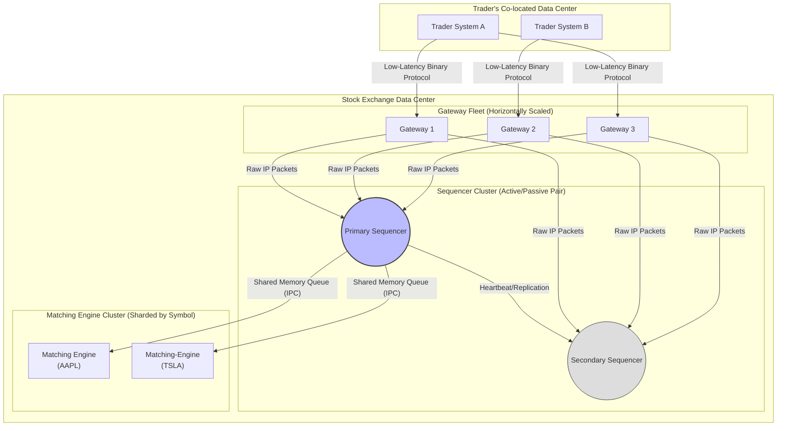
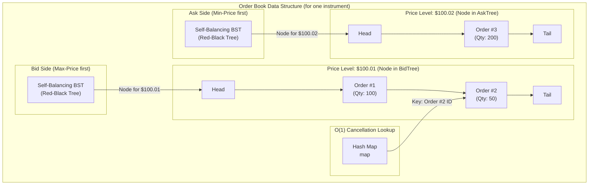
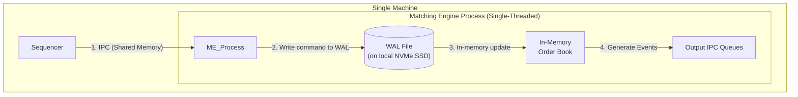

### **Case Study 3: Design a Stock Exchange (High-Consistency & Low Latency)**

The system design interview is an exercise in applied engineering philosophy. As we established in the main guide, most prompts you will encounter ("Design Twitter," "Design Netflix") are battles against **horizontal scale**. They are problems of managing massive user bases and petabytes of data distributed globally, where eventual consistency is not only acceptable but often desirable for maintaining availability.

This problem is different.

"Design a Stock Exchange" is a battle against **time itself**. It is a system governed not by the convenience of eventual consistency but by the brutal, non-negotiable requirements of fairness, deterministic order, and correctness, all measured in microseconds. A failure in this system isn't a stale 'like' count; it is a catastrophic loss of capital and a complete erosion of market trust.

This is not a web-scale problem; it is a machine-level problem. Forget what you know about scaling out fleets of stateless application servers. We are about to enter a world where a single, hyper-optimized, stateful process running on a single CPU core can be the most critical component in the entire architecture. An engineer who approaches this problem by immediately reaching for Cassandra or a fleet of RESTful microservices has already failed. They have revealed a fundamental misunderstanding of the problem's core constraints.

Let us now apply the methodical frameworks from our guide to deconstruct this challenge correctly.

### **3.1. Problem Deconstruction & Scoping**

As we established in **Chapter 1: The Art of Scoping**, our first and most critical task is to take this ambiguous prompt and forge it into a concrete engineering contract. We must define what we are building (and more importantly, what we are not) before writing a single line of hypothetical code or drawing a single box.

#### **3.1.1. Core Functional Requirements: Accepting orders (buy/sell), matching trades, publishing market data.**

We will follow the framework laid out in **Chapter 1.1** by first identifying the Core Actors and their essential User Journeys to distill our V1 feature set.

**Core Actors:**

For a V1, our system has three primary actors:

1.  **The Trader (or Member Firm):** The entity submitting buy and sell orders. In reality, this is almost always a sophisticated automated system, not a human clicking a button.
2.  **The Market Data Subscriber:** An entity that consumes the public output of the exchange to make trading decisions.
3.  **The Regulator:** An entity that requires an immutable audit trail of all market activity.

**Core Journeys (V1):**

*   **Trader Journey:** I need to submit a buy or sell order for a specific stock at a specific price (or at market price). If my order cannot be immediately filled, it must rest on the order book. I need to be able to cancel an order that is still resting. When a trade executes, I must receive a definitive confirmation.
*   **Market Data Subscriber Journey:** I need a real-time feed of all trades as they happen. I also need to see the current state of the order book (the best available prices to buy and sell).

From these narratives, we can distill a precise list of V1 Functional Requirements.

**V1 Functional Requirements:**

1.  **Order Ingestion & Management:** The system *must* accept new trading orders for specific financial instruments (e.g., AAPL stock). For V1, we will support two fundamental order types:
    *   **Market Order:** An order to buy or sell immediately at the best available current price.
    *   **Limit Order:** An order to buy or sell at a specific price or better.
2.  **Order Cancellation:** A trader *must* be able to submit a request to cancel an active, unfilled limit order.
3.  **Trade Matching:** The system *must* match resting buy and sell orders for a specific financial instrument. This matching is not arbitrary; it must adhere to a strict, deterministic, and fair algorithm. The industry standard, and our choice, is **Price/Time Priority**:
    *   **Price Priority:** The highest bid (buy order) and the lowest ask (sell order) get precedence.
    *   **Time Priority:** If multiple orders exist at the best price, the one that arrived *first* gets precedence.
    This rule is the soul of the machine. It is non-negotiable.
4.  **Trade Execution Reporting:** Upon a successful match, the system *must* generate an immutable trade execution record containing, at a minimum: the instrument symbol, the trade price, the volume (number of shares), the timestamp, and identifiers for the buyer and seller.
5.  **Market Data Dissemination:** The system *must* publish two real-time data feeds to subscribers:
    *   **Trade Feed (Time and Sales):** A stream of all trade executions as they occur.
    *   **Order Book Feed (Market by Price):** A stream of updates to the aggregated order book, showing the current best bid and offer (BBO) and the volume of orders at each price level.

**The "Parking Lot" (Out of Scope for V1):**

As discussed in **Chapter 1.3**, defining what's out of scope is as important as defining what's in. This demonstrates focus and a pragmatic understanding of complexity.

1.  **Multiple Asset Classes:** V1 will handle equities (stocks) only. We will explicitly defer derivatives like options or futures, which have vastly more complex matching logic and lifecycle events.
2.  **Advanced Order Types:** We will not support `Stop Loss`, `Fill-or-Kill`, or other complex order types. For V1, order modification will be treated as a `Cancel + New Order` operation to simplify the matching engine's logic.
3.  **Short Selling & Margin Trading:** V1 assumes all traders have the cash or shares to cover their orders. We are not building the complex risk management and credit systems required for leveraged trading.
4.  **Pre-Market and After-Hours Sessions:** The V1 exchange operates only during standard market hours with a single set of trading rules.
5.  **Clearing and Settlement:** This is a critical distinction. Our system's responsibility ends when a trade execution is reported. The post-trade process of actually exchanging the cash and shares between the two parties (Clearing and Settlement) is a separate, complex domain, often handled by a central clearing house. We will defer this entirely.

We have now transformed the vague "Design a Stock Exchange" into a precise engineering contract. We are building a V1, equities-only matching engine with market and limit orders, operating on a strict price/time priority basis, and publishing real-time trade and order book data. All other complexity is explicitly deferred. This clear scope will now guide every subsequent architectural decision.

#### **3.1.2. Non-Functional Requirements: Ultra-Low Latency (microseconds), Fairness (Price/Time Priority), Extreme Reliability.**

In **Chapter 1.2** of the guide, we established the core "ilities" that shape an architecture. For a standard web service, these requirements often involve a balanced trade-off between competing interests. Here, there is no balance. The requirements for a stock exchange are an exercise in extremes. Failure to meet these NFRs is not a technical deficiency; it is a business-ending catastrophe. An engineer who says, "We'll aim for eventual consistency to improve availability," has failed this interview.

Let us be unequivocally clear. We are not designing a system where "fast enough" is acceptable. We are designing a system where every nanosecond of delay and every deviation from a deterministic path represents a potential loss of millions of dollars and a violation of market integrity. These are not aspirations; they are unforgiving laws that will dictate our entire architecture.

---

**Latency: The Battle for Microseconds**

*   **What it is:** For our purposes, latency is the end-to-end time it takes for an order to be processed. Specifically, we will measure from the moment the last byte of a client's network packet enters our system's edge to the moment the last byte of an execution report or acknowledgement is sent back. This is often called "wire-to-wire" latency.

*   **How to quantify it:** The latency targets for typical web systems discussed in **Chapter 1.2**, measured in milliseconds (ms), are irrelevant here. We are in the domain of high-frequency trading (HFT), where the unit of measure is the microsecond (µs).
    *   **Target:** For our V1, we will set a **P99 latency target under 100 microseconds (µs)** for a simple order acknowledgement and matching cycle. Top-tier exchanges aim for double-digit microsecond latencies.
    *   **Jitter:** The variance in latency is as important as the latency itself. Predictable performance is paramount.

*   **Architectural Impact:** This single requirement immediately invalidates 99% of common web-scale architectures.
    *   **Hardware & Network:** It mandates **co-location**, where member firms place their trading servers in the same physical data center as the exchange to eliminate network transit time. We will rely on dedicated, high-speed network switches, not a general-purpose cloud network. Protocols will not be HTTP/gRPC; they will be custom, lightweight binary protocols running over raw TCP or even UDP with application-level recovery, optimized for minimal serialization overhead. We must consider kernel-bypass networking to avoid the overhead of the operating system's network stack.
    *   **Software & Compute:** Garbage-collected languages like Java or Go introduce unpredictable GC pauses and are generally unsuitable for the core matching engine. We are forced into languages with explicit memory management like **C++ or Rust**. The application must be designed for **mechanical sympathy**—structured to take advantage of how the underlying CPU and memory hierarchy works, ensuring data resides in L1/L2 caches to avoid slow main memory access.

---

**Fairness & Determinism: The Mandate for Order (A Stricter Consistency)**

*   **What it is:** This NFR is an extreme manifestation of the **Consistency** principle from **Chapter 9**. "Fairness" here is not a vague ethical goal; it is a precise, algorithmic mandate. The Price/Time Priority rule means that if two orders arrive, we must have an undeniable, deterministic, and verifiable way to know which one arrived *first*. There can be no ambiguity. The entire market must operate on a single, shared, totally-ordered sequence of events.

*   **How to quantify it:** This is a binary requirement. It must be 100% correct, 100% of the time. The system must be fully **deterministic**: given the same sequence of inputs, it must produce the exact same sequence of outputs, every single time.

*   **Architectural Impact:** This is the most profound architectural constraint. It directly informs our choice on the CAP Theorem spectrum (**Chapter 9.1**). We are not just a CP system; we are a system that worships at the altar of C.
    *   It **forbids** a typical distributed consensus model (like Paxos or Raft) for the critical matching path. The latency of a multi-round-trip consensus protocol is orders of magnitude too slow.
    *   It forces us to **single-thread the matching logic for a given instrument**. To guarantee a total order, all operations for the stock 'AAPL' must be processed sequentially by a single process on a single CPU core. This avoids the non-determinism of multi-threaded race conditions and lock contention entirely.
    *   This, in turn, mandates a critical upstream component: an **Order Gateway and Sequencer**. We must first establish the "correct" order of all incoming requests *before* feeding them into our single-threaded matching engine.

---

**Reliability: Correctness Above All**

*   **What it is:** Reliability is a combination of Availability and data integrity. As discussed in **Chapter 1.2**, Availability is typically measured in "nines." However, for a stock exchange, a subtle but critical distinction exists: an outage (loss of availability) is vastly preferable to an incorrect or inconsistent state. A few minutes of downtime is a problem; a single incorrect trade is a potential market-destroying crisis.

*   **How to quantify it:**
    *   **Availability:** We will target **99.999% ("five nines")** availability during market hours. This translates to just over 5 minutes of permissible downtime *per year*.
    *   **Integrity:** 100%. Zero incorrect trades.

*   **Architectural Impact:**
    *   Our **CAP Theorem** choice is cemented. We are a **CP** system. If a network partition or other failure prevents us from guaranteeing a consistent state, we must halt trading for the affected instruments.
    *   **Failover Strategy:** Because the matching engine for an instrument is a stateful, single-threaded process, we cannot simply use a stateless load-balanced fleet. Our resiliency strategy must involve a **hot/warm stateful replication model**. A secondary matching engine process must be kept in lockstep with the primary, ready to take over instantly upon failure. This requires a deterministic replication mechanism, which leads directly to our next requirement.

---

**Durability: The Immutable Record**

*   **What it is:** As defined in **Chapter 1.2**, durability is the guarantee that once an operation is acknowledged, the data will not be lost. For our exchange, every received order and every executed trade must be stored in an immutable audit trail for regulatory and recovery purposes.

*   **How to quantify it:** We require **zero data loss**. Every message acknowledged by our gateway *must* be persisted permanently.

*   **Architectural Impact:**
    *   We cannot afford the latency of writing to a traditional relational database on the critical path of an order. The time to acquire a lock and wait for a `COMMIT` is far too long.
    *   This forces the adoption of the **Write-Ahead Log (WAL) pattern**, as described in **Chapter 10.1**. Before an order is even considered for matching, it must first be written to a durable, sequential log. This log serves two purposes:
        1.  It is the durable, immutable audit trail for regulators.
        2.  It is the replication mechanism that allows our secondary failover matching engine to reconstruct its state and take over in a perfectly consistent manner.

These four non-functional requirements, when taken together, paint a very clear architectural picture. We are forced to design a system with a hyper-optimized, single-threaded core, fronted by a sequencer, and backed by a high-speed Write-Ahead Log for durability and replication. This is the skeleton of our machine. Every component we design next must serve these uncompromising masters.

### **3.2. The Architectural Crux: Guaranteeing Ordered, Deterministic Processing**

We have established a set of non-functional requirements that are extreme and unforgiving. Latency must be measured in microseconds, and fairness is an absolute, algorithmic mandate. An engineer accustomed to web-scale architectures might look at these constraints and think, "How can we process the load from thousands of traders in parallel?"

This is a trap. It is the wrong question.

The right question, forced upon us by the NFR of **Fairness (Price/Time Priority)**, is: "How do we create a single, unimpeachable, totally-ordered reality for every trading event?"

The answer to this question is the architectural crux of the entire system. It dictates the shape of our core components and immediately invalidates most conventional distributed system patterns. As we discussed in **Chapter 9: Mastering Consistency**, distributed systems are a study in trade-offs. Here, the trade-off is made for us: we sacrifice parallelism at the core of our system on the altar of absolute, deterministic order.

---

#### **The Inevitable Conclusion: The Single-Threaded Matching Engine**

To guarantee that Price/Time priority is perfectly and fairly enforced, the business logic that matches orders for a single financial instrument (e.g., AAPL) must be executed sequentially. There is no other way. Therefore, the core of our system, the **Matching Engine** for a given instrument, will be a **single-threaded process, pinned to a single CPU core.**

This statement should feel jarring. It runs counter to every modern instinct to scale out horizontally. But it is a logical necessity born from our NFRs. Let us be precise about why.

**1. Eliminating Non-Determinism:**

A multi-threaded application is a garden of pathological non-determinism. Two threads executing at the same time are subject to:
*   **Race Conditions & Lock Contention:** If two threads try to modify the same order book simultaneously, you need locks. The order in which those threads acquire the lock is not guaranteed. It can be affected by minuscule network variations or OS scheduler whims. This is a source of ambiguity, and ambiguity is forbidden.
*   **OS Scheduler Decisions:** The operating system's thread scheduler decides when threads run. This process is inherently non-deterministic.
*   **CPU Cache Effects:** The timing of memory access can vary depending on whether data is in the CPU's L1, L2, or L3 cache. In a multi-threaded program, one thread's operations can evict the cache lines needed by another, creating unpredictable performance jitter.

A single-threaded model eliminates all of this. Given an ordered stream of input commands (`New Order A`, `New Order B`, `Cancel Order C`), a single-threaded process will *always* produce the exact same sequence of state changes and output trades. It is deterministic by design.

**2. Achieving Predictable Microsecond Latency:**

While it seems counter-intuitive, for the ultra-low latency operations inside a matching engine, a single-threaded model is often *faster* than a multi-threaded one. Multi-threading introduces overhead:
*   **Locking Overhead:** Acquiring and releasing locks takes CPU cycles.
*   **Context Switching:** When the OS switches between threads, there is a significant performance penalty.

A single-threaded application written with **mechanical sympathy**—code that is aware of and leverages the underlying hardware—can ensure that the entire order book for an instrument and the core matching logic live within the CPU's fastest caches (L1/L2). Every operation is a straight-line execution path with no branches, no locks, and no waiting. This is how sub-microsecond internal processing times are achieved. It's not a web service; it is a Formula 1 engine, optimized for a single, perfect lap.

---

#### **Why Common Distributed Patterns Fail Here**

This is a critical moment to revisit **Chapter 1.4: The Monolith First**. In that chapter, we argued for a monolith for simplicity and speed of iteration. Here, we argue for a monolithic *process* for correctness and raw performance. Let's explicitly consider and reject a "modern" microservices approach for the matching logic:

*   **Hypothetical (Incorrect) Design:** An `Order Service` receives orders and puts them on a Kafka topic. A fleet of horizontally-scaled `Matching Service` instances consumes from this topic to match trades.

*   **Why It Fails:**
    1.  **Ordering is Lost:** A standard Kafka topic with multiple partitions provides no total ordering guarantee. A message for Order A might land on Partition 1 and a message for Order B might land on Partition 2. The consumers for these partitions will process them in parallel, with no way to know which order *truly* arrived first at the gateway. Time priority is violated. (You could use a single-partition topic, but then you've just reinvented a slow, single-threaded queue).
    2.  **Latency is Unacceptable:** The round trip of serializing an order, producing it to Kafka over the network, having a broker commit it, and having a consumer fetch it adds *milliseconds* of latency. This is orders of magnitude too slow for our P99 target of <100µs.
    3.  **State Management is a Nightmare:** The core of a matching engine is a highly complex, stateful data structure: the order book. Trying to share this state across a fleet of stateless microservices would require a central cache (like Redis), introducing yet another network hop and a massive performance bottleneck.

---

#### **The Architectural Consequence: The Sequencer**

We have established that our core matching logic for `AAPL` stock must be a single, stateful, lightning-fast process. But this creates a new problem: that single process cannot possibly handle the overhead of managing thousands of simultaneous TCP connections from every trading firm in the world.

Therefore, we are logically forced to introduce an upstream component with a single responsibility: **to establish the definitive, total order of all incoming requests before they reach the matching engine.** This is the **Order Sequencer** (often part of a larger component called an Order Gateway).

The new, clarified flow is:
1.  Thousands of traders send their orders to a fleet of simple **Gateway** processes.
2.  These Gateways handle the raw network connections. Their only job is to timestamp the requests with high precision and forward them to a central **Sequencer**.
3.  The **Sequencer** is the component that linearizes all these concurrent requests into a single, ordered, gapless stream of inputs.
4.  This single, ordered stream is then fed directly into the **single-threaded Matching Engine**.

We have successfully partitioned the problem. We use horizontal scaling for the "dumb" work of managing network connections at the edge, and we use a centralized, single-threaded approach for the "smart" work of deterministic matching at the core. This entire architecture is a direct, logical consequence of our non-functional requirements.

### **3.3. High-Level Architecture & Component Deep Dive**

We have established the core constraint: the matching logic for a given instrument must be a single-threaded, deterministic process. This decision cascades through our entire architecture, forcing us to design a system that can safely and fairly feed this high-performance core.

Let's begin by visualizing the high-level flow of an order from the trader's system to our matching engine. This diagram shows the journey and the key components we will now dissect.



**Diagram Walkthrough:**

1.  **Traders:** Multiple trader systems reside in a co-located data center, ensuring minimal network distance.
2.  **Gateways:** The traders connect to a horizontally scalable fleet of stateless Gateway servers. These handle the high volume of client connections.
3.  **Sequencer:** All Gateways forward raw message traffic to *both* the Primary and Secondary Sequencers. The Primary Sequencer is active and is the only one communicating with the Matching Engines. The Secondary is a passive, hot standby.
4.  **Sequencer to Matching Engine:** The active Sequencer processes the messages and, based on the trading symbol, places them into the correct in-memory queue for the appropriate Matching Engine. This communication link is hyper-optimized using Inter-Process Communication (IPC).
5.  **Matching Engines:** Each matching engine is a separate process, responsible for a distinct set of trading symbols (e.g., sharded by symbol), processing its input queue single-threadedly.

Now, we will perform a deep dive on each component in this critical path.

---

### **3.3.1. Order Gateway & Sequencer: Ensuring a fair, total order of incoming requests.**

The partnership between the Order Gateways and the Sequencer forms the system's "reception area." Their combined mission is to transform the chaotic, concurrent storm of incoming requests from thousands of clients into a single, clean, verifiable line for each matching engine.

#### **Component 1: The Order Gateway Fleet**

A common mistake is to conflate the role of the Gateway and the Sequencer. They are distinct, with separate responsibilities. The Gateways are the system's muscle; the Sequencer is its brain. The single responsibility of a Gateway is **connection management and stateless pre-validation.**

*   **Network Protocol Termination:** Gateways listen for client connections. This is not REST over HTTP. That protocol is bloated and far too slow. The standard is a custom, highly efficient binary protocol (like FIX - Financial Information eXchange, or a proprietary one) over raw TCP. The Gateway's job is to manage the state of these thousands of TCP sessions.
*   **Session Management & Authentication:** Before accepting trading messages, a trader's system must establish a session with the Gateway (a `LOGON` message). The Gateway validates the trader's credentials against a central store, authenticating them as a valid member firm.
*   **Stateless Validation:** For each incoming message, the Gateway performs a series of cheap, stateless checks:
    *   Is the message format syntactically correct?
    *   Does the `instrument_symbol` field contain a tradeable symbol?
    *   Is the message size within acceptable limits?
    The goal is to reject malformed or "garbage" requests at the earliest possible moment, preventing them from consuming downstream resources.
*   **High-Precision Timestamping:** At the very instant a packet arrives at the Gateway's network interface card (NIC), it must be timestamped. This is not done using the server's system clock, which can drift. It's done using specialized hardware and protocols like **Precision Time Protocol (PTP)** that synchronize clocks across the data center to nanosecond accuracy. This initial timestamp is a critical piece of evidence for audit trails.
*   **Forwarding, Not Processing:** After these checks, the Gateway does *not* interpret the business logic of the message. It wraps the raw message and its high-precision timestamp into a standard internal format and forwards it immediately to the central Sequencer.

The Gateways are stateless and horizontally scalable. If we need to support more client connections, we simply add more Gateway servers to the fleet. This is the only part of our core system where the principles of horizontal scaling from **Chapter 4.3 (Load Balancing)** apply directly.

#### **Component 2: The Sequencer**

The Sequencer has one of the most important jobs in the entire system: **to create a single, deterministic, totally ordered stream of inputs.** It is the sole arbiter of "Time Priority." Whatever order the Sequencer dictates *is* the official market order, by definition.

*   **Single Point of Ingress:** To achieve a total order, all messages must pass through a single logical point. Our architecture directs all Gateways to a single, active **Primary Sequencer**.
*   **The Race Condition:** The Gateways forward their messages to the Sequencer over a high-speed network. Even over a few feet of fiber, tiny variations mean that messages from different gateways arrive concurrently. The Sequencer's fundamental job is to read these packets from its network buffer one by one, in the order they arrive. The first complete message read from the buffer is assigned `sequence_number: 1`, the next is `sequence_number: 2`, and so on. This sequence number becomes the immutable ground truth for the order of events.
*   **Communication with Matching Engines:** How does this ordered stream get to the matching engines? As established in **Section 3.2**, a network hop like Kafka or even gRPC is far too slow. The Sequencer and the Matching Engines must run on the **same physical machine**. Communication is achieved via **Inter-Process Communication (IPC)**, specifically using a **shared memory ring buffer** (a high-performance queue like those provided by libraries like Aeron or built custom).
    *   **Introducing IPC:** IPC allows two separate processes on the same machine to exchange data by writing to and reading from a shared region of RAM. This completely bypasses the network stack and the overhead of the operating system's kernel, reducing communication latency from milliseconds to mere nanoseconds. The Sequencer writes the sequenced messages into this ring buffer, and the Matching Engine's thread spins, constantly polling for the next message to appear.
*   **Demultiplexing:** The Sequencer reads the `instrument_symbol` from each message and places it onto the correct shared memory queue for the appropriate matching engine. An order for `AAPL` goes into the `AAPL` queue; an order for `TSLA` goes into the `TSLA` queue.

#### **Resiliency and Failover**

A single, active Sequencer represents a critical Single Point of Failure (SPOF). This contradicts our NFR of 99.999% availability. Therefore, as shown in the diagram, the Sequencer must be designed as a redundant, **Active/Passive (or Hot/Warm) pair**.

*   **Mechanism:**
    1.  All Gateway servers send their messages simultaneously to *both* the Primary and Secondary Sequencers.
    2.  The **Primary Sequencer** is "Active": it performs the sequencing logic and writes the ordered stream to the IPC queues for the Matching Engines.
    3.  The **Secondary Sequencer** is "Passive": it receives the exact same input stream and performs the exact same sequencing logic internally, but it *does not* write to the output queues. It is a silent, perfectly synchronized clone, aware of what the state *should* be.
    4.  The Primary constantly sends a high-frequency heartbeat signal to the Secondary.
*   **Failover Process:** If the Secondary fails to receive a heartbeat for a predefined, tiny window (a few hundred microseconds), it assumes the Primary has failed. It instantly promotes itself to Active, enables its writes to the shared memory queues, and the system continues. This provides failover with minimal interruption, a core pattern for meeting extreme availability targets as discussed in **Chapter 8**.

The design of this gateway-sequencer layer is a masterclass in separating concerns under extreme constraints. We use scalable, parallel processing at the edge to handle the messy work of client connectivity, then funnel everything into a hyper-optimized, single-file line to prepare it for the deterministic core of our system: the matching engine.

### **3.3.2. The Matching Engine: Core logic for executing trades.**

We have followed the path of an order through the stateless, scalable Gateway fleet and the centralized, ordering-obsessed Sequencer. The order, now stamped with an immutable sequence number, has arrived via a near-instantaneous shared memory queue. It is now at the door of the most critical component of the entire system: the **Matching Engine**.

This is the heart of the exchange. It is a stateful, in-memory, single-threaded marvel of performance engineering. It is not a "service" in the web-scale sense; it is more akin to a video game engine or a database kernel. Its design is a pure and direct expression of our extreme Non-Functional Requirements.

#### **Core Responsibilities**

The Matching Engine has a deceptively simple set of responsibilities, which it must execute with blistering speed and perfect accuracy:

1.  **Consume Sequenced Input:** It runs an infinite loop, pulling one message at a time from its designated input queue (the shared memory ring buffer). This is its only source of commands.
2.  **Maintain the Order Book:** It holds the entire live state of the market for its assigned instrument(s) in memory. This is the **Order Book**, a precise data structure representing all resting buy and sell orders.
3.  **Execute the Matching Logic:** It applies the incoming command to the state of the order book. This is where Price/Time Priority is implemented.
4.  **Generate Output Events:** Upon any state change (a new order resting on the book, a trade execution), it generates one or more output messages, which it places on output queues to be consumed by other systems.

---

#### **Deep Dive: The Order Book Data Structure**

We cannot talk about a matching engine without dissecting its core data structure. As established in **Chapter 5 (The Database Decision Tree)**, you must choose the right tool for the job. Here, the "database" is not PostgreSQL or Cassandra; it is a custom, in-memory data structure meticulously designed for this one specific task. An engineer who just says "we'll use a hash map" has not thought deeply enough.

The Order Book consists of two distinct sides:

*   **The Bid Side:** A collection of all buy orders, sorted with the highest price first (best bid).
*   **The Ask Side:** A collection of all sell orders, sorted with the lowest price first (best ask).

Within each price level, orders are sorted by time of arrival—first-in, first-out (FIFO). This directly implements Price/Time Priority.

The choice of the underlying data structures for the Bid and Ask sides is a critical micro-architectural decision. Let's analyze the trade-offs:

*   **Option 1: Two Priority Queues (Heaps).** A max-heap for bids and a min-heap for asks would give us `O(1)` access to the best price. This seems appealing. **This is an inefficient choice.** Why? A heap gives us fast access to the *top* element, but our functional requirements include **Order Cancellation**. Finding and removing an arbitrary order from the middle of a heap is an `O(n)` operation, which is unacceptably slow.
*   **Option 2: Two Self-Balancing Binary Search Trees.** Using a data structure like a Red-Black Tree or an AVL tree, where price levels are the nodes, is a far superior choice.
    *   **Performance:** Finding the best price, adding a new price level, and removing a price level are all efficient `O(log n)` operations.
    *   **Structure:** Each node in the tree would represent a price level and contain a FIFO queue (e.g., a simple linked list) of all the orders at that price.
*   **Option 3 (Hybrid - The Professional Choice):** We use the two balanced BSTs as described above. Additionally, to handle cancellations efficiently (`O(1)`), we maintain a separate **Hash Map** that maps `order_id` to a direct pointer to the order object within its linked list inside the tree. When a `CancelOrder` message arrives, we perform a hash lookup to find the order instantly and remove it from its list.

This hybrid approach gives us the best of all worlds: fast lookup for the best prices, efficient updates to the book's structure, and instantaneous access to any order by its ID.

---

#### **Deep Dive: The Matching Algorithm (The Main Loop)**

Let's walk through the engine's core processing loop when it receives a `NewLimitOrder` command for a buyer.

```
// Pseudocode for the Matching Engine's main loop
while (true) {
    Command command = input_queue.blockingRead();

    if (command.type == NewBuyOrder) {
        // Repeatedly try to match against the Ask side of the book
        while (command.quantity > 0 && askBook.isNotEmpty() && command.price >= askBook.getBestAsk().price) {
            
            RestingSellOrder bestOffer = askBook.getBestAsk();
            
            // Determine trade quantity and price
            long tradeQuantity = min(command.quantity, bestOffer.quantity);
            long tradePrice = bestOffer.price; // Trade executes at the price of the resting order
            
            // 1. Generate Trade Execution Reports
            generateTradeEvent(command.orderId, bestOffer.orderId, tradeQuantity, tradePrice);
            generateBookUpdateEvent(bestOffer.orderId, -tradeQuantity); // Remove matched qty
            
            // 2. Update state of the two matched orders
            command.quantity -= tradeQuantity;
            bestOffer.quantity -= tradeQuantity;
            
            // 3. If the resting order is fully filled, remove it from the book
            if (bestOffer.quantity == 0) {
                askBook.remove(bestOffer);
            }
        }
        
        // 4. If the incoming order still has quantity, it must rest on the book
        if (command.quantity > 0) {
            bidBook.add(command);
            generateBookUpdateEvent(command.orderId, command.quantity); // Add new order to book
        }

    } else if (command.type == CancelOrder) {
        // Use the hash map for O(1) lookup
        Order orderToCancel = orderMap.get(command.orderId);
        if (orderToCancel != null) {
            // Remove from the appropriate tree (bid or ask)
            removeOrderFromBook(orderToCancel);
            generateBookUpdateEvent(command.orderId, 0); // Announce cancellation
            orderMap.remove(command.orderId);
        }
    }
}
```

This logic is deterministic. Given the same initial order book state and the same input command, it will *always* produce the same trades and the same final state.

---

#### **Deep Dive: Performance & The Philosophy of Mechanical Sympathy**

To achieve the required microsecond-level performance, the C++ or Rust code implementing this logic cannot be written like a typical web service. It must be written with **Mechanical Sympathy**, a term coined by race car driver Jackie Stewart and popularized in programming by Martin Thompson. It means having an intimate understanding of the underlying hardware—the CPU, its caches, and the memory bus—and structuring your code to work *with* its strengths, not against them.

*   **Cache Locality is King:** The entire order book data structure for a hot instrument like AAPL must be small enough to fit inside the CPU's L1 or L2 cache (which are measured in kilobytes or a few megabytes). A "cache miss"—where the CPU has to fetch data from main memory—can be 100x slower than a cache hit. This means using compact data structures and avoiding pointers that jump all over memory.
*   **Zero Heap Allocations in the Hot Path:** In the main matching loop, there should be *zero* calls to `new` or `malloc`. Memory for new orders should be pre-allocated from an object pool. This completely avoids the overhead and non-determinism of calls to the system's memory allocator.
*   **Predictable Code Paths:** Modern CPUs are pipelined and use branch prediction to speculatively execute code. A mispredicted branch (`if/else`) can flush the entire pipeline, costing dozens of clock cycles. Code should be structured with as few data-dependent branches as possible.

This level of optimization demonstrates a profound understanding that goes beyond high-level system diagrams. It proves you understand how to build systems where performance is not a feature but the central design constraint.

### **3.3.3. Market Data Disseminator: Broadcasting trade executions to the public.**

The Matching Engine is a silent workhorse. It processes commands and generates events, but it has no direct voice to the outside world. To add this voice would be to burden it with the messy, high-overhead work of network I/O and client management, a direct violation of the single responsibility principle and a threat to its microsecond-level performance.

Therefore, we must introduce a specialized component whose sole purpose is to serve as the exchange's "town crier": the **Market Data Disseminator**. This service consumes the raw, hyper-speed output of the matching engines and broadcasts it to thousands of public subscribers with maximum speed and fairness.

Its mission is to provide the data that powers every other trading decision in the market. Its performance is not an internal metric; it is a direct contributor to the perceived fairness and quality of the entire exchange.

#### **Core Responsibilities & Data Feeds**

The Market Data Disseminator consumes output events from the matching engines via dedicated, one-way shared memory IPC queues. It then transforms these internal events into a public data feed format and broadcasts them. As per our functional requirements, it provides two primary feeds:

1.  **Trade Feed (Time and Sales):** A stream of every executed trade. Each message contains the symbol, price, quantity, and a high-precision timestamp.
2.  **Order Book Feed:** A stream of events representing every change to the visible order book. This is *not* a snapshot of the entire book every time. To conserve bandwidth, it is a stream of deltas: `NewOrderAdded`, `OrderPartiallyFilled`, `OrderCancelled`, `OrderFullyFilled`. Subscribers are responsible for ingesting this delta stream to reconstruct their own live copy of the book.

---

#### **The Architectural Bottleneck: Fan-Out & Fairness**

The core challenge here is **fan-out**. A single trade execution event for `AAPL` must be delivered to thousands of subscribers simultaneously. A naive engineer, drawing on experience from the web-scale systems in our guide, might reach for a familiar pattern. Let us analyze why this would be a catastrophic mistake.

**The (Wrong) Web-Scale Approach: Unicast TCP**

The typical approach would be for the Disseminator to maintain a TCP connection to every subscriber. When a trade happens, it would iterate through its list of N subscribers and perform N separate `write()` calls to send the data.

**Why this architecture is unacceptable:**

1.  **Backpressure & Latency:** The Disseminator is now bottlenecked by the network write speed and the speed of the slowest consumer. If one subscriber's connection is slow (high TCP backpressure), it can cause the Disseminator's send buffer to fill up, slowing down delivery *for everyone else*. The core of our system is held hostage by its slowest client.
2.  **Unfairness:** The Nth subscriber on the list will receive the data significantly later than the first subscriber. This time delta, while perhaps only milliseconds, is a massive and exploitable advantage in the world of HFT. It violates the spirit of a fair and orderly market.
3.  **Scalability Failure:** The load on the Disseminator grows linearly with the number of subscribers. Doubling the subscribers doubles the CPU and network workload on the server. This is not a scalable design.

---

#### **The HFT Solution: IP Multicast and UDP**

The professional solution, universally adopted in this domain, is to use a network-level primitive designed for one-to-many communication: **IP Multicast**.

*   **Introducing IP Multicast:** Multicast is a networking protocol where a sender sends a single packet to a special "multicast group" IP address (from a reserved range, e.g., 224.0.0.0 to 239.255.255.255). Subscribers signal to their local network switches (using the **IGMP** protocol) that they are interested in receiving data for that group. The network hardware then takes over, efficiently replicating and forwarding that single packet to all interested subscribers.

*   **The Analogy:** If TCP is a one-to-one phone call, Multicast is a one-to-many radio broadcast. The radio station sends out its signal once. It doesn't know or care if 10 people or 10 million people are tuned in; its workload is the same. The network (the airwaves) handles the delivery.

**Why Multicast is the only logical choice for this problem:**

1.  **Ultra-Low Latency & No Backpressure:** The Disseminator service sends exactly *one* packet to the network for each event. The replication is handled by specialized hardware in the network switches. The server's work is `O(1)`, regardless of the number of subscribers.
2.  **Inherent Fairness:** All subscribers receive the packet at approximately the same time, limited only by the speed-of-light propagation through the network fabric. There is no "first" or "last" subscriber on a list.
3.  **Infinite Scalability (from the server's perspective):** Adding 1,000 more subscribers has *zero* performance impact on the Disseminator itself. The load is distributed across the network infrastructure.

---

#### **Designing a Reliable Multicast System**

Multicast is almost always implemented over **UDP**, not TCP. As discussed in **Chapter 8**, UDP is an unreliable, "fire-and-forget" protocol. It offers speed at the cost of guaranteed delivery; packets can be dropped by the network. We cannot have subscribers missing critical trade events.

Therefore, we must build a lightweight reliability layer on top of our multicast feed.

*   **The Protocol:**
    1.  **Sequenced Messages:** Every single packet sent by the Disseminator on the multicast feed will have a gapless, strictly increasing sequence number.
    2.  **Gap Detection:** Subscribers are responsible for tracking these sequence numbers. If a subscriber receives packet `1001` and then `1003`, it knows it has missed packet `1002`.
    3.  **Negative Acknowledgement (NACK):** Upon detecting a gap, the subscriber immediately opens a separate, point-to-point **TCP** connection to a different service: the **Re-transmission Server**. It sends a NACK request, e.g., "I missed packet `1002`."
    4.  **Re-transmission Server:** This is a simple request/response service that maintains a short-term buffer of all recently sent multicast packets. It services the TCP request by re-transmitting the specific missed packet to the client that requested it.

This design is a brilliant application of trade-offs. It keeps the primary, latency-sensitive data path (multicast) as fast and uncluttered as possible, while offloading the slower, exceptional work of error recovery to a completely separate channel.

---

#### **Resiliency & Architecture**

The Market Data Disseminator is a mission-critical component. It must be resilient. We apply the same **Active/Passive** pattern used for the Sequencer.

*   **Architecture:**
    1.  Two identical Disseminator processes (Primary and Secondary) run on separate machines.
    2.  *Both* processes connect to the output IPC queues of the matching engines and read the same event stream in lockstep.
    3.  Only the **Primary (Active)** Disseminator actually sends packets to the multicast group address. The Secondary does all the work but keeps its network socket muted.
    4.  A high-frequency heartbeat exists between the two. If the Primary fails, the Secondary unmutes its socket and instantly takes over the broadcast, ensuring a near-seamless failover for subscribers.

This design creates a robust, performant, fair, and scalable system for market data dissemination, directly addressing our extreme NFRs by selecting a technology (multicast) perfectly suited to the problem domain, while acknowledging and mitigating its inherent trade-offs (UDP's unreliability).

### **3.4. Data Model & Persistence Layer**

We now turn our attention from the flow of logic to the representation of state. In a stock exchange, the two most critical pieces of state are the live **Order Book** and the immutable **Ledger of Trades**.

The approach to managing this state is radically different from the systems we discuss in **Chapter 5** of the main guide. There, we talked about choosing between external database systems like SQL or NoSQL based on the consistency and query patterns required. Here, the latency NFR of <100µs makes any network call to an external database on the critical path an impossibility.

We are therefore forced to design our own persistence and data management strategy from first principles. The "database" for the live order book will not be a separate server; it will be a meticulously designed, in-memory data structure that lives and breathes inside the Matching Engine process itself. Persistence for this state will be achieved not through database `COMMIT`s, but through the **Write-Ahead Log (WAL)** pattern.

---

### **3.4.1. The Order Book Data Structure**

This section's title suggests using "In-Memory Priority Queues/Heaps," a suggestion a junior engineer might make based on a surface-level understanding of the problem. A senior engineer, however, must immediately identify this as a **fatally inefficient choice** and articulate precisely why. Our persona, Alexander, would view this as the first test of this deep dive.

The data structure representing the order book is the performance heart of the matching engine. Its design is not a matter of preference; it is a hard engineering problem with a clear set of operational requirements derived directly from our functional specs. It must provide hyper-efficient support for *all* of the following operations:

1.  **Add:** Add a new order to the book.
2.  **GetBest:** Get the best-priced order (highest bid, lowest ask).
3.  **RemoveBest:** Remove the best-priced order (after a full match).
4.  **RemoveArbitrary:** Remove any specific, resting order by its ID (for cancellation).
5.  **UpdateBest:** Modify the quantity of the best-priced order (after a partial match).

Let us now evaluate the common data structures against these requirements, keeping our microsecond budget in mind.

#### **Analysis of Naive Approaches**

*   **A Simple Priority Queue (Heap):** A heap is a natural first thought. A max-heap for bids would give us the highest bid in `O(1)` time. A min-heap for asks would give us the lowest ask in `O(1)` time. This beautifully satisfies our `GetBest` requirement. **However, it completely fails the `RemoveArbitrary` requirement.** Finding an order by its `order_id` in a heap requires a linear scan, an `O(n)` operation. To cancel a single order, we would have to traverse a potentially massive data structure, stalling the entire matching engine for an eternity. This is a non-starter.

#### **The Optimal Hybrid Model**

The only performant solution is a more sophisticated, hybrid data structure that combines the strengths of several primitives to satisfy all our operational requirements. The structure consists of three core parts:

1.  **Two Self-Balancing Binary Search Trees (BSTs):** One for the bid side, one for the ask side. We will use a structure like a Red-Black Tree.
    *   **Structure:** The *keys* of these trees are the **price levels**.
    *   **Benefit:** This gives us `O(log P)` time complexity for finding the best bid/ask (by traversing to the rightmost/leftmost node), adding new price levels, or removing empty ones (where P is the number of distinct price levels, which is far smaller than the number of orders N).

2.  **A FIFO Queue for Each Price Level:** The *value* stored at each node in our BST is not a single order, but a queue of all orders resting at that specific price. Since we must enforce **Time Priority**, a simple **doubly-linked list** is the perfect choice for this queue.
    *   **Structure:** Each node in the BST points to the head and tail of a linked list of `Order` objects.
    *   **Benefit:** Adding a new order to a price level is an `O(1)` append to the tail of the list. Matching an order is an `O(1)` removal from the head of the list.

3.  **A Master Hash Map for Cancellations:** To solve the cancellation problem, we maintain one master hash map for the entire order book.
    *   **Structure:** `map<order_id, pointer_to_order_object>`
    *   **Benefit:** When a `CancelOrder(id)` command arrives, we perform an `O(1)` lookup in this map. This gives us a direct memory pointer to the `Order` object within its doubly-linked list. Since we're using a *doubly*-linked list, we can use this pointer to remove the node from the list in `O(1)` time without traversing the list.

This hybrid model is the only design that meets all of our stringent performance requirements. It gives us logarithmic-time access to price levels and constant-time access for both matching and cancellation.

#### **Visualizing the Hybrid Order Book Structure**



**Diagram Walkthrough:**

1.  **Top Level:** The order book is conceptually split into a Bid side and an Ask side, each managed by its own BST. A central Hash Map provides fast lookup for all orders.
2.  **BSTs for Price:** The nodes of the `BidTree` and `AskTree` do not represent individual orders but entire price levels. These trees are sorted to allow for efficient `O(log P)` discovery of the best bid/ask.
3.  **Linked Lists for Time:** Each tree node points to the head of a doubly-linked list. This list contains all orders at that specific price, maintained in strict FIFO (First-In, First-Out) order to guarantee Time Priority.
4.  **Hash Map for Speed:** When a `Cancel Order #2` request comes in, the system doesn't traverse the tree or any lists. It performs a single `O(1)` lookup in the `HashMap` to get a direct pointer to the `Order #2` object. Using this pointer and the doubly-linked list's `prev`/`next` pointers, the object can be removed from the list in `O(1)`.

This is the level of detailed data structure design required for an interview of this nature. It demonstrates that you have moved beyond simply choosing an off-the-shelf database and are capable of building a high-performance state management engine from first principles, driven entirely by the system's non-functional requirements.

### **3.4.2. The Write-Ahead Log (WAL) for durability without sacrificing latency.**

We have designed a hyper-performant, in-memory order book. But "in-memory" is a synonym for "volatile." If the Matching Engine process crashes or the server loses power, the entire state of the market for that instrument vanishes into the ether. This is an unacceptable violation of our **Durability** and **Reliability** non-functional requirements.

The conventional solution, as discussed in **Chapter 5**, is to persist state to an external database. But as we have established, a network call to a database to `COMMIT` every state change would introduce *milliseconds* of latency, utterly destroying our microsecond budget. We are trapped between the need for speed and the need for safety.

The solution to this paradox is the **Write-Ahead Log (WAL) pattern**, which we introduced in **Chapter 10.1**. However, its application here is a specialized, high-performance variant that differs critically from a typical web-scale implementation.

---

#### **Rejecting the Conventional WAL: Why Kafka is the Wrong Tool for this Job**

In Chapter 10.1, we illustrated the WAL pattern using a distributed commit log like Apache Kafka. A junior engineer might suggest that here: "The Matching Engine will write events to a Kafka topic for durability."

My immediate response as an interviewer would be, "You have just failed the latency requirement by three orders of magnitude." Let's be precise about why that approach is unworkable:

*   **Network Latency:** A message must be serialized, sent over the network to a Kafka broker, committed by a quorum of brokers, and an acknowledgement returned. This is a multi-round-trip network operation that inherently takes milliseconds, not microseconds.
*   **Serialization Overhead:** Even with efficient formats like Protobuf, the process of serializing and deserializing data adds significant CPU cycles and latency.
*   **Garbage Collection Pauses:** Broker and client libraries written in managed languages like Java can introduce unpredictable GC pauses, violating our need for low jitter.
*   **Complexity vs. Need:** A distributed log like Kafka is designed to solve problems of massive horizontal scale and decoupling between globally distributed services. Our problem is providing durability for a *single process* on a *single machine* as fast as humanly possible. Using Kafka here is like using a freight train to deliver a letter to your next-door neighbor. It's the wrong tool, with the wrong performance characteristics.

---

#### **The HFT Solution: The Local, High-Speed Log File**

The correct implementation of the WAL for a matching engine is far simpler and more direct: it is an **append-only file on a very fast, local storage device.**

**The Precise Workflow:**

The flow of a command is now augmented with one critical, preliminary step.

1.  **Sequencer -> IPC:** The Sequencer places a command (`NewOrder`, `CancelOrder`) onto the shared memory IPC queue for the appropriate Matching Engine.
2.  **Matching Engine -> WAL (Write-Ahead):** The Matching Engine's single thread pulls the command from the queue. Its *very first action*, before any state in the in-memory order book is mutated, is to serialize the raw command into a compact binary format and append it to its local WAL file.
3.  **The `fsync` Lie (Critical Trade-off):** Simply writing to a file is not enough; the write may linger in the operating system's page cache. To guarantee it's on disk, a process must call `fsync()`. However, `fsync` is a notoriously slow, blocking system call. For maximum performance, the engine may batch writes and call `fsync` periodically or on a separate I/O thread, making a deliberate trade-off between the absolute durability of every message and throughput. The details of this `fsync` strategy are a deep topic, but a senior engineer must be aware of the trade-off. For our design, we will assume we `fsync` after a small batch of writes.
4.  **Matching Engine -> In-Memory State:** Only after the command is durably persisted to the WAL does the engine apply the logic to the in-memory order book, potentially generating trade events.

This workflow is visualized below.



---

#### **The Dual Purpose of the WAL: Durability and Replication**

This simple log file is now the linchpin of our entire reliability strategy. It solves two monumental problems with one elegant mechanism.

**1. Crash Recovery (Durability)**

If the Matching Engine server crashes and reboots, how do we reconstruct the state of the order book? We do not need a complex external database backup. The recovery process is simple and deterministic:

*   **Load Snapshot:** To avoid replaying a potentially gigabyte-sized log from the beginning of time, the engine periodically writes a complete snapshot of its in-memory order book to disk.
*   **Replay Log:** Upon startup, the engine loads the most recent snapshot into memory. It then finds that snapshot's position in the WAL and replays only the log entries that have occurred *since* that snapshot.
*   **Ready to Trade:** Within seconds, the in-memory order book has been perfectly reconstructed to its exact pre-crash state, and the engine can resume processing new commands.

**2. Stateful Replication (Resiliency)**

As established in **Section 3.2**, we require a hot standby Matching Engine to meet our "five nines" availability target. How does the passive standby stay perfectly synchronized with the active primary? It uses the WAL as its replication stream.

*   **The Standby Tailing the Log:** The standby Matching Engine process does not receive commands from the Sequencer. Instead, its sole job is to `tail` the primary's WAL file as it's being written. This can be done via a highly optimized, low-latency network replication protocol or by having both machines connected to the same high-speed Storage Area Network (SAN).
*   **Deterministic State Machine:** For every entry the primary writes to its log, the standby reads that same entry and applies the identical logic to its own in-memory copy of the order book. Because the input stream (the WAL) is identical and the processing logic is single-threaded and deterministic, the standby's state will always be a mirror image of the primary's, lagging by only a few microseconds.
*   **Instant Failover:** If the primary Matching Engine fails, a cluster manager detects the failure. The failover is simple: the Sequencer is re-configured to start writing to the standby's input queue, and the standby is promoted to active. No state is lost. No recovery is needed. The new primary is already 100% up-to-date and ready to go.

The WAL is not just a file. It is the architectural primitive that unlocks durability without sacrificing latency and enables a simple, deterministic, and lightning-fast high-availability strategy. It is the perfect example of solving a complex distributed systems problem with a simple, hardware-aware, local-first solution.
