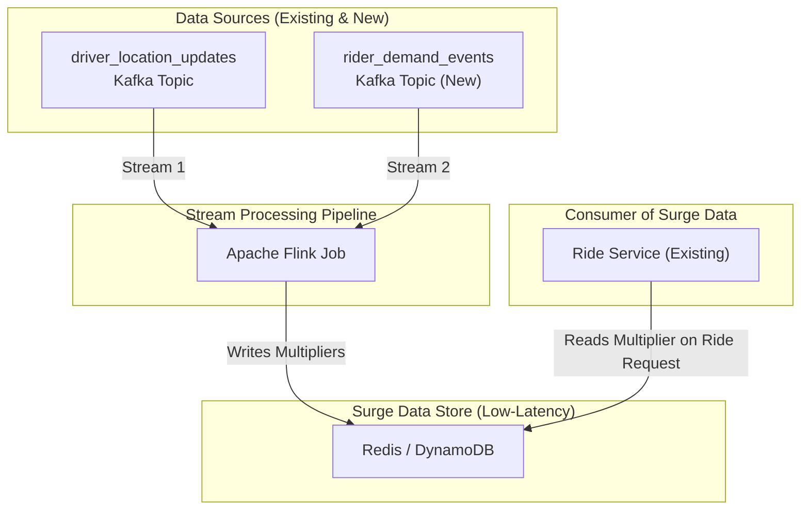

Hello world

```mermaid
graph TD;
    A-->B;
    A-->C;
    B-->D;
    C-->D;
```
alskjdalkjfglakjsd

```mermaid
graph TD
    subgraph "Data Sources (Existing & New)"
        direction LR
        DriverUpdates["driver_location_updates <br> Kafka Topic"]
        RiderDemand["rider_demand_events <br> Kafka Topic (New)"]
    end
    
    subgraph "Stream Processing Pipeline"
        FlinkApp[Apache Flink Job]
    end

    subgraph "Consumer of Surge Data"
        RideService["Ride Service (Existing)"]
    end
    
    subgraph "Surge Data Store (Low-Latency)"
        Redis["Redis / DynamoDB"]
    end

    DriverUpdates -- "Stream 1" --> FlinkApp
    RiderDemand -- "Stream 2" --> FlinkApp
    FlinkApp -- "Writes Multipliers" --> Redis
    RideService -- "Reads Multiplier on Ride Request" --> Redis
```
